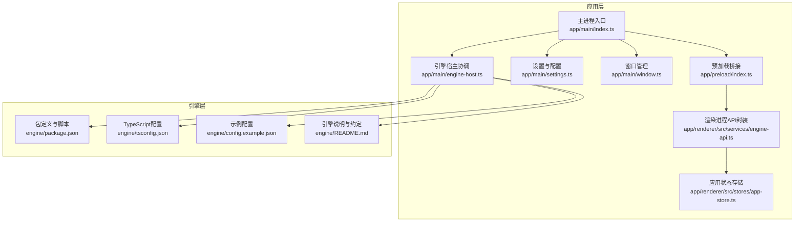
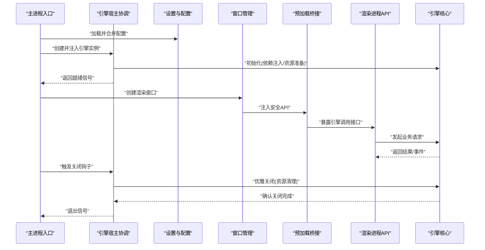
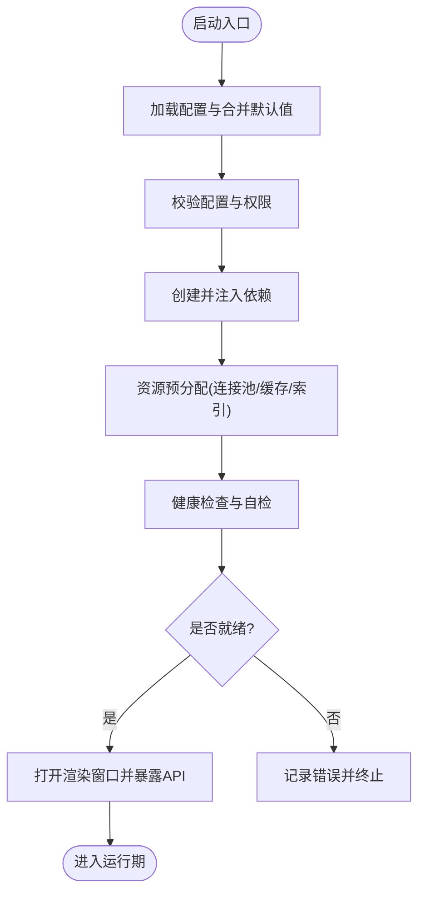
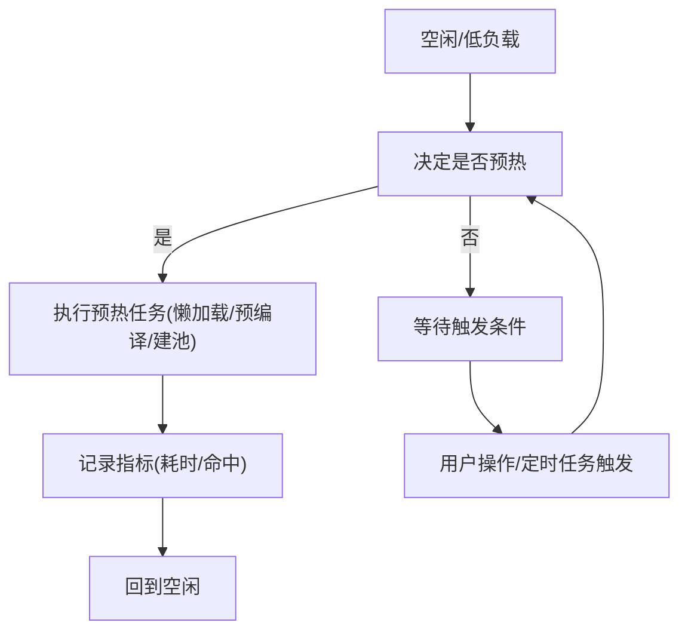
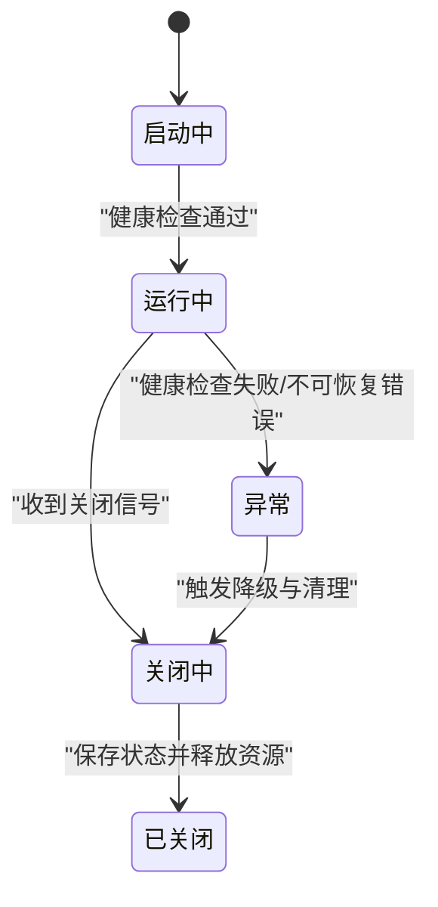
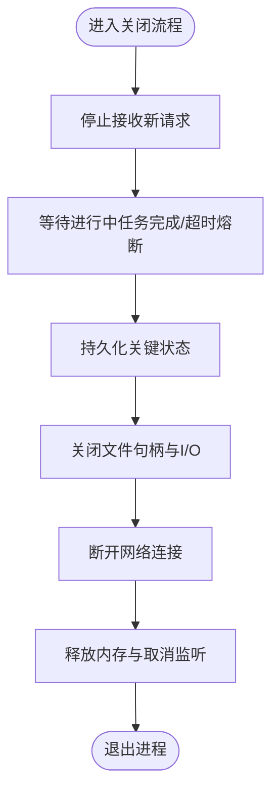
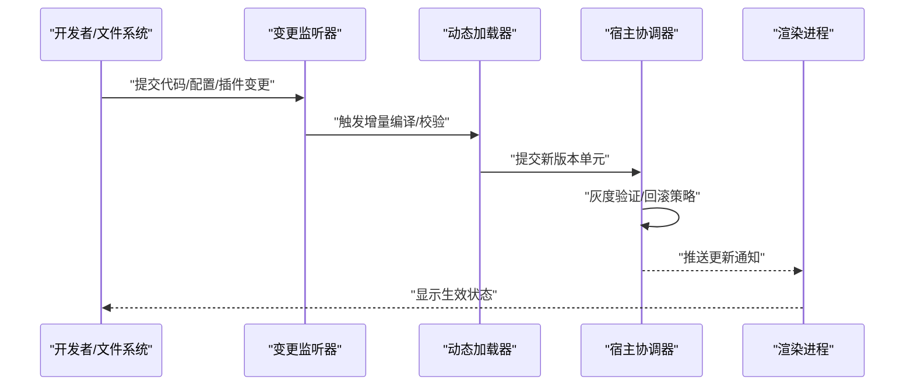
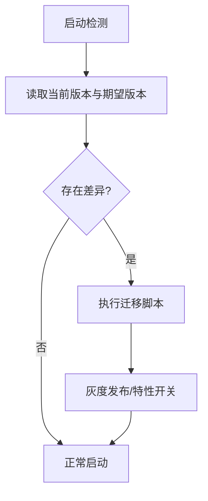
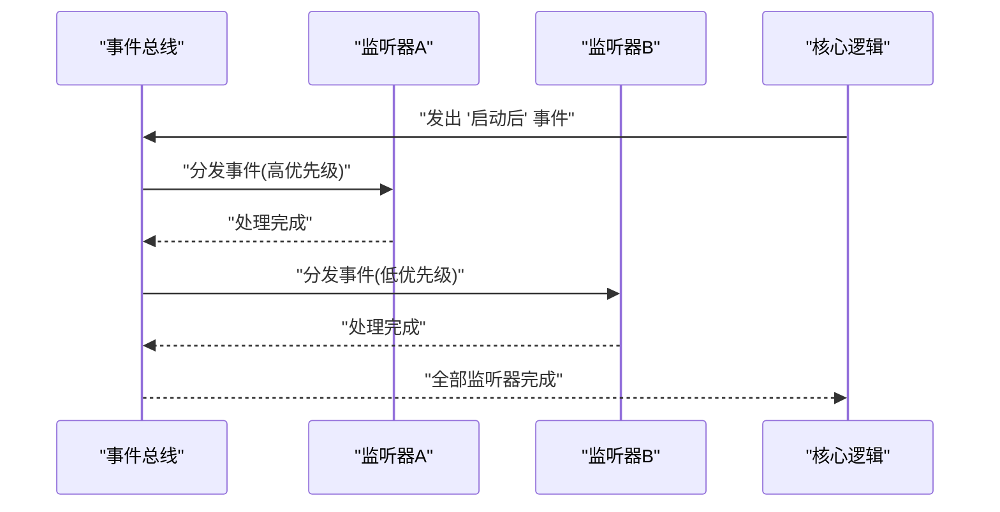
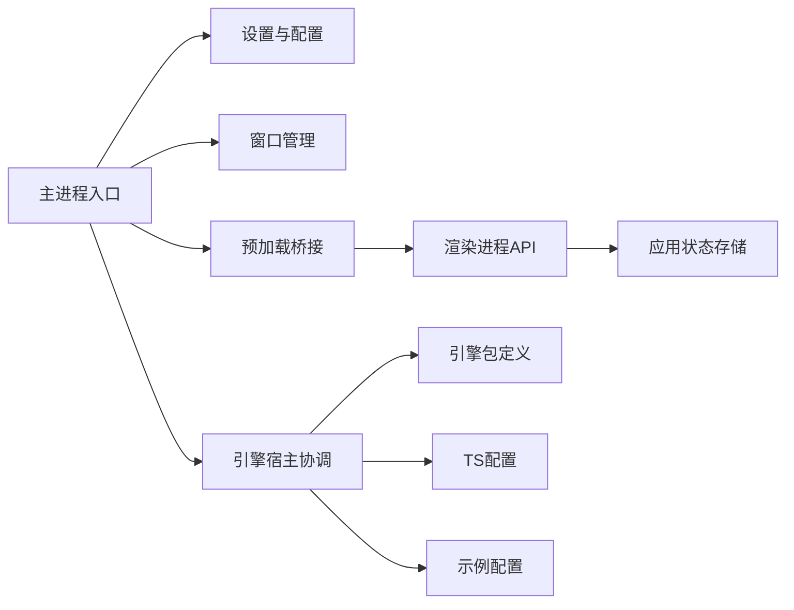

# 生命周期管理

<cite>
**本文引用的文件**   
- [engine/README.md](file://engine/README.md)
- [engine/package.json](file://engine/package.json)
- [engine/tsconfig.json](file://engine/tsconfig.json)
- [engine/config.example.json](file://engine/config.example.json)
- [app/main/index.ts](file://app/main/index.ts)
- [app/main/engine-host.ts](file://app/main/engine-host.ts)
- [app/main/settings.ts](file://app/main/settings.ts)
- [app/main/window.ts](file://app/main/window.ts)
- [app/preload/index.ts](file://app/preload/index.ts)
- [app/renderer/src/services/engine-api.ts](file://app/renderer/src/services/engine-api.ts)
- [app/renderer/src/stores/app-store.ts](file://app/renderer/src/stores/app-store.ts)
</cite>

## 目录
1. [简介](#简介)
2. [项目结构](#项目结构)
3. [核心组件](#核心组件)
4. [架构总览](#架构总览)
5. [详细组件分析](#详细组件分析)
6. [依赖关系分析](#依赖关系分析)
7. [性能考虑](#性能考虑)
8. [故障排除指南](#故障排除指南)
9. [结论](#结论)
10. [附录](#附录)

## 简介
本文件面向KCoder工具生命周期管理系统，聚焦于“启动初始化、预热与懒加载、运行时状态与健康检查、优雅关闭、资源清理、热重载、版本兼容与迁移、事件监听”等关键主题。文档以仓库中实际存在的入口与配置为锚点，结合工程化组织方式，给出可操作的实现建议与最佳实践，帮助读者在保持系统稳定性的同时获得良好的扩展性与可观测性。

## 项目结构
KCoder采用多包工作区（pnpm workspace）组织，引擎层位于 engine/packages 下，应用层位于 app 目录。主进程负责宿主环境、窗口与设置、以及引擎宿主协调；渲染进程通过服务层调用引擎能力；预加载桥接安全上下文。

图表来源
- [app/main/index.ts](file://app/main/index.ts)
- [app/main/engine-host.ts](file://app/main/engine-host.ts)
- [app/main/settings.ts](file://app/main/settings.ts)
- [app/main/window.ts](file://app/main/window.ts)
- [app/preload/index.ts](file://app/preload/index.ts)
- [app/renderer/src/services/engine-api.ts](file://app/renderer/src/services/engine-api.ts)
- [app/renderer/src/stores/app-store.ts](file://app/renderer/src/stores/app-store.ts)
- [engine/package.json](file://engine/package.json)
- [engine/tsconfig.json](file://engine/tsconfig.json)
- [engine/config.example.json](file://engine/config.example.json)
- [engine/README.md](file://engine/README.md)

章节来源
- [app/main/index.ts](file://app/main/index.ts)
- [app/main/engine-host.ts](file://app/main/engine-host.ts)
- [app/main/settings.ts](file://app/main/settings.ts)
- [app/main/window.ts](file://app/main/window.ts)
- [app/preload/index.ts](file://app/preload/index.ts)
- [app/renderer/src/services/engine-api.ts](file://app/renderer/src/services/engine-api.ts)
- [app/renderer/src/stores/app-store.ts](file://app/renderer/src/stores/app-store.ts)
- [engine/package.json](file://engine/package.json)
- [engine/tsconfig.json](file://engine/tsconfig.json)
- [engine/config.example.json](file://engine/config.example.json)
- [engine/README.md](file://engine/README.md)

## 核心组件
- 主进程入口：负责应用启动、模块装配、窗口创建、IPC桥接与生命周期钩子注册。
- 引擎宿主协调：负责引擎实例的创建、配置注入、插件发现与运行期调度。
- 设置与配置：统一读取与合并用户配置、环境变量与默认值，提供变更订阅。
- 窗口管理：控制渲染进程生命周期、消息通道与资源释放。
- 预加载桥接：暴露安全的API给渲染进程，屏蔽底层细节。
- 渲染进程API与服务：封装对引擎能力的调用，维护本地状态与UI同步。
- 引擎包与配置：定义构建、脚本、TS编译与示例配置，作为引擎生命周期的外部契约。

章节来源
- [app/main/index.ts](file://app/main/index.ts)
- [app/main/engine-host.ts](file://app/main/engine-host.ts)
- [app/main/settings.ts](file://app/main/settings.ts)
- [app/main/window.ts](file://app/main/window.ts)
- [app/preload/index.ts](file://app/preload/index.ts)
- [app/renderer/src/services/engine-api.ts](file://app/renderer/src/services/engine-api.ts)
- [app/renderer/src/stores/app-store.ts](file://app/renderer/src/stores/app-store.ts)
- [engine/package.json](file://engine/package.json)
- [engine/tsconfig.json](file://engine/tsconfig.json)
- [engine/config.example.json](file://engine/config.example.json)
- [engine/README.md](file://engine/README.md)

## 架构总览
下图展示从主进程到引擎的生命周期路径，包括初始化、预热、运行期健康检查与关闭流程。

图表来源
- [app/main/index.ts](file://app/main/index.ts)
- [app/main/engine-host.ts](file://app/main/engine-host.ts)
- [app/main/settings.ts](file://app/main/settings.ts)
- [app/main/window.ts](file://app/main/window.ts)
- [app/preload/index.ts](file://app/preload/index.ts)
- [app/renderer/src/services/engine-api.ts](file://app/renderer/src/services/engine-api.ts)
- [engine/README.md](file://engine/README.md)

## 详细组件分析

### 启动与初始化流程（依赖注入、配置加载、资源预分配）
- 配置加载：优先读取用户配置与环境变量，再合并默认值，形成最终配置对象。
- 依赖注入：由宿主协调器集中创建并注入引擎所需的服务（如日志、存储、网络、任务队列等）。
- 资源预分配：按需建立连接池、缓存、索引或预编译产物，避免冷启动延迟。
- 启动阶段划分：
  - 准备阶段：解析参数、加载配置、校验权限与磁盘空间。
  - 初始化阶段：创建并注入依赖、初始化子系统、注册中间件与处理器。
  - 就绪阶段：执行健康检查、上报可用能力、打开UI窗口。

图表来源
- [app/main/index.ts](file://app/main/index.ts)
- [app/main/engine-host.ts](file://app/main/engine-host.ts)
- [app/main/settings.ts](file://app/main/settings.ts)
- [engine/config.example.json](file://engine/config.example.json)

章节来源
- [app/main/index.ts](file://app/main/index.ts)
- [app/main/engine-host.ts](file://app/main/engine-host.ts)
- [app/main/settings.ts](file://app/main/settings.ts)
- [engine/config.example.json](file://engine/config.example.json)

### 预热机制（懒加载、预编译、连接池）
- 懒加载：对重型模块按首次使用时机加载，降低首屏时间。
- 预编译：在启动时或空闲时段预编译模板/规则/模型，减少运行时开销。
- 连接池：为数据库、HTTP客户端、远程服务建立连接池，复用连接提升吞吐。
- 预热策略：
  - 基于阈值：当内存占用低于阈值或CPU空闲时触发后台预热。
  - 基于事件：在用户交互前（如打开项目、切换工作区）主动预热相关能力。
  - 可观测：记录预热耗时与命中率，用于调优。

[此图为概念流程图，不直接映射具体源码文件]

### 运行时状态管理（健康检查、优雅关闭、状态持久化）
- 健康检查：周期性探测关键子系统（存储、网络、任务队列）可用性，暴露状态端点。
- 优雅关闭：拦截关闭信号，停止接收新请求，等待进行中任务完成，保存状态后退出。
- 状态持久化：将关键状态（会话、任务进度、配置快照）落盘，支持崩溃恢复与重启续跑。

图表来源
- [app/main/index.ts](file://app/main/index.ts)
- [app/main/engine-host.ts](file://app/main/engine-host.ts)
- [app/main/window.ts](file://app/main/window.ts)

章节来源
- [app/main/index.ts](file://app/main/index.ts)
- [app/main/engine-host.ts](file://app/main/engine-host.ts)
- [app/main/window.ts](file://app/main/window.ts)

### 资源清理机制（文件句柄、网络连接、内存回收）
- 文件句柄：确保所有打开的文件流在使用后关闭，异常路径也要保证释放。
- 网络连接：断开HTTP/WebSocket/数据库连接，清空未决请求与回调。
- 内存回收：释放大对象引用、清理定时器与事件监听器，避免泄漏。
- 清理顺序：先停止写入与对外通信，再释放内部资源，最后退出进程。

[此图为概念流程图，不直接映射具体源码文件]

### 热重载支持（代码更新、配置热更、插件动态加载）
- 代码更新：监听源文件变更，增量编译并热替换模块，保持运行态。
- 配置热更：监听配置文件变化，合并新配置并刷新运行时行为。
- 插件动态加载：支持在运行期发现、加载、卸载插件，提供沙箱隔离与回滚。
- 安全与一致性：变更需经过签名校验、兼容性检查与灰度开关控制。

[此图为概念流程图，不直接映射具体源码文件]

### 版本兼容性与迁移（向后兼容、迁移脚本、灰度发布）
- 向后兼容：新旧版本接口共存，逐步废弃旧字段与方法。
- 迁移脚本：在启动时检测数据格式差异，自动执行迁移。
- 灰度发布：按用户群或功能开关渐进放量，配合快速回滚。

[此图为概念流程图，不直接映射具体源码文件]

### 生命周期事件监听与处理
- 事件类型：启动前、启动后、配置变更、健康检查、关闭前、关闭后、异常。
- 监听器：支持多个监听器链式处理，具备优先级与短路能力。
- 幂等与容错：事件处理应幂等，异常不影响其他监听器。

[此图为概念流程图，不直接映射具体源码文件]

## 依赖关系分析
- 主进程入口依赖设置与窗口模块，并通过预加载向渲染进程暴露API。
- 渲染进程API依赖应用状态存储，用于UI同步与本地缓存。
- 引擎宿主协调依赖引擎包定义与配置，作为运行时契约。

图表来源
- [app/main/index.ts](file://app/main/index.ts)
- [app/main/settings.ts](file://app/main/settings.ts)
- [app/main/window.ts](file://app/main/window.ts)
- [app/preload/index.ts](file://app/preload/index.ts)
- [app/renderer/src/services/engine-api.ts](file://app/renderer/src/services/engine-api.ts)
- [app/renderer/src/stores/app-store.ts](file://app/renderer/src/stores/app-store.ts)
- [app/main/engine-host.ts](file://app/main/engine-host.ts)
- [engine/package.json](file://engine/package.json)
- [engine/tsconfig.json](file://engine/tsconfig.json)
- [engine/config.example.json](file://engine/config.example.json)

章节来源
- [app/main/index.ts](file://app/main/index.ts)
- [app/main/settings.ts](file://app/main/settings.ts)
- [app/main/window.ts](file://app/main/window.ts)
- [app/preload/index.ts](file://app/preload/index.ts)
- [app/renderer/src/services/engine-api.ts](file://app/renderer/src/services/engine-api.ts)
- [app/renderer/src/stores/app-store.ts](file://app/renderer/src/stores/app-store.ts)
- [app/main/engine-host.ts](file://app/main/engine-host.ts)
- [engine/package.json](file://engine/package.json)
- [engine/tsconfig.json](file://engine/tsconfig.json)
- [engine/config.example.json](file://engine/config.example.json)

## 性能考虑
- 启动优化：拆分初始化阶段，延迟非关键依赖；启用并行初始化与批处理。
- 预热策略：根据访问模式预测热点，提前建立连接与缓存。
- 资源复用：连接池、线程池、对象池减少频繁创建销毁成本。
- 可观测性：埋点统计关键路径耗时与错误率，指导容量规划与扩容。

## 故障排除指南
- 启动失败：检查配置合法性、权限与磁盘空间；查看健康检查失败原因。
- 资源泄漏：监控文件句柄与网络连接数；定位未释放的监听器与定时器。
- 优雅关闭异常：确认关闭信号拦截与任务 draining 逻辑；增加超时保护。
- 热重载不稳定：校验增量编译产物与签名；限制并发更新与回滚策略。
- 版本迁移问题：核对迁移脚本幂等性与回滚方案；分批次灰度验证。

## 结论
通过清晰的启动阶段划分、完善的预热与资源管理、健壮的运行期健康检查与优雅关闭、以及灵活的热重载与版本兼容策略，KCoder能够在大中型工程中提供稳定高效的工具生命周期管理能力。建议在生产环境强化可观测性与自动化测试，持续优化性能与可靠性。

## 附录
- 参考文件清单与用途：
  - 主进程入口与宿主协调：负责整体生命周期编排。
  - 设置与配置：统一配置管理与变更订阅。
  - 窗口与预加载：控制渲染进程与跨进程通信。
  - 渲染API与状态：封装引擎调用与本地状态同步。
  - 引擎包与配置：定义构建、脚本与示例配置，作为生命周期契约。

章节来源
- [engine/README.md](file://engine/README.md)
- [engine/package.json](file://engine/package.json)
- [engine/tsconfig.json](file://engine/tsconfig.json)
- [engine/config.example.json](file://engine/config.example.json)
- [app/main/index.ts](file://app/main/index.ts)
- [app/main/engine-host.ts](file://app/main/engine-host.ts)
- [app/main/settings.ts](file://app/main/settings.ts)
- [app/main/window.ts](file://app/main/window.ts)
- [app/preload/index.ts](file://app/preload/index.ts)
- [app/renderer/src/services/engine-api.ts](file://app/renderer/src/services/engine-api.ts)
- [app/renderer/src/stores/app-store.ts](file://app/renderer/src/stores/app-store.ts)