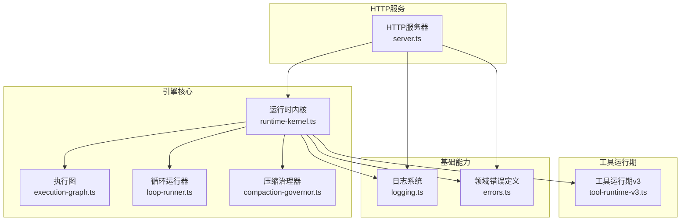
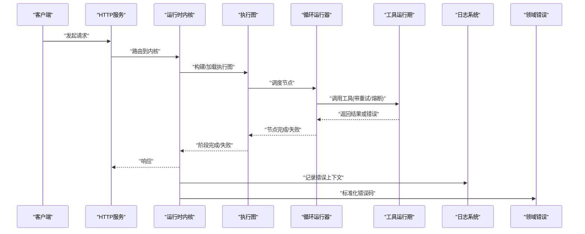
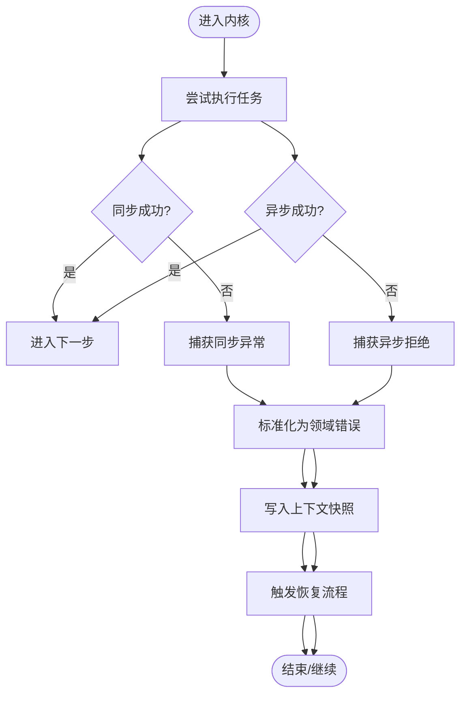
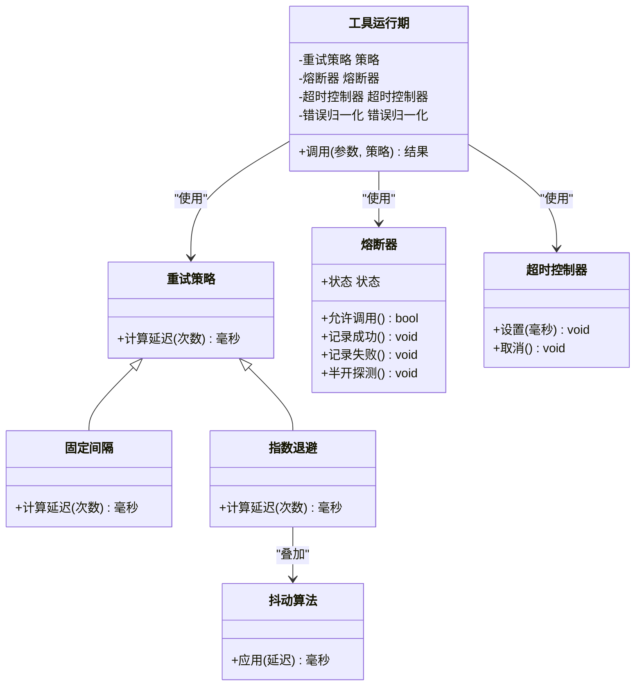
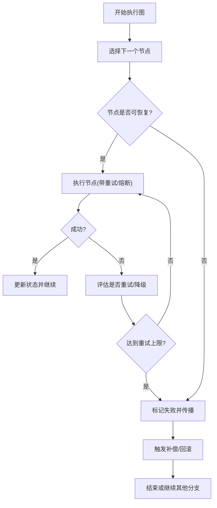
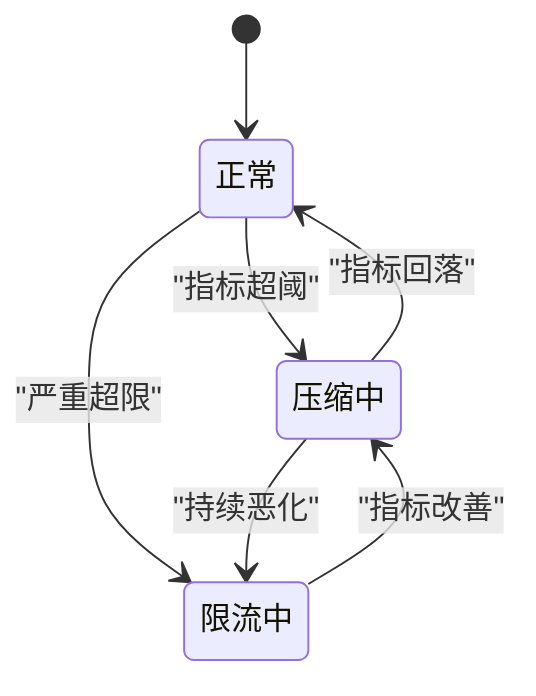
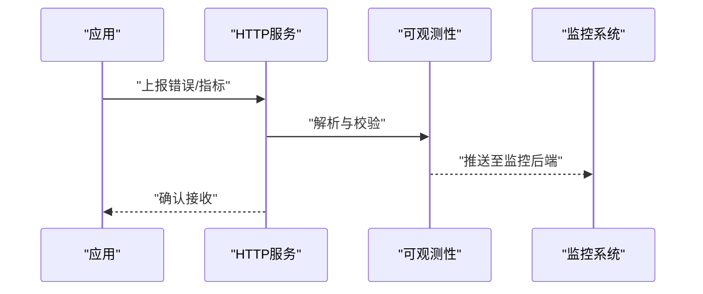
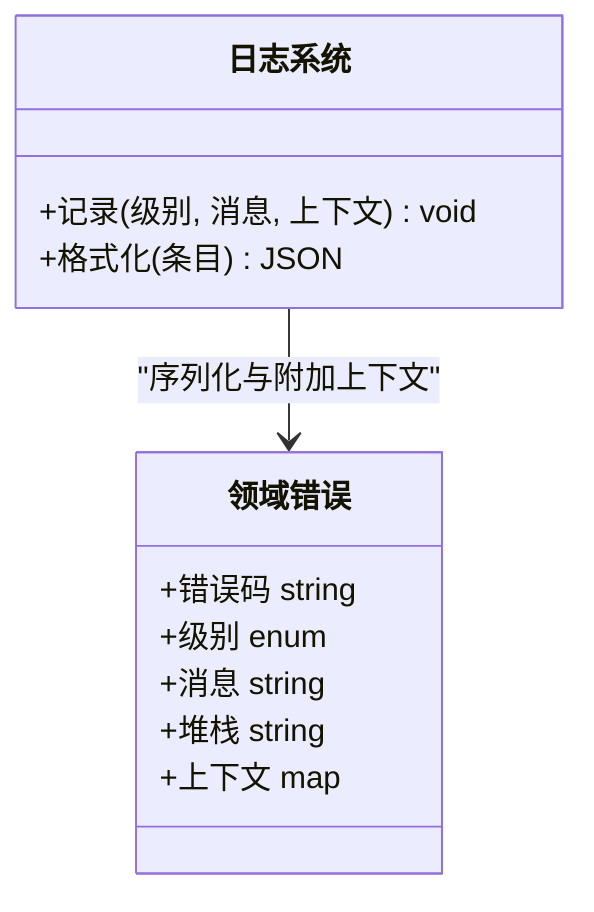
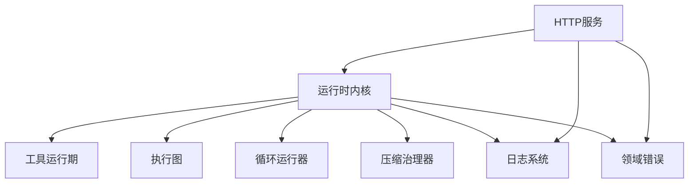

# 错误恢复与容错

<cite>
**本文引用的文件**   
- [engine/packages/engine/src/runtime-kernel.ts](file://engine/packages/engine/src/runtime-kernel.ts)
- [engine/tests/runtime-kernel-crash-recovery.test.ts](file://engine/tests/runtime-kernel-crash-recovery.test.ts)
- [engine/scripts/verify-crash-recovery.mjs](file://engine/scripts/verify-crash-recovery.mjs)
- [engine/packages/engine/src/tool-runtime-v3.ts](file://engine/packages/engine/src/tool-runtime-v3.ts)
- [engine/tests/tool-call-errors.test.ts](file://engine/tests/tool-call-errors.test.ts)
- [engine/packages/engine/src/compaction-governor.ts](file://engine/packages/engine/src/compaction-governor.ts)
- [engine/packages/engine/src/loop-runner.ts](file://engine/packages/engine/src/loop-runner.ts)
- [engine/packages/engine/src/execution-graph.ts](file://engine/packages/engine/src/execution-graph.ts)
- [engine/packages/http-layer/src/server.ts](file://engine/packages/http-layer/src/server.ts)
- [engine/tests/http-server-observability.test.ts](file://engine/tests/http-server-observability.test.ts)
- [engine/packages/foundation/src/logging.ts](file://engine/packages/foundation/src/logging.ts)
- [engine/packages/domain-layer/src/errors.ts](file://engine/packages/domain-layer/src/errors.ts)
</cite>

## 目录
1. [简介](#简介)
2. [项目结构](#项目结构)
3. [核心组件](#核心组件)
4. [架构总览](#架构总览)
5. [详细组件分析](#详细组件分析)
6. [依赖关系分析](#依赖关系分析)
7. [性能考量](#性能考量)
8. [故障诊断指南](#故障诊断指南)
9. [结论](#结论)
10. [附录](#附录)

## 简介
本技术文档聚焦于KCoder的错误恢复与容错机制，覆盖异常捕获与处理策略（同步、异步、未处理异常）、重试机制（指数退避、固定间隔、抖动）、熔断降级模式（状态机、阈值、快速失败）、超时控制与资源清理（执行超时、内存泄漏防护、句柄释放）、错误分类与日志记录（错误码、堆栈跟踪、上下文信息），以及故障诊断与恢复最佳实践和监控告警配置方法。文档以代码级实现为依据，结合测试与脚本验证路径，帮助读者理解并落地高可用的工程化方案。

## 项目结构
KCoder采用多包工作区组织，错误恢复与容错相关能力主要分布在以下位置：
- 运行时内核与任务编排：负责整体流程的异常边界、崩溃恢复、循环治理与执行图调度
- 工具运行期：封装工具调用的错误处理、重试与熔断
- HTTP层服务：对外暴露可观测性与错误上报接口
- 基础能力：统一日志、领域错误模型等

图表来源
- [engine/packages/engine/src/runtime-kernel.ts](file://engine/packages/engine/src/runtime-kernel.ts)
- [engine/packages/engine/src/execution-graph.ts](file://engine/packages/engine/src/execution-graph.ts)
- [engine/packages/engine/src/loop-runner.ts](file://engine/packages/engine/src/loop-runner.ts)
- [engine/packages/engine/src/compaction-governor.ts](file://engine/packages/engine/src/compaction-governor.ts)
- [engine/packages/engine/src/tool-runtime-v3.ts](file://engine/packages/engine/src/tool-runtime-v3.ts)
- [engine/packages/http-layer/src/server.ts](file://engine/packages/http-layer/src/server.ts)
- [engine/packages/foundation/src/logging.ts](file://engine/packages/foundation/src/logging.ts)
- [engine/packages/domain-layer/src/errors.ts](file://engine/packages/domain-layer/src/errors.ts)

章节来源
- [engine/packages/engine/src/runtime-kernel.ts](file://engine/packages/engine/src/runtime-kernel.ts)
- [engine/packages/engine/src/execution-graph.ts](file://engine/packages/engine/src/execution-graph.ts)
- [engine/packages/engine/src/loop-runner.ts](file://engine/packages/engine/src/loop-runner.ts)
- [engine/packages/engine/src/compaction-governor.ts](file://engine/packages/engine/src/compaction-governor.ts)
- [engine/packages/engine/src/tool-runtime-v3.ts](file://engine/packages/engine/src/tool-runtime-v3.ts)
- [engine/packages/http-layer/src/server.ts](file://engine/packages/http-layer/src/server.ts)
- [engine/packages/foundation/src/logging.ts](file://engine/packages/foundation/src/logging.ts)
- [engine/packages/domain-layer/src/errors.ts](file://engine/packages/domain-layer/src/errors.ts)

## 核心组件
- 运行时内核：作为全局异常边界与恢复中枢，负责捕获同步/异步异常、未处理异常，协调崩溃恢复、上下文持久化与任务重入。
- 工具运行期：对工具调用进行隔离与保护，提供重试、熔断、超时与结果归一化。
- 执行图与循环运行器：在复杂编排中维护节点状态与错误传播，支持局部失败与整体回滚。
- 压缩治理器：在上下文膨胀或资源紧张时触发压缩与降级，避免雪崩。
- HTTP服务：暴露健康检查、指标与错误上报端点，便于外部监控接入。
- 日志系统与领域错误：统一错误分类、结构化日志与上下文收集。

章节来源
- [engine/packages/engine/src/runtime-kernel.ts](file://engine/packages/engine/src/runtime-kernel.ts)
- [engine/packages/engine/src/tool-runtime-v3.ts](file://engine/packages/engine/src/tool-runtime-v3.ts)
- [engine/packages/engine/src/execution-graph.ts](file://engine/packages/engine/src/execution-graph.ts)
- [engine/packages/engine/src/loop-runner.ts](file://engine/packages/engine/src/loop-runner.ts)
- [engine/packages/engine/src/compaction-governor.ts](file://engine/packages/engine/src/compaction-governor.ts)
- [engine/packages/http-layer/src/server.ts](file://engine/packages/http-layer/src/server.ts)
- [engine/packages/foundation/src/logging.ts](file://engine/packages/foundation/src/logging.ts)
- [engine/packages/domain-layer/src/errors.ts](file://engine/packages/domain-layer/src/errors.ts)

## 架构总览
下图展示了从请求入口到内核、工具运行期与基础设施的整体错误流与控制流。

图表来源
- [engine/packages/http-layer/src/server.ts](file://engine/packages/http-layer/src/server.ts)
- [engine/packages/engine/src/runtime-kernel.ts](file://engine/packages/engine/src/runtime-kernel.ts)
- [engine/packages/engine/src/execution-graph.ts](file://engine/packages/engine/src/execution-graph.ts)
- [engine/packages/engine/src/loop-runner.ts](file://engine/packages/engine/src/loop-runner.ts)
- [engine/packages/engine/src/tool-runtime-v3.ts](file://engine/packages/engine/src/tool-runtime-v3.ts)
- [engine/packages/foundation/src/logging.ts](file://engine/packages/foundation/src/logging.ts)
- [engine/packages/domain-layer/src/errors.ts](file://engine/packages/domain-layer/src/errors.ts)

## 详细组件分析

### 运行时内核：异常边界与崩溃恢复
- 同步异常捕获：在关键执行路径使用受控边界包裹，确保异常不会逃逸至宿主进程。
- 异步异常捕获：为Promise链与事件回调注册统一的拒绝处理器，避免未捕获拒绝导致进程退出。
- 未处理异常：注册全局未处理异常与未处理拒绝监听，将异常转译为领域错误并持久化上下文快照。
- 崩溃恢复：基于持久化状态与事件回放，重启后恢复最近一致状态，减少用户可见中断。
- 上下文快照：在关键阶段写入最小必要上下文，用于后续诊断与恢复。

图表来源
- [engine/packages/engine/src/runtime-kernel.ts](file://engine/packages/engine/src/runtime-kernel.ts)
- [engine/packages/domain-layer/src/errors.ts](file://engine/packages/domain-layer/src/errors.ts)

章节来源
- [engine/packages/engine/src/runtime-kernel.ts](file://engine/packages/engine/src/runtime-kernel.ts)
- [engine/tests/runtime-kernel-crash-recovery.test.ts](file://engine/tests/runtime-kernel-crash-recovery.test.ts)
- [engine/scripts/verify-crash-recovery.mjs](file://engine/scripts/verify-crash-recovery.mjs)

### 工具运行期：重试、熔断与超时
- 重试策略：
  - 固定间隔：适用于瞬时抖动场景，按固定周期重试。
  - 指数退避：随重试次数增加等待时间呈指数增长，降低竞争压力。
  - 抖动算法：在退避基础上叠加随机抖动，避免“惊群效应”。
- 熔断降级：
  - 状态机：关闭→半开→开启，依据错误率/慢调用比例切换。
  - 阈值配置：错误率阈值、最小样本数、半开探测窗口。
  - 快速失败：熔断开启时直接短路，避免放大故障。
- 超时控制：
  - 执行超时：为每次工具调用设置上限，防止长尾阻塞。
  - 资源清理：在超时或异常分支强制释放句柄、取消挂起I/O。
- 错误归一化：将第三方错误映射为领域错误，附带错误码与上下文。

图表来源
- [engine/packages/engine/src/tool-runtime-v3.ts](file://engine/packages/engine/src/tool-runtime-v3.ts)
- [engine/tests/tool-call-errors.test.ts](file://engine/tests/tool-call-errors.test.ts)

章节来源
- [engine/packages/engine/src/tool-runtime-v3.ts](file://engine/packages/engine/src/tool-runtime-v3.ts)
- [engine/tests/tool-call-errors.test.ts](file://engine/tests/tool-call-errors.test.ts)

### 执行图与循环运行器：错误传播与局部恢复
- 执行图：将任务建模为有向无环图，节点间错误通过边传播；支持部分失败与补偿动作。
- 循环运行器：管理迭代式执行的生命周期，在每轮迭代中捕获异常并决定是否继续、跳过或终止。
- 局部恢复：对可恢复错误进行节点级重试或替换执行路径，避免整图失败。

图表来源
- [engine/packages/engine/src/execution-graph.ts](file://engine/packages/engine/src/execution-graph.ts)
- [engine/packages/engine/src/loop-runner.ts](file://engine/packages/engine/src/loop-runner.ts)

章节来源
- [engine/packages/engine/src/execution-graph.ts](file://engine/packages/engine/src/execution-graph.ts)
- [engine/packages/engine/src/loop-runner.ts](file://engine/packages/engine/src/loop-runner.ts)

### 压缩治理器：资源压力下的降级与恢复
- 触发条件：上下文大小、内存占用、GC频率等指标超过阈值。
- 动作策略：压缩历史、裁剪低优先级片段、限制并发度。
- 恢复路径：当指标回落时逐步恢复容量，避免频繁震荡。

图表来源
- [engine/packages/engine/src/compaction-governor.ts](file://engine/packages/engine/src/compaction-governor.ts)

章节来源
- [engine/packages/engine/src/compaction-governor.ts](file://engine/packages/engine/src/compaction-governor.ts)

### HTTP服务：可观测性与错误上报
- 健康检查：暴露健康探针，辅助负载均衡与健康判定。
- 指标上报：输出错误率、延迟分布、熔断状态等指标。
- 错误上报：接收并聚合来自各层的错误事件，供外部监控系统消费。

图表来源
- [engine/packages/http-layer/src/server.ts](file://engine/packages/http-layer/src/server.ts)
- [engine/tests/http-server-observability.test.ts](file://engine/tests/http-server-observability.test.ts)

章节来源
- [engine/packages/http-layer/src/server.ts](file://engine/packages/http-layer/src/server.ts)
- [engine/tests/http-server-observability.test.ts](file://engine/tests/http-server-observability.test.ts)

### 日志系统与领域错误：分类、堆栈与上下文
- 错误分类：通过领域错误模型定义错误码、级别与语义，便于上层统一处理。
- 堆栈跟踪：保留调用栈与关键帧，定位问题根因。
- 上下文信息：采集请求ID、租户、模块、操作名、耗时等元数据，提升可观测性。
- 结构化日志：输出JSON格式，便于检索与分析。

图表来源
- [engine/packages/foundation/src/logging.ts](file://engine/packages/foundation/src/logging.ts)
- [engine/packages/domain-layer/src/errors.ts](file://engine/packages/domain-layer/src/errors.ts)

章节来源
- [engine/packages/foundation/src/logging.ts](file://engine/packages/foundation/src/logging.ts)
- [engine/packages/domain-layer/src/errors.ts](file://engine/packages/domain-layer/src/errors.ts)

## 依赖关系分析
- 耦合与内聚：
  - 运行时内核依赖工具运行期、执行图、循环运行器与压缩治理器，形成高内聚的恢复中枢。
  - HTTP服务仅依赖内核与日志/错误模型，保持对外接口稳定。
- 外部依赖与集成点：
  - 日志系统与错误模型为跨层共享的基础设施。
  - HTTP服务作为可观测性出口，对接外部监控平台。
- 潜在循环依赖：
  - 通过分层与接口抽象避免内核与工具运行期的双向依赖。

图表来源
- [engine/packages/engine/src/runtime-kernel.ts](file://engine/packages/engine/src/runtime-kernel.ts)
- [engine/packages/engine/src/tool-runtime-v3.ts](file://engine/packages/engine/src/tool-runtime-v3.ts)
- [engine/packages/engine/src/execution-graph.ts](file://engine/packages/engine/src/execution-graph.ts)
- [engine/packages/engine/src/loop-runner.ts](file://engine/packages/engine/src/loop-runner.ts)
- [engine/packages/engine/src/compaction-governor.ts](file://engine/packages/engine/src/compaction-governor.ts)
- [engine/packages/http-layer/src/server.ts](file://engine/packages/http-layer/src/server.ts)
- [engine/packages/foundation/src/logging.ts](file://engine/packages/foundation/src/logging.ts)
- [engine/packages/domain-layer/src/errors.ts](file://engine/packages/domain-layer/src/errors.ts)

章节来源
- [engine/packages/engine/src/runtime-kernel.ts](file://engine/packages/engine/src/runtime-kernel.ts)
- [engine/packages/engine/src/tool-runtime-v3.ts](file://engine/packages/engine/src/tool-runtime-v3.ts)
- [engine/packages/engine/src/execution-graph.ts](file://engine/packages/engine/src/execution-graph.ts)
- [engine/packages/engine/src/loop-runner.ts](file://engine/packages/engine/src/loop-runner.ts)
- [engine/packages/engine/src/compaction-governor.ts](file://engine/packages/engine/src/compaction-governor.ts)
- [engine/packages/http-layer/src/server.ts](file://engine/packages/http-layer/src/server.ts)
- [engine/packages/foundation/src/logging.ts](file://engine/packages/foundation/src/logging.ts)
- [engine/packages/domain-layer/src/errors.ts](file://engine/packages/domain-layer/src/errors.ts)

## 性能考量
- 重试与熔断的参数调优：
  - 指数退避的基数与最大延迟需结合下游SLA设定。
  - 抖动幅度应足够分散重试峰值，避免雪崩。
  - 熔断阈值与最小样本数需平衡误报与漏报。
- 超时与资源清理：
  - 合理设置调用超时，避免长尾拖垮整体吞吐。
  - 在异常与超时路径强制释放文件句柄、网络连接与定时器。
- 压缩治理：
  - 压缩粒度与频率影响CPU与IO开销，需根据负载动态调整。
- 可观测性开销：
  - 日志采样与指标聚合应避免在高QPS路径造成额外延迟。

[本节为通用指导，不直接分析具体文件]

## 故障诊断指南
- 快速定位：
  - 通过错误码与级别筛选关键错误，结合请求ID追踪全链路。
  - 查看堆栈与上下文，识别首次失败点与上游依赖。
- 恢复步骤：
  - 若为瞬时错误，启用重试与退避；若为系统性故障，触发熔断与降级。
  - 利用崩溃恢复与上下文快照，恢复到最近一致状态。
- 复现与回归：
  - 使用脚本与测试用例模拟故障注入，验证恢复路径。
  - 在预发环境进行端到端演练，确保告警与自愈生效。

章节来源
- [engine/tests/runtime-kernel-crash-recovery.test.ts](file://engine/tests/runtime-kernel-crash-recovery.test.ts)
- [engine/scripts/verify-crash-recovery.mjs](file://engine/scripts/verify-crash-recovery.mjs)
- [engine/tests/tool-call-errors.test.ts](file://engine/tests/tool-call-errors.test.ts)
- [engine/tests/http-server-observability.test.ts](file://engine/tests/http-server-observability.test.ts)

## 结论
KCoder通过运行时内核的统一异常边界、工具运行期的重试与熔断、执行图的局部恢复、压缩治理的资源保护，以及完善的日志与错误模型，构建了端到端的错误恢复与容错体系。配合HTTP服务的可观测性出口与监控告警，可在复杂生产环境中实现高可用与快速自愈。

[本节为总结性内容，不直接分析具体文件]

## 附录
- 错误监控与告警配置建议：
  - 指标维度：错误率、P95/P99延迟、熔断状态、重试次数、压缩触发次数。
  - 告警规则：错误率突增、熔断开启持续时间、重试耗尽、超时占比上升。
  - 通知渠道：企业IM、邮件、短信与工单系统集成。
- 最佳实践清单：
  - 所有外部调用必须设置超时与重试上限。
  - 关键路径必须记录结构化日志与上下文。
  - 定期演练崩溃恢复与熔断降级，验证SLO达成。

[本节为通用指导，不直接分析具体文件]