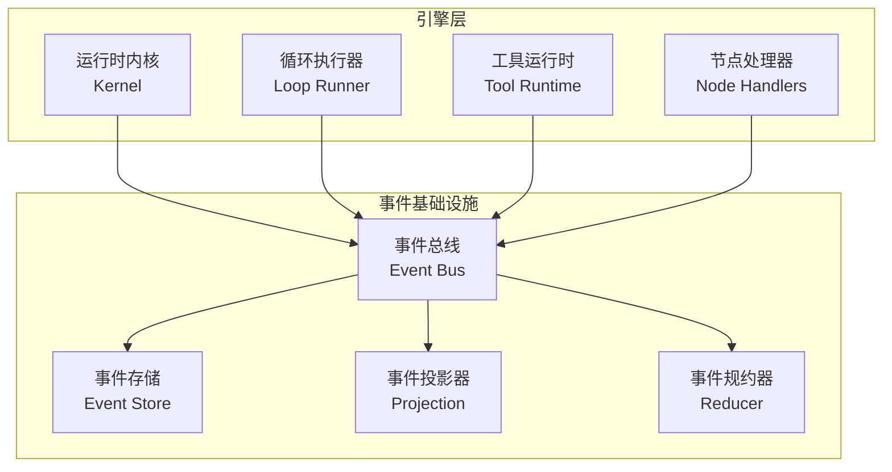
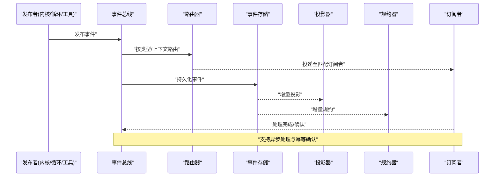
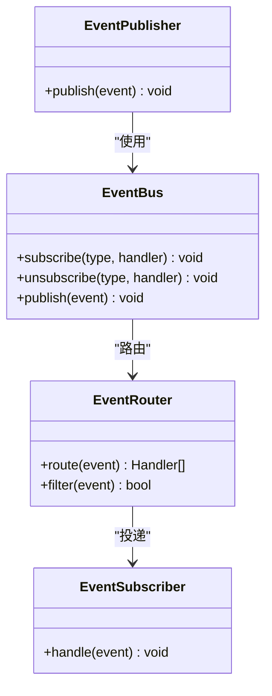
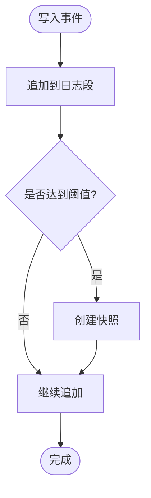
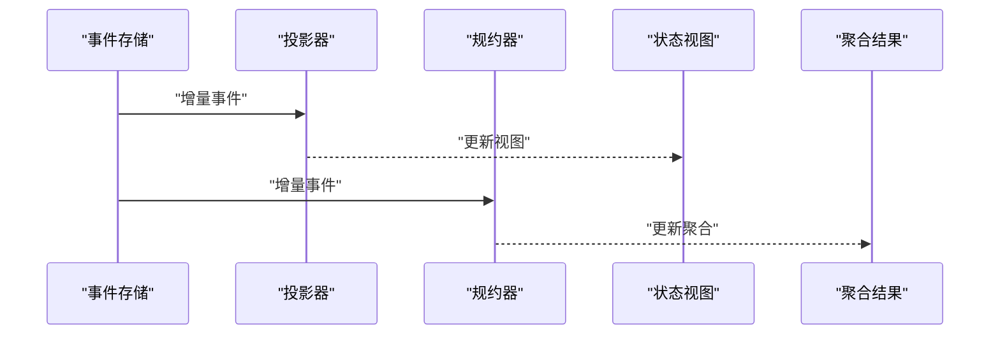
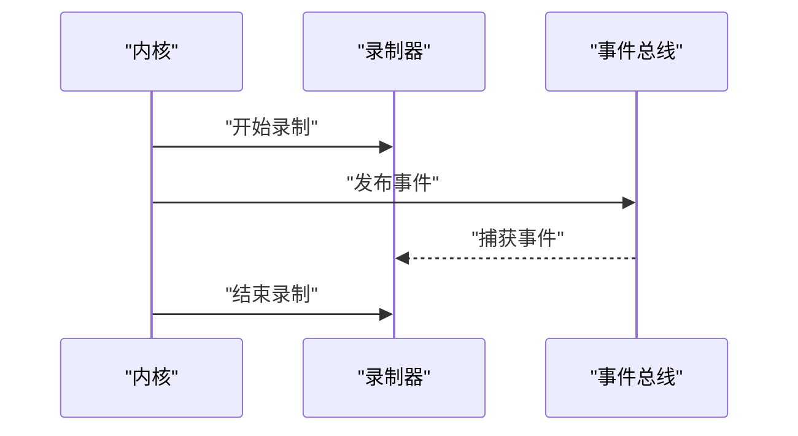
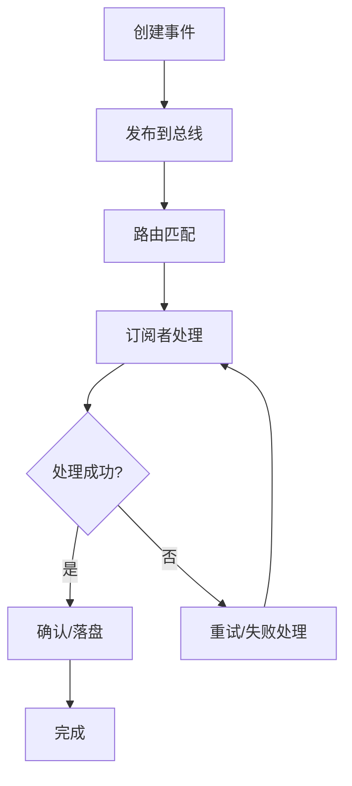
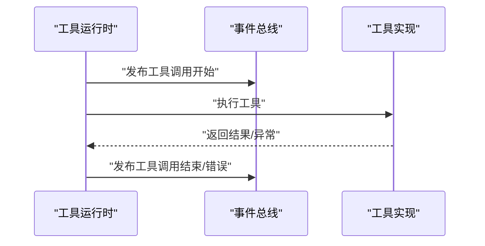
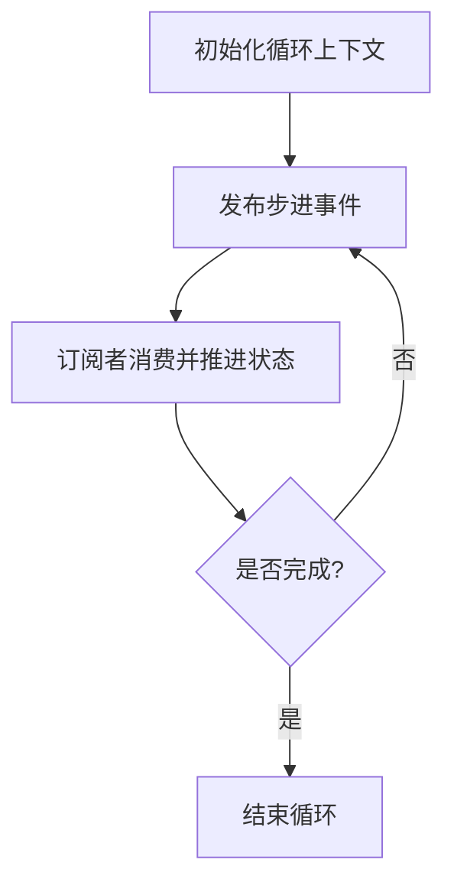
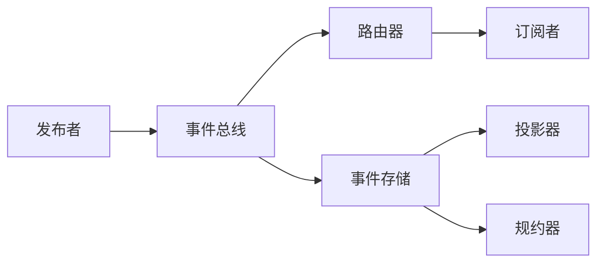

# 事件总线设计

<cite>
**本文引用的文件**   
- [turn-event-bus.test.ts](file://engine/tests/turn-event-bus.test.ts)
- [runtime-event-projection.test.ts](file://engine/tests/runtime-event-projection.test.ts)
- [runtime-event-recorder-kernel.test.ts](file://engine/tests/runtime-event-recorder-kernel.test.ts)
- [runtime-event-reducer.test.ts](file://engine/tests/runtime-event-reducer.test.ts)
- [run-event-store.test.ts](file://engine/tests/run-event-store.test.ts)
- [evented-loop.test.ts](file://engine/tests/evented-loop.test.ts)
- [kernel-v3-node-handlers.test.ts](file://engine/tests/kernel-v3-node-handlers.test.ts)
- [tool-runtime-v3.test.ts](file://engine/tests/tool-runtime-v3.test.ts)
- [loop-runner.test.ts](file://engine/tests/loop-runner.test.ts)
- [execution-graph.test.ts](file://engine/tests/execution-graph.test.ts)
</cite>

## 目录
1. [简介](#简介)
2. [项目结构](#项目结构)
3. [核心组件](#核心组件)
4. [架构总览](#架构总览)
5. [详细组件分析](#详细组件分析)
6. [依赖关系分析](#依赖关系分析)
7. [性能考虑](#性能考虑)
8. [故障排查指南](#故障排查指南)
9. [结论](#结论)
10. [附录](#附录)

## 简介
本技术文档围绕KCoder引擎中的“事件总线”设计与实现进行系统化阐述。基于仓库中大量与事件相关的测试用例，可以确认系统采用发布订阅模式与观察者模式相结合的事件驱动架构，贯穿任务执行、工具调用、循环控制与运行时内核等关键路径。本文聚焦以下目标：
- 解释事件总线的核心架构与职责划分（发布者、订阅者、路由器）
- 梳理事件生命周期（创建、分发、处理、确认）
- 总结性能优化策略（异步、批量、内存管理）
- 给出配置项建议（并发、超时、重试）
- 提供扩展开发指南（自定义处理器、中间件、插件）
- 说明调试方法与最佳实践

## 项目结构
从工程目录可见，事件相关能力主要分布在 engine 子工程中，并通过一系列测试覆盖不同场景与子系统。这些测试用例反映了事件在运行期被记录、投影、规约、回放与消费的关键环节，是理解事件总线结构与行为的重要依据。



[此图为概念性结构示意，不直接映射具体源码文件]

## 核心组件
结合测试用例的命名与关注点，可将事件总线相关核心组件归纳如下：
- 事件发布者：负责将领域事件或运行时事件发布到总线，通常由内核、循环执行器、工具运行时等触发
- 事件订阅者：监听并消费特定类型事件，完成副作用、状态更新、指标上报等
- 事件路由器：根据事件类型、上下文或路由表将事件投递给合适的订阅者，支持过滤、优先级与隔离
- 事件存储：持久化事件序列，保障可回放与审计
- 事件投影器：将事件流转换为可读的状态视图，供查询与展示
- 事件规约器：对事件进行聚合、折叠与归约，生成高阶状态或统计信息

上述组件通过清晰的接口契约协作，形成高内聚、低耦合的事件驱动体系。

章节来源
- [turn-event-bus.test.ts](file://engine/tests/turn-event-bus.test.ts)
- [runtime-event-projection.test.ts](file://engine/tests/runtime-event-projection.test.ts)
- [runtime-event-recorder-kernel.test.ts](file://engine/tests/runtime-event-recorder-kernel.test.ts)
- [runtime-event-reducer.test.ts](file://engine/tests/runtime-event-reducer.test.ts)
- [run-event-store.test.ts](file://engine/tests/run-event-store.test.ts)

## 架构总览
下图展示了事件在系统中的端到端流转：从发布到存储、投影、规约，再到订阅者的消费与确认。



图表来源
- [runtime-event-recorder-kernel.test.ts](file://engine/tests/runtime-event-recorder-kernel.test.ts)
- [run-event-store.test.ts](file://engine/tests/run-event-store.test.ts)
- [runtime-event-projection.test.ts](file://engine/tests/runtime-event-projection.test.ts)
- [runtime-event-reducer.test.ts](file://engine/tests/runtime-event-reducer.test.ts)
- [turn-event-bus.test.ts](file://engine/tests/turn-event-bus.test.ts)

## 详细组件分析

### 事件总线与发布订阅
- 职责
  - 统一入口：所有事件通过总线发布，屏蔽底层路由与存储细节
  - 解耦：发布者无需感知订阅者数量与实现
  - 可扩展：新增订阅者无需修改发布者
- 关键特性
  - 类型安全：以事件类型为维度进行注册与分发
  - 顺序与一致性：在单会话/单轮次内保证有序；跨会话可通过存储与回放保证最终一致
  - 幂等：同一事件可被多次投递而不产生重复副作用



图表来源
- [turn-event-bus.test.ts](file://engine/tests/turn-event-bus.test.ts)

章节来源
- [turn-event-bus.test.ts](file://engine/tests/turn-event-bus.test.ts)

### 事件存储与回放
- 职责
  - 持久化事件序列，提供追加写入与范围读取
  - 支撑回放、审计与恢复
- 关键特性
  - 追加优先：避免随机写，提升吞吐
  - 快照与分段：降低回放成本
  - 幂等写入：去重键或版本号防止重复



图表来源
- [run-event-store.test.ts](file://engine/tests/run-event-store.test.ts)

章节来源
- [run-event-store.test.ts](file://engine/tests/run-event-store.test.ts)

### 事件投影与规约
- 事件投影
  - 将事件流转换为面向查询的状态视图
  - 支持增量投影，避免全量重建
- 事件规约
  - 对事件进行聚合计算，生成统计或决策信号
  - 可与投影并行，分别服务于不同用途



图表来源
- [runtime-event-projection.test.ts](file://engine/tests/runtime-event-projection.test.ts)
- [runtime-event-reducer.test.ts](file://engine/tests/runtime-event-reducer.test.ts)

章节来源
- [runtime-event-projection.test.ts](file://engine/tests/runtime-event-projection.test.ts)
- [runtime-event-reducer.test.ts](file://engine/tests/runtime-event-reducer.test.ts)

### 录制与内核集成
- 录制器
  - 在内核边界捕获事件，用于测试、回放与诊断
- 内核集成
  - 内核在执行阶段发布关键事件，便于追踪与治理



图表来源
- [runtime-event-recorder-kernel.test.ts](file://engine/tests/runtime-event-recorder-kernel.test.ts)

章节来源
- [runtime-event-recorder-kernel.test.ts](file://engine/tests/runtime-event-recorder-kernel.test.ts)

### 事件生命周期管理
- 创建：由业务逻辑或运行时动作构造事件对象
- 分发：总线依据类型与上下文路由到订阅者
- 处理：订阅者执行副作用或状态变更
- 确认：处理完成后向总线或存储发送确认，支持幂等与补偿



图表来源
- [turn-event-bus.test.ts](file://engine/tests/turn-event-bus.test.ts)
- [run-event-store.test.ts](file://engine/tests/run-event-store.test.ts)

章节来源
- [turn-event-bus.test.ts](file://engine/tests/turn-event-bus.test.ts)
- [run-event-store.test.ts](file://engine/tests/run-event-store.test.ts)

### 与执行图及循环执行的协同
- 执行图
  - 节点间通过事件传递数据与控制信号，驱动流程推进
- 循环执行器
  - 在每轮迭代中发布/消费事件，协调多步骤任务

```mermaid
sequenceDiagram
participant Graph as "执行图"
participant Loop as "循环执行器"
participant Bus as "事件总线"
participant Node as "节点处理器"
Loop->>Graph : "调度下一节点"
Graph->>Bus : "发布节点事件"
Bus->>Node : "投递到处理器"
Node-->>Bus : "返回结果事件"
Bus-->>Loop : "通知完成/下一步"
```

图表来源
- [execution-graph.test.ts](file://engine/tests/execution-graph.test.ts)
- [loop-runner.test.ts](file://engine/tests/loop-runner.test.ts)
- [kernel-v3-node-handlers.test.ts](file://engine/tests/kernel-v3-node-handlers.test.ts)

章节来源
- [execution-graph.test.ts](file://engine/tests/execution-graph.test.ts)
- [loop-runner.test.ts](file://engine/tests/loop-runner.test.ts)
- [kernel-v3-node-handlers.test.ts](file://engine/tests/kernel-v3-node-handlers.test.ts)

### 工具运行时中的事件
- 工具调用前后发布事件，便于观测、限流与计费
- 错误与重试通过事件传播，保持调用链清晰



图表来源
- [tool-runtime-v3.test.ts](file://engine/tests/tool-runtime-v3.test.ts)

章节来源
- [tool-runtime-v3.test.ts](file://engine/tests/tool-runtime-v3.test.ts)

### 事件化循环与调度
- 事件化循环将传统同步循环抽象为事件驱动的步进模型
- 通过事件驱动实现更灵活的编排与扩展



图表来源
- [evented-loop.test.ts](file://engine/tests/evented-loop.test.ts)

章节来源
- [evented-loop.test.ts](file://engine/tests/evented-loop.test.ts)

## 依赖关系分析
- 组件耦合
  - 发布者仅依赖总线接口，不感知订阅者
  - 路由器集中管理订阅者集合与过滤规则
  - 存储、投影、规约作为横切能力，被总线与订阅者共同复用
- 外部依赖
  - 存储后端可能对接磁盘或数据库
  - 投影与规约可接入缓存以提升读性能
- 潜在风险
  - 路由表过大导致匹配开销上升
  - 未做背压与限流可能导致内存膨胀



图表来源
- [turn-event-bus.test.ts](file://engine/tests/turn-event-bus.test.ts)
- [run-event-store.test.ts](file://engine/tests/run-event-store.test.ts)
- [runtime-event-projection.test.ts](file://engine/tests/runtime-event-projection.test.ts)
- [runtime-event-reducer.test.ts](file://engine/tests/runtime-event-reducer.test.ts)

章节来源
- [turn-event-bus.test.ts](file://engine/tests/turn-event-bus.test.ts)
- [run-event-store.test.ts](file://engine/tests/run-event-store.test.ts)
- [runtime-event-projection.test.ts](file://engine/tests/runtime-event-projection.test.ts)
- [runtime-event-reducer.test.ts](file://engine/tests/runtime-event-reducer.test.ts)

## 性能考虑
- 异步处理
  - 发布与处理分离，减少阻塞路径
  - 使用队列与线程池/协程池控制并发度
- 批量操作
  - 批量写入存储，减少IO次数
  - 批量投影与规约，合并增量更新
- 内存管理
  - 限制事件缓冲大小，启用背压
  - 及时释放已确认事件引用，避免泄漏
- 路由优化
  - 索引化事件类型与标签，加速匹配
  - 热点订阅者独立通道，避免长尾影响

[本节为通用性能指导，不直接分析具体文件]

## 故障排查指南
- 常见问题定位
  - 事件丢失：检查存储写入与确认链路
  - 重复处理：确认幂等键与去重策略
  - 处理缓慢：观察订阅者耗时与队列积压
  - 路由不命中：核对事件类型与过滤器配置
- 调试方法
  - 开启录制器，捕获完整事件序列
  - 回放事件流，复现问题路径
  - 针对投影与规约输出比对，定位不一致
- 建议
  - 为关键事件添加结构化元数据（traceId、spanId）
  - 建立告警指标（延迟、失败率、堆积量）

章节来源
- [runtime-event-recorder-kernel.test.ts](file://engine/tests/runtime-event-recorder-kernel.test.ts)
- [run-event-store.test.ts](file://engine/tests/run-event-store.test.ts)
- [runtime-event-projection.test.ts](file://engine/tests/runtime-event-projection.test.ts)
- [runtime-event-reducer.test.ts](file://engine/tests/runtime-event-reducer.test.ts)

## 结论
KCoder的事件总线以发布订阅为核心，结合观察者模式实现了松耦合、可扩展的运行时通信机制。通过事件存储、投影与规约，系统在可观测性与一致性方面具备良好基础。配合异步、批量与内存管理等优化策略，以及完善的调试与回放能力，能够支撑复杂的多步骤任务与工具调用场景。

[本节为总结性内容，不直接分析具体文件]

## 附录

### 配置选项建议
- 并发控制
  - 最大并发订阅者数
  - 每个事件类型的独立队列容量
- 超时设置
  - 发布超时、处理超时、确认超时
- 重试策略
  - 退避算法（固定/指数）、最大重试次数、死信队列
- 存储与回放
  - 快照间隔、分段大小、保留策略

[本节为通用配置建议，不直接分析具体文件]

### 扩展开发指南
- 自定义事件处理器
  - 注册订阅者时指定事件类型与优先级
  - 确保处理函数幂等与健壮
- 中间件开发
  - 在路由前后插入鉴权、限流、埋点等逻辑
- 插件集成
  - 通过插件注册新的事件源与处理器
  - 利用事件回放验证插件行为

[本节为通用扩展指导，不直接分析具体文件]