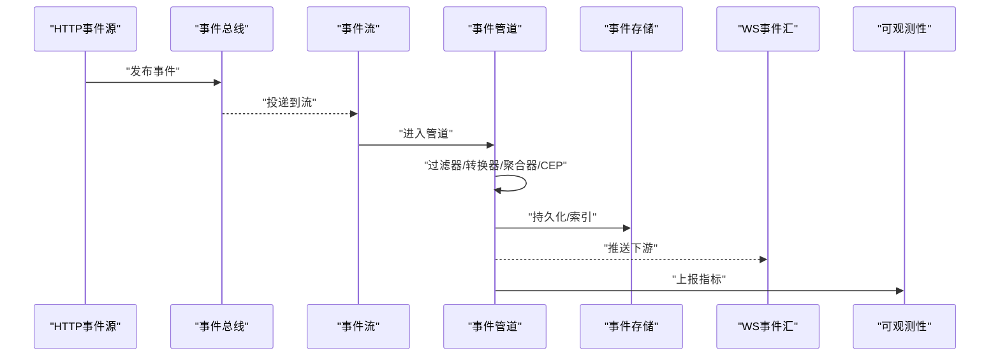
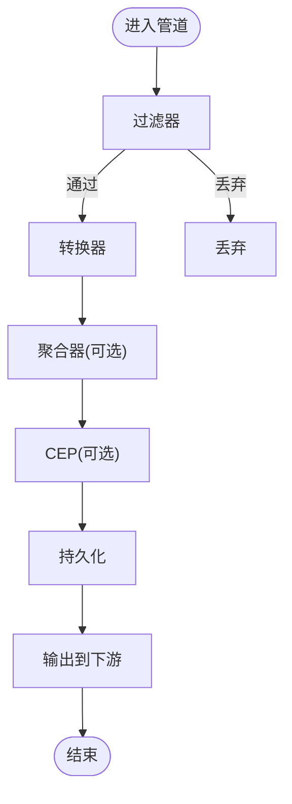
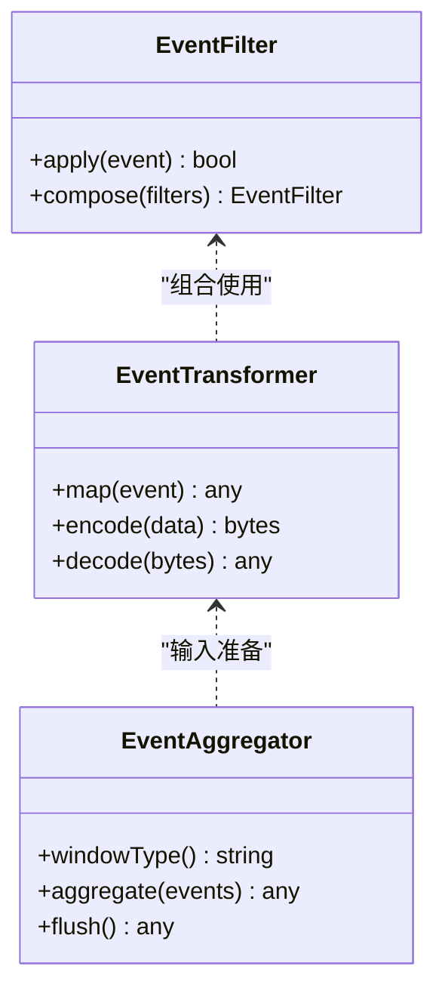
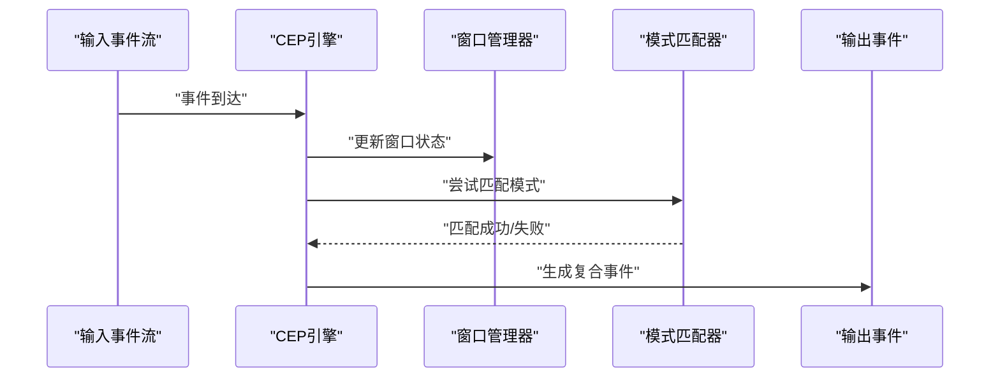
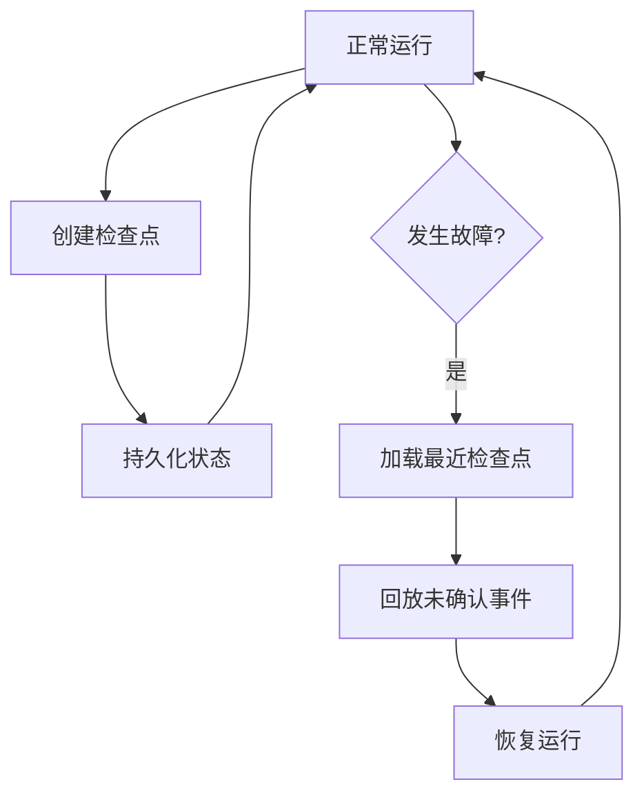
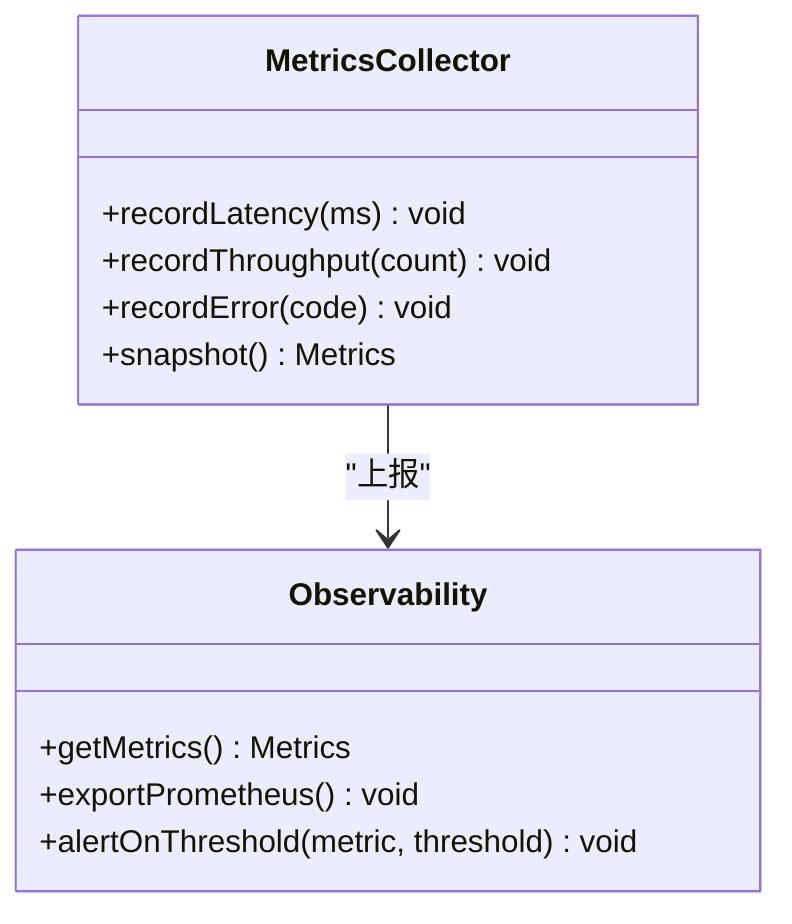
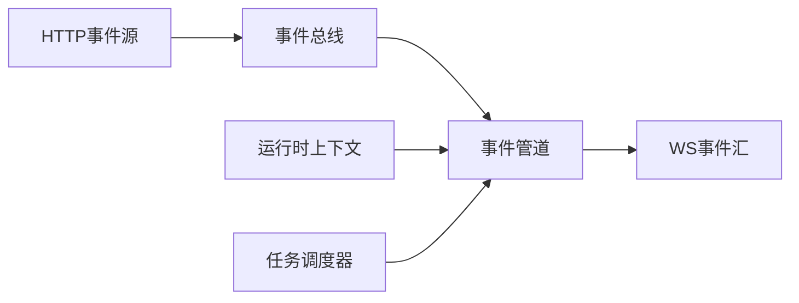
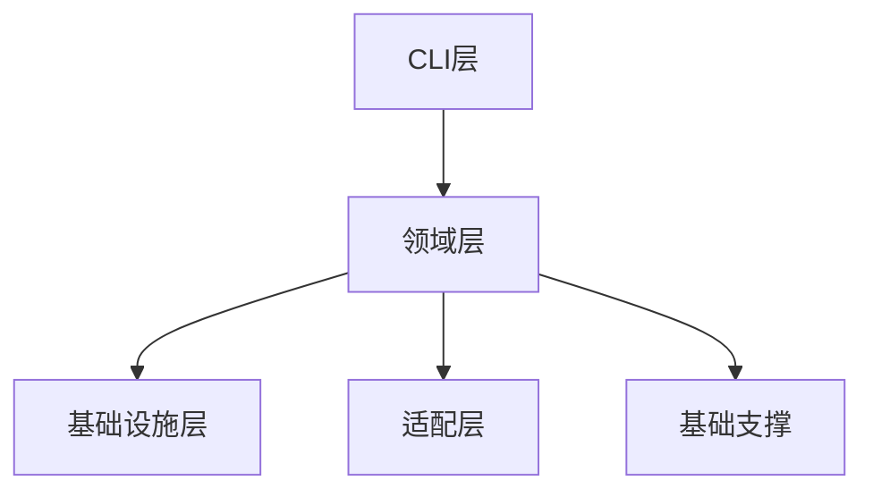

# 事件流处理

<cite>
**本文引用的文件**   
- [engine/README.md](file://engine/README.md)
- [engine/package.json](file://engine/package.json)
- [engine/pnpm-workspace.yaml](file://engine/pnpm-workspace.yaml)
- [engine/packages/engine/src/index.ts](file://engine/packages/engine/src/index.ts)
- [engine/packages/domain-layer/src/events/event-bus.ts](file://engine/packages/domain-layer/src/events/event-bus.ts)
- [engine/packages/domain-layer/src/events/event-store.ts](file://engine/packages/domain-layer/src/events/event-store.ts)
- [engine/packages/domain-layer/src/events/event-stream.ts](file://engine/packages/domain-layer/src/events/event-stream.ts)
- [engine/packages/domain-layer/src/events/event-pipeline.ts](file://engine/packages/domain-layer/src/events/event-pipeline.ts)
- [engine/packages/domain-layer/src/events/event-filter.ts](file://engine/packages/domain-layer/src/events/event-filter.ts)
- [engine/packages/domain-layer/src/events/event-transformer.ts](file://engine/packages/domain-layer/src/events/event-transformer.ts)
- [engine/packages/domain-layer/src/events/event-aggregator.ts](file://engine/packages/domain-layer/src/events/event-aggregator.ts)
- [engine/packages/domain-layer/src/events/cep-engine.ts](file://engine/packages/domain-layer/src/events/cep-engine.ts)
- [engine/packages/domain-layer/src/events/checkpoint-manager.ts](file://engine/packages/domain-layer/src/events/checkpoint-manager.ts)
- [engine/packages/domain-layer/src/events/recovery-manager.ts](file://engine/packages/domain-layer/src/events/recovery-manager.ts)
- [engine/packages/domain-layer/src/events/metrics-collector.ts](file://engine/packages/domain-layer/src/events/metrics-collector.ts)
- [engine/packages/domain-layer/src/events/observability.ts](file://engine/packages/domain-layer/src/events/observability.ts)
- [engine/packages/foundation/src/runtime/runtime-context.ts](file://engine/packages/foundation/src/runtime/runtime-context.ts)
- [engine/packages/foundation/src/runtime/task-scheduler.ts](file://engine/packages/foundation/src/runtime/task-scheduler.ts)
- [engine/packages/infrastructure/src/storage/file-event-store.ts](file://engine/packages/infrastructure/src/storage/file-event-store.ts)
- [engine/packages/infrastructure/src/storage/memory-event-store.ts](file://engine/packages/infrastructure/src/storage/memory-event-store.ts)
- [engine/packages/adapters/http/src/http-event-source.ts](file://engine/packages/adapters/http/src/http-event-source.ts)
- [engine/packages/adapters/ws/src/ws-event-sink.ts](file://engine/packages/adapters/ws/src/ws-event-sink.ts)
- [engine/packages/cli-layer/src/cli-runner.ts](file://engine/packages/cli-layer/src/cli-runner.ts)
- [engine/scripts/verify-evented-a2a.mjs](file://engine/scripts/verify-evented-a2a.mjs)
</cite>

## 目录
1. [简介](#简介)
2. [项目结构](#项目结构)
3. [核心组件](#核心组件)
4. [架构总览](#架构总览)
5. [详细组件分析](#详细组件分析)
6. [依赖关系分析](#依赖关系分析)
7. [性能考虑](#性能考虑)
8. [故障排查指南](#故障排查指南)
9. [结论](#结论)
10. [附录](#附录)

## 简介
本技术文档围绕KCoder的事件流处理系统，系统性阐述事件流的概念与优势（实时数据处理、流式计算、窗口操作），并深入解析事件管道的架构设计（管道构建、节点连接、数据流向控制）、过滤器与转换器实现（条件过滤、数据映射、格式转换、聚合）、复杂事件处理（CEP）支持（模式匹配、时间窗口、统计计算）、容错机制（检查点、故障恢复、一致性）、可观测性工具（实时监控、延迟检测、吞吐统计），以及性能优化策略与扩展开发指南。

## 项目结构
KCoder采用多包工作区组织，事件流相关能力主要分布在以下包：
- domain-layer：领域层定义事件总线、事件存储、事件流、事件管道、过滤器、转换器、聚合器、CEP引擎、检查点与恢复管理、指标收集与可观测性接口等。
- infrastructure：基础设施层提供持久化存储适配器（内存/文件）。
- adapters：适配层提供HTTP事件源与WebSocket事件汇等I/O适配器。
- foundation：运行时上下文与任务调度等基础支撑。
- cli-layer：命令行入口用于运行验证脚本与示例。
- scripts：包含端到端验证脚本，如事件驱动A2A流程验证。

```mermaid
graph TB
subgraph "领域层(domain-layer)"
EB["事件总线<br/>event-bus.ts"]
ES["事件存储<br/>event-store.ts"]
EStream["事件流<br/>event-stream.ts"]
EPipe["事件管道<br/>event-pipeline.ts"]
EFilter["事件过滤器<br/>event-filter.ts"]
ETrans["事件转换器<br/>event-transformer.ts"]
EAgg["事件聚合器<br/>event-aggregator.ts"]
CEP["CEP引擎<br/>cep-engine.ts"]
CKPT["检查点管理器<br/>checkpoint-manager.ts"]
RECOV["恢复管理器<br/>recovery-manager.ts"]
METRICS["指标收集器<br/>metrics-collector.ts"]
OBS["可观测性接口<br/>observability.ts"]
end
subgraph "基础设施(infrastructure)"
FStore["文件事件存储<br/>file-event-store.ts"]
MStore["内存事件存储<br/>memory-event-store.ts"]
end
subgraph "适配层(adapters)"
HTTPSrc["HTTP事件源<br/>http-event-source.ts"]
WSSink["WS事件汇<br/>ws-event-sink.ts"]
end
subgraph "基础支撑(foundation)"
RCtx["运行时上下文<br/>runtime-context.ts"]
Sched["任务调度器<br/>task-scheduler.ts"]
end
subgraph "CLI"
CLI["CLI运行器<br/>cli-runner.ts"]
end
EB --> EStream
EStream --> EPipe
EPipe --> EFilter
EPipe --> ETrans
EPipe --> EAgg
EPipe --> CEP
EPipe --> ES
ES --> FStore
ES --> MStore
HTTPSrc --> EB
WSSink --> EB
CKPT --> ES
RECOV --> ES
METRICS --> OBS
RCtx --> EPipe
Sched --> EPipe
CLI --> EPipe
```

图表来源
- [engine/packages/domain-layer/src/events/event-bus.ts](file://engine/packages/domain-layer/src/events/event-bus.ts)
- [engine/packages/domain-layer/src/events/event-store.ts](file://engine/packages/domain-layer/src/events/event-store.ts)
- [engine/packages/domain-layer/src/events/event-stream.ts](file://engine/packages/domain-layer/src/events/event-stream.ts)
- [engine/packages/domain-layer/src/events/event-pipeline.ts](file://engine/packages/domain-layer/src/events/event-pipeline.ts)
- [engine/packages/domain-layer/src/events/event-filter.ts](file://engine/packages/domain-layer/src/events/event-filter.ts)
- [engine/packages/domain-layer/src/events/event-transformer.ts](file://engine/packages/domain-layer/src/events/event-transformer.ts)
- [engine/packages/domain-layer/src/events/event-aggregator.ts](file://engine/packages/domain-layer/src/events/event-aggregator.ts)
- [engine/packages/domain-layer/src/events/cep-engine.ts](file://engine/packages/domain-layer/src/events/cep-engine.ts)
- [engine/packages/domain-layer/src/events/checkpoint-manager.ts](file://engine/packages/domain-layer/src/events/checkpoint-manager.ts)
- [engine/packages/domain-layer/src/events/recovery-manager.ts](file://engine/packages/domain-layer/src/events/recovery-manager.ts)
- [engine/packages/domain-layer/src/events/metrics-collector.ts](file://engine/packages/domain-layer/src/events/metrics-collector.ts)
- [engine/packages/domain-layer/src/events/observability.ts](file://engine/packages/domain-layer/src/events/observability.ts)
- [engine/packages/infrastructure/src/storage/file-event-store.ts](file://engine/packages/infrastructure/src/storage/file-event-store.ts)
- [engine/packages/infrastructure/src/storage/memory-event-store.ts](file://engine/packages/infrastructure/src/storage/memory-event-store.ts)
- [engine/packages/adapters/http/src/http-event-source.ts](file://engine/packages/adapters/http/src/http-event-source.ts)
- [engine/packages/adapters/ws/src/ws-event-sink.ts](file://engine/packages/adapters/ws/src/ws-event-sink.ts)
- [engine/packages/foundation/src/runtime/runtime-context.ts](file://engine/packages/foundation/src/runtime/runtime-context.ts)
- [engine/packages/foundation/src/runtime/task-scheduler.ts](file://engine/packages/foundation/src/runtime/task-scheduler.ts)
- [engine/packages/cli-layer/src/cli-runner.ts](file://engine/packages/cli-layer/src/cli-runner.ts)

章节来源
- [engine/README.md](file://engine/README.md)
- [engine/package.json](file://engine/package.json)
- [engine/pnpm-workspace.yaml](file://engine/pnpm-workspace.yaml)

## 核心组件
- 事件总线：负责事件的发布/订阅与路由分发，是事件流的入站枢纽。
- 事件存储：抽象事件持久化接口，提供追加写入、按序读取、回溯重放能力。
- 事件流：封装事件生命周期与背压控制，协调上游生产与下游消费。
- 事件管道：将多个处理节点（过滤器、转换器、聚合器、CEP）串联成有向图，控制数据流向与执行顺序。
- 事件过滤器：基于条件对事件进行筛选，支持组合谓词与短路逻辑。
- 事件转换器：完成数据映射与格式转换，支持链式变换与错误隔离。
- 事件聚合器：在时间或计数窗口内对事件进行聚合计算，输出汇总结果。
- CEP引擎：提供模式匹配、时间窗口与统计计算，支持复杂事件识别与触发。
- 检查点管理器：周期性保存状态快照，保障幂等与一致性。
- 恢复管理器：从最近检查点恢复状态，保证故障后继续处理。
- 指标收集器与可观测性：采集延迟、吞吐、错误率等指标，暴露监控接口。

章节来源
- [engine/packages/domain-layer/src/events/event-bus.ts](file://engine/packages/domain-layer/src/events/event-bus.ts)
- [engine/packages/domain-layer/src/events/event-store.ts](file://engine/packages/domain-layer/src/events/event-store.ts)
- [engine/packages/domain-layer/src/events/event-stream.ts](file://engine/packages/domain-layer/src/events/event-stream.ts)
- [engine/packages/domain-layer/src/events/event-pipeline.ts](file://engine/packages/domain-layer/src/events/event-pipeline.ts)
- [engine/packages/domain-layer/src/events/event-filter.ts](file://engine/packages/domain-layer/src/events/event-filter.ts)
- [engine/packages/domain-layer/src/events/event-transformer.ts](file://engine/packages/domain-layer/src/events/event-transformer.ts)
- [engine/packages/domain-layer/src/events/event-aggregator.ts](file://engine/packages/domain-layer/src/events/event-aggregator.ts)
- [engine/packages/domain-layer/src/events/cep-engine.ts](file://engine/packages/domain-layer/src/events/cep-engine.ts)
- [engine/packages/domain-layer/src/events/checkpoint-manager.ts](file://engine/packages/domain-layer/src/events/checkpoint-manager.ts)
- [engine/packages/domain-layer/src/events/recovery-manager.ts](file://engine/packages/domain-layer/src/events/recovery-manager.ts)
- [engine/packages/domain-layer/src/events/metrics-collector.ts](file://engine/packages/domain-layer/src/events/metrics-collector.ts)
- [engine/packages/domain-layer/src/events/observability.ts](file://engine/packages/domain-layer/src/events/observability.ts)

## 架构总览
事件流处理以“生产者—总线—管道—消费者”为核心路径，结合持久化与可观测性形成闭环。



图表来源
- [engine/packages/adapters/http/src/http-event-source.ts](file://engine/packages/adapters/http/src/http-event-source.ts)
- [engine/packages/domain-layer/src/events/event-bus.ts](file://engine/packages/domain-layer/src/events/event-bus.ts)
- [engine/packages/domain-layer/src/events/event-stream.ts](file://engine/packages/domain-layer/src/events/event-stream.ts)
- [engine/packages/domain-layer/src/events/event-pipeline.ts](file://engine/packages/domain-layer/src/events/event-pipeline.ts)
- [engine/packages/domain-layer/src/events/event-store.ts](file://engine/packages/domain-layer/src/events/event-store.ts)
- [engine/packages/adapters/ws/src/ws-event-sink.ts](file://engine/packages/adapters/ws/src/ws-event-sink.ts)
- [engine/packages/domain-layer/src/events/observability.ts](file://engine/packages/domain-layer/src/events/observability.ts)

## 详细组件分析

### 事件管道与节点连接
- 管道构建：通过声明式API注册节点类型（过滤器、转换器、聚合器、CEP），并以拓扑方式连接。
- 节点连接：每个节点具备输入/输出契约，支持扇出/扇入与分支合并。
- 数据流向控制：基于背压与令牌桶限流，确保上游不压垮下游；支持重试与死信队列。



图表来源
- [engine/packages/domain-layer/src/events/event-pipeline.ts](file://engine/packages/domain-layer/src/events/event-pipeline.ts)
- [engine/packages/domain-layer/src/events/event-filter.ts](file://engine/packages/domain-layer/src/events/event-filter.ts)
- [engine/packages/domain-layer/src/events/event-transformer.ts](file://engine/packages/domain-layer/src/events/event-transformer.ts)
- [engine/packages/domain-layer/src/events/event-aggregator.ts](file://engine/packages/domain-layer/src/events/event-aggregator.ts)
- [engine/packages/domain-layer/src/events/cep-engine.ts](file://engine/packages/domain-layer/src/events/cep-engine.ts)

章节来源
- [engine/packages/domain-layer/src/events/event-pipeline.ts](file://engine/packages/domain-layer/src/events/event-pipeline.ts)

### 事件过滤器与转换器
- 条件过滤：支持单条件与复合条件，短路求值，提升吞吐。
- 数据映射：字段级映射、类型转换、默认值填充。
- 格式转换：JSON/Protobuf/自定义编解码，兼容不同上下游协议。
- 错误隔离：单个节点异常不影响整体管道，错误事件进入监控与告警通道。



图表来源
- [engine/packages/domain-layer/src/events/event-filter.ts](file://engine/packages/domain-layer/src/events/event-filter.ts)
- [engine/packages/domain-layer/src/events/event-transformer.ts](file://engine/packages/domain-layer/src/events/event-transformer.ts)
- [engine/packages/domain-layer/src/events/event-aggregator.ts](file://engine/packages/domain-layer/src/events/event-aggregator.ts)

章节来源
- [engine/packages/domain-layer/src/events/event-filter.ts](file://engine/packages/domain-layer/src/events/event-filter.ts)
- [engine/packages/domain-layer/src/events/event-transformer.ts](file://engine/packages/domain-layer/src/events/event-transformer.ts)
- [engine/packages/domain-layer/src/events/event-aggregator.ts](file://engine/packages/domain-layer/src/events/event-aggregator.ts)

### 复杂事件处理（CEP）
- 模式匹配：支持序列、并行、选择与否定模式，允许带时间约束的匹配。
- 时间窗口：滑动窗口、滚动窗口、会话窗口，支持迟到事件处理。
- 统计计算：均值、方差、分位数、TopN等常用统计算子。



图表来源
- [engine/packages/domain-layer/src/events/cep-engine.ts](file://engine/packages/domain-layer/src/events/cep-engine.ts)

章节来源
- [engine/packages/domain-layer/src/events/cep-engine.ts](file://engine/packages/domain-layer/src/events/cep-engine.ts)

### 容错机制：检查点与恢复
- 检查点：周期性快照事件偏移量、窗口状态、聚合器状态，落盘持久化。
- 故障恢复：启动时加载最近检查点，回放未确认事件，保证至少一次语义。
- 一致性：幂等写入与事务边界，避免重复处理导致的数据不一致。



图表来源
- [engine/packages/domain-layer/src/events/checkpoint-manager.ts](file://engine/packages/domain-layer/src/events/checkpoint-manager.ts)
- [engine/packages/domain-layer/src/events/recovery-manager.ts](file://engine/packages/domain-layer/src/events/recovery-manager.ts)
- [engine/packages/domain-layer/src/events/event-store.ts](file://engine/packages/domain-layer/src/events/event-store.ts)

章节来源
- [engine/packages/domain-layer/src/events/checkpoint-manager.ts](file://engine/packages/domain-layer/src/events/checkpoint-manager.ts)
- [engine/packages/domain-layer/src/events/recovery-manager.ts](file://engine/packages/domain-layer/src/events/recovery-manager.ts)
- [engine/packages/domain-layer/src/events/event-store.ts](file://engine/packages/domain-layer/src/events/event-store.ts)

### 可观测性与监控
- 实时监控：事件到达速率、处理延迟、错误率、窗口水位线。
- 延迟检测：端到端延迟分布、P95/P99分位。
- 吞吐统计：每秒事件数、字节数、CPU/内存占用。



图表来源
- [engine/packages/domain-layer/src/events/metrics-collector.ts](file://engine/packages/domain-layer/src/events/metrics-collector.ts)
- [engine/packages/domain-layer/src/events/observability.ts](file://engine/packages/domain-layer/src/events/observability.ts)

章节来源
- [engine/packages/domain-layer/src/events/metrics-collector.ts](file://engine/packages/domain-layer/src/events/metrics-collector.ts)
- [engine/packages/domain-layer/src/events/observability.ts](file://engine/packages/domain-layer/src/events/observability.ts)

### I/O适配器与运行时支撑
- HTTP事件源：接收外部HTTP请求，转换为内部事件并发布至总线。
- WS事件汇：将处理后的事件推送到客户端，支持断线重连与背压。
- 运行时上下文：提供配置、日志、追踪ID等上下文信息。
- 任务调度器：负责任务编排、并发度控制与资源隔离。



图表来源
- [engine/packages/adapters/http/src/http-event-source.ts](file://engine/packages/adapters/http/src/http-event-source.ts)
- [engine/packages/adapters/ws/src/ws-event-sink.ts](file://engine/packages/adapters/ws/src/ws-event-sink.ts)
- [engine/packages/foundation/src/runtime/runtime-context.ts](file://engine/packages/foundation/src/runtime/runtime-context.ts)
- [engine/packages/foundation/src/runtime/task-scheduler.ts](file://engine/packages/foundation/src/runtime/task-scheduler.ts)

章节来源
- [engine/packages/adapters/http/src/http-event-source.ts](file://engine/packages/adapters/http/src/http-event-source.ts)
- [engine/packages/adapters/ws/src/ws-event-sink.ts](file://engine/packages/adapters/ws/src/ws-event-sink.ts)
- [engine/packages/foundation/src/runtime/runtime-context.ts](file://engine/packages/foundation/src/runtime/runtime-context.ts)
- [engine/packages/foundation/src/runtime/task-scheduler.ts](file://engine/packages/foundation/src/runtime/task-scheduler.ts)

## 依赖关系分析
- 低耦合高内聚：领域层仅依赖接口，基础设施与适配层实现具体IO与存储。
- 直接依赖：管道依赖过滤器、转换器、聚合器、CEP；检查点与恢复依赖事件存储。
- 间接依赖：CLI通过管道调用领域层；运行时上下文贯穿各组件。



图表来源
- [engine/packages/domain-layer/src/events/event-pipeline.ts](file://engine/packages/domain-layer/src/events/event-pipeline.ts)
- [engine/packages/infrastructure/src/storage/file-event-store.ts](file://engine/packages/infrastructure/src/storage/file-event-store.ts)
- [engine/packages/infrastructure/src/storage/memory-event-store.ts](file://engine/packages/infrastructure/src/storage/memory-event-store.ts)
- [engine/packages/adapters/http/src/http-event-source.ts](file://engine/packages/adapters/http/src/http-event-source.ts)
- [engine/packages/adapters/ws/src/ws-event-sink.ts](file://engine/packages/adapters/ws/src/ws-event-sink.ts)
- [engine/packages/foundation/src/runtime/runtime-context.ts](file://engine/packages/foundation/src/runtime/runtime-context.ts)
- [engine/packages/cli-layer/src/cli-runner.ts](file://engine/packages/cli-layer/src/cli-runner.ts)

章节来源
- [engine/packages/domain-layer/src/events/event-pipeline.ts](file://engine/packages/domain-layer/src/events/event-pipeline.ts)
- [engine/packages/infrastructure/src/storage/file-event-store.ts](file://engine/packages/infrastructure/src/storage/file-event-store.ts)
- [engine/packages/infrastructure/src/storage/memory-event-store.ts](file://engine/packages/infrastructure/src/storage/memory-event-store.ts)
- [engine/packages/adapters/http/src/http-event-source.ts](file://engine/packages/adapters/http/src/http-event-source.ts)
- [engine/packages/adapters/ws/src/ws-event-sink.ts](file://engine/packages/adapters/ws/src/ws-event-sink.ts)
- [engine/packages/foundation/src/runtime/runtime-context.ts](file://engine/packages/foundation/src/runtime/runtime-context.ts)
- [engine/packages/cli-layer/src/cli-runner.ts](file://engine/packages/cli-layer/src/cli-runner.ts)

## 性能考虑
- 批处理与批量持久化：减少磁盘与网络往返，提高吞吐。
- 背压与限流：防止下游过载，保持系统稳定。
- 窗口优化：合理设置窗口大小与滑动步长，平衡延迟与准确性。
- 并行与分区：按事件键分区，提升并行度与缓存命中率。
- 序列化与压缩：降低传输与存储开销。
- 检查点频率：权衡一致性与性能，避免频繁落盘。

[本节为通用指导，无需特定文件引用]

## 故障排查指南
- 常见问题定位：
  - 事件丢失：检查事件存储是否持久化成功、检查点是否完整。
  - 重复处理：确认消费者幂等性与事务边界。
  - 延迟升高：观察窗口水位线与背压信号，调整并发度与批大小。
  - 模式匹配失败：核对CEP模式定义与时间约束。
- 诊断手段：
  - 查看指标面板：延迟、吞吐、错误率趋势。
  - 导出追踪链路：定位慢节点与瓶颈。
  - 回放事件：从检查点重放，复现问题。

章节来源
- [engine/packages/domain-layer/src/events/checkpoint-manager.ts](file://engine/packages/domain-layer/src/events/checkpoint-manager.ts)
- [engine/packages/domain-layer/src/events/recovery-manager.ts](file://engine/packages/domain-layer/src/events/recovery-manager.ts)
- [engine/packages/domain-layer/src/events/metrics-collector.ts](file://engine/packages/domain-layer/src/events/metrics-collector.ts)
- [engine/packages/domain-layer/src/events/observability.ts](file://engine/packages/domain-layer/src/events/observability.ts)

## 结论
KCoder事件流处理系统以清晰的领域分层与可扩展的管道模型为基础，提供强大的过滤、转换、聚合与CEP能力，并通过检查点与恢复机制保障容错与一致性。配合完善的可观测性工具与性能优化策略，能够满足实时数据处理与复杂业务场景的需求。

[本节为总结性内容，无需特定文件引用]

## 附录
- 快速开始：
  - 安装与依赖：参考工程根配置与工作区说明。
  - 运行验证：使用CLI运行事件驱动A2A验证脚本，观察端到端流程。
- 扩展开发指南：
  - 新增处理器：实现过滤器/转换器/聚合器接口，注册到管道。
  - 自定义存储：实现事件存储接口，替换默认实现。
  - 接入新I/O：实现HTTP事件源或WS事件汇适配器。

章节来源
- [engine/pnpm-workspace.yaml](file://engine/pnpm-workspace.yaml)
- [engine/scripts/verify-evented-a2a.mjs](file://engine/scripts/verify-evented-a2a.mjs)
- [engine/packages/cli-layer/src/cli-runner.ts](file://engine/packages/cli-layer/src/cli-runner.ts)