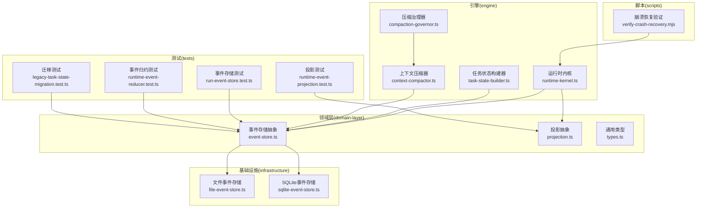
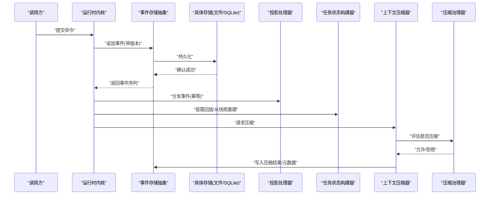
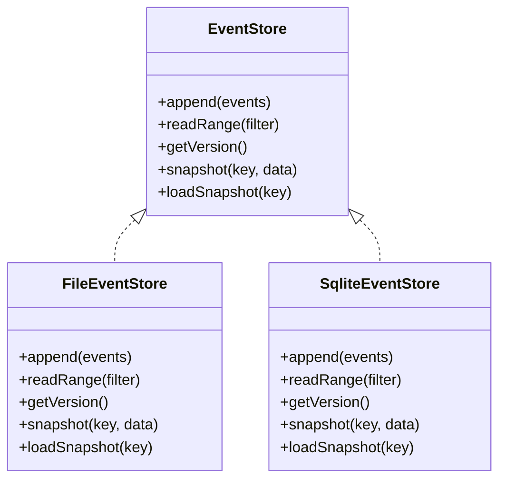
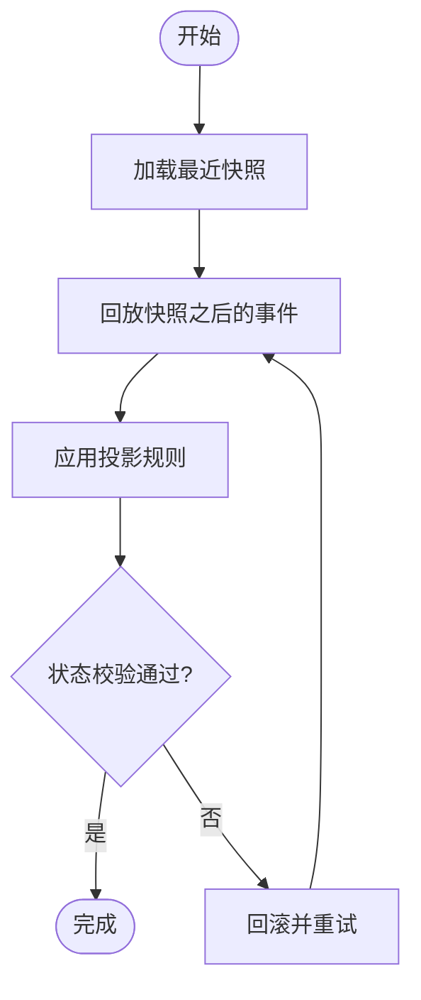
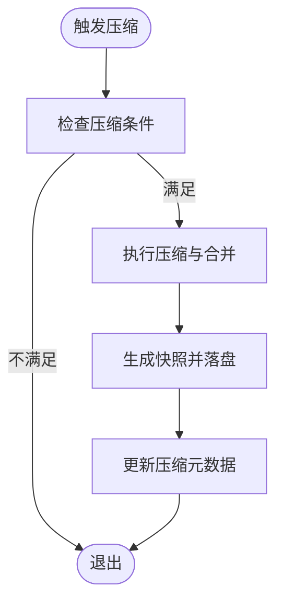
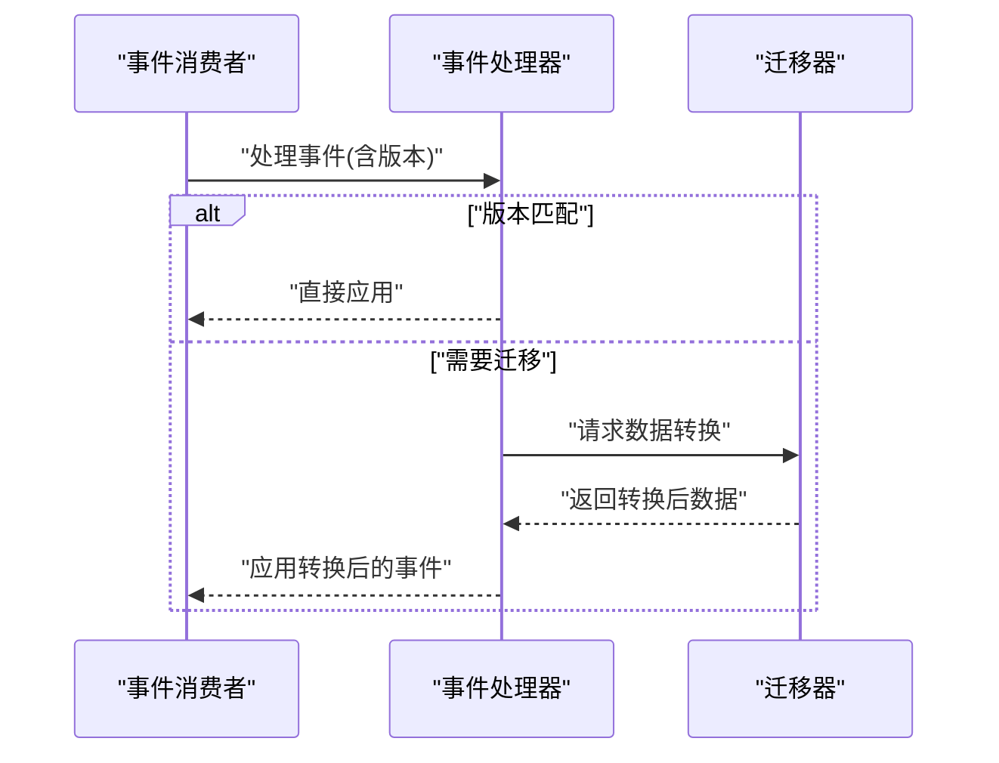
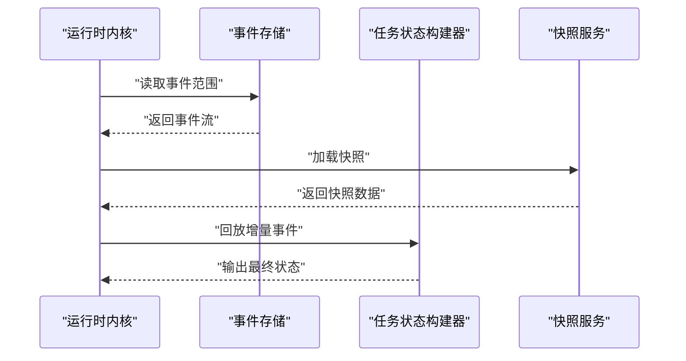
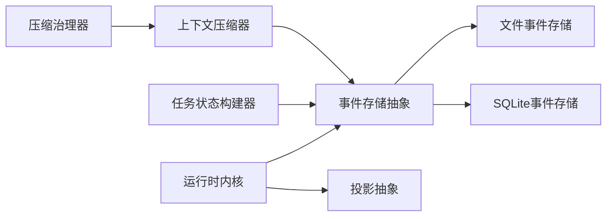

# 事件溯源

<cite>
**本文引用的文件**   
- [engine/packages/domain-layer/src/event-store.ts](file://engine/packages/domain-layer/src/event-store.ts)
- [engine/packages/domain-layer/src/projection.ts](file://engine/packages/domain-layer/src/projection.ts)
- [engine/packages/infrastructure/src/persistence/file-event-store.ts](file://engine/packages/infrastructure/src/persistence/file-event-store.ts)
- [engine/packages/infrastructure/src/persistence/sqlite-event-store.ts](file://engine/packages/infrastructure/src/persistence/sqlite-event-store.ts)
- [engine/packages/engine/src/runtime-kernel.ts](file://engine/packages/engine/src/runtime-kernel.ts)
- [engine/packages/engine/src/task-state-builder.ts](file://engine/packages/engine/src/task-state-builder.ts)
- [engine/packages/engine/src/context-compactor.ts](file://engine/packages/engine/src/context-compactor.ts)
- [engine/packages/engine/src/compaction-governor.ts](file://engine/packages/engine/src/compaction-governor.ts)
- [engine/packages/foundation/src/types.ts](file://engine/packages/foundation/src/types.ts)
- [engine/tests/run-event-store.test.ts](file://engine/tests/run-event-store.test.ts)
- [engine/tests/runtime-event-reducer.test.ts](file://engine/tests/runtime-event-reducer.test.ts)
- [engine/tests/runtime-event-projection.test.ts](file://engine/tests/runtime-event-projection.test.ts)
- [engine/tests/legacy-task-state-migration.test.ts](file://engine/tests/legacy-task-state-migration.test.ts)
- [engine/scripts/verify-crash-recovery.mjs](file://engine/scripts/verify-crash-recovery.mjs)
</cite>

## 目录
1. [简介](#简介)
2. [项目结构](#项目结构)
3. [核心组件](#核心组件)
4. [架构总览](#架构总览)
5. [详细组件分析](#详细组件分析)
6. [依赖分析](#依赖分析)
7. [性能考量](#性能考量)
8. [故障排查指南](#故障排查指南)
9. [结论](#结论)
10. [附录](#附录)

## 简介
本技术文档围绕KCoder的事件溯源实现，系统阐述其设计原则与工程落地。重点覆盖：
- 状态不可变性与事件作为事实源
- 投影机制与状态重建
- 事件存储架构（持久化、版本控制、索引策略、查询优化）
- 快照机制（创建时机、压缩算法、增量更新）
- 事件版本管理与迁移策略
- 调试与分析工具（事件浏览器、状态验证器、性能分析器）
- 扩展开发与部署指南

## 项目结构
KCoder采用多包分层架构，事件溯源相关能力主要分布在以下包：
- domain-layer：领域模型与接口定义（事件、聚合根、事件存储抽象、投影抽象等）
- infrastructure：基础设施实现（文件/SQLite事件存储、序列化、事务等）
- engine：运行时内核、任务状态构建、上下文压缩与压缩治理
- foundation：通用类型与契约
- tests：端到端与单元测试，覆盖回放、投影、迁移、崩溃恢复等场景
- scripts：脚本用于验证关键路径（如崩溃恢复）

图表来源
- [engine/packages/domain-layer/src/event-store.ts](file://engine/packages/domain-layer/src/event-store.ts)
- [engine/packages/domain-layer/src/projection.ts](file://engine/packages/domain-layer/src/projection.ts)
- [engine/packages/infrastructure/src/persistence/file-event-store.ts](file://engine/packages/infrastructure/src/persistence/file-event-store.ts)
- [engine/packages/infrastructure/src/persistence/sqlite-event-store.ts](file://engine/packages/infrastructure/src/persistence/sqlite-event-store.ts)
- [engine/packages/engine/src/runtime-kernel.ts](file://engine/packages/engine/src/runtime-kernel.ts)
- [engine/packages/engine/src/task-state-builder.ts](file://engine/packages/engine/src/task-state-builder.ts)
- [engine/packages/engine/src/context-compactor.ts](file://engine/packages/engine/src/context-compactor.ts)
- [engine/packages/engine/src/compaction-governor.ts](file://engine/packages/engine/src/compaction-governor.ts)
- [engine/tests/run-event-store.test.ts](file://engine/tests/run-event-store.test.ts)
- [engine/tests/runtime-event-reducer.test.ts](file://engine/tests/runtime-event-reducer.test.ts)
- [engine/tests/runtime-event-projection.test.ts](file://engine/tests/runtime-event-projection.test.ts)
- [engine/tests/legacy-task-state-migration.test.ts](file://engine/tests/legacy-task-state-migration.test.ts)
- [engine/scripts/verify-crash-recovery.mjs](file://engine/scripts/verify-crash-recovery.mjs)

章节来源
- [engine/packages/domain-layer/src/event-store.ts](file://engine/packages/domain-layer/src/event-store.ts)
- [engine/packages/domain-layer/src/projection.ts](file://engine/packages/domain-layer/src/projection.ts)
- [engine/packages/infrastructure/src/persistence/file-event-store.ts](file://engine/packages/infrastructure/src/persistence/file-event-store.ts)
- [engine/packages/infrastructure/src/persistence/sqlite-event-store.ts](file://engine/packages/infrastructure/src/persistence/sqlite-event-store.ts)
- [engine/packages/engine/src/runtime-kernel.ts](file://engine/packages/engine/src/runtime-kernel.ts)
- [engine/packages/engine/src/task-state-builder.ts](file://engine/packages/engine/src/task-state-builder.ts)
- [engine/packages/engine/src/context-compactor.ts](file://engine/packages/engine/src/context-compactor.ts)
- [engine/packages/engine/src/compaction-governor.ts](file://engine/packages/engine/src/compaction-governor.ts)
- [engine/packages/foundation/src/types.ts](file://engine/packages/foundation/src/types.ts)
- [engine/tests/run-event-store.test.ts](file://engine/tests/run-event-store.test.ts)
- [engine/tests/runtime-event-reducer.test.ts](file://engine/tests/runtime-event-reducer.test.ts)
- [engine/tests/runtime-event-projection.test.ts](file://engine/tests/runtime-event-projection.test.ts)
- [engine/tests/legacy-task-state-migration.test.ts](file://engine/tests/legacy-task-state-migration.test.ts)
- [engine/scripts/verify-crash-recovery.mjs](file://engine/scripts/verify-crash-recovery.mjs)

## 核心组件
- 事件存储抽象：定义事件的追加、按范围读取、版本控制、一致性语义等接口，供上层使用与替换底层实现。
- 投影抽象：定义从事件流到可读视图的映射规则，支持幂等处理与增量更新。
- 运行时内核：协调事件写入、回放、快照与压缩，保证状态一致性与可恢复性。
- 任务状态构建器：基于事件流重建任务状态，支持从快照起点回放以提升性能。
- 上下文压缩器与治理器：对历史事件进行压缩与合并，降低存储与回放成本，同时保持可追溯性。

章节来源
- [engine/packages/domain-layer/src/event-store.ts](file://engine/packages/domain-layer/src/event-store.ts)
- [engine/packages/domain-layer/src/projection.ts](file://engine/packages/domain-layer/src/projection.ts)
- [engine/packages/engine/src/runtime-kernel.ts](file://engine/packages/engine/src/runtime-kernel.ts)
- [engine/packages/engine/src/task-state-builder.ts](file://engine/packages/engine/src/task-state-builder.ts)
- [engine/packages/engine/src/context-compactor.ts](file://engine/packages/engine/src/context-compactor.ts)
- [engine/packages/engine/src/compaction-governor.ts](file://engine/packages/engine/src/compaction-governor.ts)

## 架构总览
事件溯源在KCoder中的整体流程如下：
- 命令进入运行时内核，生成领域事件并追加至事件存储
- 投影处理器消费事件，维护读模型
- 任务状态构建器通过回放事件或从快照回放重建状态
- 压缩治理器周期性触发上下文压缩，减少事件体积
- 基础设施层提供多种事件存储后端（文件、SQLite），统一抽象

图表来源
- [engine/packages/engine/src/runtime-kernel.ts](file://engine/packages/engine/src/runtime-kernel.ts)
- [engine/packages/domain-layer/src/event-store.ts](file://engine/packages/domain-layer/src/event-store.ts)
- [engine/packages/infrastructure/src/persistence/file-event-store.ts](file://engine/packages/infrastructure/src/persistence/file-event-store.ts)
- [engine/packages/infrastructure/src/persistence/sqlite-event-store.ts](file://engine/packages/infrastructure/src/persistence/sqlite-event-store.ts)
- [engine/packages/domain-layer/src/projection.ts](file://engine/packages/domain-layer/src/projection.ts)
- [engine/packages/engine/src/task-state-builder.ts](file://engine/packages/engine/src/task-state-builder.ts)
- [engine/packages/engine/src/context-compactor.ts](file://engine/packages/engine/src/context-compactor.ts)
- [engine/packages/engine/src/compaction-governor.ts](file://engine/packages/engine/src/compaction-governor.ts)

## 详细组件分析

### 事件存储抽象与实现
- 抽象职责
  - 事件追加：确保顺序与版本递增
  - 范围读取：支持按时间戳、版本号、聚合ID等维度检索
  - 一致性：提供至少一次投递与幂等处理保障
- 实现要点
  - 文件事件存储：以文件为单元落盘，适合单机与轻量部署
  - SQLite事件存储：利用关系型数据库的索引与事务能力，适合高并发与复杂查询

图表来源
- [engine/packages/domain-layer/src/event-store.ts](file://engine/packages/domain-layer/src/event-store.ts)
- [engine/packages/infrastructure/src/persistence/file-event-store.ts](file://engine/packages/infrastructure/src/persistence/file-event-store.ts)
- [engine/packages/infrastructure/src/persistence/sqlite-event-store.ts](file://engine/packages/infrastructure/src/persistence/sqlite-event-store.ts)

章节来源
- [engine/packages/domain-layer/src/event-store.ts](file://engine/packages/domain-layer/src/event-store.ts)
- [engine/packages/infrastructure/src/persistence/file-event-store.ts](file://engine/packages/infrastructure/src/persistence/file-event-store.ts)
- [engine/packages/infrastructure/src/persistence/sqlite-event-store.ts](file://engine/packages/infrastructure/src/persistence/sqlite-event-store.ts)

### 投影机制与状态重建
- 投影设计
  - 幂等处理：同一事件多次应用不改变最终状态
  - 增量更新：仅处理新增事件，避免全量重算
  - 错误隔离：单个事件失败不影响其他事件处理
- 状态重建
  - 从快照起点回放：缩短重建时间
  - 一致性校验：重建后与预期状态对比，确保正确性

图表来源
- [engine/packages/domain-layer/src/projection.ts](file://engine/packages/domain-layer/src/projection.ts)
- [engine/packages/engine/src/task-state-builder.ts](file://engine/packages/engine/src/task-state-builder.ts)

章节来源
- [engine/packages/domain-layer/src/projection.ts](file://engine/packages/domain-layer/src/projection.ts)
- [engine/packages/engine/src/task-state-builder.ts](file://engine/packages/engine/src/task-state-builder.ts)
- [engine/tests/runtime-event-projection.test.ts](file://engine/tests/runtime-event-projection.test.ts)

### 快照机制：创建时机、压缩算法、增量更新
- 创建时机
  - 达到阈值：事件数量或时间间隔满足条件时触发
  - 资源压力：内存占用过高或回放耗时过长时主动触发
- 压缩算法
  - 合并同类事件：将相邻且可合并的事件压缩为一条
  - 去重与精简：移除冗余字段，保留必要信息
- 增量更新
  - 基于上次快照位置继续累积
  - 记录压缩元数据，便于回溯与审计

图表来源
- [engine/packages/engine/src/context-compactor.ts](file://engine/packages/engine/src/context-compactor.ts)
- [engine/packages/engine/src/compaction-governor.ts](file://engine/packages/engine/src/compaction-governor.ts)

章节来源
- [engine/packages/engine/src/context-compactor.ts](file://engine/packages/engine/src/context-compactor.ts)
- [engine/packages/engine/src/compaction-governor.ts](file://engine/packages/engine/src/compaction-governor.ts)
- [engine/tests/compaction-governor.test.ts](file://engine/tests/compaction-governor.test.ts)
- [engine/tests/compaction-transaction.test.ts](file://engine/tests/compaction-transaction.test.ts)

### 事件版本管理与迁移策略
- 向后兼容
  - 事件模式演进：新增字段默认空值，删除字段标记废弃
  - 版本标识：每个事件携带版本，处理器根据版本选择适配逻辑
- 迁移策略
  - 渐进式迁移：旧版本处理器与新版本并存，逐步淘汰
  - 数据转换：在回放阶段进行数据格式转换，保证一致性

图表来源
- [engine/packages/foundation/src/types.ts](file://engine/packages/foundation/src/types.ts)
- [engine/tests/legacy-task-state-migration.test.ts](file://engine/tests/legacy-task-state-migration.test.ts)

章节来源
- [engine/packages/foundation/src/types.ts](file://engine/packages/foundation/src/types.ts)
- [engine/tests/legacy-task-state-migration.test.ts](file://engine/tests/legacy-task-state-migration.test.ts)

### 运行时内核与任务状态构建
- 运行时内核
  - 编排事件生命周期：写入、分发、回放、快照、压缩
  - 一致性保障：事务边界与幂等处理
- 任务状态构建器
  - 从快照+增量事件重建状态
  - 支持断点续建与重试

图表来源
- [engine/packages/engine/src/runtime-kernel.ts](file://engine/packages/engine/src/runtime-kernel.ts)
- [engine/packages/engine/src/task-state-builder.ts](file://engine/packages/engine/src/task-state-builder.ts)

章节来源
- [engine/packages/engine/src/runtime-kernel.ts](file://engine/packages/engine/src/runtime-kernel.ts)
- [engine/packages/engine/src/task-state-builder.ts](file://engine/packages/engine/src/task-state-builder.ts)
- [engine/tests/runtime-kernel-replay.test.ts](file://engine/tests/runtime-kernel-replay.test.ts)

## 依赖分析
- 耦合关系
  - 运行时内核依赖事件存储抽象与投影抽象，屏蔽底层实现差异
  - 任务状态构建器依赖事件存储与快照服务，负责状态重建
  - 压缩器与治理器协作，控制压缩策略与频率
- 外部依赖
  - 文件系统：文件事件存储依赖本地磁盘IO
  - SQLite：关系型数据库，提供事务与索引能力

图表来源
- [engine/packages/engine/src/runtime-kernel.ts](file://engine/packages/engine/src/runtime-kernel.ts)
- [engine/packages/domain-layer/src/event-store.ts](file://engine/packages/domain-layer/src/event-store.ts)
- [engine/packages/domain-layer/src/projection.ts](file://engine/packages/domain-layer/src/projection.ts)
- [engine/packages/infrastructure/src/persistence/file-event-store.ts](file://engine/packages/infrastructure/src/persistence/file-event-store.ts)
- [engine/packages/infrastructure/src/persistence/sqlite-event-store.ts](file://engine/packages/infrastructure/src/persistence/sqlite-event-store.ts)
- [engine/packages/engine/src/task-state-builder.ts](file://engine/packages/engine/src/task-state-builder.ts)
- [engine/packages/engine/src/context-compactor.ts](file://engine/packages/engine/src/context-compactor.ts)
- [engine/packages/engine/src/compaction-governor.ts](file://engine/packages/engine/src/compaction-governor.ts)

章节来源
- [engine/packages/engine/src/runtime-kernel.ts](file://engine/packages/engine/src/runtime-kernel.ts)
- [engine/packages/domain-layer/src/event-store.ts](file://engine/packages/domain-layer/src/event-store.ts)
- [engine/packages/domain-layer/src/projection.ts](file://engine/packages/domain-layer/src/projection.ts)
- [engine/packages/infrastructure/src/persistence/file-event-store.ts](file://engine/packages/infrastructure/src/persistence/file-event-store.ts)
- [engine/packages/infrastructure/src/persistence/sqlite-event-store.ts](file://engine/packages/infrastructure/src/persistence/sqlite-event-store.ts)
- [engine/packages/engine/src/task-state-builder.ts](file://engine/packages/engine/src/task-state-builder.ts)
- [engine/packages/engine/src/context-compactor.ts](file://engine/packages/engine/src/context-compactor.ts)
- [engine/packages/engine/src/compaction-governor.ts](file://engine/packages/engine/src/compaction-governor.ts)

## 性能考量
- 事件存储
  - 批量写入：减少IO次数，提升吞吐
  - 索引策略：针对常用查询维度建立索引，平衡写入与读取性能
- 回放与重建
  - 快照起点回放：显著缩短重建时间
  - 并行投影：对独立投影进行并行处理，提高吞吐量
- 压缩与存储
  - 合理压缩粒度：避免过度压缩导致CPU开销过大
  - 冷热分离：热数据常驻内存，冷数据归档至低成本存储

[本节为通用指导，无需特定文件引用]

## 故障排查指南
- 事件回放异常
  - 检查事件版本与处理器兼容性
  - 查看投影幂等性是否正确实现
- 状态不一致
  - 使用状态验证器对比重建结果与预期
  - 检查事务边界与一致性语义
- 性能问题
  - 分析回放耗时与压缩频率
  - 监控存储IO与数据库查询慢日志

章节来源
- [engine/tests/run-event-store.test.ts](file://engine/tests/run-event-store.test.ts)
- [engine/tests/runtime-event-reducer.test.ts](file://engine/tests/runtime-event-reducer.test.ts)
- [engine/tests/runtime-event-projection.test.ts](file://engine/tests/runtime-event-projection.test.ts)
- [engine/scripts/verify-crash-recovery.mjs](file://engine/scripts/verify-crash-recovery.mjs)

## 结论
KCoder的事件溯源实现以清晰的抽象与模块化设计为基础，结合快照与压缩机制，在保证一致性的前提下提升了性能与可维护性。通过完善的测试与脚本验证，系统在可靠性与可扩展性方面具备良好基础。建议在生产环境中结合业务特性调优压缩策略与索引方案，并持续完善监控与诊断工具。

[本节为总结性内容，无需特定文件引用]

## 附录
- 扩展开发
  - 自定义事件存储：实现事件存储抽象接口，适配新后端
  - 新增投影：遵循幂等与增量更新原则，编写对应处理器
  - 调整压缩策略：修改压缩治理器参数，平衡性能与存储
- 部署指南
  - 文件存储：适用于单机与轻量环境，注意磁盘空间与备份
  - SQLite存储：适用于中小规模，关注连接池与索引维护
  - 监控与告警：集成日志与指标采集，设置关键阈值告警

[本节为通用指导，无需特定文件引用]