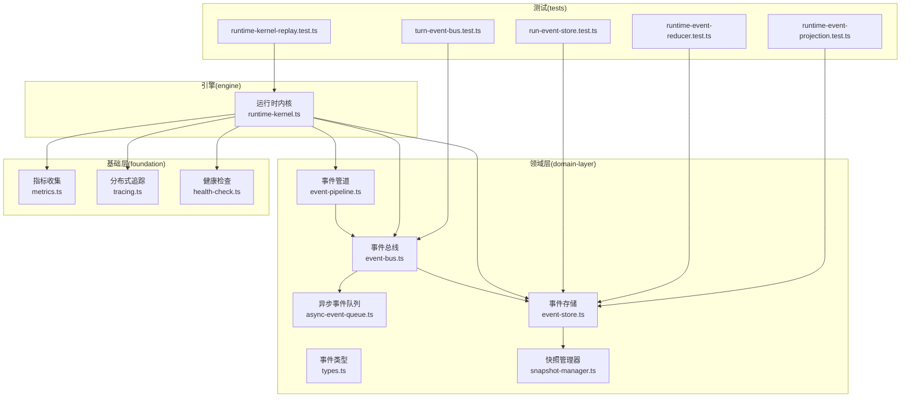
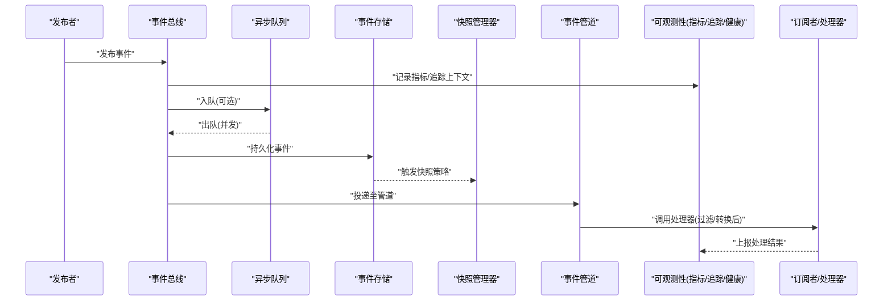
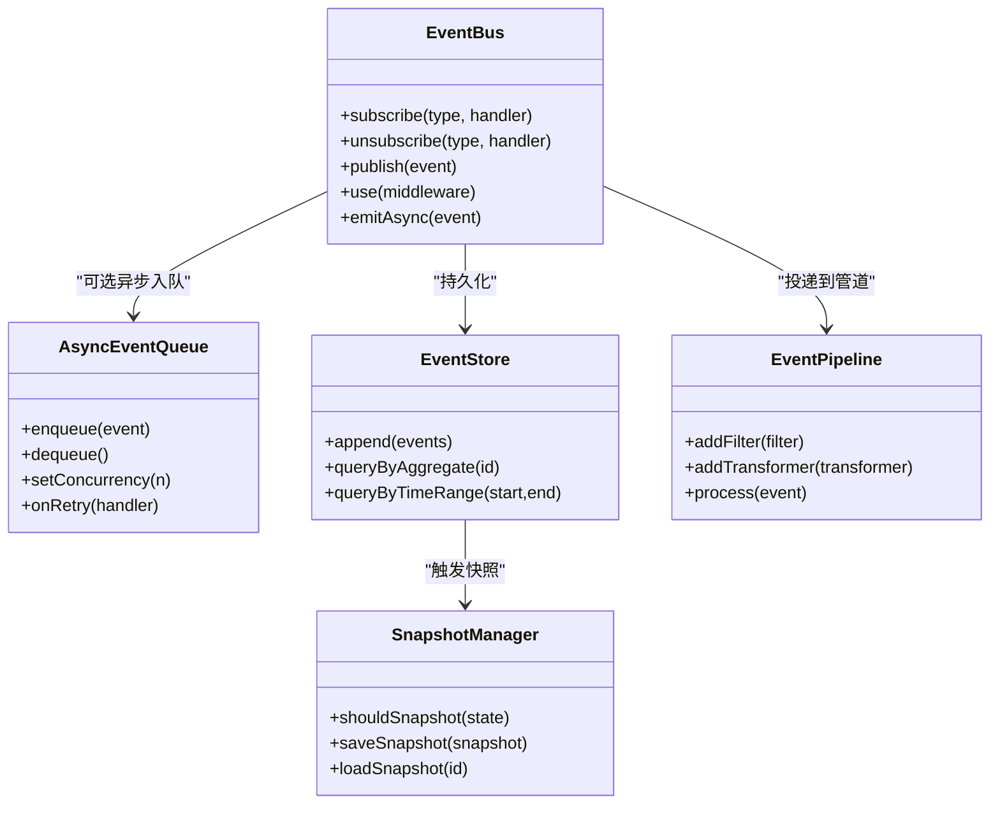
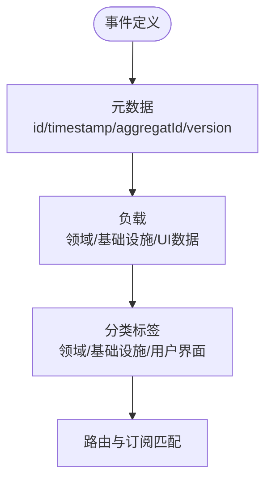
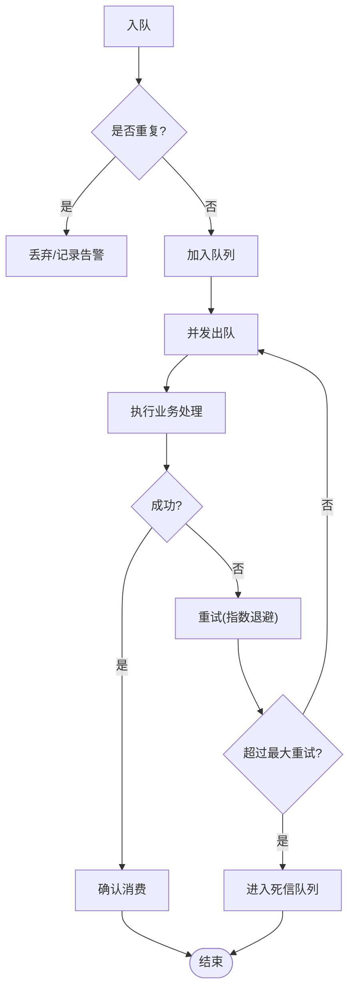
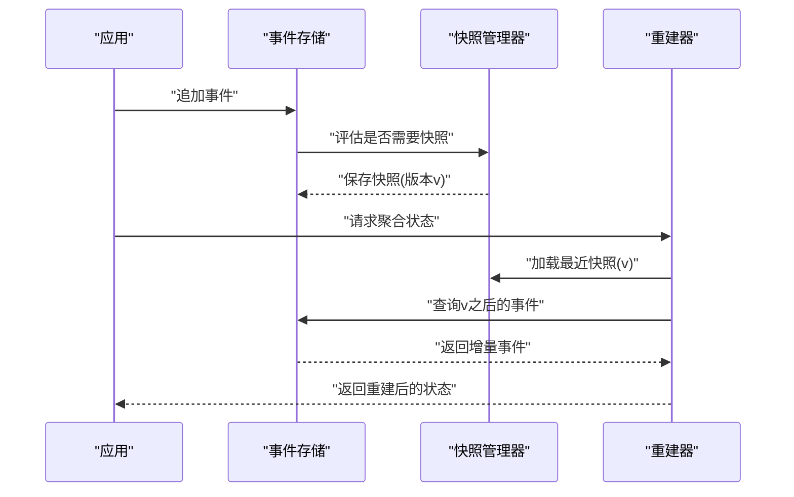
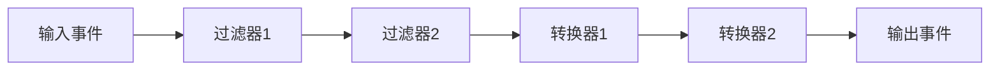
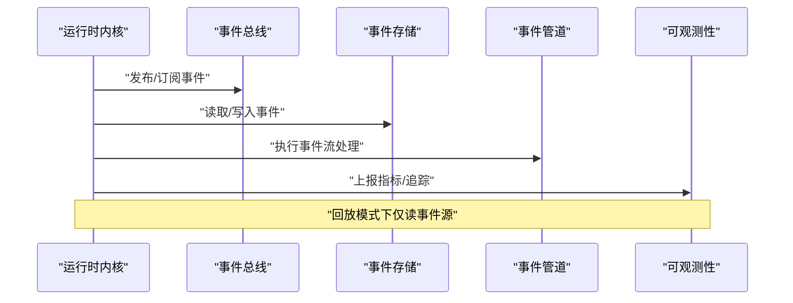
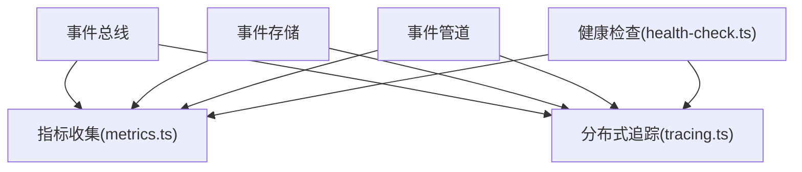
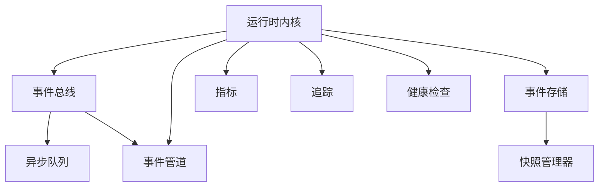

# 事件驱动架构

<cite>
**本文引用的文件**   
- [engine/packages/domain-layer/src/events/event-bus.ts](file://engine/packages/domain-layer/src/events/event-bus.ts)
- [engine/packages/domain-layer/src/events/types.ts](file://engine/packages/domain-layer/src/events/types.ts)
- [engine/packages/domain-layer/src/events/async-event-queue.ts](file://engine/packages/domain-layer/src/events/async-event-queue.ts)
- [engine/packages/domain-layer/src/events/event-store.ts](file://engine/packages/domain-layer/src/events/event-store.ts)
- [engine/packages/domain-layer/src/events/snapshot-manager.ts](file://engine/packages/domain-layer/src/events/snapshot-manager.ts)
- [engine/packages/domain-layer/src/events/event-pipeline.ts](file://engine/packages/domain-layer/src/events/event-pipeline.ts)
- [engine/packages/foundation/src/observability/metrics.ts](file://engine/packages/foundation/src/observability/metrics.ts)
- [engine/packages/foundation/src/observability/tracing.ts](file://engine/packages/foundation/src/observability/tracing.ts)
- [engine/packages/foundation/src/observability/health-check.ts](file://engine/packages/foundation/src/observability/health-check.ts)
- [engine/packages/engine/src/runtime-kernel.ts](file://engine/packages/engine/src/runtime-kernel.ts)
- [engine/tests/run-event-store.test.ts](file://engine/tests/run-event-store.test.ts)
- [engine/tests/runtime-event-reducer.test.ts](file://engine/tests/runtime-event-reducer.test.ts)
- [engine/tests/runtime-event-projection.test.ts](file://engine/tests/runtime-event-projection.test.ts)
- [engine/tests/runtime-kernel-replay.test.ts](file://engine/tests/runtime-kernel-replay.test.ts)
- [engine/tests/turn-event-bus.test.ts](file://engine/tests/turn-event-bus.test.ts)
</cite>

## 目录
1. [简介](#简介)
2. [项目结构](#项目结构)
3. [核心组件](#核心组件)
4. [架构总览](#架构总览)
5. [详细组件分析](#详细组件分析)
6. [依赖分析](#依赖分析)
7. [性能考虑](#性能考虑)
8. [故障排查指南](#故障排查指南)
9. [结论](#结论)
10. [附录](#附录)

## 简介
本文件面向KCoder的事件驱动架构，系统性阐述事件总线、发布订阅与观察者模式实现、事件分类（领域事件、基础设施事件、用户界面事件）、异步处理机制（队列、并发、重试）、事件溯源（存储、快照、重建）、事件流处理（管道、过滤器、转换器），以及调试追踪、扩展开发与可观测性设计。文档以代码级映射为主，辅以可视化图示，帮助读者快速理解并扩展系统能力。

## 项目结构
围绕事件系统的核心模块主要分布在以下包中：
- domain-layer：事件类型定义、事件总线、异步队列、事件存储与快照、事件管道
- foundation：可观测性（指标、分布式追踪、健康检查）
- engine：运行时内核集成事件总线与回放能力
- tests：覆盖事件存储、投影、还原、回放等关键路径的测试用例

**图表来源**
- [engine/packages/domain-layer/src/events/event-bus.ts](file://engine/packages/domain-layer/src/events/event-bus.ts)
- [engine/packages/domain-layer/src/events/types.ts](file://engine/packages/domain-layer/src/events/types.ts)
- [engine/packages/domain-layer/src/events/async-event-queue.ts](file://engine/packages/domain-layer/src/events/async-event-queue.ts)
- [engine/packages/domain-layer/src/events/event-store.ts](file://engine/packages/domain-layer/src/events/event-store.ts)
- [engine/packages/domain-layer/src/events/snapshot-manager.ts](file://engine/packages/domain-layer/src/events/snapshot-manager.ts)
- [engine/packages/domain-layer/src/events/event-pipeline.ts](file://engine/packages/domain-layer/src/events/event-pipeline.ts)
- [engine/packages/foundation/src/observability/metrics.ts](file://engine/packages/foundation/src/observability/metrics.ts)
- [engine/packages/foundation/src/observability/tracing.ts](file://engine/packages/foundation/src/observability/tracing.ts)
- [engine/packages/foundation/src/observability/health-check.ts](file://engine/packages/foundation/src/observability/health-check.ts)
- [engine/packages/engine/src/runtime-kernel.ts](file://engine/packages/engine/src/runtime-kernel.ts)
- [engine/tests/run-event-store.test.ts](file://engine/tests/run-event-store.test.ts)
- [engine/tests/runtime-event-reducer.test.ts](file://engine/tests/runtime-event-reducer.test.ts)
- [engine/tests/runtime-event-projection.test.ts](file://engine/tests/runtime-event-projection.test.ts)
- [engine/tests/runtime-kernel-replay.test.ts](file://engine/tests/runtime-kernel-replay.test.ts)
- [engine/tests/turn-event-bus.test.ts](file://engine/tests/turn-event-bus.test.ts)

**章节来源**
- [engine/packages/domain-layer/src/events/event-bus.ts](file://engine/packages/domain-layer/src/events/event-bus.ts)
- [engine/packages/domain-layer/src/events/types.ts](file://engine/packages/domain-layer/src/events/types.ts)
- [engine/packages/domain-layer/src/events/async-event-queue.ts](file://engine/packages/domain-layer/src/events/async-event-queue.ts)
- [engine/packages/domain-layer/src/events/event-store.ts](file://engine/packages/domain-layer/src/events/event-store.ts)
- [engine/packages/domain-layer/src/events/snapshot-manager.ts](file://engine/packages/domain-layer/src/events/snapshot-manager.ts)
- [engine/packages/domain-layer/src/events/event-pipeline.ts](file://engine/packages/domain-layer/src/events/event-pipeline.ts)
- [engine/packages/foundation/src/observability/metrics.ts](file://engine/packages/foundation/src/observability/metrics.ts)
- [engine/packages/foundation/src/observability/tracing.ts](file://engine/packages/foundation/src/observability/tracing.ts)
- [engine/packages/foundation/src/observability/health-check.ts](file://engine/packages/foundation/src/observability/health-check.ts)
- [engine/packages/engine/src/runtime-kernel.ts](file://engine/packages/engine/src/runtime-kernel.ts)
- [engine/tests/run-event-store.test.ts](file://engine/tests/run-event-store.test.ts)
- [engine/tests/runtime-event-reducer.test.ts](file://engine/tests/runtime-event-reducer.test.ts)
- [engine/tests/runtime-event-projection.test.ts](file://engine/tests/runtime-event-projection.test.ts)
- [engine/tests/runtime-kernel-replay.test.ts](file://engine/tests/runtime-kernel-replay.test.ts)
- [engine/tests/turn-event-bus.test.ts](file://engine/tests/turn-event-bus.test.ts)

## 核心组件
- 事件总线：提供发布/订阅与观察者能力，支持同步与异步分发，具备路由与中间件扩展点。
- 事件类型：统一事件模型，包含事件元数据、负载与分类标签（领域/基础设施/用户界面）。
- 异步事件队列：基于生产者-消费者模型的可靠队列，支持并发消费与失败重试。
- 事件存储：持久化事件序列，保证顺序性与幂等写入，提供按聚合根或时间窗查询。
- 快照管理器：周期性生成状态快照，降低重建成本；支持快照版本与一致性校验。
- 事件管道：将事件流经处理器链，内置过滤器与转换器，支持错误隔离与降级。
- 可观测性：指标采集、分布式追踪与健康检查，贯穿事件生命周期。

**章节来源**
- [engine/packages/domain-layer/src/events/event-bus.ts](file://engine/packages/domain-layer/src/events/event-bus.ts)
- [engine/packages/domain-layer/src/events/types.ts](file://engine/packages/domain-layer/src/events/types.ts)
- [engine/packages/domain-layer/src/events/async-event-queue.ts](file://engine/packages/domain-layer/src/events/async-event-queue.ts)
- [engine/packages/domain-layer/src/events/event-store.ts](file://engine/packages/domain-layer/src/events/event-store.ts)
- [engine/packages/domain-layer/src/events/snapshot-manager.ts](file://engine/packages/domain-layer/src/events/snapshot-manager.ts)
- [engine/packages/domain-layer/src/events/event-pipeline.ts](file://engine/packages/domain-layer/src/events/event-pipeline.ts)
- [engine/packages/foundation/src/observability/metrics.ts](file://engine/packages/foundation/src/observability/metrics.ts)
- [engine/packages/foundation/src/observability/tracing.ts](file://engine/packages/foundation/src/observability/tracing.ts)
- [engine/packages/foundation/src/observability/health-check.ts](file://engine/packages/foundation/src/observability/health-check.ts)

## 架构总览
下图展示事件在系统中的端到端流转：从发布到存储、投影、快照与可观测性记录，最终由下游处理器消费。

**图表来源**
- [engine/packages/domain-layer/src/events/event-bus.ts](file://engine/packages/domain-layer/src/events/event-bus.ts)
- [engine/packages/domain-layer/src/events/async-event-queue.ts](file://engine/packages/domain-layer/src/events/async-event-queue.ts)
- [engine/packages/domain-layer/src/events/event-store.ts](file://engine/packages/domain-layer/src/events/event-store.ts)
- [engine/packages/domain-layer/src/events/snapshot-manager.ts](file://engine/packages/domain-layer/src/events/snapshot-manager.ts)
- [engine/packages/domain-layer/src/events/event-pipeline.ts](file://engine/packages/domain-layer/src/events/event-pipeline.ts)
- [engine/packages/foundation/src/observability/metrics.ts](file://engine/packages/foundation/src/observability/metrics.ts)
- [engine/packages/foundation/src/observability/tracing.ts](file://engine/packages/foundation/src/observability/tracing.ts)
- [engine/packages/foundation/src/observability/health-check.ts](file://engine/packages/foundation/src/observability/health-check.ts)

## 详细组件分析

### 事件总线与观察者/发布订阅模式
- 职责：注册/注销处理器、按事件类型路由、同步/异步分发、中间件拦截、错误隔离。
- 设计要点：
  - 观察者集合按事件类型索引，支持多订阅者。
  - 发布时先经中间件链（如审计、限流、追踪），再投递到队列或直接分发。
  - 支持一次性订阅与长期订阅两种语义。
- 扩展点：自定义中间件、处理器优先级、路由规则。

**图表来源**
- [engine/packages/domain-layer/src/events/event-bus.ts](file://engine/packages/domain-layer/src/events/event-bus.ts)
- [engine/packages/domain-layer/src/events/async-event-queue.ts](file://engine/packages/domain-layer/src/events/async-event-queue.ts)
- [engine/packages/domain-layer/src/events/event-store.ts](file://engine/packages/domain-layer/src/events/event-store.ts)
- [engine/packages/domain-layer/src/events/snapshot-manager.ts](file://engine/packages/domain-layer/src/events/snapshot-manager.ts)
- [engine/packages/domain-layer/src/events/event-pipeline.ts](file://engine/packages/domain-layer/src/events/event-pipeline.ts)

**章节来源**
- [engine/packages/domain-layer/src/events/event-bus.ts](file://engine/packages/domain-layer/src/events/event-bus.ts)
- [engine/tests/turn-event-bus.test.ts](file://engine/tests/turn-event-bus.test.ts)

### 事件类型与分类
- 统一事件模型：包含事件标识、时间戳、聚合根标识、版本、负载与分类标签。
- 分类维度：
  - 领域事件：反映业务状态变更（如订单创建、任务完成）。
  - 基础设施事件：来自外部系统或平台（如文件变更、网络回调）。
  - 用户界面事件：前端交互行为（如点击、输入、面板切换）。
- 用途：用于路由、审计、筛选与统计。

**图表来源**
- [engine/packages/domain-layer/src/events/types.ts](file://engine/packages/domain-layer/src/events/types.ts)

**章节来源**
- [engine/packages/domain-layer/src/events/types.ts](file://engine/packages/domain-layer/src/events/types.ts)

### 异步事件处理机制
- 队列模型：生产者-消费者，支持批量入队与并发出队。
- 并发控制：可配置工作线程数，背压与限流保护。
- 失败重试：指数退避、最大重试次数、死信队列（可选）。
- 幂等保障：基于事件ID去重，避免重复处理。

**图表来源**
- [engine/packages/domain-layer/src/events/async-event-queue.ts](file://engine/packages/domain-layer/src/events/async-event-queue.ts)

**章节来源**
- [engine/packages/domain-layer/src/events/async-event-queue.ts](file://engine/packages/domain-layer/src/events/async-event-queue.ts)

### 事件溯源：存储、快照与状态重建
- 事件存储：追加式写入，保证顺序与一致性；支持按聚合根与时间范围查询。
- 快照机制：当事件量达到阈值或时间间隔到达时生成快照，减少重建开销。
- 状态重建：加载最近快照，重放后续增量事件，得到最新状态。
- 一致性：快照与事件版本对齐，防止丢失或乱序。

**图表来源**
- [engine/packages/domain-layer/src/events/event-store.ts](file://engine/packages/domain-layer/src/events/event-store.ts)
- [engine/packages/domain-layer/src/events/snapshot-manager.ts](file://engine/packages/domain-layer/src/events/snapshot-manager.ts)
- [engine/tests/run-event-store.test.ts](file://engine/tests/run-event-store.test.ts)
- [engine/tests/runtime-event-reducer.test.ts](file://engine/tests/runtime-event-reducer.test.ts)

**章节来源**
- [engine/packages/domain-layer/src/events/event-store.ts](file://engine/packages/domain-layer/src/events/event-store.ts)
- [engine/packages/domain-layer/src/events/snapshot-manager.ts](file://engine/packages/domain-layer/src/events/snapshot-manager.ts)
- [engine/tests/run-event-store.test.ts](file://engine/tests/run-event-store.test.ts)
- [engine/tests/runtime-event-reducer.test.ts](file://engine/tests/runtime-event-reducer.test.ts)

### 事件流处理：管道、过滤器与转换器
- 管道：将事件依次通过多个阶段，每个阶段可独立失败与重试。
- 过滤器：基于事件类型、标签或负载条件进行筛选。
- 转换器：对事件负载进行规范化、脱敏或格式转换。
- 错误隔离：单个阶段失败不影响其他阶段，支持降级策略。

**图表来源**
- [engine/packages/domain-layer/src/events/event-pipeline.ts](file://engine/packages/domain-layer/src/events/event-pipeline.ts)

**章节来源**
- [engine/packages/domain-layer/src/events/event-pipeline.ts](file://engine/packages/domain-layer/src/events/event-pipeline.ts)

### 运行时内核与事件系统集成
- 运行时内核负责编排任务、调度处理器，并与事件总线、事件存储和管道协作。
- 支持回放模式：从历史事件重建状态，验证一致性。
- 与可观测性集成：在关键路径埋点，上报指标与追踪上下文。

**图表来源**
- [engine/packages/engine/src/runtime-kernel.ts](file://engine/packages/engine/src/runtime-kernel.ts)
- [engine/tests/runtime-kernel-replay.test.ts](file://engine/tests/runtime-kernel-replay.test.ts)

**章节来源**
- [engine/packages/engine/src/runtime-kernel.ts](file://engine/packages/engine/src/runtime-kernel.ts)
- [engine/tests/runtime-kernel-replay.test.ts](file://engine/tests/runtime-kernel-replay.test.ts)

### 可观测性设计：指标、追踪与健康检查
- 指标：事件发布/消费速率、延迟、失败率、队列深度、快照频率等。
- 追踪：跨组件链路追踪，关联事件ID与聚合根ID。
- 健康检查：暴露服务就绪、依赖可用性与资源水位。

**图表来源**
- [engine/packages/foundation/src/observability/metrics.ts](file://engine/packages/foundation/src/observability/metrics.ts)
- [engine/packages/foundation/src/observability/tracing.ts](file://engine/packages/foundation/src/observability/tracing.ts)
- [engine/packages/foundation/src/observability/health-check.ts](file://engine/packages/foundation/src/observability/health-check.ts)

**章节来源**
- [engine/packages/foundation/src/observability/metrics.ts](file://engine/packages/foundation/src/observability/metrics.ts)
- [engine/packages/foundation/src/observability/tracing.ts](file://engine/packages/foundation/src/observability/tracing.ts)
- [engine/packages/foundation/src/observability/health-check.ts](file://engine/packages/foundation/src/observability/health-check.ts)

## 依赖分析
- 低耦合高内聚：事件总线与存储、队列、管道解耦，便于替换实现。
- 直接依赖：
  - 事件总线依赖异步队列与事件管道。
  - 事件存储依赖快照管理器。
  - 运行时内核依赖事件总线、事件存储与管道。
- 间接依赖：可观测性被多处引用，形成横切关注点。

**图表来源**
- [engine/packages/domain-layer/src/events/event-bus.ts](file://engine/packages/domain-layer/src/events/event-bus.ts)
- [engine/packages/domain-layer/src/events/async-event-queue.ts](file://engine/packages/domain-layer/src/events/async-event-queue.ts)
- [engine/packages/domain-layer/src/events/event-pipeline.ts](file://engine/packages/domain-layer/src/events/event-pipeline.ts)
- [engine/packages/domain-layer/src/events/event-store.ts](file://engine/packages/domain-layer/src/events/event-store.ts)
- [engine/packages/domain-layer/src/events/snapshot-manager.ts](file://engine/packages/domain-layer/src/events/snapshot-manager.ts)
- [engine/packages/engine/src/runtime-kernel.ts](file://engine/packages/engine/src/runtime-kernel.ts)
- [engine/packages/foundation/src/observability/metrics.ts](file://engine/packages/foundation/src/observability/metrics.ts)
- [engine/packages/foundation/src/observability/tracing.ts](file://engine/packages/foundation/src/observability/tracing.ts)
- [engine/packages/foundation/src/observability/health-check.ts](file://engine/packages/foundation/src/observability/health-check.ts)

**章节来源**
- [engine/packages/domain-layer/src/events/event-bus.ts](file://engine/packages/domain-layer/src/events/event-bus.ts)
- [engine/packages/domain-layer/src/events/async-event-queue.ts](file://engine/packages/domain-layer/src/events/async-event-queue.ts)
- [engine/packages/domain-layer/src/events/event-pipeline.ts](file://engine/packages/domain-layer/src/events/event-pipeline.ts)
- [engine/packages/domain-layer/src/events/event-store.ts](file://engine/packages/domain-layer/src/events/event-store.ts)
- [engine/packages/domain-layer/src/events/snapshot-manager.ts](file://engine/packages/domain-layer/src/events/snapshot-manager.ts)
- [engine/packages/engine/src/runtime-kernel.ts](file://engine/packages/engine/src/runtime-kernel.ts)
- [engine/packages/foundation/src/observability/metrics.ts](file://engine/packages/foundation/src/observability/metrics.ts)
- [engine/packages/foundation/src/observability/tracing.ts](file://engine/packages/foundation/src/observability/tracing.ts)
- [engine/packages/foundation/src/observability/health-check.ts](file://engine/packages/foundation/src/observability/health-check.ts)

## 性能考虑
- 并发与吞吐：合理设置队列并发度，避免CPU争用与上下文切换开销。
- 批处理：批量持久化与批量投影可降低I/O压力。
- 快照策略：根据事件增长曲线动态调整快照阈值，平衡重建时间与存储成本。
- 背压与限流：在高负载下限制入队速率，保护下游处理器。
- 幂等与去重：基于事件ID去重，避免重复计算。

[本节为通用指导，不直接分析具体文件]

## 故障排查指南
- 事件回放：使用回放测试用例定位状态不一致问题，对比预期与重建结果。
- 断点调试：在事件总线分发、队列出队、管道阶段插入日志与断点，观察事件流向。
- 性能分析：结合指标与追踪，识别热点处理器与慢路径。
- 常见错误：
  - 重复消费：检查去重逻辑与幂等实现。
  - 快照不一致：核对快照版本与事件序列号。
  - 管道阶段失败：查看错误隔离与重试策略。

**章节来源**
- [engine/tests/runtime-kernel-replay.test.ts](file://engine/tests/runtime-kernel-replay.test.ts)
- [engine/tests/run-event-store.test.ts](file://engine/tests/run-event-store.test.ts)
- [engine/tests/runtime-event-reducer.test.ts](file://engine/tests/runtime-event-reducer.test.ts)
- [engine/tests/runtime-event-projection.test.ts](file://engine/tests/runtime-event-projection.test.ts)
- [engine/tests/turn-event-bus.test.ts](file://engine/tests/turn-event-bus.test.ts)

## 结论
KCoder的事件驱动架构以事件总线为核心，结合异步队列、事件存储与快照管理，实现了高内聚、可扩展且可观测的事件系统。通过事件管道与中间件机制，系统具备良好的灵活性与容错能力。配合完善的测试与可观测性工具，能够支撑复杂业务场景下的稳定运行与持续演进。

[本节为总结性内容，不直接分析具体文件]

## 附录
- 扩展开发指南：
  - 自定义事件处理器：实现处理器接口并按事件类型注册。
  - 事件中间件：在发布前后注入审计、限流、追踪等逻辑。
  - 事件路由：基于标签或负载字段进行细粒度分发。
- 最佳实践：
  - 保持事件不可变与最小负载。
  - 明确事件边界与聚合根归属。
  - 为关键路径添加指标与追踪。

[本节为概念性指导，不直接分析具体文件]