# 异步事件处理

<cite>
**本文引用的文件**   
- [engine/packages/engine/src/runtime-kernel.ts](file://engine/packages/engine/src/runtime-kernel.ts)
- [engine/packages/engine/src/event-bus.ts](file://engine/packages/engine/src/event-bus.ts)
- [engine/packages/engine/src/queue/priority-queue.ts](file://engine/packages/engine/src/queue/priority-queue.ts)
- [engine/packages/engine/src/queue/task-queue.ts](file://engine/packages/engine/src/queue/task-queue.ts)
- [engine/packages/engine/src/workers/thread-pool.ts](file://engine/packages/engine/src/workers/thread-pool.ts)
- [engine/packages/engine/src/workers/worker-manager.ts](file://engine/packages/engine/src/workers/worker-manager.ts)
- [engine/packages/engine/src/middleware/governance-middleware.ts](file://engine/packages/engine/src/middleware/governance-middleware.ts)
- [engine/packages/engine/src/middleware/retry-middleware.ts](file://engine/packages/engine/src/middleware/retry-middleware.ts)
- [engine/packages/engine/src/middleware/dlq-middleware.ts](file://engine/packages/engine/src/middleware/dlq-middleware.ts)
- [engine/packages/engine/src/observability/tracing.ts](file://engine/packages/engine/src/observability/tracing.ts)
- [engine/packages/engine/src/observability/metrics.ts](file://engine/packages/engine/src/observability/metrics.ts)
- [engine/packages/engine/src/observability/logging.ts](file://engine/packages/engine/src/observability/logging.ts)
- [engine/packages/engine/src/transport/http-peer-transport.ts](file://engine/packages/engine/src/transport/http-peer-transport.ts)
- [engine/packages/engine/src/transport/in-process-transport.ts](file://engine/packages/engine/src/transport/in-process-transport.ts)
- [engine/packages/engine/src/state/run-state-store.ts](file://engine/packages/engine/src/state/run-state-store.ts)
- [engine/packages/engine/src/state/event-store.ts](file://engine/packages/engine/src/state/event-store.ts)
- [engine/packages/engine/src/scheduling/turn-runner.ts](file://engine/packages/engine/src/scheduling/turn-runner.ts)
- [engine/packages/engine/src/scheduling/loop-runner.ts](file://engine/packages/engine/src/scheduling/loop-runner.ts)
- [engine/packages/engine/src/scheduling/tool-coordinator.ts](file://engine/packages/engine/src/scheduling/tool-coordinator.ts)
- [engine/packages/engine/src/scheduling/compaction-governor.ts](file://engine/packages/engine/src/scheduling/compaction-governor.ts)
- [engine/packages/engine/src/errors/error-handling.ts](file://engine/packages/engine/src/errors/error-handling.ts)
- [engine/packages/engine/src/config/runtime-config.ts](file://engine/packages/engine/src/config/runtime-config.ts)
</cite>

## 目录
1. [简介](#简介)
2. [项目结构](#项目结构)
3. [核心组件](#核心组件)
4. [架构总览](#架构总览)
5. [详细组件分析](#详细组件分析)
6. [依赖关系分析](#依赖关系分析)
7. [性能考量](#性能考量)
8. [故障排查指南](#故障排查指南)
9. [结论](#结论)
10. [附录](#附录)

## 简介
本技术文档聚焦于KCoder的异步事件处理机制，围绕以下目标展开：
- 解释事件队列与消息传递、进程间通信的实现原理
- 说明事件处理器的生命周期管理（初始化、启动、停止、销毁）
- 阐述并发模型（多线程、工作池、负载均衡）
- 详述错误处理与恢复（异常捕获、重试、死信队列、补偿事务）
- 介绍事件优先级管理与资源分配策略
- 提供监控与调试工具（指标、日志、追踪、断点）
- 给出性能调优指南与最佳实践

## 项目结构
KCoder引擎采用分层与模块化设计，异步事件处理相关能力分布在如下模块中：
- 运行时内核：负责事件总线、调度器、中间件链、状态持久化等核心编排
- 队列系统：通用任务队列与优先级队列实现
- 工作者与线程池：并发执行与资源隔离
- 中间件体系：治理、重试、死信队列等横切关注点
- 可观测性：指标、日志、分布式追踪
- 传输层：进程内与HTTP跨进程通信
- 状态与事件存储：运行态与事件溯源
- 调度器：回合、循环、工具协调与上下文压缩治理
- 错误处理与配置：统一错误抽象与运行时参数

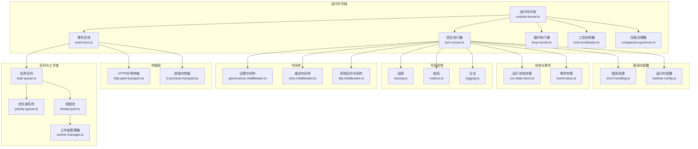

图表来源
- [engine/packages/engine/src/runtime-kernel.ts](file://engine/packages/engine/src/runtime-kernel.ts)
- [engine/packages/engine/src/event-bus.ts](file://engine/packages/engine/src/event-bus.ts)
- [engine/packages/engine/src/queue/priority-queue.ts](file://engine/packages/engine/src/queue/priority-queue.ts)
- [engine/packages/engine/src/queue/task-queue.ts](file://engine/packages/engine/src/queue/task-queue.ts)
- [engine/packages/engine/src/workers/thread-pool.ts](file://engine/packages/engine/src/workers/thread-pool.ts)
- [engine/packages/engine/src/workers/worker-manager.ts](file://engine/packages/engine/src/workers/worker-manager.ts)
- [engine/packages/engine/src/middleware/governance-middleware.ts](file://engine/packages/engine/src/middleware/governance-middleware.ts)
- [engine/packages/engine/src/middleware/retry-middleware.ts](file://engine/packages/engine/src/middleware/retry-middleware.ts)
- [engine/packages/engine/src/middleware/dlq-middleware.ts](file://engine/packages/engine/src/middleware/dlq-middleware.ts)
- [engine/packages/engine/src/observability/tracing.ts](file://engine/packages/engine/src/observability/tracing.ts)
- [engine/packages/engine/src/observability/metrics.ts](file://engine/packages/engine/src/observability/metrics.ts)
- [engine/packages/engine/src/observability/logging.ts](file://engine/packages/engine/src/observability/logging.ts)
- [engine/packages/engine/src/transport/http-peer-transport.ts](file://engine/packages/engine/src/transport/http-peer-transport.ts)
- [engine/packages/engine/src/transport/in-process-transport.ts](file://engine/packages/engine/src/transport/in-process-transport.ts)
- [engine/packages/engine/src/state/run-state-store.ts](file://engine/packages/engine/src/state/run-state-store.ts)
- [engine/packages/engine/src/state/event-store.ts](file://engine/packages/engine/src/state/event-store.ts)
- [engine/packages/engine/src/scheduling/turn-runner.ts](file://engine/packages/engine/src/scheduling/turn-runner.ts)
- [engine/packages/engine/src/scheduling/loop-runner.ts](file://engine/packages/engine/src/scheduling/loop-runner.ts)
- [engine/packages/engine/src/scheduling/tool-coordinator.ts](file://engine/packages/engine/src/scheduling/tool-coordinator.ts)
- [engine/packages/engine/src/scheduling/compaction-governor.ts](file://engine/packages/engine/src/scheduling/compaction-governor.ts)
- [engine/packages/engine/src/errors/error-handling.ts](file://engine/packages/engine/src/errors/error-handling.ts)
- [engine/packages/engine/src/config/runtime-config.ts](file://engine/packages/engine/src/config/runtime-config.ts)

章节来源
- [engine/packages/engine/src/runtime-kernel.ts](file://engine/packages/engine/src/runtime-kernel.ts)
- [engine/packages/engine/src/event-bus.ts](file://engine/packages/engine/src/event-bus.ts)
- [engine/packages/engine/src/queue/priority-queue.ts](file://engine/packages/engine/src/queue/priority-queue.ts)
- [engine/packages/engine/src/queue/task-queue.ts](file://engine/packages/engine/src/queue/task-queue.ts)
- [engine/packages/engine/src/workers/thread-pool.ts](file://engine/packages/engine/src/workers/thread-pool.ts)
- [engine/packages/engine/src/workers/worker-manager.ts](file://engine/packages/engine/src/workers/worker-manager.ts)
- [engine/packages/engine/src/middleware/governance-middleware.ts](file://engine/packages/engine/src/middleware/governance-middleware.ts)
- [engine/packages/engine/src/middleware/retry-middleware.ts](file://engine/packages/engine/src/middleware/retry-middleware.ts)
- [engine/packages/engine/src/middleware/dlq-middleware.ts](file://engine/packages/engine/src/middleware/dlq-middleware.ts)
- [engine/packages/engine/src/observability/tracing.ts](file://engine/packages/engine/src/observability/tracing.ts)
- [engine/packages/engine/src/observability/metrics.ts](file://engine/packages/engine/src/observability/metrics.ts)
- [engine/packages/engine/src/observability/logging.ts](file://engine/packages/engine/src/observability/logging.ts)
- [engine/packages/engine/src/transport/http-peer-transport.ts](file://engine/packages/engine/src/transport/http-peer-transport.ts)
- [engine/packages/engine/src/transport/in-process-transport.ts](file://engine/packages/engine/src/transport/in-process-transport.ts)
- [engine/packages/engine/src/state/run-state-store.ts](file://engine/packages/engine/src/state/run-state-store.ts)
- [engine/packages/engine/src/state/event-store.ts](file://engine/packages/engine/src/state/event-store.ts)
- [engine/packages/engine/src/scheduling/turn-runner.ts](file://engine/packages/engine/src/scheduling/turn-runner.ts)
- [engine/packages/engine/src/scheduling/loop-runner.ts](file://engine/packages/engine/src/scheduling/loop-runner.ts)
- [engine/packages/engine/src/scheduling/tool-coordinator.ts](file://engine/packages/engine/src/scheduling/tool-coordinator.ts)
- [engine/packages/engine/src/scheduling/compaction-governor.ts](file://engine/packages/engine/src/scheduling/compaction-governor.ts)
- [engine/packages/engine/src/errors/error-handling.ts](file://engine/packages/engine/src/errors/error-handling.ts)
- [engine/packages/engine/src/config/runtime-config.ts](file://engine/packages/engine/src/config/runtime-config.ts)

## 核心组件
- 运行时内核：装配事件总线、调度器、中间件链、状态与可观测性；负责生命周期控制与全局配置注入。
- 事件总线：统一发布/订阅接口，支持多传输通道（进程内、HTTP），并桥接到任务队列。
- 任务队列与优先级队列：承载待处理事件，支持按优先级出队与背压控制。
- 线程池与工作池：将任务分发到工作线程，实现CPU密集型与IO密集型的并发执行与隔离。
- 中间件链：治理（配额、限流）、重试（指数退避、幂等键）、死信队列（失败归档与告警）。
- 可观测性：追踪上下文贯穿、指标采集、结构化日志输出。
- 传输层：进程内快速路径与HTTP跨进程可靠路径。
- 状态与事件存储：运行状态快照与事件溯源，支撑回放与恢复。
- 调度器：回合式执行、循环控制、工具调用协调与上下文压缩治理。
- 错误处理与配置：统一错误类型、传播与恢复策略；集中式运行时参数。

章节来源
- [engine/packages/engine/src/runtime-kernel.ts](file://engine/packages/engine/src/runtime-kernel.ts)
- [engine/packages/engine/src/event-bus.ts](file://engine/packages/engine/src/event-bus.ts)
- [engine/packages/engine/src/queue/priority-queue.ts](file://engine/packages/engine/src/queue/priority-queue.ts)
- [engine/packages/engine/src/queue/task-queue.ts](file://engine/packages/engine/src/queue/task-queue.ts)
- [engine/packages/engine/src/workers/thread-pool.ts](file://engine/packages/engine/src/workers/thread-pool.ts)
- [engine/packages/engine/src/workers/worker-manager.ts](file://engine/packages/engine/src/workers/worker-manager.ts)
- [engine/packages/engine/src/middleware/governance-middleware.ts](file://engine/packages/engine/src/middleware/governance-middleware.ts)
- [engine/packages/engine/src/middleware/retry-middleware.ts](file://engine/packages/engine/src/middleware/retry-middleware.ts)
- [engine/packages/engine/src/middleware/dlq-middleware.ts](file://engine/packages/engine/src/middleware/dlq-middleware.ts)
- [engine/packages/engine/src/observability/tracing.ts](file://engine/packages/engine/src/observability/tracing.ts)
- [engine/packages/engine/src/observability/metrics.ts](file://engine/packages/engine/src/observability/metrics.ts)
- [engine/packages/engine/src/observability/logging.ts](file://engine/packages/engine/src/observability/logging.ts)
- [engine/packages/engine/src/transport/http-peer-transport.ts](file://engine/packages/engine/src/transport/http-peer-transport.ts)
- [engine/packages/engine/src/transport/in-process-transport.ts](file://engine/packages/engine/src/transport/in-process-transport.ts)
- [engine/packages/engine/src/state/run-state-store.ts](file://engine/packages/engine/src/state/run-state-store.ts)
- [engine/packages/engine/src/state/event-store.ts](file://engine/packages/engine/src/state/event-store.ts)
- [engine/packages/engine/src/scheduling/turn-runner.ts](file://engine/packages/engine/src/scheduling/turn-runner.ts)
- [engine/packages/engine/src/scheduling/loop-runner.ts](file://engine/packages/engine/src/scheduling/loop-runner.ts)
- [engine/packages/engine/src/scheduling/tool-coordinator.ts](file://engine/packages/engine/src/scheduling/tool-coordinator.ts)
- [engine/packages/engine/src/scheduling/compaction-governor.ts](file://engine/packages/engine/src/scheduling/compaction-governor.ts)
- [engine/packages/engine/src/errors/error-handling.ts](file://engine/packages/engine/src/errors/error-handling.ts)
- [engine/packages/engine/src/config/runtime-config.ts](file://engine/packages/engine/src/config/runtime-config.ts)

## 架构总览
下图展示了从事件入队到处理器执行的端到端流程，包括中间件、工作者、状态与可观测性的交互。

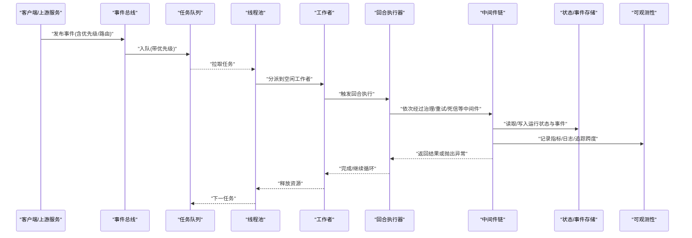

图表来源
- [engine/packages/engine/src/event-bus.ts](file://engine/packages/engine/src/event-bus.ts)
- [engine/packages/engine/src/queue/task-queue.ts](file://engine/packages/engine/src/queue/task-queue.ts)
- [engine/packages/engine/src/queue/priority-queue.ts](file://engine/packages/engine/src/queue/priority-queue.ts)
- [engine/packages/engine/src/workers/thread-pool.ts](file://engine/packages/engine/src/workers/thread-pool.ts)
- [engine/packages/engine/src/workers/worker-manager.ts](file://engine/packages/engine/src/workers/worker-manager.ts)
- [engine/packages/engine/src/scheduling/turn-runner.ts](file://engine/packages/engine/src/scheduling/turn-runner.ts)
- [engine/packages/engine/src/middleware/governance-middleware.ts](file://engine/packages/engine/src/middleware/governance-middleware.ts)
- [engine/packages/engine/src/middleware/retry-middleware.ts](file://engine/packages/engine/src/middleware/retry-middleware.ts)
- [engine/packages/engine/src/middleware/dlq-middleware.ts](file://engine/packages/engine/src/middleware/dlq-middleware.ts)
- [engine/packages/engine/src/state/run-state-store.ts](file://engine/packages/engine/src/state/run-state-store.ts)
- [engine/packages/engine/src/state/event-store.ts](file://engine/packages/engine/src/state/event-store.ts)
- [engine/packages/engine/src/observability/tracing.ts](file://engine/packages/engine/src/observability/tracing.ts)
- [engine/packages/engine/src/observability/metrics.ts](file://engine/packages/engine/src/observability/metrics.ts)
- [engine/packages/engine/src/observability/logging.ts](file://engine/packages/engine/src/observability/logging.ts)

## 详细组件分析

### 事件总线与消息传递
- 职责：统一发布/订阅接口，封装多传输通道（进程内、HTTP），将事件转换为内部任务并投递至队列。
- 关键点：
  - 路由与分区：根据事件类型/租户/会话进行路由，避免热点。
  - 序列化与版本兼容：保证跨进程传输的兼容性。
  - 背压与限流：在入队前进行速率限制，防止过载。
  - 幂等键：为重复投递提供去重能力。

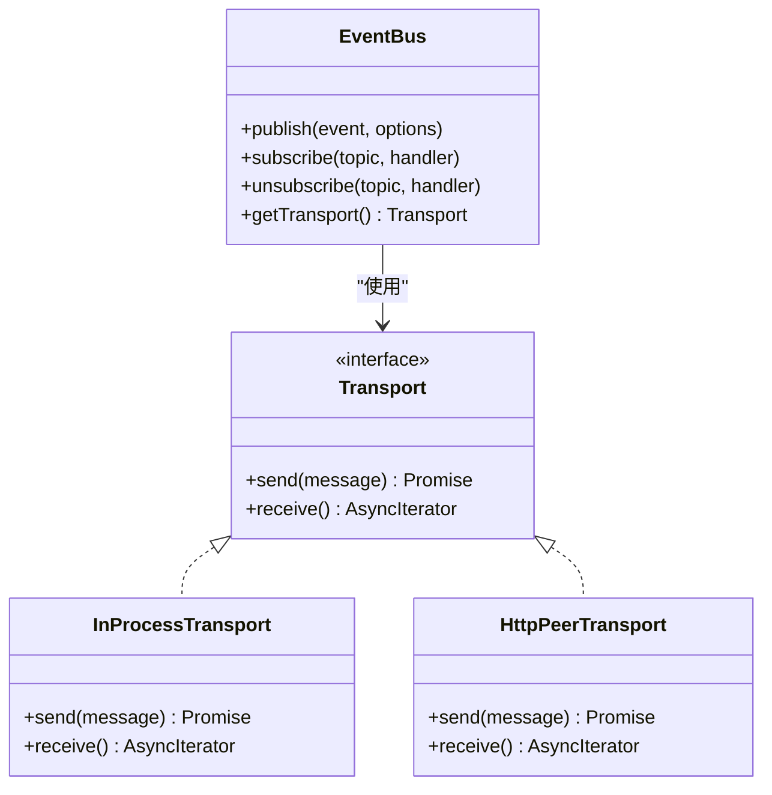

图表来源
- [engine/packages/engine/src/event-bus.ts](file://engine/packages/engine/src/event-bus.ts)
- [engine/packages/engine/src/transport/in-process-transport.ts](file://engine/packages/engine/src/transport/in-process-transport.ts)
- [engine/packages/engine/src/transport/http-peer-transport.ts](file://engine/packages/engine/src/transport/http-peer-transport.ts)

章节来源
- [engine/packages/engine/src/event-bus.ts](file://engine/packages/engine/src/event-bus.ts)
- [engine/packages/engine/src/transport/in-process-transport.ts](file://engine/packages/engine/src/transport/in-process-transport.ts)
- [engine/packages/engine/src/transport/http-peer-transport.ts](file://engine/packages/engine/src/transport/http-peer-transport.ts)

### 队列系统与优先级管理
- 任务队列：缓冲事件，解耦生产与消费，支持持久化与重启恢复。
- 优先级队列：基于堆结构的优先出队，支持抢占式处理与动态优先级调整。
- 关键特性：
  - 优先级字段与排序稳定性
  - 公平性与饥饿保护
  - 容量上限与背压信号
  - 批量拉取与批处理优化

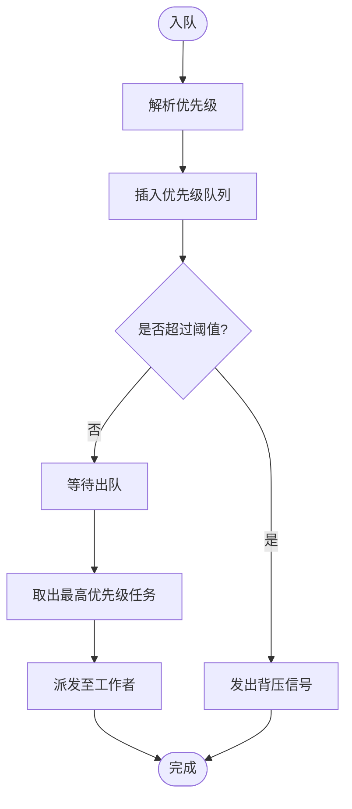

图表来源
- [engine/packages/engine/src/queue/task-queue.ts](file://engine/packages/engine/src/queue/task-queue.ts)
- [engine/packages/engine/src/queue/priority-queue.ts](file://engine/packages/engine/src/queue/priority-queue.ts)

章节来源
- [engine/packages/engine/src/queue/task-queue.ts](file://engine/packages/engine/src/queue/task-queue.ts)
- [engine/packages/engine/src/queue/priority-queue.ts](file://engine/packages/engine/src/queue/priority-queue.ts)

### 工作者与线程池（并发模型）
- 线程池：维护固定大小工作线程，复用上下文，减少创建开销。
- 工作者管理器：负责任务分配、健康检查、优雅退出。
- 负载均衡策略：
  - 最少负载优先
  - 亲和性绑定（会话/租户）
  - 抢占与迁移（高优先级任务）

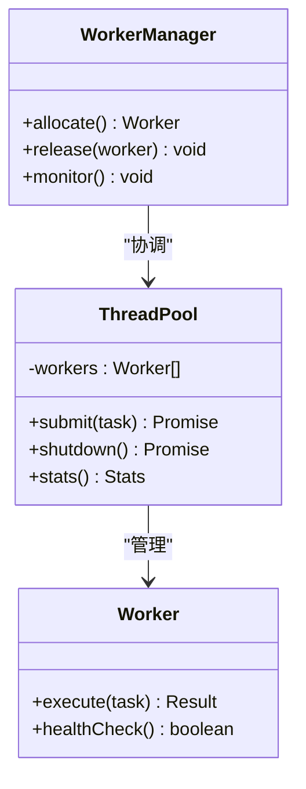

图表来源
- [engine/packages/engine/src/workers/thread-pool.ts](file://engine/packages/engine/src/workers/thread-pool.ts)
- [engine/packages/engine/src/workers/worker-manager.ts](file://engine/packages/engine/src/workers/worker-manager.ts)

章节来源
- [engine/packages/engine/src/workers/thread-pool.ts](file://engine/packages/engine/src/workers/thread-pool.ts)
- [engine/packages/engine/src/workers/worker-manager.ts](file://engine/packages/engine/src/workers/worker-manager.ts)

### 中间件链（治理、重试、死信）
- 治理中间件：配额、限流、鉴权、审计。
- 重试中间件：指数退避、抖动、最大重试次数、幂等键校验。
- 死信队列中间件：失败归档、告警、人工介入入口。

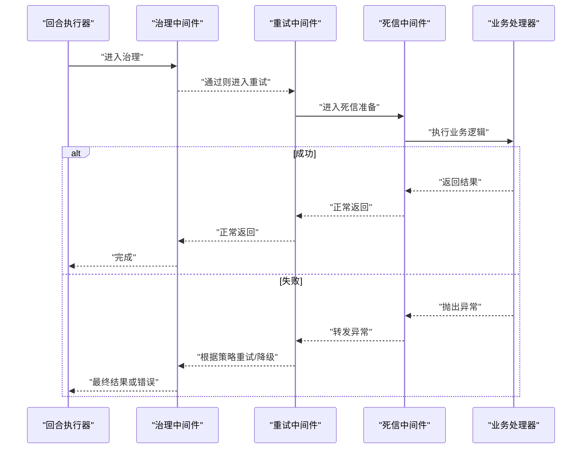

图表来源
- [engine/packages/engine/src/middleware/governance-middleware.ts](file://engine/packages/engine/src/middleware/governance-middleware.ts)
- [engine/packages/engine/src/middleware/retry-middleware.ts](file://engine/packages/engine/src/middleware/retry-middleware.ts)
- [engine/packages/engine/src/middleware/dlq-middleware.ts](file://engine/packages/engine/src/middleware/dlq-middleware.ts)
- [engine/packages/engine/src/scheduling/turn-runner.ts](file://engine/packages/engine/src/scheduling/turn-runner.ts)

章节来源
- [engine/packages/engine/src/middleware/governance-middleware.ts](file://engine/packages/engine/src/middleware/governance-middleware.ts)
- [engine/packages/engine/src/middleware/retry-middleware.ts](file://engine/packages/engine/src/middleware/retry-middleware.ts)
- [engine/packages/engine/src/middleware/dlq-middleware.ts](file://engine/packages/engine/src/middleware/dlq-middleware.ts)
- [engine/packages/engine/src/scheduling/turn-runner.ts](file://engine/packages/engine/src/scheduling/turn-runner.ts)

### 调度器（回合、循环、工具协调、压缩治理）
- 回合执行器：定义一次完整处理的边界，串联中间件与处理器。
- 循环执行器：支持迭代式推进，具备终止条件与步长控制。
- 工具协调器：统一管理外部工具调用，处理结果聚合与错误合并。
- 压缩治理器：控制上下文大小，避免内存膨胀与性能退化。

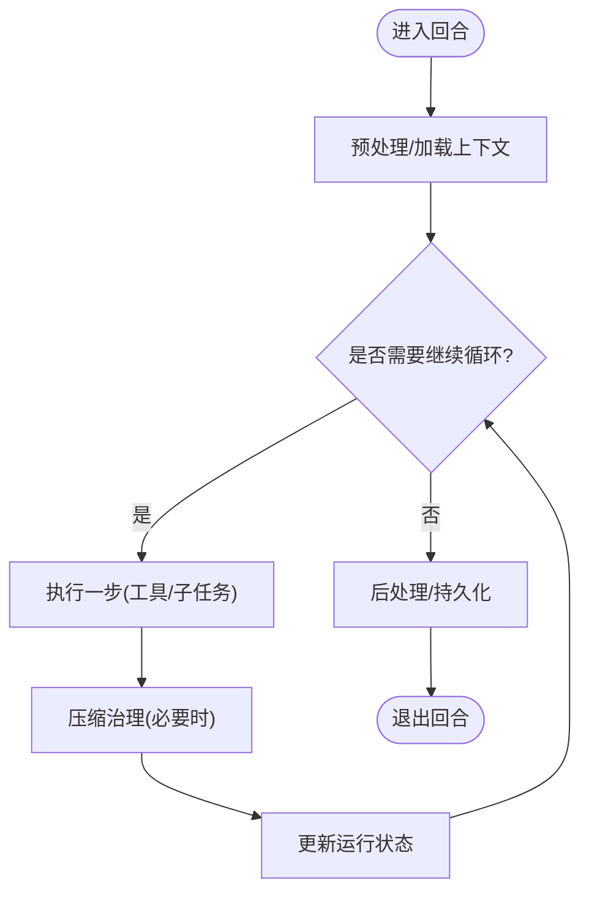

图表来源
- [engine/packages/engine/src/scheduling/turn-runner.ts](file://engine/packages/engine/src/scheduling/turn-runner.ts)
- [engine/packages/engine/src/scheduling/loop-runner.ts](file://engine/packages/engine/src/scheduling/loop-runner.ts)
- [engine/packages/engine/src/scheduling/tool-coordinator.ts](file://engine/packages/engine/src/scheduling/tool-coordinator.ts)
- [engine/packages/engine/src/scheduling/compaction-governor.ts](file://engine/packages/engine/src/scheduling/compaction-governor.ts)

章节来源
- [engine/packages/engine/src/scheduling/turn-runner.ts](file://engine/packages/engine/src/scheduling/turn-runner.ts)
- [engine/packages/engine/src/scheduling/loop-runner.ts](file://engine/packages/engine/src/scheduling/loop-runner.ts)
- [engine/packages/engine/src/scheduling/tool-coordinator.ts](file://engine/packages/engine/src/scheduling/tool-coordinator.ts)
- [engine/packages/engine/src/scheduling/compaction-governor.ts](file://engine/packages/engine/src/scheduling/compaction-governor.ts)

### 状态与事件存储（持久化与回放）
- 运行状态存储：保存任务进度、上下文快照、资源占用等信息。
- 事件存储：事件溯源，支持回放、审计与一致性校验。
- 关键能力：
  - 原子提交与事务边界
  - 增量追加与索引
  - 回放与重建

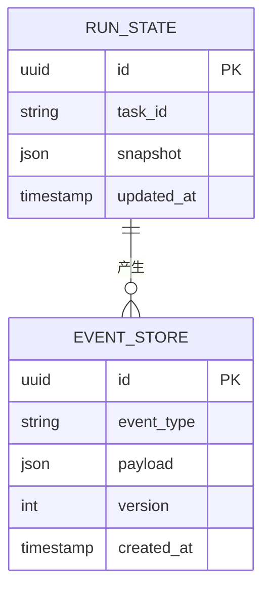

图表来源
- [engine/packages/engine/src/state/run-state-store.ts](file://engine/packages/engine/src/state/run-state-store.ts)
- [engine/packages/engine/src/state/event-store.ts](file://engine/packages/engine/src/state/event-store.ts)

章节来源
- [engine/packages/engine/src/state/run-state-store.ts](file://engine/packages/engine/src/state/run-state-store.ts)
- [engine/packages/engine/src/state/event-store.ts](file://engine/packages/engine/src/state/event-store.ts)

### 可观测性（追踪、指标、日志）
- 追踪：为每个事件生成链路ID，贯穿中间件与工作者，便于定位瓶颈。
- 指标：暴露队列长度、吞吐、延迟、错误率、重试次数、死信计数等。
- 日志：结构化输出，包含上下文、阶段、耗时与错误栈。

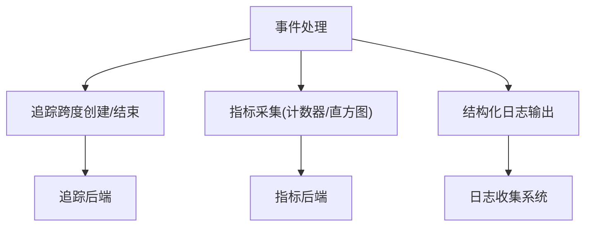

图表来源
- [engine/packages/engine/src/observability/tracing.ts](file://engine/packages/engine/src/observability/tracing.ts)
- [engine/packages/engine/src/observability/metrics.ts](file://engine/packages/engine/src/observability/metrics.ts)
- [engine/packages/engine/src/observability/logging.ts](file://engine/packages/engine/src/observability/logging.ts)

章节来源
- [engine/packages/engine/src/observability/tracing.ts](file://engine/packages/engine/src/observability/tracing.ts)
- [engine/packages/engine/src/observability/metrics.ts](file://engine/packages/engine/src/observability/metrics.ts)
- [engine/packages/engine/src/observability/logging.ts](file://engine/packages/engine/src/observability/logging.ts)

### 错误处理与恢复
- 统一错误抽象：区分可重试/不可重试、业务/系统错误。
- 重试策略：指数退避+抖动，结合幂等键避免重复副作用。
- 死信队列：失败事件归档，支持告警与人工干预。
- 补偿事务：对已生效副作用进行反向操作，确保最终一致性。

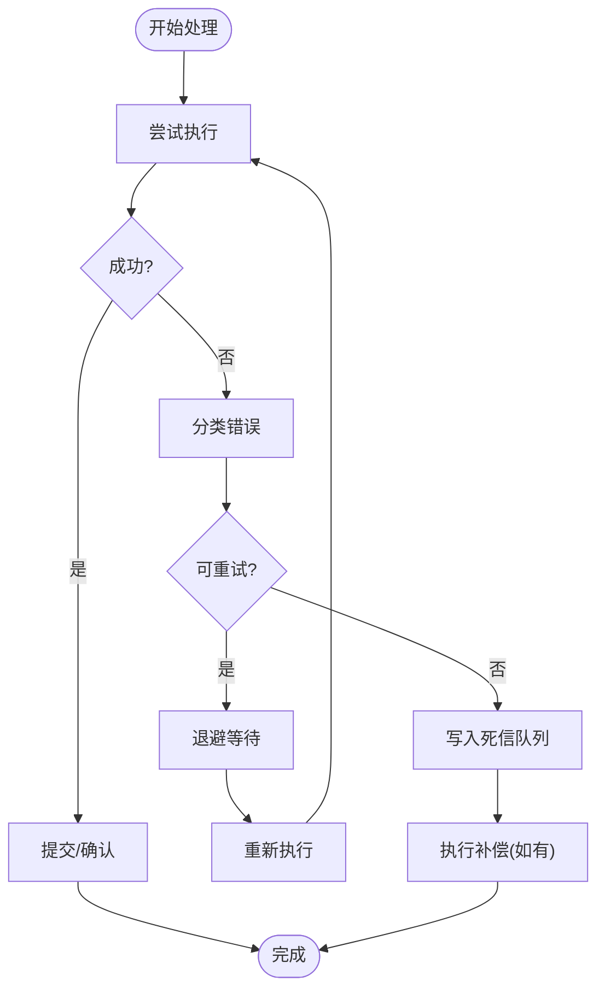

图表来源
- [engine/packages/engine/src/errors/error-handling.ts](file://engine/packages/engine/src/errors/error-handling.ts)
- [engine/packages/engine/src/middleware/retry-middleware.ts](file://engine/packages/engine/src/middleware/retry-middleware.ts)
- [engine/packages/engine/src/middleware/dlq-middleware.ts](file://engine/packages/engine/src/middleware/dlq-middleware.ts)

章节来源
- [engine/packages/engine/src/errors/error-handling.ts](file://engine/packages/engine/src/errors/error-handling.ts)
- [engine/packages/engine/src/middleware/retry-middleware.ts](file://engine/packages/engine/src/middleware/retry-middleware.ts)
- [engine/packages/engine/src/middleware/dlq-middleware.ts](file://engine/packages/engine/src/middleware/dlq-middleware.ts)

### 生命周期管理（初始化、启动、停止、销毁）
- 初始化：加载配置、构建中间件链、注册处理器、预热连接。
- 启动：启动事件总线、工作者、调度器、可观测性上报。
- 停止：优雅关闭工作者、刷新状态、关闭传输与存储。
- 销毁：释放资源、清理临时文件、断开外部连接。

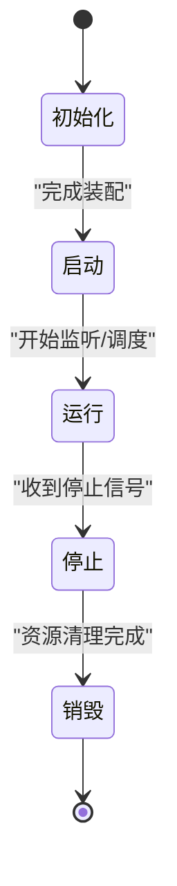

图表来源
- [engine/packages/engine/src/runtime-kernel.ts](file://engine/packages/engine/src/runtime-kernel.ts)
- [engine/packages/engine/src/config/runtime-config.ts](file://engine/packages/engine/src/config/runtime-config.ts)

章节来源
- [engine/packages/engine/src/runtime-kernel.ts](file://engine/packages/engine/src/runtime-kernel.ts)
- [engine/packages/engine/src/config/runtime-config.ts](file://engine/packages/engine/src/config/runtime-config.ts)

## 依赖关系分析
- 松耦合：事件总线与传输层解耦，可通过配置切换进程内或HTTP传输。
- 中间件可插拔：治理、重试、死信以中间件形式组合，易于扩展。
- 调度与执行分离：调度器仅负责编排，具体执行由工作者承担。
- 状态与事件分离：运行状态用于快速恢复，事件用于回放与审计。

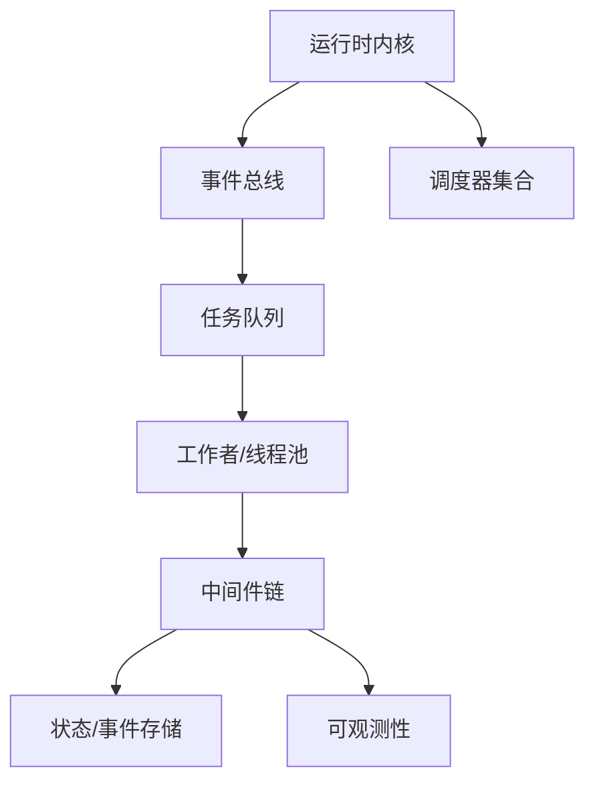

图表来源
- [engine/packages/engine/src/runtime-kernel.ts](file://engine/packages/engine/src/runtime-kernel.ts)
- [engine/packages/engine/src/event-bus.ts](file://engine/packages/engine/src/event-bus.ts)
- [engine/packages/engine/src/queue/task-queue.ts](file://engine/packages/engine/src/queue/task-queue.ts)
- [engine/packages/engine/src/workers/thread-pool.ts](file://engine/packages/engine/src/workers/thread-pool.ts)
- [engine/packages/engine/src/middleware/governance-middleware.ts](file://engine/packages/engine/src/middleware/governance-middleware.ts)
- [engine/packages/engine/src/state/run-state-store.ts](file://engine/packages/engine/src/state/run-state-store.ts)
- [engine/packages/engine/src/state/event-store.ts](file://engine/packages/engine/src/state/event-store.ts)
- [engine/packages/engine/src/observability/tracing.ts](file://engine/packages/engine/src/observability/tracing.ts)
- [engine/packages/engine/src/observability/metrics.ts](file://engine/packages/engine/src/observability/metrics.ts)
- [engine/packages/engine/src/observability/logging.ts](file://engine/packages/engine/src/observability/logging.ts)

章节来源
- [engine/packages/engine/src/runtime-kernel.ts](file://engine/packages/engine/src/runtime-kernel.ts)
- [engine/packages/engine/src/event-bus.ts](file://engine/packages/engine/src/event-bus.ts)
- [engine/packages/engine/src/queue/task-queue.ts](file://engine/packages/engine/src/queue/task-queue.ts)
- [engine/packages/engine/src/workers/thread-pool.ts](file://engine/packages/engine/src/workers/thread-pool.ts)
- [engine/packages/engine/src/middleware/governance-middleware.ts](file://engine/packages/engine/src/middleware/governance-middleware.ts)
- [engine/packages/engine/src/state/run-state-store.ts](file://engine/packages/engine/src/state/run-state-store.ts)
- [engine/packages/engine/src/state/event-store.ts](file://engine/packages/engine/src/state/event-store.ts)
- [engine/packages/engine/src/observability/tracing.ts](file://engine/packages/engine/src/observability/tracing.ts)
- [engine/packages/engine/src/observability/metrics.ts](file://engine/packages/engine/src/observability/metrics.ts)
- [engine/packages/engine/src/observability/logging.ts](file://engine/packages/engine/src/observability/logging.ts)

## 性能考量
- 队列与优先级
  - 合理设置优先级权重与公平性参数，避免低优先级饥饿
  - 批量拉取与批处理降低锁竞争与上下文切换
- 工作者与线程池
  - 根据CPU核数与IO比例调节线程数
  - 使用亲和性绑定提升缓存命中率
- 中间件
  - 最小化中间件数量与复杂度，避免串行阻塞
  - 重试退避与抖动避免雪崩
- 存储
  - 事件追加写与索引优化，定期归档历史事件
  - 运行状态快照粒度与频率平衡
- 可观测性
  - 采样追踪，避免全量上报造成额外开销
  - 指标聚合与降采样，减轻后端压力

[本节为通用指导，不直接分析具体文件]

## 故障排查指南
- 常见问题
  - 事件堆积：检查队列长度、工作者饱和度、背压信号
  - 高延迟：查看追踪跨度分布，识别慢步骤
  - 频繁重试：分析错误分类与退避策略，定位不稳定依赖
  - 死信增多：审查失败事件，补充补偿逻辑或修复下游
- 诊断手段
  - 启用详细日志与追踪，关联事件ID
  - 导出指标看板，观察吞吐、延迟、错误率趋势
  - 回放最近事件，复现问题路径
  - 断点调试：在中间件与工作者入口设置断点，逐步验证

章节来源
- [engine/packages/engine/src/observability/tracing.ts](file://engine/packages/engine/src/observability/tracing.ts)
- [engine/packages/engine/src/observability/metrics.ts](file://engine/packages/engine/src/observability/metrics.ts)
- [engine/packages/engine/src/observability/logging.ts](file://engine/packages/engine/src/observability/logging.ts)
- [engine/packages/engine/src/middleware/retry-middleware.ts](file://engine/packages/engine/src/middleware/retry-middleware.ts)
- [engine/packages/engine/src/middleware/dlq-middleware.ts](file://engine/packages/engine/src/middleware/dlq-middleware.ts)

## 结论
KCoder的异步事件处理以事件总线为核心，结合优先级队列、工作者线程池与可插拔中间件，形成高可用、可扩展的异步执行框架。通过状态与事件存储保障一致性与可回放性，配合完善的可观测性与错误恢复机制，满足复杂场景下的可靠性与性能需求。建议在生产环境中持续监控关键指标，结合业务特征调优队列与工作者参数，并完善补偿与死信处理流程，以提升整体稳定性。

[本节为总结性内容，不直接分析具体文件]

## 附录
- 术语
  - 事件：系统中发生的有状态变更或动作通知
  - 任务：被调度执行的事件实例
  - 中间件：在执行前后附加的横切逻辑
  - 死信队列：存放无法处理事件的归档通道
- 最佳实践
  - 为事件设计幂等键，避免重复副作用
  - 明确优先级语义，避免滥用导致不公平
  - 将昂贵操作放入工作者线程，保持主循环轻量
  - 对不稳定依赖实施熔断与降级
  - 定期演练回放与恢复流程

[本节为概念性内容，不直接分析具体文件]