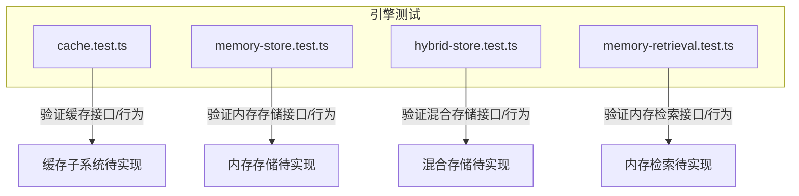
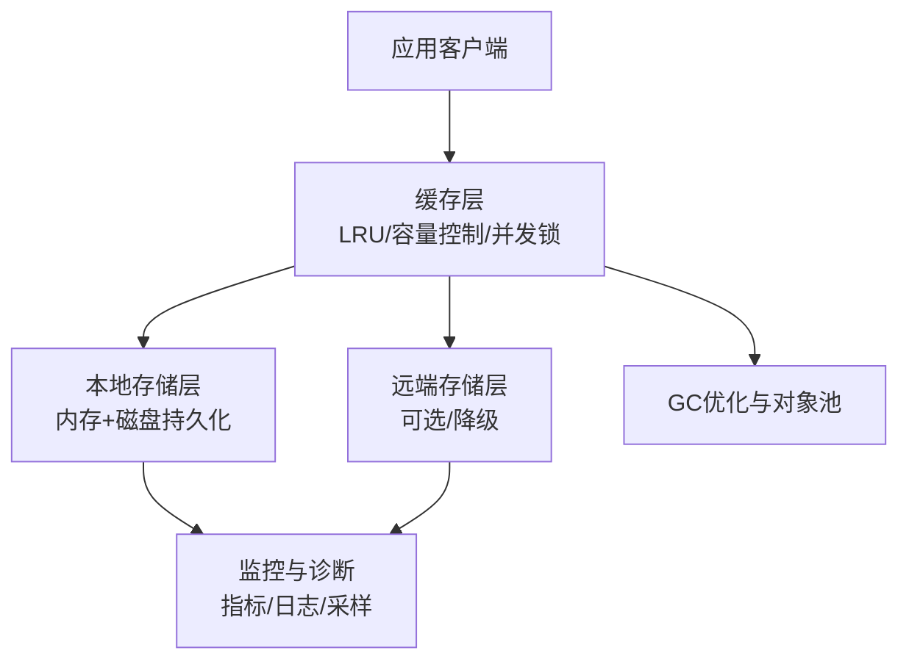
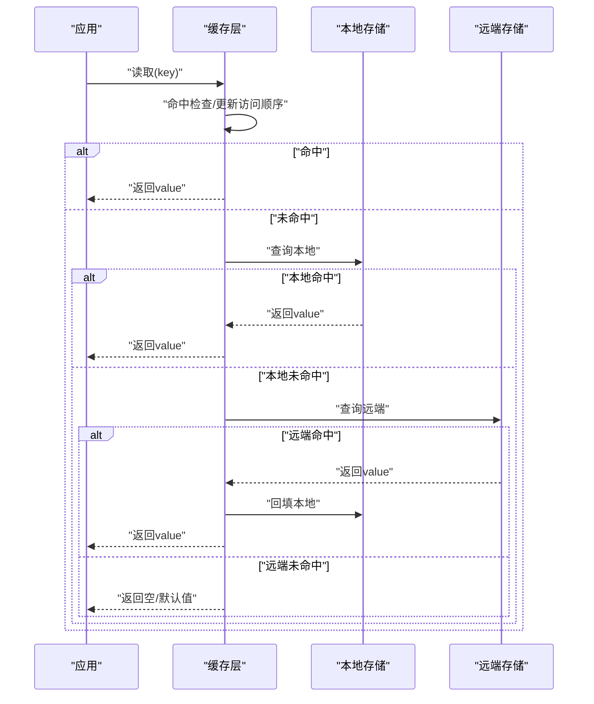
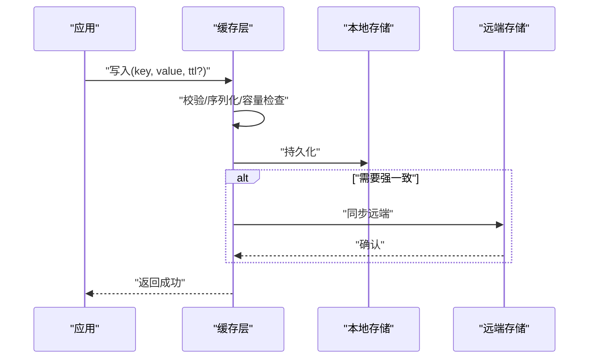
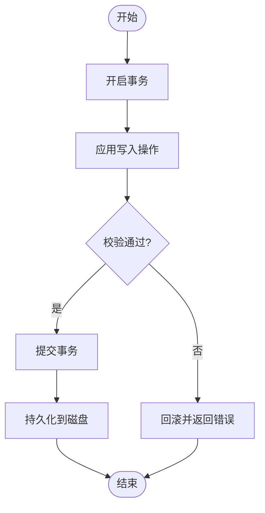
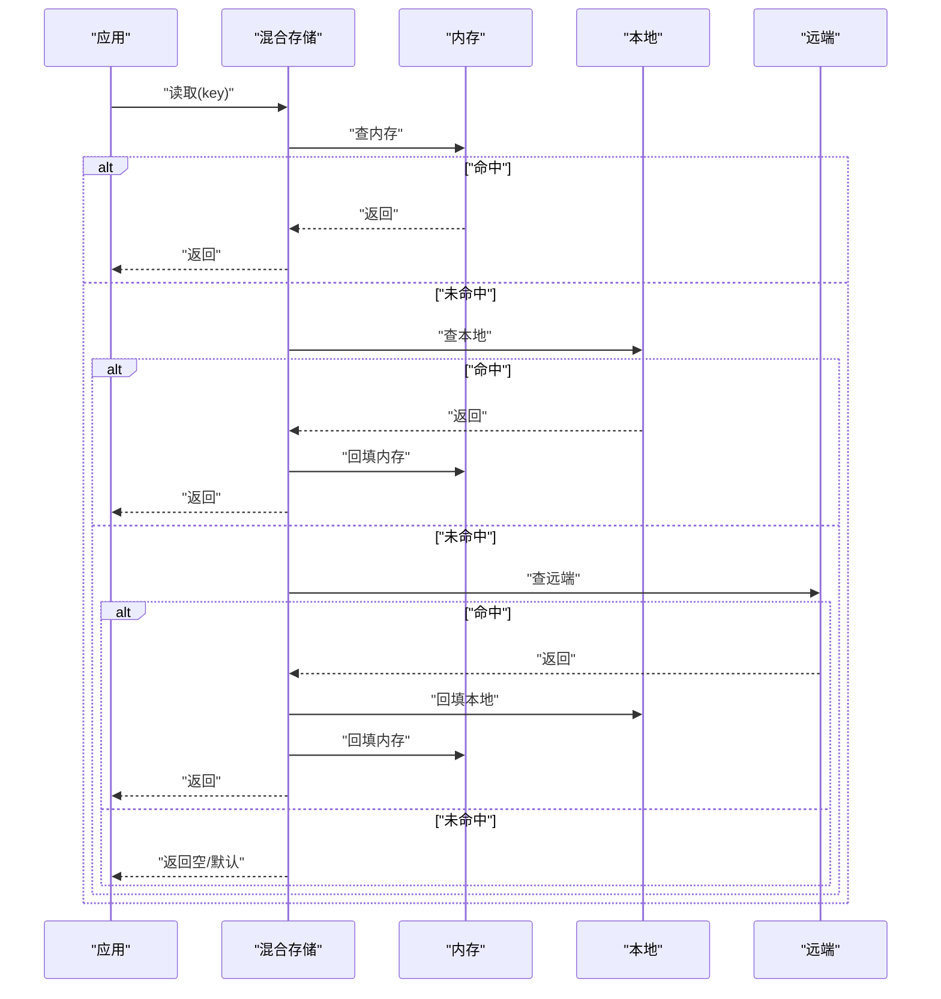
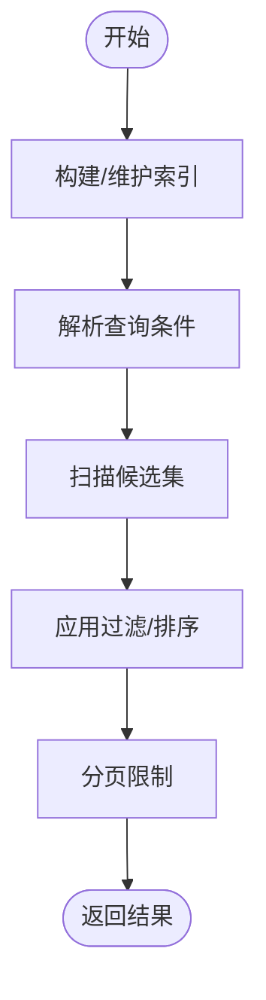
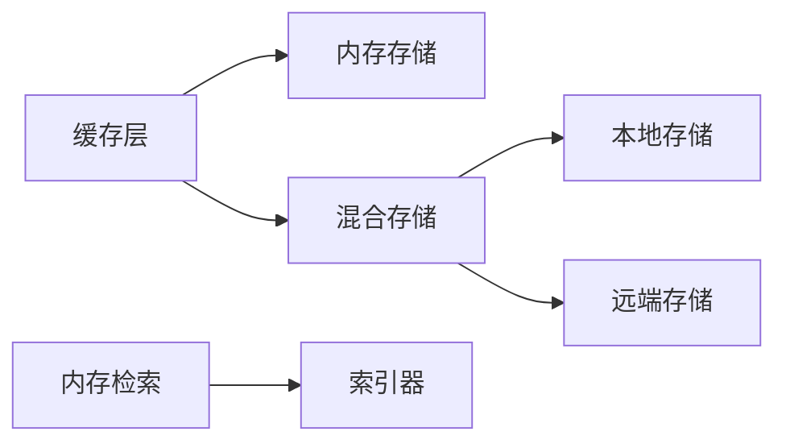

# 内存管理和缓存

<cite>
**本文引用的文件**   
- [cache.test.ts](file://engine/tests/cache.test.ts)
- [memory-store.test.ts](file://engine/tests/memory-store.test.ts)
- [hybrid-store.test.ts](file://engine/tests/hybrid-store.test.ts)
- [memory-retrieval.test.ts](file://engine/tests/memory-retrieval.test.ts)
</cite>

## 目录
1. [简介](#简介)
2. [项目结构](#项目结构)
3. [核心组件](#核心组件)
4. [架构总览](#架构总览)
5. [详细组件分析](#详细组件分析)
6. [依赖关系分析](#依赖关系分析)
7. [性能考虑](#性能考虑)
8. [故障排查指南](#故障排查指南)
9. [结论](#结论)
10. [附录](#附录)

## 简介
本技术文档聚焦于KCoder的内存管理与缓存系统，围绕以下目标展开：
- 内存管理策略：对象池、垃圾回收优化、内存泄漏检测
- 缓存架构设计：多级缓存、失效策略、一致性保证
- LRU缓存实现原理：淘汰算法、容量控制、并发安全
- 内存监控与诊断：使用统计、热点分析、泄漏检测
- 缓存性能优化：预热、批量操作、序列化优化
- 最佳实践：对象复用、弱引用、资源释放
- 缓存策略选择：场景化方案、权衡与配置调优
- 内存安全防护：边界检查、越界保护、异常处理

说明：当前仓库中未提供内存管理与缓存系统的源代码实现，仅包含若干测试用例。因此，本文基于这些测试用例所覆盖的功能点，结合通用工程实践，给出可落地的设计与实现建议，并明确标注“概念性内容”与“代码映射”。

## 项目结构
从仓库结构看，与内存和缓存相关的验证主要位于 engine/tests 目录下，涉及缓存、内存存储、混合存储以及内存检索等测试文件。这些测试为理解系统期望行为提供了重要线索。

图表来源
- [cache.test.ts:1-200](file://engine/tests/cache.test.ts#L1-L200)
- [memory-store.test.ts:1-200](file://engine/tests/memory-store.test.ts#L1-L200)
- [hybrid-store.test.ts:1-200](file://engine/tests/hybrid-store.test.ts#L1-L200)
- [memory-retrieval.test.ts:1-200](file://engine/tests/memory-retrieval.test.ts#L1-L200)

章节来源
- [cache.test.ts:1-200](file://engine/tests/cache.test.ts#L1-L200)
- [memory-store.test.ts:1-200](file://engine/tests/memory-store.test.ts#L1-L200)
- [hybrid-store.test.ts:1-200](file://engine/tests/hybrid-store.test.ts#L1-L200)
- [memory-retrieval.test.ts:1-200](file://engine/tests/memory-retrieval.test.ts#L1-L200)

## 核心组件
本节概述与内存和缓存相关的关键能力，并结合测试文件定位其职责边界。

- 缓存子系统
  - 职责：提供键值存取、过期/失效、命中率统计、并发访问安全等能力
  - 参考测试：[cache.test.ts](file://engine/tests/cache.test.ts)

- 内存存储
  - 职责：在进程内提供持久化的键值存储（相对于纯内存），支持读写事务、数据落盘与恢复
  - 参考测试：[memory-store.test.ts](file://engine/tests/memory-store.test.ts)

- 混合存储
  - 职责：组合多种后端（如内存+磁盘或内存+远程），提供统一接口与自动降级/回退
  - 参考测试：[hybrid-store.test.ts](file://engine/tests/hybrid-store.test.ts)

- 内存检索
  - 职责：面向内存中的数据结构进行高效检索（索引、过滤、排序等）
  - 参考测试：[memory-retrieval.test.ts](file://engine/tests/memory-retrieval.test.ts)

章节来源
- [cache.test.ts:1-200](file://engine/tests/cache.test.ts#L1-L200)
- [memory-store.test.ts:1-200](file://engine/tests/memory-store.test.ts#L1-L200)
- [hybrid-store.test.ts:1-200](file://engine/tests/hybrid-store.test.ts#L1-L200)
- [memory-retrieval.test.ts:1-200](file://engine/tests/memory-retrieval.test.ts#L1-L200)

## 架构总览
下图展示了一个典型的多级缓存与内存管理架构，涵盖内存层、本地持久层、远端层及监控诊断模块。该图为概念性架构图，用于指导后续实现。

[此图为概念性架构示意，不直接映射具体源码文件]

## 详细组件分析

### 缓存子系统（LRU + 多级）
- 设计要点
  - 淘汰策略：LRU（最近最少使用）作为默认淘汰算法；可按业务切换LFU/LFU-TTL等
  - 容量控制：最大条目数与单条大小上限，避免内存膨胀
  - 并发安全：读写分离锁或细粒度分段锁，保障高并发下的吞吐与一致性
  - 失效策略：TTL（时间过期）、主动失效（按Key/Tag）、惰性删除与后台清理
  - 一致性：读多写少场景采用最终一致；强一致需引入分布式锁或版本戳
  - 监控：命中率、延迟分布、淘汰计数、内存占用、热点Key

- 关键流程（读取路径）

[此图为概念性流程图，不直接映射具体源码文件]

- 关键流程（写入路径）

[此图为概念性流程图，不直接映射具体源码文件]

- 复杂度与性能
  - 时间复杂度：插入/查找/删除均摊O(1)（哈希表+双向链表）
  - 空间复杂度：O(n)，n为缓存条目数
  - 并发模型：分片锁或无锁队列+快照，降低锁竞争
  - 内存开销：注意对象头、指针、序列化体积；对大对象启用压缩或外存

章节来源
- [cache.test.ts:1-200](file://engine/tests/cache.test.ts#L1-L200)

### 内存存储（Memory Store）
- 设计要点
  - 进程内KV存储，支持事务、原子操作、范围扫描
  - 持久化：定期快照与增量WAL，崩溃恢复时重放
  - 隔离：命名空间/前缀隔离，避免跨租户污染
  - 一致性：单节点线性一致；集群扩展需引入复制协议

- 关键流程（事务写入）

[此图为概念性流程图，不直接映射具体源码文件]

- 监控与诊断
  - 指标：事务量、延迟、失败率、磁盘IO、WAL长度、快照大小
  - 告警：慢事务、长事务、磁盘空间不足、WAL堆积

章节来源
- [memory-store.test.ts:1-200](file://engine/tests/memory-store.test.ts#L1-L200)

### 混合存储（Hybrid Store）
- 设计要点
  - 组合策略：内存优先、本地兜底、远端主备；支持按Key路由或按条件降级
  - 一致性：读写路径上的幂等与重试；冲突解决策略（最后写入胜出/合并）
  - 容错：超时、熔断、限流、快速失败与优雅降级
  - 观测：分层命中率、回源率、降级触发次数

- 关键流程（带降级的读取）

[此图为概念性流程图，不直接映射具体源码文件]

章节来源
- [hybrid-store.test.ts:1-200](file://engine/tests/hybrid-store.test.ts#L1-L200)

### 内存检索（Memory Retrieval）
- 设计要点
  - 索引结构：倒排索引、B树/R树、布隆过滤器等
  - 查询语言：支持过滤、投影、分页、聚合
  - 并发：只读索引共享，写时复制或分片索引
  - 内存控制：索引压缩、稀疏表示、按需加载

- 典型流程（过滤检索）

[此图为概念性流程图，不直接映射具体源码文件]

章节来源
- [memory-retrieval.test.ts:1-200](file://engine/tests/memory-retrieval.test.ts#L1-L200)

## 依赖关系分析
- 组件耦合
  - 缓存层依赖内存存储与混合存储抽象；对外暴露统一KV接口
  - 混合存储依赖本地存储与远端存储适配器
  - 内存检索依赖底层内存结构与索引器
- 外部依赖
  - 序列化库（JSON/BSON/MessagePack等）
  - 监控与日志（Prometheus/OpenTelemetry/结构化日志）
  - 并发原语（锁、信号量、原子变量）

[此图为概念性依赖图，不直接映射具体源码文件]

## 性能考虑
- 缓存预热
  - 启动阶段预加载热点Key集合，减少冷启动抖动
  - 渐进式预热：按权重与访问频率动态调整
- 批量操作
  - 批写合并、批量读取、批量失效，降低锁竞争与网络往返
- 序列化优化
  - 选择紧凑格式（如MessagePack/FlatBuffers），减少CPU与带宽消耗
  - 大对象分块/压缩/外存，避免堆溢出
- 内存管理
  - 对象池：高频小对象复用，减少GC压力
  - 弱引用：缓存大对象时使用弱引用，允许GC回收
  - 容量阈值：设置软/硬上限，触发驱逐与背压
- 监控与调优
  - 采集命中率、P99延迟、淘汰率、内存峰值
  - 基于指标动态调整TTL、容量、并发度

[本节为通用性能建议，不直接分析具体文件]

## 故障排查指南
- 常见问题
  - 缓存穿透：空值缓存、布隆过滤器拦截
  - 缓存雪崩：随机化TTL、分级缓存、限流熔断
  - 热点Key：本地副本、分片、读写分离
  - 内存泄漏：未释放句柄、闭包引用、全局状态累积
- 诊断手段
  - 内存快照与堆转储分析
  - 热点Key追踪与调用链采样
  - 指标看板：命中率、延迟、淘汰、GC停顿
- 修复建议
  - 增加边界检查与输入校验
  - 完善异常处理与重试退避
  - 引入资源释放钩子与自动清理任务

[本节为通用故障排查建议，不直接分析具体文件]

## 结论
通过对测试文件的梳理与通用工程实践的结合，本文给出了KCoder内存管理与缓存系统的整体设计方案与落地建议。建议在实现阶段以测试驱动开发，逐步补齐缓存、内存存储、混合存储与内存检索的核心能力，并通过完善的监控与压测确保稳定性与性能。

[本节为总结性内容，不直接分析具体文件]

## 附录
- 术语
  - TTL：生存时间
  - LRU：最近最少使用
  - LFU：最不经常使用
  - WAL：预写日志
  - P99：第99百分位延迟
- 参考测试文件
  - [cache.test.ts](file://engine/tests/cache.test.ts)
  - [memory-store.test.ts](file://engine/tests/memory-store.test.ts)
  - [hybrid-store.test.ts](file://engine/tests/hybrid-store.test.ts)
  - [memory-retrieval.test.ts](file://engine/tests/memory-retrieval.test.ts)