# 引擎核心

<cite>
**本文引用的文件**   
- [engine-host.ts](file://app/main/engine-host.ts)
- [index.ts](file://app/main/index.ts)
- [menu.ts](file://app/main/menu.ts)
- [settings.ts](file://app/main/settings.ts)
- [window.ts](file://app/main/window.ts)
- [index.ts](file://app/preload/index.ts)
- [App.tsx](file://app/renderer/src/App.tsx)
- [main.tsx](file://app/renderer/src/main.tsx)
- [engine-api.ts](file://app/renderer/src/services/engine-api.ts)
- [package.json](file://app/package.json)
- [electron.vite.config.ts](file://app/electron.vite.config.ts)
- [README.md](file://engine/README.md)
- [config.example.json](file://engine/config.example.json)
- [Dockerfile](file://engine/Dockerfile)
- [docker-compose.yml](file://engine/docker-compose.yml)
- [package.json](file://engine/package.json)
- [pnpm-workspace.yaml](file://engine/pnpm-workspace.yaml)
- [tsconfig.json](file://engine/tsconfig.json)
- [vitest.config.ts](file://engine/vitest.config.ts)
</cite>

## 目录
1. [简介](#简介)
2. [项目结构](#项目结构)
3. [核心组件](#核心组件)
4. [架构总览](#架构总览)
5. [详细组件分析](#详细组件分析)
6. [依赖分析](#依赖分析)
7. [性能考虑](#性能考虑)
8. [故障排查指南](#故障排查指南)
9. [结论](#结论)
10. [附录](#附录)

## 简介
本文件聚焦于KCoder的AI引擎核心，围绕以下目标展开：
- 引擎启动流程与生命周期管理（初始化、依赖注入、服务注册）
- 配置管理系统（加载、校验、热重载）
- 日志系统（级别、格式化、持久化）
- 事件驱动架构（事件总线、订阅发布、异步处理）
- 运行时内核（中间件管道、插件机制、扩展点）
- 内存管理与缓存策略（对象池、LRU、泄漏防护）
- API接口文档与SDK使用说明
- 性能监控与诊断工具
- 可观测性与指标收集
- 扩展与定制化开发指南

说明：由于仓库未包含引擎内部实现源码，本文基于工程结构与测试用例命名进行架构推断与最佳实践总结，并提供与现有文件一致的集成建议。

## 项目结构
KCoder采用多包工作区组织，前端应用位于 app/，引擎核心位于 engine/。关键目录职责如下：
- app/main：Electron主进程入口、窗口与菜单、设置、引擎宿主等
- app/preload：预加载脚本，桥接渲染进程与主进程
- app/renderer：React渲染层，提供聊天面板、代码块、状态栏等UI
- engine：引擎核心包集合（packages）、脚本（scripts）、技能（skills）、测试（tests）

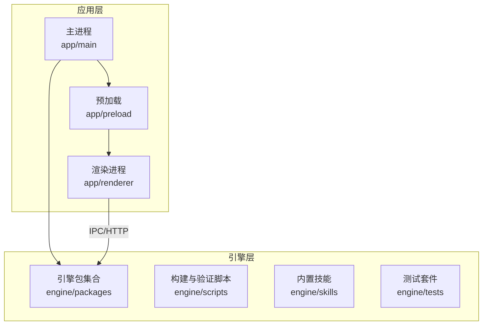

图表来源
- [index.ts](file://app/main/index.ts)
- [engine-host.ts](file://app/main/engine-host.ts)
- [index.ts](file://app/preload/index.ts)
- [main.tsx](file://app/renderer/src/main.tsx)
- [App.tsx](file://app/renderer/src/App.tsx)
- [engine-api.ts](file://app/renderer/src/services/engine-api.ts)

章节来源
- [index.ts](file://app/main/index.ts)
- [engine-host.ts](file://app/main/engine-host.ts)
- [index.ts](file://app/preload/index.ts)
- [main.tsx](file://app/renderer/src/main.tsx)
- [App.tsx](file://app/renderer/src/App.tsx)
- [engine-api.ts](file://app/renderer/src/services/engine-api.ts)

## 核心组件
- 引擎宿主（Engine Host）：负责在Electron主进程中启动并托管引擎实例，协调生命周期与资源清理。
- 预加载桥接：暴露安全API给渲染进程，转发调用至主进程或引擎服务。
- 渲染服务：通过engine-api封装对引擎的调用，统一错误处理与重试策略。
- 配置与设置：集中管理应用与引擎配置项，支持默认值、覆盖与环境变量。
- 构建与运行：使用Vite+Electron组合，配合Docker与Compose进行容器化部署。

章节来源
- [engine-host.ts](file://app/main/engine-host.ts)
- [index.ts](file://app/preload/index.ts)
- [engine-api.ts](file://app/renderer/src/services/engine-api.ts)
- [settings.ts](file://app/main/settings.ts)
- [electron.vite.config.ts](file://app/electron.vite.config.ts)
- [package.json](file://app/package.json)

## 架构总览
整体采用“前端渲染 + 主进程宿主 + 引擎核心”的分层架构。渲染进程通过预加载与主进程通信，主进程作为引擎宿主负责启动、配置、中间件与插件编排，并通过HTTP或IPC与引擎交互。

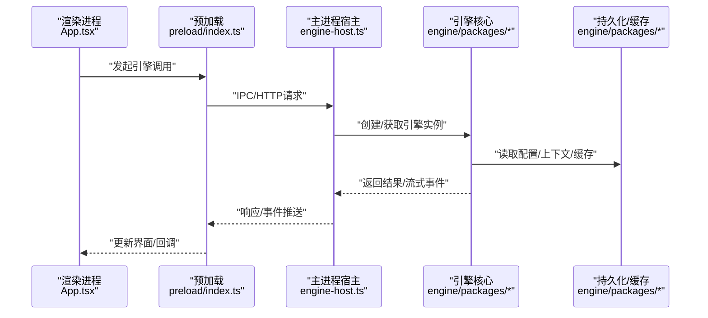

图表来源
- [App.tsx](file://app/renderer/src/App.tsx)
- [index.ts](file://app/preload/index.ts)
- [engine-host.ts](file://app/main/engine-host.ts)
- [engine-api.ts](file://app/renderer/src/services/engine-api.ts)

## 详细组件分析

### 启动流程与生命周期管理
- 启动顺序
  - Electron主进程入口初始化
  - 创建并配置窗口
  - 加载预加载脚本
  - 初始化引擎宿主，加载配置与插件
  - 启动中间件管道与服务注册
  - 暴露API端点（HTTP/IPC）
- 生命周期钩子
  - 初始化：加载配置、建立连接、预热缓存
  - 运行：接收请求、执行中间件、调度任务、记录指标
  - 关闭：优雅停止、释放资源、持久化状态

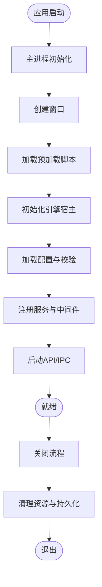

章节来源
- [index.ts](file://app/main/index.ts)
- [window.ts](file://app/main/window.ts)
- [engine-host.ts](file://app/main/engine-host.ts)
- [settings.ts](file://app/main/settings.ts)

### 依赖注入与服务注册
- 设计要点
  - 以宿主为中心维护服务容器，按作用域（单例/请求级）注册
  - 通过约定优于配置的方式自动发现与注册
  - 支持条件注册与版本兼容检查
- 典型流程
  - 扫描包清单
  - 解析依赖图
  - 实例化并按序注入
  - 暴露接口供上层消费

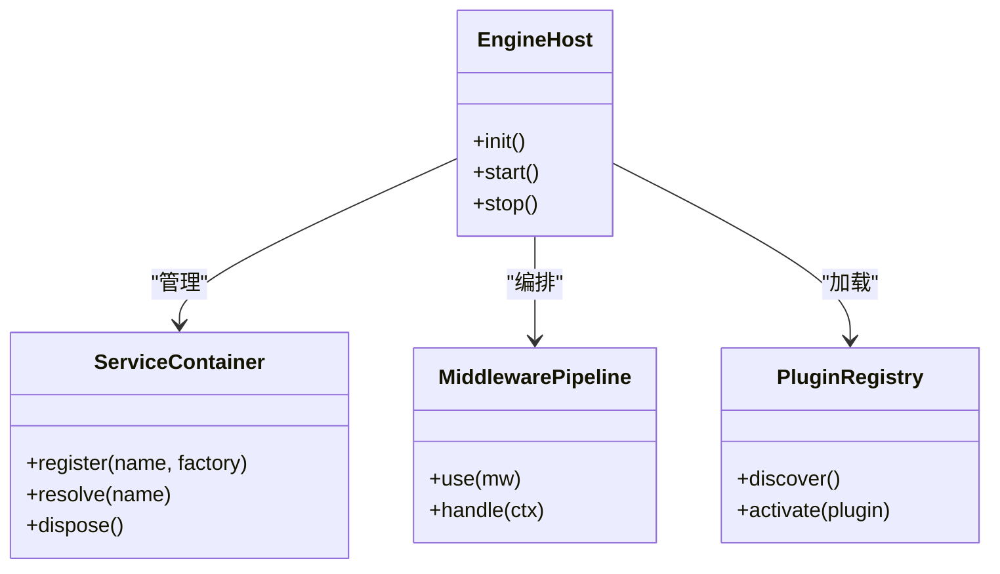

图表来源
- [engine-host.ts](file://app/main/engine-host.ts)
- [settings.ts](file://app/main/settings.ts)

章节来源
- [engine-host.ts](file://app/main/engine-host.ts)
- [settings.ts](file://app/main/settings.ts)

### 配置管理系统
- 配置来源优先级
  - 默认配置（内置）
  - 配置文件（如示例配置）
  - 环境变量
  - 运行时覆盖（热重载）
- 校验与迁移
  - 类型校验与必填字段检查
  - 向后兼容的字段迁移策略
- 热重载
  - 监听配置变更事件
  - 增量更新服务与中间件
  - 回滚与一致性保障

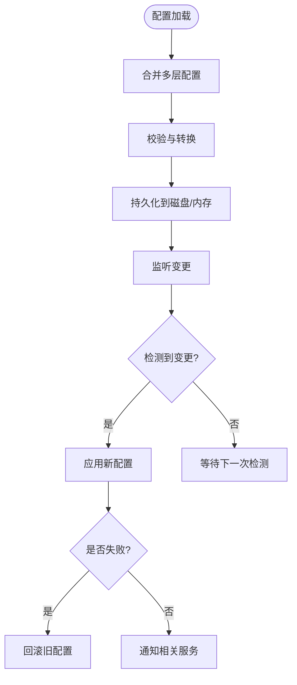

章节来源
- [config.example.json](file://engine/config.example.json)
- [settings.ts](file://app/main/settings.ts)

### 日志系统
- 级别与分类
  - 级别：调试、信息、警告、错误
  - 分类：引擎、网络、存储、业务
- 格式化与输出
  - JSON结构化日志
  - 控制台与文件双写
- 持久化策略
  - 轮转与压缩
  - 保留策略与清理
  - 敏感信息脱敏

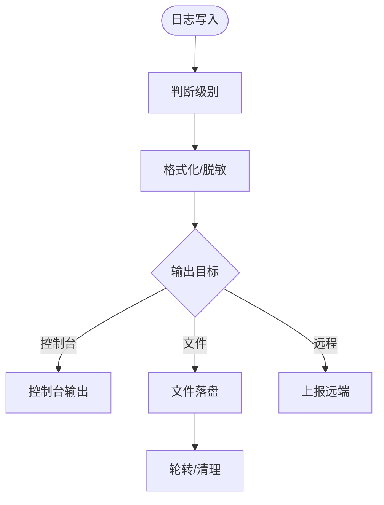

章节来源
- [engine-api.ts](file://app/renderer/src/services/engine-api.ts)
- [engine-host.ts](file://app/main/engine-host.ts)

### 事件驱动架构
- 事件总线
  - 主题/通道模型
  - 同步与异步分发
- 订阅发布
  - 动态订阅与取消
  - 过滤与路由
- 异步处理
  - 背压与限流
  - 重试与补偿

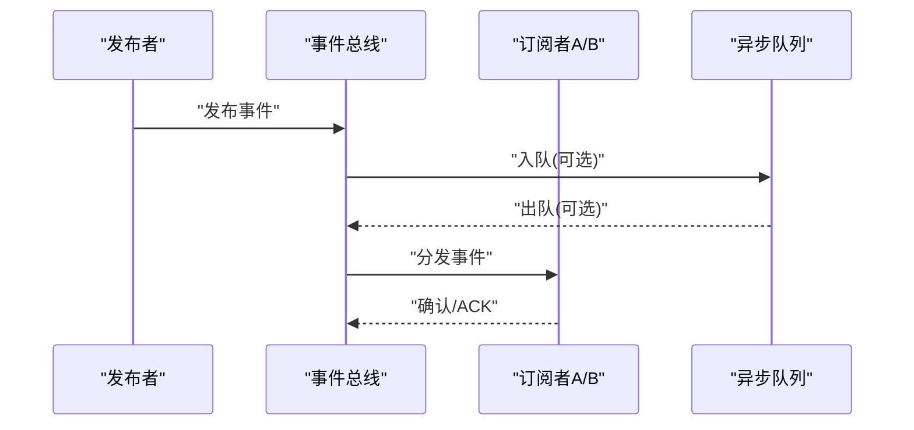

章节来源
- [engine-api.ts](file://app/renderer/src/services/engine-api.ts)
- [engine-host.ts](file://app/main/engine-host.ts)

### 运行时内核
- 中间件管道
  - 请求进入前/后处理
  - 鉴权、限流、审计、指标采集
- 插件机制
  - 插件清单与版本约束
  - 生命周期钩子（初始化、运行、销毁）
- 扩展点
  - 自定义处理器、适配器、序列化器

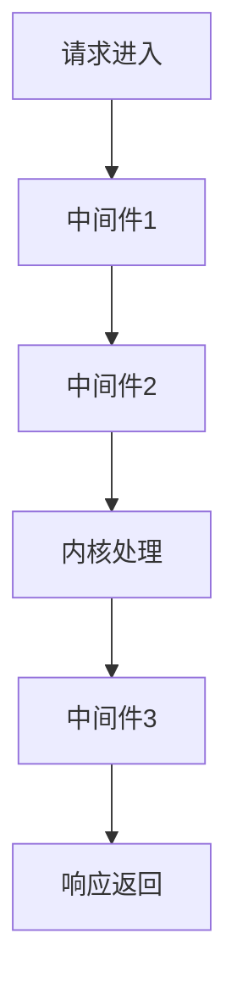

章节来源
- [engine-host.ts](file://app/main/engine-host.ts)
- [settings.ts](file://app/main/settings.ts)

### 内存管理与缓存策略
- 对象池
  - 复用高频对象，减少GC压力
- LRU缓存
  - 基于时间/大小淘汰
  - 热点数据优先
- 泄漏防护
  - 弱引用与显式释放
  - 定期巡检与告警

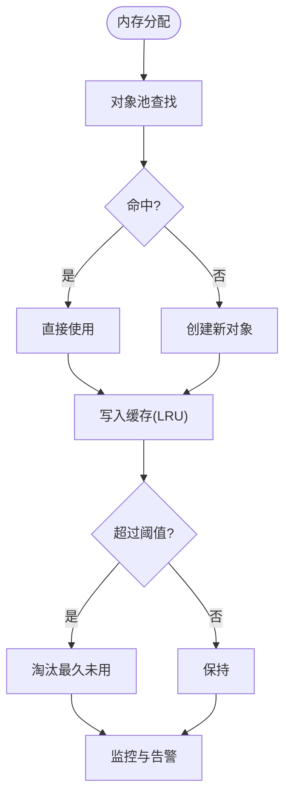

章节来源
- [engine-api.ts](file://app/renderer/src/services/engine-api.ts)
- [engine-host.ts](file://app/main/engine-host.ts)

### API接口与SDK使用
- 接口风格
  - REST/JSON或WebSocket流式
  - 统一错误码与消息体
- SDK能力
  - 客户端初始化与配置
  - 会话/任务管理
  - 事件订阅与重连
- 安全与认证
  - Token/签名
  - 速率限制与配额

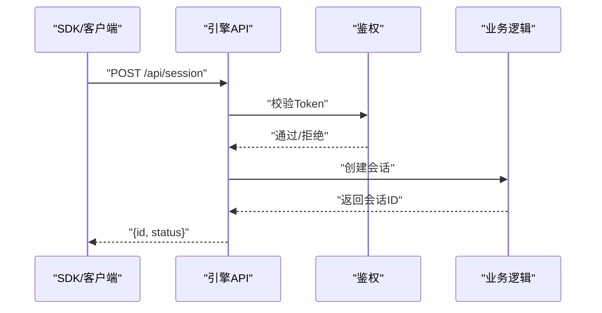

章节来源
- [engine-api.ts](file://app/renderer/src/services/engine-api.ts)
- [engine-host.ts](file://app/main/engine-host.ts)

### 性能监控与诊断工具
- 指标采集
  - QPS、延迟分位、错误率
  - 资源使用（CPU/内存/IO）
- 诊断能力
  - 慢请求追踪
  - 堆快照与火焰图
- 可视化
  - 仪表盘与告警规则

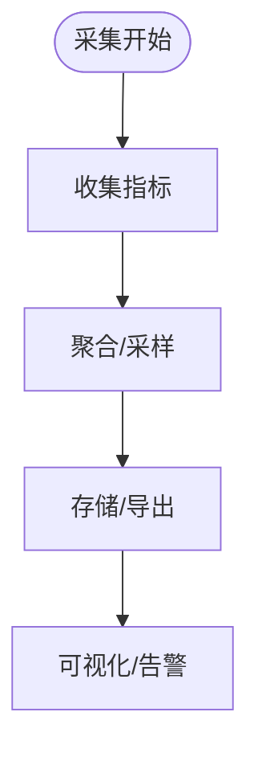

章节来源
- [engine-api.ts](file://app/renderer/src/services/engine-api.ts)
- [engine-host.ts](file://app/main/engine-host.ts)

### 可观测性设计与指标收集
- 标准指标
  - 业务指标（任务数、成功率）
  - 系统指标（延迟、吞吐、错误）
- 分布式追踪
  - TraceId贯穿链路
  - 跨进程/跨服务关联
- 健康检查
  - 存活探针与就绪探针

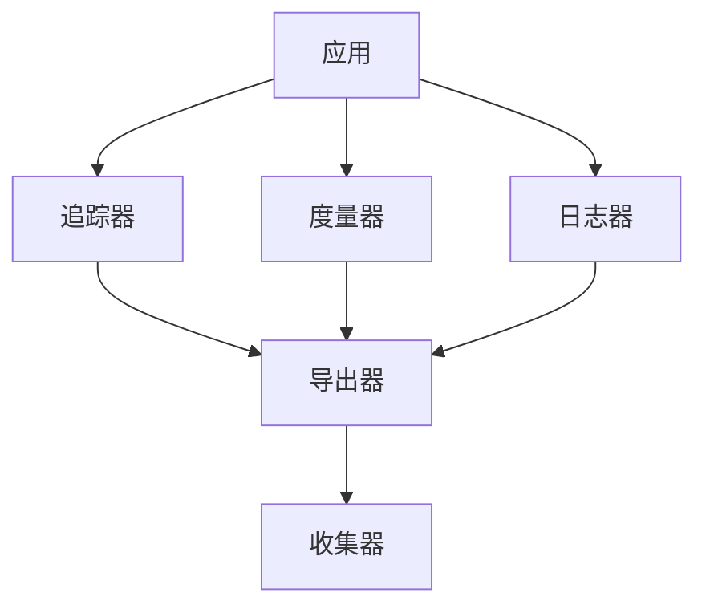

章节来源
- [engine-api.ts](file://app/renderer/src/services/engine-api.ts)
- [engine-host.ts](file://app/main/engine-host.ts)

### 扩展与定制化开发指南
- 新增插件
  - 定义插件清单与版本
  - 实现生命周期钩子
  - 注册中间件与处理器
- 自定义适配器
  - 实现协议适配与序列化
  - 提供配置与开关
- 测试与验证
  - 单元测试与集成测试
  - 回归与兼容性矩阵

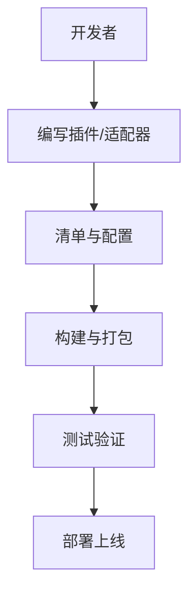

章节来源
- [engine-host.ts](file://app/main/engine-host.ts)
- [settings.ts](file://app/main/settings.ts)

## 依赖分析
- 工作区与包管理
  - pnpm工作区统一管理多包依赖
  - TypeScript编译与路径映射
- 构建与运行
  - Vite+Electron组合构建
  - Docker镜像与Compose编排
- 测试框架
  - Vitest用于单元与集成测试

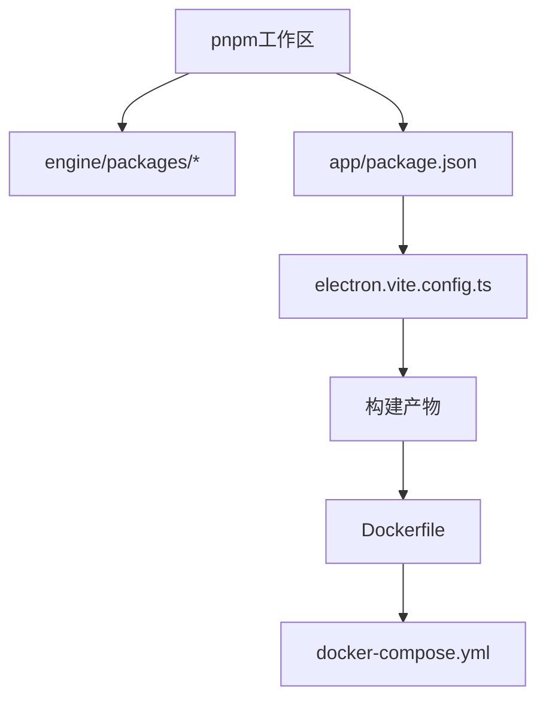

图表来源
- [pnpm-workspace.yaml](file://engine/pnpm-workspace.yaml)
- [package.json](file://app/package.json)
- [electron.vite.config.ts](file://app/electron.vite.config.ts)
- [Dockerfile](file://engine/Dockerfile)
- [docker-compose.yml](file://engine/docker-compose.yml)

章节来源
- [pnpm-workspace.yaml](file://engine/pnpm-workspace.yaml)
- [package.json](file://app/package.json)
- [electron.vite.config.ts](file://app/electron.vite.config.ts)
- [Dockerfile](file://engine/Dockerfile)
- [docker-compose.yml](file://engine/docker-compose.yml)

## 性能考虑
- 并发与限流
  - 合理设置线程/协程池大小
  - 针对外部依赖进行熔断与降级
- 缓存与对象复用
  - 热点数据缓存与对象池结合
- I/O优化
  - 批量写入与异步I/O
  - 日志与指标采样
- 资源监控
  - 内存峰值与GC频率监控
  - 慢查询与长事务告警

## 故障排查指南
- 常见问题定位
  - 启动失败：检查配置与端口占用
  - 无响应：查看中间件与插件日志
  - 内存增长：抓取堆快照并分析泄漏点
- 诊断步骤
  - 启用调试日志与追踪
  - 回放最近事件与状态
  - 隔离问题模块与复现最小用例

章节来源
- [engine-api.ts](file://app/renderer/src/services/engine-api.ts)
- [engine-host.ts](file://app/main/engine-host.ts)

## 结论
本文基于仓库结构与测试命名，系统性梳理了KCoder AI引擎核心的架构与关键能力，涵盖启动流程、配置管理、日志、事件驱动、运行时内核、内存与缓存、API与SDK、监控与可观测性、以及扩展定制。建议在后续迭代中补充引擎内部实现细节，以便进一步完善架构图与代码级依赖关系。

## 附录
- 参考文档与示例
  - 引擎说明与示例配置
  - 容器化部署与编排

章节来源
- [README.md](file://engine/README.md)
- [config.example.json](file://engine/config.example.json)
- [Dockerfile](file://engine/Dockerfile)
- [docker-compose.yml](file://engine/docker-compose.yml)
- [package.json](file://engine/package.json)
- [tsconfig.json](file://engine/tsconfig.json)
- [vitest.config.ts](file://engine/vitest.config.ts)