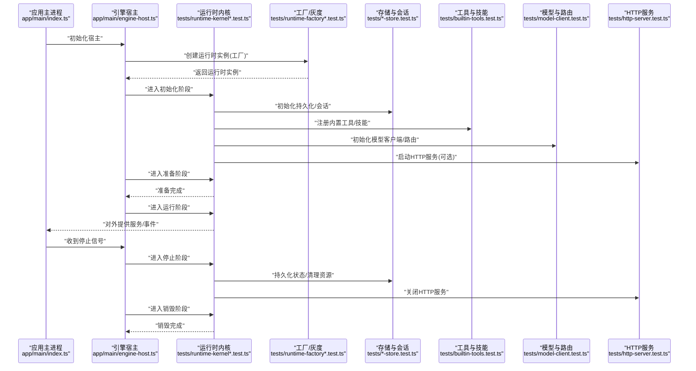
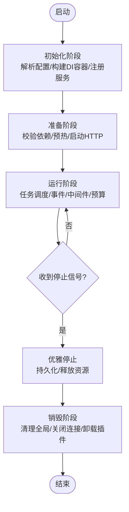
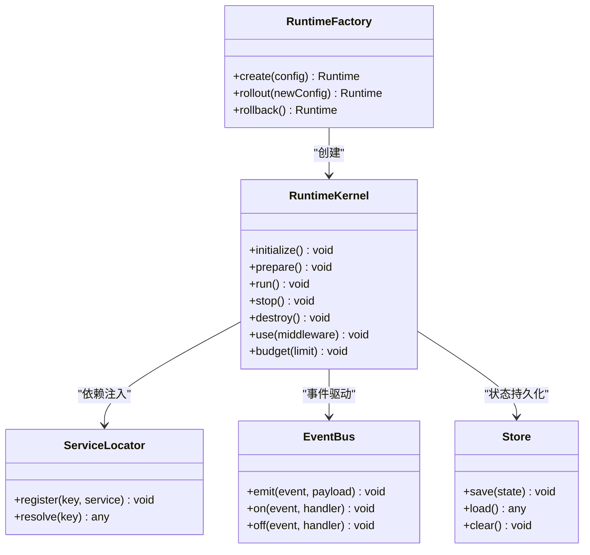
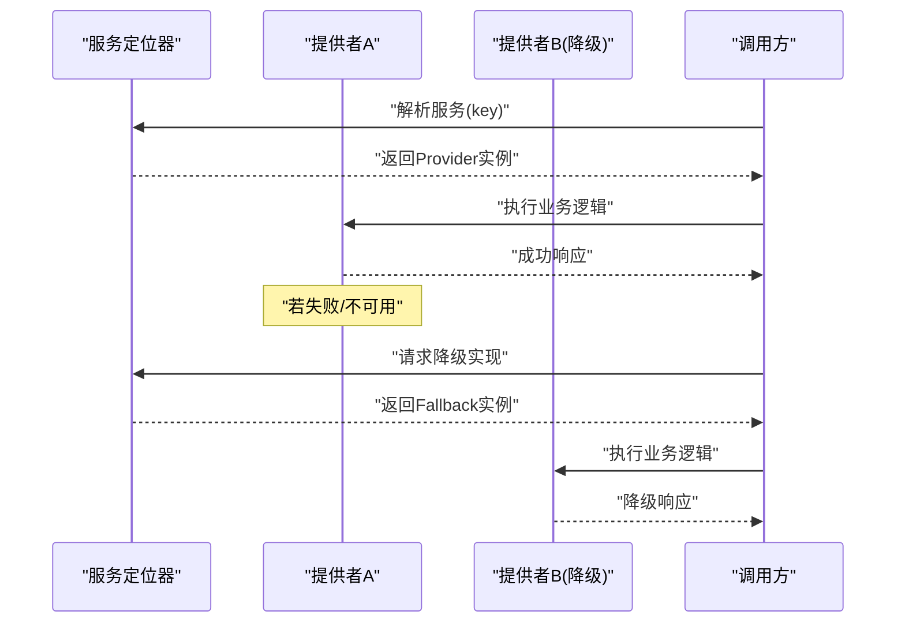
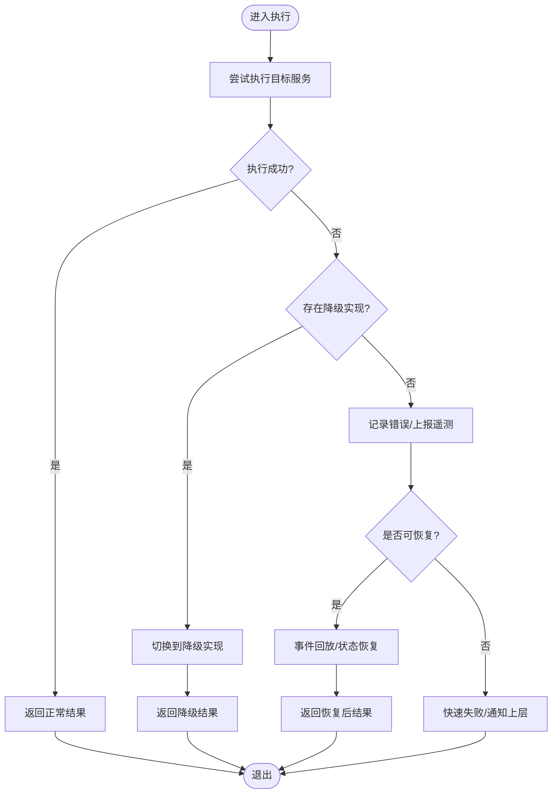
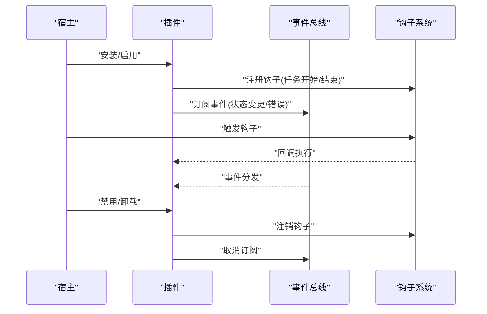
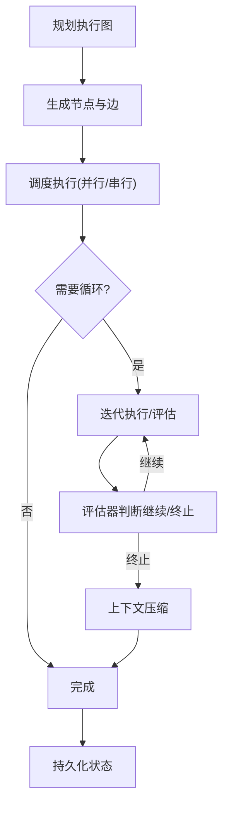
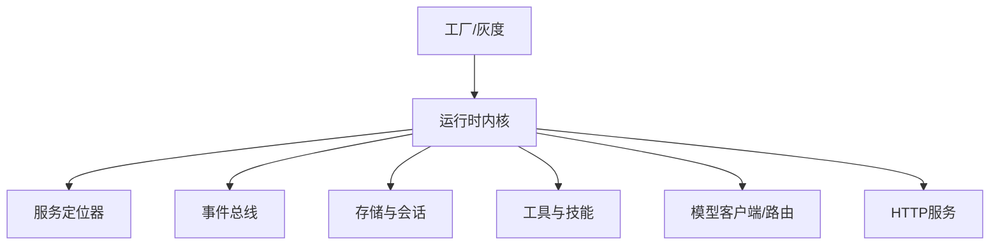

# 引擎生命周期管理

<cite>
**本文引用的文件**   
- [engine-host.ts](file://app/main/engine-host.ts)
- [index.ts](file://app/main/index.ts)
- [menu.ts](file://app/main/menu.ts)
- [settings.ts](file://app/main/settings.ts)
- [window.ts](file://app/main/window.ts)
- [package.json](file://engine/package.json)
- [README.md](file://engine/README.md)
- [config.example.json](file://engine/config.example.json)
- [Dockerfile](file://engine/Dockerfile)
- [docker-compose.yml](file://engine/docker-compose.yml)
- [tsconfig.json](file://engine/tsconfig.json)
- [vitest.config.ts](file://engine/vitest.config.ts)
- [runtime-kernel.test.ts](file://engine/tests/runtime-kernel.test.ts)
- [runtime-kernel-e2e.test.ts](file://engine/tests/runtime-kernel-e2e.test.ts)
- [runtime-kernel-crash-recovery.test.ts](file://engine/tests/runtime-kernel-crash-recovery.test.ts)
- [runtime-kernel-contracts.test.ts](file://engine/tests/runtime-kernel-contracts.test.ts)
- [runtime-kernel-provider-matrix.test.ts](file://engine/tests/runtime-kernel-provider-matrix.test.ts)
- [runtime-kernel-isolation.test.ts](file://engine/tests/runtime-kernel-isolation.test.ts)
- [runtime-kernel-parity.test.ts](file://engine/tests/runtime-kernel-parity.test.ts)
- [runtime-kernel-budget.test.ts](file://engine/tests/runtime-kernel-budget.test.ts)
- [runtime-kernel-after-middleware.test.ts](file://engine/tests/runtime-kernel-after-middleware.test.ts)
- [runtime-kernel-replay.test.ts](file://engine/tests/runtime-kernel-replay.test.ts)
- [runtime-factory.test.ts](file://engine/tests/runtime-factory.test.ts)
- [runtime-factory-rollout.test.ts](file://engine/tests/runtime-factory-rollout.test.ts)
- [runtime-event-projection.test.ts](file://engine/tests/runtime-event-projection.test.ts)
- [runtime-event-recorder-kernel.test.ts](file://engine/tests/runtime-event-recorder-kernel.test.ts)
- [runtime-event-reducer.test.ts](file://engine/tests/runtime-event-reducer.test.ts)
- [turn-state-store.test.ts](file://engine/tests/turn-state-store.test.ts)
- [task-state-store.test.ts](file://engine/tests/task-state-store.test.ts)
- [run-state-store.test.ts](file://engine/tests/run-state-store.test.ts)
- [execution-graph.test.ts](file://engine/tests/execution-graph.test.ts)
- [tool-runtime-v3.test.ts](file://engine/tests/tool-runtime-v3.test.ts)
- [delegation-runtime.test.ts](file://engine/tests/delegation-runtime.test.ts)
- [loop-runner.test.ts](file://engine/tests/loop-runner.test.ts)
- [compaction-governor.test.ts](file://engine/tests/compaction-governor.test.ts)
- [context-compactor.test.ts](file://engine/tests/context-compactor.test.ts)
- [memory-store.test.ts](file://engine/tests/memory-store.test.ts)
- [hybrid-store.test.ts](file://engine/tests/hybrid-store.test.ts)
- [file-session-store.test.ts](file://engine/tests/file-session-store.test.ts)
- [file-session-store-integration.test.ts](file://engine/tests/file-session-store-integration.test.ts)
- [evented-loop.test.ts](file://engine/tests/evented-loop.test.ts)
- [http-server.test.ts](file://engine/tests/http-server.test.ts)
- [http-server-observability.test.ts](file://engine/tests/http-server-observability.test.ts)
- [plugin-host.test.ts](file://engine/tests/plugin-host.test.ts)
- [capability-registry.test.ts](file://engine/tests/capability-registry.test.ts)
- [builtin-tools.test.ts](file://engine/tests/builtin-tools.test.ts)
- [model-client.test.ts](file://engine/tests/model-client.test.ts)
- [auto-model-router.test.ts](file://engine/tests/auto-model-router.test.ts)
- [provider-compatibility.test.ts](file://engine/tests/provider-compatibility.test.ts)
- [mcp-tool-provider.test.ts](file://engine/tests/mcp-tool-provider.test.ts)
- [web-tool-provider.test.ts](file://engine/tests/web-tool-provider.test.ts)
- [skill-runtime.test.ts](file://engine/tests/skill-runtime.test.ts)
- [skill-command-registry.test.ts](file://engine/tests/skill-command-registry.test.ts)
- [marketplace.test.ts](file://engine/tests/marketplace.test.ts)
- [manifest.test.ts](file://engine/tests/manifest.test.ts)
- [token-economy.test.ts](file://engine/tests/token-economy.test.ts)
- [usage-service.test.ts](file://engine/tests/usage-service.test.ts)
- [opentelemetry.test.ts](file://engine/tests/opentelemetry.test.ts)
- [serve.test.ts](file://engine/tests/serve.test.ts)
</cite>

## 目录
1. [简介](#简介)
2. [项目结构](#项目结构)
3. [核心组件](#核心组件)
4. [架构总览](#架构总览)
5. [详细组件分析](#详细组件分析)
6. [依赖分析](#依赖分析)
7. [性能考虑](#性能考虑)
8. [故障排查指南](#故障排查指南)
9. [结论](#结论)
10. [附录](#附录)

## 简介
本技术文档聚焦于KCoder引擎的生命周期管理与运行时内核。内容覆盖：
- 启动流程与初始化阶段（依赖注入容器、服务注册）
- 生命周期阶段划分（初始化、准备、运行、停止、销毁）
- 运行时内核的设计模式（工厂、单例等）
- 依赖注入系统（服务定位器、接口抽象、动态绑定）
- 错误处理与恢复机制（异常捕获、优雅降级、故障转移）
- 扩展点开发指南（插件接口、钩子函数、事件监听）
- 性能监控与资源管理最佳实践

## 项目结构
仓库采用多包工作区组织，engine为核心引擎所在目录，包含领域层、基础设施层、HTTP层、适配器层、能力层、CLI层、委托层、端口层、预设以及大量测试用例。应用侧位于app目录，通过主进程加载并驱动引擎。

```mermaid
graph TB
subgraph "应用层"
A_main["app/main/index.ts"]
A_host["app/main/engine-host.ts"]
A_window["app/main/window.ts"]
A_menu["app/main/menu.ts"]
A_settings["app/main/settings.ts"]
end
subgraph "引擎层"
E_pkg["engine/package.json"]
E_cfg["engine/config.example.json"]
E_dkr["engine/Dockerfile"]
E_dc["engine/docker-compose.yml"]
E_ts["engine/tsconfig.json"]
E_vit["engine/vitest.config.ts"]
E_readme["engine/README.md"]
end
subgraph "测试与验证"
T_kernel["tests/runtime-kernel*.test.ts"]
T_factory["tests/runtime-factory*.test.ts"]
T_event["tests/runtime-event*.test.ts"]
T_store["tests/*-store.test.ts"]
T_loop["tests/loop-runner.test.ts"]
T_http["tests/http-server*.test.ts"]
T_plugin["tests/plugin-host.test.ts"]
T_capability["tests/capability-registry.test.ts"]
T_tools["tests/builtin-tools.test.ts"]
T_model["tests/model-client.test.ts"]
T_mcp["tests/mcp-tool-provider.test.ts"]
T_skill["tests/skill-runtime.test.ts"]
T_market["tests/marketplace.test.ts"]
T_manifest["tests/manifest.test.ts"]
T_token["tests/token-economy.test.ts"]
T_usage["tests/usage-service.test.ts"]
T_otel["tests/opentelemetry.test.ts"]
T_serve["tests/serve.test.ts"]
end
A_main --> A_host
A_host --> E_pkg
A_host --> E_cfg
A_host --> E_readme
A_window --> A_main
A_menu --> A_main
A_settings --> A_main
E_pkg --> T_kernel
E_cfg --> T_kernel
E_readme --> T_kernel
E_ts --> T_kernel
E_vit --> T_kernel
```

图表来源
- [index.ts](file://app/main/index.ts)
- [engine-host.ts](file://app/main/engine-host.ts)
- [window.ts](file://app/main/window.ts)
- [menu.ts](file://app/main/menu.ts)
- [settings.ts](file://app/main/settings.ts)
- [package.json](file://engine/package.json)
- [config.example.json](file://engine/config.example.json)
- [README.md](file://engine/README.md)
- [tsconfig.json](file://engine/tsconfig.json)
- [vitest.config.ts](file://engine/vitest.config.ts)

章节来源
- [index.ts](file://app/main/index.ts)
- [engine-host.ts](file://app/main/engine-host.ts)
- [window.ts](file://app/main/window.ts)
- [menu.ts](file://app/main/menu.ts)
- [settings.ts](file://app/main/settings.ts)
- [package.json](file://engine/package.json)
- [config.example.json](file://engine/config.example.json)
- [README.md](file://engine/README.md)
- [tsconfig.json](file://engine/tsconfig.json)
- [vitest.config.ts](file://engine/vitest.config.ts)

## 核心组件
- 引擎宿主与入口
  - 应用主进程负责创建窗口、菜单、设置面板，并在合适时机启动引擎宿主。
  - 引擎宿主封装了引擎的启动、配置加载、依赖注入与服务注册。
- 运行时内核
  - 提供任务执行、循环控制、中间件治理、预算与配额、事件总线、状态持久化等能力。
  - 通过工厂模式创建不同运行时实例，支持灰度发布与回滚。
- 存储与会话
  - 内存、混合、文件会话存储等实现，支撑任务上下文与运行状态的持久化与恢复。
- 工具与技能
  - 内置工具、MCP/Web工具提供者、技能运行时与命令注册表，形成可扩展的执行生态。
- 模型与路由
  - 模型客户端、自动模型路由、提供商兼容性适配，屏蔽底层差异。
- 可观测性与计量
  - OpenTelemetry集成、使用量统计、Token经济模型，用于监控与成本治理。
- HTTP服务
  - 提供HTTP服务器与可观测性端点，便于外部集成与调试。

章节来源
- [engine-host.ts](file://app/main/engine-host.ts)
- [index.ts](file://app/main/index.ts)
- [runtime-kernel.test.ts](file://engine/tests/runtime-kernel.test.ts)
- [runtime-factory.test.ts](file://engine/tests/runtime-factory.test.ts)
- [runtime-factory-rollout.test.ts](file://engine/tests/runtime-factory-rollout.test.ts)
- [memory-store.test.ts](file://engine/tests/memory-store.test.ts)
- [hybrid-store.test.ts](file://engine/tests/hybrid-store.test.ts)
- [file-session-store.test.ts](file://engine/tests/file-session-store.test.ts)
- [builtin-tools.test.ts](file://engine/tests/builtin-tools.test.ts)
- [mcp-tool-provider.test.ts](file://engine/tests/mcp-tool-provider.test.ts)
- [web-tool-provider.test.ts](file://engine/tests/web-tool-provider.test.ts)
- [skill-runtime.test.ts](file://engine/tests/skill-runtime.test.ts)
- [model-client.test.ts](file://engine/tests/model-client.test.ts)
- [auto-model-router.test.ts](file://engine/tests/auto-model-router.test.ts)
- [provider-compatibility.test.ts](file://engine/tests/provider-compatibility.test.ts)
- [opentelemetry.test.ts](file://engine/tests/opentelemetry.test.ts)
- [usage-service.test.ts](file://engine/tests/usage-service.test.ts)
- [token-economy.test.ts](file://engine/tests/token-economy.test.ts)
- [http-server.test.ts](file://engine/tests/http-server.test.ts)
- [http-server-observability.test.ts](file://engine/tests/http-server-observability.test.ts)

## 架构总览
下图展示了从应用主进程到引擎宿主的启动路径，以及运行时内核在生命周期中的关键阶段。

图表来源
- [index.ts](file://app/main/index.ts)
- [engine-host.ts](file://app/main/engine-host.ts)
- [runtime-kernel.test.ts](file://engine/tests/runtime-kernel.test.ts)
- [runtime-factory.test.ts](file://engine/tests/runtime-factory.test.ts)
- [runtime-factory-rollout.test.ts](file://engine/tests/runtime-factory-rollout.test.ts)
- [memory-store.test.ts](file://engine/tests/memory-store.test.ts)
- [hybrid-store.test.ts](file://engine/tests/hybrid-store.test.ts)
- [file-session-store.test.ts](file://engine/tests/file-session-store.test.ts)
- [builtin-tools.test.ts](file://engine/tests/builtin-tools.test.ts)
- [skill-runtime.test.ts](file://engine/tests/skill-runtime.test.ts)
- [model-client.test.ts](file://engine/tests/model-client.test.ts)
- [auto-model-router.test.ts](file://engine/tests/auto-model-router.test.ts)
- [http-server.test.ts](file://engine/tests/http-server.test.ts)

## 详细组件分析

### 生命周期阶段与流程
- 初始化
  - 解析配置、构建依赖注入容器、注册基础服务（日志、配置、度量）。
  - 初始化存储与会话、注册工具与技能、初始化模型客户端与路由。
- 准备
  - 校验依赖可用性、预热缓存、建立连接、启动HTTP服务（如启用）。
- 运行
  - 接收任务、调度执行、事件驱动、中间件治理、预算与配额控制。
- 停止
  - 停止接受新任务、等待进行中任务完成、持久化状态、释放资源。
- 销毁
  - 清理全局状态、关闭所有连接、卸载插件与监听器。

章节来源
- [engine-host.ts](file://app/main/engine-host.ts)
- [runtime-kernel.test.ts](file://engine/tests/runtime-kernel.test.ts)
- [runtime-kernel-e2e.test.ts](file://engine/tests/runtime-kernel-e2e.test.ts)
- [runtime-kernel-crash-recovery.test.ts](file://engine/tests/runtime-kernel-crash-recovery.test.ts)
- [http-server.test.ts](file://engine/tests/http-server.test.ts)

### 运行时内核与工厂模式
- 工厂模式
  - 通过工厂创建不同配置的运行时实例，支持灰度发布与回滚策略。
- 单例模式
  - 全局服务（如配置、度量、事件总线）以单例形式提供，避免重复初始化。
- 中间件治理
  - 在任务执行前后插入中间件，实现审计、限流、重试、预算控制等横切关注点。

图表来源
- [runtime-factory.test.ts](file://engine/tests/runtime-factory.test.ts)
- [runtime-factory-rollout.test.ts](file://engine/tests/runtime-factory-rollout.test.ts)
- [runtime-kernel.test.ts](file://engine/tests/runtime-kernel.test.ts)
- [runtime-kernel-after-middleware.test.ts](file://engine/tests/runtime-kernel-after-middleware.test.ts)
- [runtime-kernel-budget.test.ts](file://engine/tests/runtime-kernel-budget.test.ts)
- [memory-store.test.ts](file://engine/tests/memory-store.test.ts)
- [hybrid-store.test.ts](file://engine/tests/hybrid-store.test.ts)
- [file-session-store.test.ts](file://engine/tests/file-session-store.test.ts)

章节来源
- [runtime-factory.test.ts](file://engine/tests/runtime-factory.test.ts)
- [runtime-factory-rollout.test.ts](file://engine/tests/runtime-factory-rollout.test.ts)
- [runtime-kernel.test.ts](file://engine/tests/runtime-kernel.test.ts)
- [runtime-kernel-after-middleware.test.ts](file://engine/tests/runtime-kernel-after-middleware.test.ts)
- [runtime-kernel-budget.test.ts](file://engine/tests/runtime-kernel-budget.test.ts)
- [memory-store.test.ts](file://engine/tests/memory-store.test.ts)
- [hybrid-store.test.ts](file://engine/tests/hybrid-store.test.ts)
- [file-session-store.test.ts](file://engine/tests/file-session-store.test.ts)

### 依赖注入系统（服务定位器、接口抽象、动态绑定）
- 服务定位器
  - 统一注册与解析服务，支持按键值获取实例，便于替换与测试。
- 接口抽象
  - 将具体实现与调用方解耦，通过接口定义契约，提升可替换性。
- 动态绑定
  - 根据环境或配置动态选择实现（如存储后端、模型提供商），支持热切换。

章节来源
- [runtime-kernel.test.ts](file://engine/tests/runtime-kernel.test.ts)
- [runtime-kernel-contracts.test.ts](file://engine/tests/runtime-kernel-contracts.test.ts)
- [runtime-kernel-provider-matrix.test.ts](file://engine/tests/runtime-kernel-provider-matrix.test.ts)
- [runtime-kernel-isolation.test.ts](file://engine/tests/runtime-kernel-isolation.test.ts)
- [runtime-kernel-parity.test.ts](file://engine/tests/runtime-kernel-parity.test.ts)

### 错误处理与恢复机制
- 异常捕获
  - 在中间件与任务执行边界捕获异常，记录上下文，避免崩溃扩散。
- 优雅降级
  - 当上游服务不可用时，切换到备用实现或返回兜底结果。
- 故障转移
  - 基于健康检查与权重路由，将流量转移到可用节点或替代提供商。
- 崩溃恢复
  - 利用事件回放与状态快照，从最近一致点恢复运行。

章节来源
- [runtime-kernel-crash-recovery.test.ts](file://engine/tests/runtime-kernel-crash-recovery.test.ts)
- [runtime-kernel-after-middleware.test.ts](file://engine/tests/runtime-kernel-after-middleware.test.ts)
- [runtime-kernel-provider-matrix.test.ts](file://engine/tests/runtime-kernel-provider-matrix.test.ts)
- [runtime-kernel-replay.test.ts](file://engine/tests/runtime-kernel-replay.test.ts)
- [opentelemetry.test.ts](file://engine/tests/opentelemetry.test.ts)

### 扩展点开发指南（插件接口、钩子函数、事件监听）
- 插件接口
  - 定义统一的插件生命周期方法（安装、启用、禁用、卸载），由宿主管理。
- 钩子函数
  - 在关键阶段（任务开始/结束、工具调用前后、状态变更）暴露钩子，供插件订阅。
- 事件监听
  - 基于事件总线进行解耦通信，插件可订阅/发布领域事件。

章节来源
- [plugin-host.test.ts](file://engine/tests/plugin-host.test.ts)
- [runtime-event-projection.test.ts](file://engine/tests/runtime-event-projection.test.ts)
- [runtime-event-recorder-kernel.test.ts](file://engine/tests/runtime-event-recorder-kernel.test.ts)
- [runtime-event-reducer.test.ts](file://engine/tests/runtime-event-reducer.test.ts)
- [turn-state-store.test.ts](file://engine/tests/turn-state-store.test.ts)
- [task-state-store.test.ts](file://engine/tests/task-state-store.test.ts)
- [run-state-store.test.ts](file://engine/tests/run-state-store.test.ts)

### 任务执行与循环控制
- 执行图
  - 将复杂任务分解为有向无环图，支持并行与条件分支。
- 循环执行器
  - 对迭代型任务进行编排，结合评估器与治理器控制终止条件。
- 上下文压缩
  - 在长对话或大上下文中进行压缩，降低内存与成本。

章节来源
- [execution-graph.test.ts](file://engine/tests/execution-graph.test.ts)
- [loop-runner.test.ts](file://engine/tests/loop-runner.test.ts)
- [compaction-governor.test.ts](file://engine/tests/compaction-governor.test.ts)
- [context-compactor.test.ts](file://engine/tests/context-compactor.test.ts)

### 工具与技能生态
- 内置工具
  - 提供常用能力（文件操作、代码分析、Git等），开箱即用。
- MCP/Web工具提供者
  - 通过标准协议接入第三方工具，增强扩展性。
- 技能运行时与命令注册
  - 将技能打包为可执行单元，支持命令行与图形界面集成。

章节来源
- [builtin-tools.test.ts](file://engine/tests/builtin-tools.test.ts)
- [mcp-tool-provider.test.ts](file://engine/tests/mcp-tool-provider.test.ts)
- [web-tool-provider.test.ts](file://engine/tests/web-tool-provider.test.ts)
- [skill-runtime.test.ts](file://engine/tests/skill-runtime.test.ts)
- [skill-command-registry.test.ts](file://engine/tests/skill-command-registry.test.ts)

### 模型客户端与自动路由
- 模型客户端
  - 统一封装不同模型的调用接口，屏蔽差异。
- 自动模型路由
  - 根据任务类型、成本、延迟等指标选择最优模型。
- 提供商兼容性
  - 适配多家提供商的差异，保证稳定运行。

章节来源
- [model-client.test.ts](file://engine/tests/model-client.test.ts)
- [auto-model-router.test.ts](file://engine/tests/auto-model-router.test.ts)
- [provider-compatibility.test.ts](file://engine/tests/provider-compatibility.test.ts)

### 可观测性与计量
- OpenTelemetry
  - 采集链路追踪、指标与日志，便于问题定位与性能分析。
- 使用量统计与Token经济
  - 统计调用次数、Token消耗，结合预算与配额进行成本控制。

章节来源
- [opentelemetry.test.ts](file://engine/tests/opentelemetry.test.ts)
- [usage-service.test.ts](file://engine/tests/usage-service.test.ts)
- [token-economy.test.ts](file://engine/tests/token-economy.test.ts)

### HTTP服务与外部集成
- HTTP服务器
  - 提供REST/WS接口，便于外部系统集成与调试。
- 可观测性端点
  - 暴露健康检查、指标与日志查询接口。

章节来源
- [http-server.test.ts](file://engine/tests/http-server.test.ts)
- [http-server-observability.test.ts](file://engine/tests/http-server-observability.test.ts)
- [serve.test.ts](file://engine/tests/serve.test.ts)

## 依赖分析
- 组件耦合与内聚
  - 运行时内核作为中心协调者，通过服务定位器与事件总线与其他模块松耦合。
- 直接/间接依赖
  - 工厂与内核强相关；存储与会话被内核广泛使用；工具与技能通过注册表接入。
- 外部依赖与集成点
  - 模型提供商、MCP/Web工具、OpenTelemetry、HTTP服务。
- 接口契约与实现细节
  - 通过测试用例明确契约（如合约测试、矩阵测试、隔离测试）。

图表来源
- [runtime-kernel.test.ts](file://engine/tests/runtime-kernel.test.ts)
- [runtime-factory.test.ts](file://engine/tests/runtime-factory.test.ts)
- [runtime-kernel-contracts.test.ts](file://engine/tests/runtime-kernel-contracts.test.ts)
- [runtime-kernel-provider-matrix.test.ts](file://engine/tests/runtime-kernel-provider-matrix.test.ts)
- [runtime-kernel-isolation.test.ts](file://engine/tests/runtime-kernel-isolation.test.ts)
- [runtime-kernel-parity.test.ts](file://engine/tests/runtime-kernel-parity.test.ts)

章节来源
- [runtime-kernel.test.ts](file://engine/tests/runtime-kernel.test.ts)
- [runtime-factory.test.ts](file://engine/tests/runtime-factory.test.ts)
- [runtime-kernel-contracts.test.ts](file://engine/tests/runtime-kernel-contracts.test.ts)
- [runtime-kernel-provider-matrix.test.ts](file://engine/tests/runtime-kernel-provider-matrix.test.ts)
- [runtime-kernel-isolation.test.ts](file://engine/tests/runtime-kernel-isolation.test.ts)
- [runtime-kernel-parity.test.ts](file://engine/tests/runtime-kernel-parity.test.ts)

## 性能考虑
- 批量与批处理
  - 合并小任务、减少频繁I/O，提高吞吐。
- 缓存与预热
  - 对热点数据与模型参数进行缓存，缩短冷启动时间。
- 并发与背压
  - 合理设置并发度，防止过载；引入背压机制保护系统稳定性。
- 预算与配额
  - 基于Token与调用次数进行限额，避免成本失控。
- 可观测性
  - 通过指标与链路追踪识别瓶颈，持续优化。

[本节为通用指导，不直接分析具体文件]

## 故障排查指南
- 常见问题
  - 启动失败：检查配置、依赖可用性、端口占用。
  - 任务执行异常：查看中间件日志、错误上下文、降级路径。
  - 性能退化：分析指标、热点路径、缓存命中率。
- 诊断手段
  - 启用OpenTelemetry，导出链路追踪与指标。
  - 使用HTTP可观测性端点进行健康检查与指标查询。
  - 回放事件与状态快照，定位不一致问题。

章节来源
- [opentelemetry.test.ts](file://engine/tests/opentelemetry.test.ts)
- [http-server-observability.test.ts](file://engine/tests/http-server-observability.test.ts)
- [runtime-kernel-crash-recovery.test.ts](file://engine/tests/runtime-kernel-crash-recovery.test.ts)
- [runtime-kernel-replay.test.ts](file://engine/tests/runtime-kernel-replay.test.ts)

## 结论
KCoder引擎通过清晰的阶段划分、工厂与单例等设计模式、完善的依赖注入与事件驱动机制，实现了高内聚、低耦合的可扩展运行时。结合错误处理与恢复、可观测性与计量，能够在复杂场景下保持稳定与高效。建议在生产环境中启用灰度发布与健康检查，配合预算与配额控制，确保成本与质量平衡。

[本节为总结，不直接分析具体文件]

## 附录
- 配置示例与环境变量
  - 参考配置文件与Docker部署说明，了解默认行为与可调参数。
- 测试套件
  - 通过丰富的测试用例理解契约、行为与边界条件。

章节来源
- [config.example.json](file://engine/config.example.json)
- [Dockerfile](file://engine/Dockerfile)
- [docker-compose.yml](file://engine/docker-compose.yml)
- [README.md](file://engine/README.md)
- [vitest.config.ts](file://engine/vitest.config.ts)