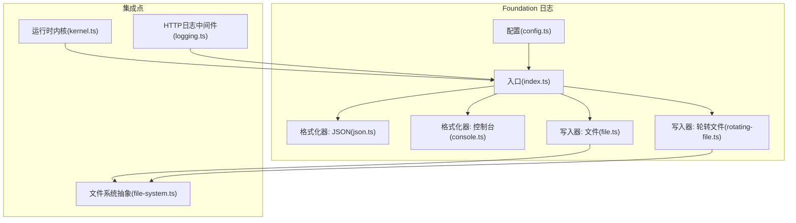
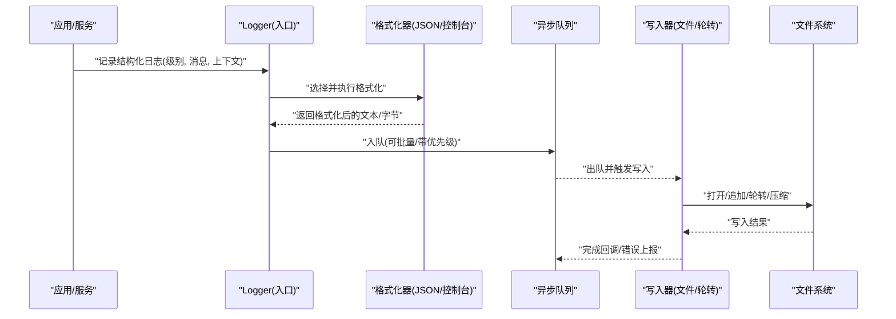
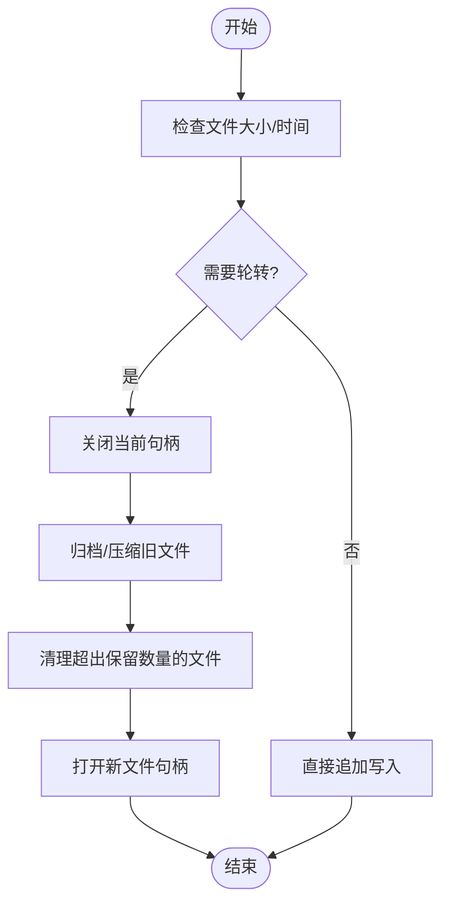
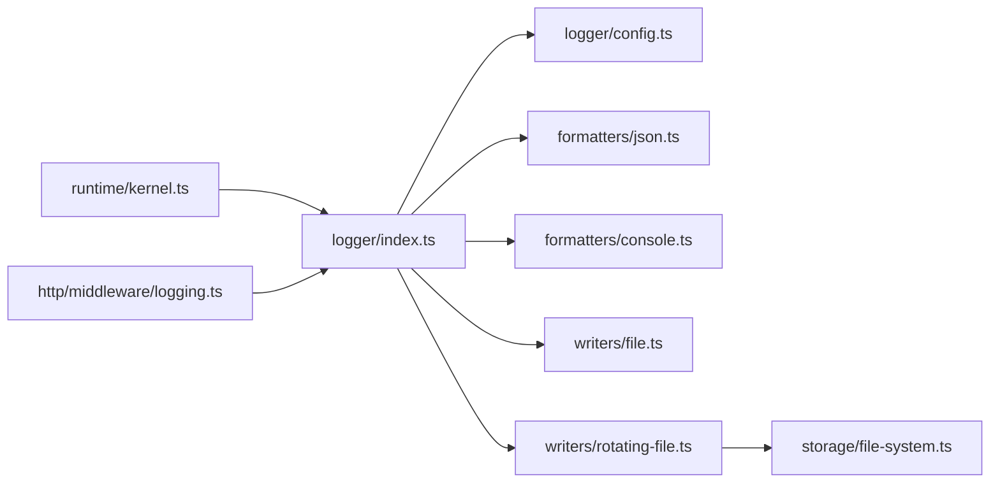

# 日志系统

<cite>
**本文引用的文件**   
- [engine/packages/foundation/src/logger/index.ts](file://engine/packages/foundation/src/logger/index.ts)
- [engine/packages/foundation/src/logger/formatters/json.ts](file://engine/packages/foundation/src/logger/formatters/json.ts)
- [engine/packages/foundation/src/logger/formatters/console.ts](file://engine/packages/foundation/src/logger/formatters/console.ts)
- [engine/packages/foundation/src/logger/writers/file.ts](file://engine/packages/foundation/src/logger/writers/file.ts)
- [engine/packages/foundation/src/logger/writers/rotating-file.ts](file://engine/packages/foundation/src/logger/writers/rotating-file.ts)
- [engine/packages/foundation/src/logger/config.ts](file://engine/packages/foundation/src/logger/config.ts)
- [engine/packages/engine/src/runtime/kernel.ts](file://engine/packages/engine/src/runtime/kernel.ts)
- [engine/packages/http-layer/src/server/middleware/logging.ts](file://engine/packages/http-layer/src/server/middleware/logging.ts)
- [engine/packages/infrastructure/src/storage/file-system.ts](file://engine/packages/infrastructure/src/storage/file-system.ts)
</cite>

## 目录
1. [简介](#简介)
2. [项目结构](#项目结构)
3. [核心组件](#核心组件)
4. [架构总览](#架构总览)
5. [详细组件分析](#详细组件分析)
6. [依赖关系分析](#依赖关系分析)
7. [性能考虑](#性能考虑)
8. [故障排查指南](#故障排查指南)
9. [结论](#结论)
10. [附录](#附录)

## 简介
本技术文档面向KCoder的日志子系统，系统性阐述其分层日志、结构化日志与异步处理的设计与实现；定义并解释日志级别（DEBUG、INFO、WARN、ERROR）的使用场景与输出策略；说明日志格式化器（JSON、控制台、文件）的定制方式；详述持久化机制（文件轮转、压缩存储、清理策略）；介绍日志聚合与分析（收集、索引、查询）；提供监控与告警配置指南（阈值、通知渠道、仪表盘）；给出性能优化技巧（批量写入、缓冲、采样过滤）与安全注意事项（脱敏、权限、合规）。

## 项目结构
日志子系统主要位于 foundation 包中，围绕“配置—格式化—写入”的分层设计组织代码：
- 配置与入口：负责全局初始化、级别控制、目标通道选择
- 格式化器：将结构化日志记录转换为不同输出格式
- 写入器：将格式化后的内容持久化到文件或流式输出
- 集成点：引擎运行时与HTTP中间件在关键路径上接入日志

图表来源
- [engine/packages/foundation/src/logger/config.ts](file://engine/packages/foundation/src/logger/config.ts)
- [engine/packages/foundation/src/logger/index.ts](file://engine/packages/foundation/src/logger/index.ts)
- [engine/packages/foundation/src/logger/formatters/json.ts](file://engine/packages/foundation/src/logger/formatters/json.ts)
- [engine/packages/foundation/src/logger/formatters/console.ts](file://engine/packages/foundation/src/logger/formatters/console.ts)
- [engine/packages/foundation/src/logger/writers/file.ts](file://engine/packages/foundation/src/logger/writers/file.ts)
- [engine/packages/foundation/src/logger/writers/rotating-file.ts](file://engine/packages/foundation/src/logger/writers/rotating-file.ts)
- [engine/packages/engine/src/runtime/kernel.ts](file://engine/packages/engine/src/runtime/kernel.ts)
- [engine/packages/http-layer/src/server/middleware/logging.ts](file://engine/packages/http-layer/src/server/middleware/logging.ts)
- [engine/packages/infrastructure/src/storage/file-system.ts](file://engine/packages/infrastructure/src/storage/file-system.ts)

章节来源
- [engine/packages/foundation/src/logger/index.ts](file://engine/packages/foundation/src/logger/index.ts)
- [engine/packages/foundation/src/logger/config.ts](file://engine/packages/foundation/src/logger/config.ts)

## 核心组件
- 配置与初始化
  - 集中管理日志级别、目标通道（控制台/文件）、格式化器选择、异步队列参数等。
  - 提供统一入口以获取Logger实例，并在应用启动时完成一次性初始化。
- 结构化日志记录
  - 所有日志条目为结构化对象，包含时间戳、级别、模块、上下文键值对等字段，便于后续检索与分析。
- 格式化器
  - JSON格式化器：输出标准JSON行，适合机器消费与聚合平台。
  - 控制台格式化器：人类可读的多行或单行彩色输出，便于本地调试。
- 写入器
  - 文件写入器：按固定文件名追加写入。
  - 轮转文件写入器：基于大小或时间的轮转策略，支持保留数量上限与可选压缩。
- 集成点
  - 运行时内核在任务生命周期关键节点打点。
  - HTTP中间件采集请求/响应元数据与耗时。

章节来源
- [engine/packages/foundation/src/logger/index.ts](file://engine/packages/foundation/src/logger/index.ts)
- [engine/packages/foundation/src/logger/formatters/json.ts](file://engine/packages/foundation/src/logger/formatters/json.ts)
- [engine/packages/foundation/src/logger/formatters/console.ts](file://engine/packages/foundation/src/logger/formatters/console.ts)
- [engine/packages/foundation/src/logger/writers/file.ts](file://engine/packages/foundation/src/logger/writers/file.ts)
- [engine/packages/foundation/src/logger/writers/rotating-file.ts](file://engine/packages/foundation/src/logger/writers/rotating-file.ts)
- [engine/packages/engine/src/runtime/kernel.ts](file://engine/packages/engine/src/runtime/kernel.ts)
- [engine/packages/http-layer/src/server/middleware/logging.ts](file://engine/packages/http-layer/src/server/middleware/logging.ts)

## 架构总览
日志系统采用“生产者—管道—消费者”的异步流水线：
- 生产者：业务模块、运行时内核、HTTP中间件调用统一接口产出结构化日志。
- 管道：根据配置选择格式化器，进入异步队列进行批处理。
- 消费者：写入器将日志落盘或输出至控制台；轮转写入器负责文件生命周期管理。

图表来源
- [engine/packages/foundation/src/logger/index.ts](file://engine/packages/foundation/src/logger/index.ts)
- [engine/packages/foundation/src/logger/formatters/json.ts](file://engine/packages/foundation/src/logger/formatters/json.ts)
- [engine/packages/foundation/src/logger/formatters/console.ts](file://engine/packages/foundation/src/logger/formatters/console.ts)
- [engine/packages/foundation/src/logger/writers/file.ts](file://engine/packages/foundation/src/logger/writers/file.ts)
- [engine/packages/foundation/src/logger/writers/rotating-file.ts](file://engine/packages/foundation/src/logger/writers/rotating-file.ts)
- [engine/packages/infrastructure/src/storage/file-system.ts](file://engine/packages/infrastructure/src/storage/file-system.ts)

## 详细组件分析

### 配置与初始化
- 职责
  - 定义默认级别、目标通道、格式化器、写入器参数（如轮转大小、保留个数、压缩开关）。
  - 暴露初始化函数，确保全局唯一实例，避免重复创建导致的资源泄漏。
- 关键点
  - 级别过滤：低于当前级别的日志将被丢弃。
  - 通道选择：可同时启用控制台与文件，或仅启用其一。
  - 异步参数：队列长度、批大小、刷新间隔等影响吞吐与延迟。

章节来源
- [engine/packages/foundation/src/logger/config.ts](file://engine/packages/foundation/src/logger/config.ts)
- [engine/packages/foundation/src/logger/index.ts](file://engine/packages/foundation/src/logger/index.ts)

### 结构化日志与级别
- 级别定义与用途
  - DEBUG：开发调试信息，含详细上下文，生产环境默认关闭。
  - INFO：正常业务流程的关键事件，用于追踪状态变化。
  - WARN：潜在问题或降级行为，需关注但不阻塞主流程。
  - ERROR：异常或失败路径，需要立即定位与修复。
- 输出策略
  - 低级别（DEBUG/INFO）在高并发下建议开启采样或节流。
  - 高级别（WARN/ERROR）应保证可靠落盘与快速反馈。
  - 结构化字段建议包含：traceId、spanId、模块名、用户/租户标识（脱敏后）、耗时等。

章节来源
- [engine/packages/foundation/src/logger/index.ts](file://engine/packages/foundation/src/logger/index.ts)

### 格式化器
- JSON格式化器
  - 输出单行JSON，便于被日志采集器解析与索引。
  - 支持自定义字段扩展与序列化选项。
- 控制台格式化器
  - 多行可读输出，支持颜色与缩进，便于本地调试。
  - 可按级别过滤显示，减少噪音。

章节来源
- [engine/packages/foundation/src/logger/formatters/json.ts](file://engine/packages/foundation/src/logger/formatters/json.ts)
- [engine/packages/foundation/src/logger/formatters/console.ts](file://engine/packages/foundation/src/logger/formatters/console.ts)

### 写入器与持久化
- 文件写入器
  - 简单追加模式，适用于小流量或测试环境。
- 轮转文件写入器
  - 轮转策略：按文件大小或时间周期切分新文件。
  - 保留策略：限制历史文件数量，超出则删除最旧文件。
  - 压缩策略：对归档文件进行压缩以节省空间。
  - 原子性：优先使用临时文件+重命名，避免半写损坏。
- 文件系统抽象
  - 通过基础设施层的文件操作封装，屏蔽底层差异，便于替换与测试。

图表来源
- [engine/packages/foundation/src/logger/writers/rotating-file.ts](file://engine/packages/foundation/src/logger/writers/rotating-file.ts)
- [engine/packages/foundation/src/logger/writers/file.ts](file://engine/packages/foundation/src/logger/writers/file.ts)
- [engine/packages/infrastructure/src/storage/file-system.ts](file://engine/packages/infrastructure/src/storage/file-system.ts)

章节来源
- [engine/packages/foundation/src/logger/writers/file.ts](file://engine/packages/foundation/src/logger/writers/file.ts)
- [engine/packages/foundation/src/logger/writers/rotating-file.ts](file://engine/packages/foundation/src/logger/writers/rotating-file.ts)
- [engine/packages/infrastructure/src/storage/file-system.ts](file://engine/packages/infrastructure/src/storage/file-system.ts)

### 集成点：运行时与HTTP
- 运行时内核
  - 在任务调度、工具执行、状态变更等关键路径记录结构化日志，便于回放与审计。
- HTTP中间件
  - 记录请求方法、路径、状态码、耗时、客户端IP（脱敏）、错误堆栈摘要等。
  - 与TraceID关联，形成端到端链路日志。

章节来源
- [engine/packages/engine/src/runtime/kernel.ts](file://engine/packages/engine/src/runtime/kernel.ts)
- [engine/packages/http-layer/src/server/middleware/logging.ts](file://engine/packages/http-layer/src/server/middleware/logging.ts)

## 依赖关系分析
- 松耦合设计
  - 入口只依赖配置与抽象的格式化器/写入器接口，具体实现可插拔。
- 外部依赖
  - 文件系统抽象来自基础设施层，便于在不同部署环境中替换实现。
- 可能的循环依赖
  - 通过分层隔离避免循环引用；若出现，应引入接口或延迟加载。

图表来源
- [engine/packages/foundation/src/logger/index.ts](file://engine/packages/foundation/src/logger/index.ts)
- [engine/packages/foundation/src/logger/config.ts](file://engine/packages/foundation/src/logger/config.ts)
- [engine/packages/foundation/src/logger/formatters/json.ts](file://engine/packages/foundation/src/logger/formatters/json.ts)
- [engine/packages/foundation/src/logger/formatters/console.ts](file://engine/packages/foundation/src/logger/formatters/console.ts)
- [engine/packages/foundation/src/logger/writers/file.ts](file://engine/packages/foundation/src/logger/writers/file.ts)
- [engine/packages/foundation/src/logger/writers/rotating-file.ts](file://engine/packages/foundation/src/logger/writers/rotating-file.ts)
- [engine/packages/infrastructure/src/storage/file-system.ts](file://engine/packages/infrastructure/src/storage/file-system.ts)
- [engine/packages/engine/src/runtime/kernel.ts](file://engine/packages/engine/src/runtime/kernel.ts)
- [engine/packages/http-layer/src/server/middleware/logging.ts](file://engine/packages/http-layer/src/server/middleware/logging.ts)

章节来源
- [engine/packages/foundation/src/logger/index.ts](file://engine/packages/foundation/src/logger/index.ts)
- [engine/packages/infrastructure/src/storage/file-system.ts](file://engine/packages/infrastructure/src/storage/file-system.ts)

## 性能考虑
- 异步与批处理
  - 使用队列缓冲与批量写入，降低系统调用次数，提高吞吐。
  - 合理设置批大小与刷新间隔，平衡延迟与I/O开销。
- 采样与过滤
  - 对高频DEBUG/INFO日志进行采样，避免风暴。
  - 基于模块或标签白名单/黑名单过滤无关日志。
- I/O优化
  - 使用顺序追加与合适缓冲区大小。
  - 轮转时采用原子切换，避免锁竞争。
- 背压与降级
  - 当写入器不可用时，快速失败并降级为内存缓冲或丢弃低级别日志，保障主流程稳定。

[本节为通用指导，不直接分析具体文件]

## 故障排查指南
- 常见问题
  - 日志未落盘：检查写入器权限、磁盘空间、轮转配置是否过大导致频繁切换。
  - 日志丢失：确认异步队列是否满、是否有背压保护与重试策略。
  - 格式异常：校验JSON格式化器的字段完整性与序列化选项。
- 诊断步骤
  - 提升级别至DEBUG观察关键路径。
  - 单独启用控制台输出对比文件输出一致性。
  - 查看轮转文件命名与保留策略是否符合预期。
- 恢复建议
  - 临时关闭轮转，扩大保留数量，先恢复业务再调优。
  - 对错误日志建立独立通道，便于快速定位。

章节来源
- [engine/packages/foundation/src/logger/writers/rotating-file.ts](file://engine/packages/foundation/src/logger/writers/rotating-file.ts)
- [engine/packages/foundation/src/logger/writers/file.ts](file://engine/packages/foundation/src/logger/writers/file.ts)
- [engine/packages/foundation/src/logger/formatters/json.ts](file://engine/packages/foundation/src/logger/formatters/json.ts)

## 结论
KCoder日志系统通过分层设计与异步流水线实现了高内聚、低耦合的可观测能力。配合结构化输出、灵活的格式化与持久化策略，既能满足本地调试，也能支撑生产环境的规模化采集与分析。建议在上线前结合业务特征调整级别、采样与轮转策略，并完善安全脱敏与访问控制，以确保性能、可用性与合规性。

[本节为总结性内容，不直接分析具体文件]

## 附录

### 日志级别与输出策略速查
- DEBUG：开发调试，生产默认关闭；必要时采样。
- INFO：关键流程事件；常规落盘。
- WARN：潜在风险；高优先级落盘，必要时告警。
- ERROR：异常失败；必须落盘并触发告警。

[本节为概念性说明，不直接分析具体文件]

### 日志聚合与分析
- 收集
  - 使用文件尾随采集器读取轮转后的归档文件。
- 索引
  - 对关键字段（traceId、模块、级别、状态码）建立倒排索引。
- 查询
  - 支持按时间范围、级别、模块、traceId组合查询与聚合统计。

[本节为概念性说明，不直接分析具体文件]

### 监控与告警配置要点
- 阈值
  - 错误率、慢请求比例、磁盘使用率、轮转频率。
- 通知渠道
  - 邮件、IM、短信等多通道冗余。
- 仪表盘
  - 展示日志量趋势、错误分布、Top模块、Top错误消息。

[本节为概念性说明，不直接分析具体文件]

### 安全与合规
- 敏感信息脱敏
  - 自动过滤密码、令牌、身份证号等，或使用掩码替换。
- 访问权限控制
  - 日志文件最小权限原则，限制读写主体。
- 合规要求
  - 保留周期、跨境传输、审计留痕符合相关法规。

[本节为概念性说明，不直接分析具体文件]