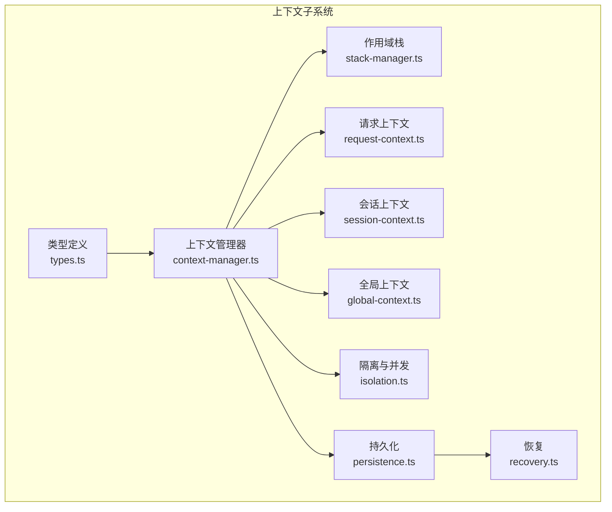
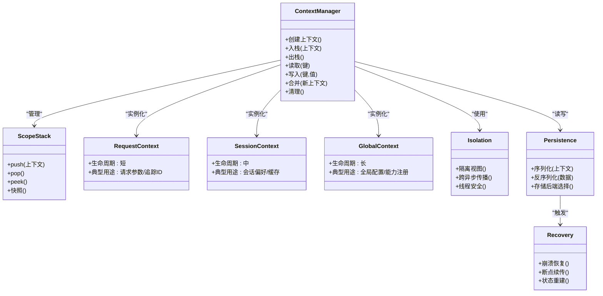
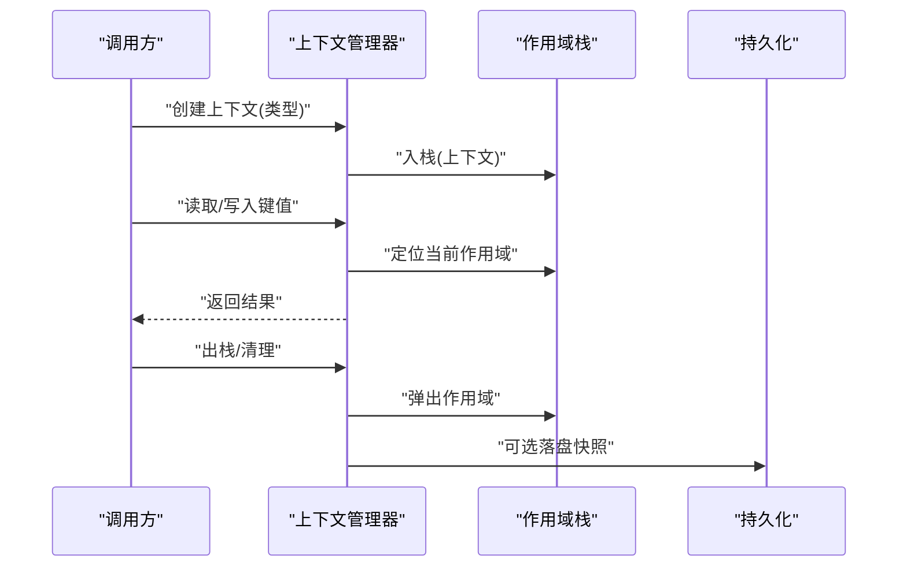
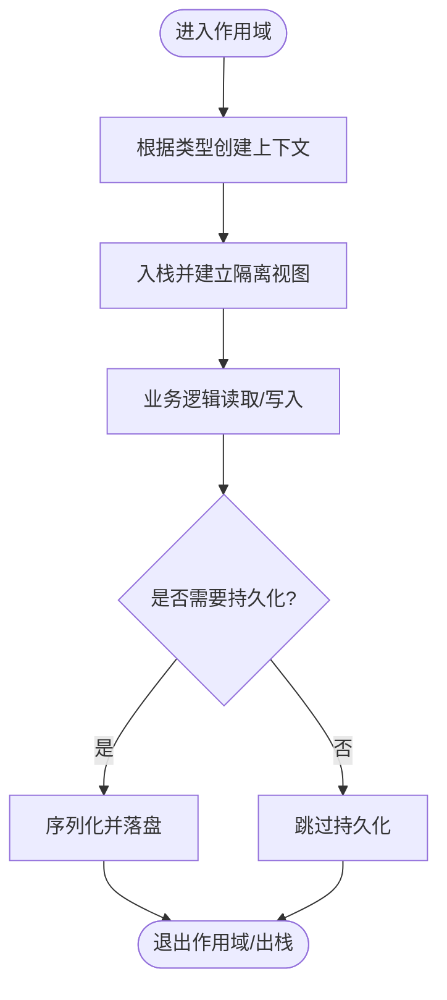
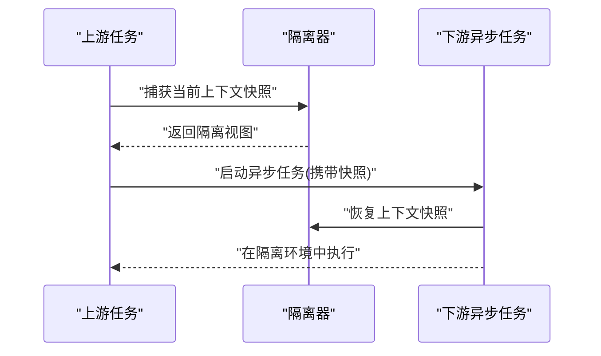
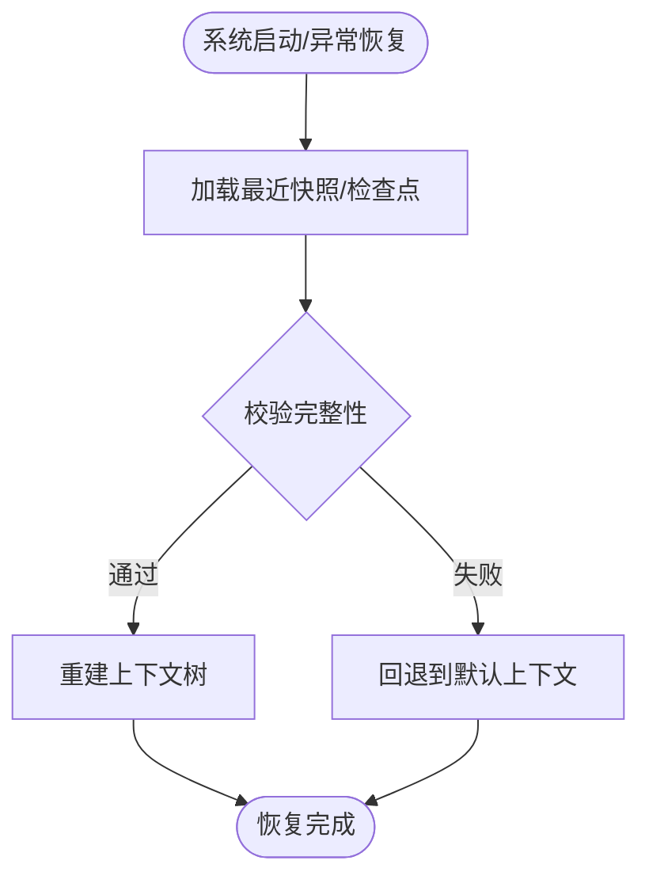
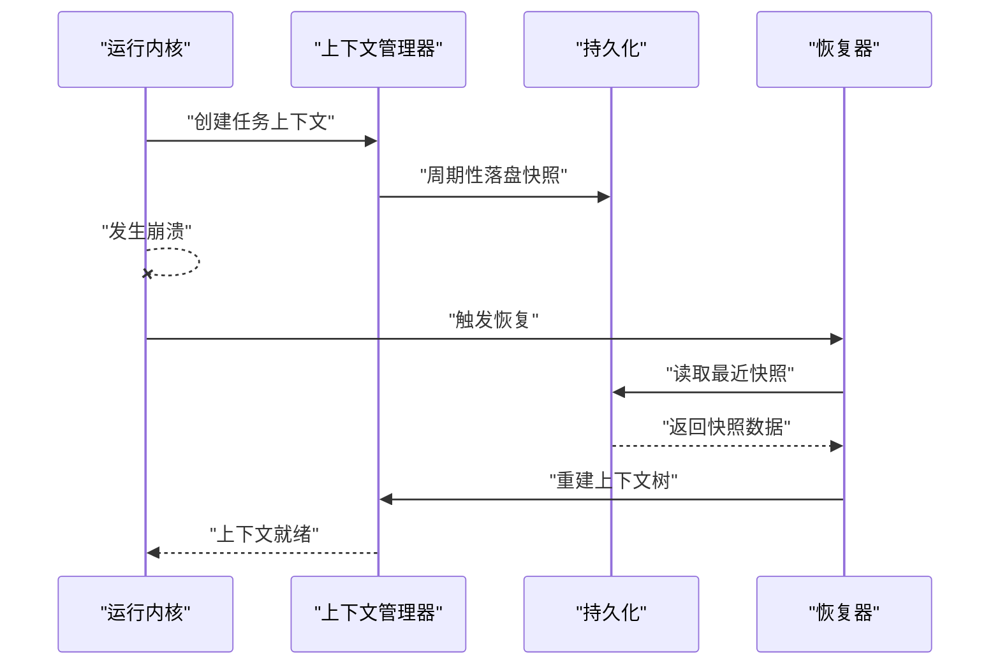
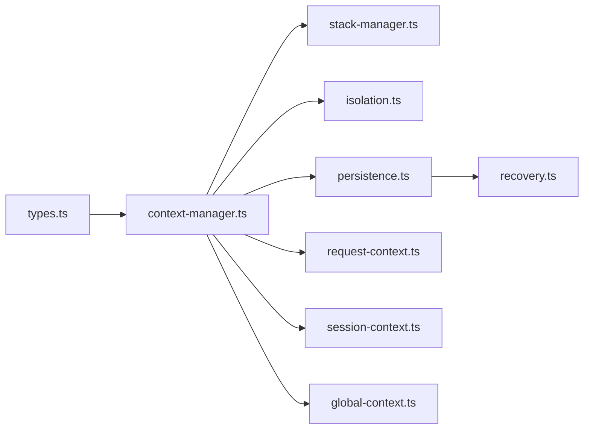

# 上下文管理

<cite>
**本文引用的文件**   
- [engine/packages/domain-layer/src/context/context-manager.ts](file://engine/packages/domain-layer/src/context/context-manager.ts)
- [engine/packages/domain-layer/src/context/request-context.ts](file://engine/packages/domain-layer/src/context/request-context.ts)
- [engine/packages/domain-layer/src/context/session-context.ts](file://engine/packages/domain-layer/src/context/session-context.ts)
- [engine/packages/domain-layer/src/context/global-context.ts](file://engine/packages/domain-layer/src/context/global-context.ts)
- [engine/packages/domain-layer/src/context/stack-manager.ts](file://engine/packages/domain-layer/src/context/stack-manager.ts)
- [engine/packages/domain-layer/src/context/persistence.ts](file://engine/packages/domain-layer/src/context/persistence.ts)
- [engine/packages/domain-layer/src/context/recovery.ts](file://engine/packages/domain-layer/src/context/recovery.ts)
- [engine/packages/domain-layer/src/context/isolation.ts](file://engine/packages/domain-layer/src/context/isolation.ts)
- [engine/packages/domain-layer/src/context/types.ts](file://engine/packages/domain-layer/src/context/types.ts)
- [engine/tests/task-context-recovery.test.ts](file://engine/tests/task-context-recovery.test.ts)
- [engine/tests/runtime-kernel-crash-recovery.test.ts](file://engine/tests/runtime-kernel-crash-recovery.test.ts)
- [engine/tests/file-session-store.test.ts](file://engine/tests/file-session-store.test.ts)
- [engine/tests/hybrid-store.test.ts](file://engine/tests/hybrid-store.test.ts)
</cite>

## 目录
1. [简介](#简介)
2. [项目结构](#项目结构)
3. [核心组件](#核心组件)
4. [架构总览](#架构总览)
5. [详细组件分析](#详细组件分析)
6. [依赖关系分析](#依赖关系分析)
7. [性能考虑](#性能考虑)
8. [故障排查指南](#故障排查指南)
9. [结论](#结论)
10. [附录](#附录)

## 简介
本文件面向KCoder运行时内核的上下文管理系统，系统性阐述上下文的概念、作用域与生命周期，覆盖请求上下文、会话上下文、全局上下文的职责边界与使用场景；深入说明上下文的创建与销毁、栈式作用域嵌套与自动清理；解释跨进程传递、异步传播与线程安全保证；详述持久化存储（序列化/反序列化、存储后端选择）与恢复机制（崩溃恢复、断点续传、状态重建）；并提供最佳实践与调试排障方法。

## 项目结构
上下文管理相关代码主要位于 domain-layer 的 context 子模块中，并通过测试用例验证关键路径：
- 类型与接口定义：types.ts
- 上下文管理器与栈式作用域：context-manager.ts、stack-manager.ts
- 三类上下文实现：request-context.ts、session-context.ts、global-context.ts
- 隔离与并发控制：isolation.ts
- 持久化与恢复：persistence.ts、recovery.ts
- 测试：task-context-recovery.test.ts、runtime-kernel-crash-recovery.test.ts、file-session-store.test.ts、hybrid-store.test.ts

图表来源
- [engine/packages/domain-layer/src/context/types.ts](file://engine/packages/domain-layer/src/context/types.ts)
- [engine/packages/domain-layer/src/context/context-manager.ts](file://engine/packages/domain-layer/src/context/context-manager.ts)
- [engine/packages/domain-layer/src/context/stack-manager.ts](file://engine/packages/domain-layer/src/context/stack-manager.ts)
- [engine/packages/domain-layer/src/context/request-context.ts](file://engine/packages/domain-layer/src/context/request-context.ts)
- [engine/packages/domain-layer/src/context/session-context.ts](file://engine/packages/domain-layer/src/context/session-context.ts)
- [engine/packages/domain-layer/src/context/global-context.ts](file://engine/packages/domain-layer/src/context/global-context.ts)
- [engine/packages/domain-layer/src/context/isolation.ts](file://engine/packages/domain-layer/src/context/isolation.ts)
- [engine/packages/domain-layer/src/context/persistence.ts](file://engine/packages/domain-layer/src/context/persistence.ts)
- [engine/packages/domain-layer/src/context/recovery.ts](file://engine/packages/domain-layer/src/context/recovery.ts)

章节来源
- [engine/packages/domain-layer/src/context/context-manager.ts](file://engine/packages/domain-layer/src/context/context-manager.ts)
- [engine/packages/domain-layer/src/context/types.ts](file://engine/packages/domain-layer/src/context/types.ts)

## 核心组件
- 类型与契约：统一描述上下文键值对、快照、变更事件、持久化接口等，确保各上下文实现遵循一致协议。
- 上下文管理器：负责上下文的创建、入栈/出栈、读取/写入、合并与清理；协调作用域栈与隔离策略。
- 作用域栈：维护当前执行路径上的上下文层级，支持嵌套与作用域继承，提供自动清理钩子。
- 三类上下文：
  - 请求上下文：短生命周期，绑定单次调用或任务执行，适合携带临时参数、追踪ID、限流配额等。
  - 会话上下文：中长生命周期，绑定用户或工作区会话，适合保存偏好、工具缓存、对话历史摘要等。
  - 全局上下文：进程级共享，适合配置开关、能力注册表、全局度量等。
- 隔离与并发：提供基于执行环境的隔离视图，避免跨异步分支污染；在多线程/多进程环境下通过序列化边界保障一致性。
- 持久化与恢复：将上下文快照序列化为可持久化格式，支持多种后端（内存、文件、混合），并在异常或重启后重建。

章节来源
- [engine/packages/domain-layer/src/context/context-manager.ts](file://engine/packages/domain-layer/src/context/context-manager.ts)
- [engine/packages/domain-layer/src/context/stack-manager.ts](file://engine/packages/domain-layer/src/context/stack-manager.ts)
- [engine/packages/domain-layer/src/context/request-context.ts](file://engine/packages/domain-layer/src/context/request-context.ts)
- [engine/packages/domain-layer/src/context/session-context.ts](file://engine/packages/domain-layer/src/context/session-context.ts)
- [engine/packages/domain-layer/src/context/global-context.ts](file://engine/packages/domain-layer/src/context/global-context.ts)
- [engine/packages/domain-layer/src/context/isolation.ts](file://engine/packages/domain-layer/src/context/isolation.ts)
- [engine/packages/domain-layer/src/context/persistence.ts](file://engine/packages/domain-layer/src/context/persistence.ts)
- [engine/packages/domain-layer/src/context/recovery.ts](file://engine/packages/domain-layer/src/context/recovery.ts)

## 架构总览
上下文子系统围绕“管理器+栈+隔离+持久化+恢复”的闭环设计，形成从创建到销毁的全生命周期治理。

图表来源
- [engine/packages/domain-layer/src/context/context-manager.ts](file://engine/packages/domain-layer/src/context/context-manager.ts)
- [engine/packages/domain-layer/src/context/stack-manager.ts](file://engine/packages/domain-layer/src/context/stack-manager.ts)
- [engine/packages/domain-layer/src/context/request-context.ts](file://engine/packages/domain-layer/src/context/request-context.ts)
- [engine/packages/domain-layer/src/context/session-context.ts](file://engine/packages/domain-layer/src/context/session-context.ts)
- [engine/packages/domain-layer/src/context/global-context.ts](file://engine/packages/domain-layer/src/context/global-context.ts)
- [engine/packages/domain-layer/src/context/isolation.ts](file://engine/packages/domain-layer/src/context/isolation.ts)
- [engine/packages/domain-layer/src/context/persistence.ts](file://engine/packages/domain-layer/src/context/persistence.ts)
- [engine/packages/domain-layer/src/context/recovery.ts](file://engine/packages/domain-layer/src/context/recovery.ts)

## 详细组件分析

### 上下文管理器与作用域栈
- 职责
  - 统一管理上下文的生命周期，提供统一的读/写/合并/清理API。
  - 维护作用域栈，支持嵌套作用域与自动清理。
- 关键点
  - 入栈时进行浅/深合并策略选择，避免覆盖父作用域必要字段。
  - 出栈时触发清理钩子，释放资源并落盘快照。
  - 提供只读视图用于下游消费，防止意外修改。

图表来源
- [engine/packages/domain-layer/src/context/context-manager.ts](file://engine/packages/domain-layer/src/context/context-manager.ts)
- [engine/packages/domain-layer/src/context/stack-manager.ts](file://engine/packages/domain-layer/src/context/stack-manager.ts)

章节来源
- [engine/packages/domain-layer/src/context/context-manager.ts](file://engine/packages/domain-layer/src/context/context-manager.ts)
- [engine/packages/domain-layer/src/context/stack-manager.ts](file://engine/packages/domain-layer/src/context/stack-manager.ts)

### 三类上下文：请求、会话、全局
- 请求上下文
  - 生命周期：随请求/任务结束而销毁。
  - 典型字段：请求ID、超时、限流配额、审计标签。
  - 使用建议：仅承载短期、不可共享的状态。
- 会话上下文
  - 生命周期：随会话结束而销毁，可跨多次请求复用。
  - 典型字段：用户偏好、工具缓存、对话摘要。
  - 使用建议：适度缓存，注意过期与淘汰策略。
- 全局上下文
  - 生命周期：进程级常驻。
  - 典型字段：功能开关、能力注册表、全局度量。
  - 使用建议：只读为主，变更需广播与版本化。

图表来源
- [engine/packages/domain-layer/src/context/request-context.ts](file://engine/packages/domain-layer/src/context/request-context.ts)
- [engine/packages/domain-layer/src/context/session-context.ts](file://engine/packages/domain-layer/src/context/session-context.ts)
- [engine/packages/domain-layer/src/context/global-context.ts](file://engine/packages/domain-layer/src/context/global-context.ts)
- [engine/packages/domain-layer/src/context/persistence.ts](file://engine/packages/domain-layer/src/context/persistence.ts)

章节来源
- [engine/packages/domain-layer/src/context/request-context.ts](file://engine/packages/domain-layer/src/context/request-context.ts)
- [engine/packages/domain-layer/src/context/session-context.ts](file://engine/packages/domain-layer/src/context/session-context.ts)
- [engine/packages/domain-layer/src/context/global-context.ts](file://engine/packages/domain-layer/src/context/global-context.ts)

### 隔离与并发传播
- 隔离视图：为每个执行路径提供独立可见的上下文副本，避免跨分支污染。
- 异步传播：在异步任务创建时捕获当前上下文快照，并在任务内恢复，保证链路一致性。
- 线程安全：跨线程/进程边界通过序列化传输，禁止直接共享可变对象；提供原子更新与幂等合并。

图表来源
- [engine/packages/domain-layer/src/context/isolation.ts](file://engine/packages/domain-layer/src/context/isolation.ts)

章节来源
- [engine/packages/domain-layer/src/context/isolation.ts](file://engine/packages/domain-layer/src/context/isolation.ts)

### 持久化与恢复
- 序列化/反序列化：将上下文快照转换为稳定格式，支持增量差异与压缩。
- 存储后端选择：
  - 内存：低延迟，适合短时上下文。
  - 文件：持久可靠，适合会话/任务级上下文。
  - 混合：热路径内存+冷路径文件，兼顾性能与可靠性。
- 恢复流程：
  - 崩溃恢复：进程重启后加载最近有效快照，重建上下文树。
  - 断点续传：在执行节点落盘检查点，失败后从最近检查点继续。
  - 状态重建：按顺序回放事件或应用差异，达到一致状态。

图表来源
- [engine/packages/domain-layer/src/context/persistence.ts](file://engine/packages/domain-layer/src/context/persistence.ts)
- [engine/packages/domain-layer/src/context/recovery.ts](file://engine/packages/domain-layer/src/context/recovery.ts)

章节来源
- [engine/packages/domain-layer/src/context/persistence.ts](file://engine/packages/domain-layer/src/context/persistence.ts)
- [engine/packages/domain-layer/src/context/recovery.ts](file://engine/packages/domain-layer/src/context/recovery.ts)

### 端到端流程示例（以任务上下文恢复为例）

图表来源
- [engine/packages/domain-layer/src/context/context-manager.ts](file://engine/packages/domain-layer/src/context/context-manager.ts)
- [engine/packages/domain-layer/src/context/persistence.ts](file://engine/packages/domain-layer/src/context/persistence.ts)
- [engine/packages/domain-layer/src/context/recovery.ts](file://engine/packages/domain-layer/src/context/recovery.ts)

章节来源
- [engine/tests/task-context-recovery.test.ts](file://engine/tests/task-context-recovery.test.ts)
- [engine/tests/runtime-kernel-crash-recovery.test.ts](file://engine/tests/runtime-kernel-crash-recovery.test.ts)

## 依赖关系分析
- 内部耦合
  - 上下文管理器强依赖作用域栈与隔离器，弱依赖持久化与恢复（按需启用）。
  - 三类上下文均遵循统一类型契约，便于替换与扩展。
- 外部集成
  - 持久化层抽象了存储后端，上层无需关心具体介质。
  - 恢复器依赖持久化提供的快照与检查点。

图表来源
- [engine/packages/domain-layer/src/context/types.ts](file://engine/packages/domain-layer/src/context/types.ts)
- [engine/packages/domain-layer/src/context/context-manager.ts](file://engine/packages/domain-layer/src/context/context-manager.ts)
- [engine/packages/domain-layer/src/context/stack-manager.ts](file://engine/packages/domain-layer/src/context/stack-manager.ts)
- [engine/packages/domain-layer/src/context/isolation.ts](file://engine/packages/domain-layer/src/context/isolation.ts)
- [engine/packages/domain-layer/src/context/persistence.ts](file://engine/packages/domain-layer/src/context/persistence.ts)
- [engine/packages/domain-layer/src/context/recovery.ts](file://engine/packages/domain-layer/src/context/recovery.ts)
- [engine/packages/domain-layer/src/context/request-context.ts](file://engine/packages/domain-layer/src/context/request-context.ts)
- [engine/packages/domain-layer/src/context/session-context.ts](file://engine/packages/domain-layer/src/context/session-context.ts)
- [engine/packages/domain-layer/src/context/global-context.ts](file://engine/packages/domain-layer/src/context/global-context.ts)

章节来源
- [engine/packages/domain-layer/src/context/context-manager.ts](file://engine/packages/domain-layer/src/context/context-manager.ts)
- [engine/packages/domain-layer/src/context/types.ts](file://engine/packages/domain-layer/src/context/types.ts)

## 性能考虑
- 作用域栈操作应为O(1)，避免在热点路径进行深度拷贝；必要时采用增量合并与懒加载。
- 持久化应支持批量与异步落盘，减少阻塞；对大对象采用压缩与分片。
- 隔离视图应避免不必要的克隆，优先采用引用透明与不可变数据结构。
- 全局上下文变更需广播与版本化，避免频繁全量同步。
- 合理设置上下文大小上限与TTL，防止内存膨胀。

[本节为通用指导，不直接分析具体文件]

## 故障排查指南
- 常见问题
  - 上下文泄漏：未正确出栈导致作用域残留，表现为内存持续增长。
  - 异步污染：未在异步起点捕获快照，导致下游读到错误上下文。
  - 持久化不一致：快照损坏或未落盘，导致恢复失败。
  - 并发冲突：跨线程直接共享可变上下文，引发竞态条件。
- 诊断手段
  - 开启上下文变更日志与审计标签，定位异常写入点。
  - 校验持久化快照完整性，必要时回滚至上一版本。
  - 使用隔离视图打印作用域链，确认嵌套与传播是否正确。
- 参考测试
  - 任务上下文恢复、内核崩溃恢复、文件/混合存储行为验证。

章节来源
- [engine/tests/task-context-recovery.test.ts](file://engine/tests/task-context-recovery.test.ts)
- [engine/tests/runtime-kernel-crash-recovery.test.ts](file://engine/tests/runtime-kernel-crash-recovery.test.ts)
- [engine/tests/file-session-store.test.ts](file://engine/tests/file-session-store.test.ts)
- [engine/tests/hybrid-store.test.ts](file://engine/tests/hybrid-store.test.ts)

## 结论
KCoder上下文管理以“管理器+栈+隔离+持久化+恢复”为核心，清晰划分请求/会话/全局三类上下文的作用域与生命周期，提供可靠的跨进程/异步传播与崩溃恢复能力。遵循本文的最佳实践与排障建议，可在保证一致性的同时获得良好的性能与可维护性。

[本节为总结性内容，不直接分析具体文件]

## 附录
- 最佳实践清单
  - 明确上下文边界：请求级尽量无状态，会话级缓存可控，全局级只读为主。
  - 严格作用域管理：使用try-finally模式确保出栈与清理。
  - 异步起点捕获快照：所有异步任务入口必须显式捕获与恢复上下文。
  - 持久化策略：热路径内存、冷路径文件，定期落盘与校验。
  - 监控与告警：记录上下文大小、存活时间、持久化失败率等指标。
- 术语
  - 作用域：上下文可见范围，支持嵌套与继承。
  - 快照：某一时刻上下文状态的序列化表示。
  - 隔离视图：对当前作用域的只读/受控访问封装。

[本节为补充信息，不直接分析具体文件]