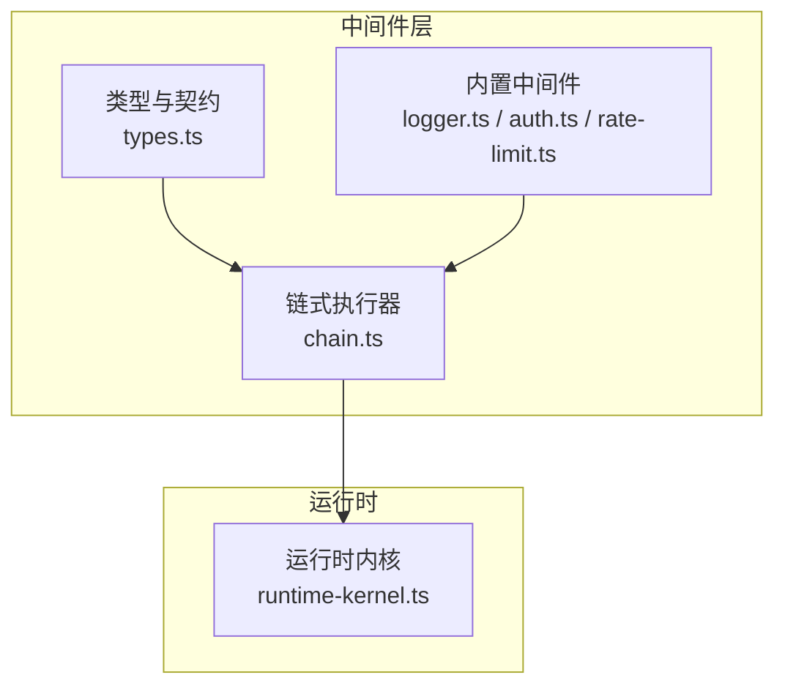
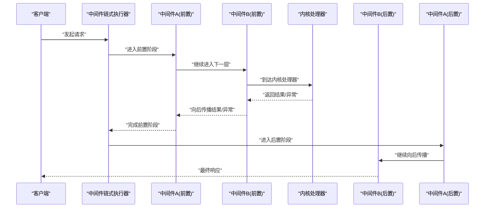
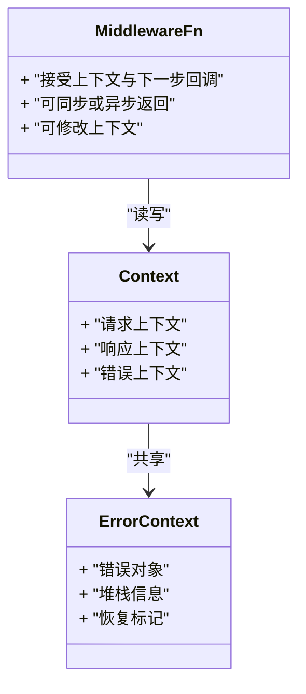
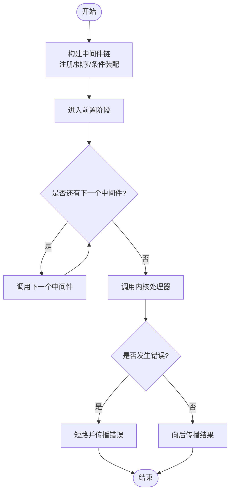
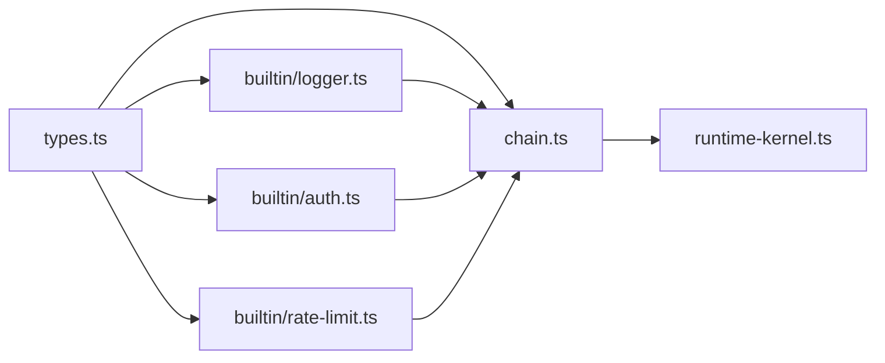

# 中间件管道

<cite>
**本文引用的文件**   
- [engine/packages/engine/src/middleware/index.ts](file://engine/packages/engine/src/middleware/index.ts)
- [engine/packages/engine/src/middleware/types.ts](file://engine/packages/engine/src/middleware/types.ts)
- [engine/packages/engine/src/middleware/chain.ts](file://engine/packages/engine/src/middleware/chain.ts)
- [engine/packages/engine/src/middleware/builtin/logger.ts](file://engine/packages/engine/src/middleware/builtin/logger.ts)
- [engine/packages/engine/src/middleware/builtin/auth.ts](file://engine/packages/engine/src/middleware/builtin/auth.ts)
- [engine/packages/engine/src/middleware/builtin/rate-limit.ts](file://engine/packages/engine/src/middleware/builtin/rate-limit.ts)
- [engine/packages/engine/src/runtime-kernel.ts](file://engine/packages/engine/src/runtime-kernel.ts)
- [tests/runtime-middleware.test.ts](file://tests/runtime-middleware.test.ts)
- [tests/runtime-kernel-after-middleware.test.ts](file://tests/runtime-kernel-after-middleware.test.ts)
</cite>

## 目录
1. [简介](#简介)
2. [项目结构](#项目结构)
3. [核心组件](#核心组件)
4. [架构总览](#架构总览)
5. [详细组件分析](#详细组件分析)
6. [依赖关系分析](#依赖关系分析)
7. [性能考量](#性能考量)
8. [故障排查指南](#故障排查指南)
9. [结论](#结论)
10. [附录](#附录)

## 简介
本文件面向KCoder运行时内核的“中间件管道”子系统，系统化阐述其执行模型、注册与管理机制、上下文传递、错误处理策略、内置中间件能力与用法，以及自定义中间件开发与性能优化实践。文档以代码级事实为依据，辅以可视化图示，帮助读者从概念到实现全面掌握该子系统。

## 项目结构
中间件管道位于引擎包中，围绕类型定义、链式执行器、内置中间件集合以及与运行时的集成点组织：
- 类型与契约：定义中间件签名、上下文对象、错误类型等
- 链式执行器：负责中间件的注册、排序、条件装配与顺序执行
- 内置中间件：日志、认证、限流等通用横切能力
- 运行时集成：在请求进入内核前后挂载中间件，形成端到端链路

图表来源
- [engine/packages/engine/src/middleware/types.ts](file://engine/packages/engine/src/middleware/types.ts)
- [engine/packages/engine/src/middleware/chain.ts](file://engine/packages/engine/src/middleware/chain.ts)
- [engine/packages/engine/src/middleware/builtin/logger.ts](file://engine/packages/engine/src/middleware/builtin/logger.ts)
- [engine/packages/engine/src/middleware/builtin/auth.ts](file://engine/packages/engine/src/middleware/builtin/auth.ts)
- [engine/packages/engine/src/middleware/builtin/rate-limit.ts](file://engine/packages/engine/src/middleware/builtin/rate-limit.ts)
- [engine/packages/engine/src/runtime-kernel.ts](file://engine/packages/engine/src/runtime-kernel.ts)

章节来源
- [engine/packages/engine/src/middleware/index.ts](file://engine/packages/engine/src/middleware/index.ts)
- [engine/packages/engine/src/middleware/types.ts](file://engine/packages/engine/src/middleware/types.ts)
- [engine/packages/engine/src/middleware/chain.ts](file://engine/packages/engine/src/middleware/chain.ts)
- [engine/packages/engine/src/middleware/builtin/logger.ts](file://engine/packages/engine/src/middleware/builtin/logger.ts)
- [engine/packages/engine/src/middleware/builtin/auth.ts](file://engine/packages/engine/src/middleware/builtin/auth.ts)
- [engine/packages/engine/src/middleware/builtin/rate-limit.ts](file://engine/packages/engine/src/middleware/builtin/rate-limit.ts)
- [engine/packages/engine/src/runtime-kernel.ts](file://engine/packages/engine/src/runtime-kernel.ts)

## 核心组件
- 中间件类型与上下文
  - 统一中间件函数签名，支持同步与异步两种执行模式
  - 上下文对象贯穿请求生命周期，包含请求上下文、响应上下文与错误上下文
- 中间件链式执行器
  - 提供注册、优先级排序、条件装配、短路控制与顺序执行能力
  - 暴露构建与调用入口，供运行时内核在关键阶段注入
- 内置中间件
  - 日志中间件：记录请求/响应与耗时
  - 认证中间件：校验身份并注入用户信息
  - 限流中间件：基于窗口或令牌桶进行速率限制
- 运行时集成
  - 在请求进入内核前与返回后分别挂载中间件，形成完整链路

章节来源
- [engine/packages/engine/src/middleware/types.ts](file://engine/packages/engine/src/middleware/types.ts)
- [engine/packages/engine/src/middleware/chain.ts](file://engine/packages/engine/src/middleware/chain.ts)
- [engine/packages/engine/src/middleware/builtin/logger.ts](file://engine/packages/engine/src/middleware/builtin/logger.ts)
- [engine/packages/engine/src/middleware/builtin/auth.ts](file://engine/packages/engine/src/middleware/builtin/auth.ts)
- [engine/packages/engine/src/middleware/builtin/rate-limit.ts](file://engine/packages/engine/src/middleware/builtin/rate-limit.ts)
- [engine/packages/engine/src/runtime-kernel.ts](file://engine/packages/engine/src/runtime-kernel.ts)

## 架构总览
中间件管道采用“洋葱模型”的链式执行方式，请求在进入内核处理器之前依次通过前置中间件，再进入内核；返回时逆向通过后置中间件。执行器负责维护中间件列表、优先级与条件判断，并在必要时短路后续流程。

图表来源
- [engine/packages/engine/src/middleware/chain.ts](file://engine/packages/engine/src/middleware/chain.ts)
- [engine/packages/engine/src/runtime-kernel.ts](file://engine/packages/engine/src/runtime-kernel.ts)

## 详细组件分析

### 类型与上下文（types）
- 中间件签名
  - 统一的函数签名，接收上下文与下一步回调，支持同步与异步返回
  - 允许修改上下文中的请求/响应字段，并可设置错误上下文
- 上下文对象
  - 请求上下文：承载入参、元数据、鉴权信息等
  - 响应上下文：承载出参、状态码、扩展头等
  - 错误上下文：承载错误对象、堆栈、恢复标记等
- 错误类型
  - 标准化错误结构，便于上层捕获与传播

图表来源
- [engine/packages/engine/src/middleware/types.ts](file://engine/packages/engine/src/middleware/types.ts)

章节来源
- [engine/packages/engine/src/middleware/types.ts](file://engine/packages/engine/src/middleware/types.ts)

### 链式执行器（chain）
- 注册与管理
  - 支持按优先级排序注册，保证期望的执行顺序
  - 支持条件注册，根据配置或运行时环境动态启用/禁用
  - 支持动态加载，运行时按需追加中间件
- 执行模型
  - 洋葱模型：先入后出，确保前置逻辑在请求进入前执行，后置逻辑在返回后执行
  - 短路机制：任一中间件决定中断时，跳过后续中间件直接返回
- 错误处理
  - 捕获中间件抛出的异常，写入错误上下文并向上抛出
  - 支持恢复标记，允许特定中间件尝试恢复后再继续

图表来源
- [engine/packages/engine/src/middleware/chain.ts](file://engine/packages/engine/src/middleware/chain.ts)

章节来源
- [engine/packages/engine/src/middleware/chain.ts](file://engine/packages/engine/src/middleware/chain.ts)

### 内置中间件

#### 日志中间件（logger）
- 功能
  - 记录请求进入与离开的时间戳、方法、路径、状态码、耗时等
  - 可选记录请求/响应摘要与敏感字段脱敏
- 使用要点
  - 建议置于较外层，以便覆盖尽可能多的处理路径
  - 避免记录大体积负载，防止性能抖动

章节来源
- [engine/packages/engine/src/middleware/builtin/logger.ts](file://engine/packages/engine/src/middleware/builtin/logger.ts)

#### 认证中间件（auth）
- 功能
  - 解析并验证凭证（如令牌），失败则短路返回未授权
  - 成功时将用户信息注入请求上下文，供下游使用
- 使用要点
  - 与限流、审计等组合使用时，注意顺序与短路行为
  - 缓存已验证的用户信息以减少重复开销

章节来源
- [engine/packages/engine/src/middleware/builtin/auth.ts](file://engine/packages/engine/src/middleware/builtin/auth.ts)

#### 限流中间件（rate-limit）
- 功能
  - 基于时间窗口或令牌桶算法限制请求速率
  - 超限则短路返回限流错误，并附带重试提示
- 使用要点
  - 结合用户维度或接口维度进行差异化限流
  - 合理设置阈值与滑动窗口大小，平衡吞吐与公平性

章节来源
- [engine/packages/engine/src/middleware/builtin/rate-limit.ts](file://engine/packages/engine/src/middleware/builtin/rate-limit.ts)

### 运行时集成（runtime-kernel）
- 集成点
  - 在请求进入内核前挂载前置中间件链
  - 在返回后挂载后置中间件链，用于清理与观测
- 生命周期
  - 初始化阶段：注册默认中间件与条件中间件
  - 运行阶段：每次请求构建临时链或直接复用预构建链
  - 销毁阶段：释放资源与统计指标

章节来源
- [engine/packages/engine/src/runtime-kernel.ts](file://engine/packages/engine/src/runtime-kernel.ts)

### 测试与验证
- 单元测试
  - 覆盖同步/异步中间件、短路、错误传播与恢复
  - 验证优先级与条件注册的正确性
- 集成测试
  - 在运行时内核层面验证中间件链的整体行为
  - 模拟高并发场景评估限流与日志的性能影响

章节来源
- [tests/runtime-middleware.test.ts](file://tests/runtime-middleware.test.ts)
- [tests/runtime-kernel-after-middleware.test.ts](file://tests/runtime-kernel-after-middleware.test.ts)

## 依赖关系分析
中间件层内部依赖清晰：类型定义被执行器与内置中间件共同引用；执行器由运行时内核消费；内置中间件之间相互独立，通过上下文协作。

图表来源
- [engine/packages/engine/src/middleware/types.ts](file://engine/packages/engine/src/middleware/types.ts)
- [engine/packages/engine/src/middleware/chain.ts](file://engine/packages/engine/src/middleware/chain.ts)
- [engine/packages/engine/src/middleware/builtin/logger.ts](file://engine/packages/engine/src/middleware/builtin/logger.ts)
- [engine/packages/engine/src/middleware/builtin/auth.ts](file://engine/packages/engine/src/middleware/builtin/auth.ts)
- [engine/packages/engine/src/middleware/builtin/rate-limit.ts](file://engine/packages/engine/src/middleware/builtin/rate-limit.ts)
- [engine/packages/engine/src/runtime-kernel.ts](file://engine/packages/engine/src/runtime-kernel.ts)

章节来源
- [engine/packages/engine/src/middleware/index.ts](file://engine/packages/engine/src/middleware/index.ts)
- [engine/packages/engine/src/middleware/types.ts](file://engine/packages/engine/src/middleware/types.ts)
- [engine/packages/engine/src/middleware/chain.ts](file://engine/packages/engine/src/middleware/chain.ts)
- [engine/packages/engine/src/middleware/builtin/logger.ts](file://engine/packages/engine/src/middleware/builtin/logger.ts)
- [engine/packages/engine/src/middleware/builtin/auth.ts](file://engine/packages/engine/src/middleware/builtin/auth.ts)
- [engine/packages/engine/src/middleware/builtin/rate-limit.ts](file://engine/packages/engine/src/middleware/builtin/rate-limit.ts)
- [engine/packages/engine/src/runtime-kernel.ts](file://engine/packages/engine/src/runtime-kernel.ts)

## 性能考量
- 中间件合并
  - 将轻量且高频的横切逻辑合并为单一中间件，减少调用栈深度
- 缓存策略
  - 对认证结果、限流计数等热点数据进行缓存，降低重复计算
- 异步处理
  - I/O密集型操作（如远程鉴权、外部审计）应使用异步中间件，避免阻塞事件循环
- 日志采样
  - 在高吞吐场景下开启日志采样，避免I/O成为瓶颈
- 短路优先
  - 将快速失败的中间件（如鉴权、限流）置于靠前位置，尽早短路

[本节为通用指导，不直接分析具体文件]

## 故障排查指南
- 常见问题
  - 中间件顺序错乱：检查优先级配置与条件注册逻辑
  - 短路导致下游未执行：确认短路条件与错误传播路径
  - 上下文丢失：确保所有中间件正确读写上下文且不覆盖关键字段
  - 异步未等待：确保异步中间件返回Promise或被正确await
- 定位手段
  - 借助日志中间件输出进入/离开时间与耗时
  - 在关键中间件增加调试标记，观察执行轨迹
  - 使用测试用例复现问题，逐步缩小范围

章节来源
- [tests/runtime-middleware.test.ts](file://tests/runtime-middleware.test.ts)
- [tests/runtime-kernel-after-middleware.test.ts](file://tests/runtime-kernel-after-middleware.test.ts)

## 结论
KCoder运行时内核的中间件管道以清晰的类型契约、灵活的链式执行器与完善的内置能力，提供了可扩展、可观测、可治理的请求处理框架。通过合理的注册策略、上下文设计与错误处理，可在保障性能的同时满足多样化的横切需求。

[本节为总结性内容，不直接分析具体文件]

## 附录

### 自定义中间件开发指南
- 接口定义
  - 遵循统一中间件函数签名，接收上下文与下一步回调
  - 可同步或异步返回，必要时修改上下文或设置错误上下文
- 开发模板
  - 读取上下文参数 -> 执行横切逻辑 -> 调用下一步 -> 处理返回/异常 -> 更新上下文
- 测试方法
  - 构造最小化上下文，断言中间件对上下文的变更
  - 模拟短路与异常路径，验证错误传播与恢复
  - 在运行时集成测试中验证整体链路行为

章节来源
- [engine/packages/engine/src/middleware/types.ts](file://engine/packages/engine/src/middleware/types.ts)
- [engine/packages/engine/src/middleware/chain.ts](file://engine/packages/engine/src/middleware/chain.ts)
- [tests/runtime-middleware.test.ts](file://tests/runtime-middleware.test.ts)