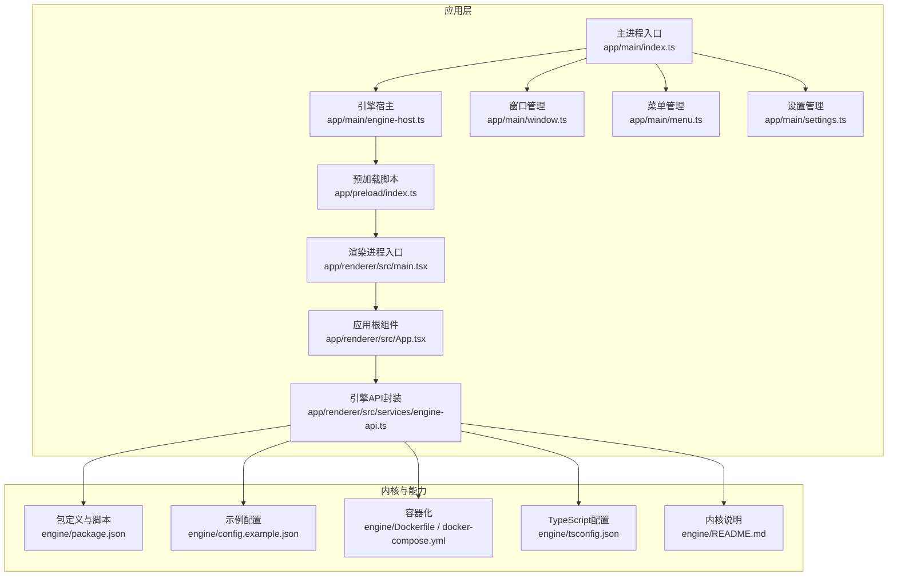
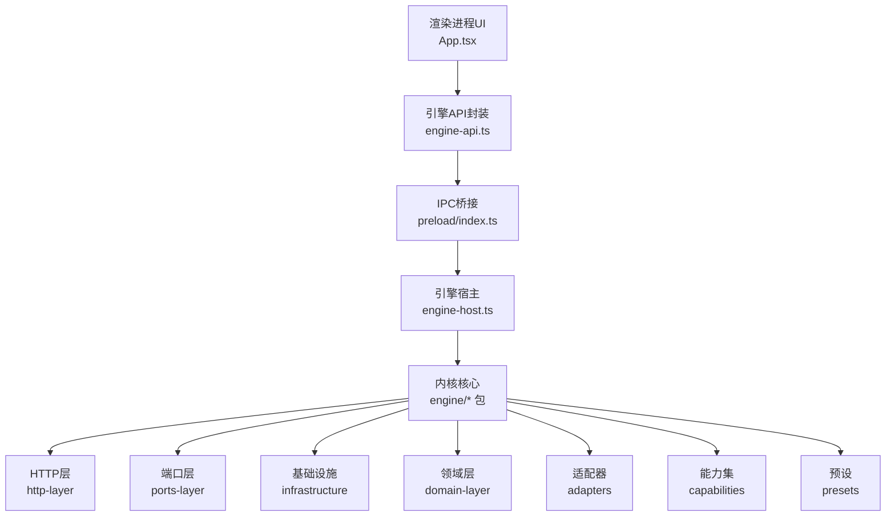
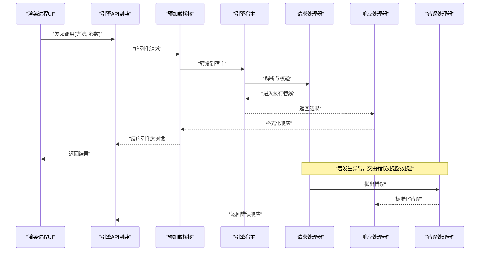
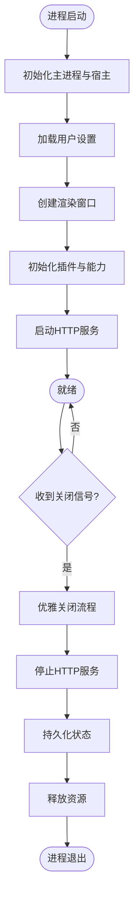
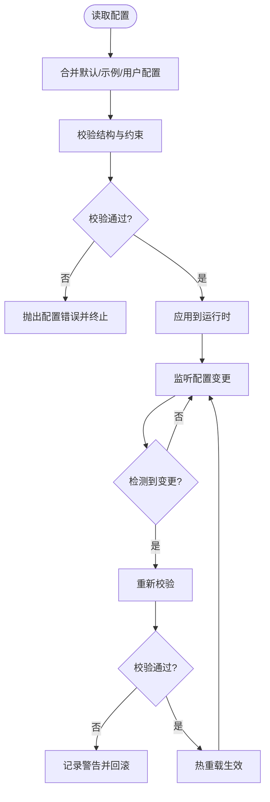
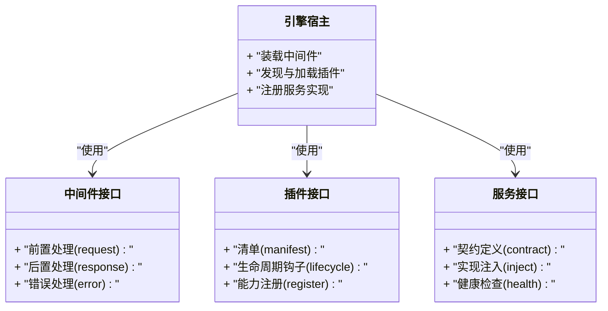
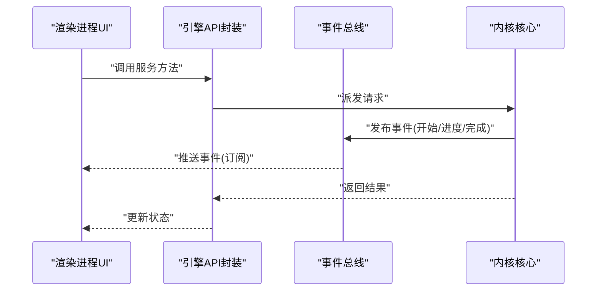
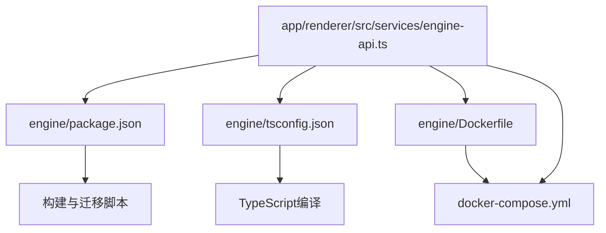

# 内核架构设计

<cite>
**本文引用的文件**   
- [engine/README.md](file://engine/README.md)
- [engine/package.json](file://engine/package.json)
- [engine/tsconfig.json](file://engine/tsconfig.json)
- [engine/config.example.json](file://engine/config.example.json)
- [engine/Dockerfile](file://engine/Dockerfile)
- [engine/docker-compose.yml](file://engine/docker-compose.yml)
- [app/main/index.ts](file://app/main/index.ts)
- [app/main/engine-host.ts](file://app/main/engine-host.ts)
- [app/main/window.ts](file://app/main/window.ts)
- [app/main/menu.ts](file://app/main/menu.ts)
- [app/main/settings.ts](file://app/main/settings.ts)
- [app/preload/index.ts](file://app/preload/index.ts)
- [app/renderer/src/services/engine-api.ts](file://app/renderer/src/services/engine-api.ts)
- [app/renderer/src/App.tsx](file://app/renderer/src/App.tsx)
- [app/renderer/src/main.tsx](file://app/renderer/src/main.tsx)
</cite>

## 目录
1. [简介](#简介)
2. [项目结构](#项目结构)
3. [核心组件](#核心组件)
4. [架构总览](#架构总览)
5. [详细组件分析](#详细组件分析)
6. [依赖关系分析](#依赖关系分析)
7. [性能考虑](#性能考虑)
8. [故障排查指南](#故障排查指南)
9. [结论](#结论)
10. [附录](#附录)

## 简介
本文件面向KCoder运行时内核的架构设计与实现，聚焦分层架构、事件驱动与插件化三大设计决策，系统阐述请求/响应/错误处理器的职责分工、生命周期管理（启动、初始化、优雅关闭）、配置系统（加载、校验、热重载）以及扩展点（中间件、插件、服务接口）。文档同时提供架构图与数据流图，帮助开发者快速理解内核工作原理并指导二次开发与集成。

## 项目结构
仓库采用多包工作区组织，前端应用位于 app/，运行时内核及相关能力位于 engine/。整体结构如下：

图表来源
- [app/main/index.ts](file://app/main/index.ts)
- [app/main/engine-host.ts](file://app/main/engine-host.ts)
- [app/main/window.ts](file://app/main/window.ts)
- [app/main/menu.ts](file://app/main/menu.ts)
- [app/main/settings.ts](file://app/main/settings.ts)
- [app/preload/index.ts](file://app/preload/index.ts)
- [app/renderer/src/main.tsx](file://app/renderer/src/main.tsx)
- [app/renderer/src/App.tsx](file://app/renderer/src/App.tsx)
- [app/renderer/src/services/engine-api.ts](file://app/renderer/src/services/engine-api.ts)
- [engine/package.json](file://engine/package.json)
- [engine/config.example.json](file://engine/config.example.json)
- [engine/Dockerfile](file://engine/Dockerfile)
- [engine/docker-compose.yml](file://engine/docker-compose.yml)
- [engine/tsconfig.json](file://engine/tsconfig.json)
- [engine/README.md](file://engine/README.md)

章节来源
- [engine/README.md](file://engine/README.md)
- [engine/package.json](file://engine/package.json)
- [engine/tsconfig.json](file://engine/tsconfig.json)
- [engine/config.example.json](file://engine/config.example.json)
- [engine/Dockerfile](file://engine/Dockerfile)
- [engine/docker-compose.yml](file://engine/docker-compose.yml)
- [app/main/index.ts](file://app/main/index.ts)
- [app/main/engine-host.ts](file://app/main/engine-host.ts)
- [app/main/window.ts](file://app/main/window.ts)
- [app/main/menu.ts](file://app/main/menu.ts)
- [app/main/settings.ts](file://app/main/settings.ts)
- [app/preload/index.ts](file://app/preload/index.ts)
- [app/renderer/src/main.tsx](file://app/renderer/src/main.tsx)
- [app/renderer/src/App.tsx](file://app/renderer/src/App.tsx)
- [app/renderer/src/services/engine-api.ts](file://app/renderer/src/services/engine-api.ts)

## 核心组件
- 主进程入口与引擎宿主：负责创建主进程、初始化引擎宿主、管理窗口与菜单、加载用户设置，并与渲染进程通信。
- 渲染进程与应用：渲染进程通过预加载脚本暴露安全桥接，应用根组件协调UI状态与服务调用。
- 引擎API封装：统一封装对内核的请求、订阅与错误处理逻辑，屏蔽底层细节。
- 内核与能力：以多包形式组织，包含适配器、领域层、基础设施、HTTP层、端口层等，配合示例配置与容器化部署。

章节来源
- [app/main/index.ts](file://app/main/index.ts)
- [app/main/engine-host.ts](file://app/main/engine-host.ts)
- [app/main/window.ts](file://app/main/window.ts)
- [app/main/menu.ts](file://app/main/menu.ts)
- [app/main/settings.ts](file://app/main/settings.ts)
- [app/preload/index.ts](file://app/preload/index.ts)
- [app/renderer/src/main.tsx](file://app/renderer/src/main.tsx)
- [app/renderer/src/App.tsx](file://app/renderer/src/App.tsx)
- [app/renderer/src/services/engine-api.ts](file://app/renderer/src/services/engine-api.ts)
- [engine/README.md](file://engine/README.md)
- [engine/package.json](file://engine/package.json)

## 架构总览
KCoder运行时内核采用“分层+事件驱动+插件化”的组合架构：
- 分层架构：将能力划分为适配器、领域、基础设施、HTTP、端口等层次，明确边界与职责。
- 事件驱动：通过事件总线与消息通道解耦子系统，支持异步编排与可扩展性。
- 插件化：通过中间件、插件与服务接口提供扩展点，允许动态装配能力。

图表来源
- [app/renderer/src/App.tsx](file://app/renderer/src/App.tsx)
- [app/renderer/src/services/engine-api.ts](file://app/renderer/src/services/engine-api.ts)
- [app/preload/index.ts](file://app/preload/index.ts)
- [app/main/engine-host.ts](file://app/main/engine-host.ts)
- [engine/README.md](file://engine/README.md)
- [engine/package.json](file://engine/package.json)

## 详细组件分析

### 请求处理器、响应处理器、错误处理器
- 请求处理器：接收来自渲染进程的调用，进行参数校验、上下文构建与路由分发。
- 响应处理器：聚合结果、格式化输出、触发后续事件或持久化。
- 错误处理器：捕获异常、标准化错误信息、记录日志并返回可观测的错误码与提示。

图表来源
- [app/renderer/src/services/engine-api.ts](file://app/renderer/src/services/engine-api.ts)
- [app/preload/index.ts](file://app/preload/index.ts)
- [app/main/engine-host.ts](file://app/main/engine-host.ts)

章节来源
- [app/renderer/src/services/engine-api.ts](file://app/renderer/src/services/engine-api.ts)
- [app/preload/index.ts](file://app/preload/index.ts)
- [app/main/engine-host.ts](file://app/main/engine-host.ts)

### 生命周期管理（启动、初始化、优雅关闭）
- 启动流程：主进程入口创建引擎宿主与窗口，加载菜单与设置，初始化渲染进程。
- 初始化顺序：先完成宿主与环境准备，再加载插件与能力，最后建立HTTP与事件通道。
- 优雅关闭：监听系统信号与窗口关闭事件，依次停止HTTP服务、释放资源、持久化状态并退出进程。

图表来源
- [app/main/index.ts](file://app/main/index.ts)
- [app/main/engine-host.ts](file://app/main/engine-host.ts)
- [app/main/window.ts](file://app/main/window.ts)
- [app/main/menu.ts](file://app/main/menu.ts)
- [app/main/settings.ts](file://app/main/settings.ts)

章节来源
- [app/main/index.ts](file://app/main/index.ts)
- [app/main/engine-host.ts](file://app/main/engine-host.ts)
- [app/main/window.ts](file://app/main/window.ts)
- [app/main/menu.ts](file://app/main/menu.ts)
- [app/main/settings.ts](file://app/main/settings.ts)

### 配置系统（加载、验证、热重载）
- 配置加载：从示例配置与用户配置合并，按优先级覆盖默认值。
- 配置验证：在启动时校验必填字段与类型约束，失败则拒绝启动并给出诊断信息。
- 热重载：监听配置文件变更，增量更新运行时配置，必要时重启相关子模块。

图表来源
- [engine/config.example.json](file://engine/config.example.json)
- [app/main/settings.ts](file://app/main/settings.ts)

章节来源
- [engine/config.example.json](file://engine/config.example.json)
- [app/main/settings.ts](file://app/main/settings.ts)

### 扩展点设计（中间件、插件、服务接口）
- 中间件接口：围绕请求/响应链路提供横切能力（鉴权、限流、审计、遥测），按注册顺序串联执行。
- 插件接口：以声明式清单描述能力，支持按需加载、版本兼容与隔离运行。
- 服务接口：定义稳定的契约，由不同实现注入，便于替换与测试。

图表来源
- [app/main/engine-host.ts](file://app/main/engine-host.ts)
- [engine/README.md](file://engine/README.md)
- [engine/package.json](file://engine/package.json)

章节来源
- [app/main/engine-host.ts](file://app/main/engine-host.ts)
- [engine/README.md](file://engine/README.md)
- [engine/package.json](file://engine/package.json)

### 数据流与事件驱动
- 数据流：渲染进程通过API封装发起调用，经预加载桥接到达宿主，再由内核的分层组件处理并返回。
- 事件驱动：内核内部通过事件总线传递状态变更与任务进度，UI侧订阅事件以更新界面。

图表来源
- [app/renderer/src/services/engine-api.ts](file://app/renderer/src/services/engine-api.ts)
- [engine/README.md](file://engine/README.md)

章节来源
- [app/renderer/src/services/engine-api.ts](file://app/renderer/src/services/engine-api.ts)
- [engine/README.md](file://engine/README.md)

## 依赖关系分析
- 包与工作区：engine/package.json定义了工作区与脚本，tsconfig.json统一编译选项。
- 容器化：Dockerfile与docker-compose.yml提供可复现的运行环境。
- 应用与内核耦合：渲染进程通过engine-api.ts与内核交互，避免直接依赖底层实现。

图表来源
- [engine/package.json](file://engine/package.json)
- [engine/tsconfig.json](file://engine/tsconfig.json)
- [engine/Dockerfile](file://engine/Dockerfile)
- [engine/docker-compose.yml](file://engine/docker-compose.yml)
- [app/renderer/src/services/engine-api.ts](file://app/renderer/src/services/engine-api.ts)

章节来源
- [engine/package.json](file://engine/package.json)
- [engine/tsconfig.json](file://engine/tsconfig.json)
- [engine/Dockerfile](file://engine/Dockerfile)
- [engine/docker-compose.yml](file://engine/docker-compose.yml)
- [app/renderer/src/services/engine-api.ts](file://app/renderer/src/services/engine-api.ts)

## 性能考虑
- 内存管理：避免长生命周期闭包持有大对象；及时释放事件订阅与定时器；对大数据流采用分块处理。
- 并发控制：限制并发度与队列长度；使用背压机制防止过载；关键路径加锁或无锁数据结构。
- 资源优化：连接池复用；缓存热点数据；I/O批量写入；减少不必要的序列化与网络往返。
- 可观测性：埋点关键指标（延迟、吞吐、错误率）；结构化日志与追踪ID贯穿请求链路。

[本节为通用性能建议，不直接分析具体文件]

## 故障排查指南
- 启动失败：检查配置校验错误与依赖缺失；查看宿主初始化日志与窗口创建状态。
- 请求超时：确认HTTP层与事件总线是否阻塞；检查插件加载与中间件链是否死锁。
- 配置热重载异常：核对变更后的配置结构；观察回滚策略与警告信息。
- 资源泄漏：监控内存增长与句柄数；定位未释放的事件订阅与外部连接。

章节来源
- [app/main/index.ts](file://app/main/index.ts)
- [app/main/engine-host.ts](file://app/main/engine-host.ts)
- [app/main/settings.ts](file://app/main/settings.ts)
- [engine/config.example.json](file://engine/config.example.json)

## 结论
KCoder运行时内核通过分层、事件驱动与插件化的组合架构，实现了高内聚、低耦合与强扩展性。清晰的请求/响应/错误处理器分工、完善的生命周期管理与配置系统，以及标准化的扩展点设计，为复杂场景下的稳定运行与持续演进提供了坚实基础。结合本文提供的架构图与数据流图，开发者可快速定位问题、评估影响范围并制定优化方案。

## 附录
- 参考文件
  - 内核说明与包定义：[engine/README.md](file://engine/README.md)、[engine/package.json](file://engine/package.json)
  - 配置示例与容器化：[engine/config.example.json](file://engine/config.example.json)、[engine/Dockerfile](file://engine/Dockerfile)、[engine/docker-compose.yml](file://engine/docker-compose.yml)
  - 应用入口与宿主：[app/main/index.ts](file://app/main/index.ts)、[app/main/engine-host.ts](file://app/main/engine-host.ts)
  - 渲染进程与API封装：[app/renderer/src/main.tsx](file://app/renderer/src/main.tsx)、[app/renderer/src/App.tsx](file://app/renderer/src/App.tsx)、[app/renderer/src/services/engine-api.ts](file://app/renderer/src/services/engine-api.ts)
  - 预加载与设置管理：[app/preload/index.ts](file://app/preload/index.ts)、[app/main/settings.ts](file://app/main/settings.ts)