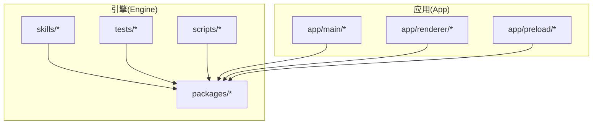
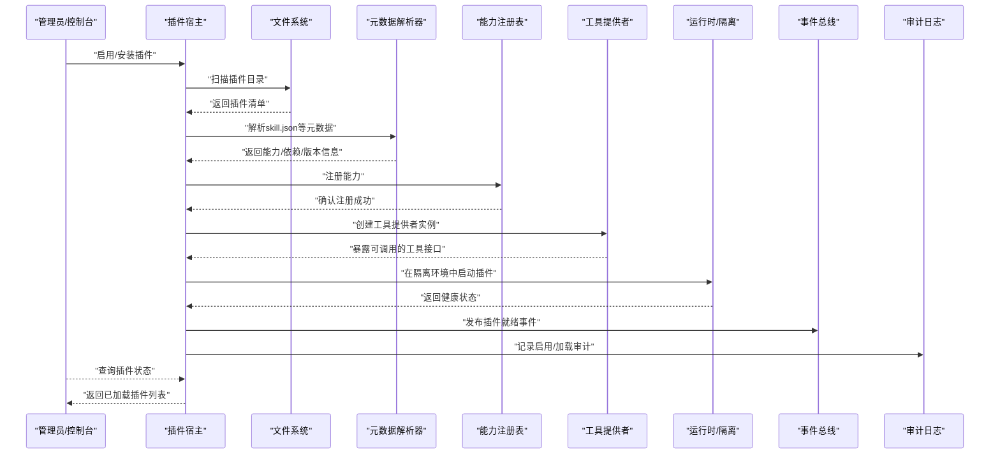
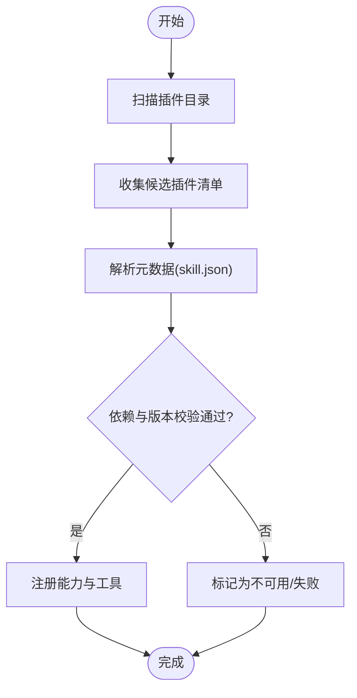
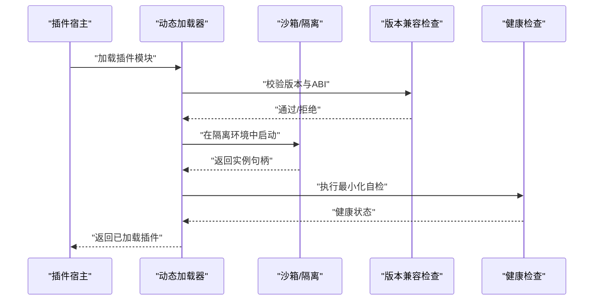
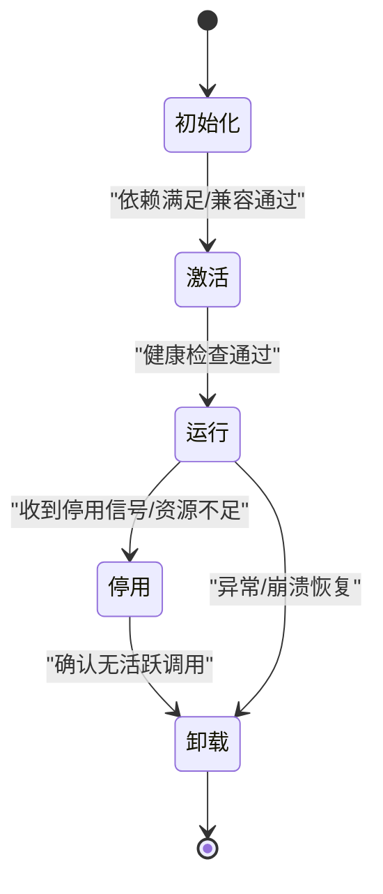
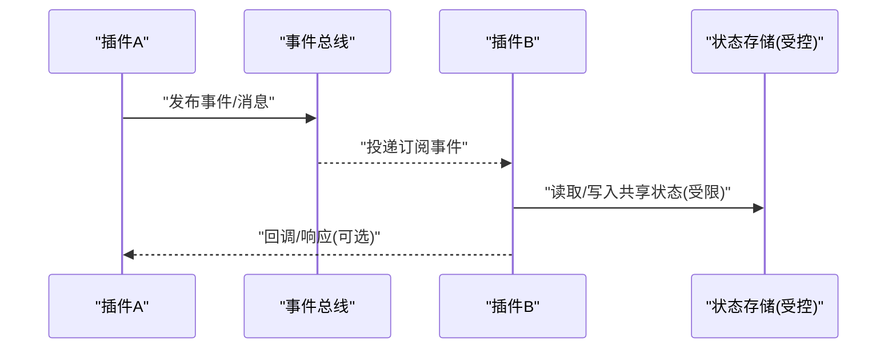
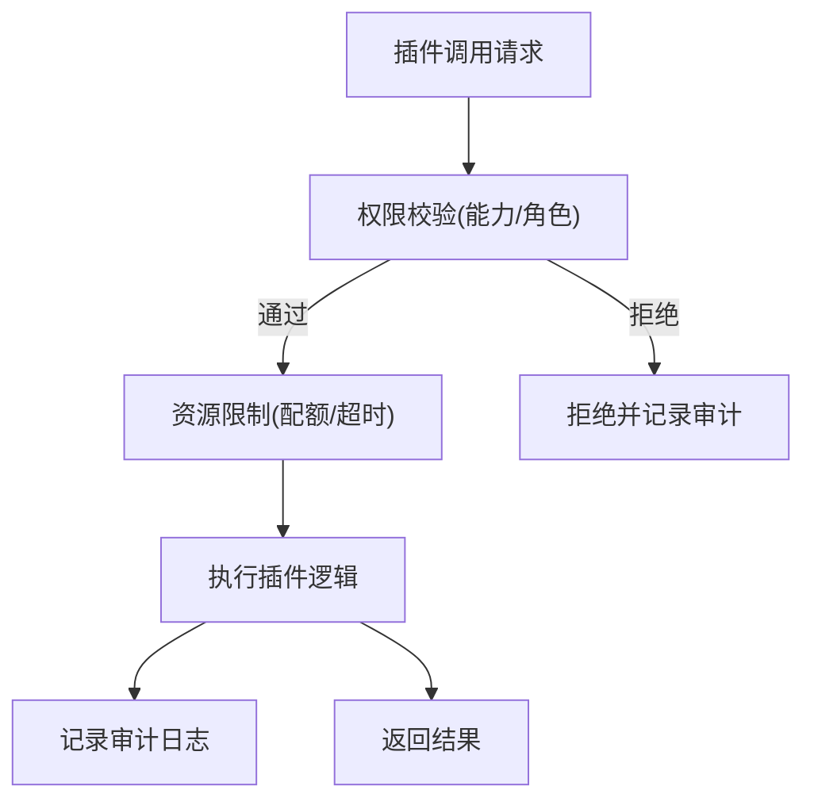
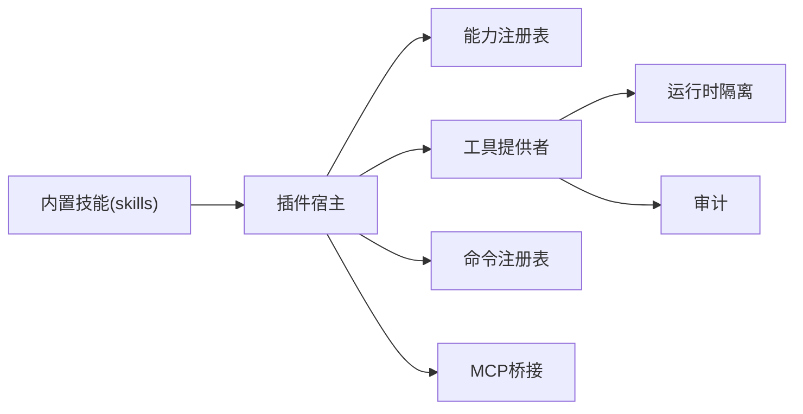

# 插件系统

<cite>
**本文引用的文件**   
- [engine/package.json](file://engine/package.json)
- [engine/README.md](file://engine/README.md)
- [engine/skills/code-review/skill.json](file://engine/skills/code-review/skill.json)
- [engine/skills/debugging/skill.json](file://engine/skills/debugging/skill.json)
- [engine/skills/git-worktrees/skill.json](file://engine/skills/git-worktrees/skill.json)
- [engine/skills/goal/skill.json](file://engine/skills/goal/skill.json)
- [engine/skills/planning/skill.json](file://engine/skills/planning/skill.json)
- [engine/skills/refactoring/skill.json](file://engine/skills/refactoring/skill.json)
- [engine/skills/review/skill.json](file://engine/skills/review/skill.json)
- [engine/skills/security-review/skill.json](file://engine/skills/security-review/skill.json)
- [engine/skills/tdd/skill.json](file://engine/skills/tdd/skill.json)
- [engine/skills/todo/skill.json](file://engine/skills/todo/skill.json)
- [engine/skills/web/skill.json](file://engine/skills/web/skill.json)
- [engine/tests/plugin-host.test.ts](file://engine/tests/plugin-host.test.ts)
- [engine/tests/capability-registry.test.ts](file://engine/tests/capability-registry.test.ts)
- [engine/tests/marketplace.test.ts](file://engine/tests/marketplace.test.ts)
- [engine/tests/runtime-kernel-isolation.test.ts](file://engine/tests/runtime-kernel-isolation.test.ts)
- [engine/tests/tool-dispatch-errors.test.ts](file://engine/tests/tool-dispatch-errors.test.ts)
- [engine/tests/command-audit.test.ts](file://engine/tests/command-audit.test.ts)
- [engine/tests/builtin-skills.test.ts](file://engine/tests/builtin-skills.test.ts)
- [engine/tests/skill-command-registry.test.ts](file://engine/tests/skill-command-registry.test.ts)
- [engine/tests/skill-mcp-bridge.test.ts](file://engine/tests/skill-mcp-bridge.test.ts)
- [engine/tests/skill-runtime.test.ts](file://engine/tests/skill-runtime.test.ts)
- [engine/tests/skill-tool-provider.test.ts](file://engine/tests/skill-tool-provider.test.ts)
- [engine/tests/work-mode-skill-runtime.test.ts](file://engine/tests/work-mode-skill-runtime.test.ts)
</cite>

## 目录
1. [简介](#简介)
2. [项目结构](#项目结构)
3. [核心组件](#核心组件)
4. [架构总览](#架构总览)
5. [详细组件分析](#详细组件分析)
6. [依赖分析](#依赖分析)
7. [性能考虑](#性能考虑)
8. [故障排查指南](#故障排查指南)
9. [结论](#结论)
10. [附录](#附录)

## 简介
本文件面向KCoder运行时内核的“插件系统”，聚焦于以下目标：
- 插件发现机制：目录扫描、元数据解析、依赖检查
- 插件加载过程：动态加载、沙箱隔离、版本兼容性检查
- 生命周期管理：初始化、激活、停用、卸载
- 插件间通信：事件总线、消息传递、状态共享
- 安全机制：权限控制、资源限制、访问审计
- 开发指南：插件结构定义、API使用、调试技巧
- 管理最佳实践：更新、回滚、监控告警

说明：仓库中未提供完整的插件实现源码，但通过测试与内置技能（skills）可推断出插件系统的边界、能力注册、运行时隔离、工具分发、命令注册等关键行为。本文基于这些线索进行系统化整理，并给出可操作的实践建议。

## 项目结构
与插件系统相关的代码主要位于 engine 子工程内，包含：
- 内置技能（skills）：以 skill.json 为元数据入口，配合 SKILL.md 描述文档
- 测试用例：覆盖插件宿主、能力注册、市场、隔离、错误处理、审计、MCP桥接、运行时等
- 构建与脚本：用于打包、迁移、验证等

图表来源
- [engine/package.json](file://engine/package.json)
- [engine/README.md](file://engine/README.md)

章节来源
- [engine/package.json](file://engine/package.json)
- [engine/README.md](file://engine/README.md)

## 核心组件
- 插件宿主（Plugin Host）：负责插件的发现、加载、生命周期管理与隔离执行
- 能力注册表（Capability Registry）：统一注册与查询插件暴露的能力
- 工具提供者（Tool Provider）：将插件能力封装为可被调度器调用的工具
- 命令注册表（Command Registry）：将插件能力映射到CLI或内部命令
- MCP桥接（MCP Bridge）：在插件与外部协议之间建立适配层
- 运行时隔离（Runtime Isolation）：对插件执行环境进行资源与权限约束
- 审计与治理（Audit & Governance）：记录调用、资源使用与合规策略

章节来源
- [engine/tests/plugin-host.test.ts](file://engine/tests/plugin-host.test.ts)
- [engine/tests/capability-registry.test.ts](file://engine/tests/capability-registry.test.ts)
- [engine/tests/skill-tool-provider.test.ts](file://engine/tests/skill-tool-provider.test.ts)
- [engine/tests/skill-command-registry.test.ts](file://engine/tests/skill-command-registry.test.ts)
- [engine/tests/skill-mcp-bridge.test.ts](file://engine/tests/skill-mcp-bridge.test.ts)
- [engine/tests/runtime-kernel-isolation.test.ts](file://engine/tests/runtime-kernel-isolation.test.ts)
- [engine/tests/command-audit.test.ts](file://engine/tests/command-audit.test.ts)

## 架构总览
下图展示了插件从发现到运行时的整体流程，以及各子系统之间的交互关系。

图表来源
- [engine/tests/plugin-host.test.ts](file://engine/tests/plugin-host.test.ts)
- [engine/tests/capability-registry.test.ts](file://engine/tests/capability-registry.test.ts)
- [engine/tests/skill-tool-provider.test.ts](file://engine/tests/skill-tool-provider.test.ts)
- [engine/tests/runtime-kernel-isolation.test.ts](file://engine/tests/runtime-kernel-isolation.test.ts)
- [engine/tests/command-audit.test.ts](file://engine/tests/command-audit.test.ts)

## 详细组件分析

### 插件发现机制
- 目录扫描：宿主按约定路径扫描插件目录，收集候选插件清单
- 元数据解析：读取每个插件的元数据文件（如 skill.json），解析名称、版本、能力声明、依赖项等
- 依赖检查：校验插件依赖是否满足（版本范围、能力存在性），不满足则拒绝加载
- 去重与冲突：同名插件或能力冲突时，采用策略（优先高版本/显式指定）解决

图表来源
- [engine/tests/plugin-host.test.ts](file://engine/tests/plugin-host.test.ts)
- [engine/skills/code-review/skill.json](file://engine/skills/code-review/skill.json)
- [engine/skills/debugging/skill.json](file://engine/skills/debugging/skill.json)
- [engine/skills/git-worktrees/skill.json](file://engine/skills/git-worktrees/skill.json)
- [engine/skills/goal/skill.json](file://engine/skills/goal/skill.json)
- [engine/skills/planning/skill.json](file://engine/skills/planning/skill.json)
- [engine/skills/refactoring/skill.json](file://engine/skills/refactoring/skill.json)
- [engine/skills/review/skill.json](file://engine/skills/review/skill.json)
- [engine/skills/security-review/skill.json](file://engine/skills/security-review/skill.json)
- [engine/skills/tdd/skill.json](file://engine/skills/tdd/skill.json)
- [engine/skills/todo/skill.json](file://engine/skills/todo/skill.json)
- [engine/skills/web/skill.json](file://engine/skills/web/skill.json)

章节来源
- [engine/tests/plugin-host.test.ts](file://engine/tests/plugin-host.test.ts)
- [engine/skills/code-review/skill.json](file://engine/skills/code-review/skill.json)
- [engine/skills/debugging/skill.json](file://engine/skills/debugging/skill.json)
- [engine/skills/git-worktrees/skill.json](file://engine/skills/git-worktrees/skill.json)
- [engine/skills/goal/skill.json](file://engine/skills/goal/skill.json)
- [engine/skills/planning/skill.json](file://engine/skills/planning/skill.json)
- [engine/skills/refactoring/skill.json](file://engine/skills/refactoring/skill.json)
- [engine/skills/review/skill.json](file://engine/skills/review/skill.json)
- [engine/skills/security-review/skill.json](file://engine/skills/security-review/skill.json)
- [engine/skills/tdd/skill.json](file://engine/skills/tdd/skill.json)
- [engine/skills/todo/skill.json](file://engine/skills/todo/skill.json)
- [engine/skills/web/skill.json](file://engine/skills/web/skill.json)

### 插件加载过程
- 动态加载：根据元数据动态创建模块实例，按需引入能力与工具
- 沙箱隔离：在受限环境中运行插件，限制I/O、网络、进程与内存
- 版本兼容：依据元数据中的版本约束与内核ABI进行兼容性检查
- 健康检查：加载后执行最小化自检，确保能力可用

图表来源
- [engine/tests/plugin-host.test.ts](file://engine/tests/plugin-host.test.ts)
- [engine/tests/runtime-kernel-isolation.test.ts](file://engine/tests/runtime-kernel-isolation.test.ts)

章节来源
- [engine/tests/plugin-host.test.ts](file://engine/tests/plugin-host.test.ts)
- [engine/tests/runtime-kernel-isolation.test.ts](file://engine/tests/runtime-kernel-isolation.test.ts)

### 生命周期管理
- 初始化：解析元数据、准备上下文、分配资源标识
- 激活：注册能力与工具、订阅事件、预热缓存
- 运行：响应调用、维护会话状态、上报遥测
- 停用：释放资源、取消订阅、持久化必要状态
- 卸载：清理实例、移除注册项、回收资源

图表来源
- [engine/tests/plugin-host.test.ts](file://engine/tests/plugin-host.test.ts)

章节来源
- [engine/tests/plugin-host.test.ts](file://engine/tests/plugin-host.test.ts)

### 插件间通信机制
- 事件总线：插件通过事件总线发布/订阅领域事件，实现松耦合协作
- 消息传递：通过结构化消息在插件间交换请求/响应
- 状态共享：在受控范围内共享只读状态或增量变更，避免竞态

图表来源
- [engine/tests/plugin-host.test.ts](file://engine/tests/plugin-host.test.ts)

章节来源
- [engine/tests/plugin-host.test.ts](file://engine/tests/plugin-host.test.ts)

### 安全机制
- 权限控制：基于能力声明的最小权限模型，仅授予必要能力
- 资源限制：CPU、内存、I/O、网络等配额与超时
- 访问审计：记录插件调用链、资源使用与异常，便于追踪与合规

图表来源
- [engine/tests/command-audit.test.ts](file://engine/tests/command-audit.test.ts)
- [engine/tests/runtime-kernel-isolation.test.ts](file://engine/tests/runtime-kernel-isolation.test.ts)

章节来源
- [engine/tests/command-audit.test.ts](file://engine/tests/command-audit.test.ts)
- [engine/tests/runtime-kernel-isolation.test.ts](file://engine/tests/runtime-kernel-isolation.test.ts)

### 插件开发指南
- 插件结构定义
  - 元数据文件：使用 skill.json 描述插件基本信息、能力、依赖与版本
  - 文档与说明：SKILL.md 作为使用说明与契约
  - 能力与工具：通过能力注册表与工具提供者对外暴露
- API使用
  - 能力注册：向注册表登记能力键与参数契约
  - 工具提供：将能力包装为可被调度器调用的工具
  - 命令映射：将能力映射到CLI或内部命令
  - MCP桥接：如需与外部协议互通，使用MCP桥接适配器
- 调试技巧
  - 启用详细日志与审计输出
  - 使用最小化测试套件验证能力契约
  - 在隔离环境中复现问题，定位资源与权限边界

章节来源
- [engine/skills/code-review/skill.json](file://engine/skills/code-review/skill.json)
- [engine/skills/debugging/skill.json](file://engine/skills/debugging/skill.json)
- [engine/skills/git-worktrees/skill.json](file://engine/skills/git-worktrees/skill.json)
- [engine/skills/goal/skill.json](file://engine/skills/goal/skill.json)
- [engine/skills/planning/skill.json](file://engine/skills/planning/skill.json)
- [engine/skills/refactoring/skill.json](file://engine/skills/refactoring/skill.json)
- [engine/skills/review/skill.json](file://engine/skills/review/skill.json)
- [engine/skills/security-review/skill.json](file://engine/skills/security-review/skill.json)
- [engine/skills/tdd/skill.json](file://engine/skills/tdd/skill.json)
- [engine/skills/todo/skill.json](file://engine/skills/todo/skill.json)
- [engine/skills/web/skill.json](file://engine/skills/web/skill.json)
- [engine/tests/skill-tool-provider.test.ts](file://engine/tests/skill-tool-provider.test.ts)
- [engine/tests/skill-command-registry.test.ts](file://engine/tests/skill-command-registry.test.ts)
- [engine/tests/skill-mcp-bridge.test.ts](file://engine/tests/skill-mcp-bridge.test.ts)

### 插件管理最佳实践
- 插件更新
  - 灰度发布：先小范围启用新版本，观察指标后再全量
  - 依赖演进：向后兼容升级，逐步废弃旧能力
- 回滚策略
  - 快照与版本锁定：保留上一稳定版本，快速回滚
  - 能力降级：在兼容模式下继续提供服务
- 监控告警
  - 指标采集：调用成功率、延迟、资源使用、错误率
  - 审计追踪：结合命令审计与运行时隔离日志定位问题
  - 阈值告警：对异常波动与违规调用及时告警

章节来源
- [engine/tests/marketplace.test.ts](file://engine/tests/marketplace.test.ts)
- [engine/tests/command-audit.test.ts](file://engine/tests/command-audit.test.ts)
- [engine/tests/runtime-kernel-isolation.test.ts](file://engine/tests/runtime-kernel-isolation.test.ts)

## 依赖分析
- 直接依赖
  - 插件宿主依赖能力注册表与工具提供者
  - 工具提供者依赖运行时隔离与审计
  - 命令注册表与MCP桥接作为扩展点
- 间接依赖
  - 内置技能通过元数据驱动注册与加载
  - 测试套件覆盖端到端场景，保障契约稳定性

图表来源
- [engine/tests/plugin-host.test.ts](file://engine/tests/plugin-host.test.ts)
- [engine/tests/capability-registry.test.ts](file://engine/tests/capability-registry.test.ts)
- [engine/tests/skill-tool-provider.test.ts](file://engine/tests/skill-tool-provider.test.ts)
- [engine/tests/skill-command-registry.test.ts](file://engine/tests/skill-command-registry.test.ts)
- [engine/tests/skill-mcp-bridge.test.ts](file://engine/tests/skill-mcp-bridge.test.ts)
- [engine/tests/runtime-kernel-isolation.test.ts](file://engine/tests/runtime-kernel-isolation.test.ts)
- [engine/tests/command-audit.test.ts](file://engine/tests/command-audit.test.ts)

章节来源
- [engine/tests/plugin-host.test.ts](file://engine/tests/plugin-host.test.ts)
- [engine/tests/capability-registry.test.ts](file://engine/tests/capability-registry.test.ts)
- [engine/tests/skill-tool-provider.test.ts](file://engine/tests/skill-tool-provider.test.ts)
- [engine/tests/skill-command-registry.test.ts](file://engine/tests/skill-command-registry.test.ts)
- [engine/tests/skill-mcp-bridge.test.ts](file://engine/tests/skill-mcp-bridge.test.ts)
- [engine/tests/runtime-kernel-isolation.test.ts](file://engine/tests/runtime-kernel-isolation.test.ts)
- [engine/tests/command-audit.test.ts](file://engine/tests/command-audit.test.ts)

## 性能考虑
- 懒加载与按需启用：减少冷启动开销
- 能力缓存：对热路径能力进行结果或元数据缓存
- 并发与限流：对工具调用进行并发控制与速率限制
- 资源配额：合理设置CPU/内存/I/O配额，避免雪崩
- 异步与批处理：合并小任务，降低调度开销

[本节为通用指导，无需特定文件引用]

## 故障排查指南
- 常见问题
  - 插件无法加载：检查元数据完整性、依赖与版本约束
  - 能力未注册：确认注册表接入与键名一致性
  - 调用失败：查看工具提供者错误与隔离日志
  - 审计缺失：确认审计开关与输出通道配置
- 诊断步骤
  - 启用详细日志与审计
  - 使用最小化用例复现
  - 在隔离环境中逐项排除资源与权限问题
  - 对比不同版本的差异，定位回归点

章节来源
- [engine/tests/tool-dispatch-errors.test.ts](file://engine/tests/tool-dispatch-errors.test.ts)
- [engine/tests/command-audit.test.ts](file://engine/tests/command-audit.test.ts)
- [engine/tests/runtime-kernel-isolation.test.ts](file://engine/tests/runtime-kernel-isolation.test.ts)

## 结论
KCoder插件系统围绕“发现—加载—生命周期—通信—安全—管理”形成闭环。通过能力注册、工具提供、命令映射与MCP桥接，插件能够以标准化方式融入内核；借助运行时隔离与审计，系统在可扩展的同时保持可控与可观测。遵循本文的开发与管理实践，可有效提升插件质量与系统稳定性。

[本节为总结性内容，无需特定文件引用]

## 附录
- 相关测试参考
  - 插件宿主与生命周期：[plugin-host.test.ts](file://engine/tests/plugin-host.test.ts)
  - 能力注册与契约：[capability-registry.test.ts](file://engine/tests/capability-registry.test.ts)
  - 市场与版本管理：[marketplace.test.ts](file://engine/tests/marketplace.test.ts)
  - 运行时隔离与安全：[runtime-kernel-isolation.test.ts](file://engine/tests/runtime-kernel-isolation.test.ts)
  - 工具调用错误处理：[tool-dispatch-errors.test.ts](file://engine/tests/tool-dispatch-errors.test.ts)
  - 命令审计与合规：[command-audit.test.ts](file://engine/tests/command-audit.test.ts)
  - 内置技能与运行时：[builtin-skills.test.ts](file://engine/tests/builtin-skills.test.ts)、[skill-runtime.test.ts](file://engine/tests/skill-runtime.test.ts)、[work-mode-skill-runtime.test.ts](file://engine/tests/work-mode-skill-runtime.test.ts)
  - 工具提供者与命令注册：[skill-tool-provider.test.ts](file://engine/tests/skill-tool-provider.test.ts)、[skill-command-registry.test.ts](file://engine/tests/skill-command-registry.test.ts)
  - MCP桥接：[skill-mcp-bridge.test.ts](file://engine/tests/skill-mcp-bridge.test.ts)