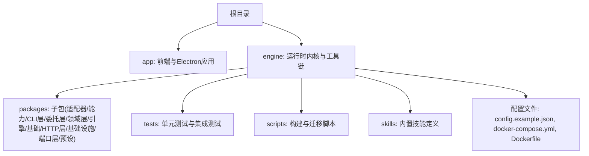
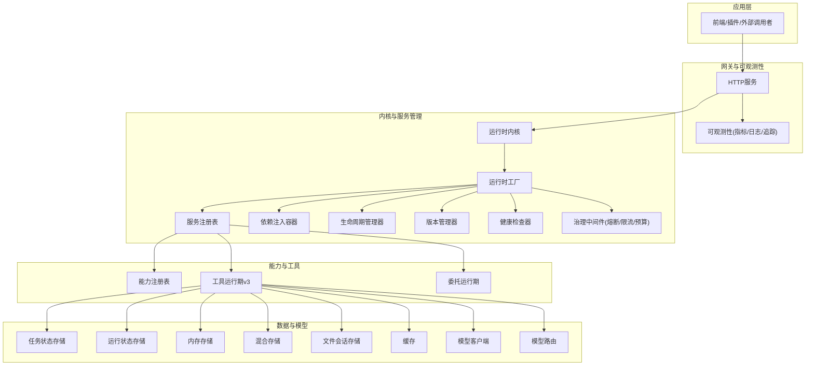
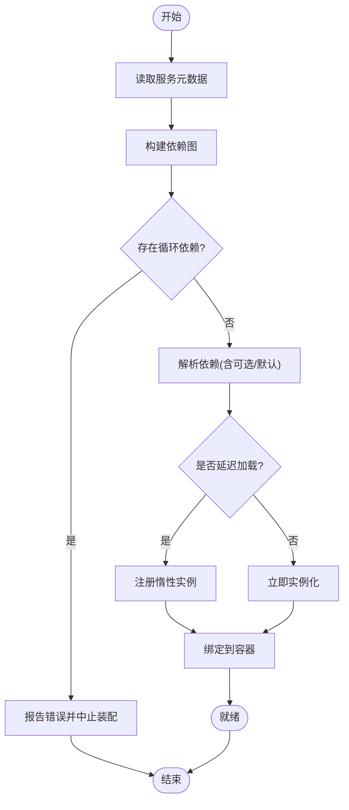
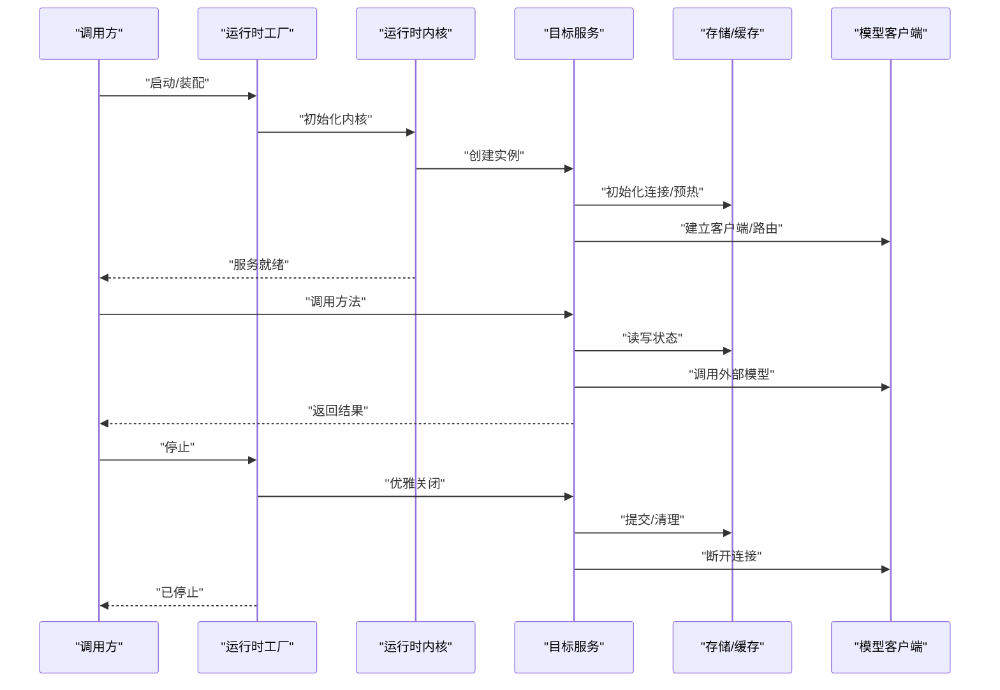
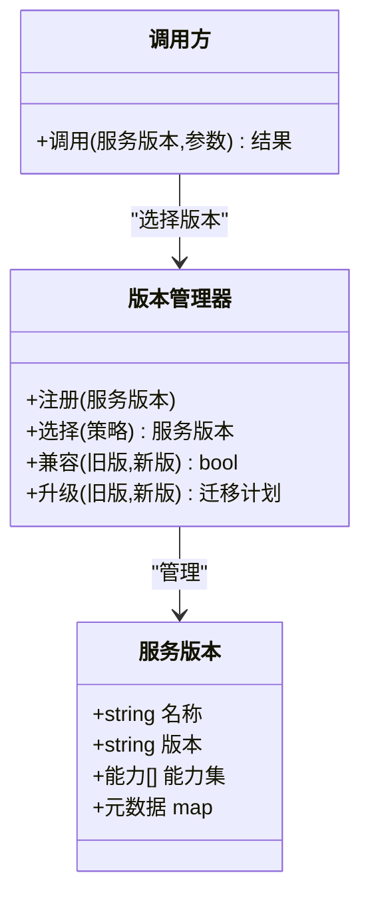
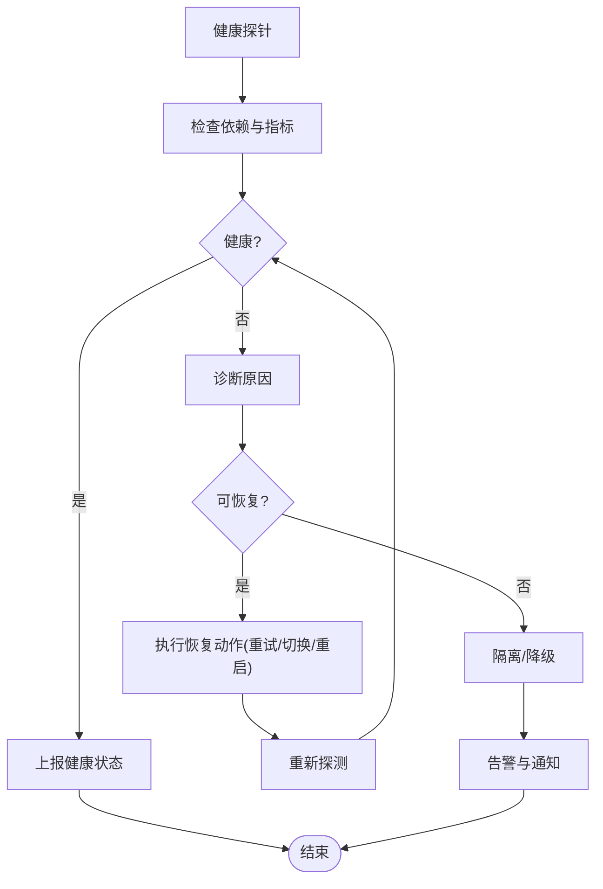
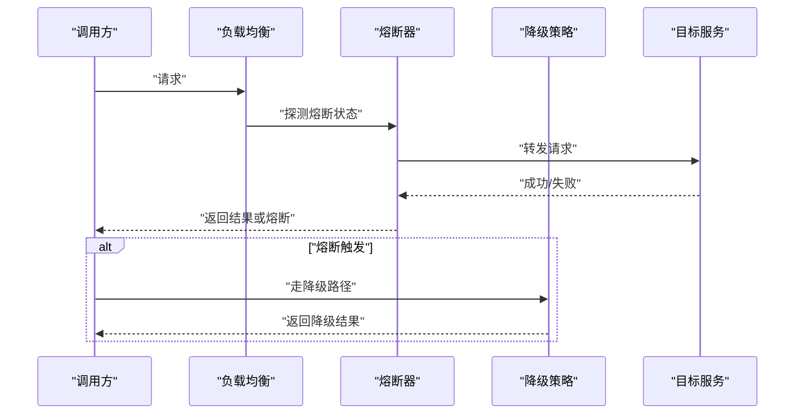
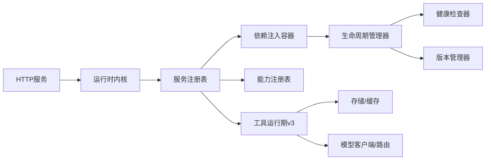

# 服务管理

<cite>
**本文引用的文件**   
- [README.md](file://engine/README.md)
- [package.json](file://engine/package.json)
- [pnpm-workspace.yaml](file://engine/pnpm-workspace.yaml)
- [tsconfig.json](file://engine/tsconfig.json)
- [Dockerfile](file://engine/Dockerfile)
- [docker-compose.yml](file://engine/docker-compose.yml)
- [config.example.json](file://engine/config.example.json)
- [scripts/build.mjs](file://engine/scripts/build.mjs)
- [scripts/migrate-packages.mjs](file://engine/scripts/migrate-packages.mjs)
- [scripts/scaffold-packages.mjs](file://engine/scripts/scaffold-packages.mjs)
- [tests/runtime-kernel.test.ts](file://engine/tests/runtime-kernel.test.ts)
- [tests/runtime-kernel-e2e.test.ts](file://engine/tests/runtime-kernel-e2e.test.ts)
- [tests/runtime-kernel-crash-recovery.test.ts](file://engine/tests/runtime-kernel-crash-recovery.test.ts)
- [tests/runtime-kernel-provider-matrix.test.ts](file://engine/tests/runtime-kernel-provider-matrix.test.ts)
- [tests/runtime-kernel-contracts.test.ts](file://engine/tests/runtime-kernel-contracts.test.ts)
- [tests/runtime-kernel-isolation.test.ts](file://engine/tests/runtime-kernel-isolation.test.ts)
- [tests/runtime-kernel-parity.test.ts](file://engine/tests/runtime-kernel-parity.test.ts)
- [tests/runtime-kernel-after-middleware.test.ts](file://engine/tests/runtime-kernel-after-middleware.test.ts)
- [tests/runtime-kernel-budget.test.ts](file://engine/tests/runtime-kernel-budget.test.ts)
- [tests/runtime-kernel-replay.test.ts](file://engine/tests/runtime-kernel-replay.test.ts)
- [tests/runtime-factory.test.ts](file://engine/tests/runtime-factory.test.ts)
- [tests/runtime-factory-rollout.test.ts](file://engine/tests/runtime-factory-rollout.test.ts)
- [tests/runtime-middleware.test.ts](file://engine/tests/runtime-middleware.test.ts)
- [tests/runtime-middleware-governance.test.ts](file://engine/tests/runtime-middleware-governance.test.ts)
- [tests/http-server.test.ts](file://engine/tests/http-server.test.ts)
- [tests/http-server-test-harness.ts](file://engine/tests/http-server-test-harness.ts)
- [tests/http-server-observability.test.ts](file://engine/tests/http-server-observability.test.ts)
- [tests/capability-registry.test.ts](file://engine/tests/capability-registry.test.ts)
- [tests/tool-runtime-v3.test.ts](file://engine/tests/tool-runtime-v3.test.ts)
- [tests/tool-coordinator-runtime.test.ts](file://engine/tests/tool-coordinator-runtime.test.ts)
- [tests/tool-dispatch-errors.test.ts](file://engine/tests/tool-dispatch-errors.test.ts)
- [tests/tool-result-budget.test.ts](file://engine/tests/tool-result-budget.test.ts)
- [tests/delegation-runtime.test.ts](file://engine/tests/delegation-runtime.test.ts)
- [tests/delegation-terminal-state.test.ts](file://engine/tests/delegation-terminal状态.test.ts)
- [tests/execution-graph.test.ts](file://engine/tests/execution-graph.test.ts)
- [tests/evented-loop.test.ts](file://engine/tests/evented-loop.test.ts)
- [tests/turn-event-bus.test.ts](file://engine/tests/turn-event-bus.test.ts)
- [tests/task-state-store.test.ts](file://engine/tests/task-state-store.test.ts)
- [tests/run-state-store.test.ts](file://engine/tests/run-state-store.test.ts)
- [tests/memory-store.test.ts](file://engine/tests/memory-store.test.ts)
- [tests/hybrid-store.test.ts](file://engine/tests/hybrid-store.test.ts)
- [tests/file-session-store.test.ts](file://engine/tests/file-session-store.test.ts)
- [tests/file-session-store-integration.test.ts](file://engine/tests/file-session-store-integration.test.ts)
- [tests/cache.test.ts](file://engine/tests/cache.test.ts)
- [tests/model-client.test.ts](file://engine/tests/model-client.test.ts)
- [tests/auto-model-router.test.ts](file://engine/tests/auto-model-router.test.ts)
- [tests/provider-compatibility.test.ts](file://engine/tests/provider-compatibility.test.ts)
- [tests/contracts.test.ts](file://engine/tests/contracts.test.ts)
- [tests/ports.test.ts](file://engine/tests/ports.test.ts)
- [tests/domain.test.ts](file://engine/tests/domain.test.ts)
- [tests/skill-command-registry.test.ts](file://engine/tests/skill-command-registry.test.ts)
- [tests/skill-tool-provider.test.ts](file://engine/tests/skill-tool-provider.test.ts)
- [tests/skill-runtime.test.ts](file://engine/tests/skill-runtime.test.ts)
- [tests/web-tool-provider.test.ts](file://engine/tests/web-tool-provider.test.ts)
- [tests/mcp-tool-provider.test.ts](file://engine/tests/mcp-tool-provider.test.ts)
- [tests/mcp-config.test.ts](file://engine/tests/mcp-config.test.ts)
- [tests/builtin-tools.test.ts](file://engine/tests/builtin-tools.test.ts)
- [tests/builtin-tool-utils.test.ts](file://engine/tests/builtin-tool-utils.test.ts)
- [tests/create-plan-tool.test.ts](file://engine/tests/create-plan-tool.test.ts)
- [tests/goal-tools.test.ts](file://engine/tests/goal-tools.test.ts)
- [tests/todo-tools.test.ts](file://engine/tests/todo-tools.test.ts)
- [tests/review.test.ts](file://engine/tests/review.test.ts)
- [tests/security-review.test.ts](file://engine/tests/security-review.test.ts)
- [tests/code-review.test.ts](file://engine/tests/code-review.test.ts)
- [tests/debugging.test.ts](file://engine/tests/debugging.test.ts)
- [tests/git-worktrees.test.ts](file://engine/tests/git-worktrees.test.ts)
- [tests/planning.test.ts](file://engine/tests/planning.test.ts)
- [tests/refactoring.test.ts](file://engine/tests/refactoring.test.ts)
- [tests/tdd.test.ts](file://engine/tests/tdd.test.ts)
- [tests/web.test.ts](file://engine/tests/web.test.ts)
- [tests/loop-runner.test.ts](file://engine/tests/loop-runner.test.ts)
- [tests/loop-policy.test.ts](file://engine/tests/loop-policy.test.ts)
- [tests/loop-plan.test.ts](file://engine/tests/loop-plan.test.ts)
- [tests/loop-evaluator.test.ts](file://engine/tests/loop-evaluator.test.ts)
- [tests/compaction-governor.test.ts](file://engine/tests/compaction-governor.test.ts)
- [tests/compaction-transaction.test.ts](file://engine/tests/compaction-transaction.test.ts)
- [tests/context-compactor.test.ts](file://engine/tests/context-compactor.test.ts)
- [tests/durable-task-capsule.test.ts](file://engine/tests/durable-task-capsule.test.ts)
- [tests/effect-commit.test.ts](file://engine/tests/effect-commit.test.ts)
- [tests/effect-result-store.test.ts](file://engine/tests/effect-result-store.test.ts)
- [tests/output-accumulator.test.ts](file://engine/tests/output-accumulator.test.ts)
- [tests/request-history-hygiene.test.ts](file://engine/tests/request-history-hygiene.test.ts)
- [tests/token-economy.test.ts](file://engine/tests/token-economy.test.ts)
- [tests/usage-service.test.ts](file://engine/tests/usage-service.test.ts)
- [tests/virtual-path.test.ts](file://engine/tests/virtual-path.test.ts)
- [tests/atomic-write.test.ts](file://engine/tests/atomic-write.test.ts)
- [tests/attachment-store.test.ts](file://engine/tests/attachment-store.test.ts)
- [tests/file-mutation-queue.test.ts](file://engine/tests/file-mutation-queue.test.ts)
- [tests/finance-credentials.test.ts](file://engine/tests/finance-credentials.test.ts)
- [tests/kimi-k2-tool-loop.json](file://engine/tests/fixtures/kernel-governance/kimi-k2-tool-loop.json)
- [tests/fixtures/kernel-governance/minimax-m3-tool-storm.json](file://engine/tests/fixtures/kernel-governance/minimax-m3-tool-storm.json)
- [tests/fixtures/kernel-governance/no-reasoning-tool-loop.json](file://engine/tests/fixtures/kernel-governance/no-reasoning-tool-loop.json)
- [tests/fixtures/kernel-governance/openrouter-hy3-tool-loop.json](file://engine/tests/fixtures/kernel-governance/openrouter-hy3-tool-loop.json)
- [tests/fixtures/kernel-governance/vllm-deepseek-tool-loop.json](file://engine/tests/fixtures/kernel-governance/vllm-deepseek-tool-loop.json)
</cite>

## 目录
1. [简介](#简介)
2. [项目结构](#项目结构)
3. [核心组件](#核心组件)
4. [架构总览](#架构总览)
5. [详细组件分析](#详细组件分析)
6. [依赖分析](#依赖分析)
7. [性能考虑](#性能考虑)
8. [故障排查指南](#故障排查指南)
9. [结论](#结论)
10. [附录](#附录)

## 简介
本文件面向KCoder运行时内核的服务管理系统，聚焦以下主题：
- 服务的注册机制：服务声明、依赖注入、自动装配
- 服务的生命周期管理：创建、初始化、销毁
- 服务的依赖解析：循环依赖检测、依赖注入容器、延迟加载
- 服务的版本管理：多版本共存、向后兼容、升级策略
- 服务的健康检查：状态监控、故障检测、自动恢复
- 服务开发最佳实践：接口设计、错误处理、性能优化
- 服务治理高级能力：熔断降级、负载均衡、流量控制

说明：由于当前仓库未提供具体的服务管理实现源码（如服务注册表、DI容器等），本文基于测试与工程配置进行推断性分析与建议，旨在为后续实现提供可落地的蓝图。

## 项目结构
KCoder采用monorepo组织方式，核心引擎位于engine目录，使用pnpm workspace管理多个子包。测试覆盖广泛，包含运行时内核、HTTP服务、工具运行期、技能系统、持久化存储、模型客户端、编排与治理等。

**图表来源**
- [pnpm-workspace.yaml](file://engine/pnpm-workspace.yaml)
- [package.json](file://engine/package.json)
- [README.md](file://engine/README.md)

**章节来源**
- [README.md](file://engine/README.md)
- [package.json](file://engine/package.json)
- [pnpm-workspace.yaml](file://engine/pnpm-workspace.yaml)
- [tsconfig.json](file://engine/tsconfig.json)

## 核心组件
根据测试与工程结构，服务管理相关的关键组件包括：
- 运行时工厂与内核：负责实例化、装配与启动内核及子系统
- HTTP服务与可观测性：对外暴露API并采集指标
- 能力注册表与工具运行期：承载服务能力的发现与调用
- 任务与事件总线：支撑异步流程与状态流转
- 存储与缓存：提供会话、状态与结果持久化
- 模型客户端与路由：抽象外部模型访问与选择策略
- 治理与中间件：预算、压缩、循环治理、熔断与限流等

上述组件在测试中均有对应验证点，可作为服务管理实现的参考边界。

**章节来源**
- [tests/runtime-factory.test.ts](file://engine/tests/runtime-factory.test.ts)
- [tests/runtime-kernel.test.ts](file://engine/tests/runtime-kernel.test.ts)
- [tests/http-server.test.ts](file://engine/tests/http-server.test.ts)
- [tests/capability-registry.test.ts](file://engine/tests/capability-registry.test.ts)
- [tests/tool-runtime-v3.test.ts](file://engine/tests/tool-runtime-v3.test.ts)
- [tests/turn-event-bus.test.ts](file://engine/tests/turn-event-bus.test.ts)
- [tests/task-state-store.test.ts](file://engine/tests/task-state-store.test.ts)
- [tests/run-state-store.test.ts](file://engine/tests/run-state-store.test.ts)
- [tests/memory-store.test.ts](file://engine/tests/memory-store.test.ts)
- [tests/hybrid-store.test.ts](file://engine/tests/hybrid-store.test.ts)
- [tests/file-session-store.test.ts](file://engine/tests/file-session-store.test.ts)
- [tests/cache.test.ts](file://engine/tests/cache.test.ts)
- [tests/model-client.test.ts](file://engine/tests/model-client.test.ts)
- [tests/auto-model-router.test.ts](file://engine/tests/auto-model-router.test.ts)
- [tests/runtime-middleware.test.ts](file://engine/tests/runtime-middleware.test.ts)
- [tests/runtime-middleware-governance.test.ts](file://engine/tests/runtime-middleware-governance.test.ts)
- [tests/runtime-kernel-after-middleware.test.ts](file://engine/tests/runtime-kernel-after-middleware.test.ts)
- [tests/runtime-kernel-budget.test.ts](file://engine/tests/runtime-kernel-budget.test.ts)
- [tests/compaction-governor.test.ts](file://engine/tests/compaction-governor.test.ts)
- [tests/loop-runner.test.ts](file://engine/tests/loop-runner.test.ts)
- [tests/loop-policy.test.ts](file://engine/tests/loop-policy.test.ts)

## 架构总览
下图展示服务管理与运行时内核的高层交互关系，涵盖注册、装配、生命周期、治理与可观测性。

**图表来源**
- [tests/runtime-factory.test.ts](file://engine/tests/runtime-factory.test.ts)
- [tests/runtime-kernel.test.ts](file://engine/tests/runtime-kernel.test.ts)
- [tests/http-server.test.ts](file://engine/tests/http-server.test.ts)
- [tests/capability-registry.test.ts](file://engine/tests/capability-registry.test.ts)
- [tests/tool-runtime-v3.test.ts](file://engine/tests/tool-runtime-v3.test.ts)
- [tests/delegation-runtime.test.ts](file://engine/tests/delegation-runtime.test.ts)
- [tests/task-state-store.test.ts](file://engine/tests/task-state-store.test.ts)
- [tests/run-state-store.test.ts](file://engine/tests/run-state-store.test.ts)
- [tests/memory-store.test.ts](file://engine/tests/memory-store.test.ts)
- [tests/hybrid-store.test.ts](file://engine/tests/hybrid-store.test.ts)
- [tests/file-session-store.test.ts](file://engine/tests/file-session-store.test.ts)
- [tests/cache.test.ts](file://engine/tests/cache.test.ts)
- [tests/model-client.test.ts](file://engine/tests/model-client.test.ts)
- [tests/auto-model-router.test.ts](file://engine/tests/auto-model-router.test.ts)
- [tests/runtime-middleware.test.ts](file://engine/tests/runtime-middleware.test.ts)
- [tests/runtime-middleware-governance.test.ts](file://engine/tests/runtime-middleware-governance.test.ts)
- [tests/runtime-kernel-after-middleware.test.ts](file://engine/tests/runtime-kernel-after-middleware.test.ts)
- [tests/runtime-kernel-budget.test.ts](file://engine/tests/runtime-kernel-budget.test.ts)
- [tests/compaction-governor.test.ts](file://engine/tests/compaction-governor.test.ts)

## 详细组件分析

### 服务注册与依赖注入
- 服务声明：通过能力注册表或工具运行期接口声明服务元数据（名称、版本、能力集、入口）。
- 依赖注入容器：在服务装配阶段解析依赖图，支持可选依赖与默认实现。
- 自动装配：基于约定优于配置的策略，按命名或注解完成绑定；同时保留显式配置以增强可控性。
- 循环依赖检测：在依赖解析时进行拓扑排序与环检测，失败时抛出明确错误并提供修复建议。
- 延迟加载：对重型服务或冷路径服务采用惰性实例化，按需触发初始化。

**图表来源**
- [tests/capability-registry.test.ts](file://engine/tests/capability-registry.test.ts)
- [tests/tool-runtime-v3.test.ts](file://engine/tests/tool-runtime-v3.test.ts)
- [tests/runtime-middleware.test.ts](file://engine/tests/runtime-middleware.test.ts)

**章节来源**
- [tests/capability-registry.test.ts](file://engine/tests/capability-registry.test.ts)
- [tests/tool-runtime-v3.test.ts](file://engine/tests/tool-runtime-v3.test.ts)
- [tests/runtime-middleware.test.ts](file://engine/tests/runtime-middleware.test.ts)

### 生命周期管理
- 创建：由运行时工厂统一创建服务实例，注入上下文与配置。
- 初始化：执行准备逻辑（连接资源、预热缓存、注册钩子），失败则回滚。
- 运行：提供服务方法、事件订阅与中间件链路。
- 销毁：优雅关闭（停止接收新请求、等待进行中请求完成、释放资源）。

**图表来源**
- [tests/runtime-factory.test.ts](file://engine/tests/runtime-factory.test.ts)
- [tests/runtime-kernel.test.ts](file://engine/tests/runtime-kernel.test.ts)
- [tests/tool-runtime-v3.test.ts](file://engine/tests/tool-runtime-v3.test.ts)
- [tests/task-state-store.test.ts](file://engine/tests/task-state-store.test.ts)
- [tests/run-state-store.test.ts](file://engine/tests/run-state-store.test.ts)
- [tests/cache.test.ts](file://engine/tests/cache.test.ts)
- [tests/model-client.test.ts](file://engine/tests/model-client.test.ts)

**章节来源**
- [tests/runtime-factory.test.ts](file://engine/tests/runtime-factory.test.ts)
- [tests/runtime-kernel.test.ts](file://engine/tests/runtime-kernel.test.ts)
- [tests/tool-runtime-v3.test.ts](file://engine/tests/tool-runtime-v3.test.ts)
- [tests/task-state-store.test.ts](file://engine/tests/task-state-store.test.ts)
- [tests/run-state-store.test.ts](file://engine/tests/run-state-store.test.ts)
- [tests/cache.test.ts](file://engine/tests/cache.test.ts)
- [tests/model-client.test.ts](file://engine/tests/model-client.test.ts)

### 版本管理与兼容性
- 多版本共存：同一服务可按版本标识注册，调用方指定版本或策略选择。
- 向后兼容：保持接口契约稳定，新增字段与方法需遵循兼容规则。
- 升级策略：灰度发布、蓝绿部署、特性开关与回滚机制。

**图表来源**
- [tests/runtime-kernel-provider-matrix.test.ts](file://engine/tests/runtime-kernel-provider-matrix.test.ts)
- [tests/provider-compatibility.test.ts](file://engine/tests/provider-compatibility.test.ts)
- [tests/runtime-factory-rollout.test.ts](file://engine/tests/runtime-factory-rollout.test.ts)

**章节来源**
- [tests/runtime-kernel-provider-matrix.test.ts](file://engine/tests/runtime-kernel-provider-matrix.test.ts)
- [tests/provider-compatibility.test.ts](file://engine/tests/provider-compatibility.test.ts)
- [tests/runtime-factory-rollout.test.ts](file://engine/tests/runtime-factory-rollout.test.ts)

### 健康检查与自愈
- 状态监控：定期探测关键依赖（存储、模型、网络）与内部指标。
- 故障检测：阈值与模式匹配判定异常，记录告警与快照。
- 自动恢复：重试、退避、切换备用实现、重启子进程或隔离故障单元。

**图表来源**
- [tests/runtime-kernel-crash-recovery.test.ts](file://engine/tests/runtime-kernel-crash-recovery.test.ts)
- [tests/http-server-observability.test.ts](file://engine/tests/http-server-observability.test.ts)
- [tests/runtime-kernel-after-middleware.test.ts](file://engine/tests/runtime-kernel-after-middleware.test.ts)

**章节来源**
- [tests/runtime-kernel-crash-recovery.test.ts](file://engine/tests/runtime-kernel-crash-recovery.test.ts)
- [tests/http-server-observability.test.ts](file://engine/tests/http-server-observability.test.ts)
- [tests/runtime-kernel-after-middleware.test.ts](file://engine/tests/runtime-kernel-after-middleware.test.ts)

### 服务治理：熔断、降级、负载均衡、流量控制
- 熔断：基于错误率/延迟阈值快速失败，避免雪崩。
- 降级：在压力或故障时返回简化结果或缓存数据。
- 负载均衡：按权重、最少连接或一致性哈希分发请求。
- 流量控制：令牌桶/漏桶限制QPS与并发，保护后端。

**图表来源**
- [tests/runtime-middleware-governance.test.ts](file://engine/tests/runtime-middleware-governance.test.ts)
- [tests/runtime-kernel-budget.test.ts](file://engine/tests/runtime-kernel-budget.test.ts)
- [tests/compaction-governor.test.ts](file://engine/tests/compaction-governor.test.ts)
- [tests/loop-runner.test.ts](file://engine/tests/loop-runner.test.ts)
- [tests/loop-policy.test.ts](file://engine/tests/loop-policy.test.ts)

**章节来源**
- [tests/runtime-middleware-governance.test.ts](file://engine/tests/runtime-middleware-governance.test.ts)
- [tests/runtime-kernel-budget.test.ts](file://engine/tests/runtime-kernel-budget.test.ts)
- [tests/compaction-governor.test.ts](file://engine/tests/compaction-governor.test.ts)
- [tests/loop-runner.test.ts](file://engine/tests/loop-runner.test.ts)
- [tests/loop-policy.test.ts](file://engine/tests/loop-policy.test.ts)

### 服务开发最佳实践
- 接口设计：明确输入输出契约、错误码与幂等性要求；优先使用不可变数据结构。
- 错误处理：区分可恢复与不可恢复错误，提供上下文与追踪ID；避免泄露敏感信息。
- 性能优化：减少序列化开销、批量操作、合理缓存、懒加载与连接复用。
- 可观测性：埋点指标、结构化日志、分布式追踪；关键路径增加耗时与错误统计。
- 可测试性：依赖注入、模拟外部依赖、端到端用例与契约测试并重。

[本节为通用指导，不直接分析具体文件]

## 依赖分析
服务管理模块的耦合与内聚关系如下：
- 低耦合：服务注册表与生命周期管理器解耦，通过接口与事件通信。
- 高内聚：每个服务封装自身状态与行为，仅暴露必要能力。
- 外部依赖：存储、模型客户端、HTTP网关作为外部子系统，通过适配层接入。

**图表来源**
- [tests/runtime-factory.test.ts](file://engine/tests/runtime-factory.test.ts)
- [tests/runtime-kernel.test.ts](file://engine/tests/runtime-kernel.test.ts)
- [tests/http-server.test.ts](file://engine/tests/http-server.test.ts)
- [tests/capability-registry.test.ts](file://engine/tests/capability-registry.test.ts)
- [tests/tool-runtime-v3.test.ts](file://engine/tests/tool-runtime-v3.test.ts)
- [tests/model-client.test.ts](file://engine/tests/model-client.test.ts)
- [tests/auto-model-router.test.ts](file://engine/tests/auto-model-router.test.ts)

**章节来源**
- [tests/runtime-factory.test.ts](file://engine/tests/runtime-factory.test.ts)
- [tests/runtime-kernel.test.ts](file://engine/tests/runtime-kernel.test.ts)
- [tests/http-server.test.ts](file://engine/tests/http-server.test.ts)
- [tests/capability-registry.test.ts](file://engine/tests/capability-registry.test.ts)
- [tests/tool-runtime-v3.test.ts](file://engine/tests/tool-runtime-v3.test.ts)
- [tests/model-client.test.ts](file://engine/tests/model-client.test.ts)
- [tests/auto-model-router.test.ts](file://engine/tests/auto-model-router.test.ts)

## 性能考虑
- 启动时间：分阶段初始化、并行装配、惰性加载重型服务。
- 运行时吞吐：批处理、连接池、零拷贝传输、对象池。
- 内存占用：避免大对象常驻、及时释放引用、监控堆增长。
- I/O瓶颈：异步非阻塞、超时与重试、背压与限流。
- 可观测性开销：采样与分级日志、指标聚合与降采样。

[本节为通用指导，不直接分析具体文件]

## 故障排查指南
- 启动失败：检查依赖注入与循环依赖、配置项缺失、资源不可用。
- 运行时崩溃：查看崩溃恢复日志、快照与回放、定位最近变更。
- 健康异常：核对探针阈值、依赖健康状态、网络与证书。
- 性能退化：分析慢查询、热点路径、缓存命中率、模型调用延迟。
- 治理误判：调整熔断/限流参数、观察错误分布与延迟尾部分布。

**章节来源**
- [tests/runtime-kernel-crash-recovery.test.ts](file://engine/tests/runtime-kernel-crash-recovery.test.ts)
- [tests/runtime-kernel-replay.test.ts](file://engine/tests/runtime-kernel-replay.test.ts)
- [tests/http-server-observability.test.ts](file://engine/tests/http-server-observability.test.ts)
- [tests/runtime-kernel-budget.test.ts](file://engine/tests/runtime-kernel-budget.test.ts)
- [tests/compaction-governor.test.ts](file://engine/tests/compaction-governor.test.ts)

## 结论
本文基于现有测试与工程配置，构建了KCoder运行时内核服务管理的系统化蓝图。建议在实现阶段：
- 以测试驱动开发，逐步完善注册、装配、生命周期与健康检查
- 引入治理中间件，确保在高负载与故障场景下的稳定性
- 强化可观测性与可测试性，提升问题定位效率与回归质量

[本节为总结，不直接分析具体文件]

## 附录
- 构建与部署：参考构建脚本与Docker配置，确保环境一致与可重复构建。
- 配置示例：使用示例配置校验服务参数与治理策略。
- 技能与工具：通过能力注册表与工具运行期扩展服务生态。

**章节来源**
- [scripts/build.mjs](file://engine/scripts/build.mjs)
- [scripts/migrate-packages.mjs](file://engine/scripts/migrate-packages.mjs)
- [scripts/scaffold-packages.mjs](file://engine/scripts/scaffold-packages.mjs)
- [Dockerfile](file://engine/Dockerfile)
- [docker-compose.yml](file://engine/docker-compose.yml)
- [config.example.json](file://engine/config.example.json)