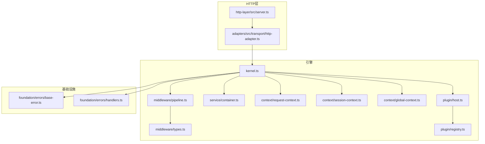
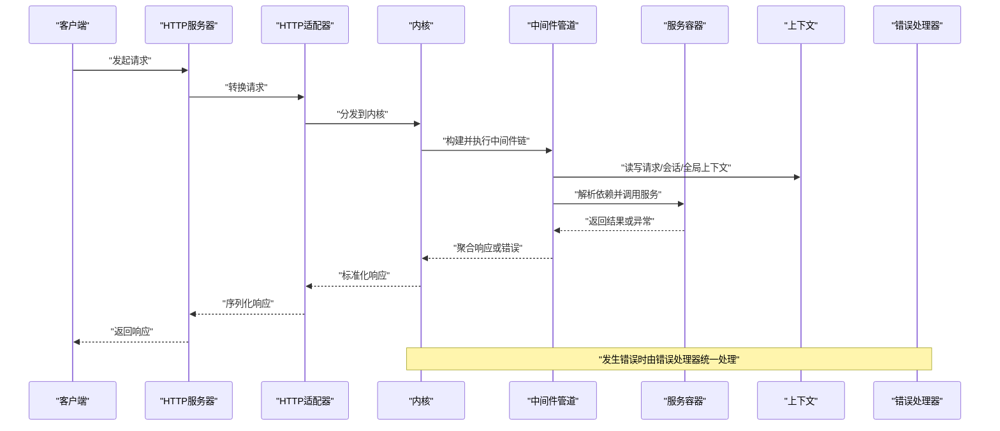
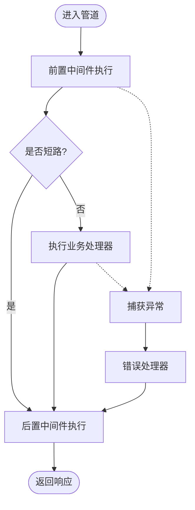
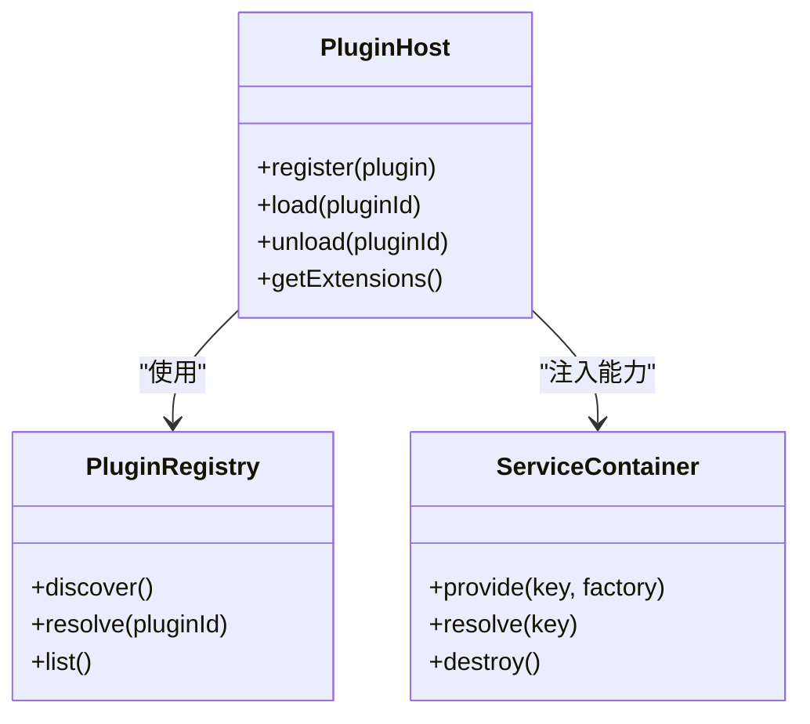
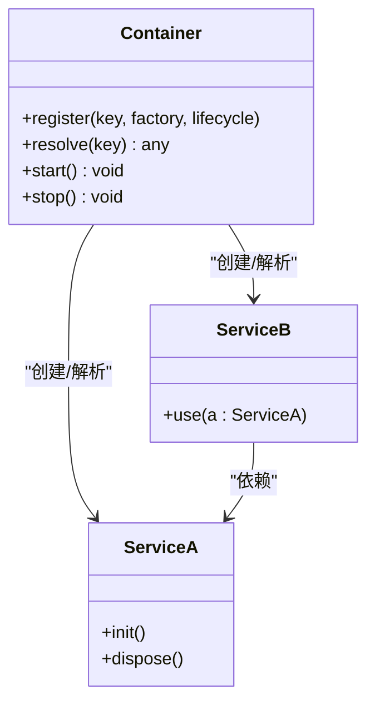
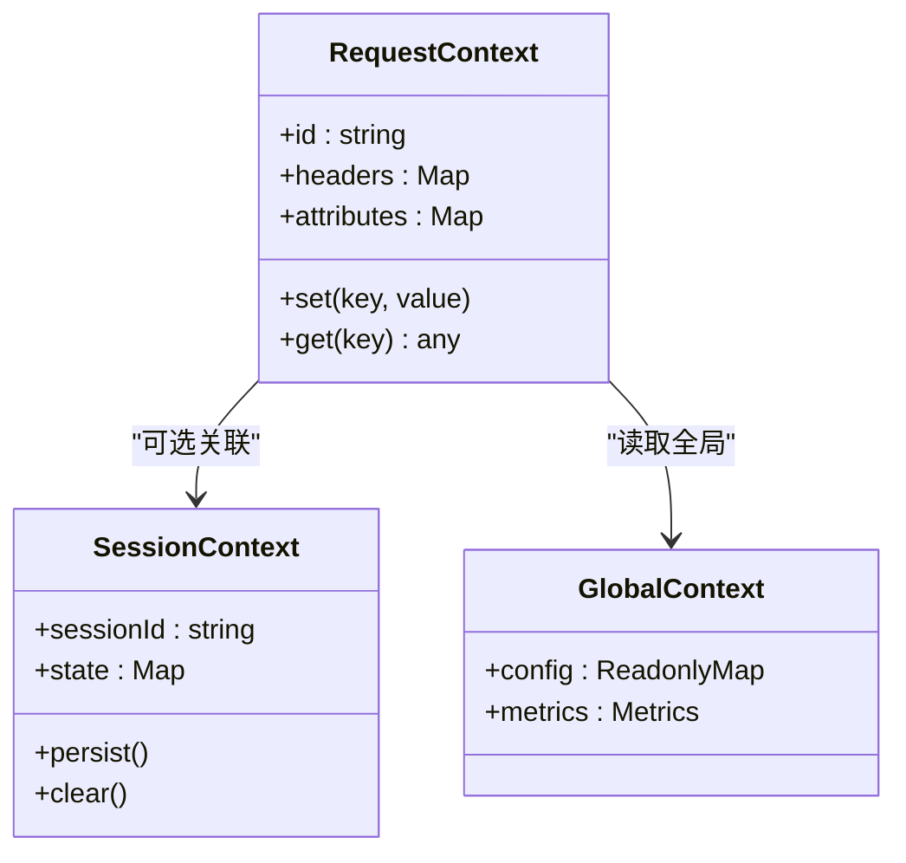
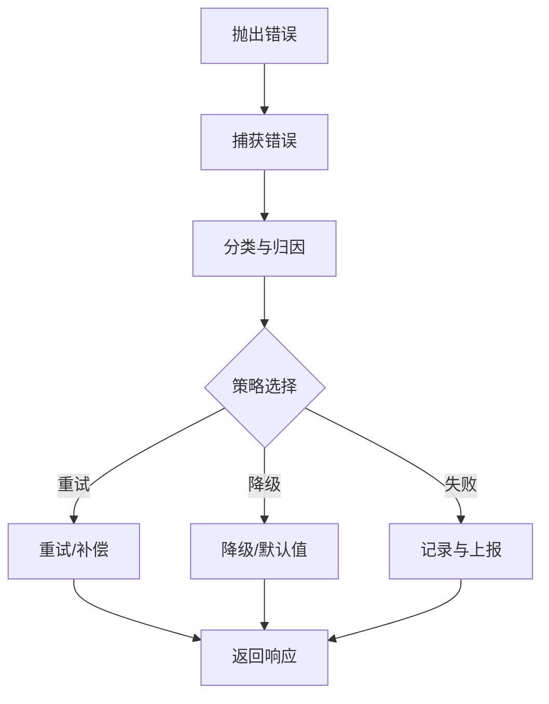
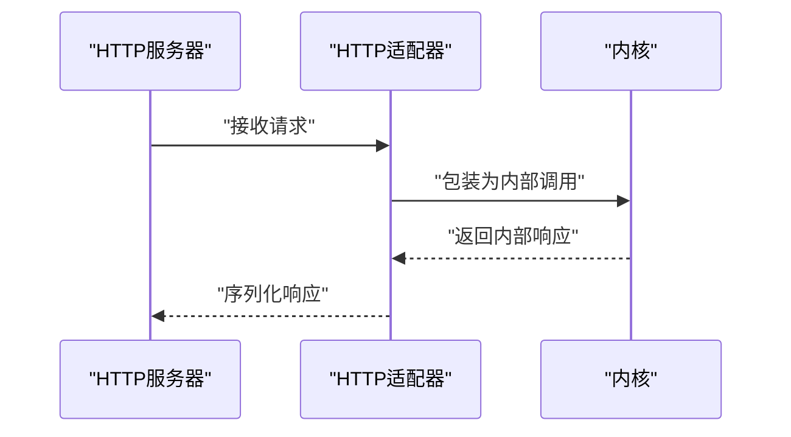
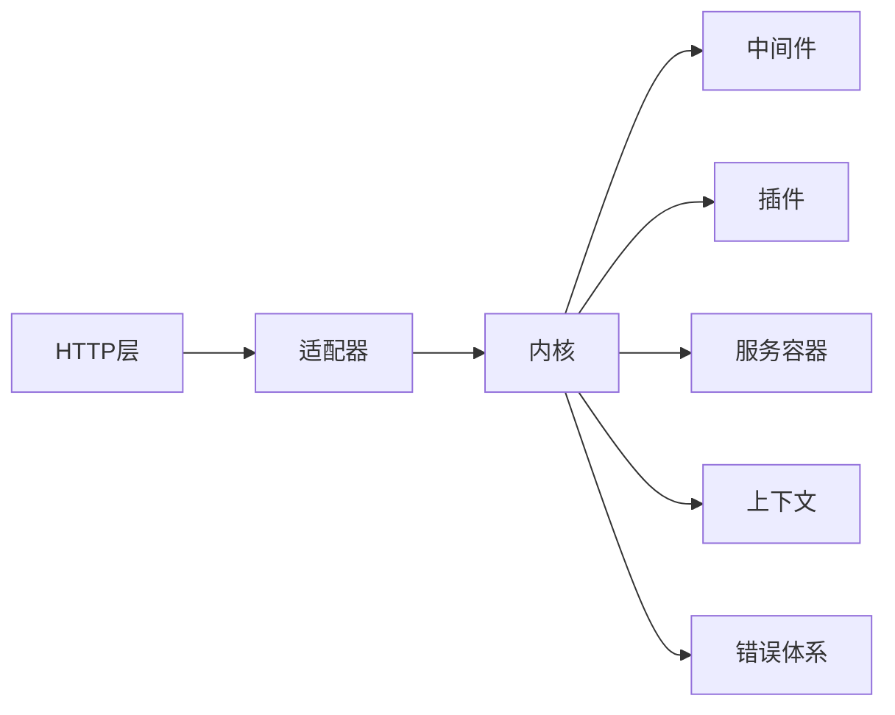

# 运行时内核

<cite>
**本文引用的文件**   
- [engine/packages/engine/src/index.ts](file://engine/packages/engine/src/index.ts)
- [engine/packages/engine/src/kernel.ts](file://engine/packages/engine/src/kernel.ts)
- [engine/packages/engine/src/middleware/pipeline.ts](file://engine/packages/engine/src/middleware/pipeline.ts)
- [engine/packages/engine/src/middleware/types.ts](file://engine/packages/engine/src/middleware/types.ts)
- [engine/packages/engine/src/plugin/host.ts](file://engine/packages/engine/src/plugin/host.ts)
- [engine/packages/engine/src/plugin/registry.ts](file://engine/packages/engine/src/plugin/registry.ts)
- [engine/packages/engine/src/service/container.ts](file://engine/packages/engine/src/service/container.ts)
- [engine/packages/engine/src/context/request-context.ts](file://engine/packages/engine/src/context/request-context.ts)
- [engine/packages/engine/src/context/session-context.ts](file://engine/packages/engine/src/context/session-context.ts)
- [engine/packages/engine/src/context/global-context.ts](file://engine/packages/engine/src/context/global-context.ts)
- [engine/packages/foundation/src/errors/base-error.ts](file://engine/packages/foundation/src/errors/base-error.ts)
- [engine/packages/foundation/src/errors/handlers.ts](file://engine/packages/foundation/src/errors/handlers.ts)
- [engine/packages/http-layer/src/server.ts](file://engine/packages/http-layer/src/server.ts)
- [engine/packages/adapters/src/transport/http-adapter.ts](file://engine/packages/adapters/src/transport/http-adapter.ts)
- [engine/tests/runtime-kernel.test.ts](file://engine/tests/runtime-kernel.test.ts)
- [engine/tests/runtime-middleware.test.ts](file://engine/tests/runtime-middleware.test.ts)
- [engine/tests/plugin-host.test.ts](file://engine/tests/plugin-host.test.ts)
</cite>

## 目录
1. [简介](#简介)
2. [项目结构](#项目结构)
3. [核心组件](#核心组件)
4. [架构总览](#架构总览)
5. [详细组件分析](#详细组件分析)
6. [依赖关系分析](#依赖关系分析)
7. [性能考虑](#性能考虑)
8. [故障排查指南](#故障排查指南)
9. [结论](#结论)
10. [附录](#附录)

## 简介
本文件面向KCoder的“运行时内核”，聚焦于中间件管道、插件机制、扩展点设计、服务管理、上下文管理，以及可测试性与性能优化实践。文档以代码级视角解释请求拦截、响应处理与错误传播路径，并给出中间件与插件开发指南，帮助读者快速理解内核运行方式与扩展方式。

## 项目结构
内核位于 engine 子仓库中，采用多包（monorepo）组织：
- engine/packages/engine：内核主体，包含中间件管道、插件宿主、服务容器、上下文等
- engine/packages/foundation：基础类型与错误体系
- engine/packages/http-layer：HTTP 层实现（服务端、路由、协议适配）
- engine/packages/adapters：传输适配器（如 HTTP 适配器）
- engine/tests：覆盖内核关键路径的单测与集成测试

图表来源
- [engine/packages/engine/src/kernel.ts](file://engine/packages/engine/src/kernel.ts)
- [engine/packages/engine/src/middleware/pipeline.ts](file://engine/packages/engine/src/middleware/pipeline.ts)
- [engine/packages/engine/src/middleware/types.ts](file://engine/packages/engine/src/middleware/types.ts)
- [engine/packages/engine/src/service/container.ts](file://engine/packages/engine/src/service/container.ts)
- [engine/packages/engine/src/context/request-context.ts](file://engine/packages/engine/src/context/request-context.ts)
- [engine/packages/engine/src/context/session-context.ts](file://engine/packages/engine/src/context/session-context.ts)
- [engine/packages/engine/src/context/global-context.ts](file://engine/packages/engine/src/context/global-context.ts)
- [engine/packages/engine/src/plugin/host.ts](file://engine/packages/engine/src/plugin/host.ts)
- [engine/packages/engine/src/plugin/registry.ts](file://engine/packages/engine/src/plugin/registry.ts)
- [engine/packages/foundation/src/errors/base-error.ts](file://engine/packages/foundation/src/errors/base-error.ts)
- [engine/packages/foundation/src/errors/handlers.ts](file://engine/packages/foundation/src/errors/handlers.ts)
- [engine/packages/http-layer/src/server.ts](file://engine/packages/http-layer/src/server.ts)
- [engine/packages/adapters/src/transport/http-adapter.ts](file://engine/packages/adapters/src/transport/http-adapter.ts)

章节来源
- [engine/packages/engine/src/index.ts](file://engine/packages/engine/src/index.ts)
- [engine/packages/engine/src/kernel.ts](file://engine/packages/engine/src/kernel.ts)

## 核心组件
- 中间件管道：定义统一的请求/响应处理链，支持前置拦截、后置处理与错误传播
- 插件系统：提供插件发现、注册、加载与卸载能力，并通过宿主暴露扩展点
- 服务容器：负责服务注册、依赖解析与生命周期控制
- 上下文管理：提供请求级、会话级与全局级上下文，贯穿中间件与业务逻辑
- 错误体系：统一错误基类与处理器，确保跨层一致的错误语义与恢复策略

章节来源
- [engine/packages/engine/src/middleware/types.ts](file://engine/packages/engine/src/middleware/types.ts)
- [engine/packages/engine/src/middleware/pipeline.ts](file://engine/packages/engine/src/middleware/pipeline.ts)
- [engine/packages/engine/src/plugin/host.ts](file://engine/packages/engine/src/plugin/host.ts)
- [engine/packages/engine/src/plugin/registry.ts](file://engine/packages/engine/src/plugin/registry.ts)
- [engine/packages/engine/src/service/container.ts](file://engine/packages/engine/src/service/container.ts)
- [engine/packages/engine/src/context/request-context.ts](file://engine/packages/engine/src/context/request-context.ts)
- [engine/packages/engine/src/context/session-context.ts](file://engine/packages/engine/src/context/session-context.ts)
- [engine/packages/engine/src/context/global-context.ts](file://engine/packages/engine/src/context/global-context.ts)
- [engine/packages/foundation/src/errors/base-error.ts](file://engine/packages/foundation/src/errors/base-error.ts)
- [engine/packages/foundation/src/errors/handlers.ts](file://engine/packages/foundation/src/errors/handlers.ts)

## 架构总览
内核通过HTTP层接收请求，交由适配器转换为内部调用，再由内核编排中间件管道执行，期间访问服务容器获取依赖，使用上下文传递状态，最终返回响应或抛出错误由错误处理器收敛。

图表来源
- [engine/packages/http-layer/src/server.ts](file://engine/packages/http-layer/src/server.ts)
- [engine/packages/adapters/src/transport/http-adapter.ts](file://engine/packages/adapters/src/transport/http-adapter.ts)
- [engine/packages/engine/src/kernel.ts](file://engine/packages/engine/src/kernel.ts)
- [engine/packages/engine/src/middleware/pipeline.ts](file://engine/packages/engine/src/middleware/pipeline.ts)
- [engine/packages/engine/src/service/container.ts](file://engine/packages/engine/src/service/container.ts)
- [engine/packages/engine/src/context/request-context.ts](file://engine/packages/engine/src/context/request-context.ts)
- [engine/packages/engine/src/context/session-context.ts](file://engine/packages/engine/src/context/session-context.ts)
- [engine/packages/engine/src/context/global-context.ts](file://engine/packages/engine/src/context/global-context.ts)
- [engine/packages/foundation/src/errors/handlers.ts](file://engine/packages/foundation/src/errors/handlers.ts)

## 详细组件分析

### 中间件管道
- 设计要点
  - 统一入口：每个中间件接收上下文与下一步函数，支持同步/异步执行
  - 双向拦截：在“进入”阶段进行鉴权、限流、日志等；在“退出”阶段进行响应增强、指标上报
  - 错误传播：上游抛出的错误沿调用栈向上传播，由顶层错误处理器捕获
  - 顺序可控：按注册顺序串联，支持条件跳过与短路返回
- 典型流程
  - 请求进入 -> 前置中间件 -> 目标处理器 -> 后置中间件 -> 响应输出
  - 任意环节抛出错误 -> 错误处理器 -> 统一响应格式

图表来源
- [engine/packages/engine/src/middleware/pipeline.ts](file://engine/packages/engine/src/middleware/pipeline.ts)
- [engine/packages/engine/src/middleware/types.ts](file://engine/packages/engine/src/middleware/types.ts)
- [engine/packages/foundation/src/errors/handlers.ts](file://engine/packages/foundation/src/errors/handlers.ts)

章节来源
- [engine/packages/engine/src/middleware/types.ts](file://engine/packages/engine/src/middleware/types.ts)
- [engine/packages/engine/src/middleware/pipeline.ts](file://engine/packages/engine/src/middleware/pipeline.ts)
- [engine/tests/runtime-middleware.test.ts](file://engine/tests/runtime-middleware.test.ts)

### 插件系统
- 设计要点
  - 插件发现：扫描约定目录或清单，收集插件元数据
  - 插件注册：将插件能力注入服务容器与扩展点
  - 插件加载：按需初始化，支持懒加载与热更新
  - 插件卸载：释放资源、清理订阅、解除依赖
- 扩展点
  - 钩子：在中间件前后、服务生命周期等位置插入自定义逻辑
  - 能力：对外暴露API、工具、命令等，供上层消费

图表来源
- [engine/packages/engine/src/plugin/host.ts](file://engine/packages/engine/src/plugin/host.ts)
- [engine/packages/engine/src/plugin/registry.ts](file://engine/packages/engine/src/plugin/registry.ts)
- [engine/packages/engine/src/service/container.ts](file://engine/packages/engine/src/service/container.ts)

章节来源
- [engine/packages/engine/src/plugin/host.ts](file://engine/packages/engine/src/plugin/host.ts)
- [engine/packages/engine/src/plugin/registry.ts](file://engine/packages/engine/src/plugin/registry.ts)
- [engine/tests/plugin-host.test.ts](file://engine/tests/plugin-host.test.ts)

### 服务管理（容器）
- 设计要点
  - 服务注册：以键值形式注册工厂或实例
  - 依赖解析：自动解析构造参数与单例/瞬态生命周期
  - 生命周期：启动、就绪、销毁回调，保证资源有序释放
- 使用建议
  - 优先注册不可变配置与服务
  - 避免循环依赖，必要时引入延迟解析

图表来源
- [engine/packages/engine/src/service/container.ts](file://engine/packages/engine/src/service/container.ts)

章节来源
- [engine/packages/engine/src/service/container.ts](file://engine/packages/engine/src/service/container.ts)

### 上下文管理
- 请求上下文：封装单次请求的输入、输出、追踪ID、权限信息等
- 会话上下文：维护会话级状态（如对话历史、临时缓存）
- 全局上下文：应用级共享配置、只读常量、全局度量
- 作用域隔离：不同请求/会话之间互不干扰，避免内存泄漏

图表来源
- [engine/packages/engine/src/context/request-context.ts](file://engine/packages/engine/src/context/request-context.ts)
- [engine/packages/engine/src/context/session-context.ts](file://engine/packages/engine/src/context/session-context.ts)
- [engine/packages/engine/src/context/global-context.ts](file://engine/packages/engine/src/context/global-context.ts)

章节来源
- [engine/packages/engine/src/context/request-context.ts](file://engine/packages/engine/src/context/request-context.ts)
- [engine/packages/engine/src/context/session-context.ts](file://engine/packages/engine/src/context/session-context.ts)
- [engine/packages/engine/src/context/global-context.ts](file://engine/packages/engine/src/context/global-context.ts)

### 错误体系与传播
- 统一错误基类：携带错误码、消息、上下文快照、堆栈信息
- 错误处理器：集中处理未知异常、降级策略、告警上报
- 传播规则：中间件与插件应向上抛出标准错误，避免吞异常

图表来源
- [engine/packages/foundation/src/errors/base-error.ts](file://engine/packages/foundation/src/errors/base-error.ts)
- [engine/packages/foundation/src/errors/handlers.ts](file://engine/packages/foundation/src/errors/handlers.ts)

章节来源
- [engine/packages/foundation/src/errors/base-error.ts](file://engine/packages/foundation/src/errors/base-error.ts)
- [engine/packages/foundation/src/errors/handlers.ts](file://engine/packages/foundation/src/errors/handlers.ts)

### HTTP层与适配器
- HTTP服务器：监听端口、路由分发、连接管理
- HTTP适配器：将外部请求转换为内核内部调用，并将内核响应序列化为HTTP响应
- 安全与限流：可在适配器或前置中间件中实现

图表来源
- [engine/packages/http-layer/src/server.ts](file://engine/packages/http-layer/src/server.ts)
- [engine/packages/adapters/src/transport/http-adapter.ts](file://engine/packages/adapters/src/transport/http-adapter.ts)

章节来源
- [engine/packages/http-layer/src/server.ts](file://engine/packages/http-layer/src/server.ts)
- [engine/packages/adapters/src/transport/http-adapter.ts](file://engine/packages/adapters/src/transport/http-adapter.ts)

## 依赖关系分析
- 松耦合：内核通过接口与容器解耦具体实现，便于替换与测试
- 低内聚：中间件、插件、服务各自职责清晰，组合灵活
- 潜在风险：需避免循环依赖与过度全局化

图表来源
- [engine/packages/http-layer/src/server.ts](file://engine/packages/http-layer/src/server.ts)
- [engine/packages/adapters/src/transport/http-adapter.ts](file://engine/packages/adapters/src/transport/http-adapter.ts)
- [engine/packages/engine/src/kernel.ts](file://engine/packages/engine/src/kernel.ts)
- [engine/packages/engine/src/middleware/pipeline.ts](file://engine/packages/engine/src/middleware/pipeline.ts)
- [engine/packages/engine/src/plugin/host.ts](file://engine/packages/engine/src/plugin/host.ts)
- [engine/packages/engine/src/service/container.ts](file://engine/packages/engine/src/service/container.ts)
- [engine/packages/engine/src/context/request-context.ts](file://engine/packages/engine/src/context/request-context.ts)
- [engine/packages/foundation/src/errors/base-error.ts](file://engine/packages/foundation/src/errors/base-error.ts)

章节来源
- [engine/packages/engine/src/kernel.ts](file://engine/packages/engine/src/kernel.ts)

## 性能考虑
- 内存管理
  - 及时释放请求/会话上下文引用，避免闭包持有大对象
  - 插件卸载时清理定时器、事件监听与缓存
- 缓存策略
  - 对只读配置与热点数据使用本地缓存，设置合理过期与失效策略
  - 区分会话级与应用级缓存，避免污染
- 并发控制
  - 限制并发度与队列长度，防止雪崩
  - 使用令牌桶/漏桶进行限流，结合熔断与退避
- I/O优化
  - 批量写入与合并响应，减少系统调用
  - 启用连接复用与压缩

[本节为通用指导，无需源码引用]

## 故障排查指南
- 常见问题定位
  - 中间件未生效：检查注册顺序与短路逻辑
  - 插件未加载：确认发现路径与清单完整性
  - 上下文丢失：核对作用域绑定与传递链路
  - 错误未捕获：确认错误类型与处理器匹配
- 调试技巧
  - 开启详细日志与追踪ID
  - 使用最小复现用例与断点
  - 借助测试套件验证边界条件

章节来源
- [engine/tests/runtime-kernel.test.ts](file://engine/tests/runtime-kernel.test.ts)
- [engine/tests/runtime-middleware.test.ts](file://engine/tests/runtime-middleware.test.ts)
- [engine/tests/plugin-host.test.ts](file://engine/tests/plugin-host.test.ts)

## 结论
KCoder运行时内核以中间件管道为核心，结合插件系统与容器化服务管理，形成高内聚、低耦合的可扩展架构。通过完善的上下文管理与错误体系，内核在保证稳定性的同时提供了丰富的扩展能力。遵循本文的性能与可测试性建议，可进一步提升系统的可靠性与可维护性。

## 附录

### 中间件开发指南
- 步骤
  - 定义中间件签名，接收上下文与下一步函数
  - 在“进入”阶段完成校验、鉴权、埋点
  - 在“退出”阶段完成响应增强、指标上报
  - 抛出标准错误以便统一处理
- 最佳实践
  - 保持幂等与无副作用
  - 避免阻塞I/O，尽量异步非阻塞
  - 明确错误语义，不要吞异常

章节来源
- [engine/packages/engine/src/middleware/types.ts](file://engine/packages/engine/src/middleware/types.ts)
- [engine/packages/engine/src/middleware/pipeline.ts](file://engine/packages/engine/src/middleware/pipeline.ts)

### 插件开发指南
- 步骤
  - 编写插件元数据与能力描述
  - 实现插件生命周期方法（初始化、运行、销毁）
  - 通过宿主注册能力，暴露扩展点
  - 编写单元测试覆盖加载/卸载路径
- 最佳实践
  - 插件间解耦，避免直接依赖
  - 资源申请与释放成对出现
  - 提供回退与降级能力

章节来源
- [engine/packages/engine/src/plugin/host.ts](file://engine/packages/engine/src/plugin/host.ts)
- [engine/packages/engine/src/plugin/registry.ts](file://engine/packages/engine/src/plugin/registry.ts)
- [engine/tests/plugin-host.test.ts](file://engine/tests/plugin-host.test.ts)

### API扩展指南
- 通过服务容器注册新服务，并在中间件或插件中按需解析
- 利用上下文传递扩展参数，避免全局污染
- 使用错误体系规范异常返回，便于前端统一处理

章节来源
- [engine/packages/engine/src/service/container.ts](file://engine/packages/engine/src/service/container.ts)
- [engine/packages/engine/src/context/request-context.ts](file://engine/packages/engine/src/context/request-context.ts)
- [engine/packages/foundation/src/errors/base-error.ts](file://engine/packages/foundation/src/errors/base-error.ts)

### 可测试性设计
- 模拟对象
  - 使用容器注入Mock服务，替换真实依赖
  - 模拟上下文与HTTP适配器，隔离外部影响
- 测试环境搭建
  - 提供轻量启动器，仅加载必要中间件与插件
  - 使用固定种子数据与时间源
- 集成测试
  - 端到端验证请求-响应链路
  - 覆盖错误路径与超时场景

章节来源
- [engine/tests/runtime-kernel.test.ts](file://engine/tests/runtime-kernel.test.ts)
- [engine/tests/runtime-middleware.test.ts](file://engine/tests/runtime-middleware.test.ts)
- [engine/tests/plugin-host.test.ts](file://engine/tests/plugin-host.test.ts)