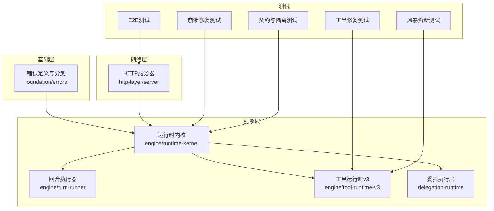
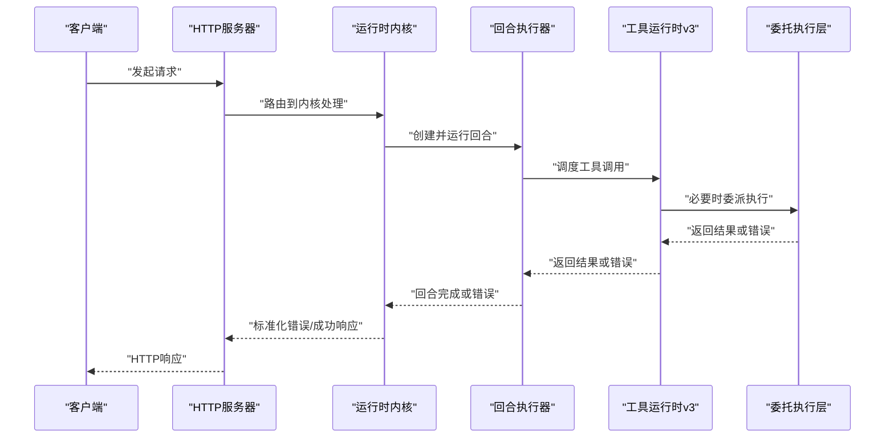
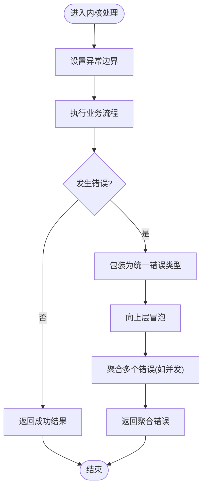
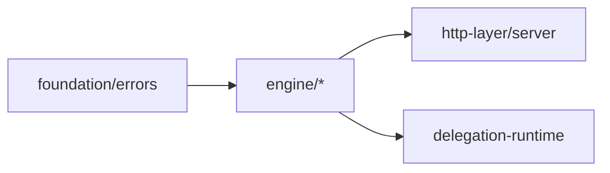

# 错误处理

<cite>
**本文引用的文件**   
- [engine/packages/foundation/src/errors/index.ts](file://engine/packages/foundation/src/errors/index.ts)
- [engine/packages/foundation/src/errors/types.ts](file://engine/packages/foundation/src/errors/types.ts)
- [engine/packages/engine/src/runtime-kernel.ts](file://engine/packages/engine/src/runtime-kernel.ts)
- [engine/packages/engine/src/turn-runner.ts](file://engine/packages/engine/src/turn-runner.ts)
- [engine/packages/engine/src/tool-runtime-v3.ts](file://engine/packages/engine/src/tool-runtime-v3.ts)
- [engine/packages/http-layer/src/server.ts](file://engine/packages/http-layer/src/server.ts)
- [engine/packages/delegation-layer/src/delegation-runtime.ts](file://engine/packages/delegation-layer/src/delegation-runtime.ts)
- [engine/tests/runtime-kernel-crash-recovery.test.ts](file://engine/tests/runtime-kernel-crash-recovery.test.ts)
- [engine/tests/tool-call-repair.test.ts](file://engine/tests/tool-call-repair.test.ts)
- [engine/tests/tool-storm-breaker.test.ts](file://engine/tests/tool-storm-breaker.test.ts)
- [engine/tests/runtime-kernel-contracts.test.ts](file://engine/tests/runtime-kernel-contracts.test.ts)
- [engine/tests/runtime-kernel-isolation.test.ts](file://engine/tests/runtime-kernel-isolation.test.ts)
- [engine/tests/runtime-kernel-e2e.test.ts](file://engine/tests/runtime-kernel-e2e.test.ts)
</cite>

## 目录
1. [简介](#简介)
2. [项目结构](#项目结构)
3. [核心组件](#核心组件)
4. [架构总览](#架构总览)
5. [详细组件分析](#详细组件分析)
6. [依赖关系分析](#依赖关系分析)
7. [性能考量](#性能考量)
8. [故障排查指南](#故障排查指南)
9. [结论](#结论)
10. [附录](#附录)

## 简介
本文件面向KCoder运行时内核的错误处理机制，系统性阐述错误分类体系、捕获与传播、恢复策略、监控记录、诊断工具以及开发与测试实践。目标是帮助开发者在复杂的多层调用链中实现一致、可观测、可恢复的错误处理方案。

## 项目结构
KCoder采用多包分层架构，错误处理相关能力主要分布在基础错误定义、运行时内核、HTTP服务层、委托执行层等位置：
- 基础错误类型与分类：foundation层提供统一错误模型与分类
- 运行时内核：负责任务编排、回合执行、工具调用、异常边界与聚合
- HTTP服务层：对外暴露API并统一错误响应格式
- 委托执行层：子代理/远程执行的错误隔离与回退
- 测试套件：覆盖崩溃恢复、风暴熔断、契约校验、端到端场景

图表来源
- [engine/packages/foundation/src/errors/index.ts](file://engine/packages/foundation/src/errors/index.ts)
- [engine/packages/engine/src/runtime-kernel.ts](file://engine/packages/engine/src/runtime-kernel.ts)
- [engine/packages/engine/src/turn-runner.ts](file://engine/packages/engine/src/turn-runner.ts)
- [engine/packages/engine/src/tool-runtime-v3.ts](file://engine/packages/engine/src/tool-runtime-v3.ts)
- [engine/packages/http-layer/src/server.ts](file://engine/packages/http-layer/src/server.ts)
- [engine/packages/delegation-layer/src/delegation-runtime.ts](file://engine/packages/delegation-layer/src/delegation-runtime.ts)
- [engine/tests/runtime-kernel-crash-recovery.test.ts](file://engine/tests/runtime-kernel-crash-recovery.test.ts)
- [engine/tests/tool-call-repair.test.ts](file://engine/tests/tool-call-repair.test.ts)
- [engine/tests/tool-storm-breaker.test.ts](file://engine/tests/tool-storm-breaker.test.ts)
- [engine/tests/runtime-kernel-contracts.test.ts](file://engine/tests/runtime-kernel-contracts.test.ts)
- [engine/tests/runtime-kernel-isolation.test.ts](file://engine/tests/runtime-kernel-isolation.test.ts)
- [engine/tests/runtime-kernel-e2e.test.ts](file://engine/tests/runtime-kernel-e2e.test.ts)

章节来源
- [engine/packages/foundation/src/errors/index.ts](file://engine/packages/foundation/src/errors/index.ts)
- [engine/packages/engine/src/runtime-kernel.ts](file://engine/packages/engine/src/runtime-kernel.ts)
- [engine/packages/engine/src/turn-runner.ts](file://engine/packages/engine/src/turn-runner.ts)
- [engine/packages/engine/src/tool-runtime-v3.ts](file://engine/packages/engine/src/tool-runtime-v3.ts)
- [engine/packages/http-layer/src/server.ts](file://engine/packages/http-layer/src/server.ts)
- [engine/packages/delegation-layer/src/delegation-runtime.ts](file://engine/packages/delegation-layer/src/delegation-runtime.ts)
- [engine/tests/runtime-kernel-crash-recovery.test.ts](file://engine/tests/runtime-kernel-crash-recovery.test.ts)
- [engine/tests/tool-call-repair.test.ts](file://engine/tests/tool-call-repair.test.ts)
- [engine/tests/tool-storm-breaker.test.ts](file://engine/tests/tool-storm-breaker.test.ts)
- [engine/tests/runtime-kernel-contracts.test.ts](file://engine/tests/runtime-kernel-contracts.test.ts)
- [engine/tests/runtime-kernel-isolation.test.ts](file://engine/tests/runtime-kernel-isolation.test.ts)
- [engine/tests/runtime-kernel-e2e.test.ts](file://engine/tests/runtime-kernel-e2e.test.ts)

## 核心组件
- 错误分类与类型
  - 业务错误：由领域逻辑产生，携带业务上下文与可恢复建议
  - 系统错误：资源不可用、权限不足、内部状态不一致等
  - 网络错误：超时、连接失败、协议不兼容、上游不可用
  - 统一包装：所有错误均通过基础错误类型进行封装，便于跨层传递与识别
- 运行时内核
  - 异常边界：在关键入口（请求进入、回合开始、工具调用）建立边界，确保未捕获异常不会导致进程崩溃
  - 错误冒泡：将底层错误向上层聚合，保留原始堆栈与上下文
  - 错误聚合：对并发或批量操作中的多个错误进行汇总，避免丢失信息
- HTTP服务层
  - 统一响应：将内核错误映射为标准HTTP错误响应，包含错误码、消息与可选的调试信息
- 委托执行层
  - 隔离与降级：子代理/远程执行失败时，按策略降级为本地执行或返回兜底结果

章节来源
- [engine/packages/foundation/src/errors/index.ts](file://engine/packages/foundation/src/errors/index.ts)
- [engine/packages/engine/src/runtime-kernel.ts](file://engine/packages/engine/src/runtime-kernel.ts)
- [engine/packages/engine/src/turn-runner.ts](file://engine/packages/engine/src/turn-runner.ts)
- [engine/packages/engine/src/tool-runtime-v3.ts](file://engine/packages/engine/src/tool-runtime-v3.ts)
- [engine/packages/http-layer/src/server.ts](file://engine/packages/http-layer/src/server.ts)
- [engine/packages/delegation-layer/src/delegation-runtime.ts](file://engine/packages/delegation-layer/src/delegation-runtime.ts)

## 架构总览
下图展示从HTTP请求到内核执行、工具调用、委托执行及错误回传的完整链路，以及错误在各层的处理与转换。

图表来源
- [engine/packages/http-layer/src/server.ts](file://engine/packages/http-layer/src/server.ts)
- [engine/packages/engine/src/runtime-kernel.ts](file://engine/packages/engine/src/runtime-kernel.ts)
- [engine/packages/engine/src/turn-runner.ts](file://engine/packages/engine/src/turn-runner.ts)
- [engine/packages/engine/src/tool-runtime-v3.ts](file://engine/packages/engine/src/tool-runtime-v3.ts)
- [engine/packages/delegation-layer/src/delegation-runtime.ts](file://engine/packages/delegation-layer/src/delegation-runtime.ts)

## 详细组件分析

### 错误分类与类型
- 设计要点
  - 统一的错误基类，支持附加元数据（如traceId、spanId、上下文键值）
  - 明确的错误类别枚举，便于上层按策略处理
  - 可序列化的错误对象，用于日志与指标上报
- 使用建议
  - 业务层抛出业务错误，携带可恢复建议
  - 基础设施层将底层异常转换为系统/网络错误
  - 外层仅消费统一错误类型，避免泄露实现细节

章节来源
- [engine/packages/foundation/src/errors/index.ts](file://engine/packages/foundation/src/errors/index.ts)
- [engine/packages/foundation/src/errors/types.ts](file://engine/packages/foundation/src/errors/types.ts)

### 运行时内核：异常边界、冒泡与聚合
- 异常边界
  - 在请求入口、回合生命周期、工具调用前后设置try/catch边界，防止未捕获异常逃逸
- 错误冒泡
  - 将错误包装为统一类型后向上传递，保留原始堆栈与上下文
- 错误聚合
  - 对并发任务或批量操作的错误进行收集，生成聚合错误对象，便于一次性反馈

图表来源
- [engine/packages/engine/src/runtime-kernel.ts](file://engine/packages/engine/src/runtime-kernel.ts)
- [engine/packages/engine/src/turn-runner.ts](file://engine/packages/engine/src/turn-runner.ts)
- [engine/packages/engine/src/tool-runtime-v3.ts](file://engine/packages/engine/src/tool-runtime-v3.ts)

章节来源
- [engine/packages/engine/src/runtime-kernel.ts](file://engine/packages/engine/src/runtime-kernel.ts)
- [engine/packages/engine/src/turn-runner.ts](file://engine/packages/engine/src/turn-runner.ts)
- [engine/packages/engine/src/tool-runtime-v3.ts](file://engine/packages/engine/src/tool-runtime-v3.ts)

### HTTP服务层：错误响应标准化
- 职责
  - 捕获内核错误，映射为标准HTTP响应体
  - 区分用户可见错误与内部调试信息
  - 记录访问日志与错误指标
- 策略
  - 业务错误返回4xx，附带错误码与简要说明
  - 系统/网络错误返回5xx，附带traceId以便追踪
  - 敏感信息脱敏，避免泄露堆栈细节

章节来源
- [engine/packages/http-layer/src/server.ts](file://engine/packages/http-layer/src/server.ts)

### 委托执行层：隔离与降级
- 隔离
  - 子代理/远程执行失败不影响主流程，错误被限制在委托边界内
- 降级
  - 根据配置选择本地执行、缓存结果或返回默认值
- 重试与熔断
  - 对瞬时性错误进行有限次重试
  - 当失败率超过阈值时触发熔断，快速失败

章节来源
- [engine/packages/delegation-layer/src/delegation-runtime.ts](file://engine/packages/delegation-layer/src/delegation-runtime.ts)

### 工具运行时v3：工具级错误处理
- 职责
  - 工具调用的参数校验、执行、结果归一化
  - 捕获工具抛出的异常并转换为统一错误类型
  - 支持工具级重试与熔断策略
- 与内核协作
  - 向内核报告工具执行状态与错误，供上层决策

章节来源
- [engine/packages/engine/src/tool-runtime-v3.ts](file://engine/packages/engine/src/tool-runtime-v3.ts)

## 依赖关系分析
- 耦合与内聚
  - foundation层提供低耦合的错误类型，被各层复用
  - engine层依赖foundation层，保持高内聚的执行与错误处理逻辑
  - http-layer与delegation-layer分别依赖engine层，形成清晰的单向依赖
- 外部集成点
  - HTTP服务作为对外接口，需保证错误响应的稳定性
  - 委托执行可能涉及外部系统，需要更强的容错与降级

图表来源
- [engine/packages/foundation/src/errors/index.ts](file://engine/packages/foundation/src/errors/index.ts)
- [engine/packages/engine/src/runtime-kernel.ts](file://engine/packages/engine/src/runtime-kernel.ts)
- [engine/packages/http-layer/src/server.ts](file://engine/packages/http-layer/src/server.ts)
- [engine/packages/delegation-layer/src/delegation-runtime.ts](file://engine/packages/delegation-layer/src/delegation-runtime.ts)

章节来源
- [engine/packages/foundation/src/errors/index.ts](file://engine/packages/foundation/src/errors/index.ts)
- [engine/packages/engine/src/runtime-kernel.ts](file://engine/packages/engine/src/runtime-kernel.ts)
- [engine/packages/http-layer/src/server.ts](file://engine/packages/http-layer/src/server.ts)
- [engine/packages/delegation-layer/src/delegation-runtime.ts](file://engine/packages/delegation-layer/src/delegation-runtime.ts)

## 性能考量
- 错误路径开销
  - 避免在热路径上频繁构造大型错误对象；仅在必要时附加上下文
- 聚合成本
  - 对大规模并发错误的聚合应使用高效数据结构，避免阻塞主流程
- 重试与熔断
  - 合理设置重试次数与退避策略，避免雪崩
  - 熔断阈值需结合业务SLA动态调整

[本节为通用指导，无需特定文件引用]

## 故障排查指南
- 日志与指标
  - 在HTTP层记录请求ID与错误摘要
  - 在工具层记录调用耗时与失败原因
  - 上报错误计数、成功率、P99延迟等指标
- 诊断工具
  - 堆栈跟踪：保留原始堆栈，但脱敏敏感字段
  - 上下文信息：附带traceId、spanId、业务键值
  - 性能分析：结合慢查询与热点路径定位瓶颈
- 常见场景
  - 崩溃恢复：验证内核在严重错误后的自恢复能力
  - 工具修复：自动修复无效工具调用或参数
  - 风暴熔断：在高失败率下快速失败保护系统

章节来源
- [engine/tests/runtime-kernel-crash-recovery.test.ts](file://engine/tests/runtime-kernel-crash-recovery.test.ts)
- [engine/tests/tool-call-repair.test.ts](file://engine/tests/tool-call-repair.test.ts)
- [engine/tests/tool-storm-breaker.test.ts](file://engine/tests/tool-storm-breaker.test.ts)
- [engine/tests/runtime-kernel-contracts.test.ts](file://engine/tests/runtime-kernel-contracts.test.ts)
- [engine/tests/runtime-kernel-isolation.test.ts](file://engine/tests/runtime-kernel-isolation.test.ts)
- [engine/tests/runtime-kernel-e2e.test.ts](file://engine/tests/runtime-kernel-e2e.test.ts)

## 结论
KCoder运行时内核通过统一错误类型、清晰的分层职责、严格的异常边界与完善的恢复策略，构建了稳定且可观测的错误处理体系。配合测试套件与诊断工具，能够在复杂场景中保障系统的可靠性与可维护性。

[本节为总结性内容，无需特定文件引用]

## 附录

### 开发指南
- 自定义错误类型
  - 继承基础错误类型，补充业务字段与序列化方法
  - 明确错误类别与可恢复性，便于上层策略处理
- 错误码规范
  - 业务错误使用4xx，系统/网络错误使用5xx
  - 错误码需具备唯一性与可读性，避免泄露实现细节
- 错误响应格式
  - 统一包含错误码、消息、traceId、可选的调试信息
  - 生产环境隐藏敏感堆栈，仅提供必要提示

[本节为通用指导，无需特定文件引用]

### 测试方法与最佳实践
- 错误模拟
  - 使用测试夹具模拟超时、连接失败、协议错误等
- 边界测试
  - 验证空输入、非法参数、极端负载下的错误行为
- 压力测试
  - 在高并发下验证错误聚合与熔断效果
- 回归测试
  - 针对崩溃恢复、工具修复、契约一致性进行持续验证

章节来源
- [engine/tests/runtime-kernel-crash-recovery.test.ts](file://engine/tests/runtime-kernel-crash-recovery.test.ts)
- [engine/tests/tool-call-repair.test.ts](file://engine/tests/tool-call-repair.test.ts)
- [engine/tests/tool-storm-breaker.test.ts](file://engine/tests/tool-storm-breaker.test.ts)
- [engine/tests/runtime-kernel-contracts.test.ts](file://engine/tests/runtime-kernel-contracts.test.ts)
- [engine/tests/runtime-kernel-isolation.test.ts](file://engine/tests/runtime-kernel-isolation.test.ts)
- [engine/tests/runtime-kernel-e2e.test.ts](file://engine/tests/runtime-kernel-e2e.test.ts)