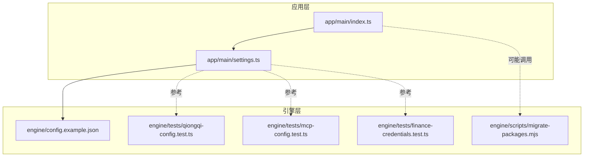
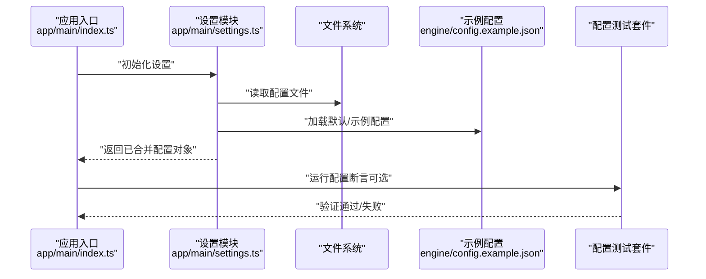
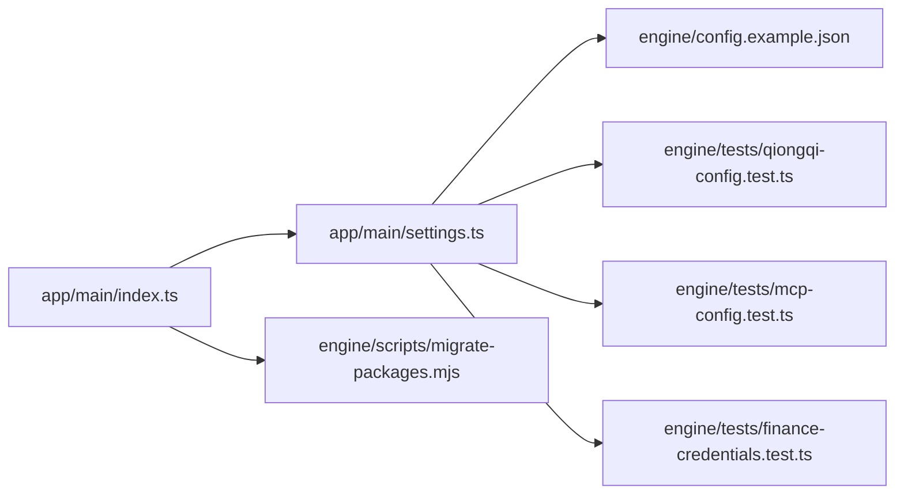

# 配置管理系统

<cite>
**本文引用的文件**   
- [engine/config.example.json](file://engine/config.example.json)
- [app/main/settings.ts](file://app/main/settings.ts)
- [app/main/index.ts](file://app/main/index.ts)
- [engine/tests/qiongqi-config.test.ts](file://engine/tests/qiongqi-config.test.ts)
- [engine/tests/mcp-config.test.ts](file://engine/tests/mcp-config.test.ts)
- [engine/tests/finance-credentials.test.ts](file://engine/tests/finance-credentials.test.ts)
- [engine/scripts/migrate-packages.mjs](file://engine/scripts/migrate-packages.mjs)
</cite>

## 目录
1. [简介](#简介)
2. [项目结构](#项目结构)
3. [核心组件](#核心组件)
4. [架构总览](#架构总览)
5. [详细组件分析](#详细组件分析)
6. [依赖关系分析](#依赖关系分析)
7. [性能考虑](#性能考虑)
8. [故障排查指南](#故障排查指南)
9. [结论](#结论)
10. [附录](#附录)

## 简介
本技术文档面向KCoder的配置管理系统，聚焦以下目标：
- 解释配置文件结构与格式（JSON规范、环境变量支持、优先级）
- 说明配置的加载机制（读取、解析、验证、合并策略）
- 阐述配置验证规则（类型检查、必填字段、自定义校验器）
- 介绍热重载能力（文件监听、增量更新、回滚）
- 明确作用域与继承（全局、项目、用户）
- 提供迁移工具使用指南（版本升级、数据转换、兼容性）
- 给出安全最佳实践（敏感信息加密、访问控制、审计日志）

## 项目结构
仓库采用多包工程组织，配置相关代码主要分布在：
- 引擎层（engine）：包含示例配置、测试用例与脚本
- 应用层（app）：主进程设置入口与初始化流程

图表来源
- [app/main/index.ts](file://app/main/index.ts)
- [app/main/settings.ts](file://app/main/settings.ts)
- [engine/config.example.json](file://engine/config.example.json)
- [engine/tests/qiongqi-config.test.ts](file://engine/tests/qiongqi-config.test.ts)
- [engine/tests/mcp-config.test.ts](file://engine/tests/mcp-config.test.ts)
- [engine/tests/finance-credentials.test.ts](file://engine/tests/finance-credentials.test.ts)
- [engine/scripts/migrate-packages.mjs](file://engine/scripts/migrate-packages.mjs)

章节来源
- [app/main/index.ts](file://app/main/index.ts)
- [app/main/settings.ts](file://app/main/settings.ts)
- [engine/config.example.json](file://engine/config.example.json)

## 核心组件
- 配置示例与契约
  - 通过示例配置定义键空间与默认值，作为配置契约的权威参考。
- 主进程设置模块
  - 负责在应用启动时加载、解析并注入配置到运行时。
- 配置测试套件
  - 覆盖关键配置项的类型、必填性、组合场景与边界条件，确保配置行为稳定可预期。
- 迁移脚本
  - 提供跨版本的数据转换与兼容处理工具链。

章节来源
- [engine/config.example.json](file://engine/config.example.json)
- [app/main/settings.ts](file://app/main/settings.ts)
- [engine/tests/qiongqi-config.test.ts](file://engine/tests/qiongqi-config.test.ts)
- [engine/tests/mcp-config.test.ts](file://engine/tests/mcp-config.test.ts)
- [engine/tests/finance-credentials.test.ts](file://engine/tests/finance-credentials.test.ts)
- [engine/scripts/migrate-packages.mjs](file://engine/scripts/migrate-packages.mjs)

## 架构总览
下图展示了从应用启动到配置生效的关键路径，以及各组件之间的交互关系。

图表来源
- [app/main/index.ts](file://app/main/index.ts)
- [app/main/settings.ts](file://app/main/settings.ts)
- [engine/config.example.json](file://engine/config.example.json)
- [engine/tests/qiongqi-config.test.ts](file://engine/tests/qiongqi-config.test.ts)
- [engine/tests/mcp-config.test.ts](file://engine/tests/mcp-config.test.ts)
- [engine/tests/finance-credentials.test.ts](file://engine/tests/finance-credentials.test.ts)

## 详细组件分析

### 配置示例与契约（engine/config.example.json）
- 角色定位
  - 作为配置键空间的权威示例，用于指导用户编写配置文件。
- 建议内容
  - 包含常用键名、数据类型、默认值与注释，便于理解与对照。
- 使用方式
  - 复制为实际配置文件后按需修改；未显式设置的键将回退至默认值或环境值。

章节来源
- [engine/config.example.json](file://engine/config.example.json)

### 主进程设置模块（app/main/settings.ts）
- 职责
  - 负责配置文件的读取、解析、校验与合并，并将最终配置暴露给应用其他模块。
- 典型流程
  - 读取用户配置与示例配置
  - 合并策略：示例配置为基线，用户配置覆盖同名键
  - 类型与必填性校验
  - 将配置注入到运行时上下文
- 错误处理
  - 对缺失文件、非法JSON、类型不匹配等异常进行捕获并给出清晰提示

章节来源
- [app/main/settings.ts](file://app/main/settings.ts)

### 应用入口与设置集成（app/main/index.ts）
- 职责
  - 在应用启动阶段调用设置模块，完成配置加载与初始化。
- 关键点
  - 若配置加载失败，应中止启动并输出诊断信息，避免以不完整配置运行。

章节来源
- [app/main/index.ts](file://app/main/index.ts)

### 配置测试套件（qiongqi-config、mcp-config、finance-credentials）
- qiongqi-config.test.ts
  - 覆盖核心配置项的加载与合并逻辑，验证键存在性与类型正确性。
- mcp-config.test.ts
  - 针对MCP相关配置的结构与约束进行测试，确保协议相关字段完整。
- finance-credentials.test.ts
  - 针对敏感凭据类配置进行保护性测试，如不可打印、最小权限等。

章节来源
- [engine/tests/qiongqi-config.test.ts](file://engine/tests/qiongqi-config.test.ts)
- [engine/tests/mcp-config.test.ts](file://engine/tests/mcp-config.test.ts)
- [engine/tests/finance-credentials.test.ts](file://engine/tests/finance-credentials.test.ts)

### 迁移脚本（engine/scripts/migrate-packages.mjs）
- 职责
  - 提供跨版本的数据转换与兼容处理，辅助用户平滑升级。
- 常见能力
  - 读取旧版配置/数据
  - 执行映射与转换规则
  - 写入新版格式并保留必要元数据
- 使用建议
  - 在升级前备份数据；按顺序执行迁移脚本；完成后运行配置测试套件验证。

章节来源
- [engine/scripts/migrate-packages.mjs](file://engine/scripts/migrate-packages.mjs)

## 依赖关系分析
- 组件耦合
  - 应用入口依赖设置模块；设置模块依赖文件系统与示例配置；测试套件独立于运行时但复用配置契约。
- 外部依赖
  - 文件系统I/O、JSON解析库、可能的环境变量读取API。
- 潜在风险
  - 循环依赖应避免；I/O错误需统一处理；配置变更需具备幂等性。

图表来源
- [app/main/index.ts](file://app/main/index.ts)
- [app/main/settings.ts](file://app/main/settings.ts)
- [engine/config.example.json](file://engine/config.example.json)
- [engine/tests/qiongqi-config.test.ts](file://engine/tests/qiongqi-config.test.ts)
- [engine/tests/mcp-config.test.ts](file://engine/tests/mcp-config.test.ts)
- [engine/tests/finance-credentials.test.ts](file://engine/tests/finance-credentials.test.ts)
- [engine/scripts/migrate-packages.mjs](file://engine/scripts/migrate-packages.mjs)

## 性能考虑
- 配置加载
  - 仅在启动时加载一次；避免在热路径中重复解析。
- 合并策略
  - 优先使用浅合并减少深拷贝开销；必要时对大对象做惰性求值。
- I/O优化
  - 缓存示例配置与默认值；对频繁读取的文件使用只读句柄。
- 校验成本
  - 将昂贵校验延迟到首次访问或后台任务执行。

## 故障排查指南
- 常见问题
  - JSON语法错误：检查括号、逗号、引号与转义字符。
  - 类型不匹配：确认键值类型与示例一致。
  - 必填字段缺失：对照示例配置补齐必需键。
  - 权限问题：确保配置文件可读，路径合法。
- 定位步骤
  - 查看应用启动日志中的配置加载错误堆栈
  - 使用测试套件逐项验证配置项
  - 逐步缩小差异范围，对比示例配置
- 恢复策略
  - 回滚到上一个已知可用的配置快照
  - 使用迁移脚本修复格式不一致问题

章节来源
- [engine/tests/qiongqi-config.test.ts](file://engine/tests/qiongqi-config.test.ts)
- [engine/tests/mcp-config.test.ts](file://engine/tests/mcp-config.test.ts)
- [engine/tests/finance-credentials.test.ts](file://engine/tests/finance-credentials.test.ts)

## 结论
KCoder的配置管理系统以示例配置为契约中心，结合主进程设置模块实现稳健的加载、校验与合并流程。通过完善的测试套件与迁移脚本，系统在易用性、稳定性与可演进性方面取得良好平衡。建议在团队内推广示例配置的使用，并在升级过程中严格遵循迁移流程。

## 附录

### 配置文件结构与格式
- 文件格式
  - 推荐使用JSON格式，保持键名语义化与层级清晰。
- 环境变量支持
  - 可在配置中引用环境变量占位符，由加载器在解析阶段替换。
- 优先级
  - 默认/示例配置 < 用户配置 < 环境变量（具体以实现为准）

章节来源
- [engine/config.example.json](file://engine/config.example.json)
- [app/main/settings.ts](file://app/main/settings.ts)

### 加载机制
- 读取
  - 从指定路径读取用户配置文件；若不存在则回退到示例配置。
- 解析
  - 将文本解析为结构化对象；对引用环境变量的占位符进行展开。
- 验证
  - 执行类型检查、必填字段校验与业务规则校验。
- 合并
  - 以示例配置为基线，逐层覆盖用户配置；环境变量具有最高优先级。

章节来源
- [app/main/settings.ts](file://app/main/settings.ts)

### 验证规则
- 类型检查
  - 字符串、数字、布尔、数组、对象等基础类型校验。
- 必填字段
  - 对关键字段进行非空与存在性校验。
- 自定义校验器
  - 允许注册业务特定的校验函数，扩展通用校验能力。

章节来源
- [engine/tests/qiongqi-config.test.ts](file://engine/tests/qiongqi-config.test.ts)
- [engine/tests/mcp-config.test.ts](file://engine/tests/mcp-config.test.ts)
- [engine/tests/finance-credentials.test.ts](file://engine/tests/finance-credentials.test.ts)

### 热重载
- 文件监听
  - 监控配置文件变化事件，触发增量更新。
- 增量更新
  - 仅重新计算受影响的部分，降低重启成本。
- 配置回滚
  - 在更新失败时自动回滚到上一版本，保证服务可用。

章节来源
- [app/main/settings.ts](file://app/main/settings.ts)

### 作用域与继承
- 全局配置
  - 适用于所有项目与用户的公共设置。
- 项目配置
  - 针对特定项目的个性化设置，覆盖全局配置。
- 用户配置
  - 个人偏好与密钥管理，覆盖项目与全局配置。
- 继承机制
  - 自顶向下覆盖，低优先级配置作为高优先级配置的默认值。

章节来源
- [engine/config.example.json](file://engine/config.example.json)
- [app/main/settings.ts](file://app/main/settings.ts)

### 迁移工具使用指南
- 版本升级
  - 先备份当前配置与数据，再执行迁移脚本。
- 数据转换
  - 根据新旧版本差异，自动映射字段与结构。
- 兼容性处理
  - 保留必要元数据，确保向后兼容与可追溯。

章节来源
- [engine/scripts/migrate-packages.mjs](file://engine/scripts/migrate-packages.mjs)

### 安全最佳实践
- 敏感信息加密
  - 对密钥与令牌进行加密存储，避免明文落盘。
- 访问控制
  - 限制配置文件读写权限，最小化访问面。
- 审计日志
  - 记录配置变更与访问行为，便于追踪与复盘。

章节来源
- [engine/tests/finance-credentials.test.ts](file://engine/tests/finance-credentials.test.ts)