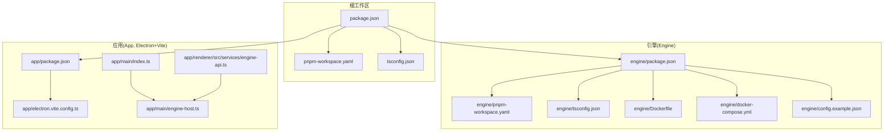
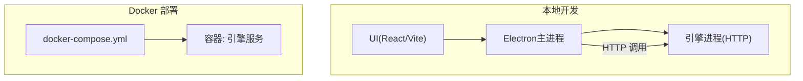
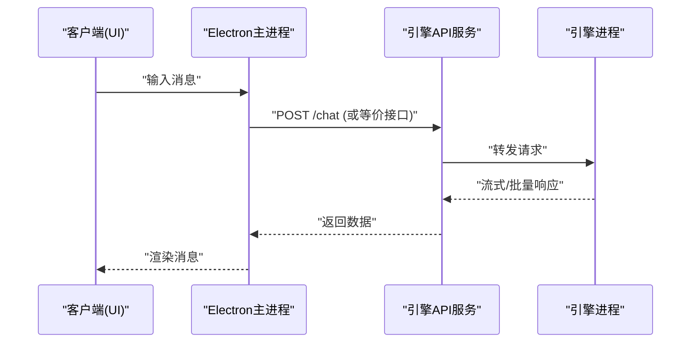
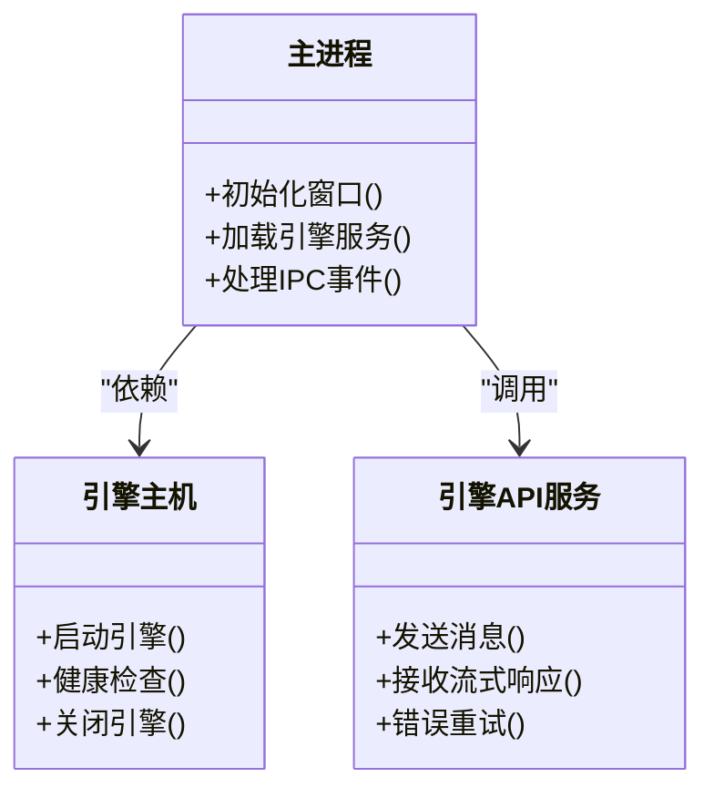
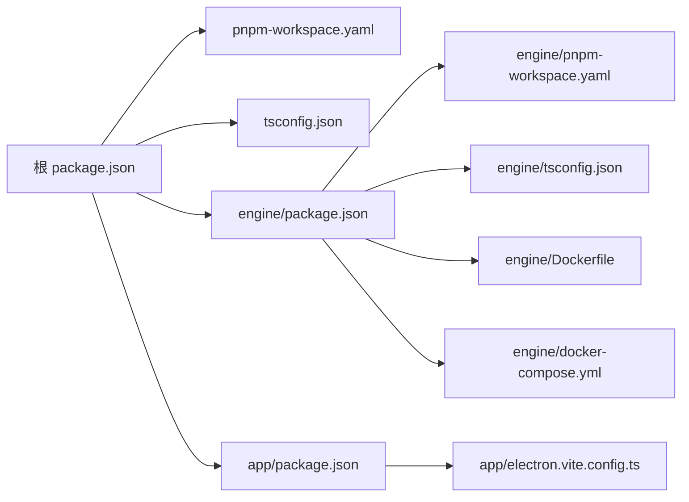

# 快速开始

<cite>
**本文引用的文件**   
- [package.json](file://package.json)
- [pnpm-workspace.yaml](file://pnpm-workspace.yaml)
- [tsconfig.json](file://tsconfig.json)
- [engine/package.json](file://engine/package.json)
- [engine/pnpm-workspace.yaml](file://engine/pnpm-workspace.yaml)
- [engine/tsconfig.json](file://engine/tsconfig.json)
- [engine/Dockerfile](file://engine/Dockerfile)
- [engine/docker-compose.yml](file://engine/docker-compose.yml)
- [engine/config.example.json](file://engine/config.example.json)
- [app/package.json](file://app/package.json)
- [app/electron.vite.config.ts](file://app/electron.vite.config.ts)
- [app/main/index.ts](file://app/main/index.ts)
- [app/main/engine-host.ts](file://app/main/engine-host.ts)
- [app/renderer/src/services/engine-api.ts](file://app/renderer/src/services/engine-api.ts)
</cite>

## 目录
1. [简介](#简介)
2. [项目结构](#项目结构)
3. [核心组件](#核心组件)
4. [架构总览](#架构总览)
5. [详细组件分析](#详细组件分析)
6. [依赖关系分析](#依赖关系分析)
7. [性能与资源建议](#性能与资源建议)
8. [故障排除指南](#故障排除指南)
9. [结论](#结论)
10. [附录](#附录)

## 简介
本指南面向首次接触 KCoder 的用户，目标是在 30 分钟内完成本地开发环境搭建并成功运行第一个 AI 对话。文档涵盖：
- 环境要求（Node.js、操作系统）
- 分步骤安装与启动
- 引擎配置与环境变量
- Docker 快速部署
- 常见问题排查
- 验证安装成功的测试用例与预期输出

## 项目结构
KCoder 采用多包工作区（Monorepo），包含前端桌面应用（Electron + Vite + React）与后端推理/编排引擎（TypeScript 多包）。顶层与 engine/app 子目录均提供 package.json 与工作区配置，便于统一安装与构建。

图表来源
- [package.json:1-200](file://package.json#L1-L200)
- [pnpm-workspace.yaml:1-200](file://pnpm-workspace.yaml#L1-L200)
- [tsconfig.json:1-200](file://tsconfig.json#L1-L200)
- [engine/package.json:1-200](file://engine/package.json#L1-L200)
- [engine/pnpm-workspace.yaml:1-200](file://engine/pnpm-workspace.yaml#L1-L200)
- [engine/tsconfig.json:1-200](file://engine/tsconfig.json#L1-L200)
- [engine/Dockerfile:1-200](file://engine/Dockerfile#L1-L200)
- [engine/docker-compose.yml:1-200](file://engine/docker-compose.yml#L1-200)
- [engine/config.example.json:1-200](file://engine/config.example.json#L1-200)
- [app/package.json:1-200](file://app/package.json#L1-200)
- [app/electron.vite.config.ts:1-200](file://app/electron.vite.config.ts#L1-200)
- [app/main/index.ts:1-200](file://app/main/index.ts#L1-200)
- [app/main/engine-host.ts:1-200](file://app/main/engine-host.ts#L1-200)
- [app/renderer/src/services/engine-api.ts:1-200](file://app/renderer/src/services/engine-api.ts#L1-200)

章节来源
- [package.json:1-200](file://package.json#L1-L200)
- [pnpm-workspace.yaml:1-200](file://pnpm-workspace.yaml#L1-L200)
- [tsconfig.json:1-200](file://tsconfig.json#L1-L200)
- [engine/package.json:1-200](file://engine/package.json#L1-L200)
- [engine/pnpm-workspace.yaml:1-200](file://engine/pnpm-workspace.yaml#L1-L200)
- [engine/tsconfig.json:1-200](file://engine/tsconfig.json#L1-L200)
- [app/package.json:1-200](file://app/package.json#L1-L200)
- [app/electron.vite.config.ts:1-200](file://app/electron.vite.config.ts#L1-L200)
- [app/main/index.ts:1-200](file://app/main/index.ts#L1-L200)
- [app/main/engine-host.ts:1-200](file://app/main/engine-host.ts#L1-L200)
- [app/renderer/src/services/engine-api.ts:1-200](file://app/renderer/src/services/engine-api.ts#L1-L200)

## 核心组件
- 引擎（Engine）
  - 提供模型调用、工具执行、会话与任务编排等能力，支持通过 HTTP 接口对外暴露。
  - 关键入口与脚本位于 engine 目录，包含构建、迁移、Docker 相关配置。
- 应用（App）
  - 基于 Electron + Vite + React 的桌面客户端，负责 UI 渲染与用户交互。
  - 通过内部服务与引擎通信，发起聊天请求并展示结果。

章节来源
- [engine/package.json:1-200](file://engine/package.json#L1-L200)
- [app/package.json:1-200](file://app/package.json#L1-L200)
- [app/main/index.ts:1-200](file://app/main/index.ts#L1-L200)
- [app/main/engine-host.ts:1-200](file://app/main/engine-host.ts#L1-L200)
- [app/renderer/src/services/engine-api.ts:1-200](file://app/renderer/src/services/engine-api.ts#L1-L200)

## 架构总览
下图展示了“应用 → 引擎”的运行时交互路径以及 Docker 部署时的进程关系。

图表来源
- [app/main/index.ts:1-200](file://app/main/index.ts#L1-L200)
- [app/main/engine-host.ts:1-200](file://app/main/engine-host.ts#L1-L200)
- [app/renderer/src/services/engine-api.ts:1-200](file://app/renderer/src/services/engine-api.ts#L1-L200)
- [engine/docker-compose.yml:1-200](file://engine/docker-compose.yml#L1-L200)
- [engine/Dockerfile:1-200](file://engine/Dockerfile#L1-L200)

## 详细组件分析

### 引擎（Engine）
- 职责
  - 提供模型路由、工具执行、会话状态管理、持久化与可观测性。
  - 通过 HTTP 接口供客户端调用。
- 关键文件
  - 构建与脚本：scripts/*
  - 配置示例：config.example.json
  - 容器化：Dockerfile、docker-compose.yml
- 典型流程（以一次对话为例）
  - 客户端发送消息到引擎 HTTP 接口
  - 引擎解析上下文、选择模型/工具、执行并返回增量结果
  - 客户端渲染流式响应

图表来源
- [app/renderer/src/services/engine-api.ts:1-200](file://app/renderer/src/services/engine-api.ts#L1-L200)
- [app/main/engine-host.ts:1-200](file://app/main/engine-host.ts#L1-L200)
- [engine/docker-compose.yml:1-200](file://engine/docker-compose.yml#L1-L200)

章节来源
- [engine/package.json:1-200](file://engine/package.json#L1-L200)
- [engine/config.example.json:1-200](file://engine/config.example.json#L1-L200)
- [engine/Dockerfile:1-200](file://engine/Dockerfile#L1-L200)
- [engine/docker-compose.yml:1-200](file://engine/docker-compose.yml#L1-L200)
- [app/renderer/src/services/engine-api.ts:1-200](file://app/renderer/src/services/engine-api.ts#L1-L200)
- [app/main/engine-host.ts:1-200](file://app/main/engine-host.ts#L1-L200)

### 应用（App）
- 职责
  - 提供聊天界面、设置面板、状态栏等 UI 组件。
  - 通过 Electron 主进程桥接引擎服务。
- 关键文件
  - 入口与窗口管理：app/main/index.ts
  - 引擎连接与生命周期：app/main/engine-host.ts
  - 前端 API 封装：app/renderer/src/services/engine-api.ts
  - 构建配置：app/electron.vite.config.ts

图表来源
- [app/main/index.ts:1-200](file://app/main/index.ts#L1-L200)
- [app/main/engine-host.ts:1-200](file://app/main/engine-host.ts#L1-L200)
- [app/renderer/src/services/engine-api.ts:1-200](file://app/renderer/src/services/engine-api.ts#L1-L200)

章节来源
- [app/main/index.ts:1-200](file://app/main/index.ts#L1-L200)
- [app/main/engine-host.ts:1-200](file://app/main/engine-host.ts#L1-L200)
- [app/renderer/src/services/engine-api.ts:1-200](file://app/renderer/src/services/engine-api.ts#L1-L200)
- [app/electron.vite.config.ts:1-200](file://app/electron.vite.config.ts#L1-L200)

## 依赖关系分析
- 顶层与子模块均使用 pnpm 工作区，便于统一安装与版本管理。
- TypeScript 配置在根与子模块分别定义，保证编译选项一致。
- 引擎提供 Dockerfile 与 docker-compose.yml，便于容器化部署。

图表来源
- [package.json:1-200](file://package.json#L1-L200)
- [pnpm-workspace.yaml:1-200](file://pnpm-workspace.yaml#L1-L200)
- [tsconfig.json:1-200](file://tsconfig.json#L1-L200)
- [engine/package.json:1-200](file://engine/package.json#L1-L200)
- [engine/pnpm-workspace.yaml:1-200](file://engine/pnpm-workspace.yaml#L1-L200)
- [engine/tsconfig.json:1-200](file://engine/tsconfig.json#L1-L200)
- [engine/Dockerfile:1-200](file://engine/Dockerfile#L1-L200)
- [engine/docker-compose.yml:1-200](file://engine/docker-compose.yml#L1-L200)
- [app/package.json:1-200](file://app/package.json#L1-L200)
- [app/electron.vite.config.ts:1-200](file://app/electron.vite.config.ts#L1-L200)

章节来源
- [package.json:1-200](file://package.json#L1-L200)
- [pnpm-workspace.yaml:1-200](file://pnpm-workspace.yaml#L1-L200)
- [tsconfig.json:1-200](file://tsconfig.json#L1-L200)
- [engine/package.json:1-200](file://engine/package.json#L1-L200)
- [engine/pnpm-workspace.yaml:1-200](file://engine/pnpm-workspace.yaml#L1-L200)
- [engine/tsconfig.json:1-200](file://engine/tsconfig.json#L1-L200)
- [engine/Dockerfile:1-200](file://engine/Dockerfile#L1-L200)
- [engine/docker-compose.yml:1-200](file://engine/docker-compose.yml#L1-L200)
- [app/package.json:1-200](file://app/package.json#L1-L200)
- [app/electron.vite.config.ts:1-200](file://app/electron.vite.config.ts#L1-L200)

## 性能与资源建议
- 内存与CPU
  - 建议在具备至少 8GB 内存的机器上进行开发与调试；若启用本地模型或复杂工具链，建议 16GB 或以上。
- 磁盘空间
  - 安装依赖与构建产物会占用一定空间，预留 5~10GB 较为稳妥。
- 网络
  - 首次拉取依赖可能较慢，建议使用国内镜像源或代理。
- 并发与超时
  - 引擎默认超时与重试策略可在配置中调整，避免长耗时任务阻塞。

[本节为通用指导，不直接分析具体文件]

## 故障排除指南
- Node.js 版本不匹配
  - 现象：安装依赖时报错或构建失败。
  - 解决：使用与仓库一致的 Node.js 版本（参考 package.json 中的 engines 字段）。
- pnpm 未安装或版本过低
  - 现象：无法识别 workspace 或命令不可用。
  - 解决：安装最新稳定版 pnpm，并确保 PATH 正确。
- 端口冲突
  - 现象：引擎或应用启动失败，提示端口被占用。
  - 解决：修改引擎监听端口或停止占用该端口的进程。
- 环境变量缺失
  - 现象：引擎无法连接外部模型或服务。
  - 解决：根据 config.example.json 与 README 说明，补齐必要的环境变量。
- Docker 权限问题
  - 现象：无法创建容器或挂载卷。
  - 解决：确认当前用户具有 Docker 权限，必要时使用 sudo 或以管理员身份运行。
- 网络代理与证书
  - 现象：下载依赖或访问外部 API 失败。
  - 解决：配置代理与信任证书，确保能访问所需域名。

章节来源
- [package.json:1-200](file://package.json#L1-L200)
- [engine/config.example.json:1-200](file://engine/config.example.json#L1-L200)
- [engine/docker-compose.yml:1-200](file://engine/docker-compose.yml#L1-L200)

## 结论
按照本指南的步骤，您可以在 30 分钟内完成 KCoder 的本地开发环境搭建并运行首个 AI 对话。如需在生产环境部署，请参考 Docker 方案与配置项进行适配。

[本节为总结性内容，不直接分析具体文件]

## 附录

### 环境要求
- 操作系统
  - Windows 10/11、macOS 10.15+、主流 Linux 发行版（Ubuntu/CentOS/RHEL 等）
- Node.js
  - 请使用与 package.json 中 engines 字段一致的版本
- pnpm
  - 推荐使用 v8 及以上版本
- Docker（可选）
  - 用于引擎容器化部署

章节来源
- [package.json:1-200](file://package.json#L1-L200)

### 安装与运行（本地开发）
- 前置准备
  - 安装 Node.js（版本见 package.json engines）
  - 安装 pnpm
- 克隆仓库
  - git clone <仓库地址>
  - cd KCoder
- 安装依赖
  - pnpm install
- 构建（可选）
  - pnpm build
- 启动引擎
  - 进入 engine 目录
  - 根据 engine/config.example.json 准备配置文件与环境变量
  - 启动引擎服务（例如：pnpm dev 或 pnpm start，具体命令以 engine/package.json scripts 为准）
- 启动应用
  - 进入 app 目录
  - 启动开发服务器（例如：pnpm dev 或 pnpm electron:dev，具体命令以 app/package.json scripts 为准）
- 验证
  - 打开应用，发送一条消息，观察是否收到回复

章节来源
- [package.json:1-200](file://package.json#L1-L200)
- [engine/package.json:1-200](file://engine/package.json#L1-L200)
- [app/package.json:1-200](file://app/package.json#L1-L200)
- [engine/config.example.json:1-200](file://engine/config.example.json#L1-L200)

### 引擎配置与环境变量
- 配置文件
  - 参考 engine/config.example.json，复制为实际配置文件并按需修改
- 环境变量
  - 常见变量包括：模型提供商密钥、引擎监听端口、日志级别、存储路径等
  - 可通过 .env 文件或系统环境变量注入
- 重要参数
  - 端口：引擎对外暴露的 HTTP 端口
  - 模型：选择的模型提供方与模型名称
  - 工具：启用的内置或自定义工具列表
  - 存储：会话与任务持久化路径

章节来源
- [engine/config.example.json:1-200](file://engine/config.example.json#L1-L200)

### Docker 快速部署
- 构建镜像
  - 在 engine 目录下执行构建命令（参考 engine/Dockerfile）
- 启动服务
  - 使用 docker-compose up 启动引擎服务
- 访问接口
  - 浏览器或客户端访问 http://localhost:<端口>/health 或等价健康检查接口
- 环境变量
  - 通过 docker-compose.yml 或 .env 文件注入

章节来源
- [engine/Dockerfile:1-200](file://engine/Dockerfile#L1-L200)
- [engine/docker-compose.yml:1-200](file://engine/docker-compose.yml#L1-L200)

### 验证安装成功的测试用例与预期输出
- 健康检查
  - 请求引擎健康检查接口，期望返回 200 及健康状态
- 简单对话
  - 通过应用发送一条简短消息，期望在 UI 中看到回复文本
- 错误场景
  - 断网或模型密钥无效时，期望返回明确的错误信息而非崩溃

章节来源
- [app/renderer/src/services/engine-api.ts:1-200](file://app/renderer/src/services/engine-api.ts#L1-L200)
- [engine/docker-compose.yml:1-200](file://engine/docker-compose.yml#L1-L200)