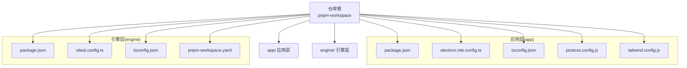
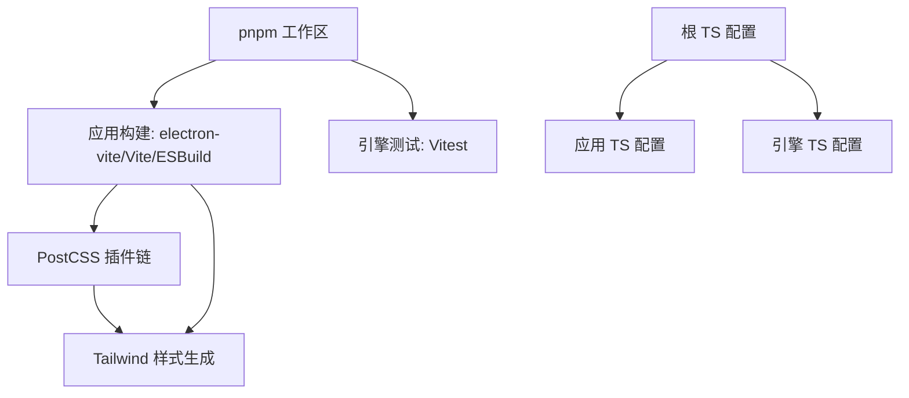
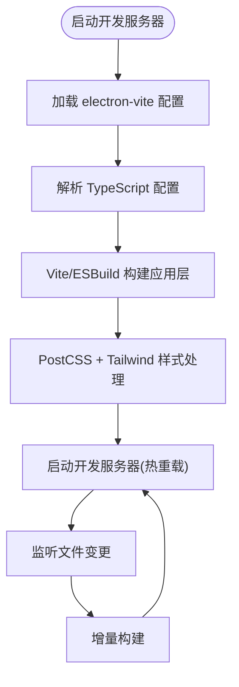
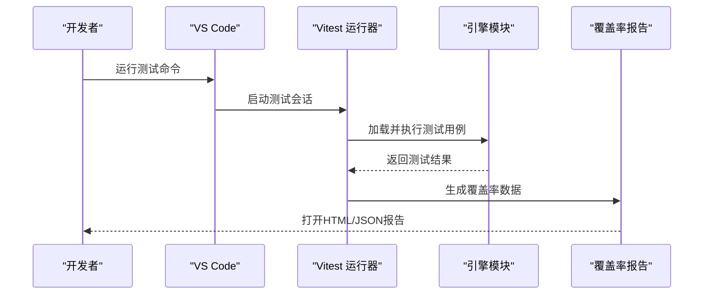
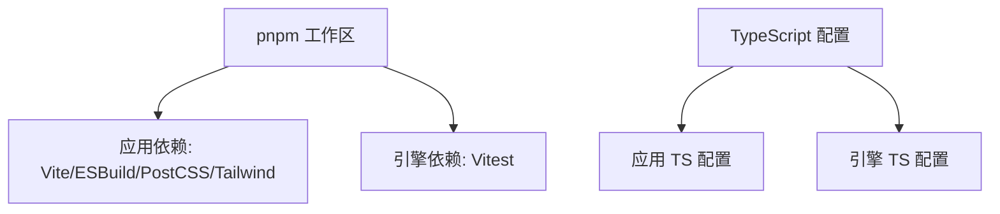

# 开发工具链

<cite>
**本文引用的文件**   
- [package.json](file://package.json)
- [pnpm-workspace.yaml](file://pnpm-workspace.yaml)
- [tsconfig.json](file://tsconfig.json)
- [app/package.json](file://app/package.json)
- [app/electron.vite.config.ts](file://app/electron.vite.config.ts)
- [app/tsconfig.json](file://app/tsconfig.json)
- [app/postcss.config.js](file://app/postcss.config.js)
- [app/tailwind.config.js](file://app/tailwind.config.js)
- [engine/package.json](file://engine/package.json)
- [engine/vitest.config.ts](file://engine/vitest.config.ts)
- [engine/pnpm-workspace.yaml](file://engine/pnpm-workspace.yaml)
- [engine/tsconfig.json](file://engine/tsconfig.json)
</cite>

## 目录
1. [简介](#简介)
2. [项目结构](#项目结构)
3. [核心组件](#核心组件)
4. [架构总览](#架构总览)
5. [详细组件分析](#详细组件分析)
6. [依赖分析](#依赖分析)
7. [性能考虑](#性能考虑)
8. [故障排查指南](#故障排查指南)
9. [结论](#结论)
10. [附录](#附录)

## 简介
本指南面向KCoder扩展开发者，提供从IDE配置、环境搭建、构建与测试到代码质量与调试的完整工具链说明。仓库采用多包工作区（pnpm workspace），包含Electron应用层（app）与引擎层（engine）。文档将结合现有配置文件，给出可操作的步骤与最佳实践，帮助快速建立高效、稳定的本地开发体验。

## 项目结构
仓库根目录为顶层工作区，包含：
- app：基于Electron + Vite的前端渲染进程与主进程工程，使用TypeScript、TailwindCSS、PostCSS等。
- engine：引擎子工作区，包含大量测试与脚本，使用Vitest进行单元测试。

图表来源
- [pnpm-workspace.yaml](file://pnpm-workspace.yaml)
- [app/electron.vite.config.ts](file://app/electron.vite.config.ts)
- [engine/vitest.config.ts](file://engine/vitest.config.ts)

章节来源
- [pnpm-workspace.yaml](file://pnpm-workspace.yaml)
- [app/package.json](file://app/package.json)
- [engine/package.json](file://engine/package.json)

## 核心组件
本节聚焦于开发工具链的关键配置点：Node.js版本、包管理器与工作区、TypeScript、构建系统（Vite/ESBuild）、样式处理（PostCSS/Tailwind）、测试（Vitest）、以及工程级TS配置。

- Node.js与包管理器
  - 通过根与子包的package.json声明脚本命令，建议使用pnpm作为包管理器以利用工作区能力。
  - 建议锁定Node版本，确保团队一致性与CI稳定。

- TypeScript
  - 根与子包均提供tsconfig.json，用于统一编译选项与路径映射。
  - 建议在VS Code中启用“使用工作区版本的TypeScript”，以获得一致的类型检查体验。

- 构建系统
  - 应用层使用electron-vite（基于Vite与ESBuild）进行开发与打包。
  - 引擎层使用Vitest进行单测执行与覆盖率收集。

- 样式与CSS
  - 应用层集成PostCSS与TailwindCSS，便于快速构建UI样式。

章节来源
- [package.json](file://package.json)
- [app/package.json](file://app/package.json)
- [engine/package.json](file://engine/package.json)
- [tsconfig.json](file://tsconfig.json)
- [app/tsconfig.json](file://app/tsconfig.json)
- [app/electron.vite.config.ts](file://app/electron.vite.config.ts)
- [engine/vitest.config.ts](file://engine/vitest.config.ts)
- [app/postcss.config.js](file://app/postcss.config.js)
- [app/tailwind.config.js](file://app/tailwind.config.js)

## 架构总览
下图展示开发工具链在应用层与引擎层的交互关系：pnpm工作区协调多包；Vite/ESBuild负责应用层构建；Vitest驱动引擎层测试；TypeScript贯穿编译与类型检查；PostCSS/Tailwind负责样式管线。

图表来源
- [pnpm-workspace.yaml](file://pnpm-workspace.yaml)
- [app/electron.vite.config.ts](file://app/electron.vite.config.ts)
- [engine/vitest.config.ts](file://engine/vitest.config.ts)
- [app/postcss.config.js](file://app/postcss.config.js)
- [app/tailwind.config.js](file://app/tailwind.config.js)
- [tsconfig.json](file://tsconfig.json)
- [app/tsconfig.json](file://app/tsconfig.json)
- [engine/tsconfig.json](file://engine/tsconfig.json)

## 详细组件分析

### IDE配置（VS Code）
- 推荐扩展
  - ESLint：静态检查与修复提示。
  - Prettier：统一代码风格。
  - Tailwind CSS IntelliSense：样式类名智能提示。
  - Error Lens：行内错误高亮。
  - GitLens：增强Git历史与差异查看。
  - Thunder Client / REST Client：API调试。
  - Vue/React相关扩展（根据前端技术栈选择）。
- 调试配置
  - Electron调试：在VS Code中添加“Attach to Electron”或“Launch Electron”任务，指向应用入口与预加载脚本。
  - 引擎调试：使用Node调试器直接运行Vitest或目标脚本，设置断点与日志。
- 代码格式化规则
  - 保存时自动格式化，优先使用Prettier；对特定语言或框架启用对应格式化器。
  - 与ESLint冲突时，关闭ESLint的格式化功能，交由Prettier处理。

章节来源
- [app/package.json](file://app/package.json)
- [engine/package.json](file://engine/package.json)

### 开发环境搭建
- Node.js版本要求
  - 在根与子包的package.json中声明engines字段，指定Node版本范围，确保团队一致性。
- 依赖安装
  - 使用pnpm在工作区根目录执行安装命令，自动解析并链接各子包依赖。
- 环境变量配置
  - 在应用层与环境相关的脚本中读取环境变量，如数据库连接、模型服务地址等。
  - 建议创建.env示例文件并在README中说明必填项。

章节来源
- [package.json](file://package.json)
- [app/package.json](file://app/package.json)
- [engine/package.json](file://engine/package.json)

### 构建工具配置（Vite、ESBuild、TypeScript）
- Vite与ESBuild
  - 应用层使用electron-vite，内部基于Vite与ESBuild，提供快速热重载与增量构建。
  - 可在electron.vite.config.ts中调整构建目标、别名、插件与优化策略。
- TypeScript
  - 根与子包分别维护tsconfig.json，建议共享基础配置并通过extends复用。
  - 开启严格模式与路径映射，提升类型安全与开发效率。
- 样式处理
  - PostCSS插件链配合TailwindCSS，实现原子化样式与按需生成。

图表来源
- [app/electron.vite.config.ts](file://app/electron.vite.config.ts)
- [app/tsconfig.json](file://app/tsconfig.json)
- [app/postcss.config.js](file://app/postcss.config.js)
- [app/tailwind.config.js](file://app/tailwind.config.js)

章节来源
- [app/electron.vite.config.ts](file://app/electron.vite.config.ts)
- [app/tsconfig.json](file://app/tsconfig.json)
- [app/postcss.config.js](file://app/postcss.config.js)
- [app/tailwind.config.js](file://app/tailwind.config.js)

### 测试框架（Vitest）
- 配置要点
  - 在engine/vitest.config.ts中定义测试环境、匹配规则、覆盖率输出与并行度。
  - 针对引擎模块编写单元与集成测试，覆盖关键路径与边界条件。
- 用例编写
  - 使用describe/it组织测试套件，模拟外部依赖（网络、文件系统、数据库）。
  - 对异步流程使用await与超时控制，避免测试不稳定。
- 覆盖率报告
  - 配置Vitest覆盖率工具（如istanbul或v8），输出HTML与JSON报告，便于CI门禁。

图表来源
- [engine/vitest.config.ts](file://engine/vitest.config.ts)
- [engine/package.json](file://engine/package.json)

章节来源
- [engine/vitest.config.ts](file://engine/vitest.config.ts)
- [engine/package.json](file://engine/package.json)

### 代码质量工具（ESLint、Prettier、Git钩子）
- ESLint
  - 在根或子包中引入ESLint配置，启用必要规则集（如Node、TypeScript、React/Vue生态）。
  - 在VS Code中启用保存时自动修复，减少手动干预。
- Prettier
  - 统一缩进、引号、分号等格式规范，与ESLint解耦以避免冲突。
- Git钩子
  - 使用husky与lint-staged在提交前执行ESLint/Prettier校验，保证代码质量基线。
  - 可选：在pre-commit阶段运行轻量级测试或类型检查。

章节来源
- [package.json](file://package.json)
- [app/package.json](file://app/package.json)
- [engine/package.json](file://engine/package.json)

### 调试技巧与工具
- Electron调试
  - 在主进程与渲染进程分别添加断点，使用VS Code的“附加到Electron”配置进行联合调试。
  - 对于预加载脚本，确保source map可用以便定位问题。
- 引擎调试
  - 使用Node调试器直接运行Vitest或目标脚本，结合console与结构化日志定位问题。
- 性能分析
  - 使用Chrome DevTools对渲染进程进行性能剖析。
  - 使用Node Profiler或clinic.js对引擎进行CPU/内存分析。

章节来源
- [app/package.json](file://app/package.json)
- [engine/package.json](file://engine/package.json)

### 自动化工作流（热重载、增量构建、并行测试）
- 热重载
  - 应用层由Vite提供，修改源文件后自动刷新。
- 增量构建
  - ESBuild与Vite缓存机制加速二次构建，合理配置别名与排除目录可进一步提升速度。
- 并行测试
  - Vitest默认支持多线程并行执行，可通过配置限制并发数，平衡速度与稳定性。

章节来源
- [app/electron.vite.config.ts](file://app/electron.vite.config.ts)
- [engine/vitest.config.ts](file://engine/vitest.config.ts)

### 开发效率提升技巧与最佳实践
- 使用工作区脚本
  - 在根package.json中定义跨包脚本，如“构建全部”、“测试全部”、“类型检查”。
- 共享配置
  - 将通用TS/ESLint/Prettier配置抽取至独立包，通过extends引用，保持一致性。
- 缓存与CDN
  - 合理配置依赖镜像与缓存目录，减少安装与构建时间。
- 文档与示例
  - 在README中补充常用命令与环境变量说明，降低上手成本。

章节来源
- [package.json](file://package.json)
- [pnpm-workspace.yaml](file://pnpm-workspace.yaml)

## 依赖分析
下图展示工作区与主要工具的依赖关系：pnpm管理多包；应用层依赖Vite/ESBuild/PostCSS/Tailwind；引擎层依赖Vitest；TypeScript贯穿编译。

图表来源
- [pnpm-workspace.yaml](file://pnpm-workspace.yaml)
- [app/electron.vite.config.ts](file://app/electron.vite.config.ts)
- [engine/vitest.config.ts](file://engine/vitest.config.ts)
- [app/tsconfig.json](file://app/tsconfig.json)
- [engine/tsconfig.json](file://engine/tsconfig.json)

章节来源
- [pnpm-workspace.yaml](file://pnpm-workspace.yaml)
- [app/package.json](file://app/package.json)
- [engine/package.json](file://engine/package.json)

## 性能考虑
- 构建优化
  - 合理划分分包与懒加载，减少首屏体积。
  - 启用Tree Shaking与压缩，避免引入未使用代码。
- 测试优化
  - 使用只运行变更文件的测试策略，缩短反馈周期。
  - 对重型测试进行隔离与Mock，避免真实I/O。
- 资源管理
  - 图片与字体使用合适格式与尺寸，启用浏览器缓存。
  - 避免在渲染进程中执行阻塞操作，保持UI流畅。

[本节为通用指导，不直接分析具体文件]

## 故障排查指南
- 常见问题
  - 端口占用：开发服务器启动失败，检查端口占用并更换端口。
  - 依赖缺失：安装失败或运行时找不到模块，清理缓存并重新安装。
  - 类型错误：TS报错导致构建失败，检查路径映射与类型声明。
- 日志与诊断
  - 启用详细日志输出，定位问题上下文。
  - 使用VS Code的调试控制台与断点进行交互式排查。
- 回滚与恢复
  - 在重大变更前创建分支与标签，必要时回滚到稳定版本。

章节来源
- [app/package.json](file://app/package.json)
- [engine/package.json](file://engine/package.json)

## 结论
通过统一的pnpm工作区、Vite/ESBuild构建、Vitest测试与TypeScript类型检查，KCoder扩展开发具备高效、稳定与可扩展的工具链基础。遵循本文的配置与实践，可显著提升开发体验与交付质量。

[本节为总结，不直接分析具体文件]

## 附录
- 常用命令参考
  - 安装依赖：在工作区根目录执行pnpm安装命令。
  - 启动开发：在应用层执行开发服务器命令。
  - 运行测试：在引擎层执行Vitest命令。
  - 类型检查：在各包中执行类型检查命令。
- 环境变量清单
  - 列出必需的环境变量及其用途，便于本地与CI配置。

章节来源
- [package.json](file://package.json)
- [app/package.json](file://app/package.json)
- [engine/package.json](file://engine/package.json)