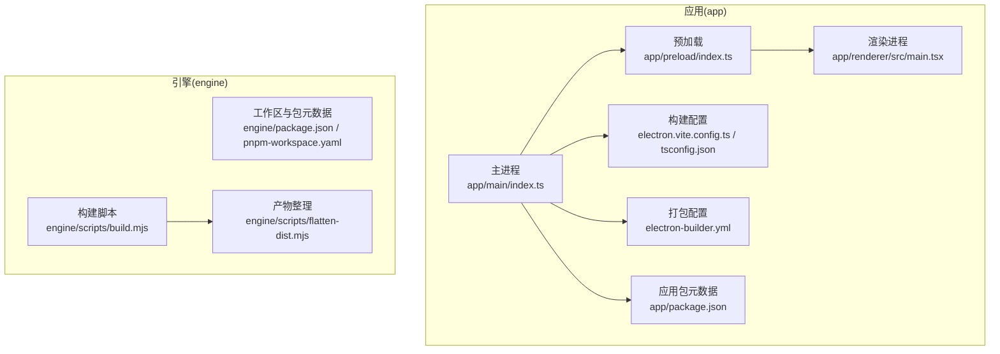
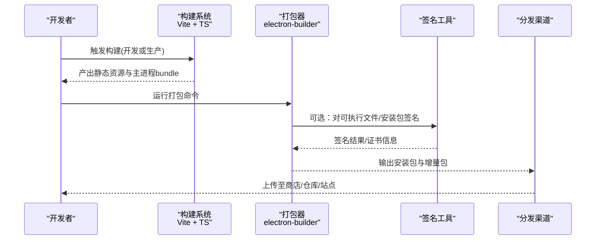
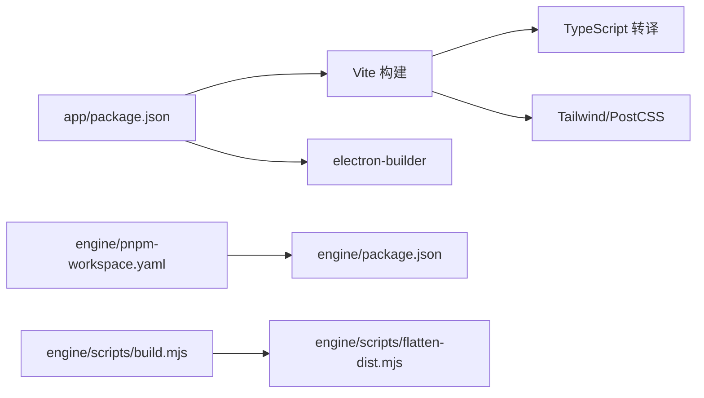

# 打包与发布

<cite>
**本文引用的文件**   
- [package.json](file://app/package.json)
- [electron-builder.yml](file://app/electron-builder.yml)
- [electron.vite.config.ts](file://app/electron.vite.config.ts)
- [postcss.config.js](file://app/postcss.config.js)
- [tailwind.config.js](file://app/tailwind.config.js)
- [tsconfig.json](file://app/tsconfig.json)
- [index.ts](file://app/main/index.ts)
- [engine-host.ts](file://app/main/engine-host.ts)
- [window.ts](file://app/main/window.ts)
- [menu.ts](file://app/main/menu.ts)
- [settings.ts](file://app/main/settings.ts)
- [index.ts](file://app/preload/index.ts)
- [main.tsx](file://app/renderer/src/main.tsx)
- [App.tsx](file://app/renderer/src/App.tsx)
- [package.json](file://engine/package.json)
- [pnpm-workspace.yaml](file://engine/pnpm-workspace.yaml)
- [build.mjs](file://engine/scripts/build.mjs)
- [flatten-dist.mjs](file://engine/scripts/flatten-dist.mjs)
</cite>

## 目录
1. [简介](#简介)
2. [项目结构](#项目结构)
3. [核心组件](#核心组件)
4. [架构总览](#架构总览)
5. [详细组件分析](#详细组件分析)
6. [依赖分析](#依赖分析)
7. [性能考虑](#性能考虑)
8. [故障排查指南](#故障排查指南)
9. [结论](#结论)
10. [附录](#附录) 

## 简介
本指南面向KCoder扩展的打包与发布，覆盖从构建、平台打包、签名验证到分发渠道、版本管理、更新机制以及CI/CD流水线的全流程。文档以仓库中现有配置与脚本为依据，提供可操作的最佳实践与排错建议，帮助团队稳定产出跨平台安装包并安全分发。

## 项目结构
KCoder采用Electron + Vite的前端工程化方案，主进程位于 app/main，渲染进程位于 app/renderer，预加载脚本位于 app/preload；应用打包由 electron-builder 驱动，构建配置集中在 app 目录下。引擎层位于 engine 子模块，使用 pnpm monorepo 组织多个包，并提供构建与产物整理脚本。

图表来源
- [index.ts](file://app/main/index.ts)
- [index.ts](file://app/preload/index.ts)
- [main.tsx](file://app/renderer/src/main.tsx)
- [electron.vite.config.ts](file://app/electron.vite.config.ts)
- [electron-builder.yml](file://app/electron-builder.yml)
- [package.json](file://app/package.json)
- [package.json](file://engine/package.json)
- [pnpm-workspace.yaml](file://engine/pnpm-workspace.yaml)
- [build.mjs](file://engine/scripts/build.mjs)
- [flatten-dist.mjs](file://engine/scripts/flatten-dist.mjs)

章节来源
- [package.json](file://app/package.json)
- [electron-builder.yml](file://app/electron-builder.yml)
- [electron.vite.config.ts](file://app/electron.vite.config.ts)
- [index.ts](file://app/main/index.ts)
- [engine/package.json](file://engine/package.json)
- [pnpm-workspace.yaml](file://engine/pnpm-workspace.yaml)
- [build.mjs](file://engine/scripts/build.mjs)
- [flatten-dist.mjs](file://engine/scripts/flatten-dist.mjs)

## 核心组件
- 应用入口与生命周期：主进程负责窗口创建、菜单初始化、设置管理与引擎宿主集成。
- 预加载桥接：暴露受控API给渲染进程，隔离Node/Electron能力。
- 渲染UI：基于React/Vite构建，通过预加载桥调用主进程能力。
- 打包器：electron-builder 统一输出各平台安装包与可执行文件。
- 引擎构建：engine 子模块通过脚本完成多包构建与产物整理。

章节来源
- [index.ts](file://app/main/index.ts)
- [engine-host.ts](file://app/main/engine-host.ts)
- [window.ts](file://app/main/window.ts)
- [menu.ts](file://app/main/menu.ts)
- [settings.ts](file://app/main/settings.ts)
- [index.ts](file://app/preload/index.ts)
- [main.tsx](file://app/renderer/src/main.tsx)
- [App.tsx](file://app/renderer/src/App.tsx)

## 架构总览
下图展示从源码到最终安装包的端到端流程：Vite编译前端资源，TypeScript类型检查与转译，electron-builder读取配置生成各平台产物，同时可集成签名与完整性校验。

图表来源
- [electron.vite.config.ts](file://app/electron.vite.config.ts)
- [electron-builder.yml](file://app/electron-builder.yml)
- [package.json](file://app/package.json)

## 详细组件分析

### 构建与打包流程
- 依赖管理
  - 应用层：使用 npm/yarn/pnpm（依据顶层与工作区配置）进行依赖安装与锁定。
  - 引擎层：基于 pnpm workspace 的多包管理，统一安装与构建。
- 代码编译
  - 前端：Vite + TypeScript + TailwindCSS + PostCSS 管线。
  - 主进程：TypeScript 编译为 Node 可执行模块。
- 资源打包
  - electron-builder 根据配置文件将资源、图标、二进制等合并为平台特定产物。
- 平台打包
  - Windows：生成 .exe/.msi 等，支持代码签名与时间戳服务。
  - macOS：生成 .dmg/.app，支持 Apple 代码签名与公证。
  - Linux：生成 .AppImage/.deb/.rpm，支持 GPG 签名。

章节来源
- [package.json](file://app/package.json)
- [electron-builder.yml](file://app/electron-builder.yml)
- [electron.vite.config.ts](file://app/electron.vite.config.ts)
- [postcss.config.js](file://app/postcss.config.js)
- [tailwind.config.js](file://app/tailwind.config.js)
- [tsconfig.json](file://app/tsconfig.json)
- [package.json](file://engine/package.json)
- [pnpm-workspace.yaml](file://engine/pnpm-workspace.yaml)

### 平台特定配置要点
- Windows
  - 目标格式：可执行与安装包。
  - 签名：需配置证书路径与密码，启用时间戳服务器以保证长期有效性。
  - 权限与UAC：按需配置提升权限策略。
- macOS
  - 目标格式：.app 与 .dmg。
  - 签名：使用Apple Developer证书签名，必要时进行公证。
  - 沙盒与权限：按功能需求开启相应权限。
- Linux
  - 目标格式：.AppImage、.deb、.rpm。
  - 签名：GPG签名与仓库索引签名。
  - 依赖：确保运行时库满足发行版要求。

章节来源
- [electron-builder.yml](file://app/electron-builder.yml)

### 插件签名与验证机制
- 数字签名
  - Windows：使用PFX/PKCS#12证书对可执行与安装包签名。
  - macOS：使用Apple证书对.app与.dmg签名，并可进行公证。
  - Linux：使用GPG对包与仓库索引签名。
- 完整性检查
  - 在客户端启动时校验关键文件的哈希值，防止篡改。
  - 对远程下载的资源进行签名/哈希双重校验。
- 安全验证
  - 严格限制预加载暴露的API范围。
  - 启用CSP与安全头，最小化Node集成面。

章节来源
- [index.ts](file://app/preload/index.ts)
- [electron-builder.yml](file://app/electron-builder.yml)

### 分发渠道
- 应用商店
  - Windows：Microsoft Store（需额外清单与签名）。
  - macOS：Mac App Store（需证书与公证）。
- 私有仓库
  - 自托管NPM/私有源，配合签名与访问控制。
  - 企业内部分发中心（如S3+CloudFront/OSS+Nginx），结合签名校验。
- 手动安装
  - 直接下载安装包，附带校验说明与回滚指引。

章节来源
- [electron-builder.yml](file://app/electron-builder.yml)
- [package.json](file://app/package.json)

### 版本管理策略
- 语义化版本
  - 遵循 MAJOR.MINOR.PATCH 规范，变更日志与兼容性矩阵同步维护。
- 兼容性矩阵
  - 明确与宿主应用、引擎内核、外部依赖的最小/最大兼容版本。
- 升级迁移
  - 提供迁移脚本与向后兼容层，避免破坏性升级。

章节来源
- [package.json](file://app/package.json)
- [package.json](file://engine/package.json)

### 更新机制实现
- 自动更新
  - 通过内置更新通道检查新版本，支持差量更新与回滚。
- 增量更新
  - 仅下发差异包，减少带宽与安装时间。
- 回滚处理
  - 失败自动回滚至上一稳定版本，保留用户数据与配置。

章节来源
- [electron-builder.yml](file://app/electron-builder.yml)
- [index.ts](file://app/main/index.ts)

### CI/CD流水线配置
- 自动化构建
  - 拉取代码、缓存依赖、并行构建前端与引擎。
- 测试
  - 单元测试、集成测试、端到端测试，失败阻断流水线。
- 发布
  - 生成产物、签名、上传至分发渠道，生成发布说明与制品归档。

章节来源
- [package.json](file://app/package.json)
- [build.mjs](file://engine/scripts/build.mjs)
- [flatten-dist.mjs](file://engine/scripts/flatten-dist.mjs)

## 依赖分析
- 应用层依赖
  - 构建期：Vite、TypeScript、TailwindCSS、PostCSS。
  - 运行期：Electron运行时与主进程依赖。
- 引擎层依赖
  - pnpm workspace 统一管理多包依赖，构建脚本串联各包构建与产物整理。
- 外部集成点
  - 代码签名服务（Windows时间戳、Apple证书、Linux GPG）。
  - 分发渠道（商店、私有仓库、对象存储）。

图表来源
- [package.json](file://app/package.json)
- [electron.vite.config.ts](file://app/electron.vite.config.ts)
- [postcss.config.js](file://app/postcss.config.js)
- [tailwind.config.js](file://app/tailwind.config.js)
- [pnpm-workspace.yaml](file://engine/pnpm-workspace.yaml)
- [package.json](file://engine/package.json)
- [build.mjs](file://engine/scripts/build.mjs)
- [flatten-dist.mjs](file://engine/scripts/flatten-dist.mjs)

章节来源
- [package.json](file://app/package.json)
- [electron.vite.config.ts](file://app/electron.vite.config.ts)
- [postcss.config.js](file://app/postcss.config.js)
- [tailwind.config.js](file://app/tailwind.config.js)
- [pnpm-workspace.yaml](file://engine/pnpm-workspace.yaml)
- [package.json](file://engine/package.json)
- [build.mjs](file://engine/scripts/build.mjs)
- [flatten-dist.mjs](file://engine/scripts/flatten-dist.mjs)

## 性能考虑
- 构建优化
  - 启用增量构建与缓存，拆分主/渲染进程依赖，减少冷启动时间。
- 产物体积
  - 按需引入第三方库，压缩静态资源，剔除调试符号。
- 运行时性能
  - 预加载最小化暴露API，避免在主线程执行重任务。
  - 合理划分渲染进程与主进程职责，利用Web Worker处理计算密集型任务。

[本节为通用指导，不直接分析具体文件]

## 故障排查指南
- 构建失败
  - 检查Node与pnpm版本匹配，清理缓存后重试。
  - 确认TypeScript与Vite版本兼容，查看错误堆栈定位问题。
- 打包失败
  - 核对 electron-builder 配置中的平台目标与签名参数。
  - 检查证书路径、密码与环境变量是否注入正确。
- 签名与验证
  - Windows：确认证书有效且时间戳服务可达。
  - macOS：确保证书链完整并完成公证。
  - Linux：确认GPG密钥可用且签名算法受信任。
- 运行时异常
  - 预加载桥报错：检查暴露API名称与权限。
  - 资源加载失败：确认路径与打包配置一致。

章节来源
- [electron-builder.yml](file://app/electron-builder.yml)
- [index.ts](file://app/preload/index.ts)
- [index.ts](file://app/main/index.ts)

## 结论
通过统一的构建与打包体系、严格的签名与完整性校验、完善的版本与更新机制，以及自动化CI/CD流水线，KCoder扩展可实现高质量、高安全的跨平台发布。建议持续完善兼容性矩阵与回滚策略，强化质量门禁与发布前检查，保障用户体验与系统安全。

[本节为总结性内容，不直接分析具体文件]

## 附录
- 快速上手
  - 安装依赖：在项目根目录与工作区分别执行依赖安装。
  - 本地构建：先构建引擎，再构建应用，最后打包。
  - 平台打包：根据目标平台调整 electron-builder 配置并执行打包命令。
- 最佳实践
  - 环境变量与密钥管理：使用CI密钥管理服务注入敏感信息。
  - 制品归档：保留每次发布的产物与日志，便于回溯与审计。
  - 灰度发布：先小范围灰度，收集反馈后再全量发布。

[本节为补充信息，不直接分析具体文件]