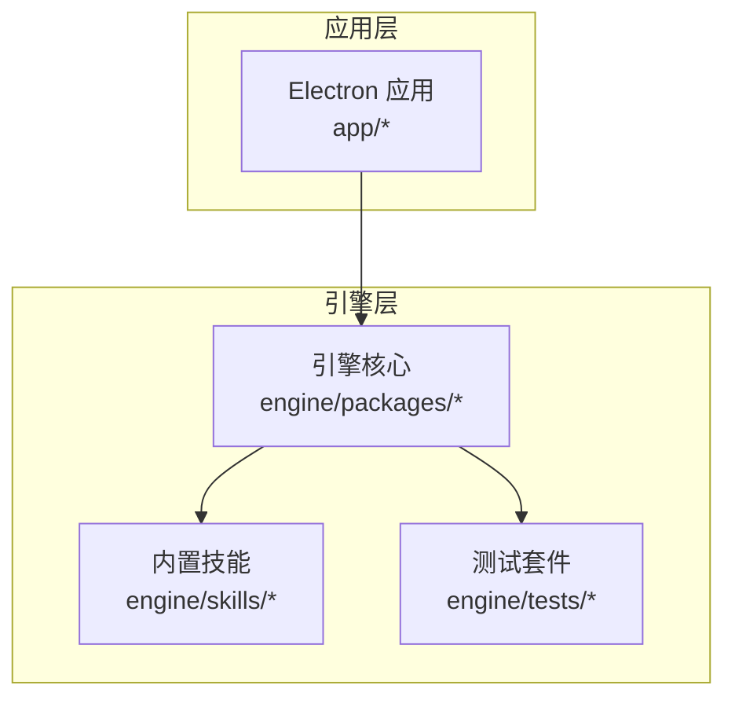
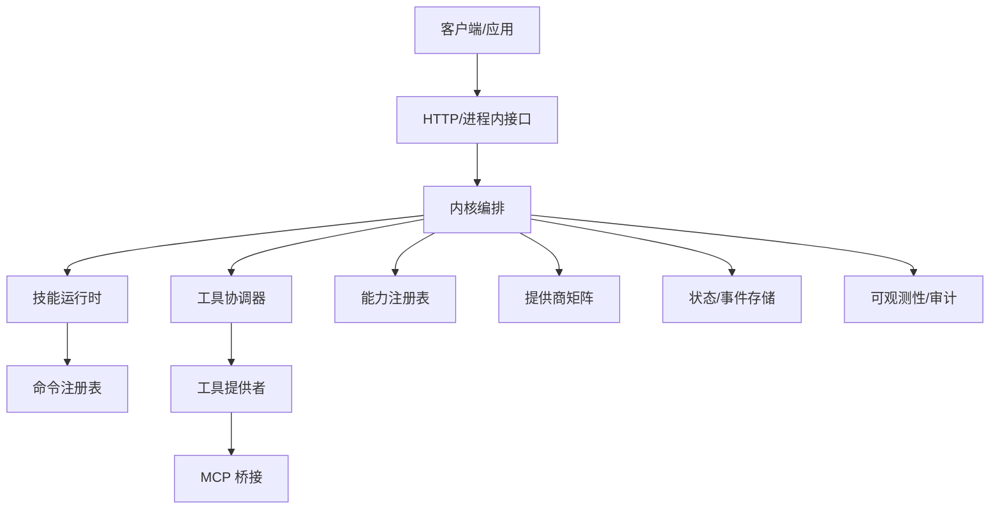
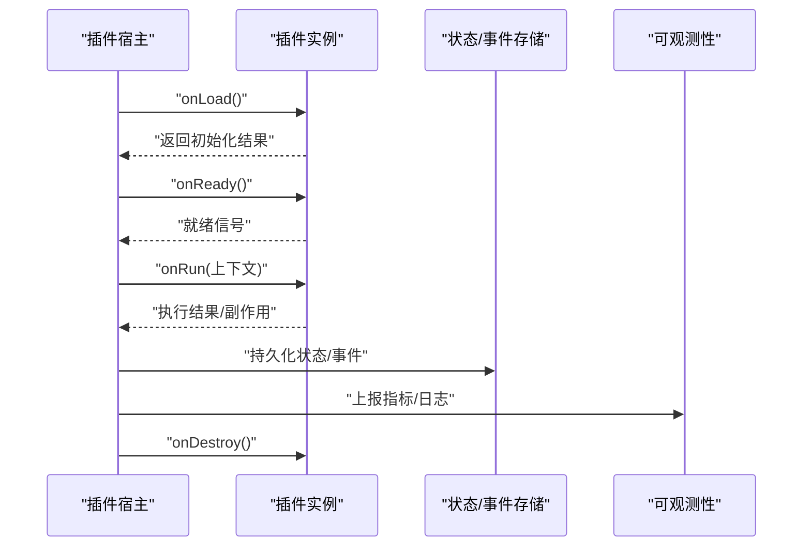
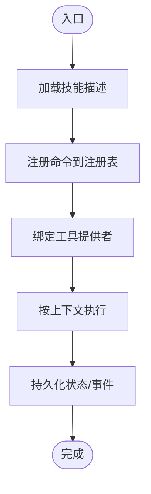
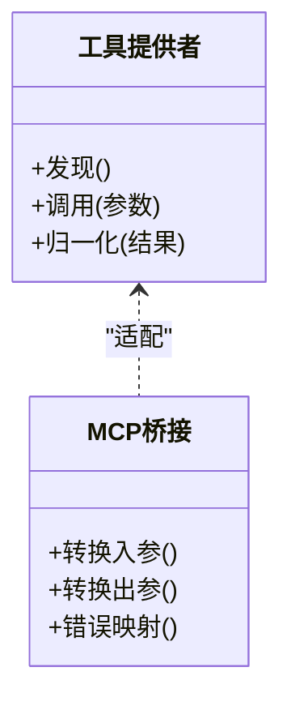
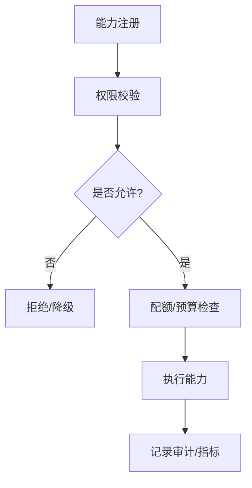
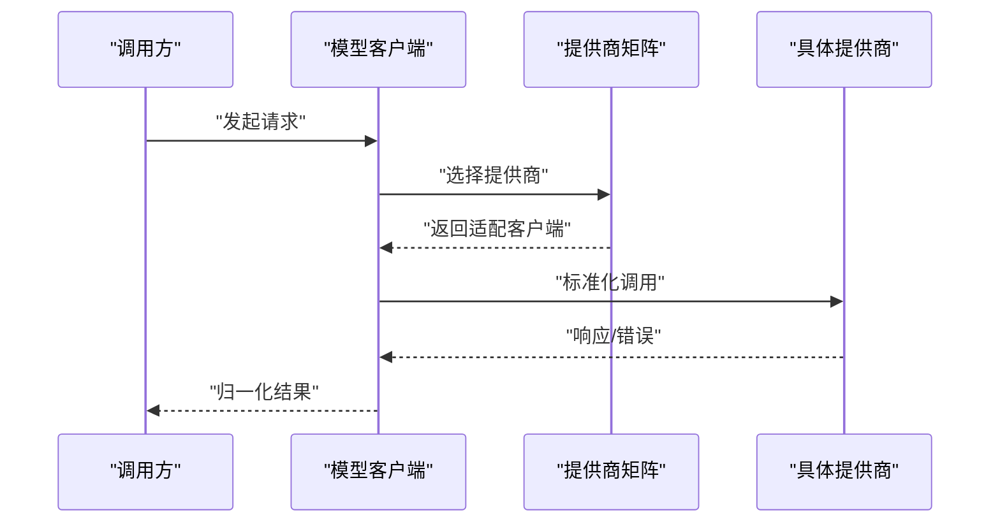
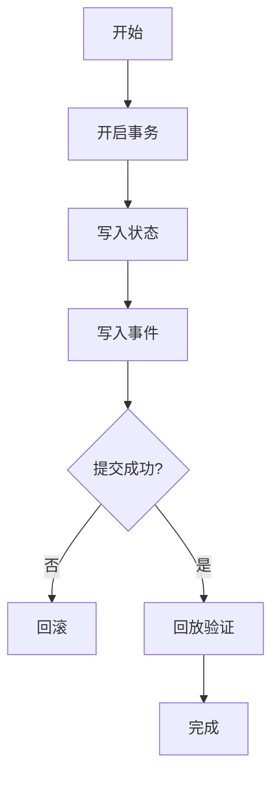
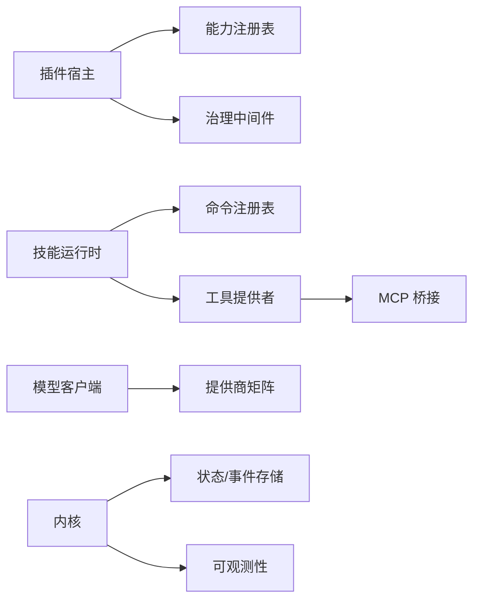

# 扩展开发

<cite>
**本文引用的文件**   
- [engine/README.md](file://engine/README.md)
- [engine/package.json](file://engine/package.json)
- [engine/pnpm-workspace.yaml](file://engine/pnpm-workspace.yaml)
- [engine/skills/code-review/skill.json](file://engine/skills/code-review/skill.json)
- [engine/skills/debugging/skill.json](file://engine/skills/debugging/skill.json)
- [engine/skills/git-worktrees/skill.json](file://engine/skills/git-worktrees/skill.json)
- [engine/skills/goal/skill.json](file://engine/skills/goal/skill.json)
- [engine/skills/planning/skill.json](file://engine/skills/planning/skill.json)
- [engine/skills/refactoring/skill.json](file://engine/skills/refactoring/skill.json)
- [engine/skills/review/skill.json](file://engine/skills/review/skill.json)
- [engine/skills/security-review/skill.json](file://engine/skills/security-review/skill.json)
- [engine/skills/tdd/skill.json](file://engine/skills/tdd/skill.json)
- [engine/skills/todo/skill.json](file://engine/skills/todo/skill.json)
- [engine/skills/web/skill.json](file://engine/skills/web/skill.json)
- [engine/tests/plugin-host.test.ts](file://engine/tests/plugin-host.test.ts)
- [engine/tests/skill-runtime.test.ts](file://engine/tests/skill-runtime.test.ts)
- [engine/tests/skill-command-registry.test.ts](file://engine/tests/skill-command-registry.test.ts)
- [engine/tests/skill-mcp-bridge.test.ts](file://engine/tests/skill-mcp-bridge.test.ts)
- [engine/tests/skill-tool-provider.test.ts](file://engine/tests/skill-tool-provider.test.ts)
- [engine/tests/marketplace.test.ts](file://engine/tests/marketplace.test.ts)
- [engine/tests/provider-compatibility.test.ts](file://engine/tests/provider-compatibility.test.ts)
- [engine/tests/runtime-kernel-isolation.test.ts](file://engine/tests/runtime-kernel-isolation.test.ts)
- [engine/tests/tool-dispatch-errors.test.ts](file://engine/tests/tool-dispatch-errors.test.ts)
- [engine/tests/tool-result-budget.test.ts](file://engine/tests/tool-result-budget.test.ts)
- [engine/tests/tool-runtime-v3.test.ts](file://engine/tests/tool-runtime-v3.test.ts)
- [engine/tests/builtin-skills.test.ts](file://engine/tests/builtin-skills.test.ts)
- [engine/tests/capability-registry.test.ts](file://engine/tests/capability-registry.test.ts)
- [engine/tests/capabilities.test.ts](file://engine/tests/capabilities.test.ts)
- [engine/tests/model-client.test.ts](file://engine/tests/model-client.test.ts)
- [engine/tests/mcp-config.test.ts](file://engine/tests/mcp-config.test.ts)
- [engine/tests/mcp-tool-provider.test.ts](file://engine/tests/mcp-tool-provider.test.ts)
- [engine/tests/http-server.test.ts](file://engine/tests/http-server.test.ts)
- [engine/tests/http-artifacts.test.ts](file://engine/tests/http-artifacts.test.ts)
- [engine/tests/memory-store.test.ts](file://engine/tests/memory-store.test.ts)
- [engine/tests/file-session-store.test.ts](file://engine/tests/file-session-store.test.ts)
- [engine/tests/hybrid-store.test.ts](file://engine/tests/hybrid-store.test.ts)
- [engine/tests/run-state-store.test.ts](file://engine/tests/run-state-store.test.ts)
- [engine/tests/task-state-store.test.ts](file://engine/tests/task-state-store.test.ts)
- [engine/tests/usage-service.test.ts](file://engine/tests/usage-service.test.ts)
- [engine/tests/token-economy.test.ts](file://engine/tests/token-economy.test.ts)
- [engine/tests/deepseek-pricing.test.ts](file://engine/tests/deepseek-pricing.test.ts)
- [engine/tests/qiongqi-config.test.ts](file://engine/tests/qiongqi-config.test.ts)
- [engine/tests/contracts.test.ts](file://engine/tests/contracts.test.ts)
- [engine/tests/manifest.test.ts](file://engine/tests/manifest.test.ts)
- [engine/tests/virtual-path.test.ts](file://engine/tests/virtual-path.test.ts)
- [engine/tests/legacy-task-state-migration.test.ts](file://engine/tests/legacy-task-state-migration.test.ts)
- [engine/tests/runtime-factory-rollout.test.ts](file://engine/tests/runtime-factory-rollout.test.ts)
- [engine/tests/runtime-rollout.test.ts](file://engine/tests/runtime-rollout.test.ts)
- [engine/tests/kernel-v3-provider-governance.test.ts](file://engine/tests/kernel-v3-provider-governance.test.ts)
- [engine/tests/runtime-kernel-after-middleware.test.ts](file://engine/tests/runtime-kernel-after-middleware.test.ts)
- [engine/tests/runtime-middleware-governance.test.ts](file://engine/tests/runtime-middleware-governance.test.ts)
- [engine/tests/runtime-kernel-contracts.test.ts](file://engine/tests/runtime-kernel-contracts.test.ts)
- [engine/tests/runtime-kernel-crash-recovery.test.ts](file://engine/tests/runtime-kernel-crash-recovery.test.ts)
- [engine/tests/runtime-kernel-e2e.test.ts](file://engine/tests/runtime-kernel-e2e.test.ts)
- [engine/tests/runtime-kernel-parity.test.ts](file://engine/tests/runtime-kernel-parity.test.ts)
- [engine/tests/runtime-kernel-provider-matrix.test.ts](file://engine/tests/runtime-kernel-provider-matrix.test.ts)
- [engine/tests/runtime-kernel-replay.test.ts](file://engine/tests/runtime-kernel-replay.test.ts)
- [engine/tests/runtime-kernel.test.ts](file://engine/tests/runtime-kernel.test.ts)
- [engine/tests/tool-coordinator-runtime.test.ts](file://engine/tests/tool-coordinator-runtime.test.ts)
- [engine/tests/tool-call-repair.test.ts](file://engine/tests/tool-call-repair.test.ts)
- [engine/tests/execution-graph.test.ts](file://engine/tests/execution-graph.test.ts)
- [engine/tests/loop-runner.test.ts](file://engine/tests/loop-runner.test.ts)
- [engine/tests/loop-policy.test.ts](file://engine/tests/loop-policy.test.ts)
- [engine/tests/loop-plan.test.ts](file://engine/tests/loop-plan.test.ts)
- [engine/tests/compaction-governor.test.ts](file://engine/tests/compaction-governor.test.ts)
- [engine/tests/context-compactor.test.ts](file://engine/tests/context-compactor.test.ts)
- [engine/tests/effect-commit.test.ts](file://engine/tests/effect-commit.test.ts)
- [engine/tests/effect-result-store.test.ts](file://engine/tests/effect-result-store.test.ts)
- [engine/tests/durable-task-capsule.test.ts](file://engine/tests/durable-task-capsule.test.ts)
- [engine/tests/evented-loop.test.ts](file://engine/tests/evented-loop.test.ts)
- [engine/tests/file-mutation-queue.test.ts](file://engine/tests/file-mutation-queue.test.ts)
- [engine/tests/file-session-store-integration.test.ts](file://engine/tests/file-session-store-integration.test.ts)
- [engine/tests/global.d.ts](file://engine/tests/global.d.ts)
- [engine/tests/finance-credentials.test.ts](file://engine/tests/finance-credentials.test.ts)
- [engine/tests/http-peer-transport.test.ts](file://engine/tests/http-peer-transport.test.ts)
- [engine/tests/http-server-observability.test.ts](file://engine/tests/http-server-observability.test.ts)
- [engine/tests/knowledge-retrieval.test.ts](file://engine/tests/knowledge-retrieval.test.ts)
- [engine/tests/memory-retrieval.test.ts](file://engine/tests/memory-retrieval.test.ts)
- [engine/tests/model-history-repair.test.ts](file://engine/tests/model-history-repair.test.ts)
- [engine/tests/model-step-runner.test.ts](file://engine/tests/model-step-runner.test.ts)
- [engine/tests/opentelemetry.test.ts](file://engine/tests/opentelemetry.test.ts)
- [engine/tests/output-accumulator.test.ts](file://engine/tests/output-accumulator.test.ts)
- [engine/tests/ports.test.ts](file://engine/tests/ports.test.ts)
- [engine/tests/proposal-classifier.test.ts](file://engine/tests/proposal-classifier.test.ts)
- [engine/tests/read-json-body.test.ts](file://engine/tests/read-json-body.test.ts)
- [engine/tests/request-history-hygiene.test.ts](file://engine/tests/request-history-hygiene.test.ts)
- [engine/tests/review.test.ts](file://engine/tests/review.test.ts)
- [engine/tests/run-event-store.test.ts](file://engine/tests/run-event-store.test.ts)
- [engine/tests/runtime-event-projection.test.ts](file://engine/tests/runtime-event-projection.test.ts)
- [engine/tests/runtime-event-recorder-kernel.test.ts](file://engine/tests/runtime-event-recorder-kernel.test.ts)
- [engine/tests/runtime-event-reducer.test.ts](file://engine/tests/runtime-event-reducer.test.ts)
- [engine/tests/scope-key.test.ts](file://engine/tests/scope-key.test.ts)
- [engine/tests/serve.test.ts](file://engine/tests/serve.test.ts)
- [engine/tests/steering-queue-isolation.test.ts](file://engine/tests/steering-queue-isolation.test.ts)
- [engine/tests/task-context-recovery.test.ts](file://engine/tests/task-context-recovery.test.ts)
- [engine/tests/task-continuity-production-path.test.ts](file://engine/tests/task-continuity-production-path.test.ts)
- [engine/tests/task-progress-projector.test.ts](file://engine/tests/task-progress-projector.test.ts)
- [engine/tests/task-state-builder.test.ts](file://engine/tests/task-state-builder.test.ts)
- [engine/tests/task-state-contracts.test.ts](file://engine/tests/task-state-contracts.test.ts)
- [engine/tests/thread-service.test.ts](file://engine/tests/thread-service.test.ts)
- [engine/tests/todo-tools.test.ts](file://engine/tests/todo-tools.test.ts)
- [engine/tests/verify-evented-a2a-script.test.ts](file://engine/tests/verify-evented-a2a-script.test.ts)
- [engine/tests/web-tool-provider.test.ts](file://engine/tests/web-tool-provider.test.ts)
- [engine/tests/work-mode-skill-runtime.test.ts](file://engine/tests/work-mode-skill-runtime.test.ts)
</cite>

## 目录
1. [简介](#简介)
2. [项目结构](#项目结构)
3. [核心组件](#核心组件)
4. [架构总览](#架构总览)
5. [详细组件分析](#详细组件分析)
6. [依赖分析](#依赖分析)
7. [性能考虑](#性能考虑)
8. [故障排查指南](#故障排查指南)
9. [结论](#结论)
10. [附录](#附录)

## 简介
本指南面向希望为 KCoder 引擎扩展生态进行插件与技能开发的工程师。文档围绕以下目标展开：
- 插件架构设计：接口定义、生命周期管理、沙箱与隔离机制
- 插件开发规范：代码结构、命名约定、配置文件格式
- 打包发布流程：构建、签名、分发（结合现有测试与市场能力）
- 版本管理策略：兼容性检查、升级迁移、回滚处理
- 自定义技能开发：技能定义格式、模板、测试方法
- 第三方集成：LLM 提供商接入、存储后端替换、外部服务集成
- 开发工具链：IDE 配置、调试、测试框架
- 安全与权限：最小权限原则、资源限制、审计与可观测性
- 最佳实践与示例：从入门到生产级插件/技能的落地路径

## 项目结构
仓库采用多包工作区组织，核心引擎位于 engine 目录，包含领域层、端口层、适配器、CLI、HTTP 层、基础设施等；skills 目录提供内置技能清单与元数据；tests 目录覆盖插件宿主、技能运行时、工具协调器、模型客户端、市场、兼容性、状态持久化、事件总线、可观测性等关键路径。

图表来源
- [engine/README.md:1-200](file://engine/README.md#L1-L200)
- [engine/package.json:1-200](file://engine/package.json#L1-L200)

章节来源
- [engine/README.md:1-200](file://engine/README.md#L1-L200)
- [engine/package.json:1-200](file://engine/package.json#L1-L200)
- [engine/pnpm-workspace.yaml:1-200](file://engine/pnpm-workspace.yaml#L1-L200)

## 核心组件
- 插件宿主与生命周期
  - 插件加载、初始化、运行、销毁的生命周期由宿主管理，相关行为在插件宿主测试中覆盖。
- 技能运行时与命令注册
  - 技能通过运行时执行，命令注册表负责发现与调度，测试覆盖命令注册与执行路径。
- 工具提供者与 MCP 桥接
  - 工具提供者抽象了具体实现，MCP 桥接用于与外部工具协议互通。
- 能力注册与治理
  - 能力注册表集中管理可用能力，配合治理中间件控制访问与配额。
- 模型客户端与提供商矩阵
  - 模型客户端统一对外暴露 LLM 调用接口，提供商矩阵驱动路由与适配。
- 状态与事件持久化
  - 任务/运行状态、事件记录、会话存储等提供多种后端实现与组合。
- 可观测性与审计
  - OpenTelemetry、HTTP 可观测性、请求历史卫生等保障可追踪与合规。

章节来源
- [engine/tests/plugin-host.test.ts:1-200](file://engine/tests/plugin-host.test.ts#L1-L200)
- [engine/tests/skill-runtime.test.ts:1-200](file://engine/tests/skill-runtime.test.ts#L1-L200)
- [engine/tests/skill-command-registry.test.ts:1-200](file://engine/tests/skill-command-registry.test.ts#L1-L200)
- [engine/tests/skill-mcp-bridge.test.ts:1-200](file://engine/tests/skill-mcp-bridge.test.ts#L1-L200)
- [engine/tests/skill-tool-provider.test.ts:1-200](file://engine/tests/skill-tool-provider.test.ts#L1-L200)
- [engine/tests/capability-registry.test.ts:1-200](file://engine/tests/capability-registry.test.ts#L1-L200)
- [engine/tests/capabilities.test.ts:1-200](file://engine/tests/capabilities.test.ts#L1-L200)
- [engine/tests/model-client.test.ts:1-200](file://engine/tests/model-client.test.ts#L1-L200)
- [engine/tests/mcp-config.test.ts:1-200](file://engine/tests/mcp-config.test.ts#L1-L200)
- [engine/tests/mcp-tool-provider.test.ts:1-200](file://engine/tests/mcp-tool-provider.test.ts#L1-L200)
- [engine/tests/memory-store.test.ts:1-200](file://engine/tests/memory-store.test.ts#L1-L200)
- [engine/tests/file-session-store.test.ts:1-200](file://engine/tests/file-session-store.test.ts#L1-L200)
- [engine/tests/hybrid-store.test.ts:1-200](file://engine/tests/hybrid-store.test.ts#L1-L200)
- [engine/tests/run-state-store.test.ts:1-200](file://engine/tests/run-state-store.test.ts#L1-L200)
- [engine/tests/task-state-store.test.ts:1-200](file://engine/tests/task-state-store.test.ts#L1-L200)
- [engine/tests/opentelemetry.test.ts:1-200](file://engine/tests/opentelemetry.test.ts#L1-L200)
- [engine/tests/http-server-observability.test.ts:1-200](file://engine/tests/http-server-observability.test.ts#L1-L200)
- [engine/tests/request-history-hygiene.test.ts:1-200](file://engine/tests/request-history-hygiene.test.ts#L1-L200)

## 架构总览
下图展示了插件/技能在引擎中的整体交互关系：应用侧通过 HTTP/进程内方式与引擎通信；引擎内核编排任务循环、工具协调、能力治理与提供商路由；技能作为一等公民参与命令注册与工具提供；状态与事件持久化贯穿全链路。

图表来源
- [engine/tests/runtime-kernel.test.ts:1-200](file://engine/tests/runtime-kernel.test.ts#L1-L200)
- [engine/tests/tool-coordinator-runtime.test.ts:1-200](file://engine/tests/tool-coordinator-runtime.test.ts#L1-L200)
- [engine/tests/skill-command-registry.test.ts:1-200](file://engine/tests/skill-command-registry.test.ts#L1-L200)
- [engine/tests/skill-tool-provider.test.ts:1-200](file://engine/tests/skill-tool-provider.test.ts#L1-L200)
- [engine/tests/skill-mcp-bridge.test.ts:1-200](file://engine/tests/skill-mcp-bridge.test.ts#L1-L200)
- [engine/tests/capability-registry.test.ts:1-200](file://engine/tests/capability-registry.test.ts#L1-L200)
- [engine/tests/model-client.test.ts:1-200](file://engine/tests/model-client.test.ts#L1-L200)
- [engine/tests/run-state-store.test.ts:1-200](file://engine/tests/run-state-store.test.ts#L1-L200)
- [engine/tests/run-event-store.test.ts:1-200](file://engine/tests/run-event-store.test.ts#L1-L200)
- [engine/tests/opentelemetry.test.ts:1-200](file://engine/tests/opentelemetry.test.ts#L1-L200)

## 详细组件分析

### 插件宿主与生命周期
- 职责
  - 插件发现、加载、初始化、运行、销毁；错误恢复与隔离。
- 关键行为
  - 生命周期钩子：onLoad、onReady、onRun、onDestroy 等（以测试断言为准）。
  - 隔离与沙箱：进程/上下文隔离、资源限制、异常边界。
- 参考路径
  - 插件宿主测试：[plugin-host.test.ts](file://engine/tests/plugin-host.test.ts)
  - 运行时隔离测试：[runtime-kernel-isolation.test.ts](file://engine/tests/runtime-kernel-isolation.test.ts)

图表来源
- [engine/tests/plugin-host.test.ts:1-200](file://engine/tests/plugin-host.test.ts#L1-L200)
- [engine/tests/runtime-kernel-isolation.test.ts:1-200](file://engine/tests/runtime-kernel-isolation.test.ts#L1-L200)
- [engine/tests/run-state-store.test.ts:1-200](file://engine/tests/run-state-store.test.ts#L1-L200)
- [engine/tests/run-event-store.test.ts:1-200](file://engine/tests/run-event-store.test.ts#L1-L200)
- [engine/tests/opentelemetry.test.ts:1-200](file://engine/tests/opentelemetry.test.ts#L1-L200)

章节来源
- [engine/tests/plugin-host.test.ts:1-200](file://engine/tests/plugin-host.test.ts#L1-L200)
- [engine/tests/runtime-kernel-isolation.test.ts:1-200](file://engine/tests/runtime-kernel-isolation.test.ts#L1-L200)

### 技能运行时与命令注册
- 职责
  - 解析技能描述、注册命令、绑定工具、执行工作流。
- 关键行为
  - 命令注册表维护命令名、参数、权限、工具映射。
  - 技能运行时根据上下文选择合适工具并编排执行。
- 参考路径
  - 技能运行时测试：[skill-runtime.test.ts](file://engine/tests/skill-runtime.test.ts)
  - 命令注册表测试：[skill-command-registry.test.ts](file://engine/tests/skill-command-registry.test.ts)
  - 内置技能测试：[builtin-skills.test.ts](file://engine/tests/builtin-skills.test.ts)

图表来源
- [engine/tests/skill-runtime.test.ts:1-200](file://engine/tests/skill-runtime.test.ts#L1-L200)
- [engine/tests/skill-command-registry.test.ts:1-200](file://engine/tests/skill-command-registry.test.ts#L1-L200)
- [engine/tests/builtin-skills.test.ts:1-200](file://engine/tests/builtin-skills.test.ts#L1-L200)

章节来源
- [engine/tests/skill-runtime.test.ts:1-200](file://engine/tests/skill-runtime.test.ts#L1-L200)
- [engine/tests/skill-command-registry.test.ts:1-200](file://engine/tests/skill-command-registry.test.ts#L1-L200)
- [engine/tests/builtin-skills.test.ts:1-200](file://engine/tests/builtin-skills.test.ts#L1-L200)

### 工具提供者与 MCP 桥接
- 职责
  - 工具提供者抽象外部能力；MCP 桥接将内部工具与外部 MCP 协议互通。
- 关键行为
  - 工具发现、参数校验、结果归一化、错误传播。
- 参考路径
  - 工具提供者测试：[skill-tool-provider.test.ts](file://engine/tests/skill-tool-provider.test.ts)
  - MCP 桥接测试：[skill-mcp-bridge.test.ts](file://engine/tests/skill-mcp-bridge.test.ts)
  - MCP 配置与提供者：[mcp-config.test.ts](file://engine/tests/mcp-config.test.ts)、[mcp-tool-provider.test.ts](file://engine/tests/mcp-tool-provider.test.ts)

图表来源
- [engine/tests/skill-tool-provider.test.ts:1-200](file://engine/tests/skill-tool-provider.test.ts#L1-L200)
- [engine/tests/skill-mcp-bridge.test.ts:1-200](file://engine/tests/skill-mcp-bridge.test.ts#L1-L200)
- [engine/tests/mcp-config.test.ts:1-200](file://engine/tests/mcp-config.test.ts#L1-L200)
- [engine/tests/mcp-tool-provider.test.ts:1-200](file://engine/tests/mcp-tool-provider.test.ts#L1-L200)

章节来源
- [engine/tests/skill-tool-provider.test.ts:1-200](file://engine/tests/skill-tool-provider.test.ts#L1-L200)
- [engine/tests/skill-mcp-bridge.test.ts:1-200](file://engine/tests/skill-mcp-bridge.test.ts#L1-L200)
- [engine/tests/mcp-config.test.ts:1-200](file://engine/tests/mcp-config.test.ts#L1-L200)
- [engine/tests/mcp-tool-provider.test.ts:1-200](file://engine/tests/mcp-tool-provider.test.ts#L1-L200)

### 能力注册与治理
- 职责
  - 集中登记能力、声明约束、实施访问控制与配额治理。
- 关键行为
  - 能力发现、版本兼容、权限校验、限流与预算控制。
- 参考路径
  - 能力注册表测试：[capability-registry.test.ts](file://engine/tests/capability-registry.test.ts)
  - 能力测试：[capabilities.test.ts](file://engine/tests/capabilities.test.ts)
  - 治理中间件测试：[runtime-middleware-governance.test.ts](file://engine/tests/runtime-middleware-governance.test.ts)
  - 提供商治理测试：[kernel-v3-provider-governance.test.ts](file://engine/tests/kernel-v3-provider-governance.test.ts)

图表来源
- [engine/tests/capability-registry.test.ts:1-200](file://engine/tests/capability-registry.test.ts#L1-L200)
- [engine/tests/capabilities.test.ts:1-200](file://engine/tests/capabilities.test.ts#L1-L200)
- [engine/tests/runtime-middleware-governance.test.ts:1-200](file://engine/tests/runtime-middleware-governance.test.ts#L1-L200)
- [engine/tests/kernel-v3-provider-governance.test.ts:1-200](file://engine/tests/kernel-v3-provider-governance.test.ts#L1-L200)

章节来源
- [engine/tests/capability-registry.test.ts:1-200](file://engine/tests/capability-registry.test.ts#L1-L200)
- [engine/tests/capabilities.test.ts:1-200](file://engine/tests/capabilities.test.ts#L1-L200)
- [engine/tests/runtime-middleware-governance.test.ts:1-200](file://engine/tests/runtime-middleware-governance.test.ts#L1-L200)
- [engine/tests/kernel-v3-provider-governance.test.ts:1-200](file://engine/tests/kernel-v3-provider-governance.test.ts#L1-L200)

### 模型客户端与提供商矩阵
- 职责
  - 统一封装 LLM 调用，支持多提供商路由、重试、计费与价格计算。
- 关键行为
  - 提供商矩阵选择、协议归一化、历史修复、步骤执行。
- 参考路径
  - 模型客户端测试：[model-client.test.ts](file://engine/tests/model-client.test.ts)
  - 提供商兼容性测试：[provider-compatibility.test.ts](file://engine/tests/provider-compatibility.test.ts)
  - 定价与用量：[deepseek-pricing.test.ts](file://engine/tests/deepseek-pricing.test.ts)、[token-economy.test.ts](file://engine/tests/token-economy.test.ts)
  - 历史修复与步骤执行：[model-history-repair.test.ts](file://engine/tests/model-history-repair.test.ts)、[model-step-runner.test.ts](file://engine/tests/model-step-runner.test.ts)

图表来源
- [engine/tests/model-client.test.ts:1-200](file://engine/tests/model-client.test.ts#L1-L200)
- [engine/tests/provider-compatibility.test.ts:1-200](file://engine/tests/provider-compatibility.test.ts#L1-L200)
- [engine/tests/deepseek-pricing.test.ts:1-200](file://engine/tests/deepseek-pricing.test.ts#L1-L200)
- [engine/tests/token-economy.test.ts:1-200](file://engine/tests/token-economy.test.ts#L1-L200)
- [engine/tests/model-history-repair.test.ts:1-200](file://engine/tests/model-history-repair.test.ts#L1-L200)
- [engine/tests/model-step-runner.test.ts:1-200](file://engine/tests/model-step-runner.test.ts#L1-L200)

章节来源
- [engine/tests/model-client.test.ts:1-200](file://engine/tests/model-client.test.ts#L1-L200)
- [engine/tests/provider-compatibility.test.ts:1-200](file://engine/tests/provider-compatibility.test.ts#L1-L200)
- [engine/tests/deepseek-pricing.test.ts:1-200](file://engine/tests/deepseek-pricing.test.ts#L1-L200)
- [engine/tests/token-economy.test.ts:1-200](file://engine/tests/token-economy.test.ts#L1-L200)
- [engine/tests/model-history-repair.test.ts:1-200](file://engine/tests/model-history-repair.test.ts#L1-L200)
- [engine/tests/model-step-runner.test.ts:1-200](file://engine/tests/model-step-runner.test.ts#L1-L200)

### 状态与事件持久化
- 职责
  - 任务/运行状态、事件记录、会话存储的可靠持久化与回放。
- 关键行为
  - 多后端实现（内存/文件/混合）、事务提交、回放与一致性。
- 参考路径
  - 运行状态存储：[run-state-store.test.ts](file://engine/tests/run-state-store.test.ts)
  - 任务状态存储：[task-state-store.test.ts](file://engine/tests/task-state-store.test.ts)
  - 事件存储：[run-event-store.test.ts](file://engine/tests/run-event-store.test.ts)
  - 会话存储：[file-session-store.test.ts](file://engine/tests/file-session-store.test.ts)
  - 混合存储：[hybrid-store.test.ts](file://engine/tests/hybrid-store.test.ts)
  - 效果提交与结果存储：[effect-commit.test.ts](file://engine/tests/effect-commit.test.ts)、[effect-result-store.test.ts](file://engine/tests/effect-result-store.test.ts)

图表来源
- [engine/tests/run-state-store.test.ts:1-200](file://engine/tests/run-state-store.test.ts#L1-L200)
- [engine/tests/task-state-store.test.ts:1-200](file://engine/tests/task-state-store.test.ts#L1-L200)
- [engine/tests/run-event-store.test.ts:1-200](file://engine/tests/run-event-store.test.ts#L1-L200)
- [engine/tests/file-session-store.test.ts:1-200](file://engine/tests/file-session-store.test.ts#L1-L200)
- [engine/tests/hybrid-store.test.ts:1-200](file://engine/tests/hybrid-store.test.ts#L1-L200)
- [engine/tests/effect-commit.test.ts:1-200](file://engine/tests/effect-commit.test.ts#L1-L200)
- [engine/tests/effect-result-store.test.ts:1-200](file://engine/tests/effect-result-store.test.ts#L1-L200)

章节来源
- [engine/tests/run-state-store.test.ts:1-200](file://engine/tests/run-state-store.test.ts#L1-L200)
- [engine/tests/task-state-store.test.ts:1-200](file://engine/tests/task-state-store.test.ts#L1-L200)
- [engine/tests/run-event-store.test.ts:1-200](file://engine/tests/run-event-store.test.ts#L1-L200)
- [engine/tests/file-session-store.test.ts:1-200](file://engine/tests/file-session-store.test.ts#L1-L200)
- [engine/tests/hybrid-store.test.ts:1-200](file://engine/tests/hybrid-store.test.ts#L1-L200)
- [engine/tests/effect-commit.test.ts:1-200](file://engine/tests/effect-commit.test.ts#L1-L200)
- [engine/tests/effect-result-store.test.ts:1-200](file://engine/tests/effect-result-store.test.ts#L1-L200)

### 可观测性与审计
- 职责
  - 指标采集、分布式追踪、HTTP 可观测性、请求历史卫生。
- 关键行为
  - OpenTelemetry 集成、HTTP 服务器可观测性、敏感信息脱敏。
- 参考路径
  - OpenTelemetry：[opentelemetry.test.ts](file://engine/tests/opentelemetry.test.ts)
  - HTTP 可观测性：[http-server-observability.test.ts](file://engine/tests/http-server-observability.test.ts)
  - 请求历史卫生：[request-history-hygiene.test.ts](file://engine/tests/request-history-hygiene.test.ts)

章节来源
- [engine/tests/opentelemetry.test.ts:1-200](file://engine/tests/opentelemetry.test.ts#L1-L200)
- [engine/tests/http-server-observability.test.ts:1-200](file://engine/tests/http-server-observability.test.ts#L1-L200)
- [engine/tests/request-history-hygiene.test.ts:1-200](file://engine/tests/request-history-hygiene.test.ts#L1-L200)

## 依赖分析
- 工作区与包管理
  - 使用 pnpm workspace 组织多包，engine 根 package.json 定义脚本与工作区范围。
- 关键依赖方向
  - 插件宿主依赖能力注册与治理中间件；技能运行时依赖命令注册表与工具提供者；工具提供者依赖 MCP 桥接；模型客户端依赖提供商矩阵；所有组件依赖状态/事件存储与可观测性。

图表来源
- [engine/package.json:1-200](file://engine/package.json#L1-L200)
- [engine/pnpm-workspace.yaml:1-200](file://engine/pnpm-workspace.yaml#L1-L200)
- [engine/tests/capability-registry.test.ts:1-200](file://engine/tests/capability-registry.test.ts#L1-L200)
- [engine/tests/runtime-middleware-governance.test.ts:1-200](file://engine/tests/runtime-middleware-governance.test.ts#L1-L200)
- [engine/tests/skill-command-registry.test.ts:1-200](file://engine/tests/skill-command-registry.test.ts#L1-L200)
- [engine/tests/skill-tool-provider.test.ts:1-200](file://engine/tests/skill-tool-provider.test.ts#L1-L200)
- [engine/tests/skill-mcp-bridge.test.ts:1-200](file://engine/tests/skill-mcp-bridge.test.ts#L1-L200)
- [engine/tests/model-client.test.ts:1-200](file://engine/tests/model-client.test.ts#L1-L200)
- [engine/tests/run-state-store.test.ts:1-200](file://engine/tests/run-state-store.test.ts#L1-L200)
- [engine/tests/run-event-store.test.ts:1-200](file://engine/tests/run-event-store.test.ts#L1-L200)
- [engine/tests/opentelemetry.test.ts:1-200](file://engine/tests/opentelemetry.test.ts#L1-L200)

章节来源
- [engine/package.json:1-200](file://engine/package.json#L1-L200)
- [engine/pnpm-workspace.yaml:1-200](file://engine/pnpm-workspace.yaml#L1-L200)

## 性能考虑
- 工具调用与结果预算
  - 通过工具结果预算控制输出大小与成本，避免大对象阻塞。
- 上下文压缩与循环治理
  - 上下文压缩器与循环治理器降低长对话开销，提升吞吐。
- 并发与队列
  - 文件变更队列与事件循环优化减少 I/O 竞争。
- 参考路径
  - 工具结果预算：[tool-result-budget.test.ts](file://engine/tests/tool-result-budget.test.ts)
  - 上下文压缩：[context-compactor.test.ts](file://engine/tests/context-compactor.test.ts)
  - 循环治理：[compaction-governor.test.ts](file://engine/tests/compaction-governor.test.ts)
  - 文件变更队列：[file-mutation-queue.test.ts](file://engine/tests/file-mutation-queue.test.ts)
  - 事件循环：[evented-loop.test.ts](file://engine/tests/evented-loop.test.ts)

章节来源
- [engine/tests/tool-result-budget.test.ts:1-200](file://engine/tests/tool-result-budget.test.ts#L1-L200)
- [engine/tests/context-compactor.test.ts:1-200](file://engine/tests/context-compactor.test.ts#L1-L200)
- [engine/tests/compaction-governor.test.ts:1-200](file://engine/tests/compaction-governor.test.ts#L1-L200)
- [engine/tests/file-mutation-queue.test.ts:1-200](file://engine/tests/file-mutation-queue.test.ts#L1-L200)
- [engine/tests/evented-loop.test.ts:1-200](file://engine/tests/evented-loop.test.ts#L1-L200)

## 故障排查指南
- 常见错误分类
  - 工具调用错误：参数不合法、超时、外部服务不可用。
  - 状态不一致：事务失败、回放不一致、持久化异常。
  - 提供商问题：协议不兼容、鉴权失败、计费异常。
- 定位手段
  - 查看工具调用错误与修复路径：[tool-dispatch-errors.test.ts](file://engine/tests/tool-dispatch-errors.test.ts)、[tool-call-repair.test.ts](file://engine/tests/tool-call-repair.test.ts)
  - 检查状态与事件回放：[run-state-store.test.ts](file://engine/tests/run-state-store.test.ts)、[run-event-store.test.ts](file://engine/tests/run-event-store.test.ts)
  - 核对提供商兼容性与合约：[provider-compatibility.test.ts](file://engine/tests/provider-compatibility.test.ts)、[contracts.test.ts](file://engine/tests/contracts.test.ts)
  - 观察可观测性指标与 HTTP 可观测性：[opentelemetry.test.ts](file://engine/tests/opentelemetry.test.ts)、[http-server-observability.test.ts](file://engine/tests/http-server-observability.test.ts)

章节来源
- [engine/tests/tool-dispatch-errors.test.ts:1-200](file://engine/tests/tool-dispatch-errors.test.ts#L1-L200)
- [engine/tests/tool-call-repair.test.ts:1-200](file://engine/tests/tool-call-repair.test.ts#L1-L200)
- [engine/tests/run-state-store.test.ts:1-200](file://engine/tests/run-state-store.test.ts#L1-L200)
- [engine/tests/run-event-store.test.ts:1-200](file://engine/tests/run-event-store.test.ts#L1-L200)
- [engine/tests/provider-compatibility.test.ts:1-200](file://engine/tests/provider-compatibility.test.ts#L1-L200)
- [engine/tests/contracts.test.ts:1-200](file://engine/tests/contracts.test.ts#L1-L200)
- [engine/tests/opentelemetry.test.ts:1-200](file://engine/tests/opentelemetry.test.ts#L1-L200)
- [engine/tests/http-server-observability.test.ts:1-200](file://engine/tests/http-server-observability.test.ts#L1-L200)

## 结论
KCoder 引擎通过清晰的插件/技能分层、完善的治理能力与可观测性、以及丰富的持久化与提供商适配，为扩展生态提供了稳定且可扩展的基础。遵循本文的开发规范与最佳实践，可以快速构建高质量、可维护、可演进的插件与技能。

## 附录

### 插件接口与生命周期建议
- 接口建议
  - 明确 onLoad/onReady/onRun/onDestroy 钩子契约，输入输出类型严格定义。
- 生命周期建议
  - 初始化阶段仅做轻量准备；运行阶段关注幂等与错误恢复；销毁阶段释放资源。
- 参考路径
  - [plugin-host.test.ts](file://engine/tests/plugin-host.test.ts)

章节来源
- [engine/tests/plugin-host.test.ts:1-200](file://engine/tests/plugin-host.test.ts#L1-L200)

### 插件开发规范
- 代码结构
  - 按功能域划分模块，保持高内聚低耦合；公共逻辑抽取至 utils。
- 命名约定
  - 模块与函数采用小驼峰，常量大写蛇形，类名大驼峰。
- 配置文件格式
  - 使用 JSON/YAML 描述插件元数据、能力声明、权限与依赖。
- 参考路径
  - [manifest.test.ts](file://engine/tests/manifest.test.ts)

章节来源
- [engine/tests/manifest.test.ts:1-200](file://engine/tests/manifest.test.ts#L1-L200)

### 打包与发布流程
- 构建
  - 使用 pnpm workspace 脚本进行多包构建与产物整理。
- 签名与完整性
  - 对产物进行哈希校验与签名（结合 CI/CD 流水线）。
- 分发
  - 基于市场能力进行分发与版本管理（见市场测试用例）。
- 参考路径
  - [marketplace.test.ts](file://engine/tests/marketplace.test.ts)
  - [package.json](file://engine/package.json)

章节来源
- [engine/tests/marketplace.test.ts:1-200](file://engine/tests/marketplace.test.ts#L1-L200)
- [engine/package.json:1-200](file://engine/package.json#L1-L200)

### 版本管理与兼容性
- 兼容性检查
  - 提供商矩阵与合约测试确保跨版本兼容。
- 升级迁移
  - 任务状态迁移测试覆盖旧到新版本的平滑过渡。
- 回滚处理
  - 通过状态/事件回放与快照机制实现快速回滚。
- 参考路径
  - [provider-compatibility.test.ts](file://engine/tests/provider-compatibility.test.ts)
  - [contracts.test.ts](file://engine/tests/contracts.test.ts)
  - [legacy-task-state-migration.test.ts](file://engine/tests/legacy-task-state-migration.test.ts)
  - [runtime-kernel-replay.test.ts](file://engine/tests/runtime-kernel-replay.test.ts)

章节来源
- [engine/tests/provider-compatibility.test.ts:1-200](file://engine/tests/provider-compatibility.test.ts#L1-L200)
- [engine/tests/contracts.test.ts:1-200](file://engine/tests/contracts.test.ts#L1-L200)
- [engine/tests/legacy-task-migration.test.ts:1-200](file://engine/tests/legacy-task-state-migration.test.ts#L1-L200)
- [engine/tests/runtime-kernel-replay.test.ts:1-200](file://engine/tests/runtime-kernel-replay.test.ts#L1-L200)

### 自定义技能开发
- 技能定义格式
  - 每个技能包含 skill.json 与说明文档（SKILL.md），描述能力、参数、工具与权限。
- 开发模板
  - 参考内置技能目录结构与字段定义。
- 测试方法
  - 使用技能运行时与命令注册表测试用例进行端到端验证。
- 参考路径
  - [code-review/skill.json](file://engine/skills/code-review/skill.json)
  - [debugging/skill.json](file://engine/skills/debugging/skill.json)
  - [git-worktrees/skill.json](file://engine/skills/git-worktrees/skill.json)
  - [goal/skill.json](file://engine/skills/goal/skill.json)
  - [planning/skill.json](file://engine/skills/planning/skill.json)
  - [refactoring/skill.json](file://engine/skills/refactoring/skill.json)
  - [review/skill.json](file://engine/skills/review/skill.json)
  - [security-review/skill.json](file://engine/skills/security-review/skill.json)
  - [tdd/skill.json](file://engine/skills/tdd/skill.json)
  - [todo/skill.json](file://engine/skills/todo/skill.json)
  - [web/skill.json](file://engine/skills/web/skill.json)
  - [builtin-skills.test.ts](file://engine/tests/builtin-skills.test.ts)
  - [skill-runtime.test.ts](file://engine/tests/skill-runtime.test.ts)

章节来源
- [engine/skills/code-review/skill.json:1-200](file://engine/skills/code-review/skill.json#L1-L200)
- [engine/skills/debugging/skill.json:1-200](file://engine/skills/debugging/skill.json#L1-L200)
- [engine/skills/git-worktrees/skill.json:1-200](file://engine/skills/git-worktrees/skill.json#L1-L200)
- [engine/skills/goal/skill.json:1-200](file://engine/skills/goal/skill.json#L1-L200)
- [engine/skills/planning/skill.json:1-200](file://engine/skills/planning/skill.json#L1-L200)
- [engine/skills/refactoring/skill.json:1-200](file://engine/skills/refactoring/skill.json#L1-L200)
- [engine/skills/review/skill.json:1-200](file://engine/skills/review/skill.json#L1-L200)
- [engine/skills/security-review/skill.json:1-200](file://engine/skills/security-review/skill.json#L1-L200)
- [engine/skills/tdd/skill.json:1-200](file://engine/skills/tdd/skill.json#L1-L200)
- [engine/skills/todo/skill.json:1-200](file://engine/skills/todo/skill.json#L1-L200)
- [engine/skills/web/skill.json:1-200](file://engine/skills/web/skill.json#L1-L200)
- [engine/tests/builtin-skills.test.ts:1-200](file://engine/tests/builtin-skills.test.ts#L1-L200)
- [engine/tests/skill-runtime.test.ts:1-200](file://engine/tests/skill-runtime.test.ts#L1-L200)

### 第三方集成
- LLM 提供商接入
  - 通过提供商矩阵与模型客户端统一接入，注意协议兼容与计费。
- 存储后端替换
  - 使用内存/文件/混合存储接口替换底层实现。
- 外部服务集成
  - 通过工具提供者与 MCP 桥接对接外部系统。
- 参考路径
  - [model-client.test.ts](file://engine/tests/model-client.test.ts)
  - [provider-compatibility.test.ts](file://engine/tests/provider-compatibility.test.ts)
  - [memory-store.test.ts](file://engine/tests/memory-store.test.ts)
  - [file-session-store.test.ts](file://engine/tests/file-session-store.test.ts)
  - [hybrid-store.test.ts](file://engine/tests/hybrid-store.test.ts)
  - [mcp-tool-provider.test.ts](file://engine/tests/mcp-tool-provider.test.ts)
  - [web-tool-provider.test.ts](file://engine/tests/web-tool-provider.test.ts)

章节来源
- [engine/tests/model-client.test.ts:1-200](file://engine/tests/model-client.test.ts#L1-L200)
- [engine/tests/provider-compatibility.test.ts:1-200](file://engine/tests/provider-compatibility.test.ts#L1-L200)
- [engine/tests/memory-store.test.ts:1-200](file://engine/tests/memory-store.test.ts#L1-L200)
- [engine/tests/file-session-store.test.ts:1-200](file://engine/tests/file-session-store.test.ts#L1-L200)
- [engine/tests/hybrid-store.test.ts:1-200](file://engine/tests/hybrid-store.test.ts#L1-L200)
- [engine/tests/mcp-tool-provider.test.ts:1-200](file://engine/tests/mcp-tool-provider.test.ts#L1-L200)
- [engine/tests/web-tool-provider.test.ts:1-200](file://engine/tests/web-tool-provider.test.ts#L1-L200)

### 开发工具链
- IDE 配置
  - 使用 TypeScript 与 ESLint/Prettier 统一风格；启用 pnpm workspace 自动补全。
- 调试工具
  - 利用 OpenTelemetry 与 HTTP 可观测性进行链路追踪。
- 测试框架
  - 基于现有测试用例范式编写单元测试与集成测试。
- 参考路径
  - [opentelemetry.test.ts](file://engine/tests/opentelemetry.test.ts)
  - [http-server.test.ts](file://engine/tests/http-server.test.ts)
  - [http-artifacts.test.ts](file://engine/tests/http-artifacts.test.ts)
  - [global.d.ts](file://engine/tests/global.d.ts)

章节来源
- [engine/tests/opentelemetry.test.ts:1-200](file://engine/tests/opentelemetry.test.ts#L1-L200)
- [engine/tests/http-server.test.ts:1-200](file://engine/tests/http-server.test.ts#L1-L200)
- [engine/tests/http-artifacts.test.ts:1-200](file://engine/tests/http-artifacts.test.ts#L1-L200)
- [engine/tests/global.d.ts:1-200](file://engine/tests/global.d.ts#L1-L200)

### 安全与权限控制
- 最小权限原则
  - 通过能力注册与治理中间件限制插件/技能访问面。
- 资源限制
  - 工具结果预算、令牌经济、循环治理防止滥用。
- 审计与可观测性
  - 记录操作轨迹与指标，便于事后审计与告警。
- 参考路径
  - [capability-registry.test.ts](file://engine/tests/capability-registry.test.ts)
  - [runtime-middleware-governance.test.ts](file://engine/tests/runtime-middleware-governance.test.ts)
  - [tool-result-budget.test.ts](file://engine/tests/tool-result-budget.test.ts)
  - [token-economy.test.ts](file://engine/tests/token-economy.test.ts)
  - [compaction-governor.test.ts](file://engine/tests/compaction-governor.test.ts)
  - [opentelemetry.test.ts](file://engine/tests/opentelemetry.test.ts)

章节来源
- [engine/tests/capability-registry.test.ts:1-200](file://engine/tests/capability-registry.test.ts#L1-L200)
- [engine/tests/runtime-middleware-governance.test.ts:1-200](file://engine/tests/runtime-middleware-governance.test.ts#L1-L200)
- [engine/tests/tool-result-budget.test.ts:1-200](file://engine/tests/tool-result-budget.test.ts#L1-L200)
- [engine/tests/token-economy.test.ts:1-200](file://engine/tests/token-economy.test.ts#L1-L200)
- [engine/tests/compaction-governor.test.ts:1-200](file://engine/tests/compaction-governor.test.ts#L1-L200)
- [engine/tests/opentelemetry.test.ts:1-200](file://engine/tests/opentelemetry.test.ts#L1-L200)