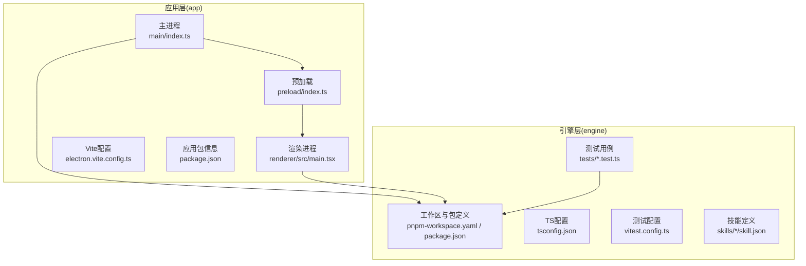
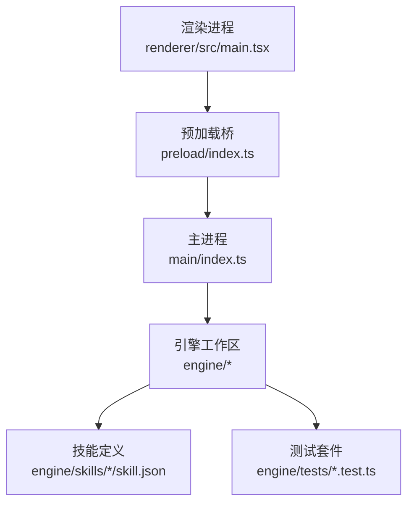
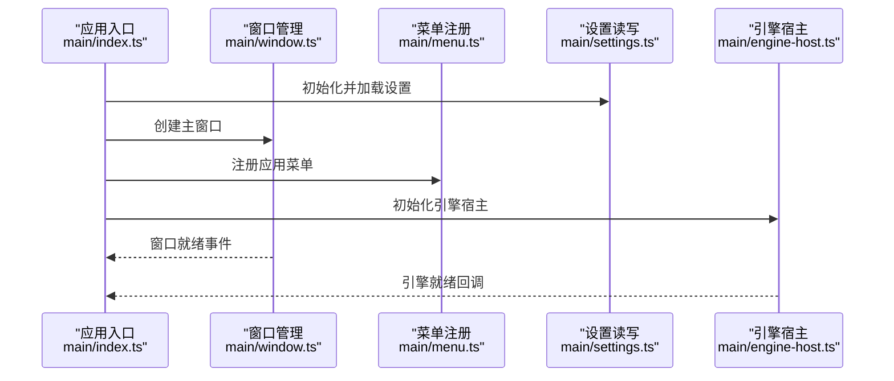
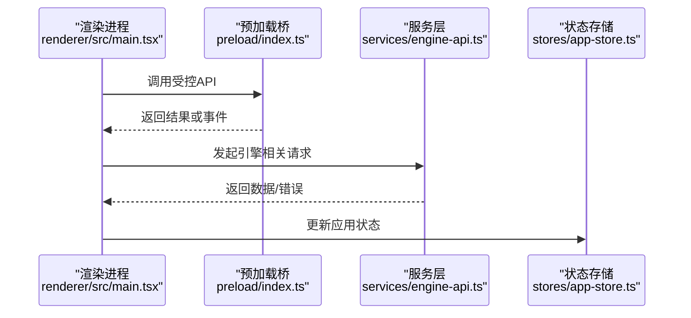
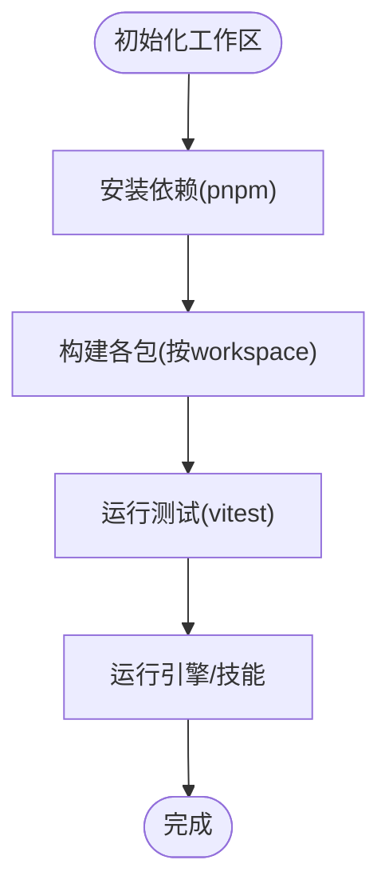
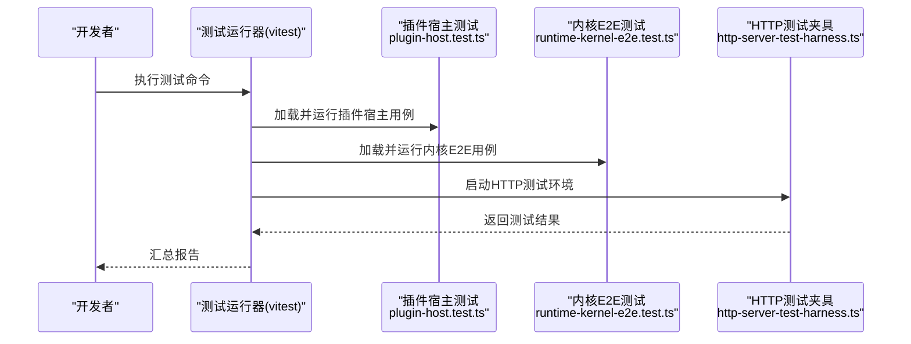
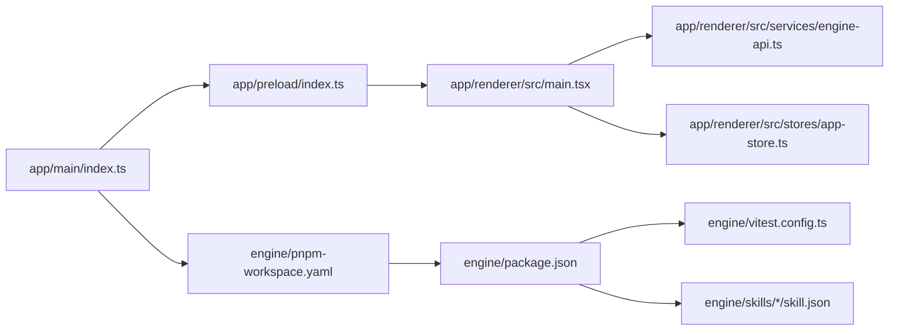

# 插件开发指南

<cite>
**本文引用的文件**   
- [app/package.json](file://app/package.json)
- [app/electron.vite.config.ts](file://app/electron.vite.config.ts)
- [app/main/index.ts](file://app/main/index.ts)
- [app/main/engine-host.ts](file://app/main/engine-host.ts)
- [app/main/menu.ts](file://app/main/menu.ts)
- [app/main/settings.ts](file://app/main/settings.ts)
- [app/main/window.ts](file://app/main/window.ts)
- [app/preload/index.ts](file://app/preload/index.ts)
- [app/renderer/src/main.tsx](file://app/renderer/src/main.tsx)
- [app/renderer/src/App.tsx](file://app/renderer/src/App.tsx)
- [app/renderer/src/services/engine-api.ts](file://app/renderer/src/services/engine-api.ts)
- [app/renderer/src/stores/app-store.ts](file://app/renderer/src/stores/app-store.ts)
- [engine/package.json](file://engine/package.json)
- [engine/pnpm-workspace.yaml](file://engine/pnpm-workspace.yaml)
- [engine/tsconfig.json](file://engine/tsconfig.json)
- [engine/vitest.config.ts](file://engine/vitest.config.ts)
- [engine/skills/code-review/skill.json](file://engine/skills/code-review/skill.json)
- [engine/skills/debugging/skill.json](file://engine/skills/debugging/skill.json)
- [engine/skills/tdd/skill.json](file://engine/skills/tdd/skill.json)
- [engine/tests/plugin-host.test.ts](file://engine/tests/plugin-host.test.ts)
- [engine/tests/runtime-kernel-e2e.test.ts](file://engine/tests/runtime-kernel-e2e.test.ts)
- [engine/tests/http-server-test-harness.ts](file://engine/tests/http-server-test-harness.ts)
</cite>

## 目录
1. [简介](#简介)
2. [项目结构](#项目结构)
3. [核心组件](#核心组件)
4. [架构总览](#架构总览)
5. [详细组件分析](#详细组件分析)
6. [依赖关系分析](#依赖关系分析)
7. [性能考虑](#性能考虑)
8. [故障排除指南](#故障排除指南)
9. [结论](#结论)
10. [附录](#附录)

## 简介
本指南面向KCoder插件开发者，覆盖从项目初始化、目录与文件组织规范、配置约定、到功能实现、测试与调试的完整流程。文档同时提供最佳实践（代码风格、命名约定、错误处理）、常见问题排查与示例模板路径，帮助快速构建稳定、可维护的插件能力。

## 项目结构
KCoder采用多包工作区与Electron前后端分离架构：
- app：Electron应用层，包含主进程、预加载脚本与渲染进程（React + Vite）。
- engine：引擎与工作区，包含多包（packages）、技能（skills）、测试（tests）与构建脚本（scripts）。

图示来源
- [app/electron.vite.config.ts:1-200](file://app/electron.vite.config.ts#L1-L200)
- [app/main/index.ts:1-200](file://app/main/index.ts#L1-L200)
- [app/preload/index.ts:1-200](file://app/preload/index.ts#L1-L200)
- [app/renderer/src/main.tsx:1-200](file://app/renderer/src/main.tsx#L1-L200)
- [engine/pnpm-workspace.yaml:1-200](file://engine/pnpm-workspace.yaml#L1-L200)
- [engine/package.json:1-200](file://engine/package.json#L1-L200)
- [engine/tsconfig.json:1-200](file://engine/tsconfig.json#L1-L200)
- [engine/vitest.config.ts:1-200](file://engine/vitest.config.ts#L1-L200)
- [engine/skills/code-review/skill.json:1-200](file://engine/skills/code-review/skill.json#L1-L200)

章节来源
- [app/package.json:1-200](file://app/package.json#L1-L200)
- [app/electron.vite.config.ts:1-200](file://app/electron.vite.config.ts#L1-L200)
- [app/main/index.ts:1-200](file://app/main/index.ts#L1-L200)
- [app/preload/index.ts:1-200](file://app/preload/index.ts#L1-L200)
- [app/renderer/src/main.tsx:1-200](file://app/renderer/src/main.tsx#L1-L200)
- [engine/package.json:1-200](file://engine/package.json#L1-L200)
- [engine/pnpm-workspace.yaml:1-200](file://engine/pnpm-workspace.yaml#L1-L200)
- [engine/tsconfig.json:1-200](file://engine/tsconfig.json#L1-L200)
- [engine/vitest.config.ts:1-200](file://engine/vitest.config.ts#L1-L200)
- [engine/skills/code-review/skill.json:1-200](file://engine/skills/code-review/skill.json#L1-L200)

## 核心组件
- 主进程入口与窗口管理：负责应用生命周期、窗口创建、菜单注册、设置读取等。
- 预加载桥接：暴露安全API给渲染进程，隔离Node能力。
- 渲染进程：基于React的UI与状态管理，调用服务层访问引擎能力。
- 引擎工作区：通过pnpm workspace聚合多个包，提供运行时、工具链、技能与测试基础设施。

章节来源
- [app/main/index.ts:1-200](file://app/main/index.ts#L1-L200)
- [app/main/window.ts:1-200](file://app/main/window.ts#L1-L200)
- [app/main/menu.ts:1-200](file://app/main/menu.ts#L1-L200)
- [app/main/settings.ts:1-200](file://app/main/settings.ts#L1-L200)
- [app/preload/index.ts:1-200](file://app/preload/index.ts#L1-L200)
- [app/renderer/src/main.tsx:1-200](file://app/renderer/src/main.tsx#L1-L200)
- [app/renderer/src/App.tsx:1-200](file://app/renderer/src/App.tsx#L1-L200)
- [engine/pnpm-workspace.yaml:1-200](file://engine/pnpm-workspace.yaml#L1-L200)
- [engine/package.json:1-200](file://engine/package.json#L1-L200)

## 架构总览
KCoder插件生态围绕“应用层—预加载桥—引擎层”的分层模型展开。渲染进程通过预加载暴露的安全接口与主进程通信，主进程再与引擎工作区交互；引擎内部以多包协作方式提供运行时、协议适配、工具与技能扩展点。

图示来源
- [app/renderer/src/main.tsx:1-200](file://app/renderer/src/main.tsx#L1-L200)
- [app/preload/index.ts:1-200](file://app/preload/index.ts#L1-L200)
- [app/main/index.ts:1-200](file://app/main/index.ts#L1-L200)
- [engine/package.json:1-200](file://engine/package.json#L1-L200)
- [engine/skills/code-review/skill.json:1-200](file://engine/skills/code-review/skill.json#L1-L200)
- [engine/tests/plugin-host.test.ts:1-200](file://engine/tests/plugin-host.test.ts#L1-L200)

## 详细组件分析

### 主进程与窗口/菜单/设置
- 职责：应用启动、窗口生命周期、菜单项注册、用户设置读写、与引擎宿主集成。
- 关键文件：
  - 主入口与引擎宿主：[app/main/index.ts](file://app/main/index.ts)、[app/main/engine-host.ts](file://app/main/engine-host.ts)
  - 窗口管理：[app/main/window.ts](file://app/main/window.ts)
  - 菜单：[app/main/menu.ts](file://app/main/menu.ts)
  - 设置：[app/main/settings.ts](file://app/main/settings.ts)

图示来源
- [app/main/index.ts:1-200](file://app/main/index.ts#L1-L200)
- [app/main/window.ts:1-200](file://app/main/window.ts#L1-L200)
- [app/main/menu.ts:1-200](file://app/main/menu.ts#L1-L200)
- [app/main/settings.ts:1-200](file://app/main/settings.ts#L1-L200)
- [app/main/engine-host.ts:1-200](file://app/main/engine-host.ts#L1-L200)

章节来源
- [app/main/index.ts:1-200](file://app/main/index.ts#L1-L200)
- [app/main/window.ts:1-200](file://app/main/window.ts#L1-L200)
- [app/main/menu.ts:1-200](file://app/main/menu.ts#L1-L200)
- [app/main/settings.ts:1-200](file://app/main/settings.ts#L1-L200)
- [app/main/engine-host.ts:1-200](file://app/main/engine-host.ts#L1-L200)

### 预加载桥与渲染进程
- 职责：预加载脚本向渲染进程暴露受控API；渲染进程使用React进行UI渲染与状态管理，并通过服务层访问引擎能力。
- 关键文件：
  - 预加载：[app/preload/index.ts](file://app/preload/index.ts)
  - 渲染入口与根组件：[app/renderer/src/main.tsx](file://app/renderer/src/main.tsx)、[app/renderer/src/App.tsx](file://app/renderer/src/App.tsx)
  - 服务层与状态：[app/renderer/src/services/engine-api.ts](file://app/renderer/src/services/engine-api.ts)、[app/renderer/src/stores/app-store.ts](file://app/renderer/src/stores/app-store.ts)

图示来源
- [app/preload/index.ts:1-200](file://app/preload/index.ts#L1-L200)
- [app/renderer/src/main.tsx:1-200](file://app/renderer/src/main.tsx#L1-L200)
- [app/renderer/src/App.tsx:1-200](file://app/renderer/src/App.tsx#L1-L200)
- [app/renderer/src/services/engine-api.ts:1-200](file://app/renderer/src/services/engine-api.ts#L1-L200)
- [app/renderer/src/stores/app-store.ts:1-200](file://app/renderer/src/stores/app-store.ts#L1-L200)

章节来源
- [app/preload/index.ts:1-200](file://app/preload/index.ts#L1-L200)
- [app/renderer/src/main.tsx:1-200](file://app/renderer/src/main.tsx#L1-L200)
- [app/renderer/src/App.tsx:1-200](file://app/renderer/src/App.tsx#L1-L200)
- [app/renderer/src/services/engine-api.ts:1-200](file://app/renderer/src/services/engine-api.ts#L1-L200)
- [app/renderer/src/stores/app-store.ts:1-200](file://app/renderer/src/stores/app-store.ts#L1-L200)

### 引擎工作区与多包协作
- 职责：通过pnpm workspace聚合多个包，统一TypeScript配置与测试框架，提供运行时、协议适配、工具与技能扩展点。
- 关键文件：
  - 工作区与包信息：[engine/pnpm-workspace.yaml](file://engine/pnpm-workspace.yaml)、[engine/package.json](file://engine/package.json)
  - TS配置：[engine/tsconfig.json](file://engine/tsconfig.json)
  - 测试配置：[engine/vitest.config.ts](file://engine/vitest.config.ts)
  - 技能定义示例：[engine/skills/code-review/skill.json](file://engine/skills/code-review/skill.json)、[engine/skills/debugging/skill.json](file://engine/skills/debugging/skill.json)、[engine/skills/tdd/skill.json](file://engine/skills/tdd/skill.json)

图示来源
- [engine/pnpm-workspace.yaml:1-200](file://engine/pnpm-workspace.yaml#L1-L200)
- [engine/package.json:1-200](file://engine/package.json#L1-L200)
- [engine/tsconfig.json:1-200](file://engine/tsconfig.json#L1-L200)
- [engine/vitest.config.ts:1-200](file://engine/vitest.config.ts#L1-L200)
- [engine/skills/code-review/skill.json:1-200](file://engine/skills/code-review/skill.json#L1-L200)

章节来源
- [engine/pnpm-workspace.yaml:1-200](file://engine/pnpm-workspace.yaml#L1-L200)
- [engine/package.json:1-200](file://engine/package.json#L1-L200)
- [engine/tsconfig.json:1-200](file://engine/tsconfig.json#L1-L200)
- [engine/vitest.config.ts:1-200](file://engine/vitest.config.ts#L1-L200)
- [engine/skills/code-review/skill.json:1-200](file://engine/skills/code-review/skill.json#L1-L200)
- [engine/skills/debugging/skill.json:1-200](file://engine/skills/debugging/skill.json#L1-L200)
- [engine/skills/tdd/skill.json:1-200](file://engine/skills/tdd/skill.json#L1-L200)

### 插件测试方法
- 单元测试：在engine/tests下使用vitest编写，覆盖插件宿主、运行时内核、HTTP服务等。
- 集成测试：通过测试夹具与模拟环境验证端到端流程。
- 模拟环境搭建：参考HTTP服务器测试夹具与循环测试夹具。

图示来源
- [engine/vitest.config.ts:1-200](file://engine/vitest.config.ts#L1-L200)
- [engine/tests/plugin-host.test.ts:1-200](file://engine/tests/plugin-host.test.ts#L1-L200)
- [engine/tests/runtime-kernel-e2e.test.ts:1-200](file://engine/tests/runtime-kernel-e2e.test.ts#L1-L200)
- [engine/tests/http-server-test-harness.ts:1-200](file://engine/tests/http-server-test-harness.ts#L1-L200)

章节来源
- [engine/vitest.config.ts:1-200](file://engine/vitest.config.ts#L1-L200)
- [engine/tests/plugin-host.test.ts:1-200](file://engine/tests/plugin-host.test.ts#L1-L200)
- [engine/tests/runtime-kernel-e2e.test.ts:1-200](file://engine/tests/runtime-kernel-e2e.test.ts#L1-L200)
- [engine/tests/http-server-test-harness.ts:1-200](file://engine/tests/http-server-test-harness.ts#L1-L200)

### 插件调试技巧
- 日志记录：在主进程与渲染进程中分别输出结构化日志，便于定位问题。
- 断点调试：使用Electron内置调试器对主进程与渲染进程分别附加调试会话。
- 性能分析：结合浏览器开发者工具的性能面板与Node.js性能分析工具，识别瓶颈。

章节来源
- [app/main/index.ts:1-200](file://app/main/index.ts#L1-L200)
- [app/renderer/src/main.tsx:1-200](file://app/renderer/src/main.tsx#L1-L200)

## 依赖关系分析
- 应用层依赖：
  - Electron主进程与渲染进程通过预加载桥通信。
  - 渲染进程依赖服务层与状态管理模块。
- 引擎层依赖：
  - pnpm workspace统一管理包版本与构建顺序。
  - vitest作为测试框架，集中配置测试行为。
  - 技能定义通过JSON描述，供引擎加载与调度。

图示来源
- [app/main/index.ts:1-200](file://app/main/index.ts#L1-L200)
- [app/preload/index.ts:1-200](file://app/preload/index.ts#L1-L200)
- [app/renderer/src/main.tsx:1-200](file://app/renderer/src/main.tsx#L1-L200)
- [app/renderer/src/services/engine-api.ts:1-200](file://app/renderer/src/services/engine-api.ts#L1-L200)
- [app/renderer/src/stores/app-store.ts:1-200](file://app/renderer/src/stores/app-store.ts#L1-L200)
- [engine/pnpm-workspace.yaml:1-200](file://engine/pnpm-workspace.yaml#L1-L200)
- [engine/package.json:1-200](file://engine/package.json#L1-L200)
- [engine/vitest.config.ts:1-200](file://engine/vitest.config.ts#L1-L200)
- [engine/skills/code-review/skill.json:1-200](file://engine/skills/code-review/skill.json#L1-L200)

章节来源
- [app/main/index.ts:1-200](file://app/main/index.ts#L1-L200)
- [app/preload/index.ts:1-200](file://app/preload/index.ts#L1-L200)
- [app/renderer/src/main.tsx:1-200](file://app/renderer/src/main.tsx#L1-L200)
- [app/renderer/src/services/engine-api.ts:1-200](file://app/renderer/src/services/engine-api.ts#L1-L200)
- [app/renderer/src/stores/app-store.ts:1-200](file://app/renderer/src/stores/app-store.ts#L1-L200)
- [engine/pnpm-workspace.yaml:1-200](file://engine/pnpm-workspace.yaml#L1-L200)
- [engine/package.json:1-200](file://engine/package.json#L1-L200)
- [engine/vitest.config.ts:1-200](file://engine/vitest.config.ts#L1-L200)
- [engine/skills/code-review/skill.json:1-200](file://engine/skills/code-review/skill.json#L1-L200)

## 性能考虑
- 渲染进程优化：避免频繁重渲染，合理使用状态管理与缓存策略。
- 主进程资源管理：合理控制窗口数量与生命周期，减少内存占用。
- 引擎并发与I/O：利用异步与非阻塞I/O，避免长时间阻塞主线程。
- 测试性能：并行执行测试用例，按需加载测试夹具，缩短反馈时间。

## 故障排除指南
- 插件无法加载：检查插件宿主与引擎工作区依赖是否一致，确认技能定义格式正确。
- 渲染进程无响应：查看预加载桥暴露的API是否正确调用，确认服务层错误处理逻辑。
- 测试失败：核对vitest配置与测试夹具，确保HTTP服务与环境变量可用。
- 日志缺失：确认主进程与渲染进程的日志输出通道已启用，必要时增加上下文信息。

章节来源
- [engine/tests/plugin-host.test.ts:1-200](file://engine/tests/plugin-host.test.ts#L1-L200)
- [engine/tests/runtime-kernel-e2e.test.ts:1-200](file://engine/tests/runtime-kernel-e2e.test.ts#L1-L200)
- [engine/tests/http-server-test-harness.ts:1-200](file://engine/tests/http-server-test-harness.ts#L1-L200)
- [app/main/index.ts:1-200](file://app/main/index.ts#L1-L200)
- [app/renderer/src/main.tsx:1-200](file://app/renderer/src/main.tsx#L1-L200)

## 结论
通过分层架构与多包工作区，KCoder为插件开发提供了清晰的边界与扩展点。遵循本文的组织规范、最佳实践与测试调试流程，可显著提升插件质量与交付效率。

## 附录
- 配置文件格式建议：
  - 应用层：在应用包中声明依赖与脚本，使用Vite配置构建流程。
  - 引擎层：在工作区中统一TS与测试配置，技能定义使用JSON描述元数据。
- 源代码结构建议：
  - 主进程：按职责拆分入口、窗口、菜单、设置与宿主模块。
  - 渲染进程：按功能划分组件、服务与状态管理。
  - 引擎：按包划分领域能力，保持高内聚低耦合。
- 资源文件管理：
  - 静态资源放入对应包的资源目录，通过构建工具打包与引用。
- 开发示例与模板：
  - 技能定义模板：参考现有技能JSON文件。
  - 测试夹具模板：参考HTTP服务器测试夹具与循环测试夹具。

章节来源
- [app/package.json:1-200](file://app/package.json#L1-L200)
- [app/electron.vite.config.ts:1-200](file://app/electron.vite.config.ts#L1-L200)
- [engine/skills/code-review/skill.json:1-200](file://engine/skills/code-review/skill.json#L1-L200)
- [engine/skills/debugging/skill.json:1-200](file://engine/skills/debugging/skill.json#L1-L200)
- [engine/skills/tdd/skill.json:1-200](file://engine/skills/tdd/skill.json#L1-L200)
- [engine/tests/http-server-test-harness.ts:1-200](file://engine/tests/http-server-test-harness.ts#L1-L200)