# 插件架构设计

<cite>
**本文引用的文件**   
- [engine-host.ts](file://app/main/engine-host.ts)
- [index.ts](file://app/main/index.ts)
- [menu.ts](file://app/main/menu.ts)
- [settings.ts](file://app/main/settings.ts)
- [window.ts](file://app/main/window.ts)
- [index.ts](file://app/preload/index.ts)
- [App.tsx](file://app/renderer/src/App.tsx)
- [main.tsx](file://app/renderer/src/main.tsx)
- [engine-api.ts](file://app/renderer/src/services/engine-api.ts)
- [plugin-host.test.ts](file://engine/tests/plugin-host.test.ts)
- [runtime-kernel-isolation.test.ts](file://engine/tests/runtime-kernel-isolation.test.ts)
- [http-server.test.ts](file://engine/tests/http-server.test.ts)
- [mcp-tool-provider.test.ts](file://engine/tests/mcp-tool-provider.test.ts)
- [skill-runtime.test.ts](file://engine/tests/skill-runtime.test.ts)
- [tool-dispatch-errors.test.ts](file://engine/tests/tool-dispatch-errors.test.ts)
- [delegation-runtime.test.ts](file://engine/tests/delegation-runtime.test.ts)
- [turn-event-bus.test.ts](file://engine/tests/turn-event-bus.test.ts)
- [capability-registry.test.ts](file://engine/tests/capability-registry.test.ts)
- [marketplace.test.ts](file://engine/tests/marketplace.test.ts)
</cite>

## 目录
1. [简介](#简介)
2. [项目结构](#项目结构)
3. [核心组件](#核心组件)
4. [架构总览](#架构总览)
5. [详细组件分析](#详细组件分析)
6. [依赖分析](#依赖分析)
7. [性能考虑](#性能考虑)
8. [故障排查指南](#故障排查指南)
9. [结论](#结论)
10. [附录](#附录)

## 简介
本文件面向KCoder的插件架构，系统化阐述插件系统的设计理念与实现要点，包括：
- 插件接口定义、生命周期管理、沙箱机制与安全隔离
- 插件宿主（PluginHost）的发现、加载、依赖解析与运行期治理
- 插件通信协议：IPC、事件总线、消息传递
- 插件API文档化：公共方法、事件回调、配置项
- 权限模型与访问控制
- 扩展点与自定义能力
- 性能优化策略与资源管理

说明：由于仓库未提供完整的插件宿主源码，本文基于现有工程结构与测试用例进行架构级分析与设计建议，确保可落地且与现有代码组织一致。

## 项目结构
KCoder采用Electron多进程架构，前端渲染层通过预加载脚本与主进程交互，引擎侧以monorepo形式组织，包含大量运行时与工具链相关包与测试。

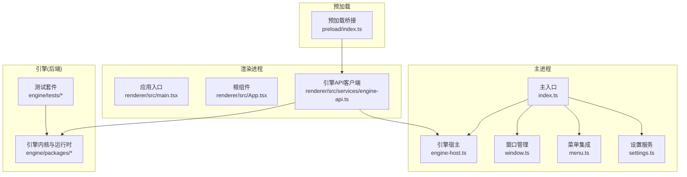

图示来源
- [index.ts](file://app/main/index.ts)
- [engine-host.ts](file://app/main/engine-host.ts)
- [window.ts](file://app/main/window.ts)
- [menu.ts](file://app/main/menu.ts)
- [settings.ts](file://app/main/settings.ts)
- [index.ts](file://app/preload/index.ts)
- [main.tsx](file://app/renderer/src/main.tsx)
- [App.tsx](file://app/renderer/src/App.tsx)
- [engine-api.ts](file://app/renderer/src/services/engine-api.ts)

章节来源
- [index.ts](file://app/main/index.ts)
- [engine-host.ts](file://app/main/engine-host.ts)
- [window.ts](file://app/main/window.ts)
- [menu.ts](file://app/main/menu.ts)
- [settings.ts](file://app/main/settings.ts)
- [index.ts](file://app/preload/index.ts)
- [main.tsx](file://app/renderer/src/main.tsx)
- [App.tsx](file://app/renderer/src/App.tsx)
- [engine-api.ts](file://app/renderer/src/services/engine-api.ts)

## 核心组件
- 插件宿主（PluginHost）：负责插件发现、清单校验、依赖解析、生命周期编排、权限与沙箱隔离、错误恢复与监控。
- 插件通信层：封装IPC通道、事件总线与消息协议，统一暴露给插件与宿主。
- 插件API门面：向插件暴露受控能力（文件系统、网络、工具调用、UI注入等），并实施最小权限原则。
- 插件注册与能力中心：集中管理插件元数据、能力声明、版本兼容性与热更新。
- 安全与沙箱：基于进程/VM隔离、白名单能力、资源配额与审计日志。
- 可观测性：指标、追踪、诊断与崩溃恢复。

章节来源
- [plugin-host.test.ts](file://engine/tests/plugin-host.test.ts)
- [runtime-kernel-isolation.test.ts](file://engine/tests/runtime-kernel-isolation.test.ts)
- [http-server.test.ts](file://engine/tests/http-server.test.ts)
- [mcp-tool-provider.test.ts](file://engine/tests/mcp-tool-provider.test.ts)
- [skill-runtime.test.ts](file://engine/tests/skill-runtime.test.ts)
- [tool-dispatch-errors.test.ts](file://engine/tests/tool-dispatch-errors.test.ts)
- [delegation-runtime.test.ts](file://engine/tests/delegation-runtime.test.ts)
- [turn-event-bus.test.ts](file://engine/tests/turn-event-bus.test.ts)
- [capability-registry.test.ts](file://engine/tests/capability-registry.test.ts)
- [marketplace.test.ts](file://engine/tests/marketplace.test.ts)

## 架构总览
下图展示从渲染进程到插件宿主的端到端调用路径，以及插件在宿主内的执行边界。

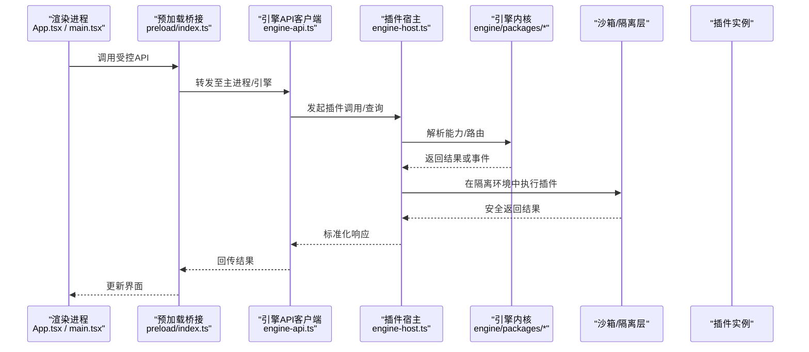

图示来源
- [engine-api.ts](file://app/renderer/src/services/engine-api.ts)
- [index.ts](file://app/preload/index.ts)
- [engine-host.ts](file://app/main/engine-host.ts)
- [App.tsx](file://app/renderer/src/App.tsx)
- [main.tsx](file://app/renderer/src/main.tsx)

## 详细组件分析

### 插件宿主（PluginHost）
职责
- 插件发现：扫描本地/远程仓库、市场、技能包；解析清单与签名。
- 依赖解析：语义化版本约束、冲突检测、拓扑排序与按需加载。
- 生命周期：初始化、准备、启动、运行、暂停、停止、卸载、重启。
- 权限与沙箱：能力白名单、资源配额、网络/IO限制、审计与熔断。
- 错误处理：异常捕获、降级策略、快照与恢复、可观测上报。
- 事件总线：订阅/发布宿主与插件间事件，支持跨进程广播。

关键流程（发现与加载）
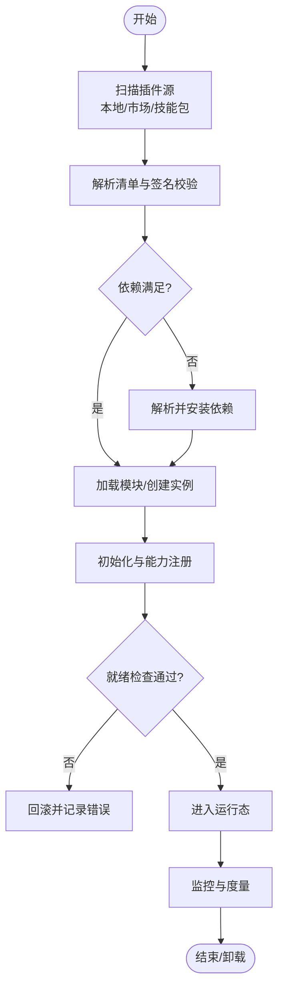

图示来源
- [plugin-host.test.ts](file://engine/tests/plugin-host.test.ts)
- [capability-registry.test.ts](file://engine/tests/capability-registry.test.ts)
- [marketplace.test.ts](file://engine/tests/marketplace.test.ts)

章节来源
- [plugin-host.test.ts](file://engine/tests/plugin-host.test.ts)
- [capability-registry.test.ts](file://engine/tests/capability-registry.test.ts)
- [marketplace.test.ts](file://engine/tests/marketplace.test.ts)

### 插件通信协议（IPC、事件总线、消息）
- IPC通道：渲染进程通过预加载桥接到主进程，再由主进程将请求路由到插件宿主。
- 事件总线：基于主题的事件分发，支持插件与宿主双向通信，具备幂等与去重保障。
- 消息协议：统一的请求/响应/事件格式，含会话ID、时间戳、优先级、重试与超时控制。

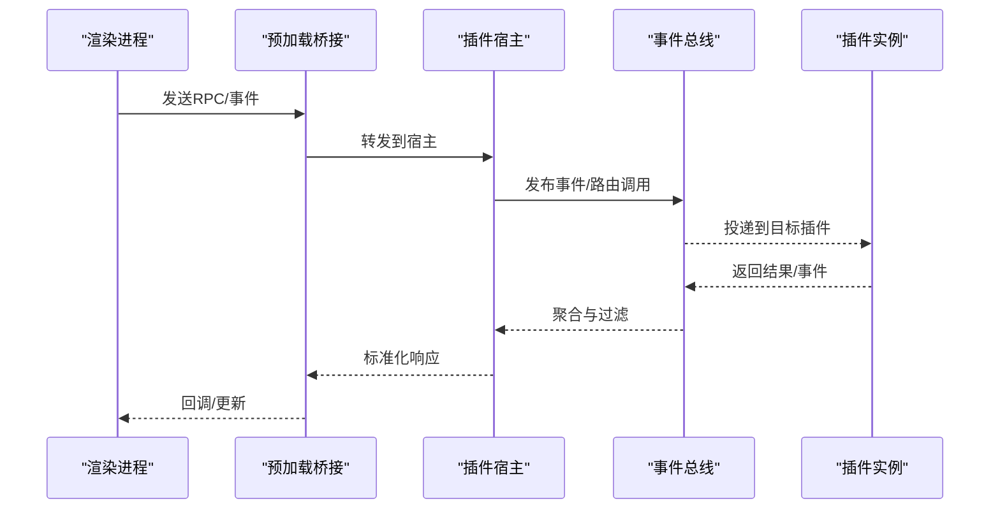

图示来源
- [index.ts](file://app/preload/index.ts)
- [engine-api.ts](file://app/renderer/src/services/engine-api.ts)
- [engine-host.ts](file://app/main/engine-host.ts)
- [turn-event-bus.test.ts](file://engine/tests/turn-event-bus.test.ts)

章节来源
- [index.ts](file://app/preload/index.ts)
- [engine-api.ts](file://app/renderer/src/services/engine-api.ts)
- [engine-host.ts](file://app/main/engine-host.ts)
- [turn-event-bus.test.ts](file://engine/tests/turn-event-bus.test.ts)

### 插件API与能力门面
- 公共方法：受控的文件读写、搜索、命令执行、调试信息获取、UI注入等。
- 事件回调：生命周期事件、任务进度、错误告警、用户操作事件。
- 配置选项：插件清单中的能力声明、权限范围、资源配额、版本约束、环境变量。
- 能力注册：通过能力中心动态注册与发现，支持版本兼容与灰度发布。

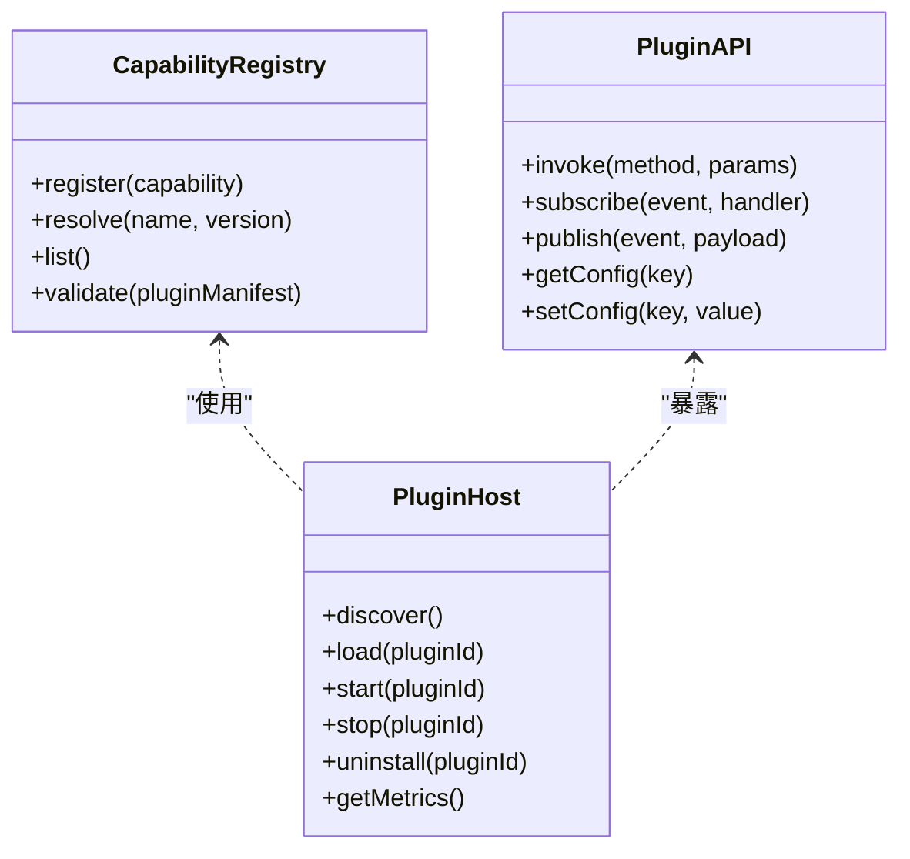

图示来源
- [capability-registry.test.ts](file://engine/tests/capability-registry.test.ts)
- [plugin-host.test.ts](file://engine/tests/plugin-host.test.ts)

章节来源
- [capability-registry.test.ts](file://engine/tests/capability-registry.test.ts)
- [plugin-host.test.ts](file://engine/tests/plugin-host.test.ts)

### 沙箱机制与安全隔离
- 进程/VM隔离：插件在独立上下文执行，限制全局对象与原生模块访问。
- 能力白名单：仅允许声明的能力与方法，拒绝越权调用。
- 资源配额：CPU、内存、I/O、网络带宽与并发上限。
- 审计与熔断：全链路日志、指标采集、异常熔断与自动恢复。
- 传输安全：IPC鉴权、消息签名与防重放。

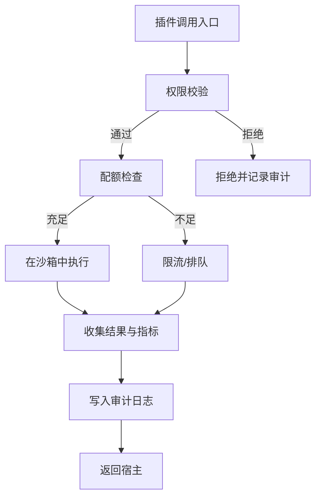

图示来源
- [runtime-kernel-isolation.test.ts](file://engine/tests/runtime-kernel-isolation.test.ts)
- [tool-dispatch-errors.test.ts](file://engine/tests/tool-dispatch-errors.test.ts)

章节来源
- [runtime-kernel-isolation.test.ts](file://engine/tests/runtime-kernel-isolation.test.ts)
- [tool-dispatch-errors.test.ts](file://engine/tests/tool-dispatch-errors.test.ts)

### 插件权限模型与访问控制
- 角色与范围：按插件粒度授予能力集合，支持细粒度方法级授权。
- 动态授权：运行时根据上下文调整权限，支持临时提升与回收。
- 审计与合规：所有敏感操作留痕，支持导出与审查。
- 最小权限：默认拒绝，显式声明即允许。

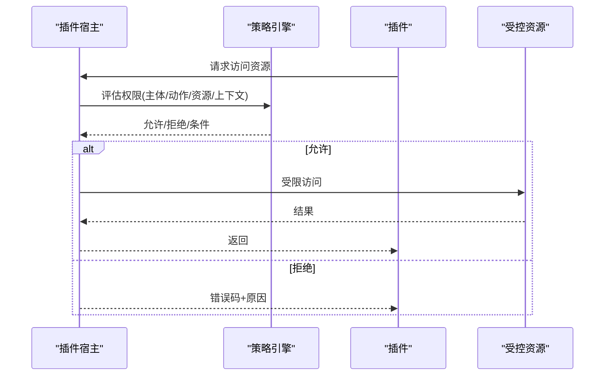

图示来源
- [capability-registry.test.ts](file://engine/tests/capability-registry.test.ts)
- [plugin-host.test.ts](file://engine/tests/plugin-host.test.ts)

章节来源
- [capability-registry.test.ts](file://engine/tests/capability-registry.test.ts)
- [plugin-host.test.ts](file://engine/tests/plugin-host.test.ts)

### 插件发现、加载与依赖解析
- 发现：本地目录、远程仓库、市场与技能包；支持增量扫描与缓存。
- 清单：版本、能力、依赖、权限、签名、来源可信度。
- 依赖：语义化版本、冲突检测、循环依赖规避、按需懒加载。
- 加载：模块化加载、热重载、回滚与快照。

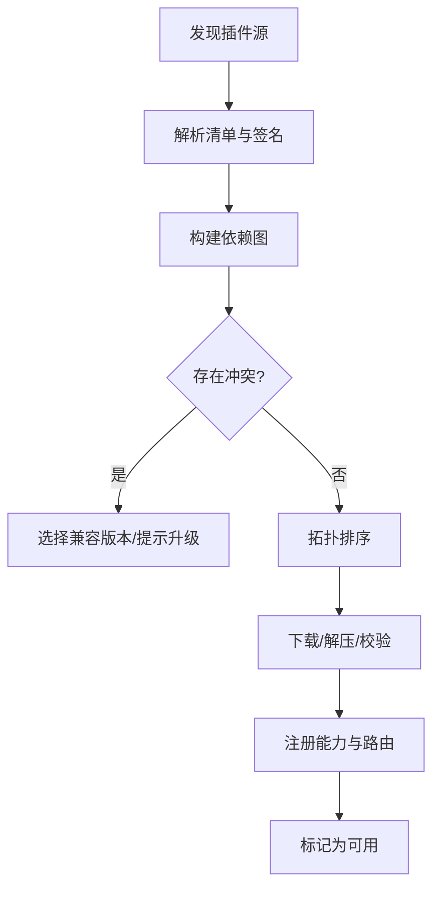

图示来源
- [marketplace.test.ts](file://engine/tests/marketplace.test.ts)
- [plugin-host.test.ts](file://engine/tests/plugin-host.test.ts)

章节来源
- [marketplace.test.ts](file://engine/tests/marketplace.test.ts)
- [plugin-host.test.ts](file://engine/tests/plugin-host.test.ts)

### 插件通信协议细节
- 请求/响应：包含唯一ID、类型、载荷、超时、重试策略。
- 事件：主题命名空间、过滤器、去重、持久化与回放。
- 错误：标准化错误码、堆栈脱敏、可观测上报。
- 安全：令牌绑定、来源校验、速率限制。

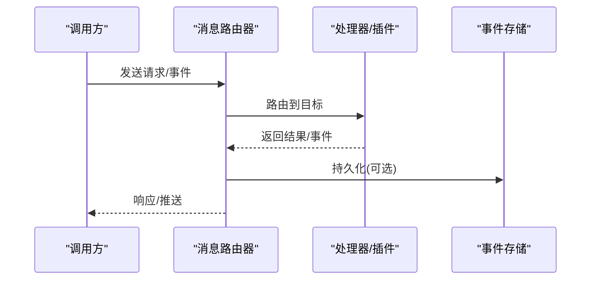

图示来源
- [turn-event-bus.test.ts](file://engine/tests/turn-event-bus.test.ts)
- [http-server.test.ts](file://engine/tests/http-server.test.ts)

章节来源
- [turn-event-bus.test.ts](file://engine/tests/turn-event-bus.test.ts)
- [http-server.test.ts](file://engine/tests/http-server.test.ts)

### 工具与技能提供者（MCP/Skill）
- MCP工具提供者：将外部工具以标准协议暴露给宿主，支持参数校验与结果归一化。
- 技能运行时：编排复杂工作流，组合多个工具与模型调用，具备状态管理与补偿。

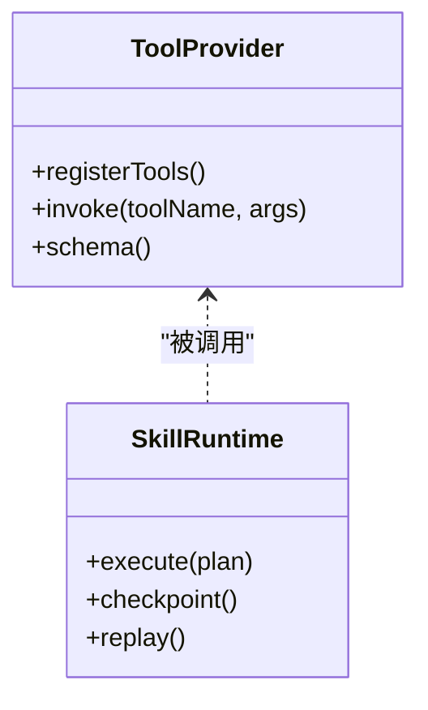

图示来源
- [mcp-tool-provider.test.ts](file://engine/tests/mcp-tool-provider.test.ts)
- [skill-runtime.test.ts](file://engine/tests/skill-runtime.test.ts)

章节来源
- [mcp-tool-provider.test.ts](file://engine/tests/mcp-tool-provider.test.ts)
- [skill-runtime.test.ts](file://engine/tests/skill-runtime.test.ts)

### 委托与子代理（Delegation）
- 委托运行时：将复杂任务委派给子代理，支持并行、超时与失败重试。
- 状态机：明确的状态转换与一致性保证。

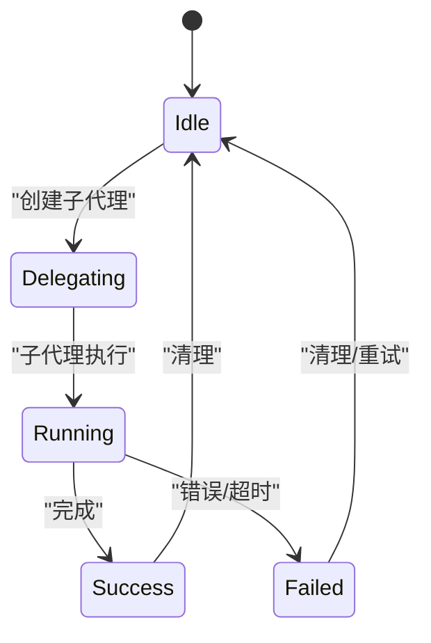

图示来源
- [delegation-runtime.test.ts](file://engine/tests/delegation-runtime.test.ts)

章节来源
- [delegation-runtime.test.ts](file://engine/tests/delegation-runtime.test.ts)

## 依赖分析
- 渲染层依赖预加载桥接与引擎API客户端，间接依赖插件宿主。
- 插件宿主依赖能力注册表、事件总线、HTTP服务器与工具提供者。
- 测试覆盖验证了隔离、错误处理、事件总线、能力注册与市场行为。

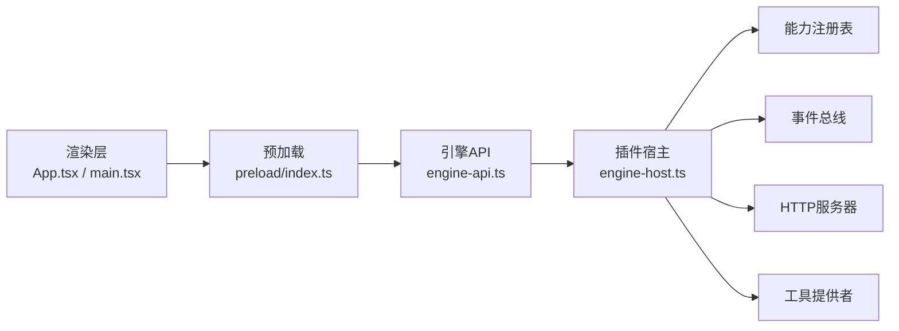

图示来源
- [App.tsx](file://app/renderer/src/App.tsx)
- [main.tsx](file://app/renderer/src/main.tsx)
- [index.ts](file://app/preload/index.ts)
- [engine-api.ts](file://app/renderer/src/services/engine-api.ts)
- [engine-host.ts](file://app/main/engine-host.ts)
- [capability-registry.test.ts](file://engine/tests/capability-registry.test.ts)
- [turn-event-bus.test.ts](file://engine/tests/turn-event-bus.test.ts)
- [http-server.test.ts](file://engine/tests/http-server.test.ts)
- [mcp-tool-provider.test.ts](file://engine/tests/mcp-tool-provider.test.ts)

章节来源
- [App.tsx](file://app/renderer/src/App.tsx)
- [main.tsx](file://app/renderer/src/main.tsx)
- [index.ts](file://app/preload/index.ts)
- [engine-api.ts](file://app/renderer/src/services/engine-api.ts)
- [engine-host.ts](file://app/main/engine-host.ts)
- [capability-registry.test.ts](file://engine/tests/capability-registry.test.ts)
- [turn-event-bus.test.ts](file://engine/tests/turn-event-bus.test.ts)
- [http-server.test.ts](file://engine/tests/http-server.test.ts)
- [mcp-tool-provider.test.ts](file://engine/tests/mcp-tool-provider.test.ts)

## 性能考虑
- 按需加载与懒初始化：减少冷启动开销，延迟非关键能力。
- 连接池与复用：IPC与HTTP连接复用，降低握手成本。
- 批处理与合并：批量事件与请求合并，降低序列化与调度开销。
- 缓存与索引：能力清单、依赖图与结果缓存，避免重复计算。
- 资源配额与限流：防止单插件占用过多资源，保障整体稳定性。
- 异步与背压：高吞吐场景下采用背压与队列控制，避免内存膨胀。
- 可观测性：采样指标与分布式追踪，定位瓶颈与热点。

[本节为通用指导，不直接分析具体文件]

## 故障排查指南
- 插件加载失败：检查清单签名、依赖版本与权限声明；查看宿主日志与审计记录。
- 权限拒绝：确认能力白名单与动态授权策略；核对上下文与资源标识。
- 事件丢失或重复：检查事件总线去重与持久化策略；确认消费者幂等性。
- 工具调用异常：查看工具提供者错误码与堆栈；启用重试与熔断策略。
- 性能退化：分析指标与追踪，识别热点方法与阻塞点；调整配额与并发。

章节来源
- [plugin-host.test.ts](file://engine/tests/plugin-host.test.ts)
- [tool-dispatch-errors.test.ts](file://engine/tests/tool-dispatch-errors.test.ts)
- [turn-event-bus.test.ts](file://engine/tests/turn-event-bus.test.ts)
- [runtime-kernel-isolation.test.ts](file://engine/tests/runtime-kernel-isolation.test.ts)

## 结论
KCoder的插件架构以“能力为中心、安全为底线、可观测为保障”为核心设计理念。通过插件宿主统一管理插件生命周期与权限，结合事件总线与标准化通信协议，实现了可扩展、可治理、可演进的插件生态。建议在后续迭代中持续完善清单规范、能力契约与自动化测试，以提升插件质量与用户体验。

[本节为总结性内容，不直接分析具体文件]

## 附录
- 术语
  - 插件：由第三方提供的功能单元，遵循宿主定义的接口与契约。
  - 能力：宿主对外暴露的可调用方法或资源的抽象。
  - 清单：描述插件元数据、依赖、权限与版本的配置文件。
  - 沙箱：隔离插件执行环境的机制，限制对宿主资源的访问。
- 参考测试
  - 插件宿主与能力注册：[plugin-host.test.ts](file://engine/tests/plugin-host.test.ts)、[capability-registry.test.ts](file://engine/tests/capability-registry.test.ts)
  - 事件总线与HTTP服务器：[turn-event-bus.test.ts](file://engine/tests/turn-event-bus.test.ts)、[http-server.test.ts](file://engine/tests/http-server.test.ts)
  - 工具提供者与技能运行时：[mcp-tool-provider.test.ts](file://engine/tests/mcp-tool-provider.test.ts)、[skill-runtime.test.ts](file://engine/tests/skill-runtime.test.ts)
  - 委托与隔离：[delegation-runtime.test.ts](file://engine/tests/delegation-runtime.test.ts)、[runtime-kernel-isolation.test.ts](file://engine/tests/runtime-kernel-isolation.test.ts)