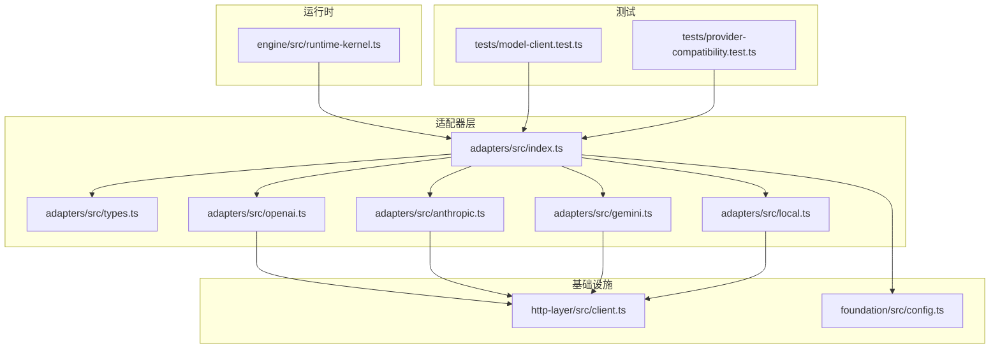
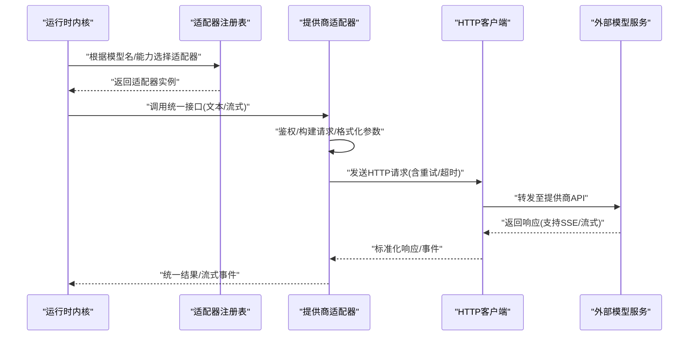
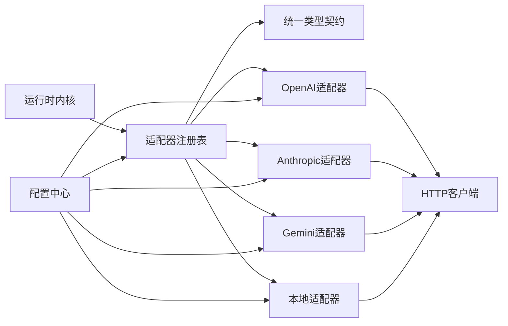

# LLM提供商集成

<cite>
**本文引用的文件**   
- [engine/packages/adapters/README.md](file://engine/packages/adapters/README.md)
- [engine/packages/adapters/src/index.ts](file://engine/packages/adapters/src/index.ts)
- [engine/packages/adapters/src/types.ts](file://engine/packages/adapters/src/types.ts)
- [engine/packages/adapters/src/openai.ts](file://engine/packages/adapters/src/openai.ts)
- [engine/packages/adapters/src/anthropic.ts](file://engine/packages/adapters/src/anthropic.ts)
- [engine/packages/adapters/src/gemini.ts](file://engine/packages/adapters/src/gemini.ts)
- [engine/packages/adapters/src/local.ts](file://engine/packages/adapters/src/local.ts)
- [engine/packages/http-layer/src/client.ts](file://engine/packages/http-layer/src/client.ts)
- [engine/packages/foundation/src/config.ts](file://engine/packages/foundation/src/config.ts)
- [engine/packages/engine/src/runtime-kernel.ts](file://engine/packages/engine/src/runtime-kernel.ts)
- [engine/tests/model-client.test.ts](file://engine/tests/model-client.test.ts)
- [engine/tests/provider-compatibility.test.ts](file://engine/tests/provider-compatibility.test.ts)
</cite>

## 目录
1. [简介](#简介)
2. [项目结构](#项目结构)
3. [核心组件](#核心组件)
4. [架构总览](#架构总览)
5. [详细组件分析](#详细组件分析)
6. [依赖关系分析](#依赖关系分析)
7. [性能考虑](#性能考虑)
8. [故障排查指南](#故障排查指南)
9. [结论](#结论)
10. [附录](#附录)

## 简介
本技术文档面向KCoder的LLM提供商集成，聚焦适配器模式在统一模型接口、认证与配置、请求/响应转换、流式处理、错误重试与超时控制等方面的实现。文档覆盖OpenAI、Anthropic、Google Gemini以及本地部署模型的接入方式，并提供注册新提供商的完整流程、最佳实践与常见问题排查方法。

## 项目结构
KCoder引擎采用多包工作区组织，LLM适配层位于 engine/packages/adapters，HTTP客户端位于 engine/packages/http-layer，运行时内核位于 engine/packages/engine，基础配置位于 engine/packages/foundation。测试用例集中在 engine/tests。

图表来源
- [engine/packages/adapters/src/index.ts](file://engine/packages/adapters/src/index.ts)
- [engine/packages/adapters/src/types.ts](file://engine/packages/adapters/src/types.ts)
- [engine/packages/adapters/src/openai.ts](file://engine/packages/adapters/src/openai.ts)
- [engine/packages/adapters/src/anthropic.ts](file://engine/packages/adapters/src/anthropic.ts)
- [engine/packages/adapters/src/gemini.ts](file://engine/packages/adapters/src/gemini.ts)
- [engine/packages/adapters/src/local.ts](file://engine/packages/adapters/src/local.ts)
- [engine/packages/http-layer/src/client.ts](file://engine/packages/http-layer/src/client.ts)
- [engine/packages/foundation/src/config.ts](file://engine/packages/foundation/src/config.ts)
- [engine/packages/engine/src/runtime-kernel.ts](file://engine/packages/engine/src/runtime-kernel.ts)
- [engine/tests/model-client.test.ts](file://engine/tests/model-client.test.ts)
- [engine/tests/provider-compatibility.test.ts](file://engine/tests/provider-compatibility.test.ts)

章节来源
- [engine/packages/adapters/README.md](file://engine/packages/adapters/README.md)
- [engine/packages/adapters/src/index.ts](file://engine/packages/adapters/src/index.ts)
- [engine/packages/adapters/src/types.ts](file://engine/packages/adapters/src/types.ts)
- [engine/packages/http-layer/src/client.ts](file://engine/packages/http-layer/src/client.ts)
- [engine/packages/foundation/src/config.ts](file://engine/packages/foundation/src/config.ts)
- [engine/packages/engine/src/runtime-kernel.ts](file://engine/packages/engine/src/runtime-kernel.ts)
- [engine/tests/model-client.test.ts](file://engine/tests/model-client.test.ts)
- [engine/tests/provider-compatibility.test.ts](file://engine/tests/provider-compatibility.test.ts)

## 核心组件
- 统一类型与契约：定义模型调用、消息、工具调用、流式事件等通用数据结构，确保上层与具体提供商解耦。
- 适配器工厂与注册表：集中管理各提供商适配器实例，提供按名称或能力选择适配器的能力。
- 提供商特定适配器：对OpenAI、Anthropic、Gemini、本地模型进行协议适配（URL、头部、鉴权、请求体、响应体、流式格式）。
- HTTP客户端封装：复用连接池、重试、超时、指标上报等横切能力。
- 配置中心：从配置源加载API密钥、端点、并发限制等参数。
- 运行时内核：编排任务、路由到具体适配器、聚合结果与事件。

章节来源
- [engine/packages/adapters/src/types.ts](file://engine/packages/adapters/src/types.ts)
- [engine/packages/adapters/src/index.ts](file://engine/packages/adapters/src/index.ts)
- [engine/packages/http-layer/src/client.ts](file://engine/packages/http-layer/src/client.ts)
- [engine/packages/foundation/src/config.ts](file://engine/packages/foundation/src/config.ts)
- [engine/packages/engine/src/runtime-kernel.ts](file://engine/packages/engine/src/runtime-kernel.ts)

## 架构总览
适配器模式将“调用方”与“具体提供商实现”解耦。运行时内核通过统一接口发起对话/补全/流式生成，由适配器负责将内部模型协议转换为提供商API协议，并将响应标准化回传给内核。

图表来源
- [engine/packages/engine/src/runtime-kernel.ts](file://engine/packages/engine/src/runtime-kernel.ts)
- [engine/packages/adapters/src/index.ts](file://engine/packages/adapters/src/index.ts)
- [engine/packages/adapters/src/openai.ts](file://engine/packages/adapters/src/openai.ts)
- [engine/packages/adapters/src/anthropic.ts](file://engine/packages/adapters/src/anthropic.ts)
- [engine/packages/adapters/src/gemini.ts](file://engine/packages/adapters/src/gemini.ts)
- [engine/packages/adapters/src/local.ts](file://engine/packages/adapters/src/local.ts)
- [engine/packages/http-layer/src/client.ts](file://engine/packages/http-layer/src/client.ts)

## 详细组件分析

### 统一接口与类型契约
- 目标：为所有提供商提供一致的调用签名与数据结构，包括消息列表、工具调用、系统提示、温度、最大生成长度、流式开关等。
- 关键点：
  - 抽象出“会话/对话”、“消息角色”、“工具定义/调用”、“流式事件”等概念。
  - 明确错误码与异常分类（网络、鉴权、限流、模型不可用等），便于上层统一处理。
  - 定义可选能力字段，用于运行时选择最合适的适配器。

章节来源
- [engine/packages/adapters/src/types.ts](file://engine/packages/adapters/src/types.ts)

### 适配器工厂与注册表
- 职责：
  - 维护已注册的适配器集合，支持按名称、能力或策略选择。
  - 提供生命周期管理（初始化、销毁）、健康检查与元数据暴露。
- 扩展性：
  - 新增提供商时仅需实现适配器并注册到工厂。
  - 支持动态发现与热插拔（结合配置中心）。

章节来源
- [engine/packages/adapters/src/index.ts](file://engine/packages/adapters/src/index.ts)

### OpenAI 适配器
- 鉴权：使用标准Authorization头携带Bearer令牌；支持从配置中心读取密钥。
- 请求构造：将内部消息/工具格式映射到OpenAI Chat Completions API。
- 响应解析：兼容JSON与流式SSE，统一为标准事件流。
- 错误处理：区分4xx/5xx、速率限制、模型不存在等场景，触发重试或降级。

章节来源
- [engine/packages/adapters/src/openai.ts](file://engine/packages/adapters/src/openai.ts)
- [engine/packages/http-layer/src/client.ts](file://engine/packages/http-layer/src/client.ts)

### Anthropic 适配器
- 鉴权：遵循X-API-Key或自定义Header约定。
- 请求构造：映射到Messages API，处理系统提示、工具定义与函数调用。
- 流式：基于SSE事件解析增量内容、工具调用与结束信号。
- 错误处理：针对限流、无效输入、配额不足等进行差异化处理。

章节来源
- [engine/packages/adapters/src/anthropic.ts](file://engine/packages/adapters/src/anthropic.ts)
- [engine/packages/http-layer/src/client.ts](file://engine/packages/http-layer/src/client.ts)

### Google Gemini 适配器
- 鉴权：支持查询参数或Header中的API Key。
- 请求构造：映射到GenerateContent API，处理多模态输入与工具调用。
- 流式：解析流式响应块，合并为统一事件。
- 错误处理：针对配额、地区限制、模型版本差异进行处理。

章节来源
- [engine/packages/adapters/src/gemini.ts](file://engine/packages/adapters/src/gemini.ts)
- [engine/packages/http-layer/src/client.ts](file://engine/packages/http-layer/src/client.ts)

### 本地部署模型适配器
- 适用场景：vLLM、Ollama、TGI等本地推理服务。
- 鉴权：通常无需鉴权或通过反向代理鉴权。
- 请求构造：根据后端API规范适配路径、参数与负载。
- 流式：若后端不支持SSE，可通过长轮询或自定义协议模拟。

章节来源
- [engine/packages/adapters/src/local.ts](file://engine/packages/adapters/src/local.ts)
- [engine/packages/http-layer/src/client.ts](file://engine/packages/http-layer/src/client.ts)

### HTTP客户端封装
- 功能：
  - 连接池与复用，减少握手开销。
  - 指数退避重试与抖动，避免雪崩。
  - 可配置的请求/响应超时、取消令牌。
  - 指标采集（延迟、成功率、错误分布）与日志。
- 与适配器协作：适配器仅关注业务协议转换，网络细节交由HTTP客户端。

章节来源
- [engine/packages/http-layer/src/client.ts](file://engine/packages/http-layer/src/client.ts)

### 配置中心
- 作用：集中管理API密钥、端点、并发限制、重试策略、超时阈值等。
- 安全：敏感信息从环境变量或密钥管理服务注入，避免硬编码。
- 热更新：支持运行时刷新配置，影响后续请求行为。

章节来源
- [engine/packages/foundation/src/config.ts](file://engine/packages/foundation/src/config.ts)

### 运行时内核
- 职责：
  - 接收上层任务，解析意图与约束。
  - 选择合适适配器（按模型名、能力矩阵、成本/延迟偏好）。
  - 编排工具调用、上下文压缩、预算与治理。
  - 聚合流式事件，向UI或下游系统推送进度。

章节来源
- [engine/packages/engine/src/runtime-kernel.ts](file://engine/packages/engine/src/runtime-kernel.ts)

## 依赖关系分析
- 耦合与内聚：
  - 适配器与HTTP客户端低耦合，通过接口交互。
  - 运行时内核仅依赖统一适配器接口，不感知具体提供商。
- 外部依赖：
  - 各提供商API版本差异通过适配器隔离。
  - 配置中心作为单一事实源，降低分散配置风险。

图表来源
- [engine/packages/engine/src/runtime-kernel.ts](file://engine/packages/engine/src/runtime-kernel.ts)
- [engine/packages/adapters/src/index.ts](file://engine/packages/adapters/src/index.ts)
- [engine/packages/adapters/src/types.ts](file://engine/packages/adapters/src/types.ts)
- [engine/packages/adapters/src/openai.ts](file://engine/packages/adapters/src/openai.ts)
- [engine/packages/adapters/src/anthropic.ts](file://engine/packages/adapters/src/anthropic.ts)
- [engine/packages/adapters/src/gemini.ts](file://engine/packages/adapters/src/gemini.ts)
- [engine/packages/adapters/src/local.ts](file://engine/packages/adapters/src/local.ts)
- [engine/packages/http-layer/src/client.ts](file://engine/packages/http-layer/src/client.ts)
- [engine/packages/foundation/src/config.ts](file://engine/packages/foundation/src/config.ts)

章节来源
- [engine/packages/adapters/src/index.ts](file://engine/packages/adapters/src/index.ts)
- [engine/packages/http-layer/src/client.ts](file://engine/packages/http-layer/src/client.ts)
- [engine/packages/foundation/src/config.ts](file://engine/packages/foundation/src/config.ts)
- [engine/packages/engine/src/runtime-kernel.ts](file://engine/packages/engine/src/runtime-kernel.ts)

## 性能考虑
- 连接池管理
  - 复用TCP连接，减少TLS握手与DNS解析开销。
  - 按域名/租户维度隔离连接池，避免跨租户干扰。
- 请求缓存
  - 对幂等查询（如模型清单、工具定义）启用短期缓存。
  - 缓存键包含关键参数哈希，避免脏读。
- 负载均衡
  - 多副本或多区域提供商时，按延迟/成功率加权路由。
  - 熔断与快速失败，防止级联故障。
- 流式优化
  - 边收边发，降低首字节延迟。
  - 背压控制，避免内存暴涨。
- 重试与退避
  - 指数退避+随机抖动，避免热点竞争。
  - 仅对可重试错误（网络抖动、限流）执行重试。
- 超时控制
  - 分层超时：连接、读写、整体请求。
  - 长任务使用可取消的上下文，及时释放资源。

[本节为通用指导，不涉及具体文件]

## 故障排查指南
- 常见错误分类
  - 鉴权失败：检查API密钥是否过期、权限范围是否正确。
  - 限流/配额：观察429/配额错误，调整重试间隔与并发上限。
  - 模型不可用：确认模型ID、地区可用性与版本兼容性。
  - 网络异常：检查代理、防火墙、证书与DNS解析。
- 调试技巧
  - 开启HTTP客户端的详细日志（请求头、状态码、耗时）。
  - 打印适配器转换前后的消息/工具定义，定位格式问题。
  - 使用最小复现用例与固定种子，稳定复现场景。
- 回归与兼容性
  - 运行提供商兼容性测试套件，验证不同版本API的行为一致性。
  - 对关键路径添加端到端测试，覆盖流式与非流式分支。

章节来源
- [engine/tests/model-client.test.ts](file://engine/tests/model-client.test.ts)
- [engine/tests/provider-compatibility.test.ts](file://engine/tests/provider-compatibility.test.ts)

## 结论
通过适配器模式，KCoder实现了与多家LLM提供商的统一集成。统一的类型契约、清晰的职责边界与完善的HTTP基础设施，使得新增提供商成本低、稳定性高。配合合理的性能优化与故障排查手段，可在复杂生产环境中保持高可用与良好体验。

## 附录

### 如何注册新的LLM提供商（步骤清单）
- 定义适配器
  - 实现统一接口，完成鉴权、请求构造、响应解析与流式处理。
  - 参考现有适配器结构与命名约定。
- 注册适配器
  - 在适配器注册表中登记新适配器，设置名称、能力与默认参数。
- 配置密钥与端点
  - 在配置中心注入API密钥、Base URL、超时与重试策略。
- 编写测试
  - 单元测试：校验请求/响应转换逻辑。
  - 集成测试：对接真实或Mock提供商，覆盖流式与错误分支。
- 上线与监控
  - 灰度发布，观察错误率、延迟与成本指标。
  - 配置告警规则，及时发现异常。

章节来源
- [engine/packages/adapters/src/index.ts](file://engine/packages/adapters/src/index.ts)
- [engine/packages/adapters/src/types.ts](file://engine/packages/adapters/src/types.ts)
- [engine/packages/foundation/src/config.ts](file://engine/packages/foundation/src/config.ts)
- [engine/tests/model-client.test.ts](file://engine/tests/model-client.test.ts)
- [engine/tests/provider-compatibility.test.ts](file://engine/tests/provider-compatibility.test.ts)