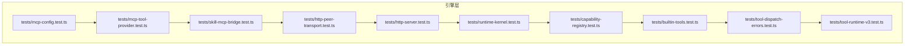
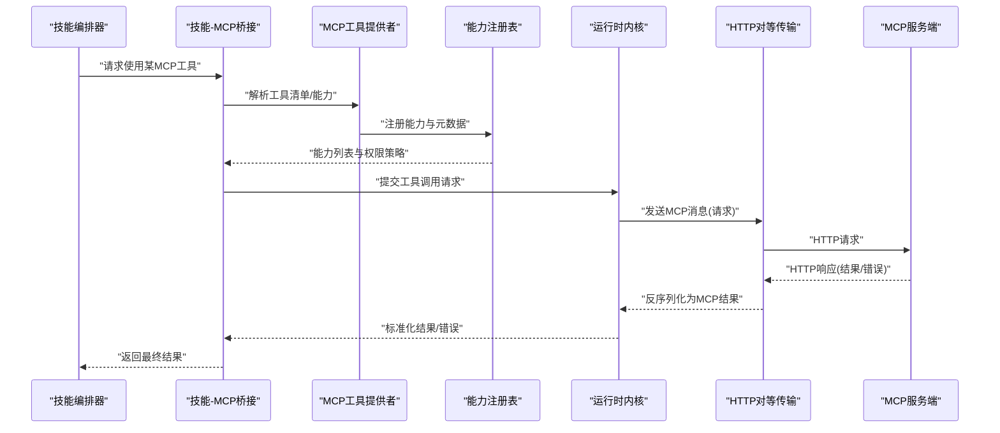
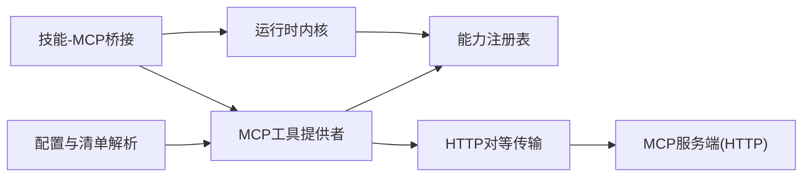
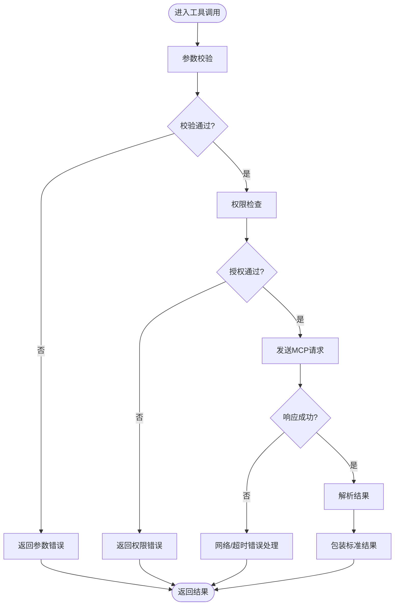

# MCP工具集成

<cite>
**本文引用的文件**   
- [mcp-config.test.ts](file://engine/tests/mcp-config.test.ts)
- [mcp-tool-provider.test.ts](file://engine/tests/mcp-tool-provider.test.ts)
- [skill-mcp-bridge.test.ts](file://engine/tests/skill-mcp-bridge.test.ts)
- [capability-registry.test.ts](file://engine/tests/capability-registry.test.ts)
- [builtin-tools.test.ts](file://engine/tests/builtin-tools.test.ts)
- [tool-dispatch-errors.test.ts](file://engine/tests/tool-dispatch-errors.test.ts)
- [tool-runtime-v3.test.ts](file://engine/tests/tool-runtime-v3.test.ts)
- [http-server.test.ts](file://engine/tests/http-server.test.ts)
- [http-peer-transport.test.ts](file://engine/tests/http-peer-transport.test.ts)
- [runtime-kernel.test.ts](file://engine/tests/runtime-kernel.test.ts)
- [package.json](file://engine/package.json)
</cite>

## 目录
1. [简介](#简介)
2. [项目结构](#项目结构)
3. [核心组件](#核心组件)
4. [架构总览](#架构总览)
5. [详细组件分析](#详细组件分析)
6. [依赖关系分析](#依赖关系分析)
7. [性能考虑](#性能考虑)
8. [故障排查指南](#故障排查指南)
9. [结论](#结论)
10. [附录](#附录)

## 简介
本指南面向在KCoder中开发与集成MCP（Model Context Protocol）工具的工程师，目标是：
- 解释MCP协议在KCoder中的工作原理与数据交换格式
- 说明工具发现、能力声明、消息传递机制
- 提供自定义MCP工具的开发与注册流程、参数校验与返回值处理
- 给出完整的开发模板与最佳实践（错误处理、日志记录、安全）
- 阐述权限控制与访问限制机制
- 提供测试方法与调试技巧
- 说明与现有技能系统的集成方案与兼容性考虑

## 项目结构
仓库采用多包工作区组织，引擎层位于 engine/ 下，包含多个子包与大量测试用例。与MCP相关的实现与验证主要分布在 tests 目录下的若干测试文件中，这些测试覆盖了配置、工具提供者、桥接、传输、运行时内核等关键路径。

图表来源
- [mcp-config.test.ts:1-200](file://engine/tests/mcp-config.test.ts#L1-L200)
- [mcp-tool-provider.test.ts:1-200](file://engine/tests/mcp-tool-provider.test.ts#L1-L200)
- [skill-mcp-bridge.test.ts:1-200](file://engine/tests/skill-mcp-bridge.test.ts#L1-L200)
- [http-peer-transport.test.ts:1-200](file://engine/tests/http-peer-transport.test.ts#L1-L200)
- [http-server.test.ts:1-200](file://engine/tests/http-server.test.ts#L1-L200)
- [runtime-kernel.test.ts:1-200](file://engine/tests/runtime-kernel.test.ts#L1-L200)
- [capability-registry.test.ts:1-200](file://engine/tests/capability-registry.test.ts#L1-L200)
- [builtin-tools.test.ts:1-200](file://engine/tests/builtin-tools.test.ts#L1-L200)
- [tool-dispatch-errors.test.ts:1-200](file://engine/tests/tool-dispatch-errors.test.ts#L1-L200)
- [tool-runtime-v3.test.ts:1-200](file://engine/tests/tool-runtime-v3.test.ts#L1-L200)

章节来源
- [package.json:1-200](file://engine/package.json#L1-L200)

## 核心组件
围绕MCP工具集成的核心组件包括：
- MCP配置与清单解析：负责加载与校验MCP相关配置项，确保工具源、端点、认证信息合法可用
- MCP工具提供者：将外部MCP服务暴露为KCoder内部可发现的工具集合，完成工具元数据映射与调用适配
- 技能-MCP桥接：将MCP工具纳入技能系统的能力模型，使技能编排器能按策略选择并执行MCP工具
- HTTP对等传输与服务端：基于HTTP的MCP消息通道，支持请求-响应或流式交互
- 运行时内核与能力注册表：统一调度工具调用、管理能力声明、维护权限与预算约束
- 内置工具与错误分发：内置工具作为参考实现；错误分发模块规范化异常与结果封装

章节来源
- [mcp-config.test.ts:1-200](file://engine/tests/mcp-config.test.ts#L1-L200)
- [mcp-tool-provider.test.ts:1-200](file://engine/tests/mcp-tool-provider.test.ts#L1-L200)
- [skill-mcp-bridge.test.ts:1-200](file://engine/tests/skill-mcp-bridge.test.ts#L1-L200)
- [http-peer-transport.test.ts:1-200](file://engine/tests/http-peer-transport.test.ts#L1-L200)
- [http-server.test.ts:1-200](file://engine/tests/http-server.test.ts#L1-L200)
- [runtime-kernel.test.ts:1-200](file://engine/tests/runtime-kernel.test.ts#L1-L200)
- [capability-registry.test.ts:1-200](file://engine/tests/capability-registry.test.ts#L1-L200)
- [builtin-tools.test.ts:1-200](file://engine/tests/builtin-tools.test.ts#L1-L200)
- [tool-dispatch-errors.test.ts:1-200](file://engine/tests/tool-dispatch-errors.test.ts#L1-L200)
- [tool-runtime-v3.test.ts:1-200](file://engine/tests/tool-runtime-v3.test.ts#L1-L200)

## 架构总览
下图展示了从上层技能到MCP工具调用的端到端流程，涵盖配置加载、工具发现、能力注册、HTTP传输、内核调度与返回。

图表来源
- [mcp-tool-provider.test.ts:1-200](file://engine/tests/mcp-tool-provider.test.ts#L1-L200)
- [skill-mcp-bridge.test.ts:1-200](file://engine/tests/skill-mcp-bridge.test.ts#L1-L200)
- [capability-registry.test.ts:1-200](file://engine/tests/capability-registry.test.ts#L1-L200)
- [http-peer-transport.test.ts:1-200](file://engine/tests/http-peer-transport.test.ts#L1-L200)
- [http-server.test.ts:1-200](file://engine/tests/http-server.test.ts#L1-L200)
- [runtime-kernel.test.ts:1-200](file://engine/tests/runtime-kernel.test.ts#L1-L200)

## 详细组件分析

### MCP配置与清单解析
职责与要点
- 读取并校验MCP配置项，包括工具源地址、鉴权方式、超时与重试策略
- 解析工具清单，生成统一的工具描述与能力元数据
- 提供配置变更热更新与回滚策略

建议的实现模式
- 分层校验：基础字段校验、网络可达性校验、鉴权凭证有效性校验
- 缓存与失效：对工具清单进行短期缓存，支持按需刷新
- 错误分类：区分配置错误、网络错误、鉴权错误，便于上层处理

章节来源
- [mcp-config.test.ts:1-200](file://engine/tests/mcp-config.test.ts#L1-L200)

### MCP工具提供者
职责与要点
- 将外部MCP服务暴露为内部工具集合
- 完成工具名、参数Schema、返回值的映射与转换
- 管理工具生命周期（注册、更新、注销）

开发步骤
- 定义工具元数据：名称、描述、参数Schema、返回类型
- 实现适配器：将内部调用转换为MCP消息格式
- 注册到能力注册表：供内核调度与权限检查

章节来源
- [mcp-tool-provider.test.ts:1-200](file://engine/tests/mcp-tool-provider.test.ts#L1-L200)

### 技能-MCP桥接
职责与要点
- 将MCP工具纳入技能系统的能力模型
- 根据技能策略选择合适工具，并处理上下文注入
- 统一错误与结果格式，屏蔽底层差异

集成要点
- 能力匹配：基于标签、版本、权限范围进行筛选
- 上下文传播：将会话、用户、项目上下文注入到MCP调用
- 降级策略：当MCP不可用时回退到本地工具或提示

章节来源
- [skill-mcp-bridge.test.ts:1-200](file://engine/tests/skill-mcp-bridge.test.ts#L1-L200)

### HTTP对等传输与服务端
职责与要点
- 基于HTTP的MCP消息通道，支持请求-响应与流式
- 序列化/反序列化MCP消息体，保证跨语言兼容
- 连接管理、重试、超时与熔断

最佳实践
- 幂等键：为可重试操作生成唯一ID，避免重复执行
- 限流与背压：防止下游过载
- 可观测性：记录请求链路、耗时、状态码

章节来源
- [http-peer-transport.test.ts:1-200](file://engine/tests/http-peer-transport.test.ts#L1-L200)
- [http-server.test.ts:1-200](file://engine/tests/http-server.test.ts#L1-L200)

### 运行时内核与能力注册表
职责与要点
- 统一调度工具调用，管理能力声明与权限策略
- 维护工具版本、依赖、冲突解决
- 预算与配额控制，防止资源滥用

权限控制与访问限制
- 基于角色/范围的访问控制（RBAC/ABAC）
- 工具白名单与黑名单
- 调用频率与并发限制

章节来源
- [runtime-kernel.test.ts:1-200](file://engine/tests/runtime-kernel.test.ts#L1-L200)
- [capability-registry.test.ts:1-200](file://engine/tests/capability-registry.test.ts#L1-L200)

### 内置工具与错误分发
职责与要点
- 内置工具提供参考实现与边界用例
- 错误分发模块规范化异常与结果封装，便于追踪与告警

错误处理策略
- 分类：参数错误、网络错误、业务错误、系统错误
- 包装：统一错误对象，携带上下文与追踪ID
- 恢复：重试、降级、补偿

章节来源
- [builtin-tools.test.ts:1-200](file://engine/tests/builtin-tools.test.ts#L1-L200)
- [tool-dispatch-errors.test.ts:1-200](file://engine/tests/tool-dispatch-errors.test.ts#L1-L200)

### 工具运行时v3
职责与要点
- 提供工具执行的运行时环境，隔离副作用
- 支持异步执行、取消与超时
- 提供指标与审计事件

章节来源
- [tool-runtime-v3.test.ts:1-200](file://engine/tests/tool-runtime-v3.test.ts#L1-L200)

## 依赖关系分析
MCP工具集成的依赖关系如下：
- 配置层依赖清单解析与校验
- 工具提供者依赖传输层与能力注册表
- 桥接层依赖提供者与内核
- 内核依赖注册表与运行时
- 传输层依赖HTTP服务端

图表来源
- [mcp-config.test.ts:1-200](file://engine/tests/mcp-config.test.ts#L1-L200)
- [mcp-tool-provider.test.ts:1-200](file://engine/tests/mcp-tool-provider.test.ts#L1-L200)
- [skill-mcp-bridge.test.ts:1-200](file://engine/tests/skill-mcp-bridge.test.ts#L1-L200)
- [http-peer-transport.test.ts:1-200](file://engine/tests/http-peer-transport.test.ts#L1-L200)
- [http-server.test.ts:1-200](file://engine/tests/http-server.test.ts#L1-L200)
- [runtime-kernel.test.ts:1-200](file://engine/tests/runtime-kernel.test.ts#L1-L200)
- [capability-registry.test.ts:1-200](file://engine/tests/capability-registry.test.ts#L1-L200)

章节来源
- [mcp-config.test.ts:1-200](file://engine/tests/mcp-config.test.ts#L1-L200)
- [mcp-tool-provider.test.ts:1-200](file://engine/tests/mcp-tool-provider.test.ts#L1-L200)
- [skill-mcp-bridge.test.ts:1-200](file://engine/tests/skill-mcp-bridge.test.ts#L1-L200)
- [http-peer-transport.test.ts:1-200](file://engine/tests/http-peer-transport.test.ts#L1-L200)
- [http-server.test.ts:1-200](file://engine/tests/http-server.test.ts#L1-L200)
- [runtime-kernel.test.ts:1-200](file://engine/tests/runtime-kernel.test.ts#L1-L200)
- [capability-registry.test.ts:1-200](file://engine/tests/capability-registry.test.ts#L1-L200)

## 性能考虑
- 批量与合并：对短小且频繁的工具调用进行批处理
- 缓存：对只读工具的结果进行短期缓存，结合版本号与参数指纹
- 连接复用：HTTP长连接与连接池，减少握手开销
- 超时与熔断：设置合理的超时阈值与熔断策略，保护上游
- 异步与并行：在不破坏一致性的前提下并行执行独立工具
- 监控与度量：采集P95/P99延迟、错误率、吞吐与资源占用

[本节为通用指导，不直接分析具体文件]

## 故障排查指南
常见问题与定位方法
- 配置错误：检查MCP清单与端点可达性，确认鉴权凭证有效
- 传输失败：查看HTTP状态码与错误码，确认网络连通与证书配置
- 权限拒绝：核对能力注册表中的权限策略与调用者身份
- 超时与重试：调整超时阈值与重试次数，关注下游负载
- 结果不一致：检查幂等键与去重逻辑，确认副作用是否被正确隔离

调试技巧
- 开启详细日志：记录请求ID、参数摘要、耗时与错误堆栈
- 断点与回放：保存请求样本用于复现与回归
- 模拟与桩：对下游服务进行Mock，快速定位问题域

章节来源
- [tool-dispatch-errors.test.ts:1-200](file://engine/tests/tool-dispatch-errors.test.ts#L1-L200)
- [http-server.test.ts:1-200](file://engine/tests/http-server.test.ts#L1-L200)
- [http-peer-transport.test.ts:1-200](file://engine/tests/http-peer-transport.test.ts#L1-L200)

## 结论
通过配置解析、工具提供者、桥接层、传输层与内核的统一协作，KCoder实现了稳定、可扩展的MCP工具集成。遵循本文的开发流程与最佳实践，可以快速构建高质量的自定义MCP工具，并在权限控制、错误处理、性能优化等方面获得良好体验。

[本节为总结，不直接分析具体文件]

## 附录

### 自定义MCP工具开发模板（步骤清单）
- 定义工具元数据：名称、描述、参数Schema、返回类型
- 实现适配器：将内部调用转换为MCP消息格式
- 注册到能力注册表：供内核调度与权限检查
- 编写单元测试：覆盖正常路径、参数校验、错误分支
- 集成测试：端到端验证配置、传输、内核调度与结果
- 上线前检查：权限策略、限流、超时、日志与可观测性

章节来源
- [mcp-tool-provider.test.ts:1-200](file://engine/tests/mcp-tool-provider.test.ts#L1-L200)
- [capability-registry.test.ts:1-200](file://engine/tests/capability-registry.test.ts#L1-L200)
- [tool-runtime-v3.test.ts:1-200](file://engine/tests/tool-runtime-v3.test.ts#L1-L200)

### 参数验证与返回值处理
- 参数验证：在入口处进行强类型校验，拒绝非法输入
- 返回值处理：统一包装成功/失败结果，附带追踪ID与上下文
- 错误分类：区分客户端错误与服务端错误，便于前端展示与重试策略

章节来源
- [builtin-tools.test.ts:1-200](file://engine/tests/builtin-tools.test.ts#L1-L200)
- [tool-dispatch-errors.test.ts:1-200](file://engine/tests/tool-dispatch-errors.test.ts#L1-L200)

### 错误处理流程图

图表来源
- [tool-dispatch-errors.test.ts:1-200](file://engine/tests/tool-dispatch-errors.test.ts#L1-L200)
- [http-peer-transport.test.ts:1-200](file://engine/tests/http-peer-transport.test.ts#L1-L200)

### 与现有技能系统的集成方案
- 能力映射：将MCP工具映射为技能能力，保持命名与语义一致
- 策略选择：基于技能策略选择最优工具，支持A/B与灰度
- 上下文注入：将用户、项目、会话上下文注入到MCP调用
- 兼容性与回退：当MCP不可用时回退到本地工具或提示用户

章节来源
- [skill-mcp-bridge.test.ts:1-200](file://engine/tests/skill-mcp-bridge.test.ts#L1-L200)
- [runtime-kernel.test.ts:1-200](file://engine/tests/runtime-kernel.test.ts#L1-L200)

### 测试方法与调试技巧
- 单测：针对配置解析、工具提供者、错误分发进行单元覆盖
- 集成测试：端到端验证HTTP传输、内核调度与结果一致性
- 模拟与桩：对下游MCP服务进行Mock，加速测试与回归
- 日志与追踪：启用链路追踪，记录关键节点耗时与错误

章节来源
- [mcp-config.test.ts:1-200](file://engine/tests/mcp-config.test.ts#L1-L200)
- [http-server.test.ts:1-200](file://engine/tests/http-server.test.ts#L1-L200)
- [tool-runtime-v3.test.ts:1-200](file://engine/tests/tool-runtime-v3.test.ts#L1-L200)