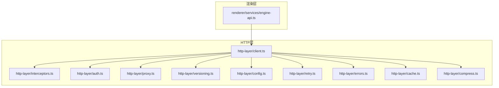
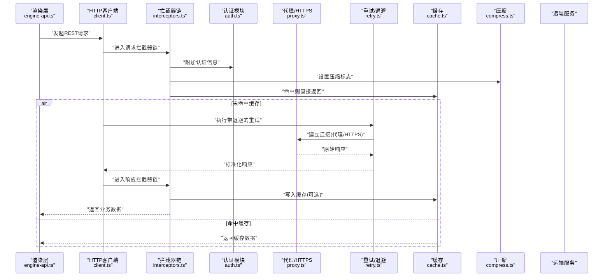
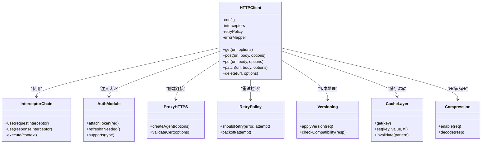

# HTTP API集成

<cite>
**本文引用的文件**   
- [engine/packages/http-layer/src/index.ts](file://engine/packages/http-layer/src/index.ts)
- [engine/packages/http-layer/src/client.ts](file://engine/packages/http-layer/src/client.ts)
- [engine/packages/http-layer/src/interceptors.ts](file://engine/packages/http-layer/src/interceptors.ts)
- [engine/packages/http-layer/src/config.ts](file://engine/packages/http-layer/src/config.ts)
- [engine/packages/http-layer/src/retry.ts](file://engine/packages/http-layer/src/retry.ts)
- [engine/packages/http-layer/src/errors.ts](file://engine/packages/http-layer/src/errors.ts)
- [engine/packages/http-layer/src/auth.ts](file://engine/packages/http-layer/src/auth.ts)
- [engine/packages/http-layer/src/proxy.ts](file://engine/packages/http-layer/src/proxy.ts)
- [engine/packages/http-layer/src/cache.ts](file://engine/packages/http-layer/src/cache.ts)
- [engine/packages/http-layer/src/compress.ts](file://engine/packages/http-layer/src/compress.ts)
- [engine/packages/http-layer/src/versioning.ts](file://engine/packages/http-layer/src/versioning.ts)
- [app/renderer/src/services/engine-api.ts](file://app/renderer/src/services/engine-api.ts)
</cite>

## 目录
1. [简介](#简介)
2. [项目结构](#项目结构)
3. [核心组件](#核心组件)
4. [架构总览](#架构总览)
5. [详细组件分析](#详细组件分析)
6. [依赖关系分析](#依赖关系分析)
7. [性能考虑](#性能考虑)
8. [故障排查指南](#故障排查指南)
9. [结论](#结论)
10. [附录](#附录)

## 简介
本技术文档面向KCoder的HTTP API集成，聚焦于RESTful API的设计模式与实现方式，涵盖请求构建、响应处理、错误处理机制；详细说明HTTP客户端配置选项（超时、重试、连接池）；提供认证与授权方案（Bearer Token、API Key、OAuth2流程）；阐述请求拦截器与响应拦截器的使用与自定义逻辑；说明HTTPS配置、SSL证书验证与代理支持；给出API版本管理与向后兼容的最佳实践；并包含性能优化技巧（请求合并、缓存策略、压缩传输）。

## 项目结构
KCoder采用多包工作区组织，HTTP相关能力集中在engine/packages/http-layer中，渲染层通过app/renderer/src/services/engine-api.ts调用引擎提供的HTTP服务。

图表来源
- [engine/packages/http-layer/src/client.ts](file://engine/packages/http-layer/src/client.ts)
- [engine/packages/http-layer/src/interceptors.ts](file://engine/packages/http-layer/src/interceptors.ts)
- [engine/packages/http-layer/src/auth.ts](file://engine/packages/http-layer/src/auth.ts)
- [engine/packages/http-layer/src/proxy.ts](file://engine/packages/http-layer/src/proxy.ts)
- [engine/packages/http-layer/src/versioning.ts](file://engine/packages/http-layer/src/versioning.ts)
- [engine/packages/http-layer/src/config.ts](file://engine/packages/http-layer/src/config.ts)
- [engine/packages/http-layer/src/retry.ts](file://engine/packages/http-layer/src/retry.ts)
- [engine/packages/http-layer/src/errors.ts](file://engine/packages/http-layer/src/errors.ts)
- [engine/packages/http-layer/src/cache.ts](file://engine/packages/http-layer/src/cache.ts)
- [engine/packages/http-layer/src/compress.ts](file://engine/packages/http-layer/src/compress.ts)
- [app/renderer/src/services/engine-api.ts](file://app/renderer/src/services/engine-api.ts)

章节来源
- [engine/packages/http-layer/src/index.ts](file://engine/packages/http-layer/src/index.ts)
- [app/renderer/src/services/engine-api.ts](file://app/renderer/src/services/engine-api.ts)

## 核心组件
- HTTP客户端：封装基础请求方法、默认配置、拦截器链、重试与错误转换。
- 拦截器：请求拦截器负责注入认证头、版本前缀、压缩标志等；响应拦截器负责统一解析、错误映射与缓存写入。
- 认证模块：支持Bearer Token、API Key以及OAuth2流程（授权码/设备码/客户端凭据），可组合使用。
- 代理与HTTPS：支持HTTP/HTTPS代理、自定义CA证书、跳过证书校验开关。
- 重试与退避：基于指数退避与抖动，针对特定状态码或网络错误进行重试。
- 错误模型：将底层异常转换为领域错误对象，便于上层统一处理。
- 版本管理：统一在URL路径或Header中注入API版本，并提供兼容性策略。
- 缓存与压缩：可选的请求级缓存与Gzip/Deflate压缩。

章节来源
- [engine/packages/http-layer/src/client.ts](file://engine/packages/http-layer/src/client.ts)
- [engine/packages/http-layer/src/interceptors.ts](file://engine/packages/http-layer/src/interceptors.ts)
- [engine/packages/http-layer/src/auth.ts](file://engine/packages/http-layer/src/auth.ts)
- [engine/packages/http-layer/src/proxy.ts](file://engine/packages/http-layer/src/proxy.ts)
- [engine/packages/http-layer/src/retry.ts](file://engine/packages/http-layer/src/retry.ts)
- [engine/packages/http-layer/src/errors.ts](file://engine/packages/http-layer/src/errors.ts)
- [engine/packages/http-layer/src/versioning.ts](file://engine/packages/http-layer/src/versioning.ts)
- [engine/packages/http-layer/src/cache.ts](file://engine/packages/http-layer/src/cache.ts)
- [engine/packages/http-layer/src/compress.ts](file://engine/packages/http-layer/src/compress.ts)

## 架构总览
下图展示了从渲染层发起HTTP请求到HTTP层各组件协作的整体流程。

图表来源
- [engine/packages/http-layer/src/client.ts](file://engine/packages/http-layer/src/client.ts)
- [engine/packages/http-layer/src/interceptors.ts](file://engine/packages/http-layer/src/interceptors.ts)
- [engine/packages/http-layer/src/auth.ts](file://engine/packages/http-layer/src/auth.ts)
- [engine/packages/http-layer/src/proxy.ts](file://engine/packages/http-layer/src/proxy.ts)
- [engine/packages/http-layer/src/retry.ts](file://engine/packages/http-layer/src/retry.ts)
- [engine/packages/http-layer/src/cache.ts](file://engine/packages/http-layer/src/cache.ts)
- [engine/packages/http-layer/src/compress.ts](file://engine/packages/http-layer/src/compress.ts)
- [app/renderer/src/services/engine-api.ts](file://app/renderer/src/services/engine-api.ts)

## 详细组件分析

### RESTful API设计与请求构建
- 资源导向：以名词表示资源，使用GET/POST/PUT/PATCH/DELETE表达操作语义。
- 路径与查询：路径体现层级关系，查询参数用于过滤、分页与排序。
- 幂等性：GET/PUT/DELETE为幂等，PATCH需明确幂等约定。
- 内容协商：通过Accept/Content-Type控制JSON、表单或多部分上传。
- 版本化：通过URL前缀或Header携带版本，避免破坏性变更。

章节来源
- [engine/packages/http-layer/src/versioning.ts](file://engine/packages/http-layer/src/versioning.ts)
- [engine/packages/http-layer/src/client.ts](file://engine/packages/http-layer/src/client.ts)

### 请求构建与响应处理
- 请求构建：统一封装base URL、默认Headers、序列化与反序列化。
- 响应处理：统一解析成功体、错误体、状态码映射与类型推断。
- 流式响应：对大文件或SSE场景提供流式读取接口。

章节来源
- [engine/packages/http-layer/src/client.ts](file://engine/packages/http-layer/src/client.ts)

### 错误处理机制
- 错误分类：网络错误、超时、服务端错误、业务错误。
- 错误转换：将底层异常转换为领域错误对象，附带上下文与重试建议。
- 用户提示：根据错误类别提供友好提示与恢复指引。

章节来源
- [engine/packages/http-layer/src/errors.ts](file://engine/packages/http-layer/src/errors.ts)

### HTTP客户端配置选项
- 超时设置：连接超时、请求超时、读写超时。
- 重试策略：最大重试次数、退避算法、抖动因子、重试条件（状态码/错误类型）。
- 连接池：并发连接数、空闲连接回收、Keep-Alive策略。
- 日志与追踪：请求ID、耗时、采样率。

章节来源
- [engine/packages/http-layer/src/config.ts](file://engine/packages/http-layer/src/config.ts)
- [engine/packages/http-layer/src/retry.ts](file://engine/packages/http-layer/src/retry.ts)
- [engine/packages/http-layer/src/client.ts](file://engine/packages/http-layer/src/client.ts)

### 认证与授权
- Bearer Token：在Authorization头注入令牌，支持自动刷新。
- API Key：通过Header或Query注入密钥，适合服务端间调用。
- OAuth2流程：支持授权码、设备码、客户端凭据等模式，集中管理令牌生命周期。
- 安全建议：最小权限、短期令牌、敏感信息不落地。

章节来源
- [engine/packages/http-layer/src/auth.ts](file://engine/packages/http-layer/src/auth.ts)

### 请求拦截器与响应拦截器
- 请求拦截器：注入认证、版本、压缩、追踪ID、去重键等。
- 响应拦截器：统一解析、错误映射、缓存写入、指标上报。
- 自定义逻辑：按环境或路由动态调整行为，如灰度开关。

章节来源
- [engine/packages/http-layer/src/interceptors.ts](file://engine/packages/http-layer/src/interceptors.ts)

### HTTPS配置、SSL证书验证与代理
- HTTPS：强制TLS、指定协议版本、密码套件。
- 证书验证：支持自定义CA、跳过验证（仅开发环境）、证书固定。
- 代理：HTTP/HTTPS/SOCKS代理，按域名白名单绕过代理。

章节来源
- [engine/packages/http-layer/src/proxy.ts](file://engine/packages/http-layer/src/proxy.ts)

### API版本管理与向后兼容
- 版本策略：URL前缀优先，Header兜底；弃用期与迁移窗口。
- 兼容性：字段新增非破坏性，删除需软废弃；提供适配器层。
- 测试：契约测试与兼容性矩阵。

章节来源
- [engine/packages/http-layer/src/versioning.ts](file://engine/packages/http-layer/src/versioning.ts)

### 性能优化：请求合并、缓存、压缩
- 请求合并：相同时间窗口的重复请求合并，减少带宽与后端压力。
- 缓存策略：强缓存与协商缓存结合，按资源粒度设置TTL与失效键。
- 压缩传输：启用Gzip/Deflate，权衡CPU与带宽。

章节来源
- [engine/packages/http-layer/src/cache.ts](file://engine/packages/http-layer/src/cache.ts)
- [engine/packages/http-layer/src/compress.ts](file://engine/packages/http-layer/src/compress.ts)

### 渲染层集成示例
- 通过engine-api.ts暴露高层API，屏蔽HTTP细节，向上提供领域方法。
- 统一错误处理与加载态管理，适配React状态。

章节来源
- [app/renderer/src/services/engine-api.ts](file://app/renderer/src/services/engine-api.ts)

## 依赖关系分析

图表来源
- [engine/packages/http-layer/src/client.ts](file://engine/packages/http-layer/src/client.ts)
- [engine/packages/http-layer/src/interceptors.ts](file://engine/packages/http-layer/src/interceptors.ts)
- [engine/packages/http-layer/src/auth.ts](file://engine/packages/http-layer/src/auth.ts)
- [engine/packages/http-layer/src/proxy.ts](file://engine/packages/http-layer/src/proxy.ts)
- [engine/packages/http-layer/src/retry.ts](file://engine/packages/http-layer/src/retry.ts)
- [engine/packages/http-layer/src/versioning.ts](file://engine/packages/http-layer/src/versioning.ts)
- [engine/packages/http-layer/src/cache.ts](file://engine/packages/http-layer/src/cache.ts)
- [engine/packages/http-layer/src/compress.ts](file://engine/packages/http-layer/src/compress.ts)

章节来源
- [engine/packages/http-layer/src/client.ts](file://engine/packages/http-layer/src/client.ts)

## 性能考虑
- 合理设置超时与重试上限，避免雪崩。
- 使用连接池复用TCP连接，降低握手开销。
- 对热点资源启用缓存，配合ETag/Last-Modified减少回源。
- 开启压缩传输，注意CPU与带宽平衡。
- 请求合并减少重复网络IO。
- 监控关键指标：P95延迟、错误率、重试率、缓存命中率。

[本节为通用指导，无需源码引用]

## 故障排查指南
- 常见错误分类与定位：网络错误、超时、证书问题、代理不可达、鉴权失败、服务端错误。
- 日志与追踪：记录请求ID、耗时、重试次数、缓存命中情况。
- 快速自检清单：
  - 检查代理与证书配置是否正确。
  - 确认认证令牌是否过期或权限不足。
  - 核对版本前缀与兼容性策略。
  - 查看重试策略是否过于激进导致放大效应。
  - 评估缓存键冲突与TTL设置。

章节来源
- [engine/packages/http-layer/src/errors.ts](file://engine/packages/http-layer/src/errors.ts)
- [engine/packages/http-layer/src/retry.ts](file://engine/packages/http-layer/src/retry.ts)
- [engine/packages/http-layer/src/proxy.ts](file://engine/packages/http-layer/src/proxy.ts)
- [engine/packages/http-layer/src/auth.ts](file://engine/packages/http-layer/src/auth.ts)
- [engine/packages/http-layer/src/cache.ts](file://engine/packages/http-layer/src/cache.ts)

## 结论
通过分层清晰的HTTP客户端与拦截器体系，KCoder实现了可扩展、可观测、高可用的HTTP集成能力。结合认证、代理、重试、缓存与压缩等特性，既能满足复杂生产环境的稳定性要求，也能兼顾性能与可维护性。建议在迭代中持续完善契约测试与监控告警，确保API演进的可控性与用户体验的一致性。

[本节为总结，无需源码引用]

## 附录
- 最佳实践清单：
  - 始终使用HTTPS与严格证书校验（开发除外）。
  - 为所有外部调用设置合理的超时与重试上限。
  - 使用统一的错误模型与用户提示。
  - 通过拦截器集中处理横切关注点。
  - 对敏感信息进行最小化暴露与加密存储。
  - 制定明确的API版本策略与弃用计划。
  - 对高频读接口实施缓存与压缩。
  - 建立完善的监控与告警体系。

[本节为补充建议，无需源码引用]