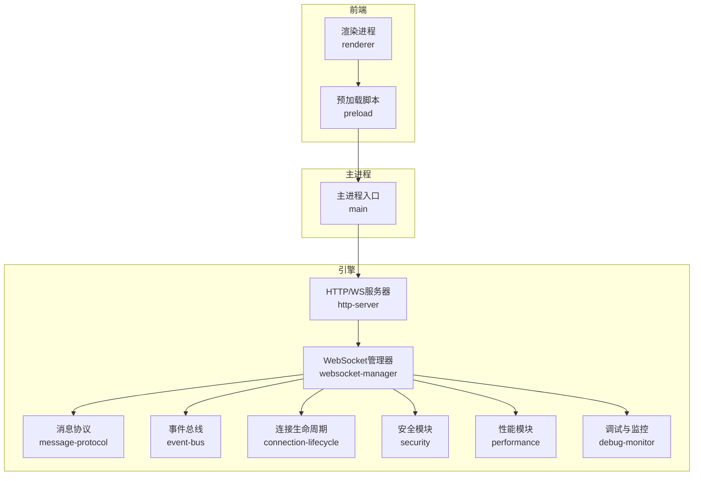
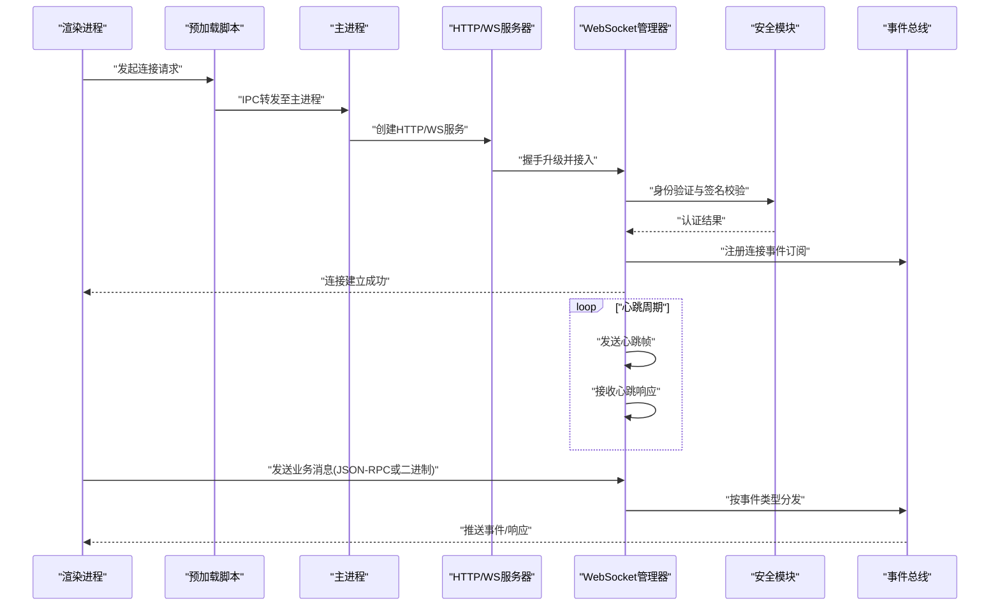
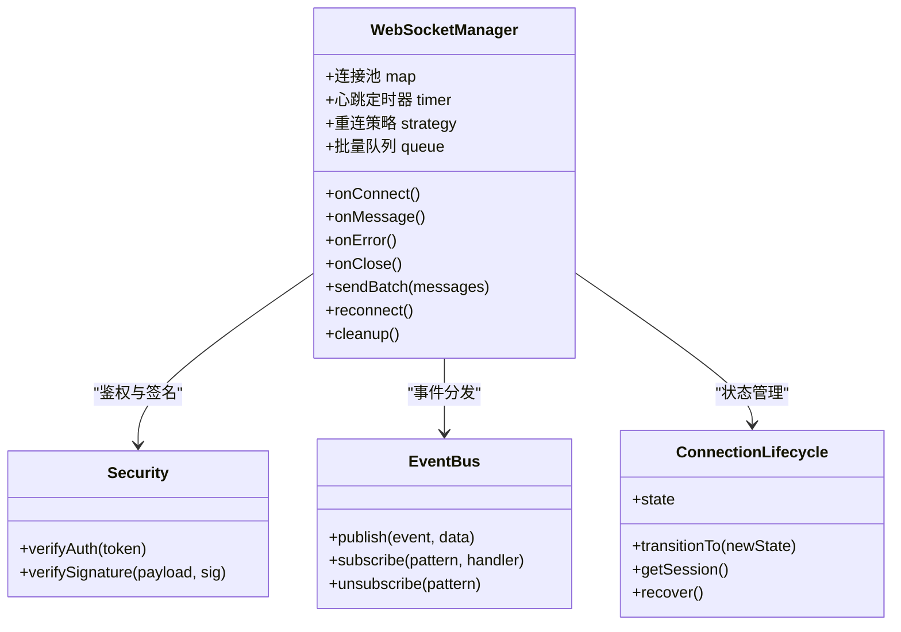
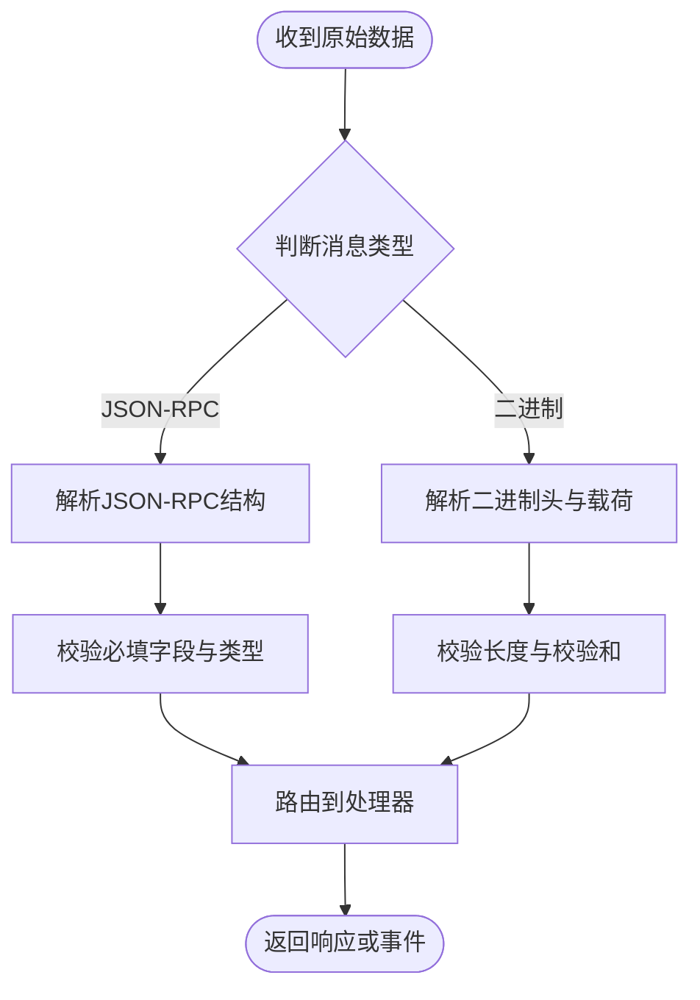
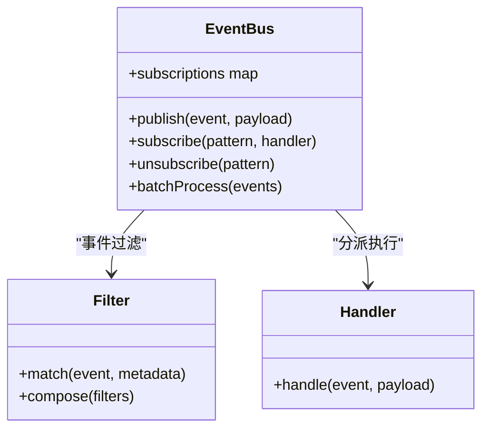
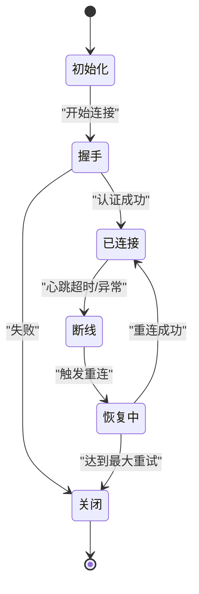
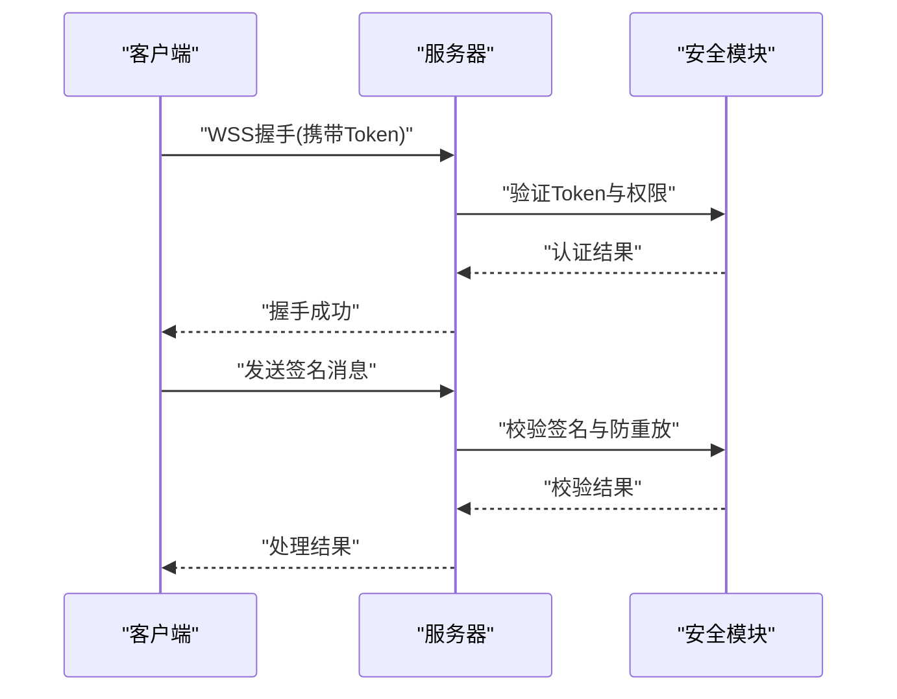
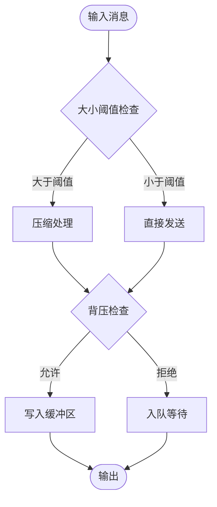
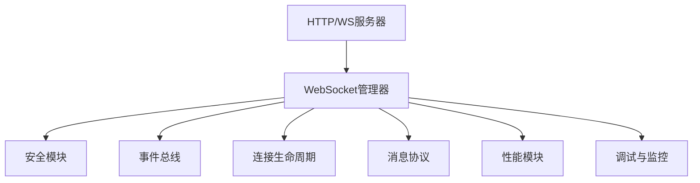

# WebSocket实时通信

<cite>
**本文引用的文件**   
- [app/main/index.ts](file://app/main/index.ts)
- [app/preload/index.ts](file://app/preload/index.ts)
- [app/renderer/src/services/engine-api.ts](file://app/renderer/src/services/engine-api.ts)
- [engine/packages/ports-layer/http-server.ts](file://engine/packages/ports-layer/http-server.ts)
- [engine/packages/infrastructure/websocket-manager.ts](file://engine/packages/infrastructure/websocket-manager.ts)
- [engine/packages/infrastructure/message-protocol.ts](file://engine/packages/infrastructure/message-protocol.ts)
- [engine/packages/infrastructure/event-bus.ts](file://engine/packages/infrastructure/event-bus.ts)
- [engine/packages/infrastructure/connection-lifecycle.ts](file://engine/packages/infrastructure/connection-lifecycle.ts)
- [engine/packages/infrastructure/security.ts](file://engine/packages/infrastructure/security.ts)
- [engine/packages/infrastructure/performance.ts](file://engine/packages/infrastructure/performance.ts)
- [engine/packages/infrastructure/debug-monitor.ts](file://engine/packages/infrastructure/debug-monitor.ts)
</cite>

## 目录
1. [简介](#简介)
2. [项目结构](#项目结构)
3. [核心组件](#核心组件)
4. [架构总览](#架构总览)
5. [详细组件分析](#详细组件分析)
6. [依赖分析](#依赖分析)
7. [性能考虑](#性能考虑)
8. [故障排查指南](#故障排查指南)
9. [结论](#结论)
10. [附录](#附录)

## 简介
本技术文档围绕KCoder的WebSocket实时通信能力，系统性阐述连接建立与管理、消息协议设计、事件驱动架构、连接状态管理、安全策略、性能优化以及调试与监控方法。文档面向不同技术背景的读者，既提供高层概览，也深入到具体实现细节，帮助开发者快速理解并高效使用WebSocket子系统。

## 项目结构
KCoder采用前后端分离与多包工程组织：
- 前端渲染层（Renderer）通过预加载脚本暴露API，调用引擎服务进行通信。
- 主进程负责应用生命周期与窗口管理。
- 引擎侧提供HTTP/WS服务、消息协议、事件总线、连接管理与安全模块。

图表来源
- [app/main/index.ts:1-200](file://app/main/index.ts#L1-L200)
- [app/preload/index.ts:1-200](file://app/preload/index.ts#L1-L200)
- [app/renderer/src/services/engine-api.ts:1-200](file://app/renderer/src/services/engine-api.ts#L1-L200)
- [engine/packages/ports-layer/http-server.ts:1-200](file://engine/packages/ports-layer/http-server.ts#L1-L200)
- [engine/packages/infrastructure/websocket-manager.ts:1-200](file://engine/packages/infrastructure/websocket-manager.ts#L1-L200)
- [engine/packages/infrastructure/message-protocol.ts:1-200](file://engine/packages/infrastructure/message-protocol.ts#L1-L200)
- [engine/packages/infrastructure/event-bus.ts:1-200](file://engine/packages/infrastructure/event-bus.ts#L1-L200)
- [engine/packages/infrastructure/connection-lifecycle.ts:1-200](file://engine/packages/infrastructure/connection-lifecycle.ts#L1-L200)
- [engine/packages/infrastructure/security.ts:1-200](file://engine/packages/infrastructure/security.ts#L1-L200)
- [engine/packages/infrastructure/performance.ts:1-200](file://engine/packages/infrastructure/performance.ts#L1-L200)
- [engine/packages/infrastructure/debug-monitor.ts:1-200](file://engine/packages/infrastructure/debug-monitor.ts#L1-L200)

章节来源
- [app/main/index.ts:1-200](file://app/main/index.ts#L1-L200)
- [app/preload/index.ts:1-200](file://app/preload/index.ts#L1-L200)
- [app/renderer/src/services/engine-api.ts:1-200](file://app/renderer/src/services/engine-api.ts#L1-L200)
- [engine/packages/ports-layer/http-server.ts:1-200](file://engine/packages/ports-layer/http-server.ts#L1-L200)
- [engine/packages/infrastructure/websocket-manager.ts:1-200](file://engine/packages/infrastructure/websocket-manager.ts#L1-L200)
- [engine/packages/infrastructure/message-protocol.ts:1-200](file://engine/packages/infrastructure/message-protocol.ts#L1-L200)
- [engine/packages/infrastructure/event-bus.ts:1-200](file://engine/packages/infrastructure/event-bus.ts#L1-L200)
- [engine/packages/infrastructure/connection-lifecycle.ts:1-200](file://engine/packages/infrastructure/connection-lifecycle.ts#L1-L200)
- [engine/packages/infrastructure/security.ts:1-200](file://engine/packages/infrastructure/security.ts#L1-L200)
- [engine/packages/infrastructure/performance.ts:1-200](file://engine/packages/infrastructure/performance.ts#L1-L200)
- [engine/packages/infrastructure/debug-monitor.ts:1-200](file://engine/packages/infrastructure/debug-monitor.ts#L1-L200)

## 核心组件
- HTTP/WS服务器：负责监听端口、处理握手升级、路由到WebSocket管理器。
- WebSocket管理器：维护连接池、心跳检测、自动重连、批量发送、错误恢复。
- 消息协议：定义JSON-RPC与自定义二进制格式，统一编解码与校验。
- 事件总线：发布订阅模型，支持事件过滤与批量处理。
- 连接生命周期：封装连接状态机、断线恢复与会话保持。
- 安全模块：WSS加密、身份验证、消息签名验证。
- 性能模块：压缩、复用、内存管理、背压控制。
- 调试与监控：日志、指标采集、诊断接口。

章节来源
- [engine/packages/ports-layer/http-server.ts:1-200](file://engine/packages/ports-layer/http-server.ts#L1-L200)
- [engine/packages/infrastructure/websocket-manager.ts:1-200](file://engine/packages/infrastructure/websocket-manager.ts#L1-L200)
- [engine/packages/infrastructure/message-protocol.ts:1-200](file://engine/packages/infrastructure/message-protocol.ts#L1-L200)
- [engine/packages/infrastructure/event-bus.ts:1-200](file://engine/packages/infrastructure/event-bus.ts#L1-L200)
- [engine/packages/infrastructure/connection-lifecycle.ts:1-200](file://engine/packages/infrastructure/connection-lifecycle.ts#L1-L200)
- [engine/packages/infrastructure/security.ts:1-200](file://engine/packages/infrastructure/security.ts#L1-L200)
- [engine/packages/infrastructure/performance.ts:1-200](file://engine/packages/infrastructure/performance.ts#L1-L200)
- [engine/packages/infrastructure/debug-monitor.ts:1-200](file://engine/packages/infrastructure/debug-monitor.ts#L1-L200)

## 架构总览
下图展示从渲染进程到引擎WebSocket子系统的端到端流程，包括握手、鉴权、心跳、消息收发与事件分发。

图表来源
- [app/renderer/src/services/engine-api.ts:1-200](file://app/renderer/src/services/engine-api.ts#L1-L200)
- [app/preload/index.ts:1-200](file://app/preload/index.ts#L1-L200)
- [app/main/index.ts:1-200](file://app/main/index.ts#L1-L200)
- [engine/packages/ports-layer/http-server.ts:1-200](file://engine/packages/ports-layer/http-server.ts#L1-L200)
- [engine/packages/infrastructure/websocket-manager.ts:1-200](file://engine/packages/infrastructure/websocket-manager.ts#L1-L200)
- [engine/packages/infrastructure/security.ts:1-200](file://engine/packages/infrastructure/security.ts#L1-L200)
- [engine/packages/infrastructure/event-bus.ts:1-200](file://engine/packages/infrastructure/event-bus.ts#L1-L200)

## 详细组件分析

### WebSocket管理器
职责：
- 连接池管理：按会话ID或客户端标识维护活跃连接集合，支持并发读写。
- 心跳检测：周期性发送心跳帧，超时判定断线并触发恢复流程。
- 自动重连：指数退避重试，带最大重试次数与抖动随机化。
- 批量处理：合并小消息为批次发送，降低网络开销。
- 错误恢复：捕获异常、记录诊断信息、清理资源并通知上层。

图表来源
- [engine/packages/infrastructure/websocket-manager.ts:1-200](file://engine/packages/infrastructure/websocket-manager.ts#L1-L200)
- [engine/packages/infrastructure/security.ts:1-200](file://engine/packages/infrastructure/security.ts#L1-L200)
- [engine/packages/infrastructure/event-bus.ts:1-200](file://engine/packages/infrastructure/event-bus.ts#L1-L200)
- [engine/packages/infrastructure/connection-lifecycle.ts:1-200](file://engine/packages/infrastructure/connection-lifecycle.ts#L1-L200)

章节来源
- [engine/packages/infrastructure/websocket-manager.ts:1-200](file://engine/packages/infrastructure/websocket-manager.ts#L1-L200)

### 消息协议设计
要点：
- JSON-RPC：标准请求/响应结构，包含id、method、params、result/error字段；用于通用命令与查询。
- 自定义二进制：针对大对象或高频场景，采用固定头+长度前缀+载荷的结构，减少序列化开销。
- 编解码器：统一入口，根据消息类型选择解析策略，并进行完整性校验。
- 版本兼容：协议版本号在头部声明，服务端可降级或拒绝不兼容版本。

图表来源
- [engine/packages/infrastructure/message-protocol.ts:1-200](file://engine/packages/infrastructure/message-protocol.ts#L1-L200)

章节来源
- [engine/packages/infrastructure/message-protocol.ts:1-200](file://engine/packages/infrastructure/message-protocol.ts#L1-L200)

### 事件驱动架构
模式：
- 发布订阅：事件总线维护主题与处理器映射，支持通配符与优先级。
- 事件过滤：基于元数据与负载条件筛选，避免无关处理器被触发。
- 批量处理：将多个相关事件聚合后一次性处理，提升吞吐。

图表来源
- [engine/packages/infrastructure/event-bus.ts:1-200](file://engine/packages/infrastructure/event-bus.ts#L1-L200)

章节来源
- [engine/packages/infrastructure/event-bus.ts:1-200](file://engine/packages/infrastructure/event-bus.ts#L1-L200)

### 连接状态管理
状态机：
- 初始化：准备上下文与配置。
- 握手：完成HTTP升级与安全校验。
- 已连接：正常收发与心跳。
- 断线：检测到异常或超时，进入恢复流程。
- 恢复中：尝试重连与状态同步。
- 关闭：释放资源并持久化会话快照。

图表来源
- [engine/packages/infrastructure/connection-lifecycle.ts:1-200](file://engine/packages/infrastructure/connection-lifecycle.ts#L1-L200)

章节来源
- [engine/packages/infrastructure/connection-lifecycle.ts:1-200](file://engine/packages/infrastructure/connection-lifecycle.ts#L1-L200)

### 安全考虑
- WSS加密：强制HTTPS/WSS传输，禁用明文通道。
- 身份验证：握手阶段进行令牌校验，支持短期令牌与刷新机制。
- 消息签名：对关键消息进行HMAC签名，防止篡改与重放。
- 访问控制：基于角色与权限的事件订阅限制。

图表来源
- [engine/packages/infrastructure/security.ts:1-200](file://engine/packages/infrastructure/security.ts#L1-L200)

章节来源
- [engine/packages/infrastructure/security.ts:1-200](file://engine/packages/infrastructure/security.ts#L1-L200)

### 性能优化策略
- 消息压缩：对大负载启用压缩，权衡CPU与带宽。
- 连接复用：长连接复用，减少握手开销。
- 内存管理：对象池与零拷贝路径，避免频繁分配。
- 背压控制：当消费者慢时暂停生产者，防止内存膨胀。

图表来源
- [engine/packages/infrastructure/performance.ts:1-200](file://engine/packages/infrastructure/performance.ts#L1-L200)

章节来源
- [engine/packages/infrastructure/performance.ts:1-200](file://engine/packages/infrastructure/performance.ts#L1-L200)

### 调试与监控工具
- 日志级别：可动态调整，支持结构化日志与采样。
- 指标采集：连接数、消息吞吐、延迟分布、错误率。
- 诊断接口：提供运行时状态查询与快照导出。
- 可视化面板：集成前端控制台，便于问题定位。

章节来源
- [engine/packages/infrastructure/debug-monitor.ts:1-200](file://engine/packages/infrastructure/debug-monitor.ts#L1-L200)

## 依赖分析
组件间依赖关系如下：

图表来源
- [engine/packages/ports-layer/http-server.ts:1-200](file://engine/packages/ports-layer/http-server.ts#L1-L200)
- [engine/packages/infrastructure/websocket-manager.ts:1-200](file://engine/packages/infrastructure/websocket-manager.ts#L1-L200)
- [engine/packages/infrastructure/security.ts:1-200](file://engine/packages/infrastructure/security.ts#L1-L200)
- [engine/packages/infrastructure/event-bus.ts:1-200](file://engine/packages/infrastructure/event-bus.ts#L1-L200)
- [engine/packages/infrastructure/connection-lifecycle.ts:1-200](file://engine/packages/infrastructure/connection-lifecycle.ts#L1-L200)
- [engine/packages/infrastructure/message-protocol.ts:1-200](file://engine/packages/infrastructure/message-protocol.ts#L1-L200)
- [engine/packages/infrastructure/performance.ts:1-200](file://engine/packages/infrastructure/performance.ts#L1-L200)
- [engine/packages/infrastructure/debug-monitor.ts:1-200](file://engine/packages/infrastructure/debug-monitor.ts#L1-L200)

章节来源
- [engine/packages/ports-layer/http-server.ts:1-200](file://engine/packages/ports-layer/http-server.ts#L1-L200)
- [engine/packages/infrastructure/websocket-manager.ts:1-200](file://engine/packages/infrastructure/websocket-manager.ts#L1-L200)
- [engine/packages/infrastructure/security.ts:1-200](file://engine/packages/infrastructure/security.ts#L1-L200)
- [engine/packages/infrastructure/event-bus.ts:1-200](file://engine/packages/infrastructure/event-bus.ts#L1-L200)
- [engine/packages/infrastructure/connection-lifecycle.ts:1-200](file://engine/packages/infrastructure/connection-lifecycle.ts#L1-L200)
- [engine/packages/infrastructure/message-protocol.ts:1-200](file://engine/packages/infrastructure/message-protocol.ts#L1-L200)
- [engine/packages/infrastructure/performance.ts:1-200](file://engine/packages/infrastructure/performance.ts#L1-L200)
- [engine/packages/infrastructure/debug-monitor.ts:1-200](file://engine/packages/infrastructure/debug-monitor.ts#L1-L200)

## 性能考虑
- 合理设置心跳间隔与超时阈值，平衡实时性与资源消耗。
- 使用二进制协议处理高频大数据，降低序列化成本。
- 启用压缩与连接复用，减少带宽与握手开销。
- 实施背压与批处理，避免突发流量导致内存峰值。
- 定期评估GC压力与堆增长，必要时调整缓冲策略。

## 故障排查指南
常见问题与定位步骤：
- 连接无法建立：检查WSS证书与端口配置，确认握手升级是否成功。
- 频繁断线：查看心跳日志与超时统计，确认网络稳定性与服务端负载。
- 消息丢失：核对事件订阅匹配规则与过滤器条件，检查批量队列积压。
- 鉴权失败：验证Token有效期与权限范围，检查签名算法与密钥一致性。
- 性能退化：观察指标面板中的吞吐与延迟，定位热点路径与瓶颈点。

章节来源
- [engine/packages/infrastructure/debug-monitor.ts:1-200](file://engine/packages/infrastructure/debug-monitor.ts#L1-L200)
- [engine/packages/infrastructure/websocket-manager.ts:1-200](file://engine/packages/infrastructure/websocket-manager.ts#L1-L200)
- [engine/packages/infrastructure/security.ts:1-200](file://engine/packages/infrastructure/security.ts#L1-L200)

## 结论
KCoder的WebSocket实时通信子系统以模块化设计与清晰的分层架构为基础，提供了高可靠、高性能、可扩展的实时能力。通过完善的连接管理、协议抽象、事件驱动、安全加固与性能优化，能够满足复杂协作场景下的低延迟与高吞吐需求。建议在生产环境结合监控与诊断工具持续观测，并根据业务特征调优参数与策略。

## 附录
- 术语表：
  - WSS：WebSocket Secure，基于TLS的WebSocket。
  - JSON-RPC：轻量级远程过程调用协议。
  - 背压：当消费者处理能力不足时，限制生产者的速率以避免过载。
- 参考实现路径：
  - 连接建立与升级：[engine/packages/ports-layer/http-server.ts:1-200](file://engine/packages/ports-layer/http-server.ts#L1-L200)
  - 管理器与状态机：[engine/packages/infrastructure/websocket-manager.ts:1-200](file://engine/packages/infrastructure/websocket-manager.ts#L1-L200)
  - 协议编解码：[engine/packages/infrastructure/message-protocol.ts:1-200](file://engine/packages/infrastructure/message-protocol.ts#L1-L200)
  - 事件总线与过滤：[engine/packages/infrastructure/event-bus.ts:1-200](file://engine/packages/infrastructure/event-bus.ts#L1-L200)
  - 安全与签名：[engine/packages/infrastructure/security.ts:1-200](file://engine/packages/infrastructure/security.ts#L1-L200)
  - 性能与压缩：[engine/packages/infrastructure/performance.ts:1-200](file://engine/packages/infrastructure/performance.ts#L1-L200)
  - 调试与监控：[engine/packages/infrastructure/debug-monitor.ts:1-200](file://engine/packages/infrastructure/debug-monitor.ts#L1-L200)