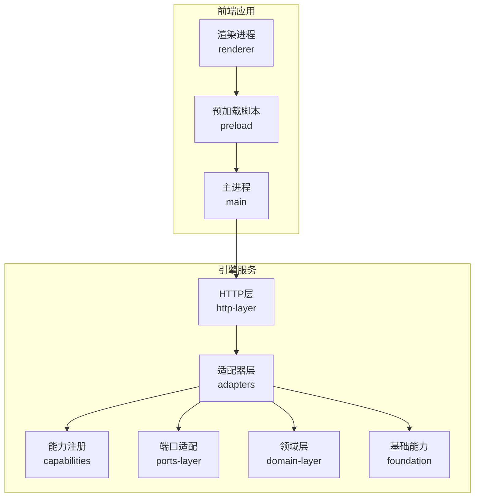
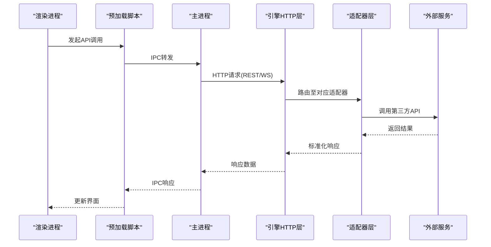
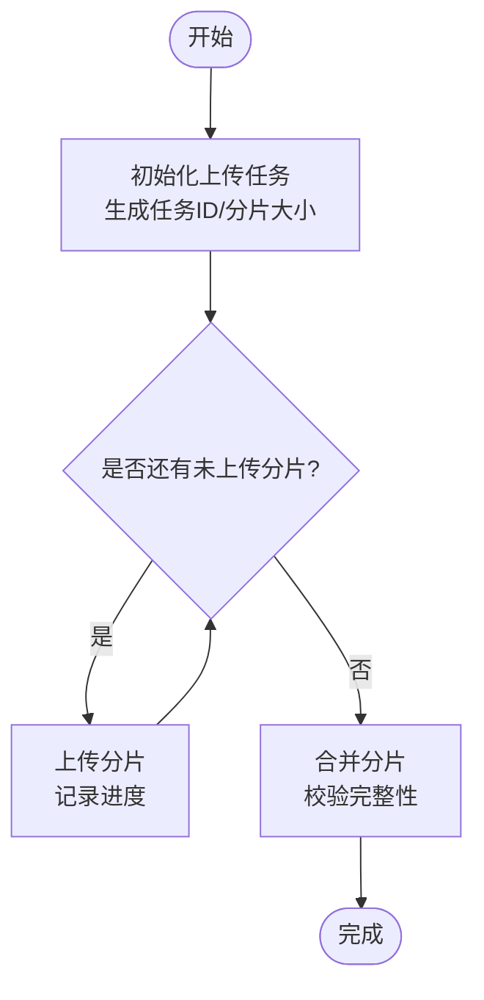
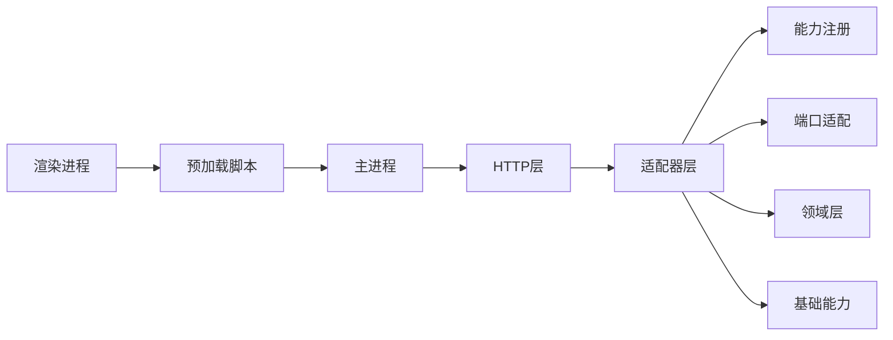

# 外部服务集成

<cite>
**本文引用的文件**   
- [engine/README.md](file://engine/README.md)
- [engine/package.json](file://engine/package.json)
- [engine/config.example.json](file://engine/config.example.json)
- [engine/docker-compose.yml](file://engine/docker-compose.yml)
- [engine/Dockerfile](file://engine/Dockerfile)
- [app/package.json](file://app/package.json)
- [app/electron.vite.config.ts](file://app/electron.vite.config.ts)
- [app/main/index.ts](file://app/main/index.ts)
- [app/main/engine-host.ts](file://app/main/engine-host.ts)
- [app/preload/index.ts](file://app/preload/index.ts)
- [app/renderer/src/services/engine-api.ts](file://app/renderer/src/services/engine-api.ts)
- [app/renderer/src/hooks/useChat.ts](file://app/renderer/src/hooks/useChat.ts)
- [app/renderer/src/components/ChatPanel/index.tsx](file://app/renderer/src/components/ChatPanel/index.tsx)
- [engine/packages/http-layer/README.md](file://engine/packages/http-layer/README.md)
- [engine/packages/foundation/README.md](file://engine/packages/foundation/README.md)
- [engine/packages/domain-layer/README.md](file://engine/packages/domain-layer/README.md)
- [engine/packages/ports-layer/README.md](file://engine/packages/ports-layer/README.md)
- [engine/packages/adapters/README.md](file://engine/packages/adapters/README.md)
- [engine/packages/capabilities/README.md](file://engine/packages/capabilities/README.md)
- [engine/packages/cli-layer/README.md](file://engine/packages/cli-layer/README.md)
- [engine/packages/delegation-layer/README.md](file://engine/packages/delegation-layer/README.md)
- [engine/packages/presets/README.md](file://engine/packages/presets/README.md)
</cite>

## 目录
1. [简介](#简介)
2. [项目结构](#项目结构)
3. [核心组件](#核心组件)
4. [架构总览](#架构总览)
5. [详细组件分析](#详细组件分析)
6. [依赖分析](#依赖分析)
7. [性能考虑](#性能考虑)
8. [故障排查指南](#故障排查指南)
9. [结论](#结论)
10. [附录](#附录)

## 简介
本技术文档面向KCoder的外部服务集成，聚焦以下目标：
- HTTP API集成：RESTful调用、GraphQL查询、WebSocket实时通信
- gRPC服务集成：服务发现、负载均衡、熔断降级
- 第三方Web服务集成：OAuth认证、API限流、错误重试机制
- 文件上传下载与大文件处理：分片、断点续传
- 监控与可观测性：服务监控、链路追踪、性能分析
- 常见外部服务示例：GitHub、Slack、邮件服务

说明：仓库中未直接包含gRPC或GraphQL的具体实现代码。本节提供基于现有HTTP层与适配器层的通用集成方案与最佳实践，便于在工程中落地。

## 项目结构
KCoder采用多包工作区（pnpm workspace）组织引擎端能力，前端应用通过Electron主进程桥接渲染进程与引擎服务。

图表来源
- [app/main/index.ts](file://app/main/index.ts)
- [app/main/engine-host.ts](file://app/main/engine-host.ts)
- [app/preload/index.ts](file://app/preload/index.ts)
- [app/renderer/src/services/engine-api.ts](file://app/renderer/src/services/engine-api.ts)
- [engine/packages/http-layer/README.md](file://engine/packages/http-layer/README.md)
- [engine/packages/adapters/README.md](file://engine/packages/adapters/README.md)
- [engine/packages/capabilities/README.md](file://engine/packages/capabilities/README.md)
- [engine/packages/ports-layer/README.md](file://engine/packages/ports-layer/README.md)
- [engine/packages/domain-layer/README.md](file://engine/packages/domain-layer/README.md)
- [engine/packages/foundation/README.md](file://engine/packages/foundation/README.md)

章节来源
- [engine/README.md](file://engine/README.md)
- [engine/package.json](file://engine/package.json)
- [app/package.json](file://app/package.json)
- [app/electron.vite.config.ts](file://app/electron.vite.config.ts)

## 核心组件
- 引擎HTTP层：对外暴露HTTP接口，承载REST请求路由、鉴权中间件、日志与追踪埋点等横切关注点。
- 适配器层：将外部系统（如GitHub、Slack、邮件服务）封装为统一的能力接口，屏蔽差异。
- 能力注册中心：集中管理可用能力，供上层编排与调度。
- 端口适配层：抽象传输协议（HTTP/WebSocket/gRPC），向上提供一致调用语义。
- 领域层：业务规则与流程编排，不感知具体外部实现细节。
- 基础能力：配置、日志、指标、追踪、缓存等通用支撑。

章节来源
- [engine/packages/http-layer/README.md](file://engine/packages/http-layer/README.md)
- [engine/packages/adapters/README.md](file://engine/packages/adapters/README.md)
- [engine/packages/capabilities/README.md](file://engine/packages/capabilities/README.md)
- [engine/packages/ports-layer/README.md](file://engine/packages/ports-layer/README.md)
- [engine/packages/domain-layer/README.md](file://engine/packages/domain-layer/README.md)
- [engine/packages/foundation/README.md](file://engine/packages/foundation/README.md)

## 架构总览
从前端到外部服务的典型调用路径如下：

图表来源
- [app/renderer/src/services/engine-api.ts](file://app/renderer/src/services/engine-api.ts)
- [app/preload/index.ts](file://app/preload/index.ts)
- [app/main/index.ts](file://app/main/index.ts)
- [engine/packages/http-layer/README.md](file://engine/packages/http-layer/README.md)
- [engine/packages/adapters/README.md](file://engine/packages/adapters/README.md)

## 详细组件分析

### HTTP API集成（REST/GraphQL/WebSocket）
- RESTful API
  - 建议通过引擎HTTP层统一路由，结合鉴权中间件、速率限制、请求签名校验。
  - 大对象与分页：使用分页参数与游标；二进制内容走专用上传接口。
- GraphQL
  - 若需复杂查询组合，可在HTTP层暴露GraphQL入口，由适配器层聚合多个外部源。
- WebSocket
  - 用于实时消息、进度推送、事件订阅。建议在HTTP层建立连接后，按通道/主题路由到相应处理器。

章节来源
- [engine/packages/http-layer/README.md](file://engine/packages/http-layer/README.md)
- [app/renderer/src/services/engine-api.ts](file://app/renderer/src/services/engine-api.ts)
- [app/renderer/src/hooks/useChat.ts](file://app/renderer/src/hooks/useChat.ts)
- [app/renderer/src/components/ChatPanel/index.tsx](file://app/renderer/src/components/ChatPanel/index.tsx)

### gRPC服务集成（服务发现/负载均衡/熔断降级）
- 服务发现
  - 通过配置中心或服务注册表获取gRPC服务端点列表，支持健康检查与动态刷新。
- 负载均衡
  - 客户端侧轮询/一致性哈希，结合权重与地域就近策略。
- 熔断与降级
  - 失败率/延迟阈值触发熔断，快速失败并回退到本地缓存或默认值；半开状态探测恢复。
- 超时与重试
  - 设置合理超时与幂等重试策略，避免雪崩。

[本节为通用集成方案，不直接分析具体源码文件]

### 第三方Web服务集成（OAuth/API限流/错误重试）
- OAuth认证
  - 授权码流程：前端跳转授权页，后端交换令牌，安全存储访问令牌与刷新令牌。
  - 令牌刷新：后台自动续期，过期前主动刷新。
- API限流
  - 令牌桶/漏桶算法，按用户/租户维度控制QPS与并发。
- 错误重试
  - 针对瞬时错误（网络抖动、5xx）进行指数退避重试；对幂等操作允许重试，非幂等操作谨慎处理。

[本节为通用集成方案，不直接分析具体源码文件]

### 文件上传下载与大文件处理（分片/断点续传）
- 上传流程
  - 初始化任务：生成唯一任务ID与分片大小。
  - 分片上传：并行上传分片，记录已上传索引。
  - 合并完成：校验完整性后合并为完整文件。
- 下载流程
  - 范围下载：根据Range头分段拉取，支持暂停与继续。
- 断点续传
  - 持久化分片元数据与进度，重启后恢复。

图表来源
- [engine/packages/http-layer/README.md](file://engine/packages/http-layer/README.md)
- [engine/packages/adapters/README.md](file://engine/packages/adapters/README.md)

### 监控、链路追踪与性能分析
- 指标采集
  - 请求耗时、成功率、错误码分布、队列长度、资源使用率。
- 链路追踪
  - 跨进程/跨服务注入TraceId，统一上报，关联上下游调用。
- 性能分析
  - 热点接口定位、慢查询分析、GC与内存泄漏排查。

[本节为通用最佳实践，不直接分析具体源码文件]

### 常见外部服务集成示例
- GitHub
  - 功能：创建Issue、提交PR、读取仓库信息。
  - 要点：OAuth令牌、Rate Limit、Webhook事件。
- Slack
  - 功能：发送消息、频道管理、Bot交互。
  - 要点：OAuth/Bot Token、事件订阅、重试与去重。
- 邮件服务
  - 功能：发送邮件、模板渲染、附件处理。
  - 要点：SMTP/IMAP或REST API、失败重试、敏感配置加密。

[本节为通用示例，不直接分析具体源码文件]

## 依赖分析
- 前端依赖
  - Electron主进程负责IPC桥接与引擎HTTP层通信。
  - 渲染进程通过预加载脚本暴露安全API给页面。
- 引擎依赖
  - HTTP层作为对外边界，适配器层对接外部系统与内部能力。
  - 能力注册与端口适配解耦了协议与业务。

图表来源
- [app/main/index.ts](file://app/main/index.ts)
- [app/preload/index.ts](file://app/preload/index.ts)
- [app/renderer/src/services/engine-api.ts](file://app/renderer/src/services/engine-api.ts)
- [engine/packages/http-layer/README.md](file://engine/packages/http-layer/README.md)
- [engine/packages/adapters/README.md](file://engine/packages/adapters/README.md)
- [engine/packages/capabilities/README.md](file://engine/packages/capabilities/README.md)
- [engine/packages/ports-layer/README.md](file://engine/packages/ports-layer/README.md)
- [engine/packages/domain-layer/README.md](file://engine/packages/domain-layer/README.md)
- [engine/packages/foundation/README.md](file://engine/packages/foundation/README.md)

章节来源
- [engine/package.json](file://engine/package.json)
- [app/package.json](file://app/package.json)
- [app/electron.vite.config.ts](file://app/electron.vite.config.ts)

## 性能考虑
- 连接复用与池化：HTTP/HTTPS连接池、WebSocket长连接复用。
- 并发控制：令牌桶/信号量限制并发度，避免下游过载。
- 缓存策略：读多写少场景引入多级缓存（本地+远端）。
- 压缩与序列化：启用Gzip/Br，选择高效序列化格式。
- 批处理与合并：批量写入、合并小请求降低开销。
- 背压与限流：上游限流保护下游，防止级联故障。

[本节为通用指导，不直接分析具体源码文件]

## 故障排查指南
- 常见问题
  - 认证失败：检查OAuth令牌有效期与权限范围。
  - 限流触发：观察429响应，调整重试退避与配额。
  - 连接异常：检查代理、证书与网络连通性。
  - 大文件失败：确认分片大小、断点续传元数据完整性。
- 诊断手段
  - 开启调试日志与TraceId，定位问题链路。
  - 使用健康检查与探针验证服务可用性。
  - 回放请求与对比期望响应，缩小问题范围。

[本节为通用指导，不直接分析具体源码文件]

## 结论
通过HTTP层与适配器层的解耦设计，KCoder能够以统一方式集成多种外部服务。结合OAuth、限流、重试、分片与断点续传等机制，可实现稳定可靠的外部系统集成。配合完善的监控与链路追踪，有助于快速定位与优化性能瓶颈。

[本节为总结性内容，不直接分析具体源码文件]

## 附录
- 部署与环境
  - Docker镜像与Compose编排参考，便于本地与生产环境快速启动。
  - 配置文件示例，涵盖外部服务接入参数与开关。

章节来源
- [engine/Dockerfile](file://engine/Dockerfile)
- [engine/docker-compose.yml](file://engine/docker-compose.yml)
- [engine/config.example.json](file://engine/config.example.json)