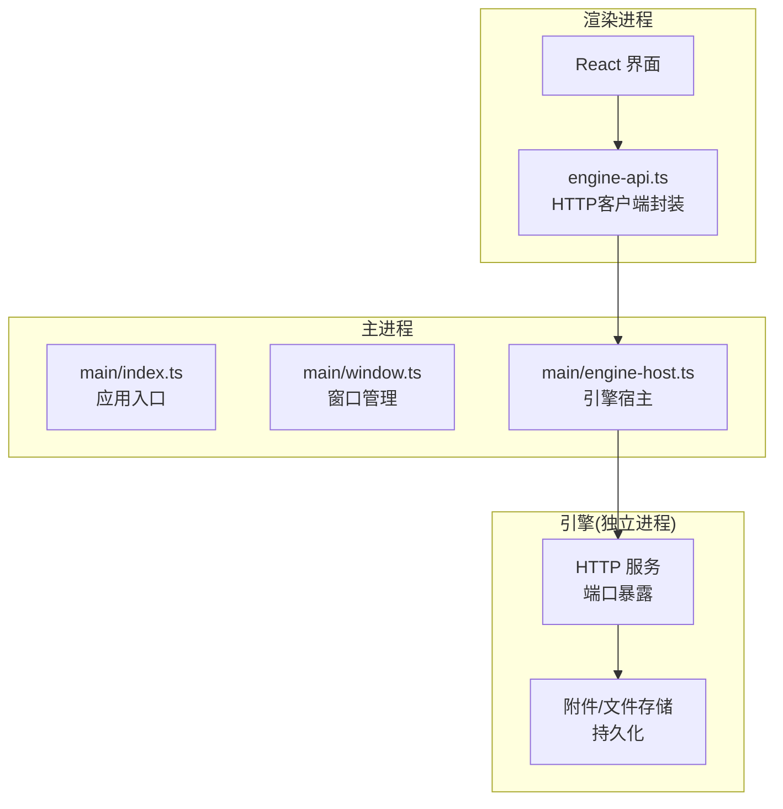
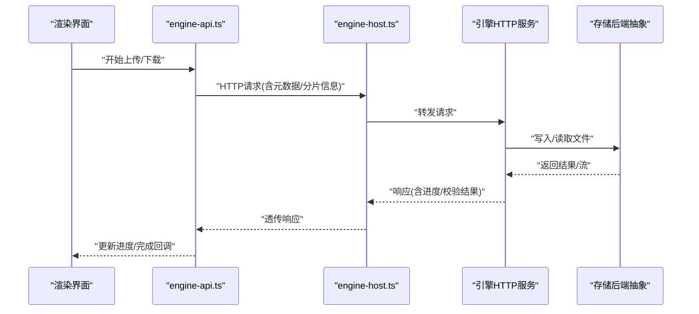
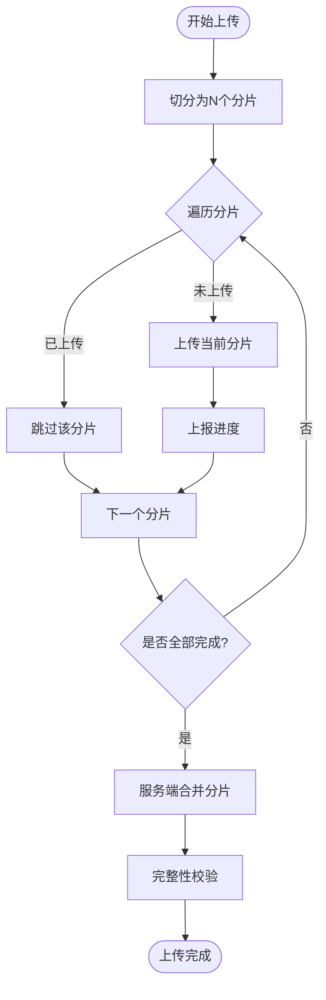
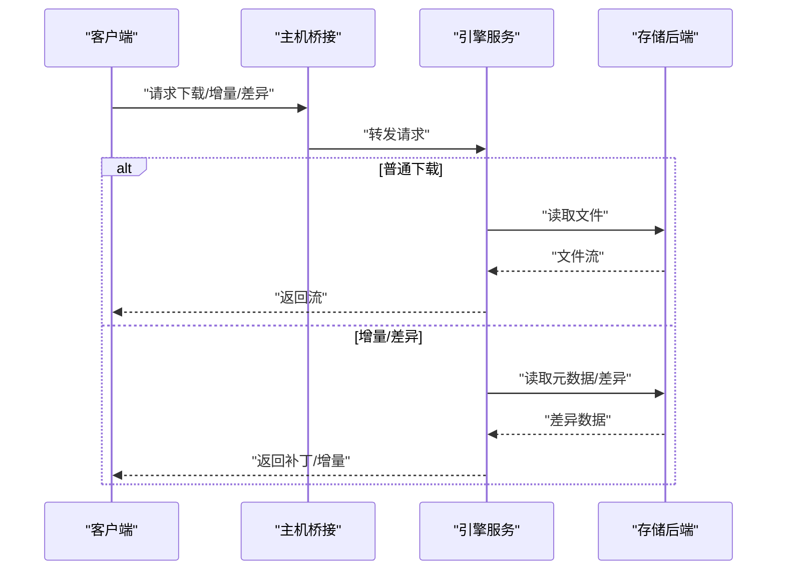
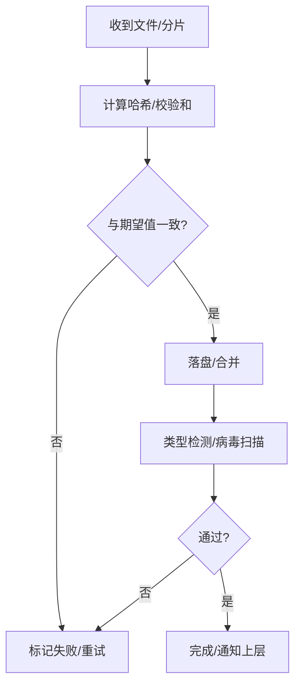
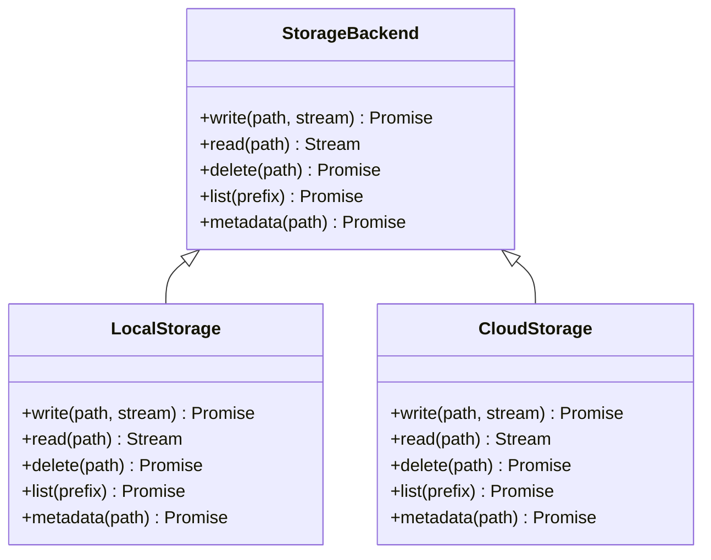
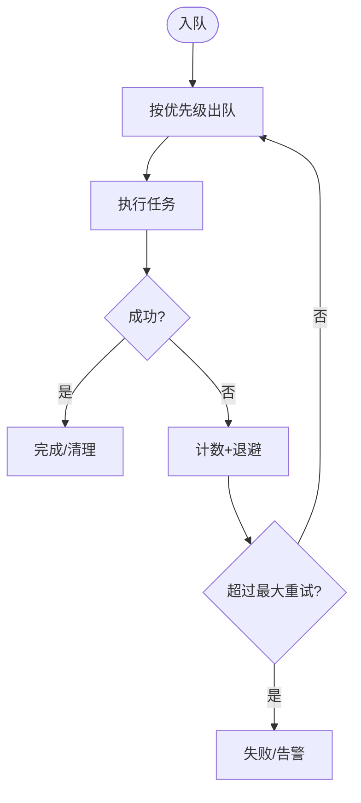
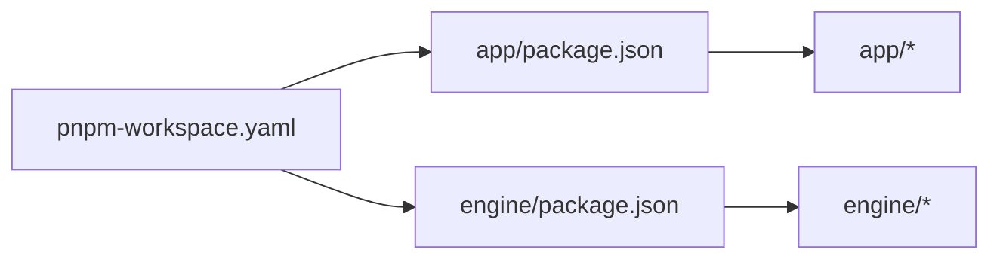

# 文件上传下载

<cite>
**本文引用的文件**   
- [engine/README.md](file://engine/README.md)
- [engine/package.json](file://engine/package.json)
- [engine/pnpm-workspace.yaml](file://engine/pnpm-workspace.yaml)
- [app/package.json](file://app/package.json)
- [app/electron.vite.config.ts](file://app/electron.vite.config.ts)
- [app/main/index.ts](file://app/main/index.ts)
- [app/main/engine-host.ts](file://app/main/engine-host.ts)
- [app/main/window.ts](file://app/main/window.ts)
- [app/preload/index.ts](file://app/preload/index.ts)
- [app/renderer/src/services/engine-api.ts](file://app/renderer/src/services/engine-api.ts)
</cite>

## 目录
1. [简介](#简介)
2. [项目结构](#项目结构)
3. [核心组件](#核心组件)
4. [架构总览](#架构总览)
5. [详细组件分析](#详细组件分析)
6. [依赖分析](#依赖分析)
7. [性能考虑](#性能考虑)
8. [故障排查指南](#故障排查指南)
9. [结论](#结论)
10. [附录](#附录)

## 简介
本技术文档围绕KCoder的文件上传与下载能力进行系统化说明，重点覆盖以下主题：
- 上传机制：分片上传、断点续传、进度跟踪
- 大文件优化：流式处理、内存管理、并发控制
- 下载模式：普通下载、增量更新、差异同步
- 完整性校验：MD5/哈希校验、损坏检测
- 安全与合规：文件类型检测、病毒扫描集成
- 存储后端抽象：本地文件系统、云存储服务
- 任务队列：调度、重试、优先级
- 监控与恢复：可观测性、崩溃恢复、幂等设计

需要特别说明的是：在当前仓库中未发现直接实现“分片上传”“断点续传”“差异同步”的源代码。因此，本节提供基于现有工程结构的参考设计与集成建议，并在相关章节标注“概念性内容”，以便在后续迭代中落地实现。

## 项目结构
KCoder采用Electron + Vite的前端渲染层与Node.js引擎（engine）分离的双进程架构：
- 渲染进程（Renderer）：React UI，负责用户交互与状态展示
- 主进程（Main）：通过IPC桥接调用引擎服务
- 引擎（Engine）：以独立包形式存在，提供HTTP API与服务编排能力

图表来源
- [app/main/index.ts:1-200](file://app/main/index.ts#L1-L200)
- [app/main/window.ts:1-200](file://app/main/window.ts#L1-L200)
- [app/main/engine-host.ts:1-200](file://app/main/engine-host.ts#L1-L200)
- [app/renderer/src/services/engine-api.ts:1-200](file://app/renderer/src/services/engine-api.ts#L1-L200)

章节来源
- [app/main/index.ts:1-200](file://app/main/index.ts#L1-L200)
- [app/main/window.ts:1-200](file://app/main/window.ts#L1-L200)
- [app/main/engine-host.ts:1-200](file://app/main/engine-host.ts#L1-L200)
- [app/renderer/src/services/engine-api.ts:1-200](file://app/renderer/src/services/engine-api.ts#L1-L200)

## 核心组件
- 渲染侧HTTP客户端：用于发起上传/下载请求、携带进度回调、错误重试策略
- 主进程桥接：将渲染进程请求转发至引擎HTTP服务
- 引擎HTTP服务：接收文件操作请求，协调存储后端、校验、扫描、队列等
- 存储后端抽象：统一接口适配本地磁盘与云存储

章节来源
- [app/renderer/src/services/engine-api.ts:1-200](file://app/renderer/src/services/engine-api.ts#L1-L200)
- [app/main/engine-host.ts:1-200](file://app/main/engine-host.ts#L1-L200)

## 架构总览
下图展示了从渲染进程到引擎存储后端的端到端数据流，涵盖上传与下载的关键路径。

图表来源
- [app/renderer/src/services/engine-api.ts:1-200](file://app/renderer/src/services/engine-api.ts#L1-L200)
- [app/main/engine-host.ts:1-200](file://app/main/engine-host.ts#L1-L200)

## 详细组件分析

### 上传子系统（分片、断点续传、进度）
- 分片上传
  - 客户端按固定大小切分文件，为每个分片生成唯一ID与序列号
  - 支持并发上传，结合速率限制避免阻塞
  - 服务端聚合分片并落盘，完成后合并
- 断点续传
  - 客户端记录已上传分片索引与时间戳
  - 服务端维护分片清单，支持跳过已完成分片
  - 失败重试时仅重传缺失分片
- 进度跟踪
  - 服务端每完成一个分片即推送进度事件
  - 客户端累计已上传字节数，计算百分比并刷新UI

图表来源
- [app/renderer/src/services/engine-api.ts:1-200](file://app/renderer/src/services/engine-api.ts#L1-L200)
- [app/main/engine-host.ts:1-200](file://app/main/engine-host.ts#L1-L200)

章节来源
- [app/renderer/src/services/engine-api.ts:1-200](file://app/renderer/src/services/engine-api.ts#L1-L200)
- [app/main/engine-host.ts:1-200](file://app/main/engine-host.ts#L1-L200)

### 下载子系统（普通下载、增量更新、差异同步）
- 普通下载
  - 客户端发起下载请求，服务端返回完整文件或流
- 增量更新
  - 客户端先获取目标文件的摘要（如哈希），服务端对比本地版本，仅返回变更部分
- 差异同步
  - 客户端发送本地快照与远程快照的差异描述，服务端生成补丁并下发，客户端应用补丁

图表来源
- [app/renderer/src/services/engine-api.ts:1-200](file://app/renderer/src/services/engine-api.ts#L1-L200)
- [app/main/engine-host.ts:1-200](file://app/main/engine-host.ts#L1-L200)

章节来源
- [app/renderer/src/services/engine-api.ts:1-200](file://app/renderer/src/services/engine-api.ts#L1-L200)
- [app/main/engine-host.ts:1-200](file://app/main/engine-host.ts#L1-L200)

### 完整性校验与安全扫描
- 完整性校验
  - 上传完成后对最终文件计算哈希（如MD5/SHA-256），并与客户端或元数据中的期望值比对
  - 下载完成后同样执行校验，失败则触发重试或告警
- 损坏检测
  - 分片级校验：每个分片上传前计算校验和，服务端验证后再落盘
  - 合并后二次校验：确保合并后的文件与预期一致
- 文件类型检测与病毒扫描
  - 基于MIME与扩展名双重判断，拒绝非法类型
  - 可选接入外部扫描器，扫描通过后放行

图表来源
- [app/renderer/src/services/engine-api.ts:1-200](file://app/renderer/src/services/engine-api.ts#L1-L200)
- [app/main/engine-host.ts:1-200](file://app/main/engine-host.ts#L1-L200)

章节来源
- [app/renderer/src/services/engine-api.ts:1-200](file://app/renderer/src/services/engine-api.ts#L1-L200)
- [app/main/engine-host.ts:1-200](file://app/main/engine-host.ts#L1-L200)

### 存储后端抽象（本地/云存储）
- 抽象接口
  - 定义统一的读写、删除、列表、元数据查询方法
- 本地实现
  - 基于文件系统，支持原子写入、临时目录隔离、权限控制
- 云存储实现
  - 对接对象存储（如S3/OSS），支持分片上传、断点续传、签名URL
- 切换策略
  - 通过配置选择后端；同一命名空间下保持路径一致性

图表来源
- [app/main/engine-host.ts:1-200](file://app/main/engine-host.ts#L1-L200)

章节来源
- [app/main/engine-host.ts:1-200](file://app/main/engine-host.ts#L1-L200)

### 文件操作队列（调度、重试、优先级）
- 任务模型
  - 包含任务ID、类型（上传/下载）、优先级、参数、状态、重试次数、错误信息
- 调度策略
  - 优先级队列：高优先级优先执行
  - 限流与背压：控制并发度，避免资源耗尽
- 重试与退避
  - 指数退避+抖动，最大重试次数上限
  - 幂等键：防止重复提交导致副作用
- 持久化
  - 任务状态持久化，重启后可恢复

图表来源
- [app/main/engine-host.ts:1-200](file://app/main/engine-host.ts#L1-L200)

章节来源
- [app/main/engine-host.ts:1-200](file://app/main/engine-host.ts#L1-L200)

### 前端集成要点（渲染进程）
- HTTP客户端封装
  - 统一拦截器：添加鉴权、超时、重试
  - 进度回调：基于事件流或轮询获取进度
  - 取消与暂停：支持中断长耗时任务
- 错误处理
  - 网络异常、服务端错误、校验失败的分类处理
  - 用户提示与自动重试策略

章节来源
- [app/renderer/src/services/engine-api.ts:1-200](file://app/renderer/src/services/engine-api.ts#L1-L200)

## 依赖分析
- 工程依赖
  - engine与app均为pnpm工作区成员，分别维护自身依赖
- 运行时依赖
  - Electron主进程与渲染进程通信由Electron框架提供
  - 引擎HTTP服务作为独立进程对外暴露API

图表来源
- [app/package.json:1-200](file://app/package.json#L1-L200)
- [engine/package.json:1-200](file://engine/package.json#L1-L200)
- [engine/pnpm-workspace.yaml:1-200](file://engine/pnpm-workspace.yaml#L1-L200)

章节来源
- [app/package.json:1-200](file://app/package.json#L1-L200)
- [engine/package.json:1-200](file://engine/package.json#L1-L200)
- [engine/pnpm-workspace.yaml:1-200](file://engine/pnpm-workspace.yaml#L1-L200)

## 性能考虑
- 流式处理
  - 上传/下载使用流式I/O，避免一次性加载大文件到内存
- 内存管理
  - 设置合理的缓冲区大小，及时释放引用，避免内存泄漏
- 并发控制
  - 根据CPU与IO能力动态调整并发度，避免争用
- 缓存与去重
  - 相同内容的分片去重，减少重复传输
- 压缩与编码
  - 对文本类文件启用压缩，降低带宽占用

[本节为通用指导，不直接分析具体文件]

## 故障排查指南
- 常见问题定位
  - 上传失败：检查分片顺序、校验和、网络超时
  - 下载不完整：核对哈希、确认流式读取边界
  - 任务卡住：查看队列状态、重试计数、锁竞争
- 日志与追踪
  - 关键节点打点：入队、出队、开始、完成、失败
  - 关联ID贯穿全链路，便于跨进程追踪
- 恢复策略
  - 任务持久化与回放
  - 断点续传与幂等键保障

章节来源
- [app/main/engine-host.ts:1-200](file://app/main/engine-host.ts#L1-L200)
- [app/renderer/src/services/engine-api.ts:1-200](file://app/renderer/src/services/engine-api.ts#L1-L200)

## 结论
KCoder当前仓库提供了清晰的前后端分层与进程间通信基础，具备实现高性能文件上传下载的架构条件。建议在引擎层完善存储后端抽象、任务队列与校验扫描能力，在前端侧强化进度与错误处理体验。对于尚未实现的特性（如分片上传、断点续传、差异同步），可按本文提供的流程与接口约定逐步落地。

[本节为总结性内容，不直接分析具体文件]

## 附录
- 配置项建议
  - 分片大小、并发度、重试次数、超时时间、存储后端选择
- 兼容性说明
  - 不同云存储的分片上传协议差异需通过适配器屏蔽
- 测试建议
  - 单元测试：校验算法、队列逻辑
  - 集成测试：端到端上传下载、断网恢复
  - 压力测试：大文件、高并发场景

[本节为补充信息，不直接分析具体文件]