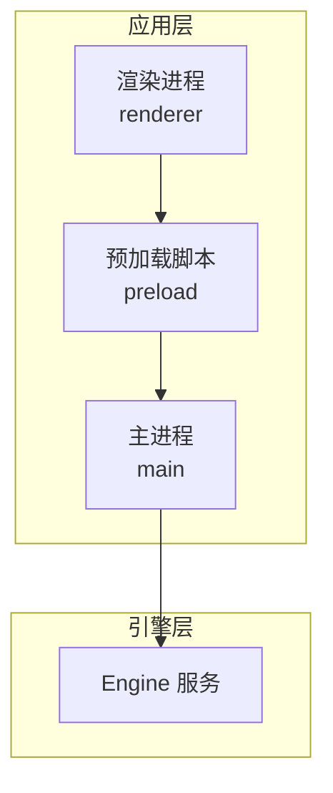
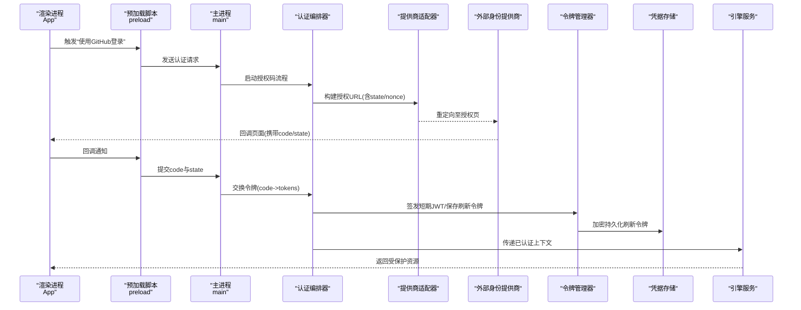
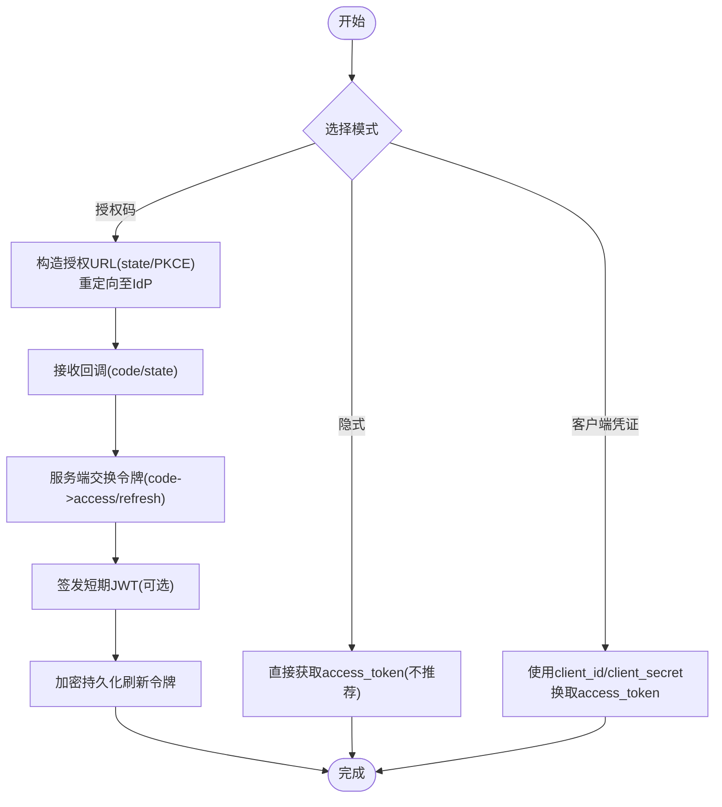
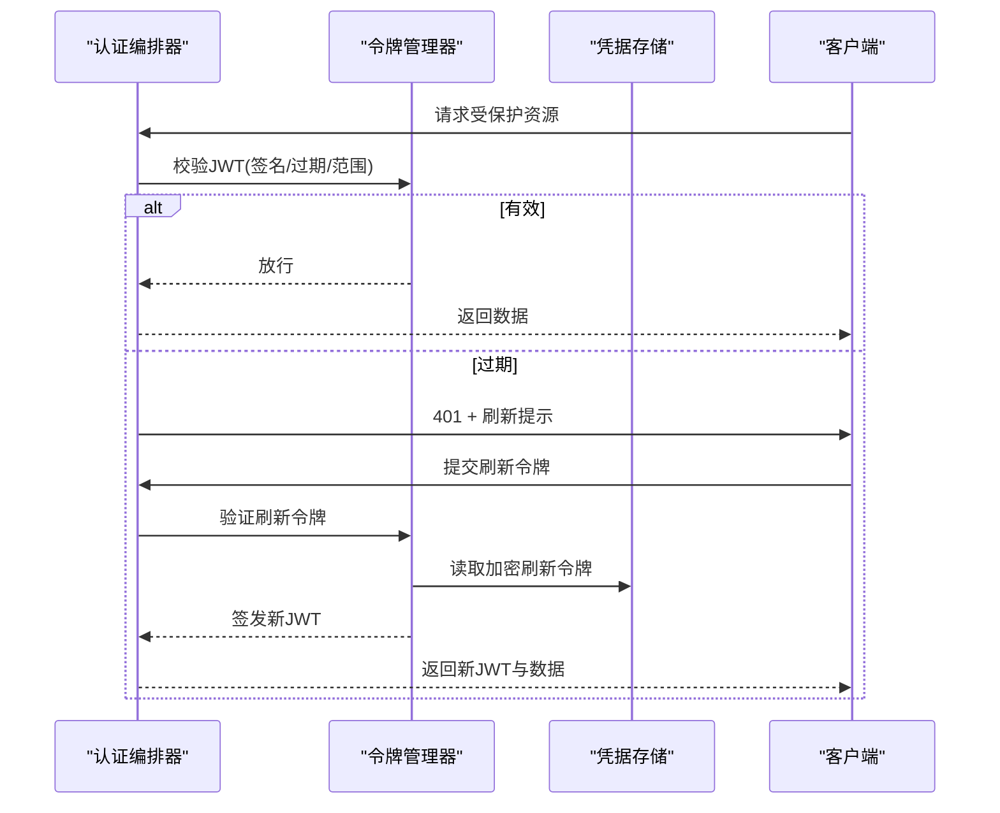
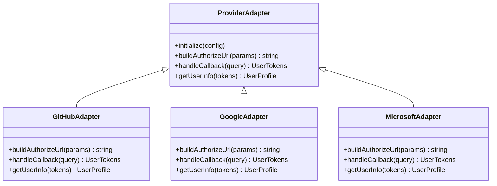
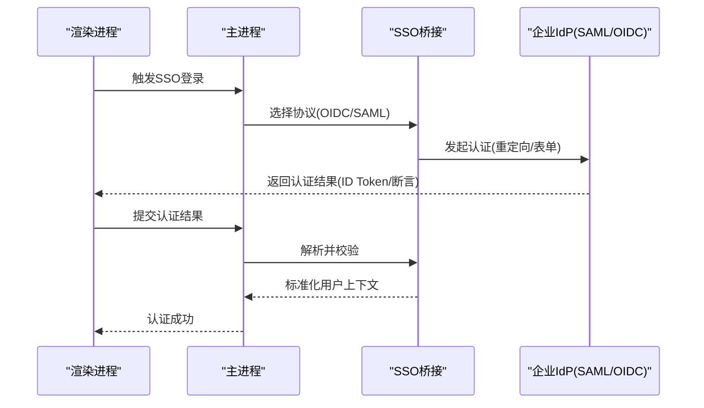
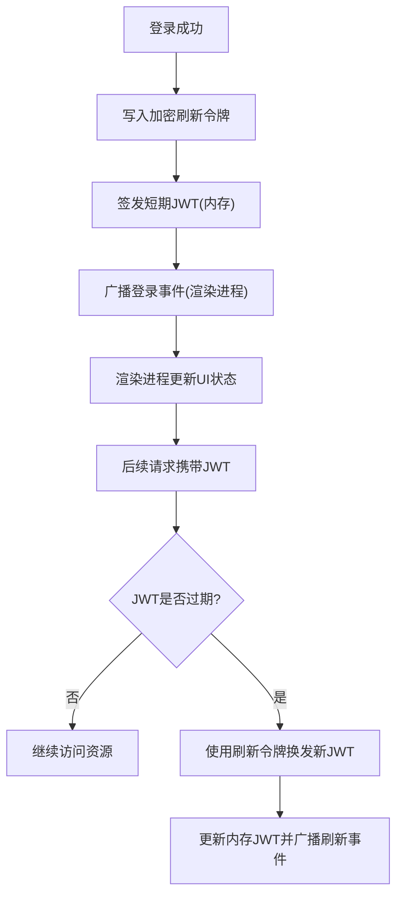
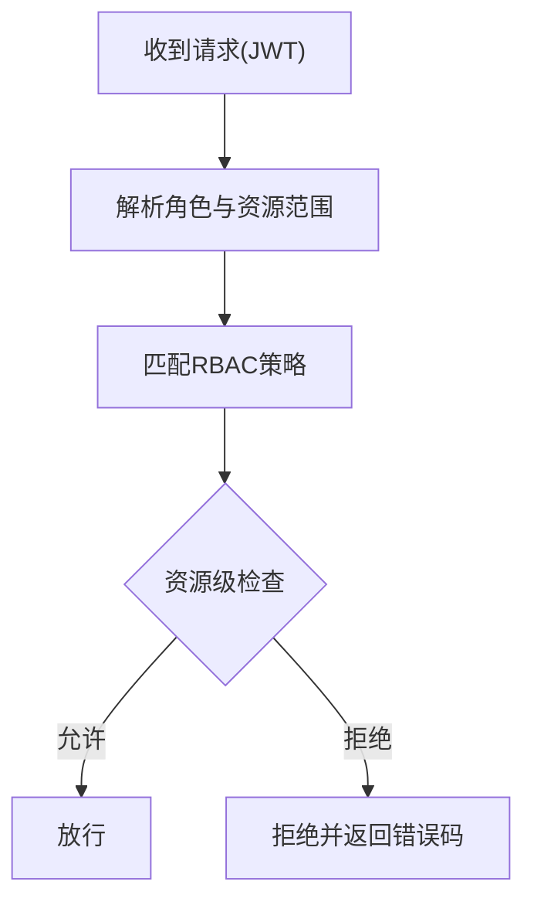
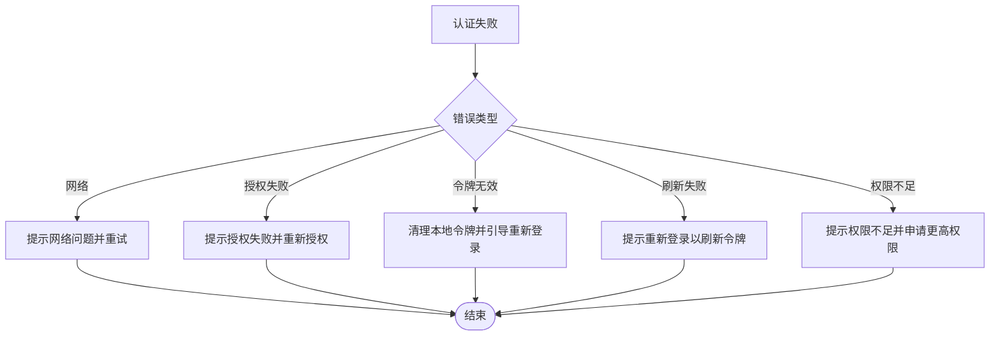
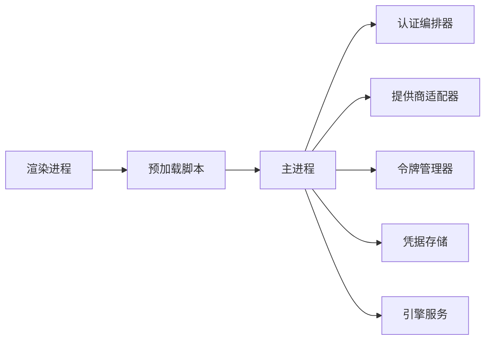

# 第三方认证集成

<cite>
**本文引用的文件**   
- [app/main/index.ts](file://app/main/index.ts)
- [app/main/engine-host.ts](file://app/main/engine-host.ts)
- [app/main/settings.ts](file://app/main/settings.ts)
- [app/main/window.ts](file://app/main/window.ts)
- [app/preload/index.ts](file://app/preload/index.ts)
- [app/renderer/src/main.tsx](file://app/renderer/src/main.tsx)
- [app/renderer/src/App.tsx](file://app/renderer/src/App.tsx)
- [app/renderer/src/services/engine-api.ts](file://app/renderer/src/services/engine-api.ts)
- [engine/README.md](file://engine/README.md)
- [engine/config.example.json](file://engine/config.example.json)
</cite>

## 目录
1. [简介](#简介)
2. [项目结构](#项目结构)
3. [核心组件](#核心组件)
4. [架构总览](#架构总览)
5. [详细组件分析](#详细组件分析)
6. [依赖关系分析](#依赖关系分析)
7. [性能考虑](#性能考虑)
8. [故障排查指南](#故障排查指南)
9. [结论](#结论)
10. [附录](#附录) 

## 简介
本技术文档面向KCoder的第三方认证集成，目标是提供一套可落地的设计与实现方案，覆盖以下关键主题：
- OAuth2.0协议实现：授权码模式、隐式模式、客户端凭证模式
- JWT令牌处理：生成、验证、刷新机制
- 多提供商统一接口：GitHub、Google、Microsoft账户登录
- 凭据安全存储：加密存储、密钥管理、访问控制
- 单点登录（SSO）：SAML、OpenID Connect
- 认证状态同步与持久化
- 权限模型：RBAC与资源级权限
- 认证失败错误处理与用户引导流程

说明：当前仓库未包含现成的认证实现代码。本文基于工程结构与常见实践，给出适配KCoder的完整设计方案与落地建议，并标注与现有模块的对接点。

## 项目结构
KCoder采用Electron + Vite前端 + Node引擎的多层架构：
- app/main：Electron主进程入口、窗口与菜单、设置等
- app/preload：预加载脚本，暴露安全API给渲染进程
- app/renderer：React前端界面与服务调用封装
- engine：后端能力与插件体系（当前未见认证相关实现）

图表来源
- [app/main/index.ts](file://app/main/index.ts)
- [app/preload/index.ts](file://app/preload/index.ts)
- [app/renderer/src/main.tsx](file://app/renderer/src/main.tsx)
- [engine/README.md](file://engine/README.md)

章节来源
- [app/main/index.ts](file://app/main/index.ts)
- [app/main/engine-host.ts](file://app/main/engine-host.ts)
- [app/main/settings.ts](file://app/main/settings.ts)
- [app/main/window.ts](file://app/main/window.ts)
- [app/preload/index.ts](file://app/preload/index.ts)
- [app/renderer/src/main.tsx](file://app/renderer/src/main.tsx)
- [app/renderer/src/App.tsx](file://app/renderer/src/App.tsx)
- [engine/README.md](file://engine/README.md)

## 核心组件
围绕第三方认证，建议引入以下核心组件并与现有模块对接：
- 认证编排器（Auth Orchestrator）：负责选择提供商、发起OAuth/OIDC/SAML流程、协调JWT生命周期
- 提供商适配器（Provider Adapter）：统一抽象GitHub/Google/Microsoft等差异
- 令牌管理器（Token Manager）：JWT签发/校验/刷新、短期令牌与长期刷新令牌轮换
- 凭据存储（Credential Store）：平台安全的加密存储（如系统钥匙串），结合密钥派生与访问控制
- SSO桥接（SSO Bridge）：SAML断言解析、OIDC会话同步、本地会话映射
- 权限策略（Policy Engine）：RBAC与资源级权限评估
- 事件总线（Auth Events）：跨进程/跨模块的认证状态同步

上述组件将作为新增模块，通过主进程或引擎侧HTTP服务对外暴露统一API，供渲染进程调用。

章节来源
- [app/main/index.ts](file://app/main/index.ts)
- [app/main/engine-host.ts](file://app/main/engine-host.ts)
- [app/main/settings.ts](file://app/main/settings.ts)
- [app/preload/index.ts](file://app/preload/index.ts)
- [app/renderer/src/services/engine-api.ts](file://app/renderer/src/services/engine-api.ts)

## 架构总览
下图展示从渲染进程到主进程再到引擎层的认证交互路径，以及外部身份提供商的接入位置。

图表来源
- [app/main/index.ts](file://app/main/index.ts)
- [app/preload/index.ts](file://app/preload/index.ts)
- [app/renderer/src/services/engine-api.ts](file://app/renderer/src/services/engine-api.ts)
- [engine/README.md](file://engine/README.md)

## 详细组件分析

### OAuth2.0协议实现
- 授权码模式（Authorization Code）
  - 适用场景：桌面端与Web回调，推荐用于GitHub/Google/Microsoft
  - 关键点：state防CSRF、PKCE增强安全性、回调URL白名单、短时效访问令牌+长时效刷新令牌
- 隐式模式（Implicit）
  - 不推荐在桌面端使用；若必须支持，需限制scope与最小化敏感信息
- 客户端凭证模式（Client Credentials）
  - 适用于机器对机器通信，不适合用户登录；可用于引擎内部服务间鉴权

图表来源
- [app/main/index.ts](file://app/main/index.ts)
- [app/preload/index.ts](file://app/preload/index.ts)
- [app/renderer/src/services/engine-api.ts](file://app/renderer/src/services/engine-api.ts)

章节来源
- [app/main/index.ts](file://app/main/index.ts)
- [app/preload/index.ts](file://app/preload/index.ts)
- [app/renderer/src/services/engine-api.ts](file://app/renderer/src/services/engine-api.ts)

### JWT令牌处理
- 生成
  - 由认证编排器在成功交换令牌后签发短期JWT，包含用户标识、角色、资源范围、过期时间等
- 验证
  - 网关/中间件校验签名、有效期、受众与发行者；必要时校验吊销列表
- 刷新
  - 短期JWT过期时，使用刷新令牌换取新短期JWT；刷新令牌定期轮换并记录审计日志

图表来源
- [app/main/index.ts](file://app/main/index.ts)
- [app/preload/index.ts](file://app/preload/index.ts)
- [app/renderer/src/services/engine-api.ts](file://app/renderer/src/services/engine-api.ts)

章节来源
- [app/main/index.ts](file://app/main/index.ts)
- [app/preload/index.ts](file://app/preload/index.ts)
- [app/renderer/src/services/engine-api.ts](file://app/renderer/src/services/engine-api.ts)

### 多提供商统一接口设计
- 统一接口
  - 初始化：注册提供商配置（clientId、redirectUri、scopes、公钥/证书）
  - 授权：生成授权URL、处理回调、提取用户信息与令牌
  - 用户信息：标准化用户对象（id、email、头像、显示名等）
- 典型提供商
  - GitHub：OAuth2授权码模式
  - Google：OAuth2/OIDC
  - Microsoft账户：OAuth2/OIDC

图表来源
- [app/main/index.ts](file://app/main/index.ts)
- [app/preload/index.ts](file://app/preload/index.ts)
- [app/renderer/src/services/engine-api.ts](file://app/renderer/src/services/engine-api.ts)

章节来源
- [app/main/index.ts](file://app/main/index.ts)
- [app/preload/index.ts](file://app/preload/index.ts)
- [app/renderer/src/services/engine-api.ts](file://app/renderer/src/services/engine-api.ts)

### 凭据的安全存储
- 加密存储
  - 使用操作系统提供的安全存储（如macOS Keychain、Windows Credential Manager、Linux Secret Service）
  - 对称密钥由硬件安全模块或可信执行环境派生，避免硬编码
- 密钥管理
  - 主密钥按环境隔离（开发/测试/生产），支持轮转与版本化
  - 敏感配置（clientId、clientSecret、私钥）通过环境变量或密钥管理服务注入
- 访问控制
  - 仅主进程持有解密能力，渲染进程通过预加载脚本的最小API访问
  - 细粒度权限：按功能域划分访问范围，记录审计日志

章节来源
- [app/main/index.ts](file://app/main/index.ts)
- [app/preload/index.ts](file://app/preload/index.ts)
- [app/main/settings.ts](file://app/main/settings.ts)

### 单点登录（SSO）实现方案
- OpenID Connect（OIDC）
  - 基于OAuth2扩展，支持ID Token、UserInfo、离线访问（refresh token）
  - 适合Google/Microsoft等主流提供商
- SAML
  - 企业常用，通过SAML断言进行身份断言
  - 需要解析断言、校验签名、映射属性到本地用户模型

图表来源
- [app/main/index.ts](file://app/main/index.ts)
- [app/preload/index.ts](file://app/preload/index.ts)
- [app/renderer/src/services/engine-api.ts](file://app/renderer/src/services/engine-api.ts)

章节来源
- [app/main/index.ts](file://app/main/index.ts)
- [app/preload/index.ts](file://app/preload/index.ts)
- [app/renderer/src/services/engine-api.ts](file://app/renderer/src/services/engine-api.ts)

### 认证状态同步与持久化
- 状态同步
  - 主进程维护全局认证状态，通过IPC向渲染进程广播登录/登出/令牌刷新事件
- 持久化
  - 短期JWT内存缓存，刷新令牌加密持久化
  - 用户偏好与上次登录提供商信息可持久化以便快速恢复体验

图表来源
- [app/main/index.ts](file://app/main/index.ts)
- [app/preload/index.ts](file://app/preload/index.ts)
- [app/renderer/src/services/engine-api.ts](file://app/renderer/src/services/engine-api.ts)

章节来源
- [app/main/index.ts](file://app/main/index.ts)
- [app/preload/index.ts](file://app/preload/index.ts)
- [app/renderer/src/services/engine-api.ts](file://app/renderer/src/services/engine-api.ts)

### 权限模型设计（RBAC与资源级权限）
- RBAC
  - 角色：管理员、开发者、访客
  - 权限：读/写/删除/部署/管理等操作集合
- 资源级权限
  - 针对具体资源（项目、文件、工具）的细粒度访问控制
- 决策流程
  - 从JWT中解析角色与资源范围，结合策略引擎评估是否允许访问

图表来源
- [app/main/index.ts](file://app/main/index.ts)
- [app/preload/index.ts](file://app/preload/index.ts)
- [app/renderer/src/services/engine-api.ts](file://app/renderer/src/services/engine-api.ts)

章节来源
- [app/main/index.ts](file://app/main/index.ts)
- [app/preload/index.ts](file://app/preload/index.ts)
- [app/renderer/src/services/engine-api.ts](file://app/renderer/src/services/engine-api.ts)

### 认证失败的错误处理与用户引导
- 错误分类
  - 网络错误、授权失败、令牌无效、刷新失败、权限不足
- 用户引导
  - 明确提示失败原因并提供重试、切换提供商、重新授权等操作
  - 对于刷新失败，引导用户重新登录以获取新的刷新令牌

图表来源
- [app/main/index.ts](file://app/main/index.ts)
- [app/preload/index.ts](file://app/preload/index.ts)
- [app/renderer/src/services/engine-api.ts](file://app/renderer/src/services/engine-api.ts)

章节来源
- [app/main/index.ts](file://app/main/index.ts)
- [app/preload/index.ts](file://app/preload/index.ts)
- [app/renderer/src/services/engine-api.ts](file://app/renderer/src/services/engine-api.ts)

## 依赖关系分析
- 渲染进程通过预加载脚本调用主进程API，主进程负责与认证编排器、提供商适配器、令牌管理器、凭据存储交互
- 引擎服务通过主进程代理访问受保护资源，确保认证上下文正确传递

图表来源
- [app/main/index.ts](file://app/main/index.ts)
- [app/preload/index.ts](file://app/preload/index.ts)
- [app/renderer/src/services/engine-api.ts](file://app/renderer/src/services/engine-api.ts)
- [engine/README.md](file://engine/README.md)

章节来源
- [app/main/index.ts](file://app/main/index.ts)
- [app/preload/index.ts](file://app/preload/index.ts)
- [app/renderer/src/services/engine-api.ts](file://app/renderer/src/services/engine-api.ts)
- [engine/README.md](file://engine/README.md)

## 性能考虑
- 减少不必要的网络往返：批量刷新令牌、缓存短期JWT
- 异步与并发：认证流程非阻塞，避免冻结UI
- 令牌轮换策略：合理设置短期JWT过期时间与刷新令牌轮换频率
- 资源最小化：按需请求用户信息与scope，降低带宽与隐私风险

[本节为通用指导，无需源码引用]

## 故障排查指南
- 常见问题
  - 回调URL不匹配：检查提供商控制台配置的redirectUri
  - state校验失败：确认state生成与比对逻辑一致
  - 刷新令牌失效：清理本地缓存并引导重新登录
  - 权限不足：检查JWT中的角色与资源范围
- 调试建议
  - 启用详细日志（脱敏），记录关键步骤与错误码
  - 使用独立测试账号与沙箱环境验证不同提供商流程

章节来源
- [app/main/index.ts](file://app/main/index.ts)
- [app/preload/index.ts](file://app/preload/index.ts)
- [app/renderer/src/services/engine-api.ts](file://app/renderer/src/services/engine-api.ts)

## 结论
本文提供了KCoder第三方认证集成的完整设计方案，涵盖OAuth2.0三种模式、JWT生命周期管理、多提供商统一接口、凭据安全存储、SSO（SAML/OIDC）、认证状态同步、RBAC与资源级权限、错误处理与用户引导。建议在主进程中集中实现认证编排与安全边界，通过预加载脚本最小化暴露面，并在引擎层透传认证上下文以实现统一的受保护资源访问。

[本节为总结性内容，无需源码引用]

## 附录
- 配置示例参考
  - 引擎配置文件可作为外部配置注入点，用于存放与认证相关的非敏感参数（如回调域名、默认提供商）
  - 敏感配置应通过环境变量或密钥管理服务注入，避免进入代码仓库

章节来源
- [engine/config.example.json](file://engine/config.example.json)
- [engine/README.md](file://engine/README.md)