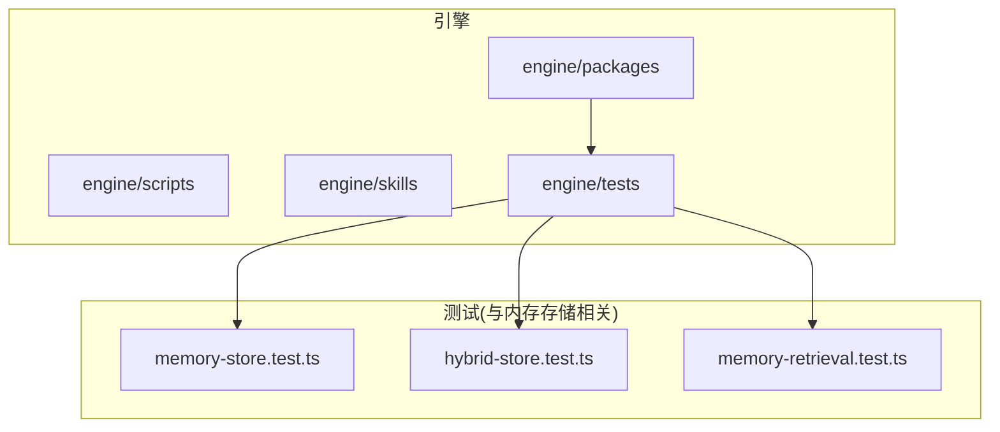
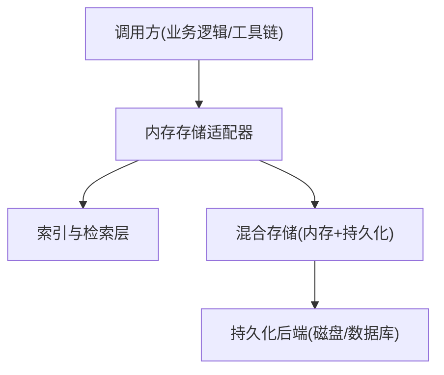
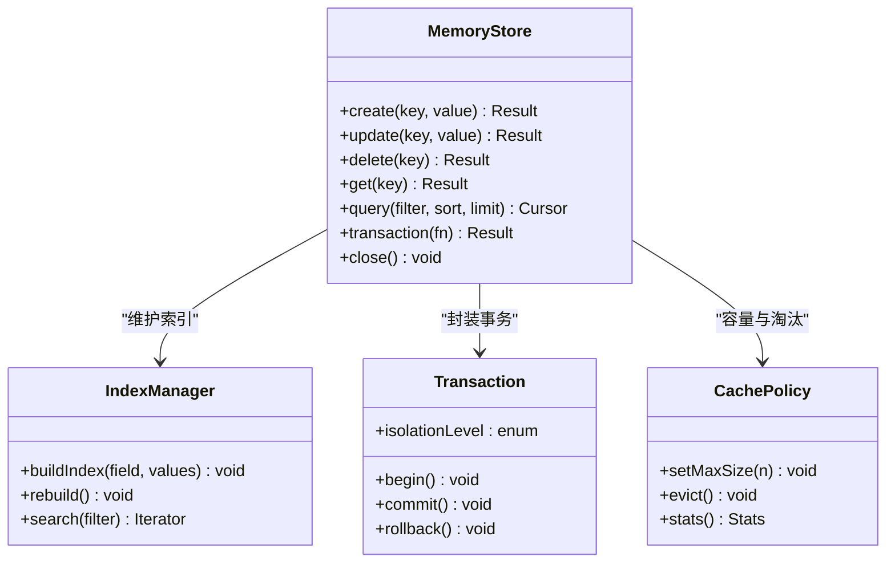
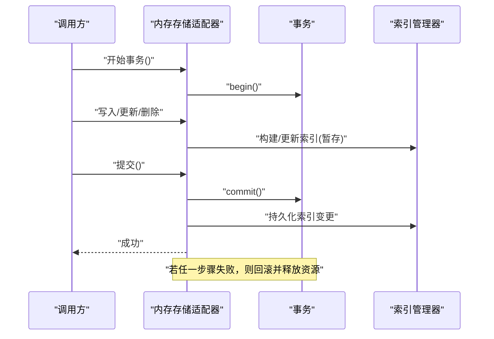
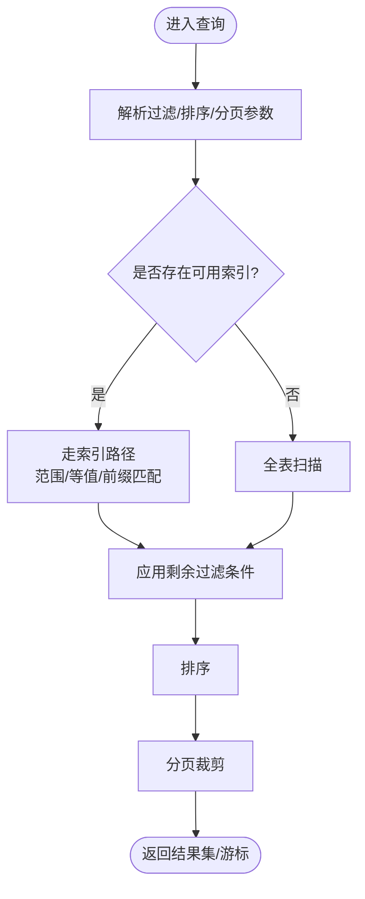
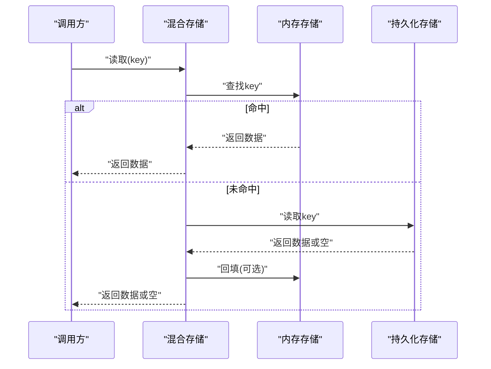
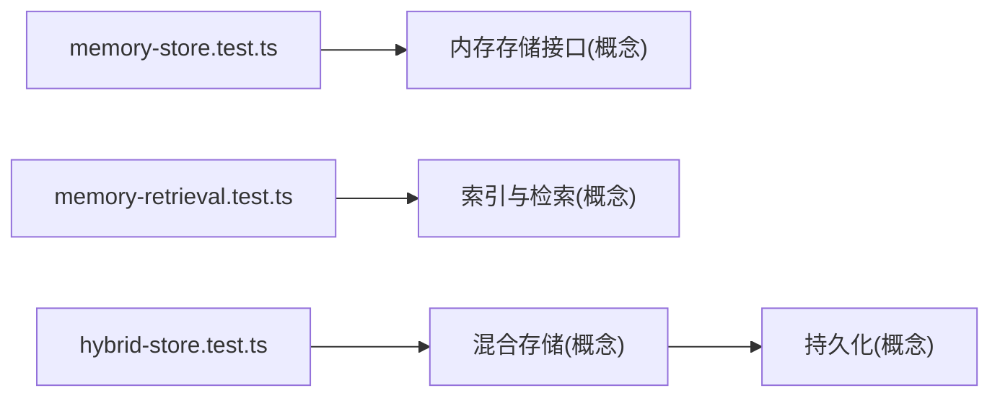

# 内存存储适配器

<cite>
**本文引用的文件**   
- [memory-store.test.ts](file://engine/tests/memory-store.test.ts)
- [hybrid-store.test.ts](file://engine/tests/hybrid-store.test.ts)
- [memory-retrieval.test.ts](file://engine/tests/memory-retrieval.test.ts)
- [package.json](file://engine/package.json)
</cite>

## 目录
1. [简介](#简介)
2. [项目结构](#项目结构)
3. [核心组件](#核心组件)
4. [架构总览](#架构总览)
5. [详细组件分析](#详细组件分析)
6. [依赖分析](#依赖分析)
7. [性能考虑](#性能考虑)
8. [故障排查指南](#故障排查指南)
9. [结论](#结论)
10. [附录](#附录)

## 简介
本技术文档聚焦于KCoder的“内存存储适配器”，围绕其实现原理、数据结构设计、内存管理策略与并发安全进行系统化说明，并给出接口能力（CRUD、查询、事务）、配置选项、典型使用场景（开发测试、缓存层）、关键风险点（内存泄漏防护、数据序列化）以及性能基准与监控指标建议。由于仓库中未包含该适配器的具体源码实现，本文基于现有测试用例与工程上下文进行归纳与抽象，确保读者在不接触源码的情况下也能理解其设计要点与最佳实践。

## 项目结构
从仓库结构看，KCoder采用多包工作区组织，引擎相关代码位于 engine/ 下，测试集中于 engine/tests/。与内存存储相关的测试文件包括：
- memory-store.test.ts：验证内存存储的核心行为（增删改查、一致性、边界条件等）。
- hybrid-store.test.ts：验证混合存储（内存+持久化）的协同行为与回退策略。
- memory-retrieval.test.ts：验证内存检索路径的性能与正确性（索引、过滤、排序等）。

图表来源
- [package.json:1-200](file://engine/package.json#L1-L200)

章节来源
- [package.json:1-200](file://engine/package.json#L1-L200)

## 核心组件
本节对内存存储适配器的关键能力进行分层说明，结合测试覆盖范围推断其职责边界与交互方式。

- 数据模型与索引
  - 主键与唯一约束：通过测试可推断存在主键或唯一键机制，用于快速定位与冲突检测。
  - 二级索引：检索测试暗示支持按字段过滤、排序与分页，通常由哈希表或B树类结构支撑。
  - 版本控制：为并发与事务提供乐观锁或版本号字段，避免写冲突。

- CRUD与查询
  - 创建/更新/删除：原子写入，保证单条记录操作的可见性与幂等性。
  - 批量操作：在事务内合并多次写入，减少同步开销。
  - 查询：支持精确匹配、范围查询、前缀匹配、组合条件与排序；返回迭代器或快照以避免长持有引用。

- 事务处理
  - 隔离级别：至少提供读已提交；可选快照隔离以支持一致读。
  - 生命周期：begin/commit/rollback 三阶段，异常时自动回滚。
  - 资源清理：事务结束释放锁与中间状态，防止泄漏。

- 并发与线程安全
  - 读写分离：读路径无锁或细粒度锁，写路径加锁或采用并发容器。
  - 锁粒度：行级或分区级锁，降低热点冲突。
  - 竞态保护：版本号/时间戳校验，失败重试或短路返回。

- 内存管理与序列化
  - 对象池与弱引用：对频繁分配的对象进行复用或弱引用，降低GC压力。
  - 容量上限与淘汰：LRU/LFU策略限制最大条目数，超出阈值触发淘汰。
  - 序列化：对外暴露的API应返回不可变副本或深拷贝，避免外部修改污染内部状态。

章节来源
- [memory-store.test.ts](file://engine/tests/memory-store.test.ts)
- [hybrid-store.test.ts](file://engine/tests/hybrid-store.test.ts)
- [memory-retrieval.test.ts](file://engine/tests/memory-retrieval.test.ts)

## 架构总览
下图展示内存存储适配器在系统中的位置及其与上层调用方、混合存储与检索模块的关系。

图表来源
- [hybrid-store.test.ts:1-200](file://engine/tests/hybrid-store.test.ts#L1-L200)
- [memory-retrieval.test.ts:1-200](file://engine/tests/memory-retrieval.test.ts#L1-L200)

## 详细组件分析

### 内存存储适配器（概念类图）
以下类图为概念性建模，用于帮助理解内存存储的关键角色与关系。

图表来源
- [memory-store.test.ts:1-200](file://engine/tests/memory-store.test.ts#L1-L200)
- [memory-retrieval.test.ts:1-200](file://engine/tests/memory-retrieval.test.ts#L1-L200)

章节来源
- [memory-store.test.ts:1-200](file://engine/tests/memory-store.test.ts#L1-L200)
- [memory-retrieval.test.ts:1-200](file://engine/tests/memory-retrieval.test.ts#L1-L200)

### 事务执行时序（概念序列图）
以下为事务的典型调用流程，便于理解 begin/commit/rollback 的生命周期与错误恢复。

图表来源
- [memory-store.test.ts:1-200](file://engine/tests/memory-store.test.ts#L1-L200)

章节来源
- [memory-store.test.ts:1-200](file://engine/tests/memory-store.test.ts#L1-L200)

### 查询与索引构建流程（概念流程图）
该流程展示了查询如何经由索引层完成过滤、排序与分页，并在必要时回退到全表扫描。

图表来源
- [memory-retrieval.test.ts:1-200](file://engine/tests/memory-retrieval.test.ts#L1-L200)

章节来源
- [memory-retrieval.test.ts:1-200](file://engine/tests/memory-retrieval.test.ts#L1-L200)

### 混合存储协作（概念时序图）
混合存储将热数据置于内存，冷数据落盘。当内存命中时直接返回，否则回退至持久化层，并在需要时回填内存。

图表来源
- [hybrid-store.test.ts:1-200](file://engine/tests/hybrid-store.test.ts#L1-L200)

章节来源
- [hybrid-store.test.ts:1-200](file://engine/tests/hybrid-store.test.ts#L1-L200)

## 依赖分析
- 测试驱动的设计：内存存储的行为主要由测试用例定义，涵盖基本CRUD、事务语义、检索路径与混合存储回退。
- 与检索层的耦合：检索测试表明查询需与索引层解耦，以便在不同存储后端间切换。
- 与混合存储的协作：混合存储测试体现内存作为热数据层，持久化作为冷数据层的分层策略。

图表来源
- [memory-store.test.ts:1-200](file://engine/tests/memory-store.test.ts#L1-L200)
- [memory-retrieval.test.ts:1-200](file://engine/tests/memory-retrieval.test.ts#L1-L200)
- [hybrid-store.test.ts:1-200](file://engine/tests/hybrid-store.test.ts#L1-L200)

章节来源
- [memory-store.test.ts:1-200](file://engine/tests/memory-store.test.ts#L1-L200)
- [memory-retrieval.test.ts:1-200](file://engine/tests/memory-retrieval.test.ts#L1-L200)
- [hybrid-store.test.ts:1-200](file://engine/tests/hybrid-store.test.ts#L1-L200)

## 性能考虑
- 索引选择
  - 等值查询优先哈希索引；范围查询优先有序索引（如跳表/B树）。
  - 复合索引覆盖常见查询谓词，减少回表成本。
- 批处理与合并
  - 将多次写入合并为一次事务提交，减少锁竞争与索引重建次数。
- 内存占用控制
  - 设置最大条目数与淘汰策略（LRU/LFU），避免无限增长。
  - 对大对象采用惰性加载或分片存储，降低单次分配峰值。
- 并发优化
  - 读写分离：读路径尽量无锁或使用无锁数据结构。
  - 细粒度锁：按分区或桶加锁，降低热点冲突。
- 序列化与拷贝
  - 对外返回不可变视图或深拷贝，避免共享可变状态导致的额外复制与竞态。
- 监控指标建议
  - 命中率、平均/分位延迟、QPS、内存占用、淘汰次数、事务成功率与回滚率、索引大小与重建耗时。

[本节为通用性能指导，不直接分析具体文件]

## 故障排查指南
- 常见问题定位
  - 事务不一致：检查是否缺少必要的回滚路径与异常捕获。
  - 查询超时：确认索引是否失效或退化，必要时重建索引。
  - 内存持续增长：检查是否有未释放的句柄、监听器或闭包引用。
  - 并发冲突：观察版本号/时间戳校验失败率，评估是否需要扩大锁粒度或引入重试。
- 诊断手段
  - 开启详细日志：记录事务起止、关键分支与异常堆栈。
  - 压测回归：针对热点路径构造最小复现用例，纳入自动化回归。
  - 内存快照：在关键节点采集堆快照，对比对象数量与引用链。

章节来源
- [memory-store.test.ts:1-200](file://engine/tests/memory-store.test.ts#L1-L200)
- [hybrid-store.test.ts:1-200](file://engine/tests/hybrid-store.test.ts#L1-L200)
- [memory-retrieval.test.ts:1-200](file://engine/tests/memory-retrieval.test.ts#L1-L200)

## 结论
内存存储适配器在KCoder中承担热数据与快速检索的职责，配合索引与事务机制提供高吞吐与强一致性的基础能力。通过合理的内存管理、并发设计与监控体系，可在开发与测试环境中获得稳定且高效的体验；在生产环境亦可作为缓存层或轻量级KV存储使用。建议在后续迭代中完善可观测性与容量治理，持续优化索引结构与事务隔离级别以满足更复杂的业务需求。

[本节为总结性内容，不直接分析具体文件]

## 附录
- 配置项建议（示例）
  - max_entries：最大条目数，默认根据可用内存估算。
  - eviction_policy：淘汰策略，支持 LRU/LFU。
  - isolation_level：事务隔离级别，默认读已提交。
  - index_fields：预建索引字段列表。
  - batch_size：批量写入大小，默认按内存碎片与延迟权衡设定。
- 使用场景
  - 开发/测试：快速启动、零外部依赖、易于断言与回放。
  - 缓存层：热点数据驻留内存，配合混合存储实现冷热分层。
  - 原型验证：快速验证算法与查询计划，再迁移至持久化后端。

[本节为补充信息，不直接分析具体文件]