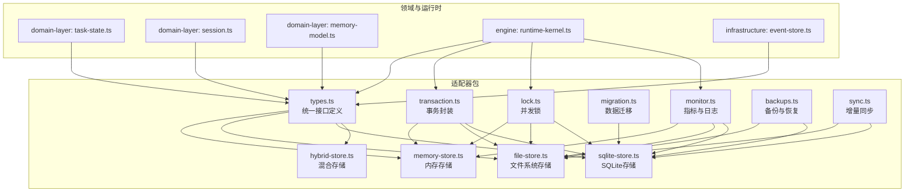
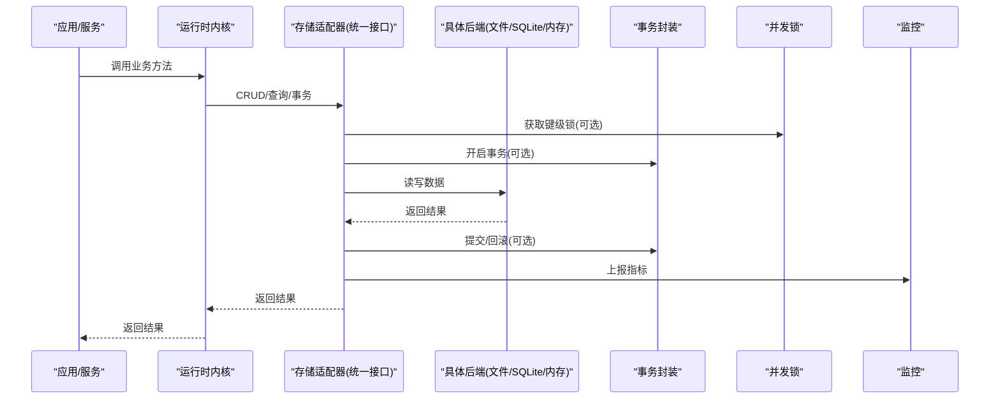
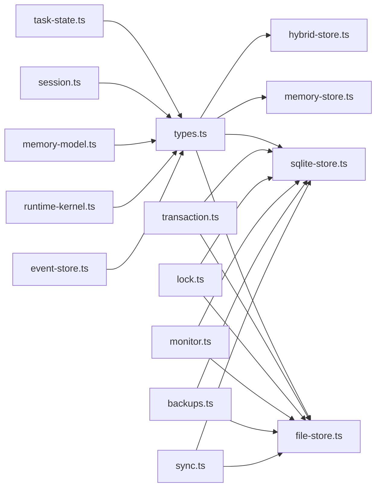

# 存储适配器

<cite>
**本文引用的文件**   
- [engine/packages/adapters/README.md](file://engine/packages/adapters/README.md)
- [engine/packages/adapters/src/index.ts](file://engine/packages/adapters/src/index.ts)
- [engine/packages/adapters/src/memory-store.ts](file://engine/packages/adapters/src/memory-store.ts)
- [engine/packages/adapters/src/file-store.ts](file://engine/packages/adapters/src/file-store.ts)
- [engine/packages/adapters/src/sqlite-store.ts](file://engine/packages/adapters/src/sqlite-store.ts)
- [engine/packages/adapters/src/hybrid-store.ts](file://engine/packages/adapters/src/hybrid-store.ts)
- [engine/packages/adapters/src/types.ts](file://engine/packages/adapters/src/types.ts)
- [engine/packages/adapters/src/migration.ts](file://engine/packages/adapters/src/migration.ts)
- [engine/packages/adapters/src/transaction.ts](file://engine/packages/adapters/src/transaction.ts)
- [engine/packages/adapters/src/lock.ts](file://engine/packages/adapters/src/lock.ts)
- [engine/packages/adapters/src/monitor.ts](file://engine/packages/adapters/src/monitor.ts)
- [engine/packages/adapters/src/backups.ts](file://engine/packages/adapters/src/backups.ts)
- [engine/packages/adapters/src/sync.ts](file://engine/packages/adapters/src/sync.ts)
- [engine/packages/domain-layer/src/task-state.ts](file://engine/packages/domain-layer/src/task-state.ts)
- [engine/packages/domain-layer/src/session.ts](file://engine/packages/domain-layer/src/session.ts)
- [engine/packages/domain-layer/src/memory-model.ts](file://engine/packages/domain-layer/src/memory-model.ts)
- [engine/packages/engine/src/runtime-kernel.ts](file://engine/packages/engine/src/runtime-kernel.ts)
- [engine/packages/infrastructure/src/event-store.ts](file://engine/packages/infrastructure/src/event-store.ts)
- [engine/tests/file-session-store.test.ts](file://engine/tests/file-session-store.test.ts)
- [engine/tests/run-state-store.test.ts](file://engine/tests/run-state-store.test.ts)
- [engine/tests/memory-store.test.ts](file://engine/tests/memory-store.test.ts)
- [engine/tests/hybrid-store.test.ts](file://engine/tests/hybrid-store.test.ts)
</cite>

## 目录
1. [简介](#简介)
2. [项目结构](#项目结构)
3. [核心组件](#核心组件)
4. [架构总览](#架构总览)
5. [详细组件分析](#详细组件分析)
6. [依赖关系分析](#依赖关系分析)
7. [性能考虑](#性能考虑)
8. [故障排查指南](#故障排查指南)
9. [结论](#结论)
10. [附录](#附录)

## 简介
本指南面向KCoder的存储适配器系统，目标是帮助开发者理解并集成统一的存储抽象层。该抽象层屏蔽底层实现差异，提供一致的CRUD、事务、查询与并发控制能力，支持内存、文件系统、SQLite等多种后端，并提供混合存储、迁移、监控、备份恢复与同步等高级特性。文档同时覆盖会话持久化、任务状态存储、记忆数据的存储策略，以及自定义后端的开发方法与调优建议。

## 项目结构
存储适配器的核心位于 engine/packages/adapters 包内，围绕统一接口定义、多后端实现、事务与锁、迁移、监控、备份与同步等模块组织。上层领域模型（任务状态、会话、记忆）通过运行时内核与基础设施事件存储进行组合使用。测试用例覆盖了关键路径与边界场景。

图表来源
- [engine/packages/adapters/src/types.ts](file://engine/packages/adapters/src/types.ts)
- [engine/packages/adapters/src/memory-store.ts](file://engine/packages/adapters/src/memory-store.ts)
- [engine/packages/adapters/src/file-store.ts](file://engine/packages/adapters/src/file-store.ts)
- [engine/packages/adapters/src/sqlite-store.ts](file://engine/packages/adapters/src/sqlite-store.ts)
- [engine/packages/adapters/src/hybrid-store.ts](file://engine/packages/adapters/src/hybrid-store.ts)
- [engine/packages/adapters/src/transaction.ts](file://engine/packages/adapters/src/transaction.ts)
- [engine/packages/adapters/src/lock.ts](file://engine/packages/adapters/src/lock.ts)
- [engine/packages/adapters/src/migration.ts](file://engine/packages/adapters/src/migration.ts)
- [engine/packages/adapters/src/monitor.ts](file://engine/packages/adapters/src/monitor.ts)
- [engine/packages/adapters/src/backups.ts](file://engine/packages/adapters/src/backups.ts)
- [engine/packages/adapters/src/sync.ts](file://engine/packages/adapters/src/sync.ts)
- [engine/packages/domain-layer/src/task-state.ts](file://engine/packages/domain-layer/src/task-state.ts)
- [engine/packages/domain-layer/src/session.ts](file://engine/packages/domain-layer/src/session.ts)
- [engine/packages/domain-layer/src/memory-model.ts](file://engine/packages/domain-layer/src/memory-model.ts)
- [engine/packages/engine/src/runtime-kernel.ts](file://engine/packages/engine/src/runtime-kernel.ts)
- [engine/packages/infrastructure/src/event-store.ts](file://engine/packages/infrastructure/src/event-store.ts)

章节来源
- [engine/packages/adapters/README.md](file://engine/packages/adapters/README.md)
- [engine/packages/adapters/src/index.ts](file://engine/packages/adapters/src/index.ts)

## 核心组件
- 统一接口定义：集中声明键值/文档型操作的契约，包括创建、读取、更新、删除、批量操作、条件查询、分页与排序、事务与锁、元数据与统计等。
- 内存存储：进程内键值映射，适合单元测试与轻量场景。
- 文件系统存储：以文件为单元持久化，具备跨进程可见性，适合中小规模数据与可移植需求。
- SQLite存储：基于嵌入式关系数据库，提供强一致性与复杂查询能力。
- 混合存储：将热点读路径路由到内存或缓存，写路径落盘或入库，兼顾性能与一致性。
- 事务封装：在单连接/单文件范围内提供原子提交与回滚语义。
- 并发锁：提供细粒度键级或范围级锁，避免竞态条件。
- 迁移：版本化Schema演进与数据升级脚本执行。
- 监控：记录延迟、吞吐、错误率与资源占用。
- 备份与恢复：快照导出与导入，支持增量与全量。
- 同步：基于变更日志或时间戳的增量同步机制。

章节来源
- [engine/packages/adapters/src/types.ts](file://engine/packages/adapters/src/types.ts)
- [engine/packages/adapters/src/memory-store.ts](file://engine/packages/adapters/src/memory-store.ts)
- [engine/packages/adapters/src/file-store.ts](file://engine/packages/adapters/src/file-store.ts)
- [engine/packages/adapters/src/sqlite-store.ts](file://engine/packages/adapters/src/sqlite-store.ts)
- [engine/packages/adapters/src/hybrid-store.ts](file://engine/packages/adapters/src/hybrid-store.ts)
- [engine/packages/adapters/src/transaction.ts](file://engine/packages/adapters/src/transaction.ts)
- [engine/packages/adapters/src/lock.ts](file://engine/packages/adapters/src/lock.ts)
- [engine/packages/adapters/src/migration.ts](file://engine/packages/adapters/src/migration.ts)
- [engine/packages/adapters/src/monitor.ts](file://engine/packages/adapters/src/monitor.ts)
- [engine/packages/adapters/src/backups.ts](file://engine/packages/adapters/src/backups.ts)
- [engine/packages/adapters/src/sync.ts](file://engine/packages/adapters/src/sync.ts)

## 架构总览
存储抽象层作为中间层，向上暴露统一API，向下对接不同后端。运行时内核与领域模型通过适配器访问数据；基础设施事件存储可将领域事件写入持久化层，用于回放与审计。

图表来源
- [engine/packages/engine/src/runtime-kernel.ts](file://engine/packages/engine/src/runtime-kernel.ts)
- [engine/packages/adapters/src/types.ts](file://engine/packages/adapters/src/types.ts)
- [engine/packages/adapters/src/transaction.ts](file://engine/packages/adapters/src/transaction.ts)
- [engine/packages/adapters/src/lock.ts](file://engine/packages/adapters/src/lock.ts)
- [engine/packages/adapters/src/monitor.ts](file://engine/packages/adapters/src/monitor.ts)
- [engine/packages/adapters/src/file-store.ts](file://engine/packages/adapters/src/file-store.ts)
- [engine/packages/adapters/src/sqlite-store.ts](file://engine/packages/adapters/src/sqlite-store.ts)
- [engine/packages/adapters/src/memory-store.ts](file://engine/packages/adapters/src/memory-store.ts)

## 详细组件分析

### 统一接口与类型契约
- 设计要点
  - 以“命名空间+键”为核心寻址方式，支持字符串键与结构化键。
  - 提供基础CRUD与批量操作，以及按前缀/条件的扫描与分页。
  - 事务接口保证同一上下文内的原子性；锁接口支持细粒度互斥。
  - 监控钩子允许记录延迟、错误与计数。
- 复杂度与约束
  - 批量操作应限制单次大小以避免内存峰值。
  - 条件查询需在后端侧做索引优化（如SQLite列索引）。
- 扩展点
  - 新增后端只需实现统一接口，并在工厂中注册。

章节来源
- [engine/packages/adapters/src/types.ts](file://engine/packages/adapters/src/types.ts)

### 内存存储
- 适用场景
  - 单元测试、原型验证、临时缓存。
- 特点
  - 零I/O，极低延迟；进程退出即丢失。
  - 无持久化与事务保障。
- 并发
  - 单线程安全；多线程环境需外部加锁。

章节来源
- [engine/packages/adapters/src/memory-store.ts](file://engine/packages/adapters/src/memory-store.ts)
- [engine/tests/memory-store.test.ts](file://engine/tests/memory-store.test.ts)

### 文件系统存储
- 适用场景
  - 单机或多进程共享磁盘，数据可移植，便于人工查看与调试。
- 特点
  - 文件原子写入与重命名保证基本一致性。
  - 支持前缀扫描与分页游标。
- 事务与锁
  - 基于文件锁或原子重命名的最小事务窗口。
- 备份与恢复
  - 目录快照复制与增量归档。

章节来源
- [engine/packages/adapters/src/file-store.ts](file://engine/packages/adapters/src/file-store.ts)
- [engine/tests/file-session-store.test.ts](file://engine/tests/file-session-store.test.ts)
- [engine/packages/adapters/src/backups.ts](file://engine/packages/adapters/src/backups.ts)

### SQLite存储
- 适用场景
  - 需要强一致、复杂查询与事务的场景。
- 特点
  - WAL模式提升并发读性能。
  - 支持索引、视图与触发器。
- 迁移
  - 版本化迁移脚本，幂等执行。
- 备份与恢复
  - 冷备与热备（WAL检查点）结合。

章节来源
- [engine/packages/adapters/src/sqlite-store.ts](file://engine/packages/adapters/src/sqlite-store.ts)
- [engine/packages/adapters/src/migration.ts](file://engine/packages/adapters/src/migration.ts)
- [engine/packages/adapters/src/backups.ts](file://engine/packages/adapters/src/backups.ts)

### 混合存储
- 设计思路
  - 读路径优先命中内存/缓存，未命中再回源至持久化层。
  - 写路径先落持久化，再异步刷新缓存。
- 一致性
  - 通过失效策略与版本号保证最终一致。
- 适用场景
  - 高读低写、热点数据明显的业务。

章节来源
- [engine/packages/adapters/src/hybrid-store.ts](file://engine/packages/adapters/src/hybrid-store.ts)
- [engine/tests/hybrid-store.test.ts](file://engine/tests/hybrid-store.test.ts)

### 事务封装
- 语义
  - 单连接/单文件范围内的原子提交与回滚。
  - 嵌套事务采用保存点模拟。
- 异常处理
  - 失败自动回滚并抛出明确错误码。

章节来源
- [engine/packages/adapters/src/transaction.ts](file://engine/packages/adapters/src/transaction.ts)

### 并发锁
- 粒度
  - 键级锁、前缀锁、全局锁。
- 超时与重试
  - 可配置等待时间与退避策略。

章节来源
- [engine/packages/adapters/src/lock.ts](file://engine/packages/adapters/src/lock.ts)

### 监控与可观测性
- 指标
  - 延迟分位、QPS、错误率、锁等待时长、事务耗时。
- 输出
  - 结构化日志与指标上报钩子。

章节来源
- [engine/packages/adapters/src/monitor.ts](file://engine/packages/adapters/src/monitor.ts)

### 备份与恢复
- 策略
  - 全量快照与增量归档；校验和校验。
- 流程
  - 冻结写路径 -> 导出 -> 解冻 -> 校验 -> 恢复。

章节来源
- [engine/packages/adapters/src/backups.ts](file://engine/packages/adapters/src/backups.ts)

### 数据同步
- 方案
  - 基于变更日志或时间戳的增量同步。
  - 冲突解决策略：最后写入获胜或合并策略。
- 适用
  - 多副本、边缘节点与主库同步。

章节来源
- [engine/packages/adapters/src/sync.ts](file://engine/packages/adapters/src/sync.ts)

### 领域数据与存储策略
- 任务状态
  - 使用适配器的事务与锁确保状态机推进的原子性。
- 会话持久化
  - 会话片段按时间线追加写入，支持回溯与压缩。
- 记忆数据
  - 向量/文本摘要与检索索引分离，读路径走缓存。

章节来源
- [engine/packages/domain-layer/src/task-state.ts](file://engine/packages/domain-layer/src/task-state.ts)
- [engine/packages/domain-layer/src/session.ts](file://engine/packages/domain-layer/src/session.ts)
- [engine/packages/domain-layer/src/memory-model.ts](file://engine/packages/domain-layer/src/memory-model.ts)
- [engine/tests/run-state-store.test.ts](file://engine/tests/run-state-store.test.ts)
- [engine/tests/file-session-store.test.ts](file://engine/tests/file-session-store.test.ts)

### 运行时与事件存储集成
- 运行时内核
  - 通过适配器发起读写与事务，结合监控上报。
- 事件存储
  - 将领域事件追加到持久化层，供回放与审计。

章节来源
- [engine/packages/engine/src/runtime-kernel.ts](file://engine/packages/engine/src/runtime-kernel.ts)
- [engine/packages/infrastructure/src/event-store.ts](file://engine/packages/infrastructure/src/event-store.ts)

## 依赖关系分析
- 耦合与内聚
  - 适配器包内部高内聚，对外仅暴露统一接口；各后端实现彼此独立。
- 外部依赖
  - 文件系统I/O、SQLite驱动、可选缓存与消息队列（用于同步/备份）。
- 循环依赖
  - 通过接口解耦，避免直接循环引用。

图表来源
- [engine/packages/adapters/src/types.ts](file://engine/packages/adapters/src/types.ts)
- [engine/packages/adapters/src/memory-store.ts](file://engine/packages/adapters/src/memory-store.ts)
- [engine/packages/adapters/src/file-store.ts](file://engine/packages/adapters/src/file-store.ts)
- [engine/packages/adapters/src/sqlite-store.ts](file://engine/packages/adapters/src/sqlite-store.ts)
- [engine/packages/adapters/src/hybrid-store.ts](file://engine/packages/adapters/src/hybrid-store.ts)
- [engine/packages/adapters/src/transaction.ts](file://engine/packages/adapters/src/transaction.ts)
- [engine/packages/adapters/src/lock.ts](file://engine/packages/adapters/src/lock.ts)
- [engine/packages/adapters/src/monitor.ts](file://engine/packages/adapters/src/monitor.ts)
- [engine/packages/adapters/src/backups.ts](file://engine/packages/adapters/src/backups.ts)
- [engine/packages/adapters/src/sync.ts](file://engine/packages/adapters/src/sync.ts)
- [engine/packages/domain-layer/src/task-state.ts](file://engine/packages/domain-layer/src/task-state.ts)
- [engine/packages/domain-layer/src/session.ts](file://engine/packages/domain-layer/src/session.ts)
- [engine/packages/domain-layer/src/memory-model.ts](file://engine/packages/domain-layer/src/memory-model.ts)
- [engine/packages/engine/src/runtime-kernel.ts](file://engine/packages/engine/src/runtime-kernel.ts)
- [engine/packages/infrastructure/src/event-store.ts](file://engine/packages/infrastructure/src/event-store.ts)

## 性能考虑
- 读路径优化
  - 使用混合存储与缓存预热；对热点键设置短TTL。
  - 合理分页与游标，避免一次性加载大集合。
- 写路径优化
  - 批量写入与合并小写；SQLite启用WAL与合适PRAGMA。
  - 文件存储使用原子写入与顺序追加。
- 事务与锁
  - 缩小事务窗口；锁粒度尽量细化，避免长持有。
- 监控与定位
  - 关注P99延迟、锁等待、慢查询与错误率；结合采样日志定位瓶颈。

[本节为通用指导，不直接分析具体文件]

## 故障排查指南
- 常见问题
  - 死锁与锁竞争：检查锁粒度与持有时间，增加超时与重试。
  - 数据不一致：确认事务边界与提交顺序，核对备份恢复流程。
  - 性能退化：观察监控指标，定位热点键与慢查询。
- 诊断步骤
  - 开启详细监控与采样日志。
  - 复现最小用例，隔离后端差异。
  - 对比不同后端行为，定位实现问题。

章节来源
- [engine/packages/adapters/src/monitor.ts](file://engine/packages/adapters/src/monitor.ts)
- [engine/packages/adapters/src/lock.ts](file://engine/packages/adapters/src/lock.ts)
- [engine/packages/adapters/src/transaction.ts](file://engine/packages/adapters/src/transaction.ts)

## 结论
KCoder的存储适配器通过统一接口屏蔽了多后端差异，提供了事务、锁、迁移、监控、备份与同步等工程化能力。结合领域模型的存储策略与运行时集成，可在不同规模与一致性要求下灵活选择后端，并通过监控与调优获得稳定高性能表现。

## 附录

### 自定义存储后端开发指南
- 实现步骤
  - 实现统一接口中的全部方法，遵循类型契约与错误约定。
  - 在工厂或注册表中注册新后端。
  - 补充必要的迁移脚本与监控上报。
- 数据迁移
  - 编写幂等迁移脚本，支持向前与向后兼容。
- 并发与一致性
  - 实现键级锁与事务语义，确保原子性与隔离级别满足需求。
- 性能优化
  - 针对读多写少场景引入缓存；针对写多场景优化批处理与索引。
- 测试建议
  - 覆盖CRUD、事务、锁、迁移、备份恢复与并发场景。

章节来源
- [engine/packages/adapters/src/types.ts](file://engine/packages/adapters/src/types.ts)
- [engine/packages/adapters/src/migration.ts](file://engine/packages/adapters/src/migration.ts)
- [engine/packages/adapters/src/transaction.ts](file://engine/packages/adapters/src/transaction.ts)
- [engine/packages/adapters/src/lock.ts](file://engine/packages/adapters/src/lock.ts)
- [engine/packages/adapters/src/monitor.ts](file://engine/packages/adapters/src/monitor.ts)