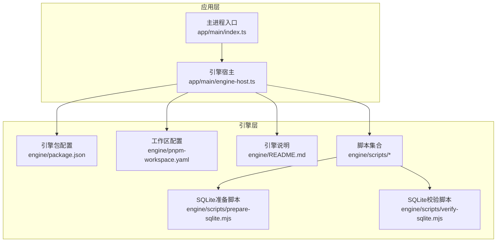
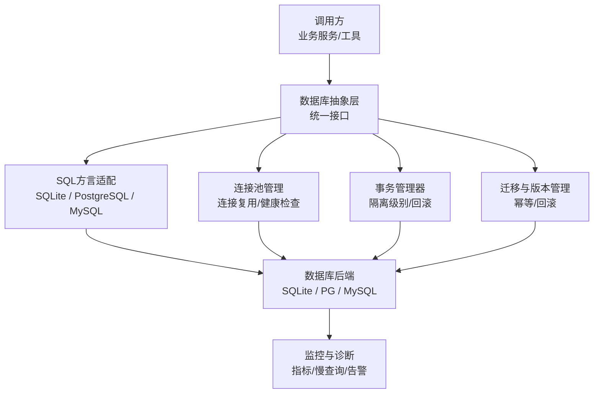
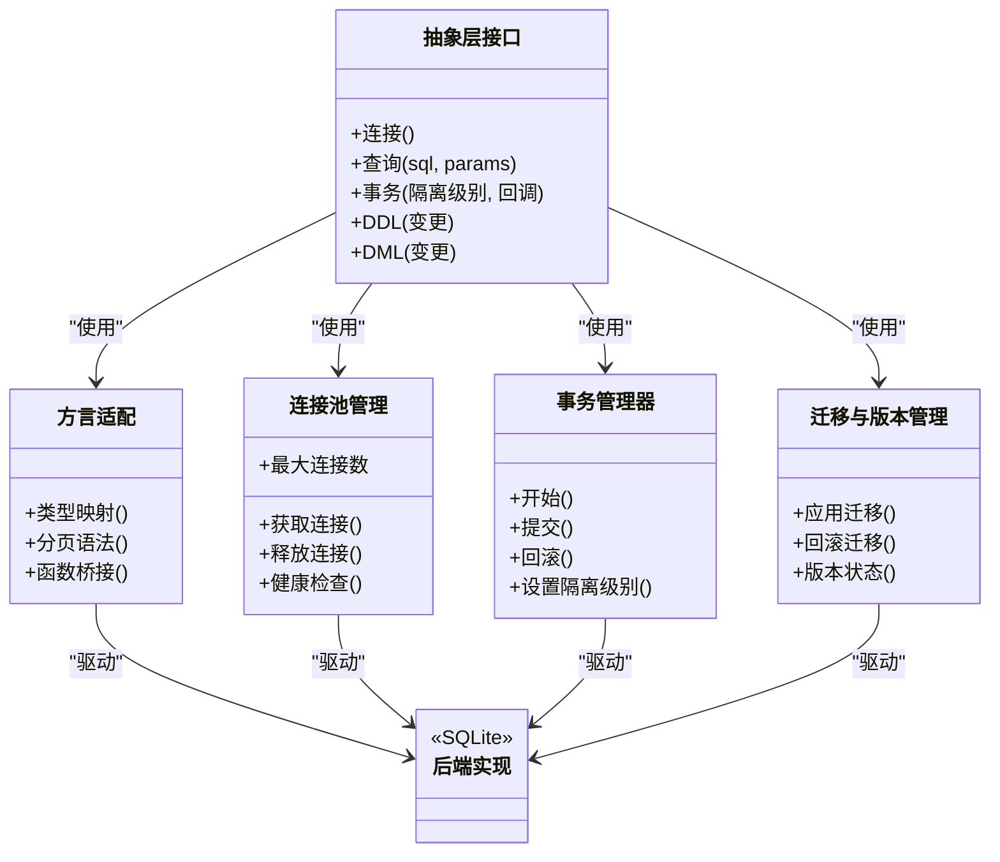
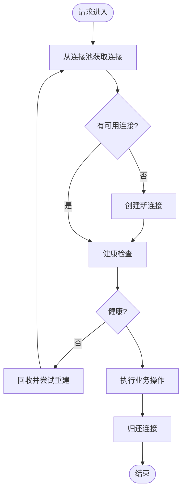
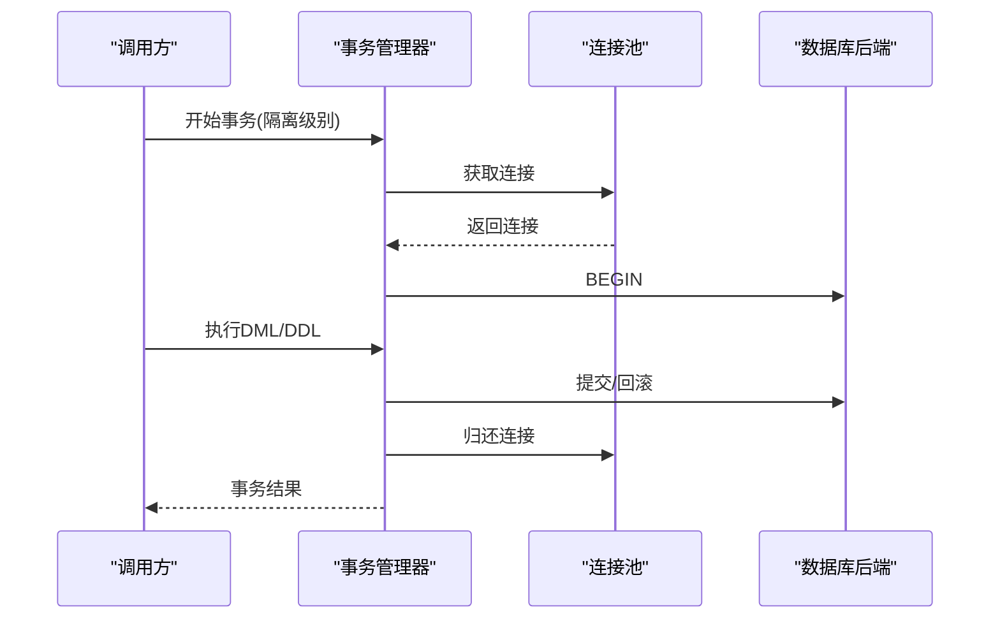
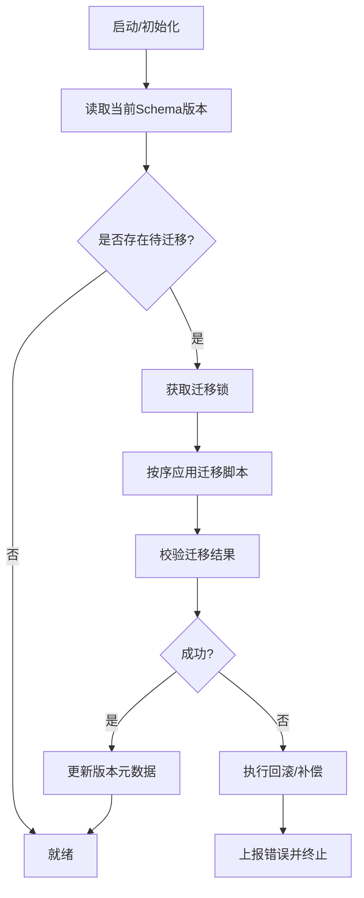
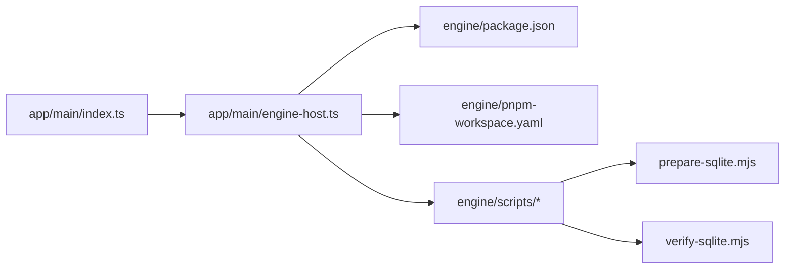

# 数据库存储适配器

<cite>
**本文引用的文件**   
- [engine/README.md](file://engine/README.md)
- [engine/package.json](file://engine/package.json)
- [engine/pnpm-workspace.yaml](file://engine/pnpm-workspace.yaml)
- [engine/scripts/prepare-sqlite.mjs](file://engine/scripts/prepare-sqlite.mjs)
- [engine/scripts/verify-sqlite.mjs](file://engine/scripts/verify-sqlite.mjs)
- [app/main/index.ts](file://app/main/index.ts)
- [app/main/engine-host.ts](file://app/main/engine-host.ts)
</cite>

## 目录
1. [简介](#简介)
2. [项目结构](#项目结构)
3. [核心组件](#核心组件)
4. [架构总览](#架构总览)
5. [详细组件分析](#详细组件分析)
6. [依赖关系分析](#依赖关系分析)
7. [性能考虑](#性能考虑)
8. [故障排查指南](#故障排查指南)
9. [结论](#结论)
10. [附录](#附录)

## 简介
本技术文档聚焦于KCoder的“数据库存储适配器”能力，围绕数据库抽象层设计、SQL方言适配、连接池管理、事务处理、多后端实现差异（SQLite、PostgreSQL、MySQL）、迁移与Schema版本管理、数据一致性保证、查询优化与索引设计、连接复用、备份恢复、主从复制与高可用、监控与慢查询分析、故障诊断等主题展开。由于当前仓库未包含具体的数据库适配实现源码，本文在保持严谨的前提下，基于工程结构与脚本线索进行系统化分析与建议，并提供可落地的架构图与流程说明。

## 项目结构
KCoder采用Electron + Node.js的工程组织方式：
- app：桌面端应用（渲染进程与主进程）
- engine：引擎与服务端逻辑（含packages、scripts、tests等）
- scripts：构建与验证脚本，其中包含SQLite相关准备与校验脚本

图表来源
- [app/main/index.ts](file://app/main/index.ts)
- [app/main/engine-host.ts](file://app/main/engine-host.ts)
- [engine/package.json](file://engine/package.json)
- [engine/pnpm-workspace.yaml](file://engine/pnpm-workspace.yaml)
- [engine/README.md](file://engine/README.md)
- [engine/scripts/prepare-sqlite.mjs](file://engine/scripts/prepare-sqlite.mjs)
- [engine/scripts/verify-sqlite.mjs](file://engine/scripts/verify-sqlite.mjs)

章节来源
- [engine/README.md](file://engine/README.md)
- [engine/package.json](file://engine/package.json)
- [engine/pnpm-workspace.yaml](file://engine/pnpm-workspace.yaml)
- [app/main/index.ts](file://app/main/index.ts)
- [app/main/engine-host.ts](file://app/main/engine-host.ts)

## 核心组件
- 数据库抽象层接口
  - 定义统一的连接、查询、事务、DDL/DML操作契约，屏蔽底层方言差异。
- SQL方言适配
  - 针对SQLite、PostgreSQL、MySQL提供方言实现，包括类型映射、分页语法、序列/自增、JSON函数、时间函数等差异点。
- 连接池管理
  - 统一封装连接生命周期、最大连接数、空闲回收、超时重试、健康检查。
- 事务处理
  - 提供显式事务API与自动提交策略，支持隔离级别选择与失败回滚。
- 迁移与Schema版本管理
  - 版本化迁移脚本、幂等执行、回滚策略、并发安全。
- 数据一致性保障
  - ACID语义、写前日志（WAL）、唯一约束、外键约束、触发器校验。
- 查询优化与索引设计
  - 覆盖索引、复合索引、统计信息收集、EXPLAIN分析、热点路径优化。
- 连接复用与批处理
  - 连接复用、批量写入、预编译语句、参数化查询防注入。
- 备份恢复与高可用
  - 冷备/热备、增量备份、主从复制、读写分离、故障切换。
- 监控与诊断
  - 指标采集、慢查询日志、错误追踪、告警与可视化。

章节来源
- [engine/scripts/prepare-sqlite.mjs](file://engine/scripts/prepare-sqlite.mjs)
- [engine/scripts/verify-sqlite.mjs](file://engine/scripts/verify-sqlite.mjs)

## 架构总览
下图展示数据库抽象层与多后端适配的整体架构思路。上层通过统一接口访问不同数据库后端，中间由方言适配与连接池管理屏蔽差异，迁移与监控贯穿全链路。

图表来源
- [engine/scripts/prepare-sqlite.mjs](file://engine/scripts/prepare-sqlite.mjs)
- [engine/scripts/verify-sqlite.mjs](file://engine/scripts/verify-sqlite.mjs)

## 详细组件分析

### 抽象层与方言适配
- 抽象层职责
  - 定义连接、查询、事务、DDL/DML的统一接口；负责参数绑定、结果集映射、错误归一化。
- 方言适配要点
  - SQLite：无原生序列，使用自增或触发器模拟；JSON函数有限；WAL模式提升并发读。
  - PostgreSQL：强大的JSONB、窗口函数、CTE、扩展生态；需关注锁粒度与死锁检测。
  - MySQL：InnoDB默认事务与行级锁；注意字符集与排序规则；分区表与全文索引特性。
- 类型映射与函数桥接
  - 将通用类型映射到各后端类型；对差异函数提供方言实现或兼容层。

图表来源
- [engine/scripts/prepare-sqlite.mjs](file://engine/scripts/prepare-sqlite.mjs)
- [engine/scripts/verify-sqlite.mjs](file://engine/scripts/verify-sqlite.mjs)

章节来源
- [engine/scripts/prepare-sqlite.mjs](file://engine/scripts/prepare-sqlite.mjs)
- [engine/scripts/verify-sqlite.mjs](file://engine/scripts/verify-sqlite.mjs)

### 连接池管理
- 关键目标
  - 控制并发、避免资源泄漏、快速失败与重试、健康探测。
- 设计要点
  - 最大连接数、最小空闲连接、连接超时、空闲回收周期、心跳检测。
  - 错误分类与退避重试（网络抖动、瞬时不可用）。
  - 连接借用与归还的生命周期管理，确保异常路径也能归还。
- 与方言/后端的耦合
  - 通过驱动提供的连接对象进行复用；对不同驱动的初始化参数做方言适配。

图表来源
- [engine/scripts/prepare-sqlite.mjs](file://engine/scripts/prepare-sqlite.mjs)
- [engine/scripts/verify-sqlite.mjs](file://engine/scripts/verify-sqlite.mjs)

章节来源
- [engine/scripts/prepare-sqlite.mjs](file://engine/scripts/prepare-sqlite.mjs)
- [engine/scripts/verify-sqlite.mjs](file://engine/scripts/verify-sqlite.mjs)

### 事务处理
- 设计原则
  - 明确事务边界、统一隔离级别、失败自动回滚、嵌套事务委托给外层。
- 关键点
  - 长事务风险、锁竞争与死锁规避、批量操作的原子性。
  - 跨方言的事务语义差异（如MySQL与PG的锁行为）。
- 最佳实践
  - 短事务优先、按顺序访问共享资源、避免在事务中执行外部I/O。

图表来源
- [engine/scripts/prepare-sqlite.mjs](file://engine/scripts/prepare-sqlite.mjs)
- [engine/scripts/verify-sqlite.mjs](file://engine/scripts/verify-sqlite.mjs)

章节来源
- [engine/scripts/prepare-sqlite.mjs](file://engine/scripts/prepare-sqlite.mjs)
- [engine/scripts/verify-sqlite.mjs](file://engine/scripts/verify-sqlite.mjs)

### 迁移与Schema版本管理
- 版本化迁移
  - 每个迁移脚本带版本号，按序执行；幂等设计，重复执行不破坏状态。
- 回滚策略
  - 提供反向迁移或补偿逻辑；失败时快速回滚至上一稳定版本。
- 并发与一致性
  - 迁移执行加分布式锁或单实例串行化；记录迁移元数据表。
- 与方言适配
  - 针对不同后端提供差异化DDL；对不支持的特性提供替代方案。

图表来源
- [engine/scripts/prepare-sqlite.mjs](file://engine/scripts/prepare-sqlite.mjs)
- [engine/scripts/verify-sqlite.mjs](file://engine/scripts/verify-sqlite.mjs)

章节来源
- [engine/scripts/prepare-sqlite.mjs](file://engine/scripts/prepare-sqlite.mjs)
- [engine/scripts/verify-sqlite.mjs](file://engine/scripts/verify-sqlite.mjs)

### 数据一致性保证
- 约束与校验
  - 使用唯一约束、外键约束、检查约束保证完整性。
- WAL与持久化
  - SQLite启用WAL提升并发读；PG/MySQL开启同步刷盘策略。
- 幂等与去重
  - 写入侧引入幂等键；冲突时UPSERT策略。
- 审计与快照
  - 关键变更保留审计日志；定期快照用于快速恢复。

章节来源
- [engine/scripts/prepare-sqlite.mjs](file://engine/scripts/prepare-sqlite.mjs)
- [engine/scripts/verify-sqlite.mjs](file://engine/scripts/verify-sqlite.mjs)

### 查询优化与索引设计
- 索引策略
  - 高频过滤列建单列索引；组合查询建复合索引；覆盖索引减少回表。
- 执行计划分析
  - 使用EXPLAIN/ANALYZE定位瓶颈；避免全表扫描与隐式类型转换。
- 批处理与预编译
  - 批量插入/更新；预编译语句复用；参数化查询防注入。
- 缓存与物化视图
  - 热点数据缓存；复杂聚合使用物化视图或定时刷新。

章节来源
- [engine/scripts/prepare-sqlite.mjs](file://engine/scripts/prepare-sqlite.mjs)
- [engine/scripts/verify-sqlite.mjs](file://engine/scripts/verify-sqlite.mjs)

### 连接复用与批处理
- 连接复用
  - 短连接场景下复用连接降低握手开销；长连接需定期健康检查。
- 批处理
  - 合并小事务为批量操作；分片写入避免大事务锁竞争。
- 背压与限流
  - 根据后端负载动态调整并发度；队列缓冲削峰填谷。

章节来源
- [engine/scripts/prepare-sqlite.mjs](file://engine/scripts/prepare-sqlite.mjs)
- [engine/scripts/verify-sqlite.mjs](file://engine/scripts/verify-sqlite.mjs)

### 备份恢复与高可用
- 备份策略
  - 冷备：停机快照；热备：在线导出/物理备份；增量：基于WAL或binlog。
- 恢复演练
  - 定期演练恢复流程；RTO/RPO目标明确。
- 主从复制与读写分离
  - 主库写、从库读；延迟监控与故障切换。
- 高可用架构
  - 多副本、自动故障转移、脑裂防护、一致性协议选择。

章节来源
- [engine/scripts/prepare-sqlite.mjs](file://engine/scripts/prepare-sqlite.mjs)
- [engine/scripts/verify-sqlite.mjs](file://engine/scripts/verify-sqlite.mjs)

### 监控、慢查询与故障诊断
- 指标采集
  - 连接池指标、QPS/RT、错误率、锁等待、慢查询计数。
- 慢查询分析
  - 阈值配置、采样策略、执行计划归档、趋势分析。
- 故障诊断
  - 错误码分类、堆栈追踪、上下文日志、分布式追踪。
- 告警与可视化
  - 阈值告警、仪表盘、SLO达成情况。

章节来源
- [engine/scripts/prepare-sqlite.mjs](file://engine/scripts/prepare-sqlite.mjs)
- [engine/scripts/verify-sqlite.mjs](file://engine/scripts/verify-sqlite.mjs)

## 依赖关系分析
- 应用与引擎
  - 主进程通过引擎宿主加载引擎模块，引擎通过工作区与脚本完成初始化与验证。
- 脚本与数据库
  - prepare-sqlite与verify-sqlite脚本体现SQLite相关的准备与校验流程，可作为数据库适配层的参考实现位置。

图表来源
- [app/main/index.ts](file://app/main/index.ts)
- [app/main/engine-host.ts](file://app/main/engine-host.ts)
- [engine/package.json](file://engine/package.json)
- [engine/pnpm-workspace.yaml](file://engine/pnpm-workspace.yaml)
- [engine/scripts/prepare-sqlite.mjs](file://engine/scripts/prepare-sqlite.mjs)
- [engine/scripts/verify-sqlite.mjs](file://engine/scripts/verify-sqlite.mjs)

章节来源
- [app/main/index.ts](file://app/main/index.ts)
- [app/main/engine-host.ts](file://app/main/engine-host.ts)
- [engine/package.json](file://engine/package.json)
- [engine/pnpm-workspace.yaml](file://engine/pnpm-workspace.yaml)
- [engine/scripts/prepare-sqlite.mjs](file://engine/scripts/prepare-sqlite.mjs)
- [engine/scripts/verify-sqlite.mjs](file://engine/scripts/verify-sqlite.mjs)

## 性能考虑
- 连接池调优
  - 根据CPU核数与IO特性设置最大连接数；合理空闲回收周期；避免连接风暴。
- 事务与锁
  - 缩短事务时长；避免跨表大范围更新；必要时拆分批次。
- 索引与查询
  - 基于实际查询模式设计索引；定期收集统计信息；避免过度索引影响写入。
- 批处理与异步
  - 批量写入、异步非阻塞I/O；背压控制防止雪崩。
- 缓存与分层
  - 多级缓存（内存/本地/远端）；冷热数据分离。

[本节为通用指导，无需特定文件引用]

## 故障排查指南
- 常见问题定位
  - 连接池耗尽：检查连接泄漏、事务未关闭、并发过高。
  - 慢查询：查看执行计划、缺失索引、隐式类型转换。
  - 死锁：分析锁等待链、调整访问顺序、缩小事务范围。
  - 迁移失败：核对幂等性、回滚脚本、版本元数据一致性。
- 诊断手段
  - 启用慢查询日志、错误码分类、结构化日志、分布式追踪。
  - 使用健康检查与探针，结合告警快速发现异常。
- 恢复策略
  - 回滚迁移、恢复备份、重启服务、降级只读。

章节来源
- [engine/scripts/prepare-sqlite.mjs](file://engine/scripts/prepare-sqlite.mjs)
- [engine/scripts/verify-sqlite.mjs](file://engine/scripts/verify-sqlite.mjs)

## 结论
KCoder的数据库存储适配器以抽象层为核心，通过方言适配、连接池与事务管理屏蔽后端差异，配合迁移与监控体系形成完整的数据持久化解决方案。尽管当前仓库未包含具体适配实现源码，但通过脚本与工作区结构可以清晰定位实现位置与演进方向。建议在engine/packages/infrastructure或adapters目录下逐步落地统一接口与多后端实现，并以SQLite作为默认轻量后端，逐步扩展到PostgreSQL与MySQL。

[本节为总结性内容，无需特定文件引用]

## 附录
- 术语
  - 方言：不同数据库在SQL语法与特性上的差异实现。
  - 幂等：多次执行产生相同结果的操作。
  - WAL：Write-Ahead Logging，写前日志，提升并发读与崩溃恢复。
- 参考脚本
  - SQLite准备与校验脚本可作为数据库适配层的最小可行示例与测试基线。

章节来源
- [engine/scripts/prepare-sqlite.mjs](file://engine/scripts/prepare-sqlite.mjs)
- [engine/scripts/verify-sqlite.mjs](file://engine/scripts/verify-sqlite.mjs)