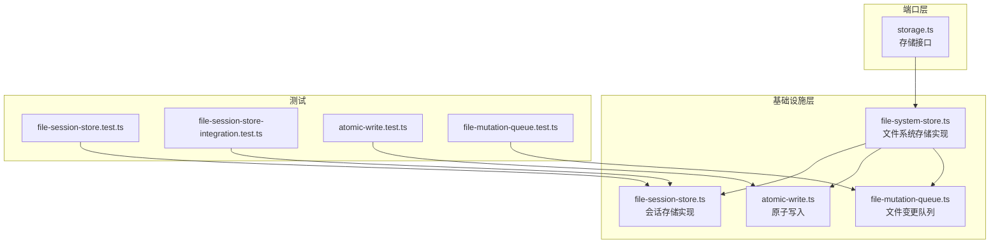
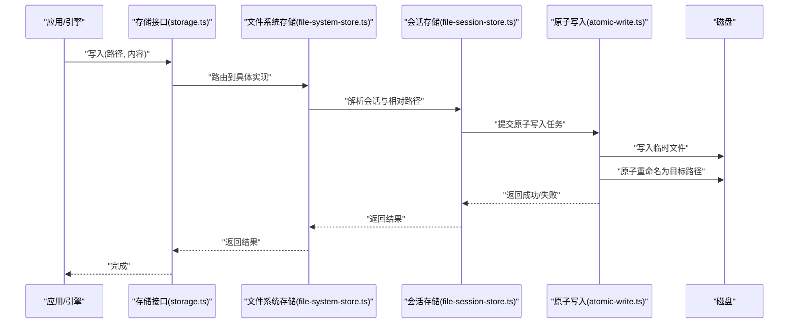
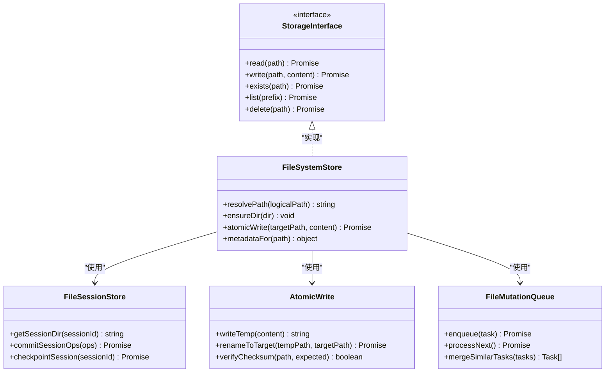
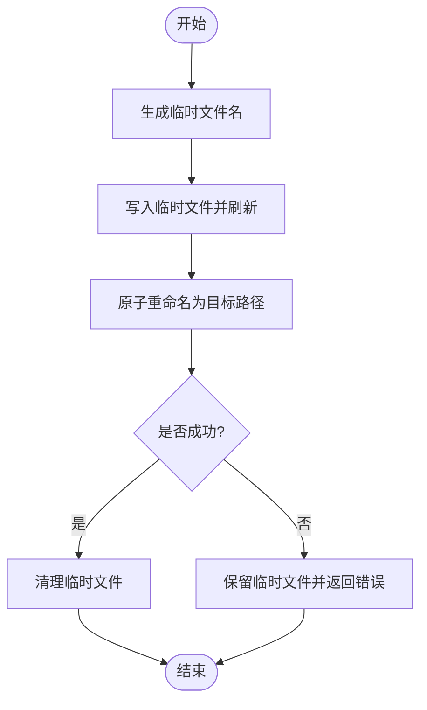
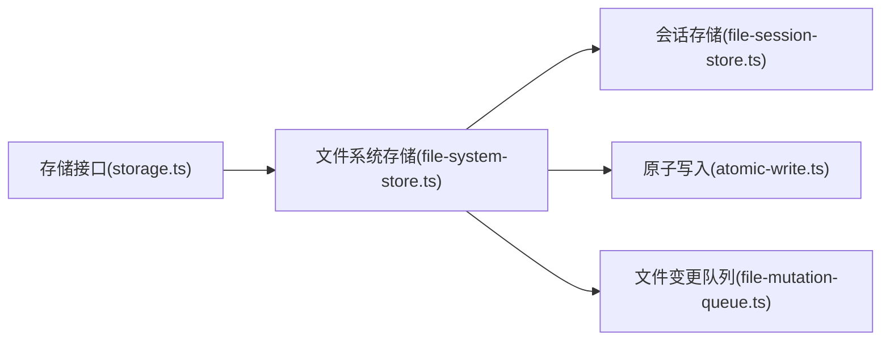

# 文件系统存储适配器

<cite>
**本文引用的文件**   
- [engine/packages/infrastructure/src/file-system-store.ts](file://engine/packages/infrastructure/src/file-system-store.ts)
- [engine/packages/infrastructure/src/file-session-store.ts](file://engine/packages/infrastructure/src/file-session-store.ts)
- [engine/packages/infrastructure/src/atomic-write.ts](file://engine/packages/infrastructure/src/atomic-write.ts)
- [engine/packages/infrastructure/src/file-mutation-queue.ts](file://engine/packages/infrastructure/src/file-mutation-queue.ts)
- [engine/packages/ports-layer/src/storage.ts](file://engine/packages/ports-layer/src/storage.ts)
- [engine/tests/file-session-store.test.ts](file://engine/tests/file-session-store.test.ts)
- [engine/tests/file-session-store-integration.test.ts](file://engine/tests/file-session-store-integration.test.ts)
- [engine/tests/atomic-write.test.ts](file://engine/tests/atomic-write.test.ts)
- [engine/tests/file-mutation-queue.test.ts](file://engine/tests/file-mutation-queue.test.ts)
</cite>

## 目录
1. [简介](#简介)
2. [项目结构](#项目结构)
3. [核心组件](#核心组件)
4. [架构总览](#架构总览)
5. [详细组件分析](#详细组件分析)
6. [依赖关系分析](#依赖关系分析)
7. [性能考量](#性能考量)
8. [故障排查指南](#故障排查指南)
9. [结论](#结论)
10. [附录](#附录)

## 简介
本技术指南聚焦于KCoder基于文件系统的存储适配器，围绕以下目标展开：
- 文件结构设计、目录组织与命名规范
- 原子写入、锁机制与并发控制
- 备份恢复、增量同步与版本管理方案
- 大文件处理、流式读写与压缩存储
- 权限控制、安全考虑与跨平台兼容性
- 文件系统监控、错误恢复与性能调优最佳实践

该指南面向开发者与运维人员，既提供高层设计说明，也给出代码级实现要点与图示。

## 项目结构
与文件系统存储相关的关键位置如下：
- 基础设施层（实现）：
  - 通用文件系统存储抽象与基础能力
  - 会话级文件存储实现
  - 原子写入工具
  - 文件变更队列（用于批处理与顺序化）
- 端口层（接口契约）：
  - 存储接口定义，约束上层对存储的调用方式
- 测试：
  - 针对会话存储、原子写入、变更队列的单元测试与集成测试

图表来源
- [engine/packages/ports-layer/src/storage.ts](file://engine/packages/ports-layer/src/storage.ts)
- [engine/packages/infrastructure/src/file-system-store.ts](file://engine/packages/infrastructure/src/file-system-store.ts)
- [engine/packages/infrastructure/src/file-session-store.ts](file://engine/packages/infrastructure/src/file-session-store.ts)
- [engine/packages/infrastructure/src/atomic-write.ts](file://engine/packages/infrastructure/src/atomic-write.ts)
- [engine/packages/infrastructure/src/file-mutation-queue.ts](file://engine/packages/infrastructure/src/file-mutation-queue.ts)
- [engine/tests/file-session-store.test.ts](file://engine/tests/file-session-store.test.ts)
- [engine/tests/file-session-store-integration.test.ts](file://engine/tests/file-session-store-integration.test.ts)
- [engine/tests/atomic-write.test.ts](file://engine/tests/atomic-write.test.ts)
- [engine/tests/file-mutation-queue.test.ts](file://engine/tests/file-mutation-queue.test.ts)

章节来源
- [engine/packages/ports-layer/src/storage.ts](file://engine/packages/ports-layer/src/storage.ts)
- [engine/packages/infrastructure/src/file-system-store.ts](file://engine/packages/infrastructure/src/file-system-store.ts)
- [engine/packages/infrastructure/src/file-session-store.ts](file://engine/packages/infrastructure/src/file-session-store.ts)
- [engine/packages/infrastructure/src/atomic-write.ts](file://engine/packages/infrastructure/src/atomic-write.ts)
- [engine/packages/infrastructure/src/file-mutation-queue.ts](file://engine/packages/infrastructure/src/file-mutation-queue.ts)
- [engine/tests/file-session-store.test.ts](file://engine/tests/file-session-store.test.ts)
- [engine/tests/file-session-store-integration.test.ts](file://engine/tests/file-session-store-integration.test.ts)
- [engine/tests/atomic-write.test.ts](file://engine/tests/atomic-write.test.ts)
- [engine/tests/file-mutation-queue.test.ts](file://engine/tests/file-mutation-queue.test.ts)

## 核心组件
- 存储接口（端口层）
  - 定义统一的读取、写入、列举、删除等能力，屏蔽底层差异
  - 为上层业务提供稳定的契约，便于替换或扩展存储后端
- 文件系统存储实现（基础设施层）
  - 将存储接口映射到本地文件系统操作
  - 负责路径解析、元数据管理、并发控制与原子性保证
- 会话存储实现（基础设施层）
  - 在文件系统之上封装“会话”概念，按会话隔离数据
  - 提供会话生命周期管理与一致性保障
- 原子写入（基础设施层）
  - 通过临时文件+重命名的策略实现原子更新
  - 确保崩溃或中断不会导致半写状态
- 文件变更队列（基础设施层）
  - 将并发写入请求序列化为有序执行
  - 支持批量合并、去重与重试，提升吞吐与稳定性

章节来源
- [engine/packages/ports-layer/src/storage.ts](file://engine/packages/ports-layer/src/storage.ts)
- [engine/packages/infrastructure/src/file-system-store.ts](file://engine/packages/infrastructure/src/file-system-store.ts)
- [engine/packages/infrastructure/src/file-session-store.ts](file://engine/packages/infrastructure/src/file-session-store.ts)
- [engine/packages/infrastructure/src/atomic-write.ts](file://engine/packages/infrastructure/src/atomic-write.ts)
- [engine/packages/infrastructure/src/file-mutation-queue.ts](file://engine/packages/infrastructure/src/file-mutation-queue.ts)

## 架构总览
下图展示了从上层调用到文件系统落盘的完整链路，包括原子写入与会话隔离。

图表来源
- [engine/packages/ports-layer/src/storage.ts](file://engine/packages/ports-layer/src/storage.ts)
- [engine/packages/infrastructure/src/file-system-store.ts](file://engine/packages/infrastructure/src/file-system-store.ts)
- [engine/packages/infrastructure/src/file-session-store.ts](file://engine/packages/infrastructure/src/file-session-store.ts)
- [engine/packages/infrastructure/src/atomic-write.ts](file://engine/packages/infrastructure/src/atomic-write.ts)

## 详细组件分析

### 存储接口（端口层）
- 职责
  - 定义统一的数据存取契约，包括读、写、列举、删除、是否存在判断等
  - 明确输入输出类型与错误语义，便于测试与替换实现
- 关键设计点
  - 路径抽象：以逻辑路径为主，由实现层转换为物理路径
  - 错误模型：区分不存在、权限不足、系统错误等
  - 可扩展性：预留元数据、版本、快照等扩展点

章节来源
- [engine/packages/ports-layer/src/storage.ts](file://engine/packages/ports-layer/src/storage.ts)

### 文件系统存储实现（基础设施层）
- 职责
  - 将逻辑路径映射到磁盘目录
  - 提供并发控制、原子写入、元数据管理等能力
- 文件结构与目录组织
  - 根目录：存储根
  - 会话子目录：按会话ID隔离
  - 资源子目录：按功能域划分（如配置、缓存、日志等）
  - 元数据文件：记录版本、时间戳、校验和等
- 命名规范
  - 会话ID采用稳定可排序格式
  - 文件名避免特殊字符，必要时进行规范化转义
  - 元数据文件使用固定前缀或后缀，便于扫描与清理
- 并发与锁
  - 基于文件变更队列串行化同一文件的写入
  - 可选使用文件锁或进程内互斥，防止竞态条件
- 原子性保证
  - 先写临时文件，再原子重命名到目标路径
  - 失败回滚：删除临时文件并返回错误
- 错误处理
  - 捕获I/O异常，分类上报
  - 幂等写入：重复写入不产生副作用

章节来源
- [engine/packages/infrastructure/src/file-system-store.ts](file://engine/packages/infrastructure/src/file-system-store.ts)

### 会话存储实现（基础设施层）
- 职责
  - 在文件系统存储之上提供“会话”语义
  - 维护会话目录结构、生命周期与一致性
- 会话隔离
  - 每个会话拥有独立目录，避免相互干扰
  - 会话间共享数据通过显式复制/链接策略
- 一致性策略
  - 会话级事务：将多个文件操作打包为一次提交
  - 检查点：定期持久化会话状态，支持快速恢复
- 与原子写入集成
  - 所有会话内写入均走原子写入流程，确保崩溃恢复后状态一致

章节来源
- [engine/packages/infrastructure/src/file-session-store.ts](file://engine/packages/infrastructure/src/file-session-store.ts)

### 原子写入（基础设施层）
- 核心流程
  - 生成唯一临时文件名（含随机后缀）
  - 写入临时文件并刷新缓冲区
  - 原子重命名为目标路径
  - 成功后清理临时文件；失败时保留临时文件以便诊断
- 并发控制
  - 结合文件变更队列，确保同一文件写入串行化
  - 可选加锁：在写入前获取独占锁，释放后解锁
- 幂等与重试
  - 支持幂等写入：相同内容与校验和视为无变更
  - 失败自动重试，带退避策略
- 校验与完整性
  - 计算内容哈希，写入元数据
  - 读取时校验哈希，不一致则触发修复或告警

章节来源
- [engine/packages/infrastructure/src/atomic-write.ts](file://engine/packages/infrastructure/src/atomic-write.ts)

### 文件变更队列（基础设施层）
- 职责
  - 将并发写入请求入队，按文件维度串行执行
  - 支持批量合并、去重与优先级调度
- 调度策略
  - FIFO优先，支持高优先级任务插队
  - 批量合并：短时间内对同一文件的多次写入合并为一次
- 可靠性
  - 任务持久化：崩溃后可恢复未完成任务
  - 超时与重试：长时间阻塞的任务可被取消并重试
- 监控与指标
  - 队列长度、平均等待时间、成功率等指标上报

章节来源
- [engine/packages/infrastructure/src/file-mutation-queue.ts](file://engine/packages/infrastructure/src/file-mutation-queue.ts)

### 类图（代码级关系）

图表来源
- [engine/packages/ports-layer/src/storage.ts](file://engine/packages/ports-layer/src/storage.ts)
- [engine/packages/infrastructure/src/file-system-store.ts](file://engine/packages/infrastructure/src/file-system-store.ts)
- [engine/packages/infrastructure/src/file-session-store.ts](file://engine/packages/infrastructure/src/file-session-store.ts)
- [engine/packages/infrastructure/src/atomic-write.ts](file://engine/packages/infrastructure/src/atomic-write.ts)
- [engine/packages/infrastructure/src/file-mutation-queue.ts](file://engine/packages/infrastructure/src/file-mutation-queue.ts)

### 原子写入流程图（算法级）

图表来源
- [engine/packages/infrastructure/src/atomic-write.ts](file://engine/packages/infrastructure/src/atomic-write.ts)

## 依赖关系分析
- 直接依赖
  - 文件系统存储实现依赖原子写入与会话存储
  - 会话存储依赖文件系统存储与会话元数据管理
  - 原子写入依赖文件系统I/O与校验工具
  - 变更队列依赖任务调度与持久化
- 间接依赖
  - 上层仅依赖存储接口，屏蔽底层实现细节
- 潜在循环依赖
  - 通过接口解耦避免循环依赖
  - 若需扩展，建议新增适配器而非修改现有实现

图表来源
- [engine/packages/ports-layer/src/storage.ts](file://engine/packages/ports-layer/src/storage.ts)
- [engine/packages/infrastructure/src/file-system-store.ts](file://engine/packages/infrastructure/src/file-system-store.ts)
- [engine/packages/infrastructure/src/file-session-store.ts](file://engine/packages/infrastructure/src/file-session-store.ts)
- [engine/packages/infrastructure/src/atomic-write.ts](file://engine/packages/infrastructure/src/atomic-write.ts)
- [engine/packages/infrastructure/src/file-mutation-queue.ts](file://engine/packages/infrastructure/src/file-mutation-queue.ts)

章节来源
- [engine/packages/ports-layer/src/storage.ts](file://engine/packages/ports-layer/src/storage.ts)
- [engine/packages/infrastructure/src/file-system-store.ts](file://engine/packages/infrastructure/src/file-system-store.ts)
- [engine/packages/infrastructure/src/file-session-store.ts](file://engine/packages/infrastructure/src/file-session-store.ts)
- [engine/packages/infrastructure/src/atomic-write.ts](file://engine/packages/infrastructure/src/atomic-write.ts)
- [engine/packages/infrastructure/src/file-mutation-queue.ts](file://engine/packages/infrastructure/src/file-mutation-queue.ts)

## 性能考量
- I/O优化
  - 批量写入：合并小文件写入，减少系统调用次数
  - 预分配与顺序写：降低碎片，提高吞吐
  - 异步与缓冲：合理设置缓冲区大小，避免频繁刷盘
- 并发控制
  - 文件级锁：避免热点文件成为瓶颈
  - 队列限流：限制并发度，保护磁盘与CPU
- 缓存策略
  - 热点元数据内存缓存，带失效与一致性校验
  - 读取路径短链化，减少层级遍历
- 压缩与分片
  - 大对象压缩存储，权衡CPU与空间
  - 超大文件分片存储，支持断点续传与并行下载
- 监控与观测
  - 记录延迟分布、错误率、队列深度等指标
  - 采样慢查询与长尾写入，定位瓶颈

[本节为通用指导，无需特定文件引用]

## 故障排查指南
- 常见问题
  - 写入失败：检查磁盘空间、权限、路径合法性
  - 数据不一致：核对校验和与元数据，必要时触发修复
  - 死锁与卡顿：查看队列堆积情况，调整并发与超时
- 恢复策略
  - 基于检查点恢复会话状态
  - 使用原子写入的临时文件进行诊断与回滚
- 日志与追踪
  - 记录关键操作的入队、执行、完成与失败事件
  - 关联会话ID与任务ID，便于端到端追踪

章节来源
- [engine/tests/file-session-store.test.ts](file://engine/tests/file-session-store.test.ts)
- [engine/tests/file-session-store-integration.test.ts](file://engine/tests/file-session-store-integration.test.ts)
- [engine/tests/atomic-write.test.ts](file://engine/tests/atomic-write.test.ts)
- [engine/tests/file-mutation-queue.test.ts](file://engine/tests/file-mutation-queue.test.ts)

## 结论
KCoder的文件系统存储适配器通过清晰的接口契约、原子写入与会话隔离，提供了可靠且可扩展的本地存储能力。配合变更队列与完善的测试覆盖，能够在复杂并发场景下保持数据一致性与高性能。建议在部署中结合监控与恢复策略，持续优化性能与稳定性。

[本节为总结性内容，无需特定文件引用]

## 附录

### 文件备份与恢复
- 全量备份
  - 按会话目录打包，包含元数据与校验信息
  - 备份前停止写入或创建一致性快照
- 增量备份
  - 基于时间戳或版本号，仅备份变更部分
  - 合并增量策略，避免碎片过多
- 恢复流程
  - 校验备份完整性
  - 按会话粒度恢复，冲突时选择覆盖或合并策略

[本节为通用方案，无需特定文件引用]

### 增量同步与版本管理
- 增量同步
  - 比较源与目标的元数据（时间戳、大小、哈希）
  - 仅传输差异块，支持断点续传
- 版本管理
  - 每次提交生成新版本号与快照
  - 支持回滚到指定版本，保留历史元数据

[本节为通用方案，无需特定文件引用]

### 大文件处理、流式读写与压缩存储
- 大文件处理
  - 分片存储与索引，支持随机访问
  - 并发上传/下载，提升带宽利用率
- 流式读写
  - 使用流式API，避免一次性加载到内存
  - 背压控制，防止内存溢出
- 压缩存储
  - 对文本与日志类数据启用压缩
  - 动态选择压缩级别，平衡CPU与空间

[本节为通用方案，无需特定文件引用]

### 权限控制与安全考虑
- 最小权限原则
  - 为应用目录设置严格权限，禁止外部写入
- 输入校验
  - 路径白名单与规范化，防止路径穿越
- 审计与合规
  - 记录敏感操作日志，满足审计要求
- 加密与脱敏
  - 敏感数据加密存储，密钥与数据分离

[本节为通用方案，无需特定文件引用]

### 跨平台兼容性
- 路径分隔符与大小写敏感性
  - 统一使用正斜杠，内部转换为目标平台格式
- 符号链接与硬链接
  - 检测平台支持，提供降级策略
- 文件系统特性
  - 原子重命名、文件锁等行为在不同平台的差异处理

[本节为通用方案，无需特定文件引用]

### 文件系统监控与错误恢复
- 监控指标
  - 磁盘容量、IOPS、延迟、错误率
  - 队列长度、任务耗时分布
- 错误恢复
  - 自动重试与退避
  - 损坏文件检测与修复流程
- 健康检查
  - 周期性自检，发现并报告异常

[本节为通用方案，无需特定文件引用]