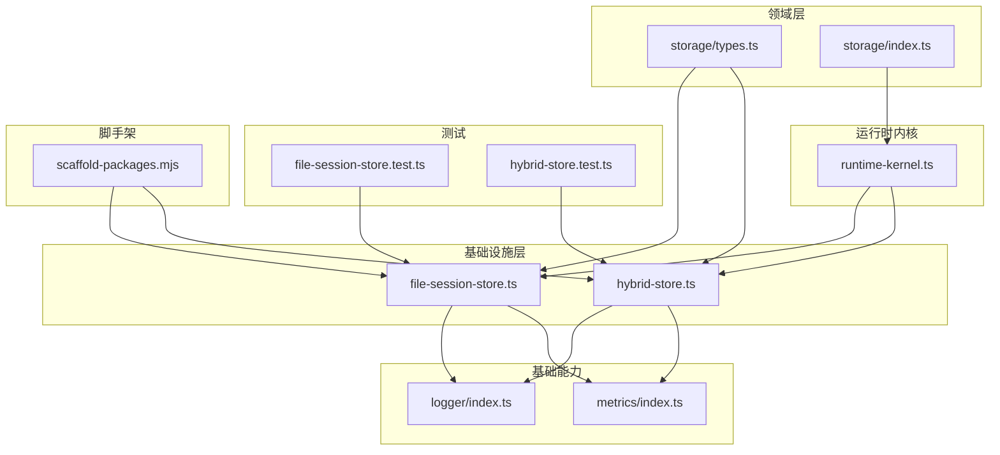
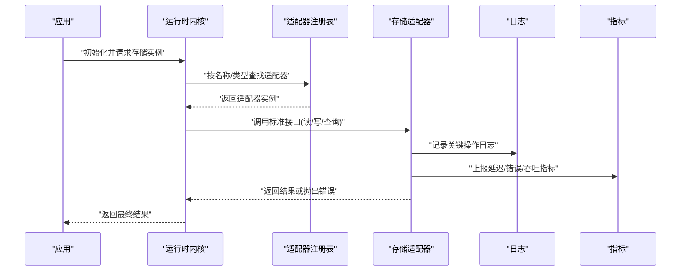
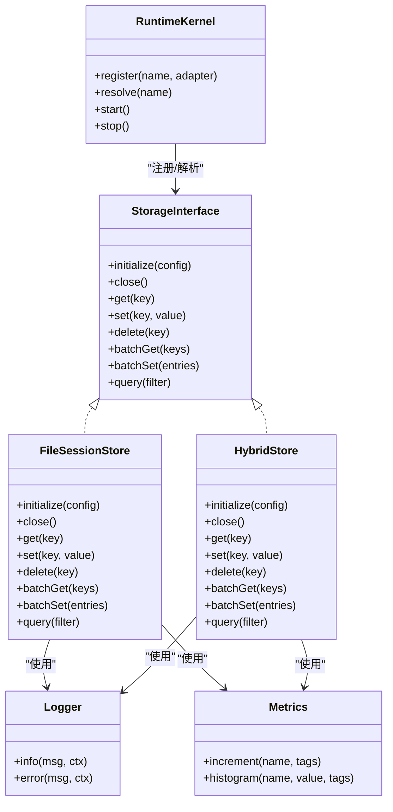

# 自定义存储开发

<cite>
**本文引用的文件**   
- [engine/packages/adapters/README.md](file://engine/packages/adapters/README.md)
- [engine/packages/domain-layer/src/storage/types.ts](file://engine/packages/domain-layer/src/storage/types.ts)
- [engine/packages/domain-layer/src/storage/index.ts](file://engine/packages/domain-layer/src/storage/index.ts)
- [engine/packages/foundation/src/logger/index.ts](file://engine/packages/foundation/src/logger/index.ts)
- [engine/packages/foundation/src/metrics/index.ts](file://engine/packages/foundation/src/metrics/index.ts)
- [engine/packages/engine/src/runtime-kernel.ts](file://engine/packages/engine/src/runtime-kernel.ts)
- [engine/packages/infrastructure/src/file-session-store.ts](file://engine/packages/infrastructure/src/file-session-store.ts)
- [engine/packages/infrastructure/src/hybrid-store.ts](file://engine/packages/infrastructure/src/hybrid-store.ts)
- [engine/tests/file-session-store.test.ts](file://engine/tests/file-session-store.test.ts)
- [engine/tests/hybrid-store.test.ts](file://engine/tests/hybrid-store.test.ts)
- [engine/scripts/scaffold-packages.mjs](file://engine/scripts/scaffold-packages.mjs)
</cite>

## 目录
1. [简介](#简介)
2. [项目结构](#项目结构)
3. [核心组件](#核心组件)
4. [架构总览](#架构总览)
5. [详细组件分析](#详细组件分析)
6. [依赖分析](#依赖分析)
7. [性能考虑](#性能考虑)
8. [故障排查指南](#故障排查指南)
9. [结论](#结论)
10. [附录](#附录)

## 简介
本指南面向希望为 KCoder 引擎实现“自定义存储适配器”的开发者。内容覆盖：
- 存储接口规范与契约（必需方法、可选方法、错误处理约定）
- 数据存储模型定义、序列化与反序列化机制
- 单元测试、集成测试与性能基准测试策略
- 适配器的注册机制、生命周期管理、配置注入
- 调试技巧、日志记录与监控指标方案
- 打包发布与版本管理最佳实践

目标是帮助你在不破坏现有系统行为的前提下，快速构建高质量、可观测、可维护的存储适配器。

## 项目结构
KCoder 采用多包工作区组织，存储相关代码主要分布在以下位置：
- 领域层接口与类型定义：domain-layer
- 基础设施层具体实现：infrastructure（如文件存储、混合存储）
- 运行时内核：engine（负责注册、生命周期与配置注入）
- 基础能力：foundation（日志、指标等横切关注点）
- 测试：tests（单元、集成、回归用例）
- 脚手架脚本：scripts（用于生成新包骨架）

图表来源
- [engine/packages/domain-layer/src/storage/types.ts](file://engine/packages/domain-layer/src/storage/types.ts)
- [engine/packages/domain-layer/src/storage/index.ts](file://engine/packages/domain-layer/src/storage/index.ts)
- [engine/packages/infrastructure/src/file-session-store.ts](file://engine/packages/infrastructure/src/file-session-store.ts)
- [engine/packages/infrastructure/src/hybrid-store.ts](file://engine/packages/infrastructure/src/hybrid-store.ts)
- [engine/packages/engine/src/runtime-kernel.ts](file://engine/packages/engine/src/runtime-kernel.ts)
- [engine/packages/foundation/src/logger/index.ts](file://engine/packages/foundation/src/logger/index.ts)
- [engine/packages/foundation/src/metrics/index.ts](file://engine/packages/foundation/src/metrics/index.ts)
- [engine/tests/file-session-store.test.ts](file://engine/tests/file-session-store.test.ts)
- [engine/tests/hybrid-store.test.ts](file://engine/tests/hybrid-store.test.ts)
- [engine/scripts/scaffold-packages.mjs](file://engine/scripts/scaffold-packages.mjs)

章节来源
- [engine/packages/adapters/README.md](file://engine/packages/adapters/README.md)

## 核心组件
- 存储接口与类型定义
  - 位于 domain-layer 的 storage 模块，定义了存储适配器需要实现的统一接口与数据模型类型。
  - 包含必需方法与可选方法的声明、参数与返回值的类型约束、以及错误类型的约定。
- 基础设施实现
  - file-session-store：基于文件系统的会话存储实现，演示了持久化、序列化和事务性写入的基本模式。
  - hybrid-store：混合存储实现，组合多种后端以提供高可用或读写分离能力。
- 运行时内核
  - runtime-kernel：负责在应用启动时加载并注册存储适配器，注入配置，管理生命周期。
- 基础能力
  - logger：统一的日志记录入口，供存储适配器输出结构化日志。
  - metrics：统一的指标采集入口，供存储适配器上报延迟、吞吐、错误率等指标。

章节来源
- [engine/packages/domain-layer/src/storage/types.ts](file://engine/packages/domain-layer/src/storage/types.ts)
- [engine/packages/domain-layer/src/storage/index.ts](file://engine/packages/domain-layer/src/storage/index.ts)
- [engine/packages/infrastructure/src/file-session-store.ts](file://engine/packages/infrastructure/src/file-session-store.ts)
- [engine/packages/infrastructure/src/hybrid-store.ts](file://engine/packages/infrastructure/src/hybrid-store.ts)
- [engine/packages/engine/src/runtime-kernel.ts](file://engine/packages/engine/src/runtime-kernel.ts)
- [engine/packages/foundation/src/logger/index.ts](file://engine/packages/foundation/src/logger/index.ts)
- [engine/packages/foundation/src/metrics/index.ts](file://engine/packages/foundation/src/metrics/index.ts)

## 架构总览
下图展示了存储适配器在系统中的角色与交互关系：运行时内核通过注册表获取适配器实例，调用其标准接口完成数据的存取；适配器内部使用日志与指标进行可观测性上报。

图表来源
- [engine/packages/engine/src/runtime-kernel.ts](file://engine/packages/engine/src/runtime-kernel.ts)
- [engine/packages/foundation/src/logger/index.ts](file://engine/packages/foundation/src/logger/index.ts)
- [engine/packages/foundation/src/metrics/index.ts](file://engine/packages/foundation/src/metrics/index.ts)

## 详细组件分析

### 存储接口与契约
- 必需方法
  - 初始化与关闭：确保资源正确分配与释放。
  - 基本读写：键值或实体级别的读取、写入、删除。
  - 批量操作：支持批量写入/读取以提升吞吐。
  - 查询与扫描：按条件检索、分页或游标式遍历。
- 可选方法
  - 事务：跨多个键/实体的原子性操作。
  - 索引与二级索引：加速特定字段查询。
  - 压缩与归档：对历史数据进行压缩或迁移。
  - 健康检查：对外暴露可用性探测接口。
- 错误处理约定
  - 明确区分“不存在”、“权限不足”、“并发冲突”、“超时/不可用”等错误类别。
  - 错误对象应包含可读的错误码、上下文信息与重试建议。
  - 上层不应吞掉异常，需透传或转换为统一错误类型。

章节来源
- [engine/packages/domain-layer/src/storage/types.ts](file://engine/packages/domain-layer/src/storage/types.ts)
- [engine/packages/domain-layer/src/storage/index.ts](file://engine/packages/domain-layer/src/storage/index.ts)

### 数据存储模型与序列化
- 数据模型
  - 实体应具备稳定标识、版本控制与时间戳，便于幂等与一致性校验。
  - 字段设计遵循最小必要原则，避免过度嵌套导致序列化开销过大。
- 序列化与反序列化
  - 选择高效且稳定的格式（如 JSON/MessagePack），并确保向后兼容。
  - 对大对象进行分块或流式处理，避免内存峰值过高。
  - 提供校验器，在反序列化阶段拒绝非法数据。

章节来源
- [engine/packages/infrastructure/src/file-session-store.ts](file://engine/packages/infrastructure/src/file-session-store.ts)
- [engine/packages/infrastructure/src/hybrid-store.ts](file://engine/packages/infrastructure/src/hybrid-store.ts)

### 适配器模板与脚手架
- 脚手架工具
  - 使用 scripts/scaffold-packages.mjs 快速生成新适配器包的目录结构与基础文件。
  - 自动生成 package.json、tsconfig、示例实现与基础测试骨架。
- 模板要点
  - 实现领域层定义的接口，补齐所有必需方法。
  - 内置日志与指标埋点，遵循统一命名规范。
  - 提供配置项说明与默认值，支持环境变量注入。

章节来源
- [engine/scripts/scaffold-packages.mjs](file://engine/scripts/scaffold-packages.mjs)

### 单元测试编写
- 目标
  - 验证每个方法的输入校验、正常路径与异常分支。
  - 模拟外部依赖（文件系统、网络、数据库）以保证隔离性。
- 策略
  - 使用内存或临时目录作为后端，避免污染真实环境。
  - 针对并发场景构造竞争条件，验证锁与幂等逻辑。
  - 断言日志与指标是否按预期上报。

章节来源
- [engine/tests/file-session-store.test.ts](file://engine/tests/file-session-store.test.ts)
- [engine/tests/hybrid-store.test.ts](file://engine/tests/hybrid-store.test.ts)

### 集成测试策略
- 目标
  - 验证适配器与运行时内核的协作是否正确，包括注册、配置注入与生命周期。
- 策略
  - 使用最小化的运行环境启动内核，注入待测适配器。
  - 执行端到端流程：创建会话、写入状态、查询、恢复。
  - 注入故障（磁盘满、网络抖动、权限不足）验证降级与恢复。

章节来源
- [engine/tests/file-session-store.test.ts](file://engine/tests/file-session-store.test.ts)
- [engine/tests/hybrid-store.test.ts](file://engine/tests/hybrid-store.test.ts)

### 性能基准测试
- 目标
  - 评估不同负载下的吞吐、延迟与资源占用。
- 策略
  - 使用固定数据集与随机访问模式，对比单写/并发写/批量写。
  - 监控 CPU、内存、I/O 与 GC 行为，定位瓶颈。
  - 输出可复现的报告，纳入持续集成。

章节来源
- [engine/tests/file-session-store.test.ts](file://engine/tests/file-session-store.test.ts)
- [engine/tests/hybrid-store.test.ts](file://engine/tests/hybrid-store.test.ts)

### 注册机制、生命周期管理与配置注入
- 注册机制
  - 运行时内核在启动时扫描并注册适配器，支持按名称或类型解析。
  - 注册表需提供去重、版本兼容性与回退策略。
- 生命周期管理
  - 初始化：加载配置、建立连接、预热缓存。
  - 运行：响应读写请求，保证线程安全与资源复用。
  - 关闭：优雅退出，刷新缓冲、释放句柄、上报最终指标。
- 配置注入
  - 从配置文件与环境变量合并注入，提供默认值与校验。
  - 敏感信息通过密钥管理服务注入，避免硬编码。

章节来源
- [engine/packages/engine/src/runtime-kernel.ts](file://engine/packages/engine/src/runtime-kernel.ts)

### 调试技巧、日志记录与监控指标
- 调试技巧
  - 开启详细日志级别，结合请求 ID 追踪一次操作的完整链路。
  - 使用快照与回放功能，复现问题现场。
- 日志记录
  - 结构化日志，包含时间、级别、模块、操作名、耗时、错误码。
  - 避免记录敏感信息，必要时脱敏。
- 监控指标
  - 延迟：P50/P95/P99 分位。
  - 吞吐：QPS、批大小分布。
  - 错误率：分类统计（超时、冲突、权限、IO）。
  - 资源：内存、CPU、磁盘 I/O。

章节来源
- [engine/packages/foundation/src/logger/index.ts](file://engine/packages/foundation/src/logger/index.ts)
- [engine/packages/foundation/src/metrics/index.ts](file://engine/packages/foundation/src/metrics/index.ts)

### 打包发布与版本管理最佳实践
- 打包
  - 使用脚手架生成的构建脚本，输出独立包与类型声明。
  - 产物包含 README、CHANGELOG、许可证与示例配置。
- 版本管理
  - 遵循语义化版本，变更影响范围清晰标注。
  - 保持接口向后兼容，新增字段标记可选并提供迁移指南。
- 发布流程
  - 自动化测试与质量门禁通过后，推送至私有仓库或公共市场。
  - 提供安装与升级指引，包含兼容性矩阵。

章节来源
- [engine/scripts/scaffold-packages.mjs](file://engine/scripts/scaffold-packages.mjs)

## 依赖分析
存储适配器与系统其他组件的依赖关系如下：

图表来源
- [engine/packages/domain-layer/src/storage/types.ts](file://engine/packages/domain-layer/src/storage/types.ts)
- [engine/packages/infrastructure/src/file-session-store.ts](file://engine/packages/infrastructure/src/file-session-store.ts)
- [engine/packages/infrastructure/src/hybrid-store.ts](file://engine/packages/infrastructure/src/hybrid-store.ts)
- [engine/packages/engine/src/runtime-kernel.ts](file://engine/packages/engine/src/runtime-kernel.ts)
- [engine/packages/foundation/src/logger/index.ts](file://engine/packages/foundation/src/logger/index.ts)
- [engine/packages/foundation/src/metrics/index.ts](file://engine/packages/foundation/src/metrics/index.ts)

章节来源
- [engine/packages/domain-layer/src/storage/types.ts](file://engine/packages/domain-layer/src/storage/types.ts)
- [engine/packages/engine/src/runtime-kernel.ts](file://engine/packages/engine/src/runtime-kernel.ts)

## 性能考虑
- 减少不必要的序列化与拷贝，尽量使用零拷贝或流式处理。
- 批量操作优先，降低系统调用次数与网络往返。
- 合理设置超时与重试策略，避免雪崩效应。
- 使用连接池与对象池，复用底层资源。
- 对热点数据引入本地缓存，注意一致性与失效策略。
- 定期归档冷数据，减轻主存储压力。

[本节为通用指导，无需引用具体文件]

## 故障排查指南
- 常见问题
  - 初始化失败：检查配置项、权限、路径存在性与依赖服务可用性。
  - 读写异常：查看错误码与上下文，确认数据合法性与并发冲突。
  - 性能退化：观察指标趋势，定位慢查询与热点键。
- 诊断步骤
  - 启用详细日志，收集请求链路信息。
  - 使用最小复现用例与固定数据集进行回归。
  - 对比不同版本的差异，定位引入问题的变更。
- 恢复策略
  - 自动重试与退避，失败快速回滚。
  - 降级到只读或备用后端，保障核心功能可用。

章节来源
- [engine/tests/file-session-store.test.ts](file://engine/tests/file-session-store.test.ts)
- [engine/tests/hybrid-store.test.ts](file://engine/tests/hybrid-store.test.ts)

## 结论
通过遵循统一的存储接口契约、完善的测试与可观测性方案，以及规范的注册与生命周期管理，你可以快速构建出高性能、高可靠的自定义存储适配器。建议在迭代过程中持续优化序列化策略、批处理与缓存机制，并通过基准测试驱动性能改进。

[本节为总结性内容，无需引用具体文件]

## 附录
- 术语
  - 适配器：实现领域层存储接口的具体后端。
  - 注册表：运行时用于发现与管理适配器的组件。
  - 指标：用于衡量系统行为的量化数据。
- 参考
  - 适配器文档与示例：参见 adapters 包说明。
  - 脚手架脚本：用于快速生成新适配器包。

章节来源
- [engine/packages/adapters/README.md](file://engine/packages/adapters/README.md)
- [engine/scripts/scaffold-packages.mjs](file://engine/scripts/scaffold-packages.mjs)