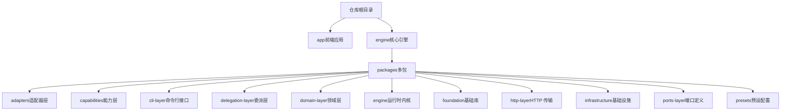
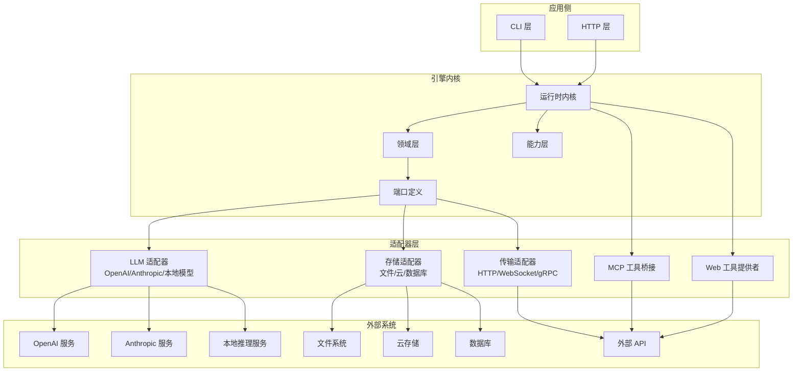
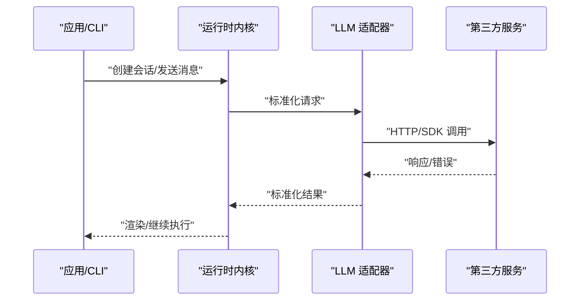
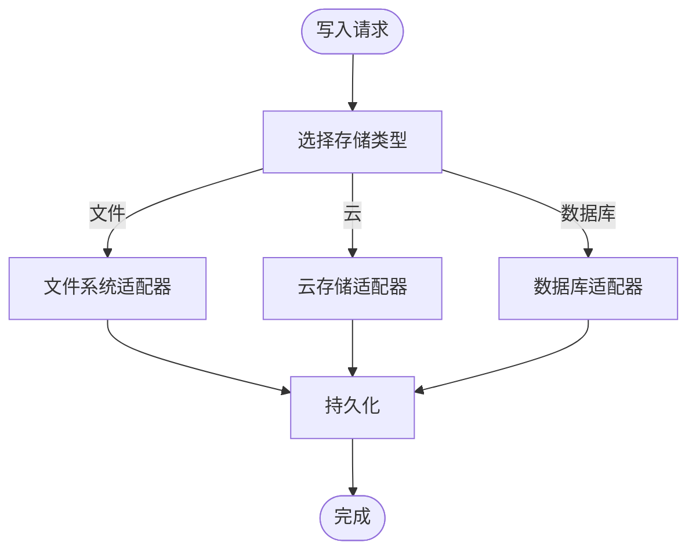
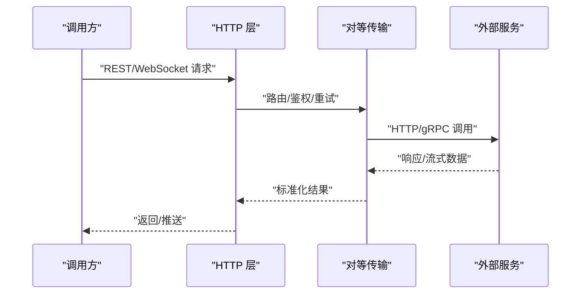
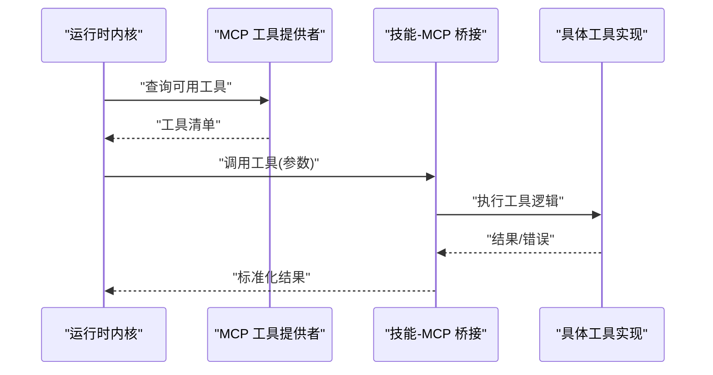
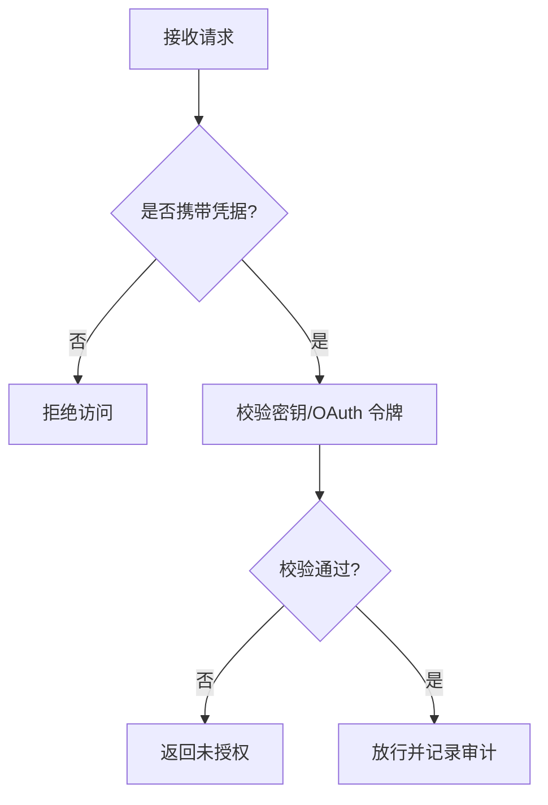
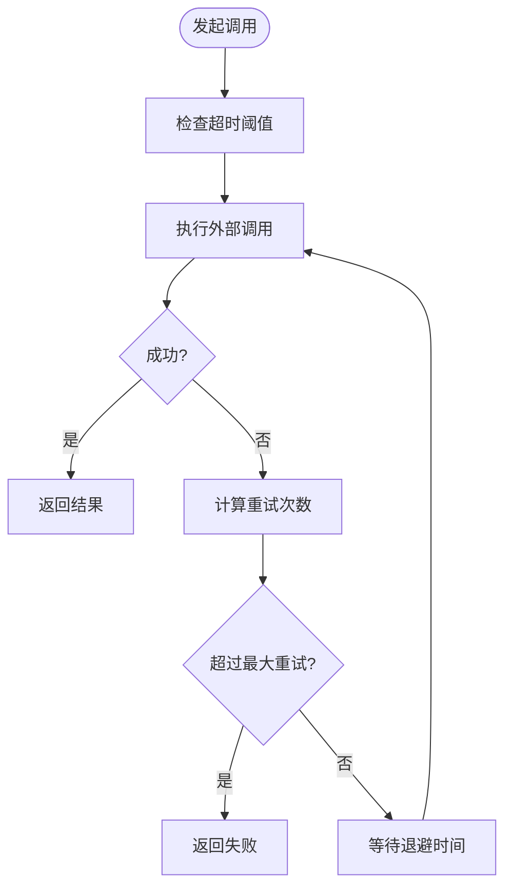
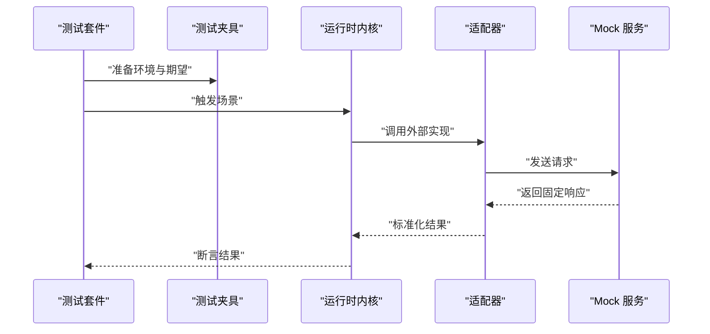
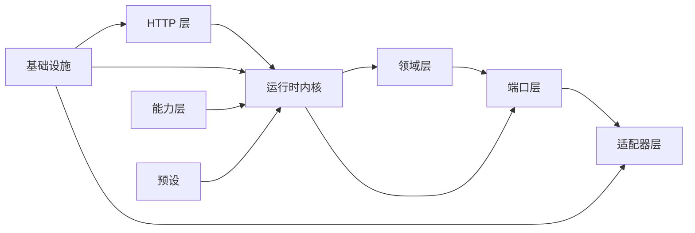

# 第三方集成

<cite>
**本文引用的文件**   
- [engine/README.md](file://engine/README.md)
- [engine/config.example.json](file://engine/config.example.json)
- [engine/package.json](file://engine/package.json)
- [engine/pnpm-workspace.yaml](file://engine/pnpm-workspace.yaml)
- [engine/Dockerfile](file://engine/Dockerfile)
- [engine/docker-compose.yml](file://engine/docker-compose.yml)
- [engine/packages/adapters/README.md](file://engine/packages/adapters/README.md)
- [engine/packages/capabilities/README.md](file://engine/packages/capabilities/README.md)
- [engine/packages/cli-layer/README.md](file://engine/packages/cli-layer/README.md)
- [engine/packages/delegation-layer/README.md](file://engine/packages/delegation-layer/README.md)
- [engine/packages/domain-layer/README.md](file://engine/packages/domain-layer/README.md)
- [engine/packages/engine/README.md](file://engine/packages/engine/README.md)
- [engine/packages/foundation/README.md](file://engine/packages/foundation/README.md)
- [engine/packages/http-layer/README.md](file://engine/packages/http-layer/README.md)
- [engine/packages/infrastructure/README.md](file://engine/packages/infrastructure/README.md)
- [engine/packages/ports-layer/README.md](file://engine/packages/ports-layer/README.md)
- [engine/packages/presets/README.md](file://engine/packages/presets/README.md)
- [engine/tests/mcp-config.test.ts](file://engine/tests/mcp-config.test.ts)
- [engine/tests/mcp-tool-provider.test.ts](file://engine/tests/mcp-tool-provider.test.ts)
- [engine/tests/skill-mcp-bridge.test.ts](file://engine/tests/skill-mcp-bridge.test.ts)
- [engine/tests/web-tool-provider.test.ts](file://engine/tests/web-tool-provider.test.ts)
- [engine/tests/http-peer-transport.test.ts](file://engine/tests/http-peer-transport.test.ts)
- [engine/tests/http-server.test.ts](file://engine/tests/http-server.test.ts)
- [engine/tests/file-session-store.test.ts](file://engine/tests/file-session-store.test.ts)
- [engine/tests/hybrid-store.test.ts](file://engine/tests/hybrid-store.test.ts)
- [engine/tests/memory-store.test.ts](file://engine/tests/memory-store.test.ts)
- [engine/tests/run-state-store.test.ts](file://engine/tests/run-state-store.test.ts)
- [engine/tests/tool-dispatch-errors.test.ts](file://engine/tests/tool-dispatch-errors.test.ts)
- [engine/tests/tool-runtime-v3.test.ts](file://engine/tests/tool-runtime-v3.test.ts)
- [engine/tests/runtime-kernel-provider-matrix.test.ts](file://engine/tests/runtime-kernel-provider-matrix.test.ts)
- [engine/tests/model-client.test.ts](file://engine/tests/model-client.test.ts)
- [engine/tests/provider-compatibility.test.ts](file://engine/tests/provider-compatibility.test.ts)
- [engine/tests/cache.test.ts](file://engine/tests/cache.test.ts)
</cite>

## 目录
1. [简介](#简介)
2. [项目结构](#项目结构)
3. [核心组件](#核心组件)
4. [架构总览](#架构总览)
5. [详细组件分析](#详细组件分析)
6. [依赖分析](#依赖分析)
7. [性能考虑](#性能考虑)
8. [故障排查指南](#故障排查指南)
9. [结论](#结论)
10. [附录](#附录)

## 简介
本指南面向希望将 KCoder 引擎与第三方服务集成的开发者，覆盖以下主题：
- LLM 提供商接入（OpenAI、Anthropic、本地模型）
- 存储后端替换（文件系统、云存储、数据库适配器）
- 外部服务集成（HTTP API、WebSocket、gRPC 等协议适配）
- MCP（Model Context Protocol）工具集成（注册、调用、错误处理）
- 认证与授权（API 密钥管理、OAuth、权限控制）
- 最佳实践（重试、超时、缓存）
- 集成测试方法与调试技巧
- 常见第三方服务的集成示例与配置模板

KCoder 引擎采用分层与插件化设计，通过 ports/adapters 模式解耦领域逻辑与外部实现，便于扩展新的 LLM 提供商、存储后端与通信协议。

## 项目结构
仓库根目录包含前端应用与引擎两部分。第三方集成主要围绕 engine 子工程展开，其内部按职责划分为多个包（packages），并通过 pnpm workspace 进行统一构建与测试。

**图表来源**
- [engine/README.md](file://engine/README.md)
- [engine/pnpm-workspace.yaml](file://engine/pnpm-workspace.yaml)

**章节来源**
- [engine/README.md](file://engine/README.md)
- [engine/pnpm-workspace.yaml](file://engine/pnpm-workspace.yaml)

## 核心组件
- 适配器层（adapters）：提供对外部系统的可插拔实现，如 LLM 客户端、存储后端、消息总线等。
- 端口层（ports-layer）：定义抽象接口（端口），用于约束适配器实现，确保领域逻辑不依赖具体第三方。
- 领域层（domain-layer）：封装业务规则与状态机，保持与外部无关的稳定性。
- 运行时内核（engine）：编排任务执行、工具调度、事件流与生命周期管理。
- HTTP 层（http-layer）：提供 HTTP 服务端与客户端能力，支持 REST 与 WebSocket 等协议。
- 基础设施（infrastructure）：通用能力（日志、指标、追踪、配置加载、序列化等）。
- 能力层（capabilities）：对上层暴露的能力组合与策略（如计划、审查、安全扫描等）。
- CLI 层（cli-layer）：命令行入口与脚本工具。
- 委派层（delegation-layer）：子代理委派与治理。
- 预设（presets）：开箱即用的配置模板与默认行为。

**章节来源**
- [engine/packages/adapters/README.md](file://engine/packages/adapters/README.md)
- [engine/packages/ports-layer/README.md](file://engine/packages/ports-layer/README.md)
- [engine/packages/domain-layer/README.md](file://engine/packages/domain-layer/README.md)
- [engine/packages/engine/README.md](file://engine/packages/engine/README.md)
- [engine/packages/http-layer/README.md](file://engine/packages/http-layer/README.md)
- [engine/packages/infrastructure/README.md](file://engine/packages/infrastructure/README.md)
- [engine/packages/capabilities/README.md](file://engine/packages/capabilities/README.md)
- [engine/packages/cli-layer/README.md](file://engine/packages/cli-layer/README.md)
- [engine/packages/delegation-layer/README.md](file://engine/packages/delegation-layer/README.md)
- [engine/packages/presets/README.md](file://engine/packages/presets/README.md)

## 架构总览
下图展示了 KCoder 引擎在第三方集成中的关键交互路径：应用通过 CLI 或 HTTP 层进入内核，内核根据配置选择 LLM 提供商适配器与存储后端适配器，并在需要时桥接 MCP 工具与外部 Web 工具。

**图表来源**
- [engine/packages/engine/README.md](file://engine/packages/engine/README.md)
- [engine/packages/adapters/README.md](file://engine/packages/adapters/README.md)
- [engine/packages/ports-layer/README.md](file://engine/packages/ports-layer/README.md)
- [engine/packages/http-layer/README.md](file://engine/packages/http-layer/README.md)
- [engine/tests/mcp-tool-provider.test.ts](file://engine/tests/mcp-tool-provider.test.ts)
- [engine/tests/web-tool-provider.test.ts](file://engine/tests/web-tool-provider.test.ts)
- [engine/tests/http-peer-transport.test.ts](file://engine/tests/http-peer-transport.test.ts)

## 详细组件分析

### LLM 提供商接入（OpenAI、Anthropic、本地模型）
- 接入方式
  - 通过适配器层实现统一的 LLM 客户端接口，遵循端口层定义的契约。
  - 使用预设或配置文件指定提供商类型与参数（端点、模型名、鉴权信息）。
- 配置要点
  - 在配置文件中声明提供商标识、模型名称、请求参数与鉴权字段。
  - 本地模型可通过自定义端点与参数映射接入。
- 调用流程
  - 内核发起对话/补全请求，选择对应适配器实例，发送标准化请求并解析响应。
- 错误处理
  - 统一捕获网络异常、鉴权失败、速率限制与模型返回错误，转换为标准错误码与提示。
- 测试验证
  - 使用 provider 矩阵测试覆盖不同提供商组合；使用 model client 单测校验请求/响应规范化。

**图表来源**
- [engine/tests/runtime-kernel-provider-matrix.test.ts](file://engine/tests/runtime-kernel-provider-matrix.test.ts)
- [engine/tests/model-client.test.ts](file://engine/tests/model-client.test.ts)
- [engine/tests/provider-compatibility.test.ts](file://engine/tests/provider-compatibility.test.ts)

**章节来源**
- [engine/config.example.json](file://engine/config.example.json)
- [engine/tests/runtime-kernel-provider-matrix.test.ts](file://engine/tests/runtime-kernel-provider-matrix.test.ts)
- [engine/tests/model-client.test.ts](file://engine/tests/model-client.test.ts)
- [engine/tests/provider-compatibility.test.ts](file://engine/tests/provider-compatibility.test.ts)

### 存储后端替换（文件系统、云存储、数据库）
- 替换方案
  - 通过存储适配器实现统一接口，支持本地文件、对象存储与关系型/文档数据库。
  - 使用混合存储策略（hybrid store）结合内存与持久化，提升性能与可靠性。
- 配置要点
  - 在配置中指定存储类型、连接参数与路径前缀。
  - 针对云存储设置凭据与桶名；数据库设置连接串与表结构迁移。
- 数据流
  - 会话、运行状态、工件与历史事件写入适配器，读取时优先命中缓存再回源。
- 错误处理
  - 区分不可恢复错误（权限不足、连接失败）与可重试错误（临时网络抖动）。
- 测试验证
  - 文件会话存储、混合存储、内存存储与运行状态存储均有单测覆盖。

**图表来源**
- [engine/tests/file-session-store.test.ts](file://engine/tests/file-session-store.test.ts)
- [engine/tests/hybrid-store.test.ts](file://engine/tests/hybrid-store.test.ts)
- [engine/tests/memory-store.test.ts](file://engine/tests/memory-store.test.ts)
- [engine/tests/run-state-store.test.ts](file://engine/tests/run-state-store.test.ts)

**章节来源**
- [engine/tests/file-session-store.test.ts](file://engine/tests/file-session-store.test.ts)
- [engine/tests/hybrid-store.test.ts](file://engine/tests/hybrid-store.test.ts)
- [engine/tests/memory-store.test.ts](file://engine/tests/memory-store.test.ts)
- [engine/tests/run-state-store.test.ts](file://engine/tests/run-state-store.test.ts)

### 外部服务集成（HTTP API、WebSocket、gRPC）
- 协议适配
  - HTTP 层提供服务端与客户端能力，支持 REST 与 WebSocket 长连接。
  - gRPC 可通过传输适配器以二进制协议对接高性能服务。
- 集成方式
  - 通过 HTTP 对等传输（peer transport）与服务发现机制，动态路由到目标服务。
  - 使用中间件处理鉴权、限流、重试与观测性。
- 错误处理
  - 统一包装网络错误、超时、协议不兼容与反序列化失败。
- 测试验证
  - HTTP 服务端与对等传输均具备端到端测试用例。

**图表来源**
- [engine/tests/http-peer-transport.test.ts](file://engine/tests/http-peer-transport.test.ts)
- [engine/tests/http-server.test.ts](file://engine/tests/http-server.test.ts)

**章节来源**
- [engine/tests/http-peer-transport.test.ts](file://engine/tests/http-peer-transport.test.ts)
- [engine/tests/http-server.test.ts](file://engine/tests/http-server.test.ts)

### MCP（Model Context Protocol）工具集成
- 工具注册
  - 通过 MCP 工具提供者注册工具元数据与调用处理器。
  - 技能（skill）与 MCP 桥接可将领域能力暴露为 MCP 工具。
- 调用流程
  - 内核解析工具调用请求，转发至 MCP 桥接器，再由桥接器分发到具体工具实现。
- 错误处理
  - 捕获工具执行异常、参数校验失败与超时，返回结构化错误以便上层重试或降级。
- 测试验证
  - 提供 MCP 配置、工具提供者与技能桥接的测试用例。

**图表来源**
- [engine/tests/mcp-config.test.ts](file://engine/tests/mcp-config.test.ts)
- [engine/tests/mcp-tool-provider.test.ts](file://engine/tests/mcp-tool-provider.test.ts)
- [engine/tests/skill-mcp-bridge.test.ts](file://engine/tests/skill-mcp-bridge.test.ts)

**章节来源**
- [engine/tests/mcp-config.test.ts](file://engine/tests/mcp-config.test.ts)
- [engine/tests/mcp-tool-provider.test.ts](file://engine/tests/mcp-tool-provider.test.ts)
- [engine/tests/skill-mcp-bridge.test.ts](file://engine/tests/skill-mcp-bridge.test.ts)

### 认证与授权（API 密钥、OAuth、权限控制）
- API 密钥管理
  - 在配置中集中管理密钥，避免硬编码；敏感信息通过环境变量注入。
- OAuth 集成
  - 通过传输适配器或专用认证适配器实现 OAuth 流程，获取访问令牌并刷新。
- 权限控制
  - 在服务端中间件中进行角色与资源访问校验，结合审计日志记录操作轨迹。
- 测试验证
  - 使用凭证相关测试与 HTTP 服务端测试覆盖鉴权路径。

[此图为概念流程图，无需图表来源]

**章节来源**
- [engine/tests/finance-credentials.test.ts](file://engine/tests/finance-credentials.test.ts)
- [engine/tests/http-server.test.ts](file://engine/tests/http-server.test.ts)

### 最佳实践（重试、超时、缓存）
- 重试策略
  - 对幂等操作实施指数退避重试，限定最大次数与总时长。
- 超时处理
  - 为每个外部调用设置合理超时，避免阻塞主流程。
- 缓存策略
  - 使用内存缓存与混合存储减少重复 I/O；注意缓存失效与一致性。
- 观测性
  - 启用指标与链路追踪，定位瓶颈与异常。

**章节来源**
- [engine/tests/cache.test.ts](file://engine/tests/cache.test.ts)

### 集成测试方法与调试技巧
- 测试方法
  - 使用单元测试覆盖适配器、工具提供者与存储实现。
  - 使用端到端测试验证内核与提供商矩阵的组合行为。
- 调试技巧
  - 开启详细日志与追踪；使用测试夹具模拟外部服务响应。
  - 针对工具调用错误路径编写专项测试，确保错误语义一致。

**章节来源**
- [engine/tests/tool-dispatch-errors.test.ts](file://engine/tests/tool-dispatch-errors.test.ts)
- [engine/tests/tool-runtime-v3.test.ts](file://engine/tests/tool-runtime-v3.test.ts)
- [engine/tests/runtime-kernel-provider-matrix.test.ts](file://engine/tests/runtime-kernel-provider-matrix.test.ts)

## 依赖分析
KCoder 引擎通过 pnpm workspace 组织多包依赖，各包之间通过明确的 README 与接口契约协作。以下为关键依赖关系示意：

**图表来源**
- [engine/pnpm-workspace.yaml](file://engine/pnpm-workspace.yaml)
- [engine/packages/engine/README.md](file://engine/packages/engine/README.md)
- [engine/packages/ports-layer/README.md](file://engine/packages/ports-layer/README.md)
- [engine/packages/adapters/README.md](file://engine/packages/adapters/README.md)
- [engine/packages/http-layer/README.md](file://engine/packages/http-layer/README.md)
- [engine/packages/infrastructure/README.md](file://engine/packages/infrastructure/README.md)
- [engine/packages/capabilities/README.md](file://engine/packages/capabilities/README.md)
- [engine/packages/presets/README.md](file://engine/packages/presets/README.md)

**章节来源**
- [engine/pnpm-workspace.yaml](file://engine/pnpm-workspace.yaml)
- [engine/package.json](file://engine/package.json)

## 性能考虑
- 连接复用与池化：对 HTTP/gRPC 客户端启用连接池，降低握手开销。
- 批处理与流式响应：对大文本与代码生成采用流式输出，提升用户体验。
- 缓存与去重：对相似请求进行指纹去重与缓存命中。
- 资源隔离：为不同租户或任务分配独立上下文与配额，避免相互影响。
- 监控与告警：基于指标与追踪识别热点与异常，及时扩容或降级。

[本节为通用指导，无需章节来源]

## 故障排查指南
- 常见问题
  - 鉴权失败：检查密钥有效期与作用域；确认 OAuth 回调地址与签名。
  - 超时与重试风暴：调整超时阈值与退避策略，避免雪崩。
  - 存储不一致：核对混合存储的失效策略与事务边界。
  - MCP 工具不可用：检查工具清单注册与权限范围。
- 诊断步骤
  - 启用详细日志与链路追踪，定位失败节点。
  - 使用最小复现用例与测试夹具隔离问题。
  - 对比提供商矩阵测试结果，确认兼容性回归。

**章节来源**
- [engine/tests/tool-dispatch-errors.test.ts](file://engine/tests/tool-dispatch-errors.test.ts)
- [engine/tests/http-server.test.ts](file://engine/tests/http-server.test.ts)
- [engine/tests/hybrid-store.test.ts](file://engine/tests/hybrid-store.test.ts)
- [engine/tests/mcp-tool-provider.test.ts](file://engine/tests/mcp-tool-provider.test.ts)

## 结论
通过端口/适配器模式与多包分层，KCoder 引擎能够灵活接入各类第三方服务。建议在生产环境严格遵循认证与权限控制、完善重试与超时策略、建立全面的测试与观测体系，以确保集成稳定与可维护。

[本节为总结，无需章节来源]

## 附录

### 配置模板与示例
- 提供商配置
  - 在配置文件中添加提供商条目，包括类型、模型、端点与鉴权字段。
  - 参考示例配置路径与键名约定。
- 存储配置
  - 指定存储类型与连接参数；为云存储与数据库分别提供凭据与命名空间。
- Docker 与编排
  - 使用提供的 Dockerfile 与 docker-compose 快速部署引擎与依赖服务。

**章节来源**
- [engine/config.example.json](file://engine/config.example.json)
- [engine/Dockerfile](file://engine/Dockerfile)
- [engine/docker-compose.yml](file://engine/docker-compose.yml)