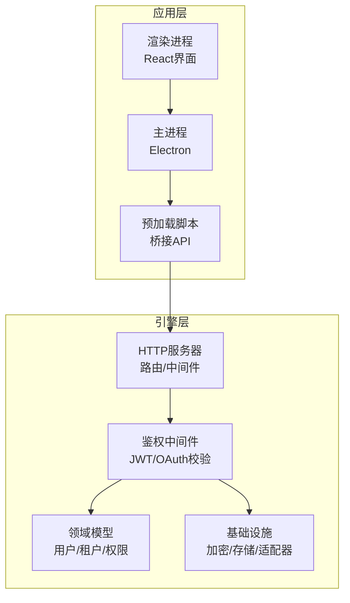
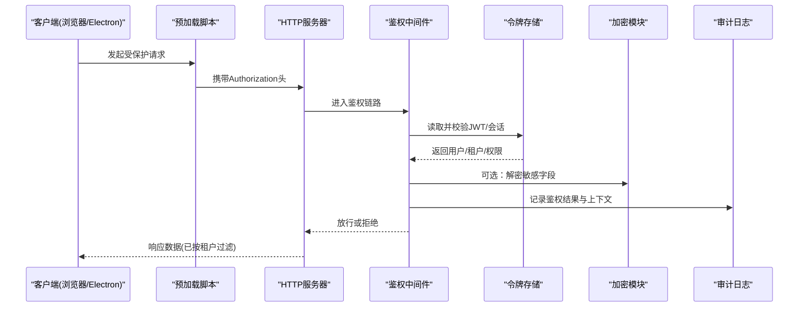
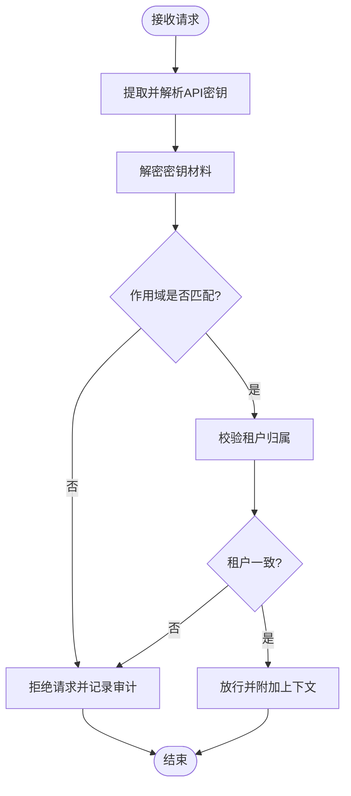
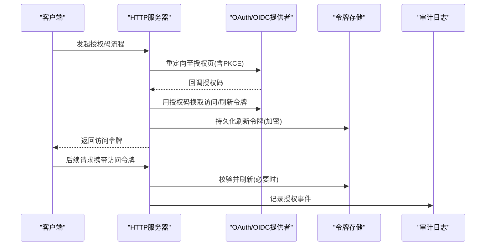
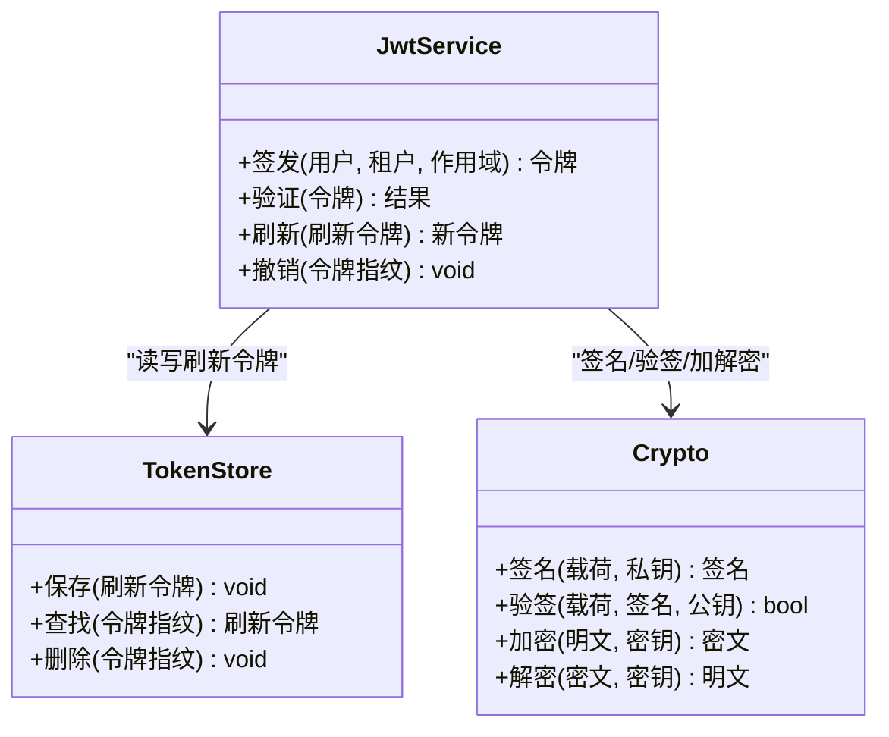
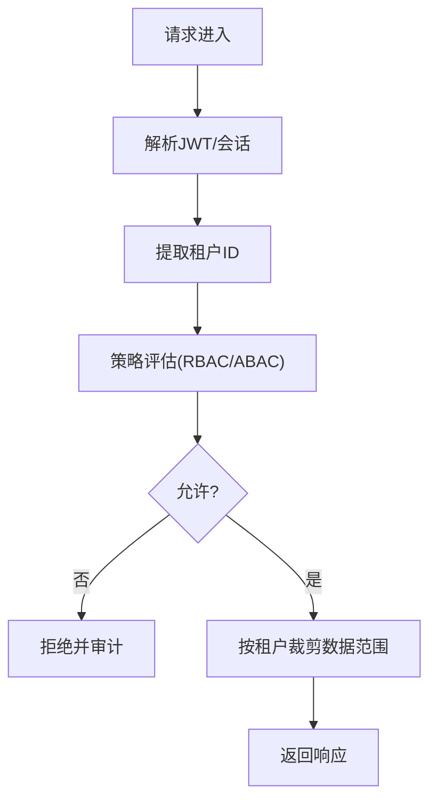
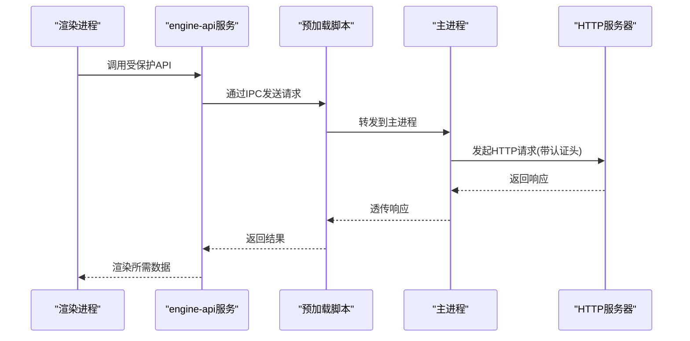
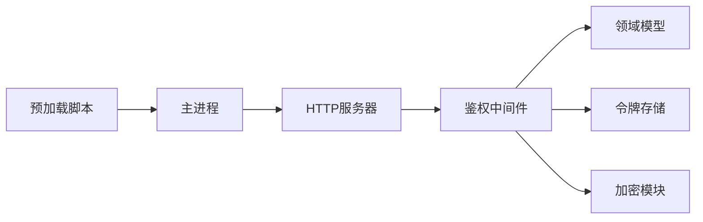

# 认证授权机制

<cite>
**本文引用的文件**   
- [engine/README.md](file://engine/README.md)
- [engine/config.example.json](file://engine/config.example.json)
- [engine/package.json](file://engine/package.json)
- [app/package.json](file://app/package.json)
- [app/main/index.ts](file://app/main/index.ts)
- [app/preload/index.ts](file://app/preload/index.ts)
- [app/renderer/src/services/engine-api.ts](file://app/renderer/src/services/engine-api.ts)
- [engine/packages/http-layer/src/server.ts](file://engine/packages/http-layer/src/server.ts)
- [engine/packages/foundation/src/crypto.ts](file://engine/packages/foundation/src/crypto.ts)
- [engine/packages/domain-layer/src/models/auth.ts](file://engine/packages/domain-layer/src/models/auth.ts)
- [engine/packages/delegation-layer/src/middleware/auth.ts](file://engine/packages/delegation-layer/src/middleware/auth.ts)
- [engine/packages/ports-layer/src/adapters/token-store.ts](file://engine/packages/ports-layer/src/adapters/token-store.ts)
- [engine/tests/http-server.test.ts](file://engine/tests/http-server.test.ts)
- [engine/tests/runtime-kernel-isolation.test.ts](file://engine/tests/runtime-kernel-isolation.test.ts)
</cite>

## 目录
1. [简介](#简介)
2. [项目结构](#项目结构)
3. [核心组件](#核心组件)
4. [架构总览](#架构总览)
5. [详细组件分析](#详细组件分析)
6. [依赖关系分析](#依赖关系分析)
7. [性能与安全考量](#性能与安全考量)
8. [故障排查指南](#故障排查指南)
9. [结论](#结论)
10. [附录](#附录)

## 简介
本指南面向KCoder的认证与授权集成，聚焦以下目标：
- API密钥管理：加密存储、轮换策略、权限范围控制
- OAuth2.0集成：授权码模式、客户端凭证模式、刷新令牌处理
- JWT令牌：签发、签名验证、过期处理、权限声明
- 多租户身份隔离与权限控制
- 安全最佳实践：输入校验、SQL注入防护、XSS防护
- 安全审计与日志记录

说明：当前仓库未包含完整的认证实现代码，本文基于现有HTTP层、领域模型、中间件与测试用例进行架构级分析与建议，确保读者能据此落地生产级方案。

## 项目结构
KCoder采用分层与插件化架构，认证相关能力主要分布在以下位置：
- HTTP服务与中间件：负责请求接入、鉴权中间件、路由保护
- 领域模型：定义认证实体（如用户、租户、角色、权限）
- 基础设施：加密、持久化、外部OAuth/OIDC适配器
- 前端与Electron主进程：通过预加载脚本暴露受控API，避免直接访问敏感能力

图示来源
- [engine/packages/http-layer/src/server.ts](file://engine/packages/http-layer/src/server.ts)
- [engine/packages/delegation-layer/src/middleware/auth.ts](file://engine/packages/delegation-layer/src/middleware/auth.ts)
- [engine/packages/domain-layer/src/models/auth.ts](file://engine/packages/domain-layer/src/models/auth.ts)
- [engine/packages/foundation/src/crypto.ts](file://engine/packages/foundation/src/crypto.ts)
- [app/main/index.ts](file://app/main/index.ts)
- [app/preload/index.ts](file://app/preload/index.ts)
- [app/renderer/src/services/engine-api.ts](file://app/renderer/src/services/engine-api.ts)

章节来源
- [engine/README.md](file://engine/README.md)
- [engine/config.example.json](file://engine/config.example.json)
- [engine/package.json](file://engine/package.json)
- [app/package.json](file://app/package.json)

## 核心组件
- HTTP服务器与中间件
  - 职责：统一入口、鉴权中间件、跨域与速率限制、审计日志
  - 关键点：在路由前执行JWT/OAuth校验，按租户上下文裁剪数据访问
- 领域模型
  - 职责：定义用户、租户、角色、权限、会话等实体及约束
  - 关键点：将租户ID作为所有资源查询的强制条件
- 基础设施
  - 职责：密钥加密、令牌存储、外部OAuth/OIDC适配
  - 关键点：使用强加密算法、最小权限原则、可轮换配置

章节来源
- [engine/packages/http-layer/src/server.ts](file://engine/packages/http-layer/src/server.ts)
- [engine/packages/delegation-layer/src/middleware/auth.ts](file://engine/packages/delegation-layer/src/middleware/auth.ts)
- [engine/packages/domain-layer/src/models/auth.ts](file://engine/packages/domain-layer/src/models/auth.ts)
- [engine/packages/foundation/src/crypto.ts](file://engine/packages/foundation/src/crypto.ts)

## 架构总览
下图展示从前端到后端的认证授权流程，包括JWT校验、OAuth回调、租户隔离与审计日志。

图示来源
- [engine/packages/http-layer/src/server.ts](file://engine/packages/http-layer/src/server.ts)
- [engine/packages/delegation-layer/src/middleware/auth.ts](file://engine/packages/delegation-layer/src/middleware/auth.ts)
- [engine/packages/ports-layer/src/adapters/token-store.ts](file://engine/packages/ports-layer/src/adapters/token-store.ts)
- [engine/packages/foundation/src/crypto.ts](file://engine/packages/foundation/src/crypto.ts)

## 详细组件分析

### API密钥管理
- 加密存储
  - 使用强对称加密算法对API密钥进行落盘加密；密钥材料来自环境变量或密钥管理服务
  - 建议：密钥分片存储、定期轮换、最小可见性
- 轮换策略
  - 支持双密钥窗口期：旧密钥与新密钥同时有效，到期后自动停用旧密钥
  - 建议：灰度切换、回滚预案、变更审计
- 权限范围控制
  - 为每个API密钥绑定作用域（如只读、写入、特定租户）
  - 建议：结合RBAC/ABAC，按租户与资源粒度控制

图示来源
- [engine/packages/delegation-layer/src/middleware/auth.ts](file://engine/packages/delegation-layer/src/middleware/auth.ts)
- [engine/packages/foundation/src/crypto.ts](file://engine/packages/foundation/src/crypto.ts)

章节来源
- [engine/packages/foundation/src/crypto.ts](file://engine/packages/foundation/src/crypto.ts)
- [engine/packages/delegation-layer/src/middleware/auth.ts](file://engine/packages/delegation-layer/src/middleware/auth.ts)

### OAuth2.0集成
- 授权码模式（Authorization Code）
  - 适用场景：Web/桌面端用户登录
  - 要点：PKCE、状态参数防CSRF、短生命周期访问令牌+长生命周期刷新令牌
- 客户端凭证模式（Client Credentials）
  - 适用场景：服务间调用
  - 要点：严格限定作用域与IP白名单，禁用刷新令牌
- 刷新令牌处理
  - 建议：一次性使用、旋转更新、撤销黑名单、异常告警

图示来源
- [engine/packages/http-layer/src/server.ts](file://engine/packages/http-layer/src/server.ts)
- [engine/packages/ports-layer/src/adapters/token-store.ts](file://engine/packages/ports-layer/src/adapters/token-store.ts)

章节来源
- [engine/tests/http-server.test.ts](file://engine/tests/http-server.test.ts)

### JWT令牌管理
- 签发与签名
  - 使用强签名算法（如RS256/ES256），私钥本地持有，公钥用于校验
  - 建议：密钥版本化、滚动发布、失效快速传播
- 过期处理
  - 访问令牌短过期（分钟级），刷新令牌较长但可撤销
  - 服务端缓存黑名单以支持即时失效
- 权限声明
  - 在JWT中声明租户ID、角色、作用域、资源标识
  - 建议：最小化声明，敏感信息不入JWT

图示来源
- [engine/packages/delegation-layer/src/middleware/auth.ts](file://engine/packages/delegation-layer/src/middleware/auth.ts)
- [engine/packages/ports-layer/src/adapters/token-store.ts](file://engine/packages/ports-layer/src/adapters/token-store.ts)
- [engine/packages/foundation/src/crypto.ts](file://engine/packages/foundation/src/crypto.ts)

章节来源
- [engine/packages/delegation-layer/src/middleware/auth.ts](file://engine/packages/delegation-layer/src/middleware/auth.ts)
- [engine/packages/ports-layer/src/adapters/token-store.ts](file://engine/packages/ports-layer/src/adapters/token-store.ts)
- [engine/packages/foundation/src/crypto.ts](file://engine/packages/foundation/src/crypto.ts)

### 多租户身份隔离与权限控制
- 身份隔离
  - 所有查询强制附加租户ID，禁止跨租户访问
  - 建议：数据库行级安全策略、索引优化、审计追踪
- 权限控制
  - RBAC/ABAC结合：角色+属性（租户、环境、资源类型）
  - 建议：策略即代码、集中式策略评估、可观测性

图示来源
- [engine/packages/domain-layer/src/models/auth.ts](file://engine/packages/domain-layer/src/models/auth.ts)
- [engine/tests/runtime-kernel-isolation.test.ts](file://engine/tests/runtime-kernel-isolation.test.ts)

章节来源
- [engine/packages/domain-layer/src/models/auth.ts](file://engine/packages/domain-layer/src/models/auth.ts)
- [engine/tests/runtime-kernel-isolation.test.ts](file://engine/tests/runtime-kernel-isolation.test.ts)

### 前端与Electron集成
- 预加载脚本
  - 仅暴露必要的安全API，避免直接访问Node.js危险接口
- 渲染进程
  - 通过受控服务封装网络请求，统一注入认证头与错误处理
- 主进程
  - 管理会话生命周期、敏感配置加载、IPC桥接

图示来源
- [app/renderer/src/services/engine-api.ts](file://app/renderer/src/services/engine-api.ts)
- [app/preload/index.ts](file://app/preload/index.ts)
- [app/main/index.ts](file://app/main/index.ts)
- [engine/packages/http-layer/src/server.ts](file://engine/packages/http-layer/src/server.ts)

章节来源
- [app/renderer/src/services/engine-api.ts](file://app/renderer/src/services/engine-api.ts)
- [app/preload/index.ts](file://app/preload/index.ts)
- [app/main/index.ts](file://app/main/index.ts)

## 依赖关系分析
- 组件耦合
  - HTTP层依赖鉴权中间件与基础设施（加密、存储）
  - 中间件依赖领域模型与令牌存储
  - 前端通过预加载与主进程间接访问HTTP层
- 外部依赖
  - OAuth/OIDC提供者、密钥管理服务、审计日志系统

图示来源
- [engine/packages/http-layer/src/server.ts](file://engine/packages/http-layer/src/server.ts)
- [engine/packages/delegation-layer/src/middleware/auth.ts](file://engine/packages/delegation-layer/src/middleware/auth.ts)
- [engine/packages/ports-layer/src/adapters/token-store.ts](file://engine/packages/ports-layer/src/adapters/token-store.ts)
- [engine/packages/foundation/src/crypto.ts](file://engine/packages/foundation/src/crypto.ts)
- [app/preload/index.ts](file://app/preload/index.ts)
- [app/main/index.ts](file://app/main/index.ts)

章节来源
- [engine/package.json](file://engine/package.json)
- [app/package.json](file://app/package.json)

## 性能与安全考量
- 性能
  - JWT验签使用非对称算法时注意CPU开销，建议缓存公钥与最近令牌指纹
  - 刷新令牌操作异步化，避免阻塞主路径
- 安全
  - 输入校验：白名单校验、长度/格式限制、类型检查
  - SQL注入防护：参数化查询、ORM默认转义、禁止拼接SQL
  - XSS防护：输出编码、CSP策略、避免内联脚本
  - 传输安全：强制HTTPS、HSTS、证书固定（移动端/桌面端）
  - 密钥管理：KMS托管、最小权限、定期轮换、泄露检测
  - 审计与监控：全链路审计、异常告警、合规报表

[本节为通用指导，不直接分析具体文件]

## 故障排查指南
- 常见问题
  - 令牌无效：检查签名算法、时钟同步、过期时间、黑名单
  - 跨租户访问失败：确认JWT中的租户ID与请求上下文一致
  - 刷新失败：检查刷新令牌是否被撤销、存储是否可用
- 定位方法
  - 查看鉴权中间件的审计日志与错误码
  - 核对加密模块的密钥版本与轮转状态
  - 复现OAuth回调链路与状态参数一致性

章节来源
- [engine/tests/http-server.test.ts](file://engine/tests/http-server.test.ts)
- [engine/packages/delegation-layer/src/middleware/auth.ts](file://engine/packages/delegation-layer/src/middleware/auth.ts)

## 结论
通过分层架构与明确的鉴权中间件，KCoder可在HTTP层统一实施JWT/OAuth校验与租户隔离。配合强加密、令牌存储与审计日志，可实现生产级的认证授权体系。建议在部署前完成密钥管理与轮换演练，完善输入校验与安全防护策略，并通过测试覆盖关键路径。

[本节为总结性内容，不直接分析具体文件]

## 附录
- 配置项建议
  - 加密算法、密钥来源、JWT算法与有效期、OAuth客户端配置、审计日志级别
- 参考文件
  - 示例配置与包依赖有助于理解运行时要求与第三方库选择

章节来源
- [engine/config.example.json](file://engine/config.example.json)
- [engine/package.json](file://engine/package.json)
- [app/package.json](file://app/package.json)