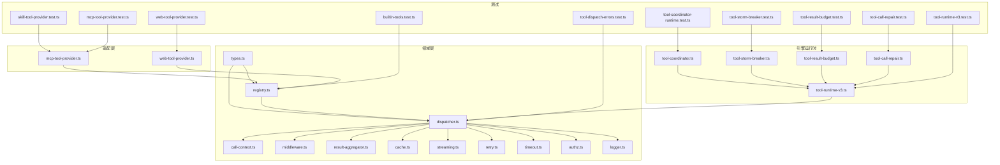
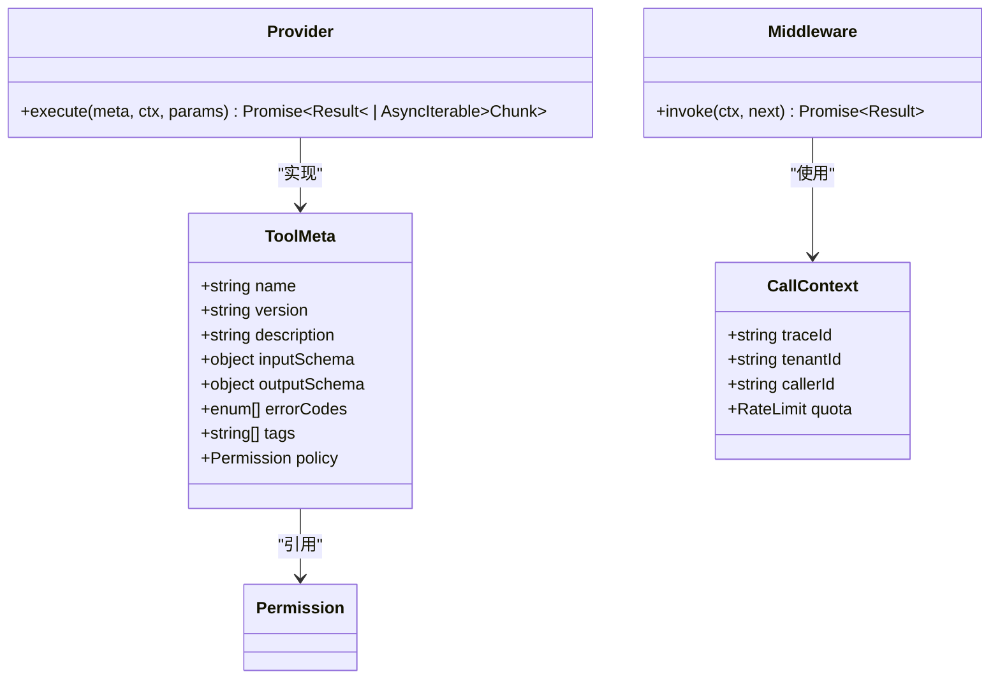
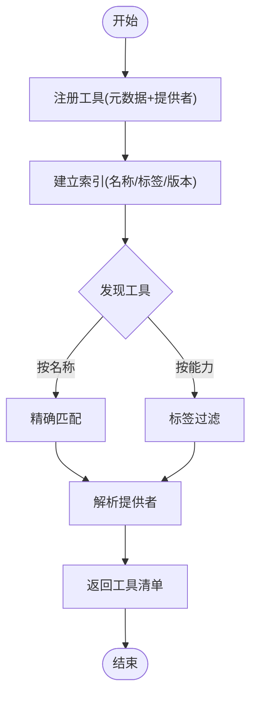
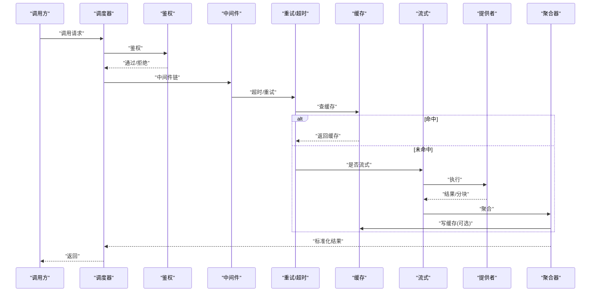
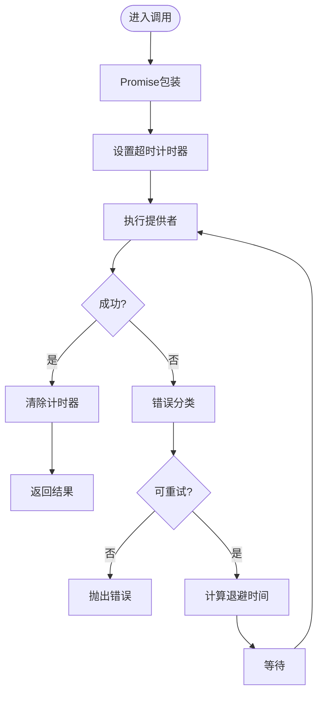
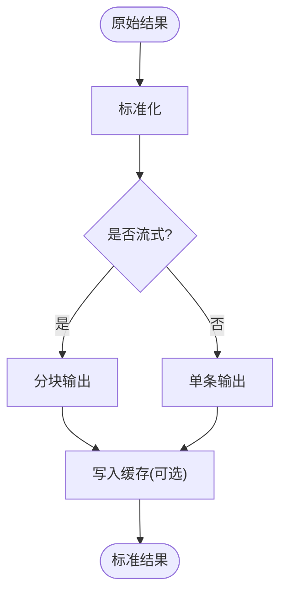
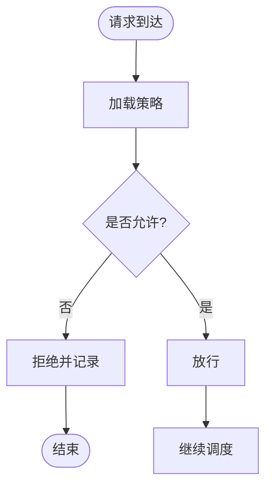
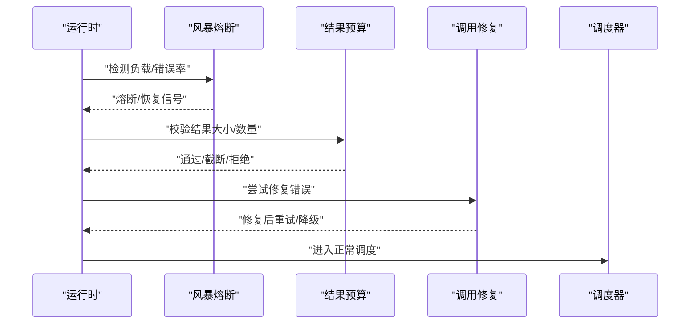
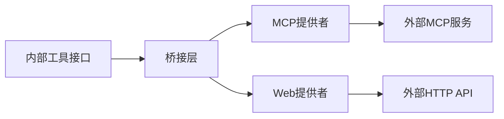
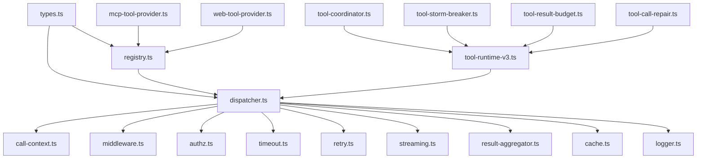

# 工具集成模式

<cite>
**本文引用的文件**   
- [engine/packages/domain-layer/src/tool/registry.ts](file://engine/packages/domain-layer/src/tool/registry.ts)
- [engine/packages/domain-layer/src/tool/dispatcher.ts](file://engine/packages/domain-layer/src/tool/dispatcher.ts)
- [engine/packages/domain-layer/src/tool/types.ts](file://engine/packages/domain-layer/src/tool/types.ts)
- [engine/packages/domain-layer/src/tool/call-context.ts](file://engine/packages/domain-layer/src/tool/call-context.ts)
- [engine/packages/domain-layer/src/tool/middleware.ts](file://engine/packages/domain-layer/src/tool/middleware.ts)
- [engine/packages/domain-layer/src/tool/result-aggregator.ts](file://engine/packages/domain-layer/src/tool/result-aggregator.ts)
- [engine/packages/domain-layer/src/tool/cache.ts](file://engine/packages/domain-layer/src/tool/cache.ts)
- [engine/packages/domain-layer/src/tool/streaming.ts](file://engine/packages/domain-layer/src/tool/streaming.ts)
- [engine/packages/domain-layer/src/tool/retry.ts](file://engine/packages/domain-layer/src/tool/retry.ts)
- [engine/packages/domain-layer/src/tool/timeout.ts](file://engine/packages/domain-layer/src/tool/timeout.ts)
- [engine/packages/domain-layer/src/tool/authz.ts](file://engine/packages/domain-layer/src/tool/authz.ts)
- [engine/packages/domain-layer/src/tool/logger.ts](file://engine/packages/domain-layer/src/tool/logger.ts)
- [engine/packages/engine/src/runtime/tool-runtime-v3.ts](file://engine/packages/engine/src/runtime/tool-runtime-v3.ts)
- [engine/packages/engine/src/runtime/tool-coordinator.ts](file://engine/packages/engine/src/runtime/tool-coordinator.ts)
- [engine/packages/engine/src/runtime/tool-storm-breaker.ts](file://engine/packages/engine/src/runtime/tool-storm-breaker.ts)
- [engine/packages/engine/src/runtime/tool-result-budget.ts](file://engine/packages/engine/src/runtime/tool-result-budget.ts)
- [engine/packages/engine/src/runtime/tool-call-repair.ts](file://engine/packages/engine/src/runtime/tool-call-repair.ts)
- [engine/packages/http-layer/src/mcp-tool-provider.ts](file://engine/packages/http-layer/src/mcp-tool-provider.ts)
- [engine/packages/adapters/src/web-tool-provider.ts](file://engine/packages/adapters/src/web-tool-provider.ts)
- [engine/tests/builtin-tools.test.ts](file://engine/tests/builtin-tools.test.ts)
- [engine/tests/skill-tool-provider.test.ts](file://engine/tests/skill-tool-provider.test.ts)
- [engine/tests/tool-dispatch-errors.test.ts](file://engine/tests/tool-dispatch-errors.test.ts)
- [engine/tests/tool-runtime-v3.test.ts](file://engine/tests/tool-runtime-v3.test.ts)
- [engine/tests/tool-coordinator-runtime.test.ts](file://engine/tests/tool-coordinator-runtime.test.ts)
- [engine/tests/tool-storm-breaker.test.ts](file://engine/tests/tool-storm-breaker.test.ts)
- [engine/tests/tool-result-budget.test.ts](file://engine/tests/tool-result-budget.test.ts)
- [engine/tests/tool-call-repair.test.ts](file://engine/tests/tool-call-repair.test.ts)
- [engine/tests/mcp-tool-provider.test.ts](file://engine/tests/mcp-tool-provider.test.ts)
- [engine/tests/web-tool-provider.test.ts](file://engine/tests/web-tool-provider.test.ts)
</cite>

## 目录
1. [简介](#简介)
2. [项目结构](#项目结构)
3. [核心组件](#核心组件)
4. [架构总览](#架构总览)
5. [详细组件分析](#详细组件分析)
6. [依赖关系分析](#依赖关系分析)
7. [性能考量](#性能考量)
8. [故障排查指南](#故障排查指南)
9. [结论](#结论)
10. [附录](#附录)

## 简介
本文件面向KCoder技能与工具的集成开发，系统性阐述“工具注册—发现—调用—编排—结果聚合”的完整链路。文档覆盖：
- 工具接口规范（参数、返回值、错误）
- 异步调用（Promise、超时、重试）
- 结果聚合与转换（流式响应、批量处理、缓存）
- 权限控制与访问限制
- 调试与日志最佳实践
- 从简单函数到复杂工作流的集成示例

## 项目结构
围绕工具集成的关键代码分布在领域层与引擎运行时层，并辅以HTTP/MCP适配器与测试用例验证行为。



图表来源
- [engine/packages/domain-layer/src/tool/types.ts](file://engine/packages/domain-layer/src/tool/types.ts)
- [engine/packages/domain-layer/src/tool/registry.ts](file://engine/packages/domain-layer/src/tool/registry.ts)
- [engine/packages/domain-layer/src/tool/dispatcher.ts](file://engine/packages/domain-layer/src/tool/dispatcher.ts)
- [engine/packages/domain-layer/src/tool/call-context.ts](file://engine/packages/domain-layer/src/tool/call-context.ts)
- [engine/packages/domain-layer/src/tool/middleware.ts](file://engine/packages/domain-layer/src/tool/middleware.ts)
- [engine/packages/domain-layer/src/tool/result-aggregator.ts](file://engine/packages/domain-layer/src/tool/result-aggregator.ts)
- [engine/packages/domain-layer/src/tool/cache.ts](file://engine/packages/domain-layer/src/tool/cache.ts)
- [engine/packages/domain-layer/src/tool/streaming.ts](file://engine/packages/domain-layer/src/tool/streaming.ts)
- [engine/packages/domain-layer/src/tool/retry.ts](file://engine/packages/domain-layer/src/tool/retry.ts)
- [engine/packages/domain-layer/src/tool/timeout.ts](file://engine/packages/domain-layer/src/tool/timeout.ts)
- [engine/packages/domain-layer/src/tool/authz.ts](file://engine/packages/domain-layer/src/tool/authz.ts)
- [engine/packages/domain-layer/src/tool/logger.ts](file://engine/packages/domain-layer/src/tool/logger.ts)
- [engine/packages/engine/src/runtime/tool-runtime-v3.ts](file://engine/packages/engine/src/runtime/tool-runtime-v3.ts)
- [engine/packages/engine/src/runtime/tool-coordinator.ts](file://engine/packages/engine/src/runtime/tool-coordinator.ts)
- [engine/packages/engine/src/runtime/tool-storm-breaker.ts](file://engine/packages/engine/src/runtime/tool-storm-breaker.ts)
- [engine/packages/engine/src/runtime/tool-result-budget.ts](file://engine/packages/engine/src/runtime/tool-result-budget.ts)
- [engine/packages/engine/src/runtime/tool-call-repair.ts](file://engine/packages/engine/src/runtime/tool-call-repair.ts)
- [engine/packages/http-layer/src/mcp-tool-provider.ts](file://engine/packages/http-layer/src/mcp-tool-provider.ts)
- [engine/packages/adapters/src/web-tool-provider.ts](file://engine/packages/adapters/src/web-tool-provider.ts)
- [engine/tests/builtin-tools.test.ts](file://engine/tests/builtin-tools.test.ts)
- [engine/tests/skill-tool-provider.test.ts](file://engine/tests/skill-tool-provider.test.ts)
- [engine/tests/tool-dispatch-errors.test.ts](file://engine/tests/tool-dispatch-errors.test.ts)
- [engine/tests/tool-runtime-v3.test.ts](file://engine/tests/tool-runtime-v3.test.ts)
- [engine/tests/tool-coordinator-runtime.test.ts](file://engine/tests/tool-coordinator-runtime.test.ts)
- [engine/tests/tool-storm-breaker.test.ts](file://engine/tests/tool-storm-breaker.test.ts)
- [engine/tests/tool-result-budget.test.ts](file://engine/tests/tool-result-budget.test.ts)
- [engine/tests/tool-call-repair.test.ts](file://engine/tests/tool-call-repair.test.ts)
- [engine/tests/mcp-tool-provider.test.ts](file://engine/tests/mcp-tool-provider.test.ts)
- [engine/tests/web-tool-provider.test.ts](file://engine/tests/web-tool-provider.test.ts)

章节来源
- [engine/packages/domain-layer/src/tool/types.ts](file://engine/packages/domain-layer/src/tool/types.ts)
- [engine/packages/domain-layer/src/tool/registry.ts](file://engine/packages/domain-layer/src/tool/registry.ts)
- [engine/packages/domain-layer/src/tool/dispatcher.ts](file://engine/packages/domain-layer/src/tool/dispatcher.ts)
- [engine/packages/engine/src/runtime/tool-runtime-v3.ts](file://engine/packages/engine/src/runtime/tool-runtime-v3.ts)
- [engine/packages/engine/src/runtime/tool-coordinator.ts](file://engine/packages/engine/src/runtime/tool-coordinator.ts)

## 核心组件
- 类型定义与契约：统一描述工具元数据、输入输出、错误模型、上下文与中间件签名。
- 注册中心：维护工具清单、版本、能力标签、权限策略与提供者映射。
- 调度器：解析请求、鉴权、限流、超时、重试、流式转发、结果聚合与缓存命中。
- 运行时：将调度器嵌入任务执行循环，提供风暴熔断、预算控制、调用修复等横切能力。
- 适配器：MCP/Web等外部工具桥接，将外部协议转换为内部工具接口。
- 可观测性：结构化日志、指标埋点、追踪ID透传。

章节来源
- [engine/packages/domain-layer/src/tool/types.ts](file://engine/packages/domain-layer/src/tool/types.ts)
- [engine/packages/domain-layer/src/tool/registry.ts](file://engine/packages/domain-layer/src/tool/registry.ts)
- [engine/packages/domain-layer/src/tool/dispatcher.ts](file://engine/packages/domain-layer/src/tool/dispatcher.ts)
- [engine/packages/engine/src/runtime/tool-runtime-v3.ts](file://engine/packages/engine/src/runtime/tool-runtime-v3.ts)
- [engine/packages/http-layer/src/mcp-tool-provider.ts](file://engine/packages/http-layer/src/mcp-tool-provider.ts)
- [engine/packages/adapters/src/web-tool-provider.ts](file://engine/packages/adapters/src/web-tool-provider.ts)

## 架构总览
下图展示一次典型工具调用的端到端流程：上层通过运行时发起调用，经协调器进入调度器，依次经过鉴权、中间件、超时/重试、缓存/流式处理，最终由具体提供者执行并返回结果。

```mermaid
sequenceDiagram
participant Client as "调用方"
participant Runtime as "工具运行时(tool-runtime-v3)"
participant Coord as "协调器(tool-coordinator)"
participant Disp as "调度器(dispatcher)"
participant Authz as "鉴权(authz)"
participant MW as "中间件(middleware)"
TO as "超时(timeout)/重试(retry)"
Cache as "缓存(cache)"
Stream as "流式(streaming)"
Prov as "提供者(内置/MCP/Web)"
Result as "聚合器(result-aggregator)"
Client->>Runtime : "发起工具调用"
Runtime->>Coord : "提交调用任务"
Coord->>Disp : "分发至调度器"
Disp->>Authz : "权限校验"
Authz-->>Disp : "允许/拒绝"
Disp->>MW : "执行中间件链"
MW->>TO : "应用超时/重试策略"
TO->>Cache : "查询缓存键"
alt 命中缓存
Cache-->>TO : "返回缓存结果"
else 未命中
TO->>Stream : "是否流式?"
Stream->>Prov : "调用具体提供者"
Prov-->>Stream : "同步或流式结果"
Stream->>Result : "聚合/转换"
Result->>Cache : "写入缓存(可选)"
end
Result-->>Disp : "标准化结果"
Disp-->>Coord : "返回结果"
Coord-->>Runtime : "交付结果"
Runtime-->>Client : "返回给调用方"
```

图表来源
- [engine/packages/engine/src/runtime/tool-runtime-v3.ts](file://engine/packages/engine/src/runtime/tool-runtime-v3.ts)
- [engine/packages/engine/src/runtime/tool-coordinator.ts](file://engine/packages/engine/src/runtime/tool-coordinator.ts)
- [engine/packages/domain-layer/src/tool/dispatcher.ts](file://engine/packages/domain-layer/src/tool/dispatcher.ts)
- [engine/packages/domain-layer/src/tool/authz.ts](file://engine/packages/domain-layer/src/tool/authz.ts)
- [engine/packages/domain-layer/src/tool/middleware.ts](file://engine/packages/domain-layer/src/tool/middleware.ts)
- [engine/packages/domain-layer/src/tool/timeout.ts](file://engine/packages/domain-layer/src/tool/timeout.ts)
- [engine/packages/domain-layer/src/tool/retry.ts](file://engine/packages/domain-layer/src/tool/retry.ts)
- [engine/packages/domain-layer/src/tool/cache.ts](file://engine/packages/domain-layer/src/tool/cache.ts)
- [engine/packages/domain-layer/src/tool/streaming.ts](file://engine/packages/domain-layer/src/tool/streaming.ts)
- [engine/packages/domain-layer/src/tool/result-aggregator.ts](file://engine/packages/domain-layer/src/tool/result-aggregator.ts)
- [engine/packages/http-layer/src/mcp-tool-provider.ts](file://engine/packages/http-layer/src/mcp-tool-provider.ts)
- [engine/packages/adapters/src/web-tool-provider.ts](file://engine/packages/adapters/src/web-tool-provider.ts)

## 详细组件分析

### 工具接口与类型契约
- 工具元数据：名称、版本、描述、参数Schema、返回类型、错误枚举、能力标签、权限要求。
- 输入输出：强类型参数校验；返回体包含成功数据、状态码、扩展字段；错误体包含错误码、消息、堆栈摘要。
- 上下文：调用者身份、租户、会话、追踪ID、速率限制配额等。
- 中间件签名：入参为上下文+下一步回调，出参为标准化结果或错误。



图表来源
- [engine/packages/domain-layer/src/tool/types.ts](file://engine/packages/domain-layer/src/tool/types.ts)
- [engine/packages/domain-layer/src/tool/call-context.ts](file://engine/packages/domain-layer/src/tool/call-context.ts)
- [engine/packages/domain-layer/src/tool/middleware.ts](file://engine/packages/domain-layer/src/tool/middleware.ts)

章节来源
- [engine/packages/domain-layer/src/tool/types.ts](file://engine/packages/domain-layer/src/tool/types.ts)
- [engine/packages/domain-layer/src/tool/call-context.ts](file://engine/packages/domain-layer/src/tool/call-context.ts)
- [engine/packages/domain-layer/src/tool/middleware.ts](file://engine/packages/domain-layer/src/tool/middleware.ts)

### 工具注册与发现
- 注册：集中式注册表维护工具清单，支持按标签/能力筛选、版本兼容检查、提供者绑定。
- 发现：根据名称或能力维度检索可用工具，返回元数据与提供者句柄。
- 多提供者：同一工具可由多个提供者实现，按优先级/权重选择。



图表来源
- [engine/packages/domain-layer/src/tool/registry.ts](file://engine/packages/domain-layer/src/tool/registry.ts)

章节来源
- [engine/packages/domain-layer/src/tool/registry.ts](file://engine/packages/domain-layer/src/tool/registry.ts)

### 工具调度与调用流程
- 解析：校验参数Schema，构造上下文。
- 鉴权：基于策略决定允许/拒绝。
- 中间件：注入日志、审计、配额、监控等。
- 超时/重试：对单次调用施加超时与重试策略。
- 缓存：按规范化键命中/回写。
- 流式：若提供者支持，则分块推送。
- 聚合：将不同格式结果归一化。



图表来源
- [engine/packages/domain-layer/src/tool/dispatcher.ts](file://engine/packages/domain-layer/src/tool/dispatcher.ts)
- [engine/packages/domain-layer/src/tool/authz.ts](file://engine/packages/domain-layer/src/tool/authz.ts)
- [engine/packages/domain-layer/src/tool/middleware.ts](file://engine/packages/domain-layer/src/tool/middleware.ts)
- [engine/packages/domain-layer/src/tool/timeout.ts](file://engine/packages/domain-layer/src/tool/timeout.ts)
- [engine/packages/domain-layer/src/tool/retry.ts](file://engine/packages/domain-layer/src/tool/retry.ts)
- [engine/packages/domain-layer/src/tool/cache.ts](file://engine/packages/domain-layer/src/tool/cache.ts)
- [engine/packages/domain-layer/src/tool/streaming.ts](file://engine/packages/domain-layer/src/tool/streaming.ts)
- [engine/packages/domain-layer/src/tool/result-aggregator.ts](file://engine/packages/domain-layer/src/tool/result-aggregator.ts)

章节来源
- [engine/packages/domain-layer/src/tool/dispatcher.ts](file://engine/packages/domain-layer/src/tool/dispatcher.ts)

### 异步调用：Promise、超时、重试
- Promise封装：所有工具调用以Promise形式暴露，便于组合与并发控制。
- 超时控制：基于定时器包装，超时报错并可触发降级逻辑。
- 重试机制：指数退避、抖动、最大次数、可重试错误分类。



图表来源
- [engine/packages/domain-layer/src/tool/timeout.ts](file://engine/packages/domain-layer/src/tool/timeout.ts)
- [engine/packages/domain-layer/src/tool/retry.ts](file://engine/packages/domain-layer/src/tool/retry.ts)

章节来源
- [engine/packages/domain-layer/src/tool/timeout.ts](file://engine/packages/domain-layer/src/tool/timeout.ts)
- [engine/packages/domain-layer/src/tool/retry.ts](file://engine/packages/domain-layer/src/tool/retry.ts)

### 结果聚合与转换
- 聚合器：将不同提供者返回的结构统一为标准结果对象。
- 流式响应：支持分块传输，前端可增量渲染。
- 批量处理：对一批输入进行批处理，减少往返开销。
- 结果缓存：按规范化键缓存结果，支持TTL与失效策略。



图表来源
- [engine/packages/domain-layer/src/tool/result-aggregator.ts](file://engine/packages/domain-layer/src/tool/result-aggregator.ts)
- [engine/packages/domain-layer/src/tool/streaming.ts](file://engine/packages/domain-layer/src/tool/streaming.ts)
- [engine/packages/domain-layer/src/tool/cache.ts](file://engine/packages/domain-layer/src/tool/cache.ts)

章节来源
- [engine/packages/domain-layer/src/tool/result-aggregator.ts](file://engine/packages/domain-layer/src/tool/result-aggregator.ts)
- [engine/packages/domain-layer/src/tool/streaming.ts](file://engine/packages/domain-layer/src/tool/streaming.ts)
- [engine/packages/domain-layer/src/tool/cache.ts](file://engine/packages/domain-layer/src/tool/cache.ts)

### 权限控制与访问限制
- 策略模型：基于角色/资源/动作的访问控制，结合工具元数据中的权限要求。
- 执行路径：在调度早期拦截非法调用，记录审计日志。
- 细粒度限制：可按租户、用户、IP、时间段等进行限制。



图表来源
- [engine/packages/domain-layer/src/tool/authz.ts](file://engine/packages/domain-layer/src/tool/authz.ts)

章节来源
- [engine/packages/domain-layer/src/tool/authz.ts](file://engine/packages/domain-layer/src/tool/authz.ts)

### 运行时增强：风暴熔断、预算、修复
- 风暴熔断：在高失败率或延迟突增时快速失败，保护系统稳定。
- 结果预算：限制结果大小/数量，防止内存溢出。
- 调用修复：对常见错误进行自动修复（如参数修正、重试、降级）。



图表来源
- [engine/packages/engine/src/runtime/tool-storm-breaker.ts](file://engine/packages/engine/src/runtime/tool-storm-breaker.ts)
- [engine/packages/engine/src/runtime/tool-result-budget.ts](file://engine/packages/engine/src/runtime/tool-result-budget.ts)
- [engine/packages/engine/src/runtime/tool-call-repair.ts](file://engine/packages/engine/src/runtime/tool-call-repair.ts)
- [engine/packages/engine/src/runtime/tool-runtime-v3.ts](file://engine/packages/engine/src/runtime/tool-runtime-v3.ts)

章节来源
- [engine/packages/engine/src/runtime/tool-storm-breaker.ts](file://engine/packages/engine/src/runtime/tool-storm-breaker.ts)
- [engine/packages/engine/src/runtime/tool-result-budget.ts](file://engine/packages/engine/src/runtime/tool-result-budget.ts)
- [engine/packages/engine/src/runtime/tool-call-repair.ts](file://engine/packages/engine/src/runtime/tool-call-repair.ts)
- [engine/packages/engine/src/runtime/tool-runtime-v3.ts](file://engine/packages/engine/src/runtime/tool-runtime-v3.ts)

### 外部工具桥接：MCP与Web
- MCP提供者：将MCP协议的工具暴露为内部工具，完成协议转换与认证透传。
- Web提供者：通过HTTP/REST桥接第三方服务，统一错误与结果格式。



图表来源
- [engine/packages/http-layer/src/mcp-tool-provider.ts](file://engine/packages/http-layer/src/mcp-tool-provider.ts)
- [engine/packages/adapters/src/web-tool-provider.ts](file://engine/packages/adapters/src/web-tool-provider.ts)

章节来源
- [engine/packages/http-layer/src/mcp-tool-provider.ts](file://engine/packages/http-layer/src/mcp-tool-provider.ts)
- [engine/packages/adapters/src/web-tool-provider.ts](file://engine/packages/adapters/src/web-tool-provider.ts)

### 集成示例（从简单到复杂）
- 简单函数调用：注册一个本地函数作为工具，直接通过调度器调用。
- 外部API调用：通过Web提供者封装HTTP调用，加入鉴权与重试。
- 流式响应：实现分块输出的工具，前端逐步渲染进度。
- 批量处理：对一组输入进行批处理，降低网络开销。
- 工作流编排：在协调器中组合多个工具，形成有向无环图执行计划。

章节来源
- [engine/tests/builtin-tools.test.ts](file://engine/tests/builtin-tools.test.ts)
- [engine/tests/skill-tool-provider.test.ts](file://engine/tests/skill-tool-provider.test.ts)
- [engine/tests/mcp-tool-provider.test.ts](file://engine/tests/mcp-tool-provider.test.ts)
- [engine/tests/web-tool-provider.test.ts](file://engine/tests/web-tool-provider.test.ts)
- [engine/tests/tool-coordinator-runtime.test.ts](file://engine/tests/tool-coordinator-runtime.test.ts)

## 依赖关系分析
- 低耦合高内聚：类型与契约独立，注册/调度/中间件职责清晰。
- 横向扩展：新增提供者只需实现接口并注册，无需改动调度核心。
- 风险点：避免循环依赖；确保中间件幂等；谨慎设计缓存键以避免误命中。



图表来源
- [engine/packages/domain-layer/src/tool/types.ts](file://engine/packages/domain-layer/src/tool/types.ts)
- [engine/packages/domain-layer/src/tool/registry.ts](file://engine/packages/domain-layer/src/tool/registry.ts)
- [engine/packages/domain-layer/src/tool/dispatcher.ts](file://engine/packages/domain-layer/src/tool/dispatcher.ts)
- [engine/packages/domain-layer/src/tool/call-context.ts](file://engine/packages/domain-layer/src/tool/call-context.ts)
- [engine/packages/domain-layer/src/tool/middleware.ts](file://engine/packages/domain-layer/src/tool/middleware.ts)
- [engine/packages/domain-layer/src/tool/authz.ts](file://engine/packages/domain-layer/src/tool/authz.ts)
- [engine/packages/domain-layer/src/tool/timeout.ts](file://engine/packages/domain-layer/src/tool/timeout.ts)
- [engine/packages/domain-layer/src/tool/retry.ts](file://engine/packages/domain-layer/src/tool/retry.ts)
- [engine/packages/domain-layer/src/tool/streaming.ts](file://engine/packages/domain-layer/src/tool/streaming.ts)
- [engine/packages/domain-layer/src/tool/result-aggregator.ts](file://engine/packages/domain-layer/src/tool/result-aggregator.ts)
- [engine/packages/domain-layer/src/tool/cache.ts](file://engine/packages/domain-layer/src/tool/cache.ts)
- [engine/packages/domain-layer/src/tool/logger.ts](file://engine/packages/domain-layer/src/tool/logger.ts)
- [engine/packages/engine/src/runtime/tool-runtime-v3.ts](file://engine/packages/engine/src/runtime/tool-runtime-v3.ts)
- [engine/packages/engine/src/runtime/tool-coordinator.ts](file://engine/packages/engine/src/runtime/tool-coordinator.ts)
- [engine/packages/engine/src/runtime/tool-storm-breaker.ts](file://engine/packages/engine/src/runtime/tool-storm-breaker.ts)
- [engine/packages/engine/src/runtime/tool-result-budget.ts](file://engine/packages/engine/src/runtime/tool-result-budget.ts)
- [engine/packages/engine/src/runtime/tool-call-repair.ts](file://engine/packages/engine/src/runtime/tool-call-repair.ts)
- [engine/packages/http-layer/src/mcp-tool-provider.ts](file://engine/packages/http-layer/src/mcp-tool-provider.ts)
- [engine/packages/adapters/src/web-tool-provider.ts](file://engine/packages/adapters/src/web-tool-provider.ts)

章节来源
- [engine/packages/domain-layer/src/tool/dispatcher.ts](file://engine/packages/domain-layer/src/tool/dispatcher.ts)
- [engine/packages/engine/src/runtime/tool-runtime-v3.ts](file://engine/packages/engine/src/runtime/tool-runtime-v3.ts)

## 性能考量
- 缓存命中率：合理设计键空间与TTL，避免热点键竞争。
- 流式传输：优先使用分块输出，降低首字节延迟。
- 重试与退避：区分可重试错误，避免雪崩。
- 结果预算：限制大结果返回，必要时分页或压缩。
- 并发控制：限制并行度，避免下游过载。

[本节为通用指导，不直接分析具体文件]

## 故障排查指南
- 常见问题
  - 参数校验失败：检查输入Schema与调用方传参一致性。
  - 鉴权拒绝：确认策略配置与调用者身份。
  - 超时/重试风暴：调整超时阈值与退避策略。
  - 缓存污染：核对键生成逻辑与失效策略。
  - 流式中断：检查上游连接稳定性与背压处理。
- 定位手段
  - 启用结构化日志与追踪ID透传。
  - 查看风暴熔断与结果预算告警。
  - 使用测试用例复现问题路径。

章节来源
- [engine/tests/tool-dispatch-errors.test.ts](file://engine/tests/tool-dispatch-errors.test.ts)
- [engine/tests/tool-runtime-v3.test.ts](file://engine/tests/tool-runtime-v3.test.ts)
- [engine/tests/tool-storm-breaker.test.ts](file://engine/tests/tool-storm-breaker.test.ts)
- [engine/tests/tool-result-budget.test.ts](file://engine/tests/tool-result-budget.test.ts)
- [engine/tests/tool-call-repair.test.ts](file://engine/tests/tool-call-repair.test.ts)

## 结论
通过统一的类型契约、注册发现、调度编排与运行时增强，KCoder实现了可扩展、可观测、可治理的工具集成体系。遵循本文规范可实现从简单函数到复杂工作流的平滑演进，并在安全、性能与稳定性方面获得保障。

## 附录
- 术语
  - 工具：可被技能或工作流调用的原子能力。
  - 提供者：工具的具体实现载体（本地函数、MCP、Web等）。
  - 中间件：横切关注点的可插拔组件。
  - 风暴熔断：在异常情况下快速失败的自我保护机制。
- 最佳实践
  - 明确错误码与可重试分类。
  - 为每个工具编写最小可运行测试。
  - 使用追踪ID贯穿全链路。
  - 对敏感操作增加二次确认与审计。