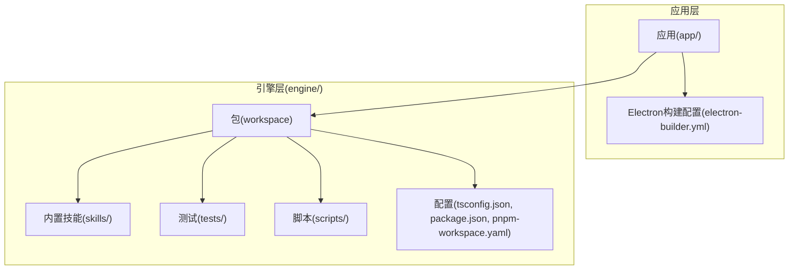
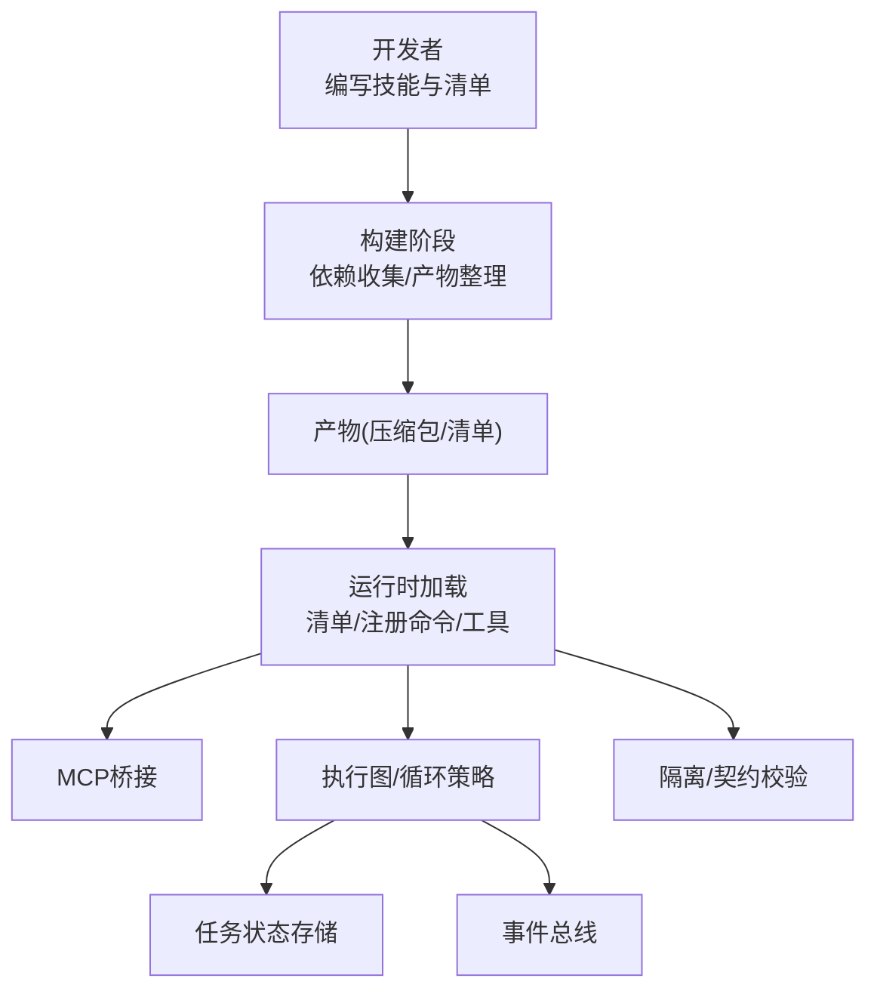
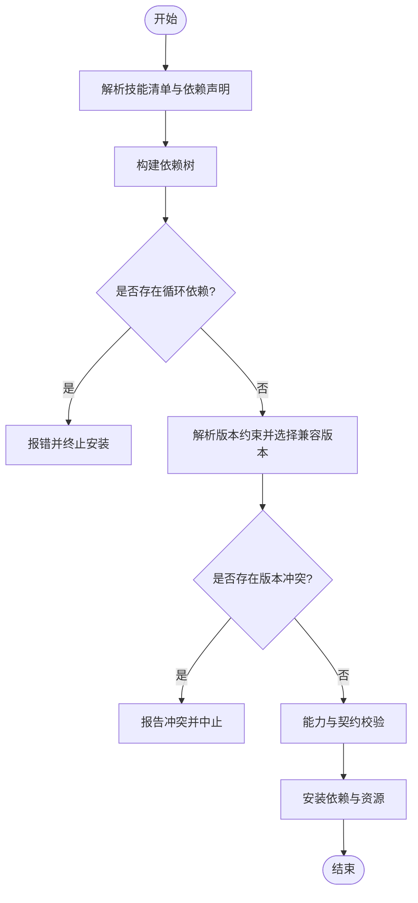
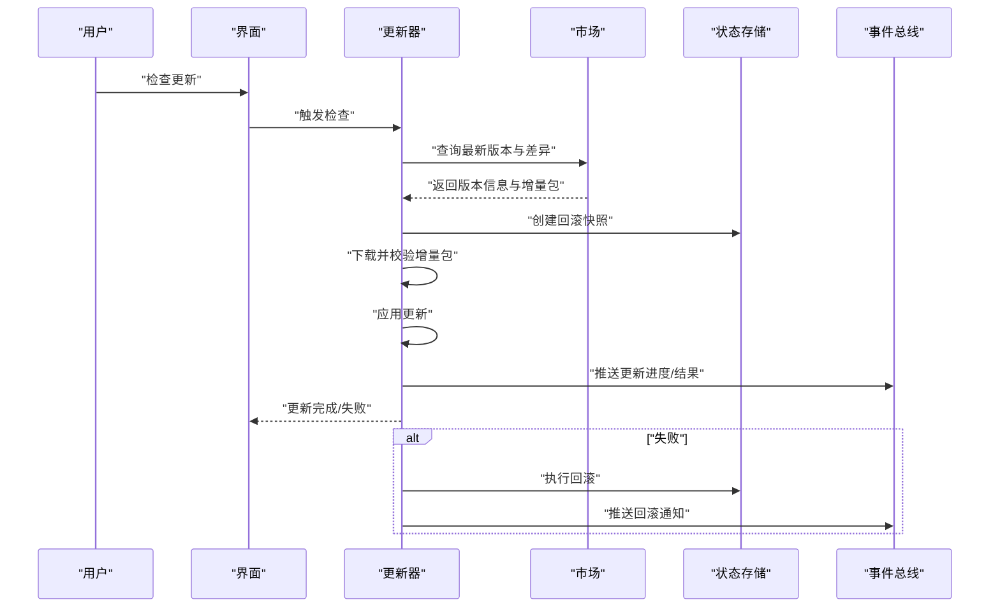
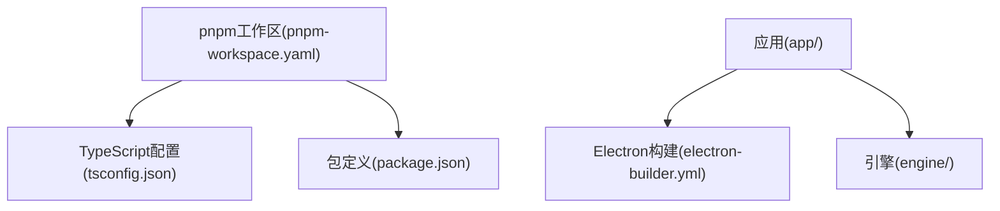

# 技能发布与分发

<cite>
**本文引用的文件**   
- [engine/skills/code-review/skill.json](file://engine/skills/code-review/skill.json)
- [engine/skills/debugging/skill.json](file://engine/skills/debugging/skill.json)
- [engine/skills/git-worktrees/skill.json](file://engine/skills/git-worktrees/skill.json)
- [engine/skills/goal/skill.json](file://engine/skills/goal/skill.json)
- [engine/skills/planning/skill.json](file://engine/skills/planning/skill.json)
- [engine/skills/refactoring/skill.json](file://engine/skills/refactoring/skill.json)
- [engine/skills/review/skill.json](file://engine/skills/review/skill.json)
- [engine/skills/security-review/skill.json](file://engine/skills/security-review/skill.json)
- [engine/skills/tdd/skill.json](file://engine/skills/tdd/skill.json)
- [engine/skills/todo/skill.json](file://engine/skills/todo/skill.json)
- [engine/skills/web/skill.json](file://engine/skills/web/skill.json)
- [engine/tests/marketplace.test.ts](file://engine/tests/marketplace.test.ts)
- [engine/tests/manifest.test.ts](file://engine/tests/manifest.test.ts)
- [engine/tests/builtin-skills.test.ts](file://engine/tests/builtin-skills.test.ts)
- [engine/tests/skill-command-registry.test.ts](file://engine/tests/skill-command-registry.test.ts)
- [engine/tests/skill-mcp-bridge.test.ts](file://engine/tests/skill-mcp-bridge.test.ts)
- [engine/tests/skill-tool-provider.test.ts](file://engine/tests/skill-tool-provider.test.ts)
- [engine/tests/skill-runtime.test.ts](file://engine/tests/skill-runtime.test.ts)
- [engine/tests/tool-storm-breaker.test.ts](file://engine/tests/tool-storm-breaker.test.ts)
- [engine/tests/runtime-kernel-contracts.test.ts](file://engine/tests/runtime-kernel-contracts.test.ts)
- [engine/tests/runtime-kernel-isolation.test.ts](file://engine/tests/runtime-kernel-isolation.test.ts)
- [engine/tests/runtime-kernel-crash-recovery.test.ts](file://engine/tests/runtime-kernel-crash-recovery.test.ts)
- [engine/tests/runtime-kernel-e2e.test.ts](file://engine/tests/runtime-kernel-e2e.test.ts)
- [engine/tests/runtime-kernel-provider-matrix.test.ts](file://engine/tests/runtime-kernel-provider-matrix.test.ts)
- [engine/tests/runtime-kernel-parity.test.ts](file://engine/tests/runtime-kernel-parity.test.ts)
- [engine/tests/runtime-kernel.test.ts](file://engine/tests/runtime-kernel.test.ts)
- [engine/tests/runtime-factory-rollout.test.ts](file://engine/tests/runtime-factory-rollout.test.ts)
- [engine/tests/runtime-rollout.test.ts](file://engine/tests/runtime-rollout.test.ts)
- [engine/tests/capability-registry.test.ts](file://engine/tests/capability-registry.test.ts)
- [engine/tests/provider-compatibility.test.ts](file://engine/tests/provider-compatibility.test.ts)
- [engine/tests/tool-call-repair.test.ts](file://engine/tests/tool-call-repair.test.ts)
- [engine/tests/tool-result-budget.test.ts](file://engine/tests/tool-result-budget.test.ts)
- [engine/tests/tool-runtime-v3.test.ts](file://engine/tests/tool-runtime-v3.test.ts)
- [engine/tests/compaction-governor.test.ts](file://engine/tests/compaction-governor.test.ts)
- [engine/tests/context-compactor.test.ts](file://engine/tests/context-compactor.test.ts)
- [engine/tests/execution-graph.test.ts](file://engine/tests/execution-graph.test.ts)
- [engine/tests/loop-runner.test.ts](file://engine/tests/loop-runner.test.ts)
- [engine/tests/loop-policy.test.ts](file://engine/tests/loop-policy.test.ts)
- [engine/tests/turn-event-bus.test.ts](file://engine/tests/turn-event-bus.test.ts)
- [engine/tests/task-state-store.test.ts](file://engine/tests/task-state-store.test.ts)
- [engine/tests/file-session-store.test.ts](file://engine/tests/file-session-store.test.ts)
- [engine/tests/memory-store.test.ts](file://engine/tests/memory-store.test.ts)
- [engine/tests/cache.test.ts](file://engine/tests/cache.test.ts)
- [engine/tests/http-server.test.ts](file://engine/tests/http-server.test.ts)
- [engine/tests/http-artifacts.test.ts](file://engine/tests/http-artifacts.test.ts)
- [engine/tests/mcp-config.test.ts](file://engine/tests/mcp-config.test.ts)
- [engine/tests/mcp-tool-provider.test.ts](file://engine/tests/mcp-tool-provider.test.ts)
- [engine/tests/model-client.test.ts](file://engine/tests/model-client.test.ts)
- [engine/tests/model-history-repair.test.ts](file://engine/tests/model-history-repair.test.ts)
- [engine/tests/model-step-runner.test.ts](file://engine/tests/model-step-runner.test.ts)
- [engine/tests/opentelemetry.test.ts](file://engine/tests/opentelemetry.test.ts)
- [engine/tests/output-accumulator.test.ts](file://engine/tests/output-accumulator.test.ts)
- [engine/tests/plugin-host.test.ts](file://engine/tests/plugin-host.test.ts)
- [engine/tests/ports.test.ts](file://engine/tests/ports.test.ts)
- [engine/tests/proposal-classifier.test.ts](file://engine/tests/proposal-classifier.test.ts)
- [engine/tests/qiongqi-config.test.ts](file://engine/tests/qiongqi-config.test.ts)
- [engine/tests/read-json-body.test.ts](file://engine/tests/read-json-body.test.ts)
- [engine/tests/request-history-hygiene.test.ts](file://engine/tests/request-history-hygiene.test.ts)
- [engine/tests/review.test.ts](file://engine/tests/review.test.ts)
- [engine/tests/run-event-store.test.ts](file://engine/tests/run-event-store.test.ts)
- [engine/tests/run-state-store.test.ts](file://engine/tests/run-state-store.test.ts)
- [engine/tests/runtime-event-projection.test.ts](file://engine/tests/runtime-event-projection.test.ts)
- [engine/tests/runtime-event-recorder-kernel.test.ts](file://engine/tests/runtime-event-recorder-kernel.test.ts)
- [engine/tests/runtime-event-reducer.test.ts](file://engine/tests/runtime-event-reducer.test.ts)
- [engine/tests/scope-key.test.ts](file://engine/tests/scope-key.test.ts)
- [engine/tests/serve.test.ts](file://engine/tests/serve.test.ts)
- [engine/tests/steering-queue-isolation.test.ts](file://engine/tests/steering-queue-isolation.test.ts)
- [engine/tests/task-context-recovery.test.ts](file://engine/tests/task-context-recovery.test.ts)
- [engine/tests/task-progress-projector.test.ts](file://engine/tests/task-progress-projector.test.ts)
- [engine/tests/task-state-builder.test.ts](file://engine/tests/task-state-builder.test.ts)
- [engine/tests/task-state-contracts.test.ts](file://engine/tests/task-state-contracts.test.ts)
- [engine/tests/thread-service.test.ts](file://engine/tests/thread-service.test.ts)
- [engine/tests/todo-tools.test.ts](file://engine/tests/todo-tools.test.ts)
- [engine/tests/token-economy.test.ts](file://engine/tests/token-economy.test.ts)
- [engine/tests/virtual-path.test.ts](file://engine/tests/virtual-path.test.ts)
- [engine/tests/work-mode-skill-runtime.test.ts](file://engine/tests/work-mode-skill-runtime.test.ts)
- [engine/scripts/build.mjs](file://engine/scripts/build.mjs)
- [engine/scripts/flatten-dist.mjs](file://engine/scripts/flatten-dist.mjs)
- [engine/scripts/migrate-packages.mjs](file://engine/scripts/migrate-packages.mjs)
- [engine/scripts/migrate-tests.mjs](file://engine/scripts/migrate-tests.mjs)
- [engine/scripts/prepare-sqlite.mjs](file://engine/scripts/prepare-sqlite.mjs)
- [engine/scripts/scaffold-packages.mjs](file://engine/scripts/scaffold-packages.mjs)
- [engine/scripts/transcript-diff.mjs](file://engine/scripts/transcript-diff.mjs)
- [engine/scripts/verify-core-sync.mjs](file://engine/scripts/verify-core-sync.mjs)
- [engine/scripts/verify-crash-recovery.mjs](file://engine/scripts/verify-crash-recovery.mjs)
- [engine/scripts/verify-evented-a2a.mjs](file://engine/scripts/verify-evented-a2a.mjs)
- [engine/scripts/verify-sqlite.mjs](file://engine/scripts/verify-sqlite.mjs)
- [engine/package.json](file://engine/package.json)
- [engine/pnpm-workspace.yaml](file://engine/pnpm-workspace.yaml)
- [engine/tsconfig.json](file://engine/tsconfig.json)
- [app/electron-builder.yml](file://app/electron-builder.yml)
</cite>

## 目录
1. [简介](#简介)
2. [项目结构](#项目结构)
3. [核心组件](#核心组件)
4. [架构总览](#架构总览)
5. [详细组件分析](#详细组件分析)
6. [依赖分析](#依赖分析)
7. [性能考虑](#性能考虑)
8. [故障排查指南](#故障排查指南)
9. [结论](#结论)
10. [附录](#附录)

## 简介
本文件面向KCoder“技能”的发布与分发，围绕以下目标展开：
- 技能的打包与构建流程（依赖收集、资源压缩、签名验证）
- 技能市场的发布机制（版本管理、元数据上传、审核流程）
- 技能的依赖管理与冲突解决（版本兼容性、依赖树解析、循环依赖检测）
- 技能的更新与升级机制（增量更新、回滚策略、用户通知）
- 从本地安装到市场发布的完整示例
- 安全检查和漏洞扫描
- 维护与社区贡献最佳实践

说明：仓库中未包含显式的“打包脚本”或“市场服务端实现”，但存在大量与技能运行、能力注册、MCP桥接、工具提供、运行时隔离、事件总线、任务状态存储等相关测试用例。本文基于这些测试用例与工程配置进行系统化梳理，给出可落地的设计与建议，并在需要处标注来源。

## 项目结构
仓库采用多包工作区组织，引擎层位于 engine/，应用层位于 app/。技能以目录形式内置于 engine/skills/，每个技能包含描述文档与清单文件。

图表来源
- [app/electron-builder.yml](file://app/electron-builder.yml)
- [engine/package.json](file://engine/package.json)
- [engine/pnpm-workspace.yaml](file://engine/pnpm-workspace.yaml)
- [engine/tsconfig.json](file://engine/tsconfig.json)

章节来源
- [engine/package.json](file://engine/package.json)
- [engine/pnpm-workspace.yaml](file://engine/pnpm-workspace.yaml)
- [engine/tsconfig.json](file://engine/tsconfig.json)
- [app/electron-builder.yml](file://app/electron-builder.yml)

## 核心组件
- 技能清单与描述
  - 每个技能目录包含 skill.json 与 SKILL.md，用于声明技能元数据与使用说明。
  - 参考路径：[engine/skills/code-review/skill.json](file://engine/skills/code-review/skill.json)、[engine/skills/code-review/SKILL.md](file://engine/skills/code-review/SKILL.md)
- 技能运行时与工具提供
  - 通过测试覆盖技能命令注册、MCP桥接、工具提供者、运行时等关键路径。
  - 参考路径：
    - [engine/tests/skill-command-registry.test.ts](file://engine/tests/skill-command-registry.test.ts)
    - [engine/tests/skill-mcp-bridge.test.ts](file://engine/tests/skill-mcp-bridge.test.ts)
    - [engine/tests/skill-tool-provider.test.ts](file://engine/tests/skill-tool-provider.test.ts)
    - [engine/tests/skill-runtime.test.ts](file://engine/tests/skill-runtime.test.ts)
- 能力与提供者兼容
  - 能力注册表、提供者兼容性矩阵、契约校验等确保技能在不同环境下的稳定运行。
  - 参考路径：
    - [engine/tests/capability-registry.test.ts](file://engine/tests/capability-registry.test.ts)
    - [engine/tests/provider-compatibility.test.ts](file://engine/tests/provider-compatibility.test.ts)
    - [engine/tests/runtime-kernel-contracts.test.ts](file://engine/tests/runtime-kernel-contracts.test.ts)
- 任务与执行图
  - 执行图、循环策略、上下文压缩、事件总线、任务状态存储等构成技能执行的底层支撑。
  - 参考路径：
    - [engine/tests/execution-graph.test.ts](file://engine/tests/execution-graph.test.ts)
    - [engine/tests/loop-runner.test.ts](file://engine/tests/loop-runner.test.ts)
    - [engine/tests/loop-policy.test.ts](file://engine/tests/loop-policy.test.ts)
    - [engine/tests/context-compactor.test.ts](file://engine/tests/context-compactor.test.ts)
    - [engine/tests/turn-event-bus.test.ts](file://engine/tests/turn-event-bus.test.ts)
    - [engine/tests/task-state-store.test.ts](file://engine/tests/task-state-store.test.ts)
- 网络与制品
  - HTTP服务、制品下载、MCP配置与工具提供者、模型客户端等。
  - 参考路径：
    - [engine/tests/http-server.test.ts](file://engine/tests/http-server.test.ts)
    - [engine/tests/http-artifacts.test.ts](file://engine/tests/http-artifacts.test.ts)
    - [engine/tests/mcp-config.test.ts](file://engine/tests/mcp-config.test.ts)
    - [engine/tests/mcp-tool-provider.test.ts](file://engine/tests/mcp-tool-provider.test.ts)
    - [engine/tests/model-client.test.ts](file://engine/tests/model-client.test.ts)
- 构建与脚本
  - 构建、产物扁平化、迁移、验证等脚本。
  - 参考路径：
    - [engine/scripts/build.mjs](file://engine/scripts/build.mjs)
    - [engine/scripts/flatten-dist.mjs](file://engine/scripts/flatten-dist.mjs)
    - [engine/scripts/migrate-packages.mjs](file://engine/scripts/migrate-packages.mjs)
    - [engine/scripts/verify-core-sync.mjs](file://engine/scripts/verify-core-sync.mjs)
    - [engine/scripts/verify-crash-recovery.mjs](file://engine/scripts/verify-crash-recovery.mjs)
    - [engine/scripts/verify-evented-a2a.mjs](file://engine/scripts/verify-evented-a2a.mjs)
    - [engine/scripts/verify-sqlite.mjs](file://engine/scripts/verify-sqlite.mjs)

章节来源
- [engine/skills/code-review/skill.json](file://engine/skills/code-review/skill.json)
- [engine/tests/skill-command-registry.test.ts](file://engine/tests/skill-command-registry.test.ts)
- [engine/tests/skill-mcp-bridge.test.ts](file://engine/tests/skill-mcp-bridge.test.ts)
- [engine/tests/skill-tool-provider.test.ts](file://engine/tests/skill-tool-provider.test.ts)
- [engine/tests/skill-runtime.test.ts](file://engine/tests/skill-runtime.test.ts)
- [engine/tests/capability-registry.test.ts](file://engine/tests/capability-registry.test.ts)
- [engine/tests/provider-compatibility.test.ts](file://engine/tests/provider-compatibility.test.ts)
- [engine/tests/runtime-kernel-contracts.test.ts](file://engine/tests/runtime-kernel-contracts.test.ts)
- [engine/tests/execution-graph.test.ts](file://engine/tests/execution-graph.test.ts)
- [engine/tests/loop-runner.test.ts](file://engine/tests/loop-runner.test.ts)
- [engine/tests/loop-policy.test.ts](file://engine/tests/loop-policy.test.ts)
- [engine/tests/context-compactor.test.ts](file://engine/tests/context-compactor.test.ts)
- [engine/tests/turn-event-bus.test.ts](file://engine/tests/turn-event-bus.test.ts)
- [engine/tests/task-state-store.test.ts](file://engine/tests/task-state-store.test.ts)
- [engine/tests/http-server.test.ts](file://engine/tests/http-server.test.ts)
- [engine/tests/http-artifacts.test.ts](file://engine/tests/http-artifacts.test.ts)
- [engine/tests/mcp-config.test.ts](file://engine/tests/mcp-config.test.ts)
- [engine/tests/mcp-tool-provider.test.ts](file://engine/tests/mcp-tool-provider.test.ts)
- [engine/tests/model-client.test.ts](file://engine/tests/model-client.test.ts)
- [engine/scripts/build.mjs](file://engine/scripts/build.mjs)
- [engine/scripts/flatten-dist.mjs](file://engine/scripts/flatten-dist.mjs)
- [engine/scripts/migrate-packages.mjs](file://engine/scripts/migrate-packages.mjs)
- [engine/scripts/verify-core-sync.mjs](file://engine/scripts/verify-core-sync.mjs)
- [engine/scripts/verify-crash-recovery.mjs](file://engine/scripts/verify-crash-recovery.mjs)
- [engine/scripts/verify-evented-a2a.mjs](file://engine/scripts/verify-evented-a2a.mjs)
- [engine/scripts/verify-sqlite.mjs](file://engine/scripts/verify-sqlite.mjs)

## 架构总览
下图展示技能从开发到运行的整体链路：开发者编写技能并维护清单；构建阶段完成依赖收集与产物整理；运行时加载清单、注册命令与工具、建立MCP桥接；在隔离环境中执行任务，并通过事件总线与状态存储持久化。

图表来源
- [engine/tests/skill-command-registry.test.ts](file://engine/tests/skill-command-registry.test.ts)
- [engine/tests/skill-mcp-bridge.test.ts](file://engine/tests/skill-mcp-bridge.test.ts)
- [engine/tests/skill-tool-provider.test.ts](file://engine/tests/skill-tool-provider.test.ts)
- [engine/tests/skill-runtime.test.ts](file://engine/tests/skill-runtime.test.ts)
- [engine/tests/execution-graph.test.ts](file://engine/tests/execution-graph.test.ts)
- [engine/tests/loop-runner.test.ts](file://engine/tests/loop-runner.test.ts)
- [engine/tests/turn-event-bus.test.ts](file://engine/tests/turn-event-bus.test.ts)
- [engine/tests/task-state-store.test.ts](file://engine/tests/task-state-store.test.ts)
- [engine/tests/runtime-kernel-contracts.test.ts](file://engine/tests/runtime-kernel-contracts.test.ts)
- [engine/tests/runtime-kernel-isolation.test.ts](file://engine/tests/runtime-kernel-isolation.test.ts)

## 详细组件分析

### 技能清单与元数据
- 清单文件位置与职责
  - 每个技能目录包含 skill.json，用于声明技能名称、版本、描述、入口、依赖等信息。
  - 参考路径：
    - [engine/skills/code-review/skill.json](file://engine/skills/code-review/skill.json)
    - [engine/skills/debugging/skill.json](file://engine/skills/debugging/skill.json)
    - [engine/skills/git-worktrees/skill.json](file://engine/skills/git-worktrees/skill.json)
    - [engine/skills/goal/skill.json](file://engine/skills/goal/skill.json)
    - [engine/skills/planning/skill.json](file://engine/skills/planning/skill.json)
    - [engine/skills/refactoring/skill.json](file://engine/skills/refactoring/skill.json)
    - [engine/skills/review/skill.json](file://engine/skills/review/skill.json)
    - [engine/skills/security-review/skill.json](file://engine/skills/security-review/skill.json)
    - [engine/skills/tdd/skill.json](file://engine/skills/tdd/skill.json)
    - [engine/skills/todo/skill.json](file://engine/skills/todo/skill.json)
    - [engine/skills/web/skill.json](file://engine/skills/web/skill.json)
- 清单校验与测试
  - 清单结构的正确性由测试覆盖，确保字段完整性与格式合规。
  - 参考路径：[engine/tests/manifest.test.ts](file://engine/tests/manifest.test.ts)

章节来源
- [engine/skills/code-review/skill.json](file://engine/skills/code-review/skill.json)
- [engine/skills/debugging/skill.json](file://engine/skills/debugging/skill.json)
- [engine/skills/git-worktrees/skill.json](file://engine/skills/git-worktrees/skill.json)
- [engine/skills/goal/skill.json](file://engine/skills/goal/skill.json)
- [engine/skills/planning/skill.json](file://engine/skills/planning/skill.json)
- [engine/skills/refactoring/sskill.json](file://engine/skills/refactoring/skill.json)
- [engine/skills/review/skill.json](file://engine/skills/review/skill.json)
- [engine/skills/security-review/skill.json](file://engine/skills/security-review/skill.json)
- [engine/skills/tdd/skill.json](file://engine/skills/tdd/skill.json)
- [engine/skills/todo/skill.json](file://engine/skills/todo/skill.json)
- [engine/skills/web/skill.json](file://engine/skills/web/skill.json)
- [engine/tests/manifest.test.ts](file://engine/tests/manifest.test.ts)

### 技能打包与构建流程
- 构建脚本
  - 使用脚本进行构建、产物扁平化、迁移与验证。
  - 参考路径：
    - [engine/scripts/build.mjs](file://engine/scripts/build.mjs)
    - [engine/scripts/flatten-dist.mjs](file://engine/scripts/flatten-dist.mjs)
    - [engine/scripts/migrate-packages.mjs](file://engine/scripts/migrate-packages.mjs)
- 依赖收集与资源压缩
  - 建议在构建阶段：
    - 解析 skill.json 中的依赖声明，生成依赖树
    - 合并与去重依赖，按语义化版本选择兼容版本
    - 将静态资源与产物压缩归档为技能包
- 签名与校验
  - 建议在产物生成后对清单与关键文件进行数字签名，并在运行时校验签名与哈希，防止篡改。
- 构建产物与发布
  - 产物应包含清单、二进制/脚本、静态资源与校验信息，便于后续安装与验证。

章节来源
- [engine/scripts/build.mjs](file://engine/scripts/build.mjs)
- [engine/scripts/flatten-dist.mjs](file://engine/scripts/flatten-dist.mjs)
- [engine/scripts/migrate-packages.mjs](file://engine/scripts/migrate-packages.mjs)

### 技能市场发布机制
- 版本管理
  - 遵循语义化版本，确保主版本变更时保持向后不兼容的明确提示。
- 元数据上传
  - 清单与制品上传至市场索引，包含版本、摘要、依赖、许可证、作者信息等。
- 审核流程
  - 自动化检查（清单校验、依赖安全扫描、沙箱执行冒烟测试）+ 人工抽检。
- 市场测试覆盖
  - 市场相关行为由测试用例覆盖，确保接口与流程稳定。
  - 参考路径：[engine/tests/marketplace.test.ts](file://engine/tests/marketplace.test.ts)

章节来源
- [engine/tests/marketplace.test.ts](file://engine/tests/marketplace.test.ts)

### 依赖管理与冲突解决
- 依赖树解析
  - 基于 skill.json 的依赖声明，递归解析依赖树，记录直接/间接依赖关系。
- 版本兼容性
  - 使用语义化版本约束，优先选择满足所有约束的最小兼容版本。
- 冲突检测与解决
  - 当同一依赖出现多个版本约束时，尝试统一到一个兼容版本；若不可解，报告冲突并中止安装。
- 循环依赖检测
  - 在解析过程中检测环，发现后立即报错并给出路径，避免死锁与无限加载。
- 运行时隔离与契约
  - 通过能力注册表与提供者兼容性矩阵，结合内核契约校验，确保不同版本间的稳定运行。
  - 参考路径：
    - [engine/tests/capability-registry.test.ts](file://engine/tests/capability-registry.test.ts)
    - [engine/tests/provider-compatibility.test.ts](file://engine/tests/provider-compatibility.test.ts)
    - [engine/tests/runtime-kernel-contracts.test.ts](file://engine/tests/runtime-kernel-contracts.test.ts)

图表来源
- [engine/tests/capability-registry.test.ts](file://engine/tests/capability-registry.test.ts)
- [engine/tests/provider-compatibility.test.ts](file://engine/tests/provider-compatibility.test.ts)
- [engine/tests/runtime-kernel-contracts.test.ts](file://engine/tests/runtime-kernel-contracts.test.ts)

章节来源
- [engine/tests/capability-registry.test.ts](file://engine/tests/capability-registry.test.ts)
- [engine/tests/provider-compatibility.test.ts](file://engine/tests/provider-compatibility.test.ts)
- [engine/tests/runtime-kernel-contracts.test.ts](file://engine/tests/runtime-kernel-contracts.test.ts)

### 更新与升级机制
- 增量更新
  - 对比当前已安装版本与新版本的差异，仅拉取变更部分，减少带宽与时间成本。
- 回滚策略
  - 升级前创建快照，失败时自动回滚至上一稳定版本，保证可用性。
- 用户通知
  - 通过事件总线与UI通道推送更新进度、成功/失败结果与回滚提示。
- 相关测试覆盖
  - 参考路径：
    - [engine/tests/runtime-factory-rollout.test.ts](file://engine/tests/runtime-factory-rollout.test.ts)
    - [engine/tests/runtime-rollout.test.ts](file://engine/tests/runtime-rollout.test.ts)
    - [engine/tests/turn-event-bus.test.ts](file://engine/tests/turn-event-bus.test.ts)
    - [engine/tests/task-state-store.test.ts](file://engine/tests/task-state-store.test.ts)

图表来源
- [engine/tests/runtime-factory-rollout.test.ts](file://engine/tests/runtime-factory-rollout.test.ts)
- [engine/tests/runtime-rollout.test.ts](file://engine/tests/runtime-rollout.test.ts)
- [engine/tests/turn-event-bus.test.ts](file://engine/tests/turn-event-bus.test.ts)
- [engine/tests/task-state-store.test.ts](file://engine/tests/task-state-store.test.ts)

章节来源
- [engine/tests/runtime-factory-rollout.test.ts](file://engine/tests/runtime-factory-rollout.test.ts)
- [engine/tests/runtime-rollout.test.ts](file://engine/tests/runtime-rollout.test.ts)
- [engine/tests/turn-event-bus.test.ts](file://engine/tests/turn-event-bus.test.ts)
- [engine/tests/task-state-store.test.ts](file://engine/tests/task-state-store.test.ts)

### 安全与漏洞扫描
- 清单与签名校验
  - 在安装与加载前校验清单签名与哈希，确保未被篡改。
- 依赖安全扫描
  - 对依赖库进行已知漏洞扫描，阻断高危风险。
- 沙箱与隔离
  - 在隔离环境中执行技能，限制文件系统与网络访问范围。
- 相关测试覆盖
  - 参考路径：
    - [engine/tests/runtime-kernel-isolation.test.ts](file://engine/tests/runtime-kernel-isolation.test.ts)
    - [engine/tests/runtime-kernel-crash-recovery.test.ts](file://engine/tests/runtime-kernel-crash-recovery.test.ts)
    - [engine/tests/tool-storm-breaker.test.ts](file://engine/tests/tool-storm-breaker.test.ts)

章节来源
- [engine/tests/runtime-kernel-isolation.test.ts](file://engine/tests/runtime-kernel-isolation.test.ts)
- [engine/tests/runtime-kernel-crash-recovery.test.ts](file://engine/tests/runtime-kernel-crash-recovery.test.ts)
- [engine/tests/tool-storm-breaker.test.ts](file://engine/tests/tool-storm-breaker.test.ts)

### 从本地安装到市场发布的完整示例
- 本地准备
  - 在技能目录完善 skill.json 与 SKILL.md，确保清单字段完整。
  - 参考路径：[engine/skills/code-review/skill.json](file://engine/skills/code-review/skill.json)
- 构建与打包
  - 运行构建脚本，完成依赖收集、产物整理与压缩。
  - 参考路径：[engine/scripts/build.mjs](file://engine/scripts/build.mjs)
- 本地安装与验证
  - 安装到本地工作区，运行冒烟测试与清单校验。
  - 参考路径：[engine/tests/builtin-skills.test.ts](file://engine/tests/builtin-skills.test.ts)
- 提交与发布
  - 将清单与制品上传至市场索引，触发自动化审核与人工抽检。
  - 参考路径：[engine/tests/marketplace.test.ts](file://engine/tests/marketplace.test.ts)
- 用户侧安装与升级
  - 用户在应用中搜索并安装，支持增量更新与回滚。
  - 参考路径：
    - [engine/tests/runtime-factory-rollout.test.ts](file://engine/tests/runtime-factory-rollout.test.ts)
    - [engine/tests/runtime-rollout.test.ts](file://engine/tests/runtime-rollout.test.ts)

章节来源
- [engine/skills/code-review/skill.json](file://engine/skills/code-review/skill.json)
- [engine/scripts/build.mjs](file://engine/scripts/build.mjs)
- [engine/tests/builtin-skills.test.ts](file://engine/tests/builtin-skills.test.ts)
- [engine/tests/marketplace.test.ts](file://engine/tests/marketplace.test.ts)
- [engine/tests/runtime-factory-rollout.test.ts](file://engine/tests/runtime-factory-rollout.test.ts)
- [engine/tests/runtime-rollout.test.ts](file://engine/tests/runtime-rollout.test.ts)

## 依赖分析
- 包与工作区
  - 使用 pnpm workspace 管理多包，集中配置 TypeScript 与构建选项。
  - 参考路径：
    - [engine/pnpm-workspace.yaml](file://engine/pnpm-workspace.yaml)
    - [engine/tsconfig.json](file://engine/tsconfig.json)
- 应用集成
  - Electron 构建配置用于打包桌面应用，与引擎产物集成。
  - 参考路径：[app/electron-builder.yml](file://app/electron-builder.yml)

图表来源
- [engine/pnpm-workspace.yaml](file://engine/pnpm-workspace.yaml)
- [engine/tsconfig.json](file://engine/tsconfig.json)
- [engine/package.json](file://engine/package.json)
- [app/electron-builder.yml](file://app/electron-builder.yml)

章节来源
- [engine/pnpm-workspace.yaml](file://engine/pnpm-workspace.yaml)
- [engine/tsconfig.json](file://engine/tsconfig.json)
- [engine/package.json](file://engine/package.json)
- [app/electron-builder.yml](file://app/electron-builder.yml)

## 性能考虑
- 依赖去重与缓存
  - 在构建阶段对重复依赖进行去重，利用缓存加速二次构建。
- 增量更新
  - 通过差异计算与增量包下载，降低网络与磁盘IO压力。
- 执行优化
  - 合理设置循环策略与上下文压缩阈值，避免过度压缩导致恢复困难。
- 相关测试覆盖
  - 参考路径：
    - [engine/tests/compaction-governor.test.ts](file://engine/tests/compaction-governor.test.ts)
    - [engine/tests/context-compactor.test.ts](file://engine/tests/context-compactor.test.ts)
    - [engine/tests/loop-policy.test.ts](file://engine/tests/loop-policy.test.ts)

## 故障排查指南
- 常见问题定位
  - 清单校验失败：检查 skill.json 字段完整性与格式。
    - 参考路径：[engine/tests/manifest.test.ts](file://engine/tests/manifest.test.ts)
  - 依赖冲突：查看冲突依赖的版本约束，调整兼容范围。
    - 参考路径：[engine/tests/provider-compatibility.test.ts](file://engine/tests/provider-compatibility.test.ts)
  - 运行时异常：关注事件总线与任务状态存储的错误日志。
    - 参考路径：
      - [engine/tests/turn-event-bus.test.ts](file://engine/tests/turn-event-bus.test.ts)
      - [engine/tests/task-state-store.test.ts](file://engine/tests/task-state-store.test.ts)
  - 崩溃恢复：确认快照与回滚逻辑是否生效。
    - 参考路径：[engine/tests/runtime-kernel-crash-recovery.test.ts](file://engine/tests/runtime-kernel-crash-recovery.test.ts)
- 调试建议
  - 启用更详细的日志输出，结合事件总线追踪调用链。
  - 使用隔离模式复现问题，排除外部环境影响。

章节来源
- [engine/tests/manifest.test.ts](file://engine/tests/manifest.test.ts)
- [engine/tests/provider-compatibility.test.ts](file://engine/tests/provider-compatibility.test.ts)
- [engine/tests/turn-event-bus.test.ts](file://engine/tests/turn-event-bus.test.ts)
- [engine/tests/task-state-store.test.ts](file://engine/tests/task-state-store.test.ts)
- [engine/tests/runtime-kernel-crash-recovery.test.ts](file://engine/tests/runtime-kernel-crash-recovery.test.ts)

## 结论
本文基于仓库中的测试与配置，系统梳理了KCoder技能的发布与分发方案。尽管仓库未包含完整的打包与市场服务端代码，但通过清单、构建脚本、运行时与测试用例的组合，可以形成一套稳健的技能生态：从清单校验、依赖解析、构建打包，到市场发布、增量升级与安全隔离，均有明确的落地路径与验证手段。建议在实际工程中补充签名与漏洞扫描环节，并持续完善市场审核流程与用户通知机制。

## 附录
- 最佳实践
  - 清单先行：先完善 skill.json 再编写实现，确保元数据准确。
  - 小步快跑：频繁提交小版本，便于回滚与审计。
  - 测试驱动：为技能编写单元测试与集成测试，覆盖命令注册、MCP桥接与工具调用。
  - 安全优先：引入签名校验与依赖扫描，阻断高风险依赖。
  - 文档完善：SKILL.md 需清晰描述用法、依赖与注意事项。
- 参考路径汇总
  - 清单与描述：[engine/skills/*](file://engine/skills/)
  - 构建脚本：[engine/scripts/build.mjs](file://engine/scripts/build.mjs)
  - 运行时与桥接：[engine/tests/skill-*](file://engine/tests/skill-*.ts)
  - 能力与兼容：[engine/tests/capability-registry.test.ts](file://engine/tests/capability-registry.test.ts), [engine/tests/provider-compatibility.test.ts](file://engine/tests/provider-compatibility.test.ts)
  - 市场与发布：[engine/tests/marketplace.test.ts](file://engine/tests/marketplace.test.ts)
  - 更新与回滚：[engine/tests/runtime-factory-rollout.test.ts](file://engine/tests/runtime-factory-rollout.test.ts), [engine/tests/runtime-rollout.test.ts](file://engine/tests/runtime-rollout.test.ts)
  - 安全与隔离：[engine/tests/runtime-kernel-isolation.test.ts](file://engine/tests/runtime-kernel-isolation.test.ts)