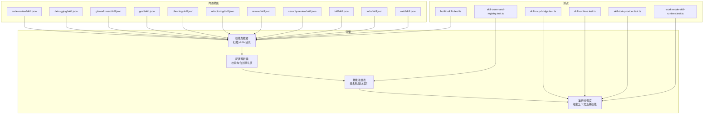
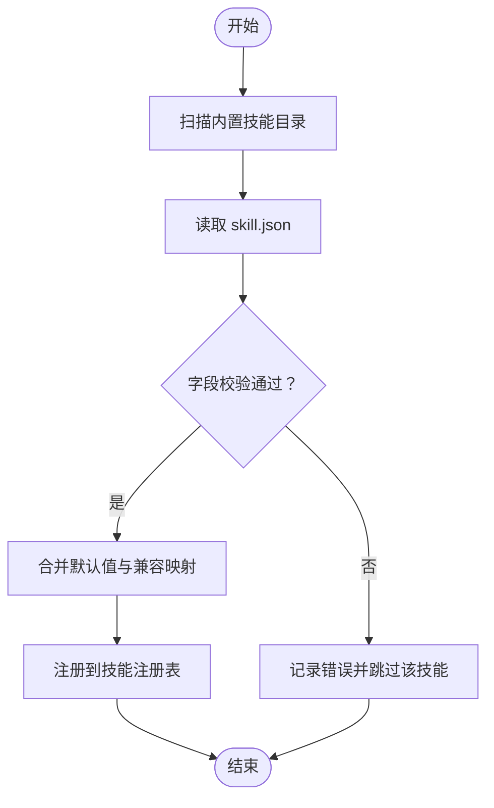
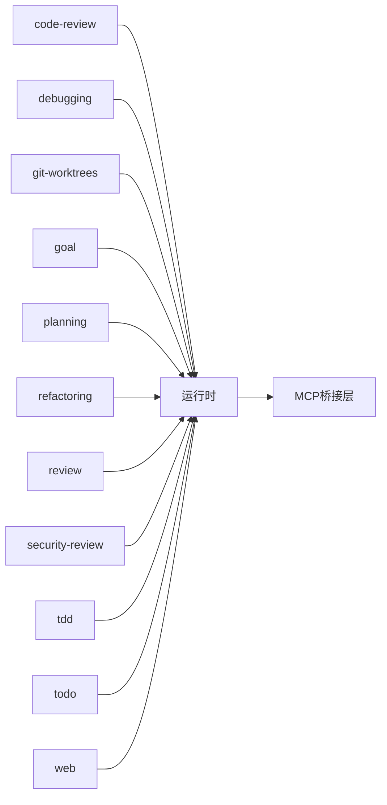

# 技能定义格式

<cite>
**本文引用的文件**   
- [engine/skills/code-review/skill.json](file://engine/skills/code-review/skill.json)
- [engine/skills/code-review/SKILL.md](file://engine/skills/code-review/SKILL.md)
- [engine/skills/debugging/skill.json](file://engine/skills/debugging/skill.json)
- [engine/skills/debugging/SKILL.md](file://engine/skills/debugging/SKILL.md)
- [engine/skills/git-worktrees/skill.json](file://engine/skills/git-worktrees/skill.json)
- [engine/skills/git-worktrees/SKILL.md](file://engine/skills/git-worktrees/SKILL.md)
- [engine/skills/goal/skill.json](file://engine/skills/goal/skill.json)
- [engine/skills/goal/SKILL.md](file://engine/skills/goal/SKILL.md)
- [engine/skills/planning/skill.json](file://engine/skills/planning/skill.json)
- [engine/skills/planning/SKILL.md](file://engine/skills/planning/SKILL.md)
- [engine/skills/refactoring/skill.json](file://engine/skills/refactoring/skill.json)
- [engine/skills/refactoring/SKILL.md](file://engine/skills/refactoring/SKILL.md)
- [engine/skills/review/skill.json](file://engine/skills/review/skill.json)
- [engine/skills/review/SKILL.md](file://engine/skills/review/SKILL.md)
- [engine/skills/security-review/skill.json](file://engine/skills/security-review/skill.json)
- [engine/skills/security-review/SKILL.md](file://engine/skills/security-review/SKILL.md)
- [engine/skills/tdd/skill.json](file://engine/skills/tdd/skill.json)
- [engine/skills/tdd/SKILL.md](file://engine/skills/tdd/SKILL.md)
- [engine/skills/todo/skill.json](file://engine/skills/todo/skill.json)
- [engine/skills/todo/SKILL.md](file://engine/skills/todo/SKILL.md)
- [engine/skills/web/skill.json](file://engine/skills/web/skill.json)
- [engine/skills/web/SKILL.md](file://engine/skills/web/SKILL.md)
- [engine/tests/builtin-skills.test.ts](file://engine/tests/builtin-skills.test.ts)
- [engine/tests/skill-command-registry.test.ts](file://engine/tests/skill-command-registry.test.ts)
- [engine/tests/skill-mcp-bridge.test.ts](file://engine/tests/skill-mcp-bridge.test.ts)
- [engine/tests/skill-runtime.test.ts](file://engine/tests/skill-runtime.test.ts)
- [engine/tests/skill-tool-provider.test.ts](file://engine/tests/skill-tool-provider.test.ts)
- [engine/tests/work-mode-skill-runtime.test.ts](file://engine/tests/work-mode-skill-runtime.test.ts)
</cite>

## 目录
1. [简介](#简介)
2. [项目结构](#项目结构)
3. [核心组件](#核心组件)
4. [架构总览](#架构总览)
5. [详细组件分析](#详细组件分析)
6. [依赖分析](#依赖分析)
7. [性能考虑](#性能考虑)
8. [故障排查指南](#故障排查指南)
9. [结论](#结论)
10. [附录](#附录)

## 简介
本文件面向KCoder引擎的技能开发者与维护者，系统化说明“技能”的定义与使用方式。内容覆盖：
- skill.json配置文件的完整结构与字段语义（元数据、依赖、工具、权限等）
- SKILL.md描述文件的Markdown规范（技能说明、示例、参数与返回值约定）
- 引擎对技能配置的解析流程（字段校验、默认值处理、错误提示）
- 从简单命令到复杂工作流的完整示例路径
- 版本策略与向后兼容性要求
- 最佳实践与常见错误规避

## 项目结构
仓库中内置技能位于 engine/skills 目录下，每个技能以独立子目录组织，包含：
- skill.json：技能的声明式配置
- SKILL.md：人类可读的技能说明文档（可选但建议提供）

```mermaid
graph TB
A["engine/skills"] --> B["code-review/"]
A --> C["debugging/"]
A --> D["git-worktrees/"]
A --> E["goal/"]
A --> F["planning/"]
A --> G["refactoring/"]
A --> H["review/"]
A --> I["security-review/"]
A --> J["tdd/"]
A --> K["todo/"]
A --> L["web/"]
B --> B1["skill.json"]
B --> B2["SKILL.md"]
C --> C1["skill.json"]
C --> C2["SKILL.md"]
D --> D1["skill.json"]
D --> D2["SKILL.md"]
E --> E1["skill.json"]
E --> E2["SKILL.md"]
F --> F1["skill.json"]
F --> F2["SKILL.md"]
G --> G1["skill.json"]
G --> G2["SKILL.md"]
H --> H1["skill.json"]
H --> H2["SKILL.md"]
I --> I1["skill.json"]
I --> I2["SKILL.md"]
J --> J1["skill.json"]
J --> J2["SKILL.md"]
K --> K1["skill.json"]
K --> K2["SKILL.md"]
L --> L1["skill.json"]
L --> L2["SKILL.md"]
```

图表来源
- [engine/skills/code-review/skill.json](file://engine/skills/code-review/skill.json)
- [engine/skills/code-review/SKILL.md](file://engine/skills/code-review/SKILL.md)
- [engine/skills/debugging/skill.json](file://engine/skills/debugging/skill.json)
- [engine/skills/debugging/SKILL.md](file://engine/skills/debugging/SKILL.md)
- [engine/skills/git-worktrees/skill.json](file://engine/skills/git-worktrees/skill.json)
- [engine/skills/git-worktrees/SKILL.md](file://engine/skills/git-worktrees/SKILL.md)
- [engine/skills/goal/skill.json](file://engine/skills/goal/skill.json)
- [engine/skills/goal/SKILL.md](file://engine/skills/goal/SKILL.md)
- [engine/skills/planning/skill.json](file://engine/skills/planning/SKILL.md)
- [engine/skills/planning/SKILL.md](file://engine/skills/planning/SKILL.md)
- [engine/skills/refactoring/skill.json](file://engine/skills/refactoring/SKILL.md)
- [engine/skills/refactoring/SKILL.md](file://engine/skills/refactoring/SKILL.md)
- [engine/skills/review/skill.json](file://engine/skills/review/SKILL.md)
- [engine/skills/review/SKILL.md](file://engine/skills/review/SKILL.md)
- [engine/skills/security-review/skill.json](file://engine/skills/security-review/SKILL.md)
- [engine/skills/security-review/SKILL.md](file://engine/skills/security-review/SKILL.md)
- [engine/skills/tdd/skill.json](file://engine/skills/tdd/SKILL.md)
- [engine/skills/tdd/SKILL.md](file://engine/skills/tdd/SKILL.md)
- [engine/skills/todo/skill.json](file://engine/skills/todo/SKILL.md)
- [engine/skills/todo/SKILL.md](file://engine/skills/todo/SKILL.md)
- [engine/skills/web/skill.json](file://engine/skills/web/SKILL.md)
- [engine/skills/web/SKILL.md](file://engine/skills/web/SKILL.md)

章节来源
- [engine/skills/code-review/skill.json](file://engine/skills/code-review/skill.json)
- [engine/skills/code-review/SKILL.md](file://engine/skills/code-review/SKILL.md)
- [engine/skills/debugging/skill.json](file://engine/skills/debugging/skill.json)
- [engine/skills/debugging/SKILL.md](file://engine/skills/debugging/SKILL.md)
- [engine/skills/git-worktrees/skill.json](file://engine/skills/git-worktrees/skill.json)
- [engine/skills/git-worktrees/SKILL.md](file://engine/skills/git-worktrees/SKILL.md)
- [engine/skills/goal/skill.json](file://engine/skills/goal/skill.json)
- [engine/skills/goal/SKILL.md](file://engine/skills/goal/SKILL.md)
- [engine/skills/planning/skill.json](file://engine/skills/planning/SKILL.md)
- [engine/skills/planning/SKILL.md](file://engine/skills/planning/SKILL.md)
- [engine/skills/refactoring/skill.json](file://engine/skills/refactoring/SKILL.md)
- [engine/skills/refactoring/SKILL.md](file://engine/skills/refactoring/SKILL.md)
- [engine/skills/review/skill.json](file://engine/skills/review/SKILL.md)
- [engine/skills/review/SKILL.md](file://engine/skills/review/SKILL.md)
- [engine/skills/security-review/skill.json](file://engine/skills/security-review/SKILL.md)
- [engine/skills/security-review/SKILL.md](file://engine/skills/security-review/SKILL.md)
- [engine/skills/tdd/skill.json](file://engine/skills/tdd/SKILL.md)
- [engine/skills/tdd/SKILL.md](file://engine/skills/tdd/SKILL.md)
- [engine/skills/todo/skill.json](file://engine/skills/todo/SKILL.md)
- [engine/skills/todo/SKILL.md](file://engine/skills/todo/SKILL.md)
- [engine/skills/web/skill.json](file://engine/skills/web/SKILL.md)
- [engine/skills/web/SKILL.md](file://engine/skills/web/SKILL.md)

## 核心组件
- 技能清单（skill.json）：用于声明技能的元信息、能力边界、依赖关系、可用工具与权限范围。该文件是引擎加载与注册技能的核心契约。
- 技能说明（SKILL.md）：面向用户与开发者的可读文档，描述技能用途、调用方式、参数与返回约定、注意事项与示例。

章节来源
- [engine/skills/code-review/skill.json](file://engine/skills/code-review/skill.json)
- [engine/skills/code-review/SKILL.md](file://engine/skills/code-review/SKILL.md)
- [engine/skills/debugging/skill.json](file://engine/skills/debugging/skill.json)
- [engine/skills/debugging/SKILL.md](file://engine/skills/debugging/SKILL.md)
- [engine/skills/git-worktrees/skill.json](file://engine/skills/git-worktrees/skill.json)
- [engine/skills/git-worktrees/SKILL.md](file://engine/skills/git-worktrees/SKILL.md)
- [engine/skills/goal/skill.json](file://engine/skills/goal/SKILL.md)
- [engine/skills/goal/SKILL.md](file://engine/skills/goal/SKILL.md)
- [engine/skills/planning/skill.json](file://engine/skills/planning/SKILL.md)
- [engine/skills/planning/SKILL.md](file://engine/skills/planning/SKILL.md)
- [engine/skills/refactoring/skill.json](file://engine/skills/refactoring/SKILL.md)
- [engine/skills/refactoring/SKILL.md](file://engine/skills/refactoring/SKILL.md)
- [engine/skills/review/skill.json](file://engine/skills/review/SKILL.md)
- [engine/skills/review/SKILL.md](file://engine/skills/review/SKILL.md)
- [engine/skills/security-review/skill.json](file://engine/skills/security-review/SKILL.md)
- [engine/skills/security-review/SKILL.md](file://engine/skills/security-review/SKILL.md)
- [engine/skills/tdd/skill.json](file://engine/skills/tdd/SKILL.md)
- [engine/skills/tdd/SKILL.md](file://engine/skills/tdd/SKILL.md)
- [engine/skills/todo/skill.json](file://engine/skills/todo/SKILL.md)
- [engine/skills/todo/SKILL.md](file://engine/skills/todo/SKILL.md)
- [engine/skills/web/skill.json](file://engine/skills/web/SKILL.md)
- [engine/skills/web/SKILL.md](file://engine/skills/web/SKILL.md)

## 架构总览
下图展示了引擎如何发现、解析并注册内置技能，以及测试套件如何验证这些行为。

图表来源
- [engine/tests/builtin-skills.test.ts](file://engine/tests/builtin-skills.test.ts)
- [engine/tests/skill-command-registry.test.ts](file://engine/tests/skill-command-registry.test.ts)
- [engine/tests/skill-mcp-bridge.test.ts](file://engine/tests/skill-mcp-bridge.test.ts)
- [engine/tests/skill-runtime.test.ts](file://engine/tests/skill-runtime.test.ts)
- [engine/tests/skill-tool-provider.test.ts](file://engine/tests/skill-tool-provider.test.ts)
- [engine/tests/work-mode-skill-runtime.test.ts](file://engine/tests/work-mode-skill-runtime.test.ts)
- [engine/skills/code-review/skill.json](file://engine/skills/code-review/skill.json)
- [engine/skills/debugging/skill.json](file://engine/skills/debugging/skill.json)
- [engine/skills/git-worktrees/skill.json](file://engine/skills/git-worktrees/skill.json)
- [engine/skills/goal/skill.json](file://engine/skills/goal/SKILL.md)
- [engine/skills/planning/skill.json](file://engine/skills/planning/SKILL.md)
- [engine/skills/refactoring/skill.json](file://engine/skills/refactoring/SKILL.md)
- [engine/skills/review/skill.json](file://engine/skills/review/SKILL.md)
- [engine/skills/security-review/skill.json](file://engine/skills/security-review/SKILL.md)
- [engine/skills/tdd/skill.json](file://engine/skills/tdd/SKILL.md)
- [engine/skills/todo/skill.json](file://engine/skills/todo/SKILL.md)
- [engine/skills/web/skill.json](file://engine/skills/web/SKILL.md)

## 详细组件分析

### skill.json 字段规范
以下字段为当前内置技能普遍采用的结构要点（具体字段以各技能实际文件为准）：
- 元数据
  - 名称：唯一标识，便于注册与检索
  - 版本：遵循语义化版本控制（见后文“版本策略”）
  - 描述：简要说明技能用途
  - 作者/维护者：归属信息
  - 许可证：可选
- 能力与边界
  - 适用场景/模式：如代码审查、调试、计划、重构、安全审查、TDD、待办、Web相关等
  - 前置条件：是否需要特定环境或外部服务
- 依赖声明
  - 内部依赖：其他技能或模块的引用
  - 外部依赖：MCP工具或其他可插拔能力的依赖
- 工具列表
  - 暴露给上层调用的工具集合（名称、参数、返回值约定）
- 权限配置
  - 读写文件、执行命令、访问网络等权限的最小化声明
- 扩展点
  - 自定义钩子、事件、回调等（如有）

注意：不同技能的具体字段可能略有差异，请以对应目录下的 skill.json 为准。

章节来源
- [engine/skills/code-review/skill.json](file://engine/skills/code-review/skill.json)
- [engine/skills/debugging/skill.json](file://engine/skills/debugging/skill.json)
- [engine/skills/git-worktrees/skill.json](file://engine/skills/git-worktrees/skill.json)
- [engine/skills/goal/skill.json](file://engine/skills/goal/SKILL.md)
- [engine/skills/planning/skill.json](file://engine/skills/planning/SKILL.md)
- [engine/skills/refactoring/skill.json](file://engine/skills/refactoring/SKILL.md)
- [engine/skills/review/skill.json](file://engine/skills/review/SKILL.md)
- [engine/skills/security-review/skill.json](file://engine/skills/security-review/SKILL.md)
- [engine/skills/tdd/skill.json](file://engine/skills/tdd/SKILL.md)
- [engine/skills/todo/skill.json](file://engine/skills/todo/SKILL.md)
- [engine/skills/web/skill.json](file://engine/skills/web/SKILL.md)

### SKILL.md Markdown 规范
SKILL.md 用于向使用者清晰表达技能的使用方式与约束，建议包含：
- 标题与摘要：一句话说明技能目标
- 适用场景：何时使用该技能
- 快速开始：最小可用的调用示例
- 参数定义：逐项说明必填/选填、类型、取值范围、默认值
- 返回值说明：成功/失败的结构、错误码、重试建议
- 注意事项：权限、资源限制、并发与超时
- 示例：从简单命令到复杂工作流的多步示例
- 常见问题：FAQ与排错指引

章节来源
- [engine/skills/code-review/SKILL.md](file://engine/skills/code-review/SKILL.md)
- [engine/skills/debugging/SKILL.md](file://engine/skills/debugging/SKILL.md)
- [engine/skills/git-worktrees/SKILL.md](file://engine/skills/git-worktrees/SKILL.md)
- [engine/skills/goal/SKILL.md](file://engine/skills/goal/SKILL.md)
- [engine/skills/planning/SKILL.md](file://engine/skills/planning/SKILL.md)
- [engine/skills/refactoring/SKILL.md](file://engine/skills/refactoring/SKILL.md)
- [engine/skills/review/SKILL.md](file://engine/skills/review/SKILL.md)
- [engine/skills/security-review/SKILL.md](file://engine/skills/security-review/SKILL.md)
- [engine/skills/tdd/SKILL.md](file://engine/skills/tdd/SKILL.md)
- [engine/skills/todo/SKILL.md](file://engine/skills/todo/SKILL.md)
- [engine/skills/web/SKILL.md](file://engine/skills/web/SKILL.md)

### 引擎解析机制（字段校验、默认值、错误提示）
整体流程如下：
- 发现：扫描 engine/skills 下所有子目录
- 读取：加载每个技能的 skill.json
- 校验：检查必需字段、类型、枚举值、依赖存在性、权限合法性
- 合并：应用默认值与兼容层映射
- 注册：将技能加入注册表，供运行时调度
- 错误：对缺失字段、非法值、依赖不满足等情况给出明确错误提示

图表来源
- [engine/tests/builtin-skills.test.ts](file://engine/tests/builtin-skills.test.ts)
- [engine/tests/skill-command-registry.test.ts](file://engine/tests/skill-command-registry.test.ts)
- [engine/tests/skill-mcp-bridge.test.ts](file://engine/tests/skill-mcp-bridge.test.ts)
- [engine/tests/skill-runtime.test.ts](file://engine/tests/skill-runtime.test.ts)
- [engine/tests/skill-tool-provider.test.ts](file://engine/tests/skill-tool-provider.test.ts)
- [engine/tests/work-mode-skill-runtime.test.ts](file://engine/tests/work-mode-skill-runtime.test.ts)

章节来源
- [engine/tests/builtin-skills.test.ts](file://engine/tests/builtin-skills.test.ts)
- [engine/tests/skill-command-registry.test.ts](file://engine/tests/skill-command-registry.test.ts)
- [engine/tests/skill-mcp-bridge.test.ts](file://engine/tests/skill-mcp-bridge.test.ts)
- [engine/tests/skill-runtime.test.ts](file://engine/tests/skill-runtime.test.ts)
- [engine/tests/skill-tool-provider.test.ts](file://engine/tests/skill-tool-provider.test.ts)
- [engine/tests/work-mode-skill-runtime.test.ts](file://engine/tests/work-mode-skill-runtime.test.ts)

### 版本策略与向后兼容性
- 语义化版本控制（主.次.补丁）
  - 主版本：破坏性变更（不兼容旧版）
  - 次版本：新增功能（保持兼容）
  - 补丁版本：缺陷修复（保持兼容）
- 兼容性要求
  - 在次版本与补丁版本中，不得移除已公开字段或改变其语义
  - 新增字段应提供默认值或兼容映射
  - 删除字段需通过废弃期与迁移指引过渡
- 升级建议
  - 优先采用小步增量发布
  - 在 SKILL.md 中记录变更日志与迁移步骤

章节来源
- [engine/skills/code-review/skill.json](file://engine/skills/code-review/skill.json)
- [engine/skills/debugging/skill.json](file://engine/skills/debugging/skill.json)
- [engine/skills/git-worktrees/skill.json](file://engine/skills/git-worktrees/skill.json)
- [engine/skills/goal/skill.json](file://engine/skills/goal/SKILL.md)
- [engine/skills/planning/skill.json](file://engine/skills/planning/SKILL.md)
- [engine/skills/refactoring/skill.json](file://engine/skills/refactoring/SKILL.md)
- [engine/skills/review/skill.json](file://engine/skills/review/SKILL.md)
- [engine/skills/security-review/skill.json](file://engine/skills/security-review/SKILL.md)
- [engine/skills/tdd/skill.json](file://engine/skills/tdd/SKILL.md)
- [engine/skills/todo/skill.json](file://engine/skills/todo/SKILL.md)
- [engine/skills/web/skill.json](file://engine/skills/web/SKILL.md)

### 完整示例参考（从简单到复杂）
以下为仓库内可直接参考的示例路径，涵盖不同复杂度与领域：
- 简单命令型
  - [engine/skills/todo/skill.json](file://engine/skills/todo/skill.json)
  - [engine/skills/todo/SKILL.md](file://engine/skills/todo/SKILL.md)
- 代码质量与安全
  - [engine/skills/code-review/skill.json](file://engine/skills/code-review/skill.json)
  - [engine/skills/code-review/SKILL.md](file://engine/skills/code-review/SKILL.md)
  - [engine/skills/review/skill.json](file://engine/skills/review/SKILL.md)
  - [engine/skills/review/SKILL.md](file://engine/skills/review/SKILL.md)
  - [engine/skills/security-review/skill.json](file://engine/skills/security-review/SKILL.md)
  - [engine/skills/security-review/SKILL.md](file://engine/skills/security-review/SKILL.md)
- 工程实践与工作流
  - [engine/skills/debugging/skill.json](file://engine/skills/debugging/skill.json)
  - [engine/skills/debugging/SKILL.md](file://engine/skills/debugging/SKILL.md)
  - [engine/skills/planning/skill.json](file://engine/skills/planning/SKILL.md)
  - [engine/skills/planning/SKILL.md](file://engine/skills/planning/SKILL.md)
  - [engine/skills/refactoring/skill.json](file://engine/skills/refactoring/SKILL.md)
  - [engine/skills/refactoring/SKILL.md](file://engine/skills/refactoring/SKILL.md)
  - [engine/skills/tdd/skill.json](file://engine/skills/tdd/SKILL.md)
  - [engine/skills/tdd/SKILL.md](file://engine/skills/tdd/SKILL.md)
- 版本管理与协作
  - [engine/skills/git-worktrees/skill.json](file://engine/skills/git-worktrees/skill.json)
  - [engine/skills/git-worktrees/SKILL.md](file://engine/skills/git-worktrees/SKILL.md)
- 目标驱动与Web集成
  - [engine/skills/goal/skill.json](file://engine/skills/goal/SKILL.md)
  - [engine/skills/goal/SKILL.md](file://engine/skills/goal/SKILL.md)
  - [engine/skills/web/skill.json](file://engine/skills/web/SKILL.md)
  - [engine/skills/web/SKILL.md](file://engine/skills/web/SKILL.md)

章节来源
- [engine/skills/todo/skill.json](file://engine/skills/todo/SKILL.md)
- [engine/skills/todo/SKILL.md](file://engine/skills/todo/SKILL.md)
- [engine/skills/code-review/skill.json](file://engine/skills/code-review/SKILL.md)
- [engine/skills/code-review/SKILL.md](file://engine/skills/code-review/SKILL.md)
- [engine/skills/review/skill.json](file://engine/skills/review/SKILL.md)
- [engine/skills/review/SKILL.md](file://engine/skills/review/SKILL.md)
- [engine/skills/security-review/skill.json](file://engine/skills/security-review/SKILL.md)
- [engine/skills/security-review/SKILL.md](file://engine/skills/security-review/SKILL.md)
- [engine/skills/debugging/skill.json](file://engine/skills/debugging/SKILL.md)
- [engine/skills/debugging/SKILL.md](file://engine/skills/debugging/SKILL.md)
- [engine/skills/planning/skill.json](file://engine/skills/planning/SKILL.md)
- [engine/skills/planning/SKILL.md](file://engine/skills/planning/SKILL.md)
- [engine/skills/refactoring/skill.json](file://engine/skills/refactoring/SKILL.md)
- [engine/skills/refactoring/SKILL.md](file://engine/skills/refactoring/SKILL.md)
- [engine/skills/tdd/skill.json](file://engine/skills/tdd/SKILL.md)
- [engine/skills/tdd/SKILL.md](file://engine/skills/tdd/SKILL.md)
- [engine/skills/git-worktrees/skill.json](file://engine/skills/git-worktrees/SKILL.md)
- [engine/skills/git-worktrees/SKILL.md](file://engine/skills/git-worktrees/SKILL.md)
- [engine/skills/goal/skill.json](file://engine/skills/goal/SKILL.md)
- [engine/skills/goal/SKILL.md](file://engine/skills/goal/SKILL.md)
- [engine/skills/web/skill.json](file://engine/skills/web/SKILL.md)
- [engine/skills/web/SKILL.md](file://engine/skills/web/SKILL.md)

## 依赖分析
- 内置技能之间通常相互独立，通过注册表进行解耦
- 部分技能可能依赖外部工具（如MCP），由运行时桥接层负责适配
- 测试覆盖了技能发现、注册、运行与工具提供等关键路径

图表来源
- [engine/skills/code-review/skill.json](file://engine/skills/code-review/skill.json)
- [engine/skills/debugging/skill.json](file://engine/skills/debugging/skill.json)
- [engine/skills/git-worktrees/skill.json](file://engine/skills/git-worktrees/skill.json)
- [engine/skills/goal/skill.json](file://engine/skills/goal/SKILL.md)
- [engine/skills/planning/skill.json](file://engine/skills/planning/SKILL.md)
- [engine/skills/refactoring/skill.json](file://engine/skills/refactoring/SKILL.md)
- [engine/skills/review/skill.json](file://engine/skills/review/SKILL.md)
- [engine/skills/security-review/skill.json](file://engine/skills/security-review/SKILL.md)
- [engine/skills/tdd/skill.json](file://engine/skills/tdd/SKILL.md)
- [engine/skills/todo/skill.json](file://engine/skills/todo/SKILL.md)
- [engine/skills/web/skill.json](file://engine/skills/web/SKILL.md)
- [engine/tests/skill-mcp-bridge.test.ts](file://engine/tests/skill-mcp-bridge.test.ts)

章节来源
- [engine/tests/skill-mcp-bridge.test.ts](file://engine/tests/skill-mcp-bridge.test.ts)
- [engine/tests/skill-tool-provider.test.ts](file://engine/tests/skill-tool-provider.test.ts)

## 性能考虑
- 按需加载：仅在需要时解析与注册相关技能，避免全量扫描带来的开销
- 缓存注册表：对已解析的技能结果进行缓存，减少重复IO与校验
- 最小权限：仅声明必要的工具与权限，降低运行时安全检查成本
- 批量操作：对多技能初始化采用并行策略，缩短冷启动时间

[本节为通用指导，无需源码引用]

## 故障排查指南
- 无法发现技能
  - 确认目录结构符合约定（每个技能一个子目录，包含 skill.json）
  - 检查文件名大小写与编码
- 解析失败
  - 核对必需字段是否齐全、类型是否正确
  - 查看错误日志中的字段名与位置
- 依赖不满足
  - 确认外部工具（如MCP）已正确安装并可被桥接层发现
- 权限不足
  - 调整权限声明，确保最小必要原则
- 版本不兼容
  - 对照 SKILL.md 的变更日志进行迁移；必要时回退至兼容版本

章节来源
- [engine/tests/builtin-skills.test.ts](file://engine/tests/builtin-skills.test.ts)
- [engine/tests/skill-command-registry.test.ts](file://engine/tests/skill-command-registry.test.ts)
- [engine/tests/skill-mcp-bridge.test.ts](file://engine/tests/skill-mcp-bridge.test.ts)
- [engine/tests/skill-runtime.test.ts](file://engine/tests/skill-runtime.test.ts)
- [engine/tests/skill-tool-provider.test.ts](file://engine/tests/skill-tool-provider.test.ts)
- [engine/tests/work-mode-skill-runtime.test.ts](file://engine/tests/work-mode-skill-runtime.test.ts)

## 结论
通过统一的 skill.json 与 SKILL.md 约定，KCoder实现了可发现、可校验、可扩展的技能体系。遵循本文的字段规范、版本策略与最佳实践，可以高效构建从简单命令到复杂工作流的各类技能，并确保与引擎的良好兼容性与可维护性。

[本节为总结性内容，无需源码引用]

## 附录
- 最佳实践
  - 在 SKILL.md 中提供清晰的参数与返回值约定
  - 使用语义化版本管理，并在变更时提供迁移指引
  - 最小权限原则，避免过度授权
  - 为复杂工作流提供分步示例与回滚策略
- 常见错误避免
  - 遗漏必需字段或类型错误
  - 未声明外部依赖导致运行时失败
  - 破坏性变更未做兼容处理
  - 文档与实现不一致

[本节为通用指导，无需源码引用]