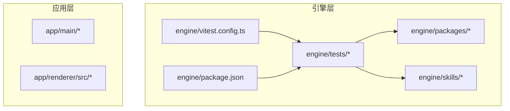
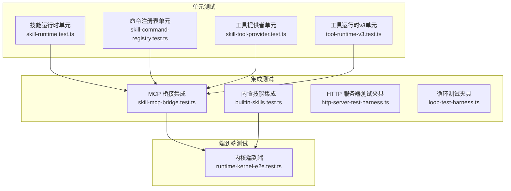
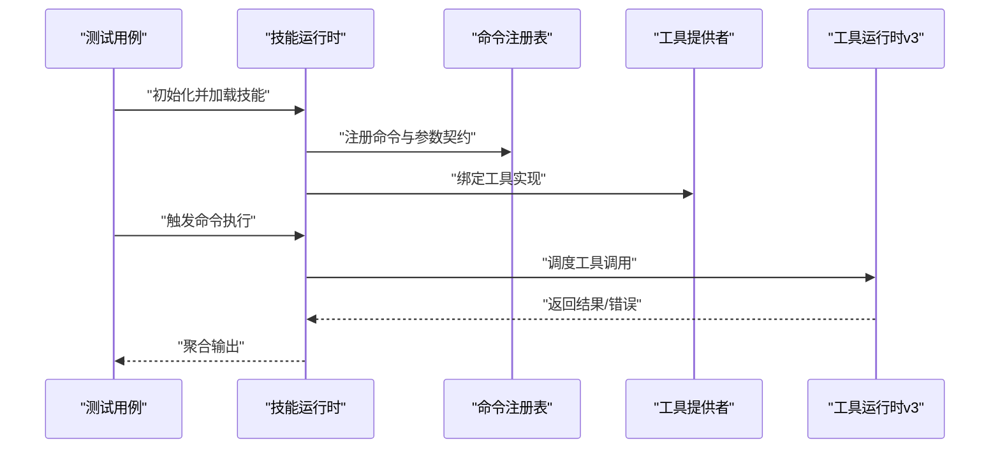
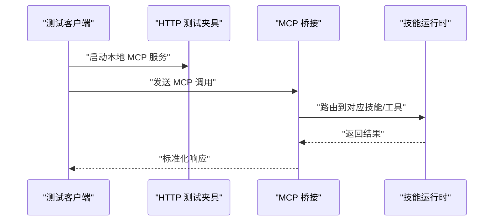
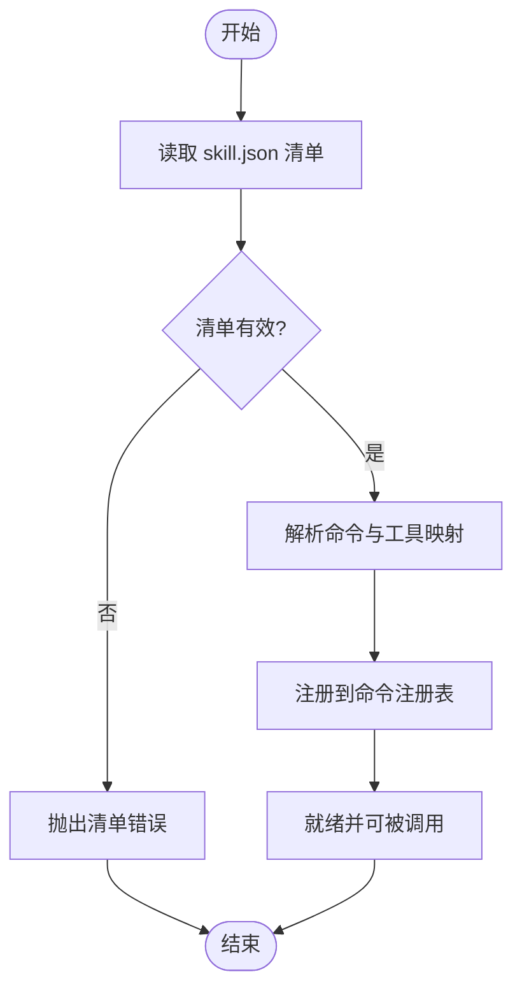
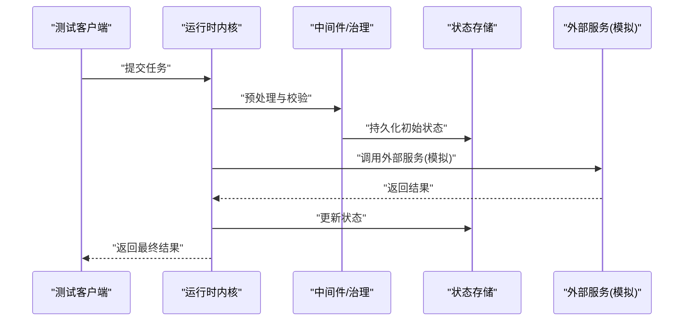
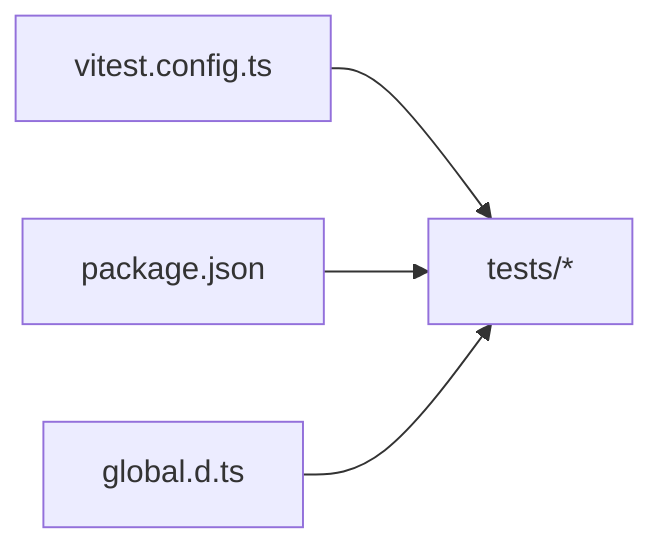

# 技能测试策略

<cite>
**本文引用的文件**   
- [engine/vitest.config.ts](file://engine/vitest.config.ts)
- [engine/tests/skill-runtime.test.ts](file://engine/tests/skill-runtime.test.ts)
- [engine/tests/builtin-skills.test.ts](file://engine/tests/builtin-skills.test.ts)
- [engine/tests/skill-command-registry.test.ts](file://engine/tests/skill-command-registry.test.ts)
- [engine/tests/skill-mcp-bridge.test.ts](file://engine/tests/skill-mcp-bridge.test.ts)
- [engine/tests/skill-tool-provider.test.ts](file://engine/tests/skill-tool-provider.test.ts)
- [engine/tests/tool-runtime-v3.test.ts](file://engine/tests/tool-runtime-v3.test.ts)
- [engine/tests/runtime-kernel-e2e.test.ts](file://engine/tests/runtime-kernel-e2e.test.ts)
- [engine/tests/http-server-test-harness.ts](file://engine/tests/http-server-test-harness.ts)
- [engine/tests/loop-test-harness.ts](file://engine/tests/loop-test-harness.ts)
- [engine/tests/global.d.ts](file://engine/tests/global.d.ts)
- [engine/package.json](file://engine/package.json)
- [engine/skills/tdd/SKILL.md](file://engine/skills/tdd/SKILL.md)
- [engine/skills/tdd/skill.json](file://engine/skills/tdd/skill.json)
</cite>

## 目录
1. [简介](#简介)
2. [项目结构](#项目结构)
3. [核心组件](#核心组件)
4. [架构总览](#架构总览)
5. [详细组件分析](#详细组件分析)
6. [依赖分析](#依赖分析)
7. [性能考虑](#性能考虑)
8. [故障排查指南](#故障排查指南)
9. [结论](#结论)
10. [附录](#附录)

## 简介
本文件为“KCoder 技能测试策略”的开发文档，面向工程师与测试人员，系统化阐述技能（Skill）在单元测试、集成测试、端到端测试三个层次的测试框架与实践。内容涵盖：
- 测试分层与适用场景
- 测试环境搭建（模拟服务、测试数据、依赖注入）
- 技能执行上下文模拟（文件系统、网络请求、外部 API Mock）
- 异步测试方法（Promise、事件监听、超时控制）
- 完整用例示例（正常流程、异常、边界条件）
- 性能与压力测试实施建议
- 覆盖率要求与持续集成配置要点

## 项目结构
仓库采用多包工作区组织，引擎层位于 engine 目录，包含 skills、packages、tests 等子目录；前端渲染层位于 app/renderer，主进程位于 app/main。测试相关主要集中于 engine/tests，使用 Vitest 作为统一测试运行器，并通过配置文件集中管理测试行为。

图表来源
- [engine/vitest.config.ts](file://engine/vitest.config.ts)
- [engine/package.json](file://engine/package.json)

章节来源
- [engine/vitest.config.ts](file://engine/vitest.config.ts)
- [engine/package.json](file://engine/package.json)

## 核心组件
围绕“技能”的测试涉及以下关键组件与能力：
- 技能运行时（Skill Runtime）：负责加载、解析、执行技能定义与生命周期管理
- 命令注册表（Command Registry）：维护技能暴露的命令与参数契约
- MCP 桥接（MCP Bridge）：将技能能力桥接到 MCP 协议，供外部调用
- 工具提供者（Tool Provider）：封装具体工具实现，供运行时调度
- 工具运行时 v3（Tool Runtime v3）：统一的工具执行与结果聚合机制
- 端到端内核（Runtime Kernel E2E）：从入口到内核的全链路验证

章节来源
- [engine/tests/skill-runtime.test.ts](file://engine/tests/skill-runtime.test.ts)
- [engine/tests/skill-command-registry.test.ts](file://engine/tests/skill-command-registry.test.ts)
- [engine/tests/skill-mcp-bridge.test.ts](file://engine/tests/skill-mcp-bridge.test.ts)
- [engine/tests/skill-tool-provider.test.ts](file://engine/tests/skill-tool-provider.test.ts)
- [engine/tests/tool-runtime-v3.test.ts](file://engine/tests/tool-runtime-v3.test.ts)
- [engine/tests/runtime-kernel-e2e.test.ts](file://engine/tests/runtime-kernel-e2e.test.ts)

## 架构总览
下图展示技能测试在三层中的职责划分与交互关系：单元测试聚焦单个模块与函数；集成测试覆盖模块间协作与外部依赖隔离；端到端测试验证真实路径与系统级行为。

图表来源
- [engine/tests/skill-runtime.test.ts](file://engine/tests/skill-runtime.test.ts)
- [engine/tests/skill-command-registry.test.ts](file://engine/tests/skill-command-registry.test.ts)
- [engine/tests/skill-tool-provider.test.ts](file://engine/tests/skill-tool-provider.test.ts)
- [engine/tests/tool-runtime-v3.test.ts](file://engine/tests/tool-runtime-v3.test.ts)
- [engine/tests/skill-mcp-bridge.test.ts](file://engine/tests/skill-mcp-bridge.test.ts)
- [engine/tests/builtin-skills.test.ts](file://engine/tests/builtin-skills.test.ts)
- [engine/tests/http-server-test-harness.ts](file://engine/tests/http-server-test-harness.ts)
- [engine/tests/loop-test-harness.ts](file://engine/tests/loop-test-harness.ts)
- [engine/tests/runtime-kernel-e2e.test.ts](file://engine/tests/runtime-kernel-e2e.test.ts)

## 详细组件分析

### 技能运行时（Skill Runtime）
- 职责：加载技能清单、解析元数据、初始化执行上下文、协调命令与工具
- 测试重点：
  - 正常流程：加载成功、命令可发现、工具可调用
  - 异常情况：缺失依赖、无效清单、权限不足
  - 边界条件：空清单、重复命令、超长参数
- 异步处理：
  - Promise 链路与错误传播
  - 事件监听与回调顺序
  - 超时与重试策略

图表来源
- [engine/tests/skill-runtime.test.ts](file://engine/tests/skill-runtime.test.ts)
- [engine/tests/skill-command-registry.test.ts](file://engine/tests/skill-command-registry.test.ts)
- [engine/tests/skill-tool-provider.test.ts](file://engine/tests/skill-tool-provider.test.ts)
- [engine/tests/tool-runtime-v3.test.ts](file://engine/tests/tool-runtime-v3.test.ts)

章节来源
- [engine/tests/skill-runtime.test.ts](file://engine/tests/skill-runtime.test.ts)
- [engine/tests/skill-command-registry.test.ts](file://engine/tests/skill-command-registry.test.ts)
- [engine/tests/skill-tool-provider.test.ts](file://engine/tests/skill-tool-provider.test.ts)
- [engine/tests/tool-runtime-v3.test.ts](file://engine/tests/tool-runtime-v3.test.ts)

### MCP 桥接（MCP Bridge）
- 职责：将内部技能能力映射为 MCP 协议接口，提供跨进程/跨语言调用
- 测试重点：
  - 协议序列化/反序列化正确性
  - 错误码与消息体一致性
  - 并发调用与资源隔离
- 集成方式：
  - 使用 HTTP 服务器测试夹具启动本地服务端
  - 通过客户端发起 MCP 请求并断言响应

图表来源
- [engine/tests/skill-mcp-bridge.test.ts](file://engine/tests/skill-mcp-bridge.test.ts)
- [engine/tests/http-server-test-harness.ts](file://engine/tests/http-server-test-harness.ts)

章节来源
- [engine/tests/skill-mcp-bridge.test.ts](file://engine/tests/skill-mcp-bridge.test.ts)
- [engine/tests/http-server-test-harness.ts](file://engine/tests/http-server-test-harness.ts)

### 内置技能（Built-in Skills）
- 职责：提供开箱即用的通用能力（如代码审查、调试、规划等）
- 测试重点：
  - 清单与 SKILL.md 描述一致性
  - 默认参数与约束校验
  - 与其他技能的组合调用
- 数据来源：
  - skill.json 清单
  - SKILL.md 说明文档

图表来源
- [engine/tests/builtin-skills.test.ts](file://engine/tests/builtin-skills.test.ts)
- [engine/skills/tdd/skill.json](file://engine/skills/tdd/skill.json)
- [engine/skills/tdd/SKILL.md](file://engine/skills/tdd/SKILL.md)

章节来源
- [engine/tests/builtin-skills.test.ts](file://engine/tests/builtin-skills.test.ts)
- [engine/skills/tdd/skill.json](file://engine/skills/tdd/skill.json)
- [engine/skills/tdd/SKILL.md](file://engine/skills/tdd/SKILL.md)

### 端到端内核（Runtime Kernel E2E）
- 职责：验证从入口到内核的完整路径，包括中间件、治理策略、状态持久化
- 测试重点：
  - 全链路请求处理
  - 状态机转换与恢复
  - 并发与隔离性
- 夹具与辅助：
  - 循环测试夹具用于构造复杂任务流
  - HTTP 服务器夹具用于模拟外部服务

图表来源
- [engine/tests/runtime-kernel-e2e.test.ts](file://engine/tests/runtime-kernel-e2e.test.ts)
- [engine/tests/loop-test-harness.ts](file://engine/tests/loop-test-harness.ts)
- [engine/tests/http-server-test-harness.ts](file://engine/tests/http-server-test-harness.ts)

章节来源
- [engine/tests/runtime-kernel-e2e.test.ts](file://engine/tests/runtime-kernel-e2e.test.ts)
- [engine/tests/loop-test-harness.ts](file://engine/tests/loop-test-harness.ts)
- [engine/tests/http-server-test-harness.ts](file://engine/tests/http-server-test-harness.ts)

## 依赖分析
测试对运行时的依赖主要集中在以下方面：
- 测试运行器与配置：Vitest 配置统一管理测试行为
- 全局类型与环境：global.d.ts 提供全局类型与扩展
- 脚本与构建：package.json 中定义测试脚本与工作区依赖

图表来源
- [engine/vitest.config.ts](file://engine/vitest.config.ts)
- [engine/package.json](file://engine/package.json)
- [engine/tests/global.d.ts](file://engine/tests/global.d.ts)

章节来源
- [engine/vitest.config.ts](file://engine/vitest.config.ts)
- [engine/package.json](file://engine/package.json)
- [engine/tests/global.d.ts](file://engine/tests/global.d.ts)

## 性能考虑
- 基准测试与回归：
  - 针对热点路径（如工具运行时、MCP 桥接）建立基准用例
  - 对比不同版本或配置的耗时差异
- 压力测试：
  - 并发调用 MCP 接口，观察吞吐与延迟分布
  - 长时间运行稳定性与内存泄漏检测
- 资源限制：
  - 设置合理的超时与重试上限
  - 限制并发度以避免资源耗尽

[本节为通用指导，不直接分析具体文件]

## 故障排查指南
- 常见问题定位：
  - 清单解析失败：检查 skill.json 结构与必填字段
  - 命令未注册：确认命令注册表初始化顺序与命名冲突
  - MCP 调用超时：检查 HTTP 服务器夹具与外部服务可用性
  - 异步竞态：增加等待与断言顺序，避免时序问题
- 日志与断点：
  - 启用详细日志输出，定位错误堆栈
  - 在关键路径添加断点，逐步验证状态变化

章节来源
- [engine/tests/http-server-test-harness.ts](file://engine/tests/http-server-test-harness.ts)
- [engine/tests/loop-test-harness.ts](file://engine/tests/loop-test-harness.ts)

## 结论
通过分层测试策略与完善的夹具体系，KCoder 技能可以在单元、集成与端到端层面得到充分验证。结合性能与压力测试，以及覆盖率与 CI 配置，能够保障技能的质量与稳定性。建议在后续迭代中持续完善基准与回归用例，提升测试的可维护性与可观测性。

[本节为总结性内容，不直接分析具体文件]

## 附录

### 测试环境与依赖注入
- 模拟服务：
  - 使用 HTTP 服务器测试夹具启动本地服务，替代真实外部依赖
  - 通过环境变量或配置对象注入模拟实现
- 测试数据准备：
  - 使用 fixtures 目录存放固定输入与期望输出
  - 动态生成随机数据以覆盖边界条件
- 依赖注入：
  - 在测试中替换真实实现为轻量 Mock
  - 确保注入对象具备与真实实现一致的接口

章节来源
- [engine/tests/http-server-test-harness.ts](file://engine/tests/http-server-test-harness.ts)
- [engine/tests/global.d.ts](file://engine/tests/global.d.ts)

### 异步测试处理方法
- Promise 测试：
  - 使用 async/await 与断言库进行结果验证
  - 捕获并断言异常分支
- 事件监听测试：
  - 订阅事件总线，断言事件序列与载荷
- 超时测试：
  - 设置合理超时时间，验证慢路径与降级逻辑

章节来源
- [engine/tests/tool-runtime-v3.test.ts](file://engine/tests/tool-runtime-v3.test.ts)
- [engine/tests/skill-runtime.test.ts](file://engine/tests/skill-runtime.test.ts)

### 完整用例示例（路径指引）
- 正常流程：
  - 技能加载与命令执行：[engine/tests/skill-runtime.test.ts](file://engine/tests/skill-runtime.test.ts)
  - MCP 调用与响应：[engine/tests/skill-mcp-bridge.test.ts](file://engine/tests/skill-mcp-bridge.test.ts)
- 异常情况：
  - 清单无效与错误传播：[engine/tests/builtin-skills.test.ts](file://engine/tests/builtin-skills.test.ts)
  - 工具调用失败与重试：[engine/tests/tool-runtime-v3.test.ts](file://engine/tests/tool-runtime-v3.test.ts)
- 边界条件：
  - 空输入与超长参数：[engine/tests/skill-command-registry.test.ts](file://engine/tests/skill-command-registry.test.ts)
  - 并发与隔离：[engine/tests/runtime-kernel-e2e.test.ts](file://engine/tests/runtime-kernel-e2e.test.ts)

### 覆盖率要求与持续集成配置
- 覆盖率阈值：
  - 行覆盖率、分支覆盖率、函数覆盖率设定最低阈值
  - 新增代码需满足覆盖率要求
- CI 配置要点：
  - 并行执行测试套件，缩短反馈时间
  - 缓存依赖与构建产物，提升流水线效率
  - 上传覆盖率报告与测试结果至平台

章节来源
- [engine/vitest.config.ts](file://engine/vitest.config.ts)
- [engine/package.json](file://engine/package.json)