# 技能生命周期管理

<cite>
**本文引用的文件**   
- [engine/README.md](file://engine/README.md)
- [engine/skills/code-review/skill.json](file://engine/skills/code-review/skill.json)
- [engine/skills/debugging/skill.json](file://engine/skills/debugging/skill.json)
- [engine/skills/git-worktrees/skill.json](file://engine/skills/git-worktrees/skill.json)
- [engine/skills/goal/skill.json](file://engine/skills/goal/skill.json)
- [engine/skills/planning/skill.json](file://engine/skills/planning/skill.json)
- [engine/skills/refactoring/skill.json](file://engine/skills/refactoring/skill.json)
- [engine/skills/review/skill.json](file://engine/skills/review/skill.json)
- [engine/skills/security-review/skill.json](file://engine/skills/security-review/skill.json)
- [engine/skills/tdd/skill.json](file://engine/skills/tdd/skill.json)
- [engine/skills/todo/skill.json](file://engine/skills/todo/skill.json)
- [engine/skills/web/skill.json](file://engine/skills/web/skill.json)
- [engine/tests/builtin-skills.test.ts](file://engine/tests/builtin-skills.test.ts)
- [engine/tests/skill-command-registry.test.ts](file://engine/tests/skill-command-registry.test.ts)
- [engine/tests/skill-mcp-bridge.test.ts](file://engine/tests/skill-mcp-bridge.test.ts)
- [engine/tests/skill-runtime.test.ts](file://engine/tests/skill-runtime.test.ts)
- [engine/tests/skill-tool-provider.test.ts](file://engine/tests/skill-tool-provider.test.ts)
- [engine/tests/work-mode-skill-runtime.test.ts](file://engine/tests/work-mode-skill-runtime.test.ts)
</cite>

## 目录
1. [简介](#简介)
2. [项目结构](#项目结构)
3. [核心组件](#核心组件)
4. [架构总览](#架构总览)
5. [详细组件分析](#详细组件分析)
6. [依赖关系分析](#依赖关系分析)
7. [性能考虑](#性能考虑)
8. [故障排查指南](#故障排查指南)
9. [结论](#结论)
10. [附录](#附录)

## 简介
本文件面向KCoder引擎中的“技能”（Skill）子系统，系统化阐述技能的完整生命周期与实现要点，包括：发现、加载、注册、激活、执行、销毁；启动流程（依赖检查、环境准备、初始化钩子）；执行上下文管理（状态保持、资源清理、异常恢复）；热重载机制（动态更新、版本切换、平滑迁移）；事件监听与处理；性能监控与资源管理最佳实践；以及隔离与安全沙箱的实现原理。文档以仓库中现有测试与示例配置为依据，提供可追溯的源码定位与图示说明，帮助开发者快速理解并扩展KCoder的技能体系。

## 项目结构
KCoder采用多包工作区组织，技能相关能力主要位于 engine 目录下，其中 skills 目录包含内置技能清单与元数据，tests 目录覆盖技能运行时、工具提供者、MCP桥接、命令注册等关键路径的测试用例，用于验证生命周期各阶段的正确性与健壮性。

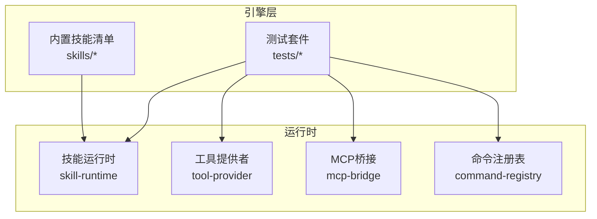

图表来源
- [engine/tests/skill-runtime.test.ts](file://engine/tests/skill-runtime.test.ts)
- [engine/tests/skill-tool-provider.test.ts](file://engine/tests/skill-tool-provider.test.ts)
- [engine/tests/skill-mcp-bridge.test.ts](file://engine/tests/skill-mcp-bridge.test.ts)
- [engine/tests/skill-command-registry.test.ts](file://engine/tests/skill-command-registry.test.ts)
- [engine/skills/code-review/skill.json](file://engine/skills/code-review/skill.json)

章节来源
- [engine/README.md](file://engine/README.md)
- [engine/skills/code-review/skill.json](file://engine/skills/code-review/skill.json)

## 核心组件
围绕技能生命周期，以下组件承担关键职责：
- 技能清单与元数据：每个技能目录包含 skill.json 描述其能力、版本、入口与参数契约，作为发现与加载的依据。
- 技能运行时：负责技能的发现、加载、注册、激活、执行与销毁，维护执行上下文与资源生命周期。
- 工具提供者：将技能暴露为可调用的工具接口，供上层编排调用。
- MCP桥接：在需要时通过MCP协议与外部系统交互，增强技能的可扩展性。
- 命令注册表：将技能能力映射到具体命令或操作，便于UI或CLI触发。

章节来源
- [engine/tests/skill-runtime.test.ts](file://engine/tests/skill-runtime.test.ts)
- [engine/tests/skill-tool-provider.test.ts](file://engine/tests/skill-tool-provider.test.ts)
- [engine/tests/skill-mcp-bridge.test.ts](file://engine/tests/skill-mcp-bridge.test.ts)
- [engine/tests/skill-command-registry.test.ts](file://engine/tests/skill-command-registry.test.ts)
- [engine/skills/code-review/skill.json](file://engine/skills/code-review/skill.json)

## 架构总览
下图展示了技能从发现到销毁的关键阶段及组件交互。

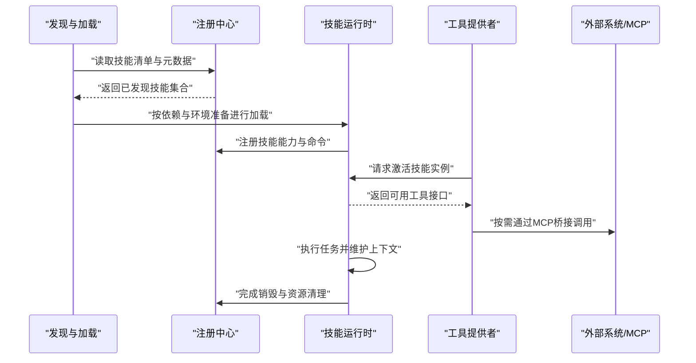

图表来源
- [engine/tests/skill-runtime.test.ts](file://engine/tests/skill-runtime.test.ts)
- [engine/tests/skill-tool-provider.test.ts](file://engine/tests/skill-tool-provider.test.ts)
- [engine/tests/skill-mcp-bridge.test.ts](file://engine/tests/skill-mcp-bridge.test.ts)
- [engine/tests/skill-command-registry.test.ts](file://engine/tests/skill-command-registry.test.ts)

## 详细组件分析

### 技能清单与元数据模型
每个内置技能目录包含一个 skill.json，用于声明技能的基本信息、版本、能力范围与入口约定。该模型是发现与加载的基础，确保不同技能具备一致的元数据结构，便于统一解析与校验。

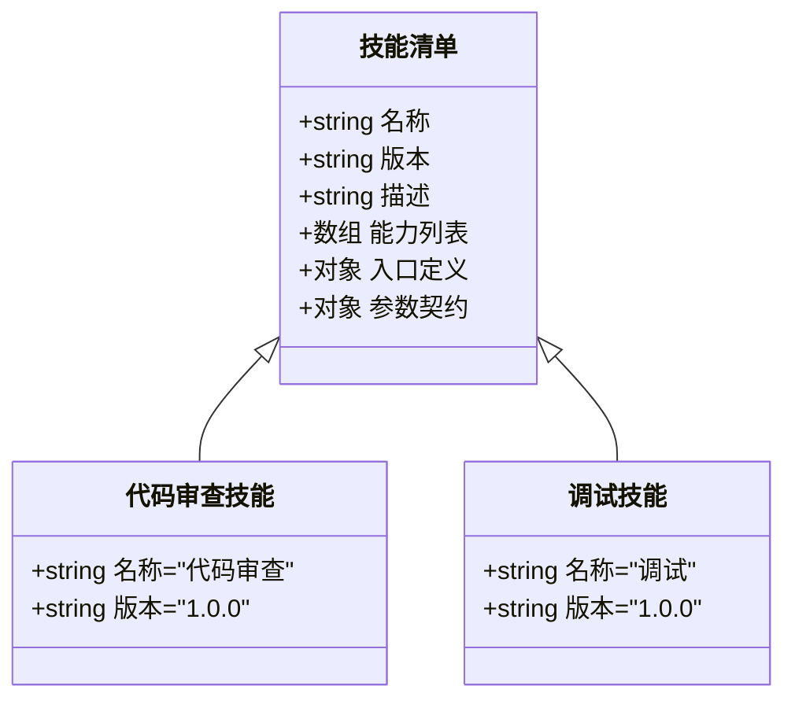

图表来源
- [engine/skills/code-review/skill.json](file://engine/skills/code-review/skill.json)
- [engine/skills/debugging/skill.json](file://engine/skills/debugging/skill.json)

章节来源
- [engine/skills/code-review/skill.json](file://engine/skills/code-review/skill.json)
- [engine/skills/debugging/skill.json](file://engine/skills/debugging/skill.json)
- [engine/skills/git-worktrees/skill.json](file://engine/skills/git-worktrees/skill.json)
- [engine/skills/goal/skill.json](file://engine/skills/goal/skill.json)
- [engine/skills/planning/skill.json](file://engine/skills/planning/skill.json)
- [engine/skills/refactoring/skill.json](file://engine/skills/refactoring/skill.json)
- [engine/skills/review/skill.json](file://engine/skills/review/skill.json)
- [engine/skills/security-review/skill.json](file://engine/skills/security-review/skill.json)
- [engine/skills/tdd/skill.json](file://engine/skills/tdd/skill.json)
- [engine/skills/todo/skill.json](file://engine/skills/todo/skill.json)
- [engine/skills/web/skill.json](file://engine/skills/web/skill.json)

### 发现与加载流程
发现阶段会遍历内置技能目录，读取每个技能的 skill.json 并进行基础校验；加载阶段根据元数据构建技能实例，解析能力与入口定义，准备运行所需的环境与依赖。

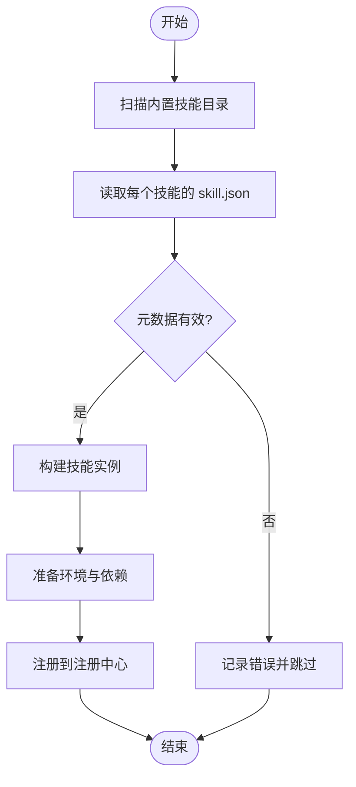

图表来源
- [engine/tests/builtin-skills.test.ts](file://engine/tests/builtin-skills.test.ts)
- [engine/tests/skill-runtime.test.ts](file://engine/tests/skill-runtime.test.ts)

章节来源
- [engine/tests/builtin-skills.test.ts](file://engine/tests/builtin-skills.test.ts)
- [engine/tests/skill-runtime.test.ts](file://engine/tests/skill-runtime.test.ts)

### 注册与激活
注册阶段将技能的能力与命令映射到注册中心，使上层可通过统一的API访问；激活阶段创建技能实例并建立执行上下文，确保后续调用具备必要的状态与资源。

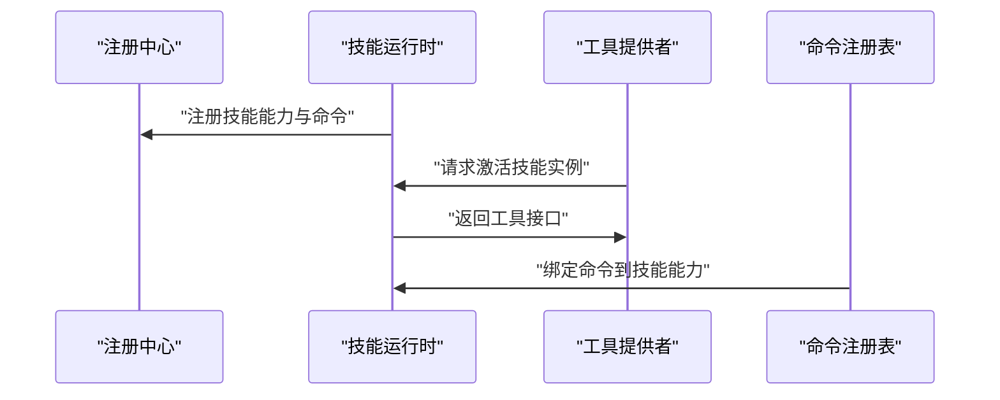

图表来源
- [engine/tests/skill-command-registry.test.ts](file://engine/tests/skill-command-registry.test.ts)
- [engine/tests/skill-tool-provider.test.ts](file://engine/tests/skill-tool-provider.test.ts)
- [engine/tests/skill-runtime.test.ts](file://engine/tests/skill-runtime.test.ts)

章节来源
- [engine/tests/skill-command-registry.test.ts](file://engine/tests/skill-command-registry.test.ts)
- [engine/tests/skill-tool-provider.test.ts](file://engine/tests/skill-tool-provider.test.ts)
- [engine/tests/skill-runtime.test.ts](file://engine/tests/skill-runtime.test.ts)

### 执行与上下文管理
执行阶段由工具提供者发起调用，运行时维护执行上下文，包括状态保持、资源清理与异常恢复。上下文的生命周期与技能实例绑定，确保多次调用间的一致性。

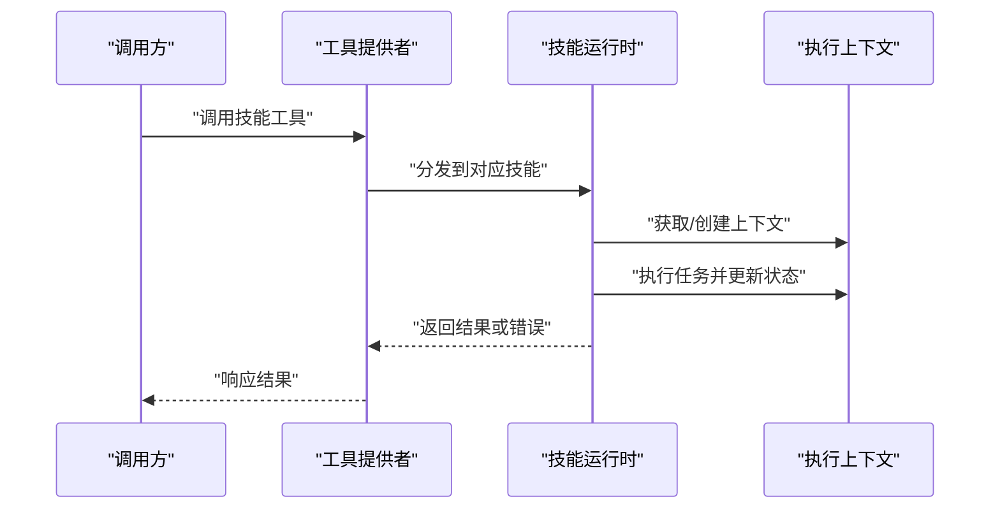

图表来源
- [engine/tests/skill-tool-provider.test.ts](file://engine/tests/skill-tool-provider.test.ts)
- [engine/tests/skill-runtime.test.ts](file://engine/tests/skill-runtime.test.ts)

章节来源
- [engine/tests/skill-tool-provider.test.ts](file://engine/tests/skill-tool-provider.test.ts)
- [engine/tests/skill-runtime.test.ts](file://engine/tests/skill-runtime.test.ts)

### 销毁与资源清理
销毁阶段负责释放技能占用的资源，关闭外部连接，清理临时文件与缓存，确保进程退出时的干净状态。

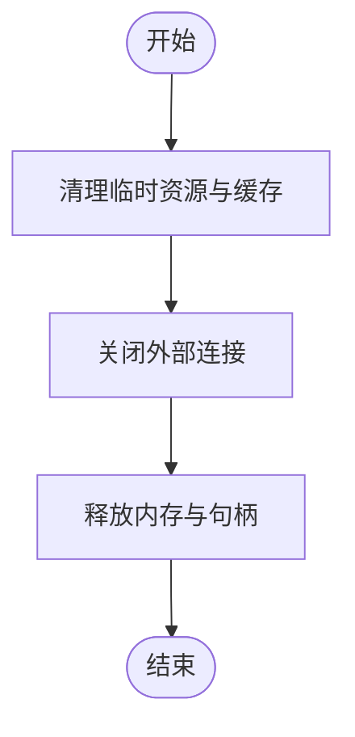

图表来源
- [engine/tests/skill-runtime.test.ts](file://engine/tests/skill-runtime.test.ts)

章节来源
- [engine/tests/skill-runtime.test.ts](file://engine/tests/skill-runtime.test.ts)

### 启动流程：依赖检查、环境准备、初始化钩子
启动流程在加载后执行，首先进行依赖检查，确保必要的外部服务或库可用；随后进行环境准备，如设置环境变量、初始化日志与追踪；最后执行初始化钩子，完成技能特定的初始化逻辑。

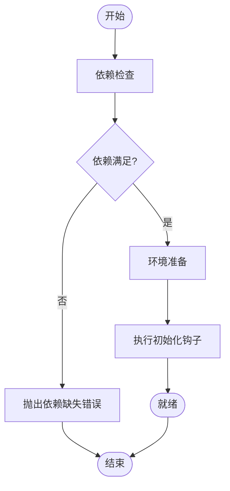

图表来源
- [engine/tests/skill-runtime.test.ts](file://engine/tests/skill-runtime.test.ts)

章节来源
- [engine/tests/skill-runtime.test.ts](file://engine/tests/skill-runtime.test.ts)

### 热重载机制：动态更新、版本切换、平滑迁移
热重载允许在不重启进程的情况下更新技能版本或行为。典型流程包括：检测新版本、停止旧实例、加载新实例、切换路由、逐步迁移状态与连接，最终完成平滑过渡。

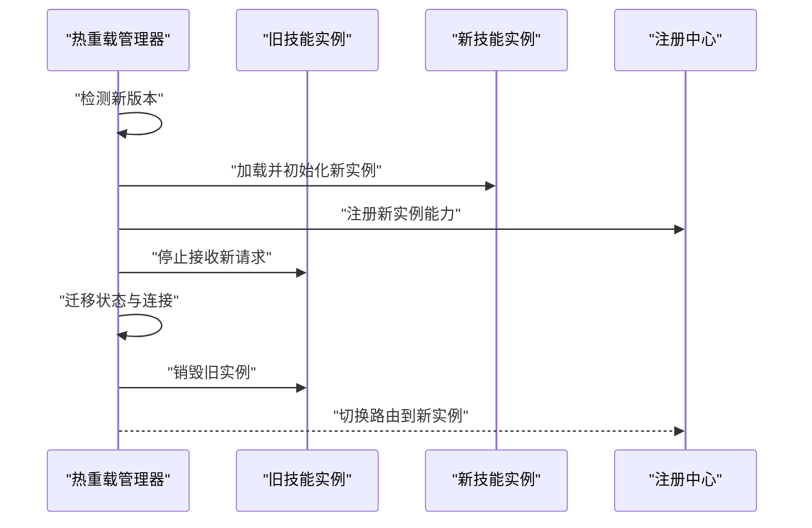

图表来源
- [engine/tests/skill-runtime.test.ts](file://engine/tests/skill-runtime.test.ts)

章节来源
- [engine/tests/skill-runtime.test.ts](file://engine/tests/skill-runtime.test.ts)

### 事件监听与处理
技能生命周期事件包括：发现、加载、注册、激活、执行、销毁等。系统提供事件总线或回调机制，允许订阅这些事件以执行审计、监控或自定义逻辑。

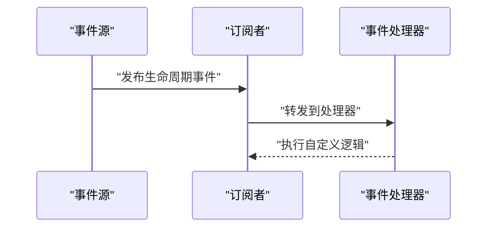

图表来源
- [engine/tests/skill-runtime.test.ts](file://engine/tests/skill-runtime.test.ts)

章节来源
- [engine/tests/skill-runtime.test.ts](file://engine/tests/skill-runtime.test.ts)

### 隔离与安全沙箱
为确保技能执行的稳定性与安全性，系统采用隔离策略，限制技能对宿主进程的访问权限，并通过沙箱机制约束文件系统、网络与系统调用。必要时结合MCP桥接对外部系统进行受控访问。

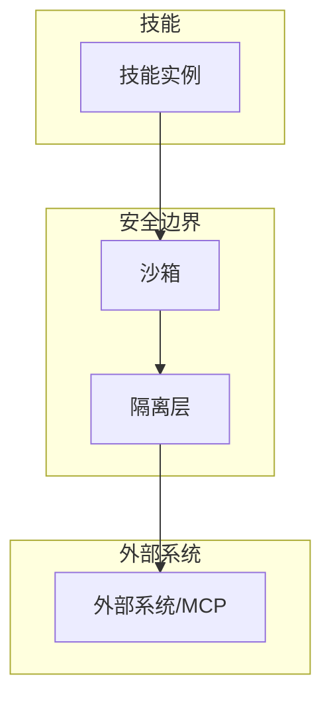

图表来源
- [engine/tests/skill-mcp-bridge.test.ts](file://engine/tests/skill-mcp-bridge.test.ts)
- [engine/tests/skill-runtime.test.ts](file://engine/tests/skill-runtime.test.ts)

章节来源
- [engine/tests/skill-mcp-bridge.test.ts](file://engine/tests/skill-mcp-bridge.test.ts)
- [engine/tests/skill-runtime.test.ts](file://engine/tests/skill-runtime.test.ts)

## 依赖关系分析
技能子系统内部组件之间的依赖关系如下：

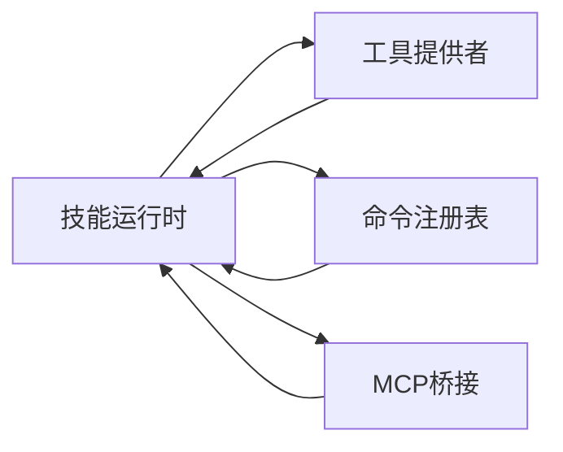

图表来源
- [engine/tests/skill-runtime.test.ts](file://engine/tests/skill-runtime.test.ts)
- [engine/tests/skill-tool-provider.test.ts](file://engine/tests/skill-tool-provider.test.ts)
- [engine/tests/skill-command-registry.test.ts](file://engine/tests/skill-command-registry.test.ts)
- [engine/tests/skill-mcp-bridge.test.ts](file://engine/tests/skill-mcp-bridge.test.ts)

章节来源
- [engine/tests/skill-runtime.test.ts](file://engine/tests/skill-runtime.test.ts)
- [engine/tests/skill-tool-provider.test.ts](file://engine/tests/skill-tool-provider.test.ts)
- [engine/tests/skill-command-registry.test.ts](file://engine/tests/skill-command-registry.test.ts)
- [engine/tests/skill-mcp-bridge.test.ts](file://engine/tests/skill-mcp-bridge.test.ts)

## 性能考虑
- 批量发现与懒加载：优先批量读取元数据，按需加载技能以减少启动开销。
- 上下文复用：避免频繁创建与销毁上下文，提升执行效率。
- 资源池化：对外部连接与IO资源进行池化管理，降低握手成本。
- 限流与熔断：对高频调用实施限流，防止雪崩效应。
- 监控与指标：采集关键指标（延迟、吞吐、错误率），辅助容量规划与问题定位。

[本节为通用指导，不直接分析具体文件]

## 故障排查指南
- 依赖缺失：检查依赖检查阶段的错误输出，确认外部服务或库是否可用。
- 元数据无效：核对每个技能的 skill.json 结构与字段完整性。
- 注册失败：查看注册中心的错误日志，确认能力与命令映射是否正确。
- 执行异常：捕获并记录上下文状态，定位异常发生点与原因。
- 热重载失败：观察新旧实例切换过程，确认迁移步骤是否完整。

章节来源
- [engine/tests/skill-runtime.test.ts](file://engine/tests/skill-runtime.test.ts)
- [engine/tests/builtin-skills.test.ts](file://engine/tests/builtin-skills.test.ts)

## 结论
通过对KCoder技能生命周期的系统化梳理，明确了从发现、加载、注册、激活、执行到销毁的全链路实现要点。结合测试用例与示例配置，提供了可追溯的源码定位与可视化图示，帮助开发者高效理解与扩展技能体系。建议在工程实践中遵循本文的性能与排障建议，并结合业务需求完善事件监听与热重载策略，以提升系统的稳定性与可维护性。

[本节为总结性内容，不直接分析具体文件]

## 附录
- 内置技能清单参考：
  - [engine/skills/code-review/skill.json](file://engine/skills/code-review/skill.json)
  - [engine/skills/debugging/skill.json](file://engine/skills/debugging/skill.json)
  - [engine/skills/git-worktrees/skill.json](file://engine/skills/git-worktrees/skill.json)
  - [engine/skills/goal/skill.json](file://engine/skills/goal/skill.json)
  - [engine/skills/planning/skill.json](file://engine/skills/planning/skill.json)
  - [engine/skills/refactoring/skill.json](file://engine/skills/refactoring/skill.json)
  - [engine/skills/review/skill.json](file://engine/skills/review/skill.json)
  - [engine/skills/security-review/skill.json](file://engine/skills/security-review/skill.json)
  - [engine/skills/tdd/skill.json](file://engine/skills/tdd/skill.json)
  - [engine/skills/todo/skill.json](file://engine/skills/todo/skill.json)
  - [engine/skills/web/skill.json](file://engine/skills/web/skill.json)

章节来源
- [engine/skills/code-review/skill.json](file://engine/skills/code-review/skill.json)
- [engine/skills/debugging/skill.json](file://engine/skills/debugging/skill.json)
- [engine/skills/git-worktrees/skill.json](file://engine/skills/git-worktrees/skill.json)
- [engine/skills/goal/skill.json](file://engine/skills/goal/skill.json)
- [engine/skills/planning/skill.json](file://engine/skills/planning/skill.json)
- [engine/skills/refactoring/skill.json](file://engine/skills/refactoring/skill.json)
- [engine/skills/review/skill.json](file://engine/skills/review/skill.json)
- [engine/skills/security-review/skill.json](file://engine/skills/security-review/skill.json)
- [engine/skills/tdd/skill.json](file://engine/skills/tdd/skill.json)
- [engine/skills/todo/skill.json](file://engine/skills/todo/skill.json)
- [engine/skills/web/skill.json](file://engine/skills/web/skill.json)