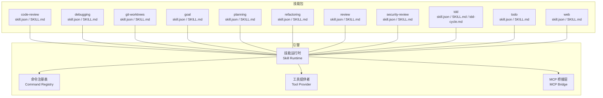
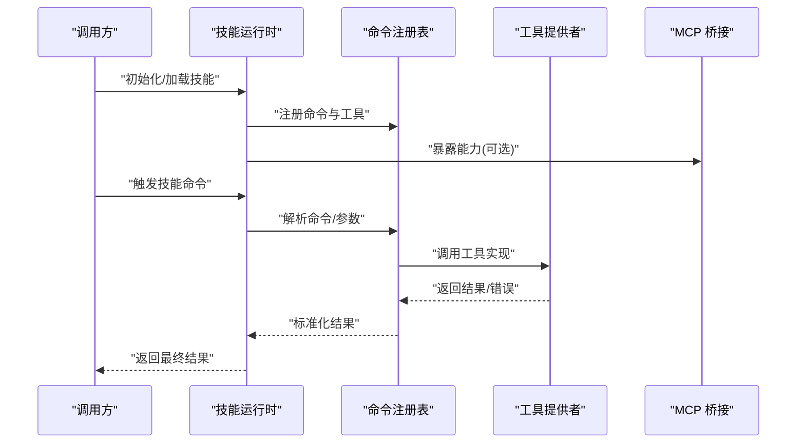
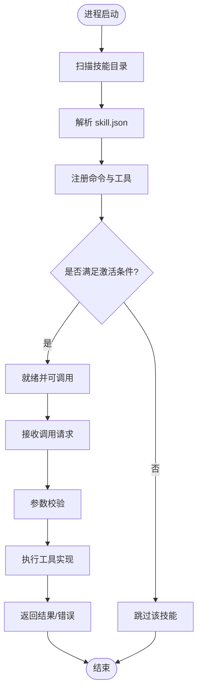
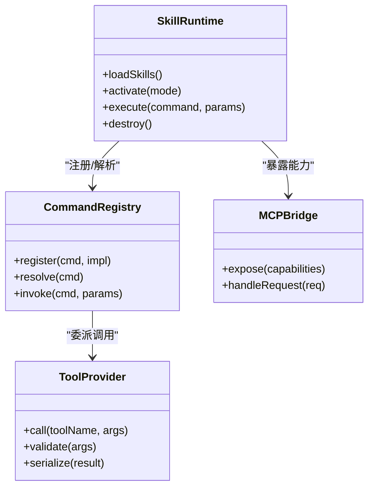
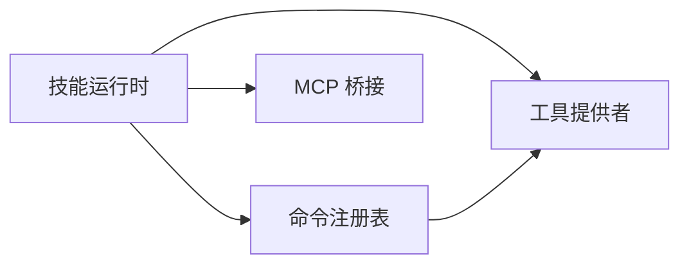

# 自定义技能开发

<cite>
**本文引用的文件**   
- [engine/skills/code-review/skill.json](file://engine/skills/code-review/skill.json)
- [engine/skills/code-review/SKILL.md](file://engine/skills/code-review/SKILL.md)
- [engine/skills/debugging/skill.json](file://engine/skills/debugging/skill.json)
- [engine/skills/debugging/SKILL.md](file://engine/skills/debugging/SKILL.md)
- [engine/skills/git-worktrees/skill.json](file://engine/skills/git-worktrees/skill.json)
- [engine/skills/git-worktrees/SKILL.md](file://engine/skills/git-worktrees/SKILL.md)
- [engine/skills/goal/skill.json](file://engine/skills/goal/skill.json)
- [engine/skills/goal/SKILL.md](file://engine/skills/goal/SKILL.md)
- [engine/skills/planning/skill.json](file://engine/skills/planning/skill.json)
- [engine/skills/planning/SKILL.md](file://engine/skills/planning/SKILL.md)
- [engine/skills/refactoring/skill.json](file://engine/skills/refactoring/skill.json)
- [engine/skills/refactoring/SKILL.md](file://engine/skills/refactoring/SKILL.md)
- [engine/skills/review/skill.json](file://engine/skills/review/skill.json)
- [engine/skills/review/SKILL.md](file://engine/skills/review/SKILL.md)
- [engine/skills/security-review/skill.json](file://engine/skills/security-review/skill.json)
- [engine/skills/security-review/SKILL.md](file://engine/skills/security-review/SKILL.md)
- [engine/skills/tdd/skill.json](file://engine/skills/tdd/skill.json)
- [engine/skills/tdd/SKILL.md](file://engine/skills/tdd/SKILL.md)
- [engine/skills/todo/skill.json](file://engine/skills/todo/skill.json)
- [engine/skills/todo/SKILL.md](file://engine/skills/todo/SKILL.md)
- [engine/skills/web/skill.json](file://engine/skills/web/skill.json)
- [engine/skills/web/SKILL.md](file://engine/skills/web/SKILL.md)
- [engine/tests/builtin-skills.test.ts](file://engine/tests/builtin-skills.test.ts)
- [engine/tests/skill-command-registry.test.ts](file://engine/tests/skill-command-registry.test.ts)
- [engine/tests/skill-mcp-bridge.test.ts](file://engine/tests/skill-mcp-bridge.test.ts)
- [engine/tests/skill-runtime.test.ts](file://engine/tests/skill-runtime.test.ts)
- [engine/tests/skill-tool-provider.test.ts](file://engine/tests/skill-tool-provider.test.ts)
- [engine/tests/work-mode-skill-runtime.test.ts](file://engine/tests/work-mode-skill-runtime.test.ts)
</cite>

## 目录
1. [简介](#简介)
2. [项目结构](#项目结构)
3. [核心组件](#核心组件)
4. [架构总览](#架构总览)
5. [详细组件分析](#详细组件分析)
6. [依赖关系分析](#依赖关系分析)
7. [性能考虑](#性能考虑)
8. [故障排查指南](#故障排查指南)
9. [结论](#结论)
10. [附录](#附录)

## 简介
本文件面向希望在 KCoder 中开发“自定义技能”的工程师，系统阐述技能的定义格式、配置文件结构（skill.json 与 SKILL.md）、工具集成方式、生命周期管理、测试方法、发布分发机制与安全权限控制，并提供从简单命令到复杂工作流的完整示例路径与最佳实践。文档以仓库内已有内置技能为参考，帮助开发者快速上手并遵循工程化规范。

## 项目结构
KCoder 引擎将“技能”作为一等公民进行组织与管理。每个技能位于 engine/skills/<skill-name>/ 目录下，包含：
- skill.json：技能元数据与能力声明
- SKILL.md：人类可读的技能说明与使用指引
- 可选：其他资源文件（如 tdd-cycle.md）

图表来源
- [engine/skills/code-review/skill.json](file://engine/skills/code-review/skill.json)
- [engine/skills/debugging/skill.json](file://engine/skills/debugging/skill.json)
- [engine/skills/git-worktrees/skill.json](file://engine/skills/git-worktrees/skill.json)
- [engine/skills/goal/skill.json](file://engine/skills/goal/skill.json)
- [engine/skills/planning/skill.json](file://engine/skills/planning/skill.json)
- [engine/skills/refactoring/skill.json](file://engine/skills/refactoring/skill.json)
- [engine/skills/review/skill.json](file://engine/skills/review/skill.json)
- [engine/skills/security-review/skill.json](file://engine/skills/security-review/skill.json)
- [engine/skills/tdd/skill.json](file://engine/skills/tdd/skill.json)
- [engine/skills/todo/skill.json](file://engine/skills/todo/skill.json)
- [engine/skills/web/skill.json](file://engine/skills/web/skill.json)

章节来源
- [engine/skills/code-review/skill.json](file://engine/skills/code-review/skill.json)
- [engine/skills/code-review/SKILL.md](file://engine/skills/code-review/SKILL.md)
- [engine/skills/debugging/skill.json](file://engine/skills/debugging/skill.json)
- [engine/skills/debugging/SKILL.md](file://engine/skills/debugging/SKILL.md)
- [engine/skills/git-worktrees/skill.json](file://engine/skills/git-worktrees/skill.json)
- [engine/skills/git-worktrees/SKILL.md](file://engine/skills/git-worktrees/SKILL.md)
- [engine/skills/goal/skill.json](file://engine/skills/goal/skill.json)
- [engine/skills/goal/SKILL.md](file://engine/skills/goal/SKILL.md)
- [engine/skills/planning/skill.json](file://engine/skills/planning/skill.json)
- [engine/skills/planning/SKILL.md](file://engine/skills/planning/SKILL.md)
- [engine/skills/refactoring/skill.json](file://engine/skills/refactoring/skill.json)
- [engine/skills/refactoring/SKILL.md](file://engine/skills/refactoring/SKILL.md)
- [engine/skills/review/skill.json](file://engine/skills/review/skill.json)
- [engine/skills/review/SKILL.md](file://engine/skills/review/SKILL.md)
- [engine/skills/security-review/skill.json](file://engine/skills/security-review/skill.json)
- [engine/skills/security-review/SKILL.md](file://engine/skills/security-review/SKILL.md)
- [engine/skills/tdd/skill.json](file://engine/skills/tdd/skill.json)
- [engine/skills/tdd/SKILL.md](file://engine/skills/tdd/SKILL.md)
- [engine/skills/todo/skill.json](file://engine/skills/todo/skill.json)
- [engine/skills/todo/SKILL.md](file://engine/skills/todo/SKILL.md)
- [engine/skills/web/skill.json](file://engine/skills/web/skill.json)
- [engine/skills/web/SKILL.md](file://engine/skills/web/SKILL.md)

## 核心组件
- 技能元数据（skill.json）
  - 描述技能的标识、版本、名称、描述、作者、许可证等元信息
  - 声明技能暴露的命令、工具、能力范围、依赖项、兼容性约束等
  - 用于注册、发现、加载与校验
- 技能说明（SKILL.md）
  - 面向用户/模型的人类可读说明，包括用途、输入输出约定、调用示例、注意事项
  - 可作为提示词上下文的一部分，辅助模型正确理解与调用技能
- 工具提供者（Tool Provider）
  - 将技能逻辑封装为可被调用的工具接口
  - 负责参数校验、执行、结果序列化与错误处理
- 命令注册表（Command Registry）
  - 维护技能命令与实现之间的映射
  - 支持按工作模式或上下文选择不同实现
- MCP 桥接（MCP Bridge）
  - 将技能能力通过 MCP 协议对外暴露，便于外部系统集成
- 技能运行时（Skill Runtime）
  - 负责技能的注册、激活、执行、销毁等生命周期管理
  - 协调命令注册表、工具提供者与 MCP 桥接

章节来源
- [engine/tests/builtin-skills.test.ts](file://engine/tests/builtin-skills.test.ts)
- [engine/tests/skill-command-registry.test.ts](file://engine/tests/skill-command-registry.test.ts)
- [engine/tests/skill-mcp-bridge.test.ts](file://engine/tests/skill-mcp-bridge.test.ts)
- [engine/tests/skill-runtime.test.ts](file://engine/tests/skill-runtime.test.ts)
- [engine/tests/skill-tool-provider.test.ts](file://engine/tests/skill-tool-provider.test.ts)
- [engine/tests/work-mode-skill-runtime.test.ts](file://engine/tests/work-mode-skill-runtime.test.ts)

## 架构总览
下图展示了技能在运行时的关键交互：运行时加载技能元数据，注册命令与工具，响应调用请求，并通过 MCP 桥接对外提供能力。

图表来源
- [engine/tests/skill-runtime.test.ts](file://engine/tests/skill-runtime.test.ts)
- [engine/tests/skill-command-registry.test.ts](file://engine/tests/skill-command-registry.test.ts)
- [engine/tests/skill-tool-provider.test.ts](file://engine/tests/skill-tool-provider.test.ts)
- [engine/tests/skill-mcp-bridge.test.ts](file://engine/tests/skill-mcp-bridge.test.ts)

## 详细组件分析

### 技能定义与配置
- skill.json 字段建议
  - 标识与版本：id、name、version、description、author、license
  - 能力声明：commands、tools、capabilities、dependencies、compatibility
  - 安全与权限：permissions、scopes、allowed_hosts、rate_limits
  - 资源与入口：entry、assets、readme_ref
- SKILL.md 内容建议
  - 功能概述、适用场景
  - 输入参数说明、输出结果约定
  - 调用示例与常见错误处理
  - 与其他工具的协作方式

章节来源
- [engine/skills/code-review/skill.json](file://engine/skills/code-review/skill.json)
- [engine/skills/code-review/SKILL.md](file://engine/skills/code-review/SKILL.md)
- [engine/skills/debugging/skill.json](file://engine/skills/debugging/skill.json)
- [engine/skills/debugging/SKILL.md](file://engine/skills/debugging/SKILL.md)
- [engine/skills/git-worktrees/skill.json](file://engine/skills/git-worktrees/skill.json)
- [engine/skills/git-worktrees/SKILL.md](file://engine/skills/git-worktrees/SKILL.md)
- [engine/skills/goal/skill.json](file://engine/skills/goal/skill.json)
- [engine/skills/goal/SKILL.md](file://engine/skills/goal/SKILL.md)
- [engine/skills/planning/skill.json](file://engine/skills/planning/skill.json)
- [engine/skills/planning/SKILL.md](file://engine/skills/planning/SKILL.md)
- [engine/skills/refactoring/skill.json](file://engine/skills/refactoring/skill.json)
- [engine/skills/refactoring/SKILL.md](file://engine/skills/refactoring/SKILL.md)
- [engine/skills/review/skill.json](file://engine/skills/review/skill.json)
- [engine/skills/review/SKILL.md](file://engine/skills/review/SKILL.md)
- [engine/skills/security-review/skill.json](file://engine/skills/security-review/skill.json)
- [engine/skills/security-review/SKILL.md](file://engine/skills/security-review/SKILL.md)
- [engine/skills/tdd/skill.json](file://engine/skills/tdd/skill.json)
- [engine/skills/tdd/SKILL.md](file://engine/skills/tdd/SKILL.md)
- [engine/skills/todo/skill.json](file://engine/skills/todo/skill.json)
- [engine/skills/todo/SKILL.md](file://engine/skills/todo/SKILL.md)
- [engine/skills/web/skill.json](file://engine/skills/web/skill.json)
- [engine/skills/web/SKILL.md](file://engine/skills/web/SKILL.md)

### 技能生命周期
- 注册：启动时扫描 skills 目录，解析 skill.json，建立命令与工具映射
- 激活：根据工作模式或上下文条件启用特定命令/工具
- 执行：接收调用请求，参数校验后委派给工具提供者执行
- 销毁：释放资源、关闭连接、清理缓存

图表来源
- [engine/tests/skill-runtime.test.ts](file://engine/tests/skill-runtime.test.ts)
- [engine/tests/skill-command-registry.test.ts](file://engine/tests/skill-command-registry.test.ts)
- [engine/tests/work-mode-skill-runtime.test.ts](file://engine/tests/work-mode-skill-runtime.test.ts)

章节来源
- [engine/tests/skill-runtime.test.ts](file://engine/tests/skill-runtime.test.ts)
- [engine/tests/skill-command-registry.test.ts](file://engine/tests/skill-command-registry.test.ts)
- [engine/tests/work-mode-skill-runtime.test.ts](file://engine/tests/work-mode-skill-runtime.test.ts)

### 工具集成与调用
- 工具定义：在 skill.json 中声明工具名、参数 schema、返回值类型、错误码
- 参数传递：运行时对参数进行类型校验与默认值填充
- 结果处理：统一包装成功/失败响应，记录审计日志
- 错误处理：捕获异常并转换为标准错误对象，便于上层重试或降级

图表来源
- [engine/tests/skill-tool-provider.test.ts](file://engine/tests/skill-tool-provider.test.ts)
- [engine/tests/skill-command-registry.test.ts](file://engine/tests/skill-command-registry.test.ts)
- [engine/tests/skill-mcp-bridge.test.ts](file://engine/tests/skill-mcp-bridge.test.ts)

章节来源
- [engine/tests/skill-tool-provider.test.ts](file://engine/tests/skill-tool-provider.test.ts)
- [engine/tests/skill-command-registry.test.ts](file://engine/tests/skill-command-registry.test.ts)
- [engine/tests/skill-mcp-bridge.test.ts](file://engine/tests/skill-mcp-bridge.test.ts)

### 示例：从简单命令到复杂工作流
- 简单命令型技能
  - 目标：封装一个本地命令或文件操作
  - 步骤：在 skill.json 中声明命令与工具；在 SKILL.md 中给出用法；实现工具提供者；注册并测试
  - 参考路径：[engine/skills/todo/skill.json](file://engine/skills/todo/skill.json)、[engine/skills/todo/SKILL.md](file://engine/skills/todo/SKILL.md)
- 多工具协作型技能
  - 目标：组合多个工具完成一次任务（如代码审查）
  - 步骤：定义主命令与子工具；编排调用顺序；处理中间结果与错误；在 SKILL.md 中说明流程
  - 参考路径：[engine/skills/code-review/skill.json](file://engine/skills/code-review/skill.json)、[engine/skills/code-review/SKILL.md](file://engine/skills/code-review/SKILL.md)
- 复杂工作流型技能
  - 目标：跨模块协作（如 TDD 循环）
  - 步骤：引入状态机或计划器；持久化中间状态；支持中断恢复；完善监控与审计
  - 参考路径：[engine/skills/tdd/skill.json](file://engine/skills/tdd/skill.json)、[engine/skills/tdd/SKILL.md](file://engine/skills/tdd/SKILL.md)

章节来源
- [engine/skills/todo/skill.json](file://engine/skills/todo/skill.json)
- [engine/skills/todo/SKILL.md](file://engine/skills/todo/SKILL.md)
- [engine/skills/code-review/skill.json](file://engine/skills/code-review/skill.json)
- [engine/skills/code-review/SKILL.md](file://engine/skills/code-review/SKILL.md)
- [engine/skills/tdd/skill.json](file://engine/skills/tdd/skill.json)
- [engine/skills/tdd/SKILL.md](file://engine/skills/tdd/SKILL.md)

## 依赖关系分析
- 内部依赖
  - 技能运行时依赖命令注册表与工具提供者
  - MCP 桥接依赖运行时暴露的能力集合
- 外部依赖
  - 文件系统、网络访问、第三方服务（由工具提供者实现）
- 潜在风险
  - 循环依赖：避免命令与工具之间互相强引用
  - 版本不兼容：通过 skill.json 的 compatibility 字段声明最小/最大版本

图表来源
- [engine/tests/skill-runtime.test.ts](file://engine/tests/skill-runtime.test.ts)
- [engine/tests/skill-command-registry.test.ts](file://engine/tests/skill-command-registry.test.ts)
- [engine/tests/skill-tool-provider.test.ts](file://engine/tests/skill-tool-provider.test.ts)
- [engine/tests/skill-mcp-bridge.test.ts](file://engine/tests/skill-mcp-bridge.test.ts)

章节来源
- [engine/tests/skill-runtime.test.ts](file://engine/tests/skill-runtime.test.ts)
- [engine/tests/skill-command-registry.test.ts](file://engine/tests/skill-command-registry.test.ts)
- [engine/tests/skill-tool-provider.test.ts](file://engine/tests/skill-tool-provider.test.ts)
- [engine/tests/skill-mcp-bridge.test.ts](file://engine/tests/skill-mcp-bridge.test.ts)

## 性能考虑
- 懒加载与按需激活：仅加载当前工作模式所需的技能
- 参数预校验：减少无效调用带来的开销
- 结果缓存：对幂等工具的结果进行短期缓存
- 并发控制：限制并行调用数量，避免资源争用
- 超时与熔断：为外部依赖设置超时与熔断策略
- 日志采样：在高吞吐场景下对日志进行采样，降低 IO 压力

## 故障排查指南
- 常见问题
  - 技能未加载：检查 skill.json 语法与必填字段
  - 命令未注册：确认命令名与注册表一致
  - 工具调用失败：查看参数校验与错误码
  - MCP 不可用：检查桥接层暴露的能力列表
- 定位手段
  - 使用单元测试覆盖关键路径
  - 开启调试日志与审计追踪
  - 复现脚本与固定夹具

章节来源
- [engine/tests/builtin-skills.test.ts](file://engine/tests/builtin-skills.test.ts)
- [engine/tests/skill-command-registry.test.ts](file://engine/tests/skill-command-registry.test.ts)
- [engine/tests/skill-tool-provider.test.ts](file://engine/tests/skill-tool-provider.test.ts)
- [engine/tests/skill-mcp-bridge.test.ts](file://engine/tests/skill-mcp-bridge.test.ts)

## 结论
通过统一的 skill.json 与 SKILL.md 规范，结合运行时、命令注册表、工具提供者与 MCP 桥接，KCoder 提供了可扩展、可观测、可测试的技能体系。遵循本文档的生命周期与最佳实践，可以快速构建从简单命令到复杂工作流的各类技能，并确保安全性与性能。

## 附录

### 测试方法与用例
- 单元测试
  - 验证命令注册与解析
  - 验证工具参数校验与结果序列化
  - 验证 MCP 暴露与请求处理
- 端到端测试
  - 模拟真实调用链路，覆盖注册、激活、执行、销毁全流程
- 性能测试
  - 压测高并发调用，评估延迟与吞吐
  - 验证缓存与熔断效果

章节来源
- [engine/tests/skill-command-registry.test.ts](file://engine/tests/skill-command-registry.test.ts)
- [engine/tests/skill-tool-provider.test.ts](file://engine/tests/skill-tool-provider.test.ts)
- [engine/tests/skill-mcp-bridge.test.ts](file://engine/tests/skill-mcp-bridge.test.ts)
- [engine/tests/skill-runtime.test.ts](file://engine/tests/skill-runtime.test.ts)
- [engine/tests/work-mode-skill-runtime.test.ts](file://engine/tests/work-mode-skill-runtime.test.ts)

### 发布与分发机制
- 版本管理
  - 使用语义化版本号，变更需更新 skill.json 中的 version
- 依赖声明
  - 在 skill.json 中声明外部依赖与最低版本要求
- 兼容性检查
  - 在运行时进行兼容性校验，拒绝不兼容版本
- 分发渠道
  - 打包为技能包，附带 SKILL.md 与必要资源

章节来源
- [engine/skills/code-review/skill.json](file://engine/skills/code-review/skill.json)
- [engine/skills/debugging/skill.json](file://engine/skills/debugging/skill.json)
- [engine/skills/git-worktrees/skill.json](file://engine/skills/git-worktrees/skill.json)
- [engine/skills/goal/skill.json](file://engine/skills/goal/skill.json)
- [engine/skills/planning/skill.json](file://engine/skills/planning/skill.json)
- [engine/skills/refactoring/skill.json](file://engine/skills/refactoring/skill.json)
- [engine/skills/review/skill.json](file://engine/skills/review/skill.json)
- [engine/skills/security-review/skill.json](file://engine/skills/security-review/skill.json)
- [engine/skills/tdd/skill.json](file://engine/skills/tdd/skill.json)
- [engine/skills/todo/skill.json](file://engine/skills/todo/skill.json)
- [engine/skills/web/skill.json](file://engine/skills/web/skill.json)

### 安全与权限控制
- 权限最小化：仅在必要时授予文件系统、网络等权限
- 作用域隔离：通过 scopes 限制工具访问范围
- 白名单与速率限制：限制允许的主机与调用频率
- 审计与追踪：记录敏感操作的审计日志

章节来源
- [engine/skills/security-review/skill.json](file://engine/skills/security-review/skill.json)
- [engine/skills/security-review/SKILL.md](file://engine/skills/security-review/SKILL.md)

### 最佳实践与优化建议
- 明确职责边界：每个技能聚焦单一领域
- 清晰的契约：在 SKILL.md 中详细描述输入输出与错误约定
- 健壮的错误处理：区分可恢复与不可恢复错误
- 可观测性：指标、日志、追踪三件套
- 渐进式演进：先实现最小可用版本，再逐步增强