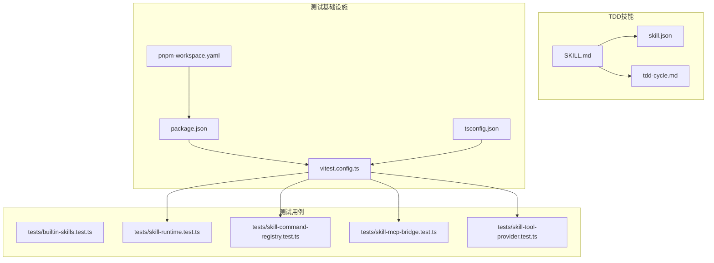
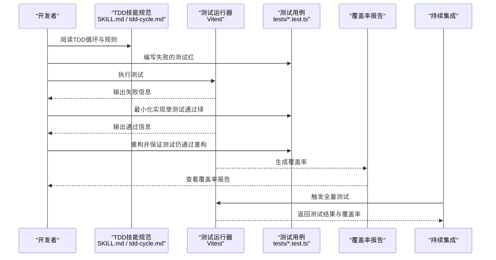
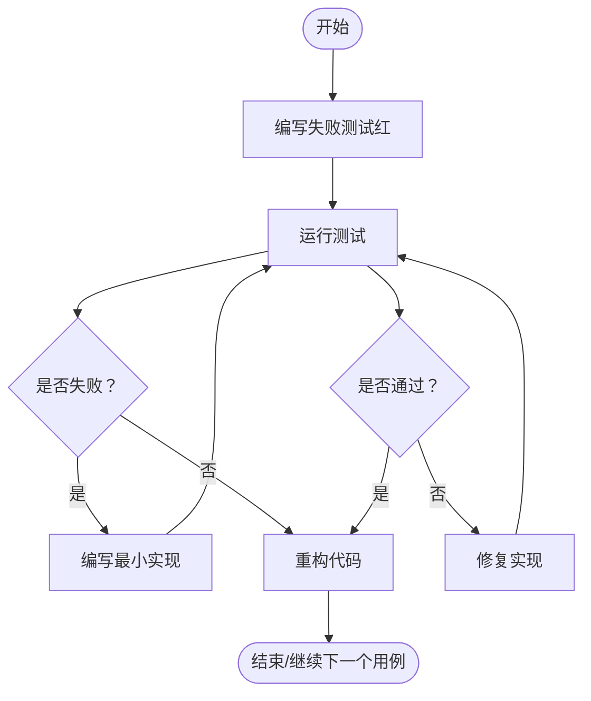
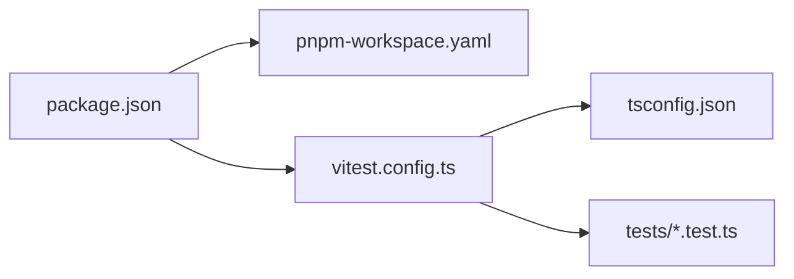

# TDD技能

<cite>
**本文引用的文件**   
- [SKILL.md](file://engine/skills/tdd/SKILL.md)
- [skill.json](file://engine/skills/tdd/skill.json)
- [tdd-cycle.md](file://engine/skills/tdd/tdd-cycle.md)
- [vitest.config.ts](file://engine/vitest.config.ts)
- [package.json](file://engine/package.json)
- [pnpm-workspace.yaml](file://engine/pnpm-workspace.yaml)
- [tsconfig.json](file://engine/tsconfig.json)
- [builtin-skills.test.ts](file://engine/tests/builtin-skills.test.ts)
- [skill-command-registry.test.ts](file://engine/tests/skill-command-registry.test.ts)
- [skill-mcp-bridge.test.ts](file://engine/tests/skill-mcp-bridge.test.ts)
- [skill-runtime.test.ts](file://engine/tests/skill-runtime.test.ts)
- [skill-tool-provider.test.ts](file://engine/tests/skill-tool-provider.test.ts)
</cite>

## 目录
1. [简介](#简介)
2. [项目结构](#项目结构)
3. [核心组件](#核心组件)
4. [架构总览](#架构总览)
5. [详细组件分析](#详细组件分析)
6. [依赖关系分析](#依赖关系分析)
7. [性能与可维护性建议](#性能与可维护性建议)
8. [故障排查指南](#故障排查指南)
9. [结论](#结论)
10. [附录](#附录)

## 简介
本文件面向希望在本仓库中实践“测试驱动开发（TDD）”的开发者，系统化说明如何基于现有工程能力落地红-绿-重构循环、自动化生成测试、覆盖率分析与持续集成。文档聚焦于以下目标：
- 解释TDD工作流在本仓库中的实现方式与最佳实践
- 展示如何编写测试优先的代码、生成单元测试与集成测试
- 说明测试框架、断言库与模拟对象的配置方法
- 提供复杂业务逻辑的测试策略与边界情况处理方法
- 给出与CI/CD集成的建议与示例流程

## 项目结构
TDD技能以“技能包”的形式组织在 engine/skills/tdd 目录下，包含技能描述、元数据与TDD循环规范；测试基础设施位于 engine 根目录，使用 Vitest 作为测试运行器，并通过 pnpm workspace 管理多包工程。

图表来源
- [SKILL.md:1-200](file://engine/skills/tdd/SKILL.md#L1-L200)
- [skill.json:1-200](file://engine/skills/tdd/skill.json#L1-L200)
- [tdd-cycle.md:1-200](file://engine/skills/tdd/tdd-cycle.md#L1-L200)
- [vitest.config.ts:1-200](file://engine/vitest.config.ts#L1-L200)
- [package.json:1-200](file://engine/package.json#L1-L200)
- [pnpm-workspace.yaml:1-200](file://engine/pnpm-workspace.yaml#L1-L200)
- [tsconfig.json:1-200](file://engine/tsconfig.json#L1-L200)

章节来源
- [SKILL.md:1-200](file://engine/skills/tdd/SKILL.md#L1-L200)
- [skill.json:1-200](file://engine/skills/tdd/skill.json#L1-L200)
- [tdd-cycle.md:1-200](file://engine/skills/tdd/tdd-cycle.md#L1-L200)
- [vitest.config.ts:1-200](file://engine/vitest.config.ts#L1-L200)
- [package.json:1-200](file://engine/package.json#L1-L200)
- [pnpm-workspace.yaml:1-200](file://engine/pnpm-workspace.yaml#L1-L200)
- [tsconfig.json:1-200](file://engine/tsconfig.json#L1-L200)

## 核心组件
- 技能定义与规范
  - 技能说明与约束：[SKILL.md](file://engine/skills/tdd/SKILL.md)
  - 技能元数据与入口：[skill.json](file://engine/skills/tdd/skill.json)
  - TDD循环规范与步骤：[tdd-cycle.md](file://engine/skills/tdd/tdd-cycle.md)
- 测试运行与配置
  - 测试运行器与插件配置：[vitest.config.ts](file://engine/vitest.config.ts)
  - 脚本命令与工作区声明：[package.json](file://engine/package.json)、[pnpm-workspace.yaml](file://engine/pnpm-workspace.yaml)
  - TypeScript编译与路径映射：[tsconfig.json](file://engine/tsconfig.json)
- 代表性测试用例
  - 内置技能与命令注册：[builtin-skills.test.ts](file://engine/tests/builtin-skills.test.ts)、[skill-command-registry.test.ts](file://engine/tests/skill-command-registry.test.ts)
  - 技能运行时与工具提供者：[skill-runtime.test.ts](file://engine/tests/skill-runtime.test.ts)、[skill-tool-provider.test.ts](file://engine/tests/skill-tool-provider.test.ts)
  - MCP桥接能力：[skill-mcp-bridge.test.ts](file://engine/tests/skill-mcp-bridge.test.ts)

章节来源
- [SKILL.md:1-200](file://engine/skills/tdd/SKILL.md#L1-L200)
- [skill.json:1-200](file://engine/skills/tdd/skill.json#L1-L200)
- [tdd-cycle.md:1-200](file://engine/skills/tdd/tdd-cycle.md#L1-L200)
- [vitest.config.ts:1-200](file://engine/vitest.config.ts#L1-L200)
- [package.json:1-200](file://engine/package.json#L1-L200)
- [pnpm-workspace.yaml:1-200](file://engine/pnpm-workspace.yaml#L1-L200)
- [tsconfig.json:1-200](file://engine/tsconfig.json#L1-L200)
- [builtin-skills.test.ts:1-200](file://engine/tests/builtin-skills.test.ts#L1-L200)
- [skill-command-registry.test.ts:1-200](file://engine/tests/skill-command-registry.test.ts#L1-L200)
- [skill-runtime.test.ts:1-200](file://engine/tests/skill-runtime.test.ts#L1-L200)
- [skill-tool-provider.test.ts:1-200](file://engine/tests/skill-tool-provider.test.ts#L1-L200)
- [skill-mcp-bridge.test.ts:1-200](file://engine/tests/skill-mcp-bridge.test.ts#L1-L200)

## 架构总览
下图展示了TDD工作流在本仓库中的关键角色与交互：开发者遵循TDD循环规范，通过测试运行器执行用例，结合覆盖率统计与IDE提示，逐步完成从“失败→通过→重构”的迭代。

图表来源
- [SKILL.md:1-200](file://engine/skills/tdd/SKILL.md#L1-L200)
- [tdd-cycle.md:1-200](file://engine/skills/tdd/tdd-cycle.md#L1-L200)
- [vitest.config.ts:1-200](file://engine/vitest.config.ts#L1-L200)
- [builtin-skills.test.ts:1-200](file://engine/tests/builtin-skills.test.ts#L1-L200)
- [skill-runtime.test.ts:1-200](file://engine/tests/skill-runtime.test.ts#L1-L200)

## 详细组件分析

### TDD循环规范与自动化支持
- 红-绿-重构循环
  - 红：先写一个失败的测试，明确预期行为与边界条件
  - 绿：编写最小实现使测试通过
  - 重构：在不改变外部行为的前提下改进设计与可读性
- 自动化支持
  - 测试运行器：Vitest 提供快速增量执行、并行与watch模式
  - 覆盖率：可通过运行器插件或CLI参数生成覆盖率报告
  - IDE集成：配合编辑器插件可实现自动运行与高亮反馈

图表来源
- [tdd-cycle.md:1-200](file://engine/skills/tdd/tdd-cycle.md#L1-L200)
- [vitest.config.ts:1-200](file://engine/vitest.config.ts#L1-L200)

章节来源
- [tdd-cycle.md:1-200](file://engine/skills/tdd/tdd-cycle.md#L1-L200)
- [vitest.config.ts:1-200](file://engine/vitest.config.ts#L1-L200)

### 测试框架、断言与模拟对象配置
- 测试框架与运行器
  - 使用 Vitest 作为统一测试运行器，支持TypeScript与模块解析
  - 配置文件位置：[vitest.config.ts](file://engine/vitest.config.ts)
- 断言库
  - 默认断言通常由运行器生态提供，可在配置中启用或替换为第三方断言库
- 模拟对象
  - 可使用运行器生态提供的mock工具进行函数/模块/网络请求等模拟
  - 建议在测试中隔离外部依赖，确保测试稳定与可重复

章节来源
- [vitest.config.ts:1-200](file://engine/vitest.config.ts#L1-L200)

### 测试用例自动生成与模板
- 生成策略
  - 基于源文件结构生成对应测试文件（如 src/foo.ts → tests/foo.test.ts）
  - 根据导出接口与类型推断生成基础用例骨架
- 模板与脚手架
  - 可参考现有测试用例风格与命名约定，保持团队一致性
  - 将生成逻辑封装为脚本或IDE快捷操作，提升效率

章节来源
- [builtin-skills.test.ts:1-200](file://engine/tests/builtin-skills.test.ts#L1-L200)
- [skill-command-registry.test.ts:1-200](file://engine/tests/skill-command-registry.test.ts#L1-L200)
- [skill-runtime.test.ts:1-200](file://engine/tests/skill-runtime.test.ts#L1-L200)
- [skill-tool-provider.test.ts:1-200](file://engine/tests/skill-tool-provider.test.ts#L1-L200)
- [skill-mcp-bridge.test.ts:1-200](file://engine/tests/skill-mcp-bridge.test.ts#L1-L200)

### 覆盖率分析与质量门禁
- 覆盖率指标
  - 行覆盖率、分支覆盖率、函数覆盖率、语句覆盖率
- 阈值与门禁
  - 在本地与CI中设置最低覆盖率阈值，未达标则阻断合并
- 报告与可视化
  - 生成HTML或JSON报告，便于审查与归档

章节来源
- [vitest.config.ts:1-200](file://engine/vitest.config.ts#L1-L200)

### 持续集成支持
- 典型流水线
  - 安装依赖 → 构建 → 运行测试 → 生成覆盖率 → 上传报告
- 缓存与加速
  - 缓存依赖与构建产物，缩短流水线时间
- 并行与分片
  - 按包或测试套件并行执行，提高吞吐

章节来源
- [package.json:1-200](file://engine/package.json#L1-L200)
- [pnpm-workspace.yaml:1-200](file://engine/pnpm-workspace.yaml#L1-L200)

### 测试优先的开发示例（端到端）
- 场景：新增一项“技能命令注册”功能
  - 红：编写“当注册新命令时，应出现在命令列表中”的失败用例
  - 绿：实现最小注册逻辑，使用例通过
  - 重构：抽取公共注册器、优化错误处理与日志
- 场景：新增“MCP桥接”能力
  - 红：编写“当调用MCP工具时，应正确转发参数并返回结果”的用例
  - 绿：实现桥接层的最小转发逻辑
  - 重构：抽象协议适配层，增强可扩展性与可测试性

章节来源
- [skill-command-registry.test.ts:1-200](file://engine/tests/skill-command-registry.test.ts#L1-L200)
- [skill-mcp-bridge.test.ts:1-200](file://engine/tests/skill-mcp-bridge.test.ts#L1-L200)

### 复杂业务逻辑的测试策略与边界情况
- 策略
  - 分层测试：单元、集成、端到端分层覆盖
  - 状态机与事件流：用事件回放与快照验证状态转换
  - 并发与竞态：构造时序与延迟，验证稳定性
- 边界情况
  - 空输入、超长输入、非法字符、权限不足、超时与重试
  - 资源耗尽与回滚：磁盘满、连接池耗尽、事务回滚
- 数据驱动与参数化
  - 使用参数化用例覆盖多组输入与期望输出

章节来源
- [skill-runtime.test.ts:1-200](file://engine/tests/skill-runtime.test.ts#L1-L200)
- [skill-tool-provider.test.ts:1-200](file://engine/tests/skill-tool-provider.test.ts#L1-L200)

## 依赖关系分析
TDD相关依赖主要围绕测试运行器、工作区管理与TS配置展开。

图表来源
- [package.json:1-200](file://engine/package.json#L1-L200)
- [pnpm-workspace.yaml:1-200](file://engine/pnpm-workspace.yaml#L1-L200)
- [vitest.config.ts:1-200](file://engine/vitest.config.ts#L1-L200)
- [tsconfig.json:1-200](file://engine/tsconfig.json#L1-L200)

章节来源
- [package.json:1-200](file://engine/package.json#L1-L200)
- [pnpm-workspace.yaml:1-200](file://engine/pnpm-workspace.yaml#L1-L200)
- [vitest.config.ts:1-200](file://engine/vitest.config.ts#L1-L200)
- [tsconfig.json:1-200](file://engine/tsconfig.json#L1-L200)

## 性能与可维护性建议
- 测试粒度
  - 小步快跑：每个用例只验证单一职责，减少耦合
- 执行速度
  - 使用并行与watch模式，避免不必要的I/O与全局状态
- 可维护性
  - 清晰的测试命名与注释，固定随机种子，避免不稳定测试
- 覆盖率平衡
  - 关注关键路径与高风险区域，避免追求绝对数值而忽视价值

## 故障排查指南
- 常见问题
  - 测试无法找到模块：检查路径别名与tsconfig映射
  - 异步用例超时：确认await与done回调的使用是否正确
  - 模拟对象未生效：确认导入路径与模块解析一致
- 定位技巧
  - 缩小范围：仅运行受影响测试套件
  - 打印上下文：在关键路径添加结构化日志
  - 复现问题：将失败用例最小化，便于定位根因

章节来源
- [vitest.config.ts:1-200](file://engine/vitest.config.ts#L1-L200)
- [builtin-skills.test.ts:1-200](file://engine/tests/builtin-skills.test.ts#L1-L200)
- [skill-runtime.test.ts:1-200](file://engine/tests/skill-runtime.test.ts#L1-L200)

## 结论
通过将TDD规范内化为技能包，并结合Vitest与工作区管理，本项目提供了从“红-绿-重构”到覆盖率与CI的完整闭环。遵循本文的实践与策略，可有效提升代码质量、降低回归风险，并在团队协作中形成一致的测试文化。

## 附录
- 常用命令（示例）
  - 运行全部测试：参考 package.json 中的脚本
  - 运行单个测试文件：使用运行器CLI指定文件路径
  - 生成覆盖率报告：启用运行器覆盖率插件或参数
- 参考文件
  - 技能规范与元数据：[SKILL.md](file://engine/skills/tdd/SKILL.md)、[skill.json](file://engine/skills/tdd/skill.json)、[tdd-cycle.md](file://engine/skills/tdd/tdd-cycle.md)
  - 测试配置与脚本：[vitest.config.ts](file://engine/vitest.config.ts)、[package.json](file://engine/package.json)、[pnpm-workspace.yaml](file://engine/pnpm-workspace.yaml)、[tsconfig.json](file://engine/tsconfig.json)
  - 代表性测试用例：[builtin-skills.test.ts](file://engine/tests/builtin-skills.test.ts)、[skill-command-registry.test.ts](file://engine/tests/skill-command-registry.test.ts)、[skill-runtime.test.ts](file://engine/tests/skill-runtime.test.ts)、[skill-tool-provider.test.ts](file://engine/tests/skill-tool-provider.test.ts)、[skill-mcp-bridge.test.ts](file://engine/tests/skill-mcp-bridge.test.ts)