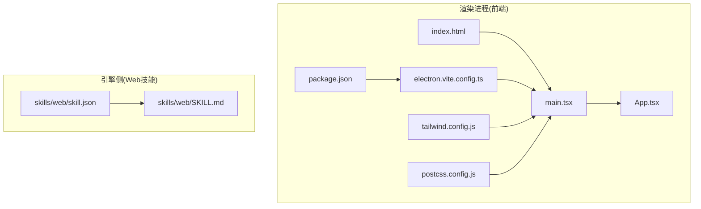
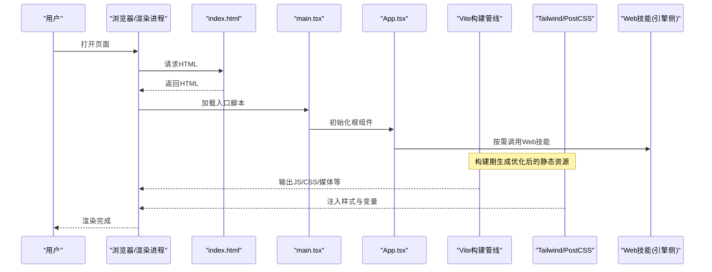
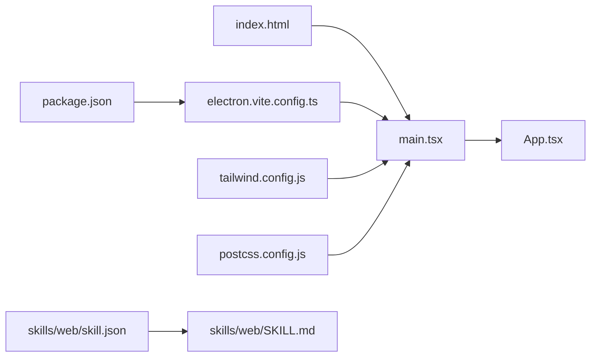

# Web开发技能

<cite>
**本文引用的文件**   
- [app/renderer/src/main.tsx](file://app/renderer/src/main.tsx)
- [app/renderer/src/App.tsx](file://app/renderer/src/App.tsx)
- [app/renderer/index.html](file://app/renderer/index.html)
- [app/electron.vite.config.ts](file://app/electron.vite.config.ts)
- [app/tailwind.config.js](file://app/tailwind.config.js)
- [app/postcss.config.js](file://app/postcss.config.js)
- [app/package.json](file://app/package.json)
- [engine/skills/web/SKILL.md](file://engine/skills/web/SKILL.md)
- [engine/skills/web/skill.json](file://engine/skills/web/skill.json)
</cite>

## 目录
1. [简介](#简介)
2. [项目结构](#项目结构)
3. [核心组件](#核心组件)
4. [架构总览](#架构总览)
5. [详细组件分析](#详细组件分析)
6. [依赖分析](#依赖分析)
7. [性能考虑](#性能考虑)
8. [故障排查指南](#故障排查指南)
9. [结论](#结论)
10. [附录](#附录)

## 简介
本文件面向Web开发技能的使用与最佳实践，聚焦前端优化、性能分析与工程化落地。内容覆盖：
- 前端优化与性能分析（代码分割、懒加载、缓存策略、SEO）
- 主流框架特定优化（React、Vue、Angular）
- 构建工具集成与部署流程（Vite、Tailwind、PostCSS）
- CDN优化、移动端适配、跨浏览器兼容性与无障碍访问
- 性能监控指标与用户体验度量
- Web安全最佳实践与现代前端工作流集成

## 项目结构
仓库包含一个基于Electron的前端渲染层（renderer），以及引擎侧的“web”技能定义。前端采用Vite + React + Tailwind + PostCSS的工程化配置；引擎侧提供Web技能的元数据与说明文档，便于在平台内统一管理与调用。

图表来源
- [app/renderer/index.html](file://app/renderer/index.html)
- [app/renderer/src/main.tsx](file://app/renderer/src/main.tsx)
- [app/renderer/src/App.tsx](file://app/renderer/src/App.tsx)
- [app/electron.vite.config.ts](file://app/electron.vite.config.ts)
- [app/tailwind.config.js](file://app/tailwind.config.js)
- [app/postcss.config.js](file://app/postcss.config.js)
- [app/package.json](file://app/package.json)
- [engine/skills/web/SKILL.md](file://engine/skills/web/SKILL.md)
- [engine/skills/web/skill.json](file://engine/skills/web/skill.json)

章节来源
- [app/renderer/index.html](file://app/renderer/index.html)
- [app/renderer/src/main.tsx](file://app/renderer/src/main.tsx)
- [app/renderer/src/App.tsx](file://app/renderer/src/App.tsx)
- [app/electron.vite.config.ts](file://app/electron.vite.config.ts)
- [app/tailwind.config.js](file://app/tailwind.config.js)
- [app/postcss.config.js](file://app/postcss.config.js)
- [app/package.json](file://app/package.json)
- [engine/skills/web/SKILL.md](file://engine/skills/web/SKILL.md)
- [engine/skills/web/skill.json](file://engine/skills/web/skill.json)

## 核心组件
- 入口与挂载
  - 渲染进程入口负责初始化应用并挂载到DOM节点，通常结合路由与全局状态进行启动编排。
  - 根组件承载页面布局与业务模块组织，是功能扩展与性能优化的关键锚点。
- 构建与样式
  - Vite配置用于开发/生产环境差异、插件链与输出产物控制。
  - Tailwind与PostCSS用于原子化样式与CSS处理流水线。
- 技能定义
  - 引擎侧Web技能通过SKILL.md与skill.json描述能力边界、输入输出与使用方式，便于平台集成与自动化编排。

章节来源
- [app/renderer/src/main.tsx](file://app/renderer/src/main.tsx)
- [app/renderer/src/App.tsx](file://app/renderer/src/App.tsx)
- [app/electron.vite.config.ts](file://app/electron.vite.config.ts)
- [app/tailwind.config.js](file://app/tailwind.config.js)
- [app/postcss.config.js](file://app/postcss.config.js)
- [engine/skills/web/SKILL.md](file://engine/skills/web/SKILL.md)
- [engine/skills/web/skill.json](file://engine/skills/web/skill.json)

## 架构总览
下图展示了从HTML到JS/CSS资源加载、Vite构建管线、样式处理与运行时渲染的整体流程，同时体现Web技能在平台中的定位。

图表来源
- [app/renderer/index.html](file://app/renderer/index.html)
- [app/renderer/src/main.tsx](file://app/renderer/src/main.tsx)
- [app/renderer/src/App.tsx](file://app/renderer/src/App.tsx)
- [app/electron.vite.config.ts](file://app/electron.vite.config.ts)
- [app/tailwind.config.js](file://app/tailwind.config.js)
- [app/postcss.config.js](file://app/postcss.config.js)
- [engine/skills/web/SKILL.md](file://engine/skills/web/SKILL.md)
- [engine/skills/web/skill.json](file://engine/skills/web/skill.json)

## 详细组件分析

### 渲染入口与根组件
- 职责
  - 入口负责创建应用实例、挂载到DOM、注册全局错误边界与性能埋点。
  - 根组件组织路由、主题、国际化与全局状态，作为懒加载与代码分割的边界。
- 优化要点
  - 将大体积第三方库与重型页面按路由或交互触发进行动态导入。
  - 对首屏无关的组件与数据进行延迟加载与预取。
  - 使用稳定的key与不可变更新避免不必要的重渲染。

章节来源
- [app/renderer/src/main.tsx](file://app/renderer/src/main.tsx)
- [app/renderer/src/App.tsx](file://app/renderer/src/App.tsx)

### 构建与样式管线
- Vite配置
  - 控制开发服务器、插件链、输出目录与产物命名策略。
  - 可开启生产环境的代码压缩、Tree Shaking与分包策略。
- Tailwind与PostCSS
  - 通过Tailwind配置启用自定义主题、响应式断点与插件。
  - PostCSS用于CSS前缀、压缩与兼容性处理。
- 包管理
  - package.json中声明构建脚本、依赖版本与可选的打包目标。

章节来源
- [app/electron.vite.config.ts](file://app/electron.vite.config.ts)
- [app/tailwind.config.js](file://app/tailwind.config.js)
- [app/postcss.config.js](file://app/postcss.config.js)
- [app/package.json](file://app/package.json)

### Web技能（引擎侧）
- 作用
  - 以SKILL.md与skill.json描述Web相关能力的范围、参数、返回值与约束，供平台编排与工具链消费。
- 使用建议
  - 明确输入校验与错误码约定，保证前后端一致。
  - 为复杂任务拆分子技能，提升复用性与可测试性。

章节来源
- [engine/skills/web/SKILL.md](file://engine/skills/web/SKILL.md)
- [engine/skills/web/skill.json](file://engine/skills/web/skill.json)

## 依赖分析
- 前端依赖关系
  - index.html引入入口脚本，main.tsx初始化应用并挂载App.tsx。
  - electron.vite.config.ts驱动构建与开发体验，Tailwind与PostCSS参与样式处理。
- 引擎侧依赖关系
  - skill.json指向SKILL.md，形成“元数据+说明”的技能契约。

图表来源
- [app/renderer/index.html](file://app/renderer/index.html)
- [app/renderer/src/main.tsx](file://app/renderer/src/main.tsx)
- [app/renderer/src/App.tsx](file://app/renderer/src/App.tsx)
- [app/electron.vite.config.ts](file://app/electron.vite.config.ts)
- [app/tailwind.config.js](file://app/tailwind.config.js)
- [app/postcss.config.js](file://app/postcss.config.js)
- [app/package.json](file://app/package.json)
- [engine/skills/web/skill.json](file://engine/skills/web/skill.json)
- [engine/skills/web/SKILL.md](file://engine/skills/web/SKILL.md)

章节来源
- [app/renderer/index.html](file://app/renderer/index.html)
- [app/renderer/src/main.tsx](file://app/renderer/src/main.tsx)
- [app/renderer/src/App.tsx](file://app/renderer/src/App.tsx)
- [app/electron.vite.config.ts](file://app/electron.vite.config.ts)
- [app/tailwind.config.js](file://app/tailwind.config.js)
- [app/postcss.config.js](file://app/postcss.config.js)
- [app/package.json](file://app/package.json)
- [engine/skills/web/skill.json](file://engine/skills/web/skill.json)
- [engine/skills/web/SKILL.md](file://engine/skills/web/SKILL.md)

## 性能考虑
本节给出通用且可落地的优化清单，适用于当前基于Vite + React的工程。

- 代码分割与懒加载
  - 按路由或交互事件动态导入组件，减少首屏体积。
  - 对图片、视频等大资源使用懒加载与占位图。
- 缓存策略
  - 利用HTTP缓存头与强缓存策略，配合文件名哈希实现长期缓存。
  - 对静态资源启用CDN与边缘缓存，缩短TTFB与首次渲染时间。
- SEO优化
  - 为关键页面提供结构化数据与语义化标签。
  - 对爬虫友好的内容优先在服务端或预渲染阶段生成。
- 构建优化
  - 开启Tree Shaking、代码压缩与资源压缩。
  - 合理划分chunk，避免单包过大。
- 运行时优化
  - 避免频繁重排重绘，合并状态更新。
  - 使用虚拟列表与分页加载长列表。
- 监控与度量
  - 采集Core Web Vitals（LCP、FID/INP、CLS）。
  - 记录关键用户路径的端到端耗时与错误率。

[本节为通用指导，不直接分析具体文件]

## 故障排查指南
- 构建失败
  - 检查Vite配置与插件版本兼容性。
  - 确认Tailwind与PostCSS插件顺序与配置项。
- 样式异常
  - 验证Tailwind类名是否被正确扫描与生成。
  - 检查CSS变量与作用域冲突。
- 运行时报错
  - 在入口与根组件处添加错误边界与日志上报。
  - 针对网络请求增加重试与降级逻辑。
- 性能问题
  - 使用性能面板定位长任务与阻塞渲染的代码。
  - 通过产物分析识别大包与重复依赖。

章节来源
- [app/electron.vite.config.ts](file://app/electron.vite.config.ts)
- [app/tailwind.config.js](file://app/tailwind.config.js)
- [app/postcss.config.js](file://app/postcss.config.js)
- [app/renderer/src/main.tsx](file://app/renderer/src/main.tsx)
- [app/renderer/src/App.tsx](file://app/renderer/src/App.tsx)

## 结论
通过将构建、样式与运行时优化纳入统一工程化体系，并结合Web技能的标准化描述，可在保证可维护性的同时显著提升性能与用户体验。建议在迭代中持续采集性能指标，以数据驱动优化决策。

[本节为总结性内容，不直接分析具体文件]

## 附录

### 主流框架特定优化建议
- React
  - 使用React.lazy与Suspense进行路由级与组件级懒加载。
  - 合理使用useMemo/useCallback避免不必要重渲染。
  - 借助React DevTools Profiler定位渲染瓶颈。
- Vue
  - 使用异步组件与路由懒加载。
  - 利用v-memo与计算属性缓存视图依赖。
  - 使用Vue DevTools进行性能分析。
- Angular
  - 使用路由懒加载与预加载策略。
  - 启用OnPush变更检测与纯管道。
  - 借助Angular DevTools与Performance API进行分析。

[本节为通用指导，不直接分析具体文件]

### 构建工具与部署流程
- 本地开发
  - 使用Vite快速启动开发服务器，支持热重载与增量编译。
- 构建产物
  - 输出带哈希的稳定文件名，便于CDN缓存。
  - 分离vendor与业务代码，提高缓存命中率。
- 部署
  - 将dist目录部署至静态托管或CDN。
  - 配置HTTP缓存头与Gzip/Brotli压缩。

章节来源
- [app/electron.vite.config.ts](file://app/electron.vite.config.ts)
- [app/package.json](file://app/package.json)

### CDN优化
- 启用边缘缓存与就近分发。
- 设置合理的Cache-Control与ETag。
- 对字体与图片启用独立域名与预连接。

[本节为通用指导，不直接分析具体文件]

### 移动端适配与跨浏览器兼容
- 使用响应式布局与相对单位。
- 通过PostCSS与Autoprefixer补齐浏览器特性。
- 在低端设备上降低动画与特效复杂度。

章节来源
- [app/tailwind.config.js](file://app/tailwind.config.js)
- [app/postcss.config.js](file://app/postcss.config.js)

### 无障碍访问支持
- 为交互元素提供语义化标签与ARIA属性。
- 确保键盘可达与焦点可见。
- 提供足够的颜色对比度与文本替代。

[本节为通用指导，不直接分析具体文件]

### Web安全最佳实践
- 输入校验与输出编码，防范XSS。
- 启用CSP与严格的HTTPS策略。
- 最小权限原则与敏感信息脱敏。

[本节为通用指导，不直接分析具体文件]

### 现代前端工作流集成
- 将性能监控与错误上报接入CI/CD，阻断回归。
- 使用技能定义规范化管理能力边界与契约。
- 建立统一的代码质量与安全检查门禁。

章节来源
- [engine/skills/web/SKILL.md](file://engine/skills/web/SKILL.md)
- [engine/skills/web/skill.json](file://engine/skills/web/skill.json)