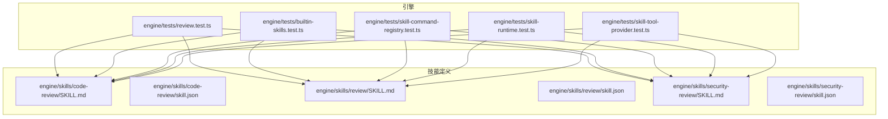
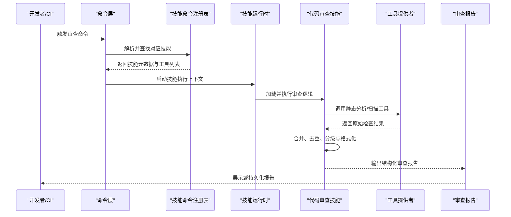
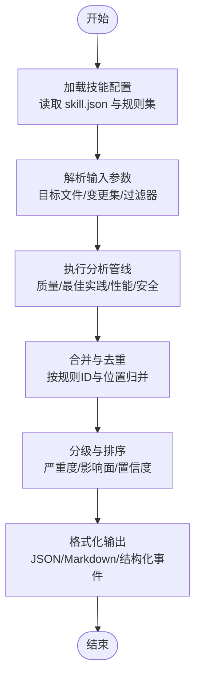
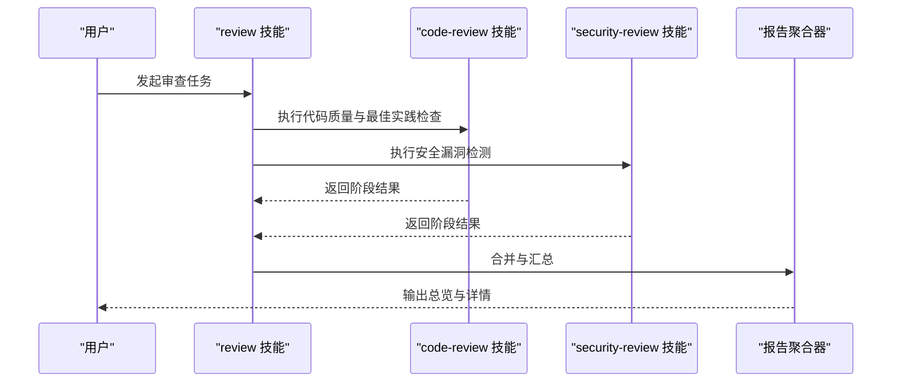
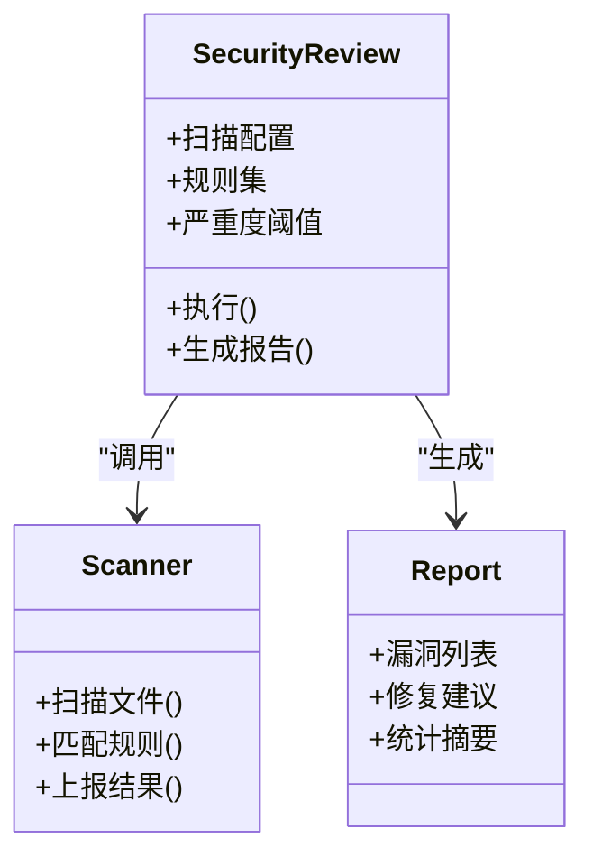
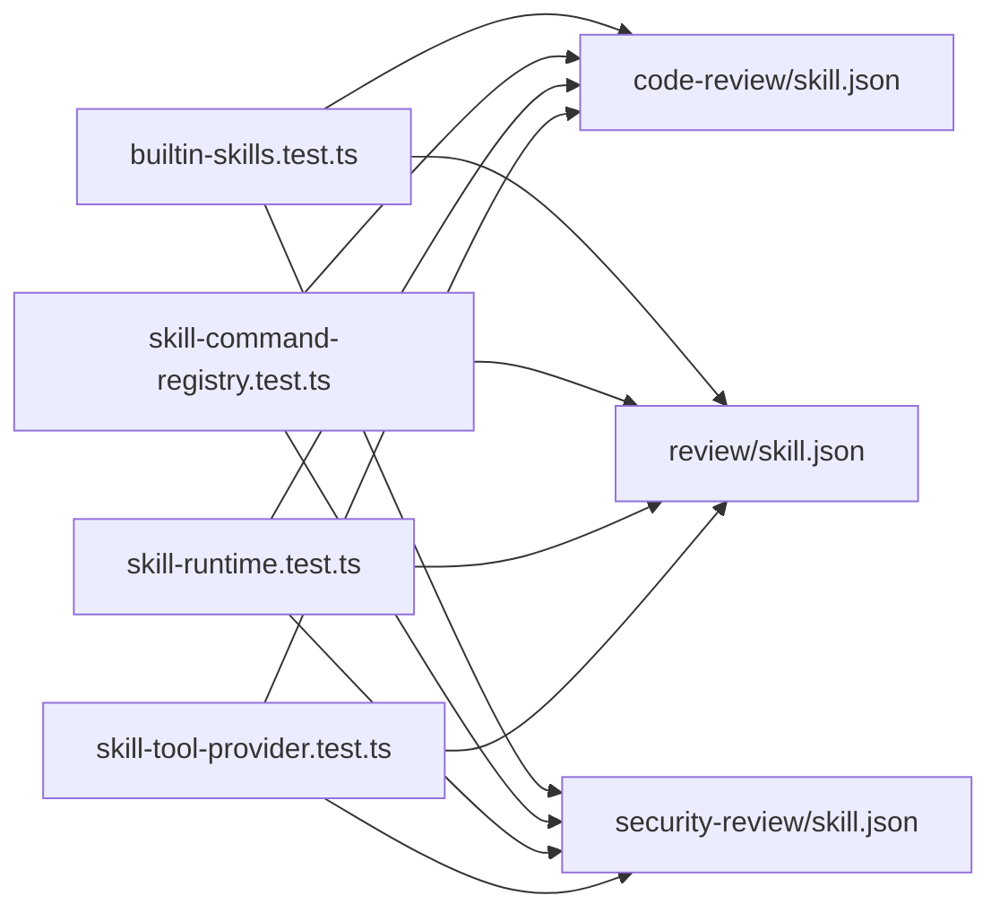

# 代码审查技能

<cite>
**本文引用的文件**   
- [engine/skills/code-review/SKILL.md](file://engine/skills/code-review/SKILL.md)
- [engine/skills/code-review/skill.json](file://engine/skills/code-review/skill.json)
- [engine/skills/review/SKILL.md](file://engine/skills/review/SKILL.md)
- [engine/skills/review/skill.json](file://engine/skills/review/skill.json)
- [engine/skills/security-review/SKILL.md](file://engine/skills/security-review/SKILL.md)
- [engine/skills/security-review/skill.json](file://engine/skills/security-review/skill.json)
- [engine/tests/review.test.ts](file://engine/tests/review.test.ts)
- [engine/tests/builtin-skills.test.ts](file://engine/tests/builtin-skills.test.ts)
- [engine/tests/skill-command-registry.test.ts](file://engine/tests/skill-command-registry.test.ts)
- [engine/tests/skill-runtime.test.ts](file://engine/tests/skill-runtime.test.ts)
- [engine/tests/skill-tool-provider.test.ts](file://engine/tests/skill-tool-provider.test.ts)
</cite>

## 目录
1. [简介](#简介)
2. [项目结构](#项目结构)
3. [核心组件](#核心组件)
4. [架构总览](#架构总览)
5. [详细组件分析](#详细组件分析)
6. [依赖关系分析](#依赖关系分析)
7. [性能考虑](#性能考虑)
8. [故障排查指南](#故障排查指南)
9. [结论](#结论)
10. [附录](#附录)

## 简介
本文件为“代码审查技能”的完整使用文档，覆盖以下目标：
- 功能特性：代码质量分析、最佳实践检查、安全漏洞检测、性能优化建议。
- 配置与自定义：如何设置规则、优先级与扩展点。
- 使用示例：触发审查、查看报告、集成到开发流程。
- 报告解读：结构与指标含义。
- 定制策略：按项目需求调整规则与优先级。
- 常见问题与性能优化建议。

## 项目结构
仓库中与“代码审查技能”直接相关的资源位于 engine/skills 目录下，包含多个子技能（code-review、review、security-review），每个子技能由说明文档 SKILL.md 与能力清单 skill.json 组成；同时配套测试用例验证技能注册、运行与工具提供等关键路径。

图表来源
- [engine/tests/review.test.ts](file://engine/tests/review.test.ts)
- [engine/tests/builtin-skills.test.ts](file://engine/tests/builtin-skills.test.ts)
- [engine/tests/skill-command-registry.test.ts](file://engine/tests/skill-command-registry.test.ts)
- [engine/tests/skill-runtime.test.ts](file://engine/tests/skill-runtime.test.ts)
- [engine/tests/skill-tool-provider.test.ts](file://engine/tests/skill-tool-provider.test.ts)
- [engine/skills/code-review/SKILL.md](file://engine/skills/code-review/SKILL.md)
- [engine/skills/code-review/skill.json](file://engine/skills/code-review/skill.json)
- [engine/skills/review/SKILL.md](file://engine/skills/review/sKILL.md)
- [engine/skills/review/skill.json](file://engine/skills/review/skill.json)
- [engine/skills/security-review/SKILL.md](file://engine/skills/security-review/SKILL.md)
- [engine/skills/security-review/skill.json](file://engine/skills/security-review/skill.json)

章节来源
- [engine/skills/code-review/SKILL.md](file://engine/skills/code-review/SKILL.md)
- [engine/skills/code-review/skill.json](file://engine/skills/code-review/skill.json)
- [engine/skills/review/SKILL.md](file://engine/skills/review/SKILL.md)
- [engine/skills/review/skill.json](file://engine/skills/review/skill.json)
- [engine/skills/security-review/SKILL.md](file://engine/skills/security-review/SKILL.md)
- [engine/skills/security-review/skill.json](file://engine/skills/security-review/skill.json)
- [engine/tests/review.test.ts](file://engine/tests/review.test.ts)
- [engine/tests/builtin-skills.test.ts](file://engine/tests/builtin-skills.test.ts)
- [engine/tests/skill-command-registry.test.ts](file://engine/tests/skill-command-registry.test.ts)
- [engine/tests/skill-runtime.test.ts](file://engine/tests/skill-runtime.test.ts)
- [engine/tests/skill-tool-provider.test.ts](file://engine/tests/skill-tool-provider.test.ts)

## 核心组件
- 代码审查技能（code-review）：面向通用代码质量与最佳实践检查，输出结构化审查结果与建议。
- 通用审查技能（review）：提供可组合的审查工作流入口，支持多阶段分析与汇总。
- 安全审查技能（security-review）：聚焦安全相关风险识别与修复建议。

上述三个子技能均通过各自的 SKILL.md 描述能力边界与用法，并通过 skill.json 声明能力元数据（如命令、参数、工具绑定等）。测试用例覆盖了内置技能发现、命令注册、运行时执行与工具提供链路。

章节来源
- [engine/skills/code-review/SKILL.md](file://engine/skills/code-review/SKILL.md)
- [engine/skills/code-review/skill.json](file://engine/skills/code-review/skill.json)
- [engine/skills/review/SKILL.md](file://engine/skills/review/SKILL.md)
- [engine/skills/review/skill.json](file://engine/skills/review/skill.json)
- [engine/skills/security-review/SKILL.md](file://engine/skills/security-review/SKILL.md)
- [engine/skills/security-review/skill.json](file://engine/skills/security-review/sskill.json)
- [engine/tests/builtin-skills.test.ts](file://engine/tests/builtin-skills.test.ts)
- [engine/tests/skill-command-registry.test.ts](file://engine/tests/skill-command-registry.test.ts)
- [engine/tests/skill-runtime.test.ts](file://engine/tests/skill-runtime.test.ts)
- [engine/tests/skill-tool-provider.test.ts](file://engine/tests/skill-tool-provider.test.ts)

## 架构总览
下图展示了从用户触发到生成审查报告的端到端流程，包括技能发现、命令解析、运行时调度、工具调用与报告聚合。

图表来源
- [engine/tests/review.test.ts](file://engine/tests/review.test.ts)
- [engine/tests/skill-command-registry.test.ts](file://engine/tests/skill-command-registry.test.ts)
- [engine/tests/skill-runtime.test.ts](file://engine/tests/skill-runtime.test.ts)
- [engine/tests/skill-tool-provider.test.ts](file://engine/tests/skill-tool-provider.test.ts)
- [engine/skills/code-review/SKILL.md](file://engine/skills/code-review/SKILL.md)
- [engine/skills/review/SKILL.md](file://engine/skills/review/SKILL.md)
- [engine/skills/security-review/SKILL.md](file://engine/skills/security-review/SKILL.md)

## 详细组件分析

### 代码审查技能（code-review）
- 职责范围
  - 代码质量分析：复杂度、重复度、可读性、命名规范等。
  - 最佳实践检查：语言/框架约定、常见反模式、API 使用规范。
  - 性能优化建议：热点路径提示、潜在低效模式、资源使用建议。
  - 安全漏洞检测：基础安全问题提示（与 security-review 互补）。
- 配置与自定义
  - 通过 skill.json 声明命令、参数与工具绑定。
  - 在 SKILL.md 中描述规则集、阈值与输出格式。
  - 可通过环境变量或配置文件注入规则优先级与过滤条件（具体键名以 skill.json 为准）。
- 使用示例
  - 命令行触发：参考 review.test.ts 中的调用方式，定位 code-review 命令并传入目标文件或变更集。
  - 查看报告：将输出保存为 JSON/Markdown，便于 CI 归档与人工审阅。
  - 集成到开发流程：在 pre-commit 或 CI 流水线中作为独立步骤执行。
- 报告结构
  - 典型字段：问题级别（严重/警告/信息）、文件路径、行号、规则 ID、摘要、修复建议、关联证据。
  - 指标含义：严重度用于阻断策略，规则 ID 用于追踪与过滤，修复建议用于快速落地。

图表来源
- [engine/skills/code-review/SKILL.md](file://engine/skills/code-review/SKILL.md)
- [engine/skills/code-review/skill.json](file://engine/skills/code-review/skill.json)
- [engine/tests/review.test.ts](file://engine/tests/review.test.ts)

章节来源
- [engine/skills/code-review/SKILL.md](file://engine/skills/code-review/SKILL.md)
- [engine/skills/code-review/skill.json](file://engine/skills/code-review/skill.json)
- [engine/tests/review.test.ts](file://engine/tests/review.test.ts)

### 通用审查技能（review）
- 职责范围
  - 提供统一入口，编排多个子技能（如 code-review、security-review）形成端到端审查工作流。
  - 支持分阶段执行、增量审查与结果汇总。
- 配置与自定义
  - 通过 skill.json 定义任务图、并行度与失败策略。
  - 在 SKILL.md 中描述阶段划分、输入输出契约与报告聚合规则。
- 使用示例
  - 在 CI 中调用 review 命令，指定目标分支/提交范围，自动串联各子技能。
  - 根据项目需要开启/关闭特定阶段，控制耗时与产出粒度。
- 报告结构
  - 顶层汇总：各阶段统计、总体严重度分布、通过率/阻断项。
  - 阶段明细：每个子技能的独立报告链接或内联内容。

图表来源
- [engine/skills/review/SKILL.md](file://engine/skills/review/SKILL.md)
- [engine/skills/review/skill.json](file://engine/skills/review/skill.json)
- [engine/skills/code-review/SKILL.md](file://engine/skills/code-review/SKILL.md)
- [engine/skills/security-review/SKILL.md](file://engine/skills/security-review/SKILL.md)

章节来源
- [engine/skills/review/SKILL.md](file://engine/skills/review/SKILL.md)
- [engine/skills/review/skill.json](file://engine/skills/review/skill.json)
- [engine/skills/code-review/SKILL.md](file://engine/skills/code-review/SKILL.md)
- [engine/skills/security-review/SKILL.md](file://engine/skills/security-review/SKILL.md)

### 安全审查技能（security-review）
- 职责范围
  - 安全漏洞检测：敏感信息泄露、不安全 API 使用、依赖风险、权限越界等。
  - 修复建议：给出最小改动方案与替代实现指引。
- 配置与自定义
  - 通过 skill.json 启用/禁用特定扫描器与规则集。
  - 在 SKILL.md 中定义严重度阈值与误报处理策略。
- 使用示例
  - 在 PR 合并前强制运行，阻断高危问题。
  - 结合白名单机制降低误报干扰。
- 报告结构
  - 安全等级、漏洞类型、受影响文件与行号、修复建议、参考链接。

图表来源
- [engine/skills/security-review/SKILL.md](file://engine/skills/security-review/SKILL.md)
- [engine/skills/security-review/skill.json](file://engine/skills/security-review/skill.json)

章节来源
- [engine/skills/security-review/SKILL.md](file://engine/skills/security-review/SKILL.md)
- [engine/skills/security-review/skill.json](file://engine/skills/security-review/skill.json)

## 依赖关系分析
- 内置技能发现：通过 tests/builtin-skills.test.ts 验证技能清单加载与可用性。
- 命令注册：tests/skill-command-registry.test.ts 确保命令与技能映射正确。
- 运行时执行：tests/skill-runtime.test.ts 验证生命周期、上下文与错误恢复。
- 工具提供：tests/skill-tool-provider.test.ts 确认工具接口契约与调用链。

图表来源
- [engine/tests/builtin-skills.test.ts](file://engine/tests/builtin-skills.test.ts)
- [engine/tests/skill-command-registry.test.ts](file://engine/tests/skill-command-registry.test.ts)
- [engine/tests/skill-runtime.test.ts](file://engine/tests/skill-runtime.test.ts)
- [engine/tests/skill-tool-provider.test.ts](file://engine/tests/skill-tool-provider.test.ts)
- [engine/skills/code-review/skill.json](file://engine/skills/code-review/skill.json)
- [engine/skills/review/skill.json](file://engine/skills/review/skill.json)
- [engine/skills/security-review/skill.json](file://engine/skills/security-review/skill.json)

章节来源
- [engine/tests/builtin-skills.test.ts](file://engine/tests/builtin-skills.test.ts)
- [engine/tests/skill-command-registry.test.ts](file://engine/tests/skill-command-registry.test.ts)
- [engine/tests/skill-runtime.test.ts](file://engine/tests/skill-runtime.test.ts)
- [engine/tests/skill-tool-provider.test.ts](file://engine/tests/skill-tool-provider.test.ts)

## 性能考虑
- 增量审查：仅对变更文件与受影响的下游模块进行分析，减少扫描范围。
- 并行执行：在多核环境下并行运行不同阶段的分析任务，缩短整体耗时。
- 规则裁剪：按项目语言与框架启用必要规则，避免全量扫描带来的开销。
- 缓存命中：复用历史分析结果与中间产物，避免重复计算。
- 资源限制：为外部扫描器设置超时与内存上限，防止异常占用。

[本节为通用指导，不直接分析具体文件]

## 故障排查指南
- 技能未找到
  - 现象：命令无法解析或找不到对应技能。
  - 排查：检查内置技能清单是否加载成功，确认 skill.json 是否存在且格式正确。
  - 参考：tests/builtin-skills.test.ts、tests/skill-command-registry.test.ts。
- 运行时异常
  - 现象：执行过程中崩溃或超时。
  - 排查：查看运行时日志，确认上下文初始化、工具可用性与资源配额。
  - 参考：tests/skill-runtime.test.ts。
- 工具调用失败
  - 现象：静态分析或扫描工具不可用/报错。
  - 排查：校验工具安装与环境变量，确认工具提供者契约满足要求。
  - 参考：tests/skill-tool-provider.test.ts。
- 报告缺失或为空
  - 现象：未生成报告或结果为空。
  - 排查：确认输入参数（目标文件/变更集）有效，检查规则集与过滤器配置。
  - 参考：tests/review.test.ts。

章节来源
- [engine/tests/builtin-skills.test.ts](file://engine/tests/builtin-skills.test.ts)
- [engine/tests/skill-command-registry.test.ts](file://engine/tests/skill-command-registry.test.ts)
- [engine/tests/skill-runtime.test.ts](file://engine/tests/skill-runtime.test.ts)
- [engine/tests/skill-tool-provider.test.ts](file://engine/tests/skill-tool-provider.test.ts)
- [engine/tests/review.test.ts](file://engine/tests/review.test.ts)

## 结论
代码审查技能通过模块化设计将质量、最佳实践、安全与性能检查解耦，并以统一的命令与报告体系对外提供服务。借助 skill.json 与 SKILL.md 的组合，团队可按需启用规则、调整优先级并集成到现有开发与 CI 流程中。配合测试用例与诊断手段，能够快速定位问题并持续优化审查效果与性能。

[本节为总结性内容，不直接分析具体文件]

## 附录
- 快速上手
  - 在本地或 CI 中调用 review 命令，选择 code-review 与 security-review 阶段。
  - 将输出保存到制品库，并在 PR 中展示关键问题与修复建议。
- 定制规则与优先级
  - 在对应技能的 skill.json 中启用/禁用规则，设置严重度阈值与过滤条件。
  - 在 SKILL.md 中补充项目特定的最佳实践与安全基线。
- 集成建议
  - 预提交钩子：轻量级规则快速反馈。
  - CI 流水线：全量规则与深度扫描，阻断高危问题。
  - 定期审计：周期性运行安全与性能专项审查。

[本节为概念性指导，不直接分析具体文件]