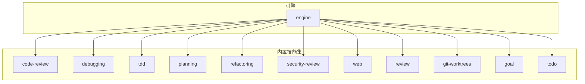
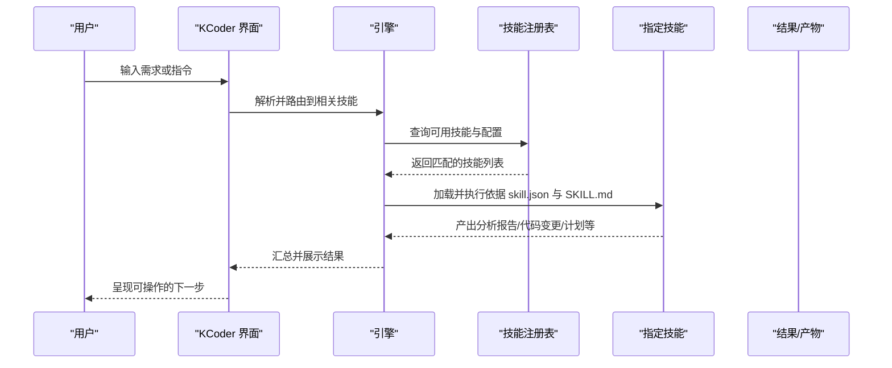
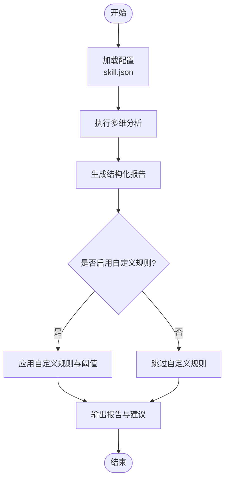
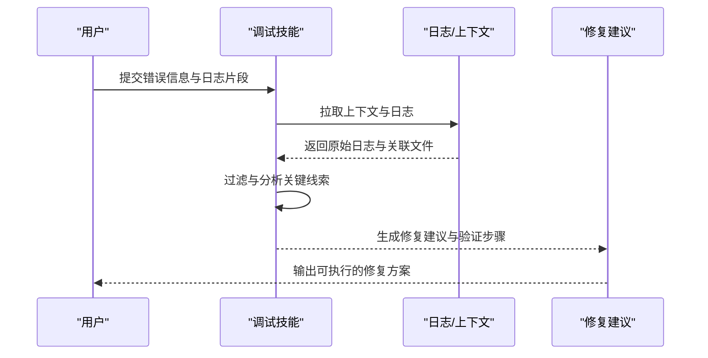
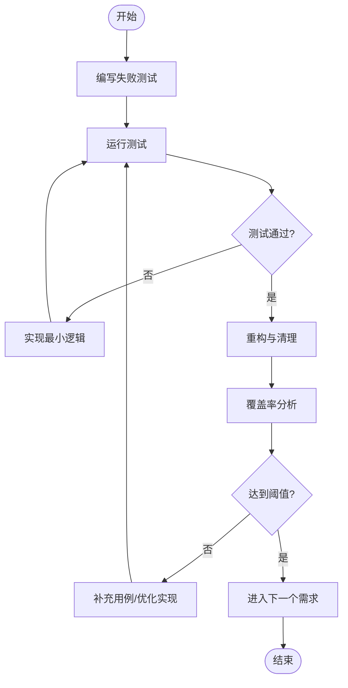
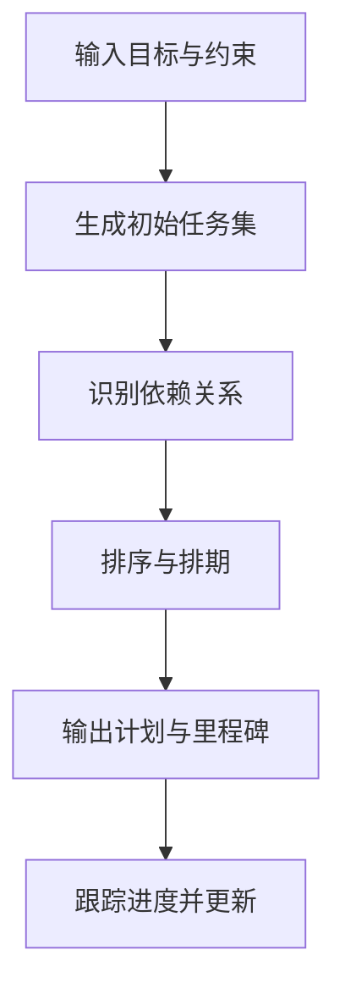
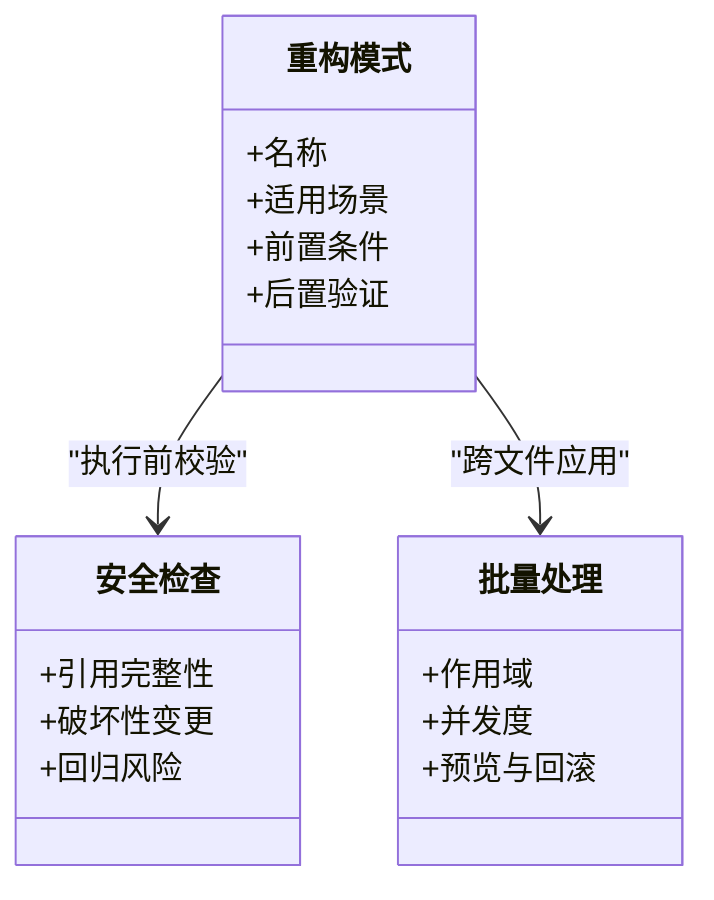
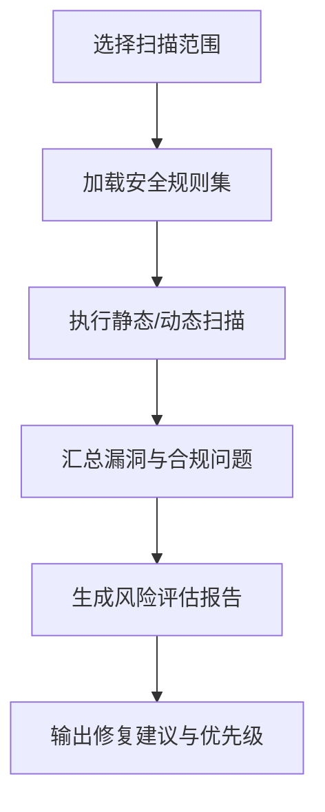
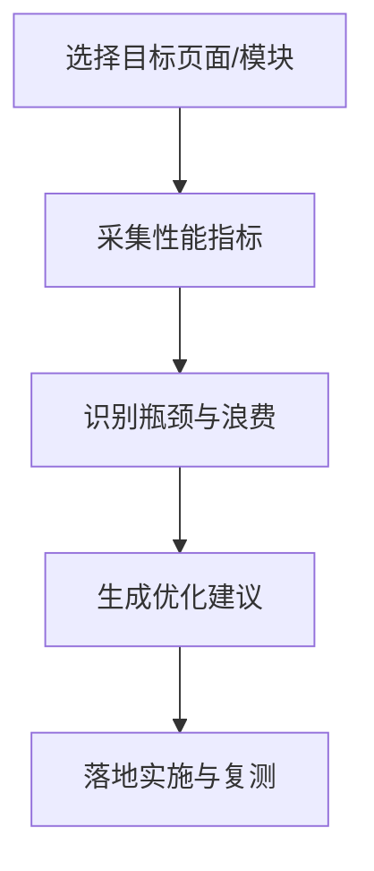
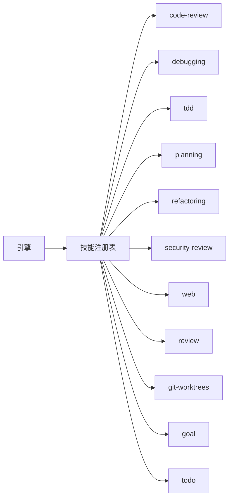

# 内置技能详解

<cite>
**本文引用的文件**   
- [engine/skills/code-review/SKILL.md](file://engine/skills/code-review/SKILL.md)
- [engine/skills/code-review/skill.json](file://engine/skills/code-review/skill.json)
- [engine/skills/debugging/SKILL.md](file://engine/skills/debugging/SKILL.md)
- [engine/skills/debugging/skill.json](file://engine/skills/debugging/skill.json)
- [engine/skills/tdd/SKILL.md](file://engine/skills/tdd/SKILL.md)
- [engine/skills/tdd/skill.json](file://engine/skills/tdd/skill.json)
- [engine/skills/tdd/tdd-cycle.md](file://engine/skills/tdd/tdd-cycle.md)
- [engine/skills/planning/SKILL.md](file://engine/skills/planning/SKILL.md)
- [engine/skills/planning/skill.json](file://engine/skills/planning/skill.json)
- [engine/skills/refactoring/SKILL.md](file://engine/skills/refactoring/SKILL.md)
- [engine/skills/refactoring/skill.json](file://engine/skills/refactoring/skill.json)
- [engine/skills/security-review/SKILL.md](file://engine/skills/security-review/SKILL.md)
- [engine/skills/security-review/skill.json](file://engine/skills/security-review/skill.json)
- [engine/skills/web/SKILL.md](file://engine/skills/web/SKILL.md)
- [engine/skills/web/skill.json](file://engine/skills/web/skill.json)
- [engine/skills/review/SKILL.md](file://engine/skills/review/SKILL.md)
- [engine/skills/review/skill.json](file://engine/skills/review/skill.json)
- [engine/skills/git-worktrees/SKILL.md](file://engine/skills/git-worktrees/SKILL.md)
- [engine/skills/git-worktrees/skill.json](file://engine/skills/git-worktrees/skill.json)
- [engine/skills/goal/SKILL.md](file://engine/skills/goal/SKILL.md)
- [engine/skills/goal/skill.json](file://engine/skills/goal/skill.json)
- [engine/skills/todo/SKILL.md](file://engine/skills/todo/SKILL.md)
- [engine/skills/todo/skill.json](file://engine/skills/todo/skill.json)
</cite>

## 目录
1. [简介](#简介)
2. [项目结构](#项目结构)
3. [核心组件](#核心组件)
4. [架构总览](#架构总览)
5. [详细组件分析](#详细组件分析)
6. [依赖关系分析](#依赖关系分析)
7. [性能与可用性建议](#性能与可用性建议)
8. [故障排查指南](#故障排查指南)
9. [结论](#结论)
10. [附录：配置模板与使用示例](#附录配置模板与使用示例)

## 简介
本文件为 KCoder 的“内置技能”提供系统化、可操作的使用文档。内容覆盖每个内置技能的功能特性、配置选项与使用方法，重点包括：
- 代码审查：分析维度、报告格式与自定义规则配置
- 调试：问题定位能力、日志分析与修复建议生成
- TDD：测试驱动开发流程支持、测试用例生成与覆盖率分析
- 规划：任务分解、依赖管理与进度跟踪
- 重构：重构模式、安全检查与批量处理
- 安全审查：漏洞检测、合规性检查与风险评估
- Web 开发：前端优化、性能分析与最佳实践建议
- 其他辅助技能（如通用评审、Git 工作树、目标管理、待办）

## 项目结构
KCoder 的内置技能位于 engine/skills 目录下，每个技能以独立子目录组织，包含：
- SKILL.md：技能的说明文档（功能、用法、配置项等）
- skill.json：技能的元数据与运行参数（名称、版本、工具/能力绑定、默认配置等）
- 部分技能附带补充文档（例如 tdd/tdd-cycle.md）

[本节未直接分析具体文件，故无“章节来源”]

## 核心组件
- 技能清单与职责
  - code-review：代码质量与安全维度的自动化审查与报告
  - debugging：基于上下文与日志的问题定位与修复建议
  - tdd：TDD 循环支持与测试生成、覆盖率分析
  - planning：任务拆解、依赖建模与进度追踪
  - refactoring：重构模式库、安全性校验与批量变更
  - security-review：安全漏洞扫描、合规性与风险评估
  - web：前端优化、性能分析与最佳实践
  - review：通用评审流程与协作规范
  - git-worktrees：多分支并行开发与隔离工作区
  - goal：目标定义与对齐
  - todo：任务清单与状态管理

- 统一入口与加载
  - 每个技能通过 skill.json 暴露元数据，供引擎注册与发现
  - SKILL.md 作为人类可读的使用手册，指导用户如何调用与配置

**章节来源**
- [engine/skills/code-review/skill.json](file://engine/skills/code-review/skill.json)
- [engine/skills/debugging/skill.json](file://engine/skills/debugging/skill.json)
- [engine/skills/tdd/skill.json](file://engine/skills/tdd/skill.json)
- [engine/skills/planning/skill.json](file://engine/skills/planning/skill.json)
- [engine/skills/refactoring/skill.json](file://engine/skills/refactoring/skill.json)
- [engine/skills/security-review/skill.json](file://engine/skills/security-review/skill.json)
- [engine/skills/web/skill.json](file://engine/skills/web/skill.json)
- [engine/skills/review/skill.json](file://engine/skills/review/skill.json)
- [engine/skills/git-worktrees/skill.json](file://engine/skills/git-worktrees/skill.json)
- [engine/skills/goal/skill.json](file://engine/skills/goal/skill.json)
- [engine/skills/todo/skill.json](file://engine/skills/todo/skill.json)

## 架构总览
下图展示了“用户意图 → 技能选择 → 执行编排 → 结果输出”的整体流程。各技能通过 skill.json 声明式接入，SKILL.md 提供使用说明与配置指引。

[该图为概念性流程图，不直接映射具体源码文件，故无“图表来源”]

## 详细组件分析

### 代码审查技能（code-review）
- 功能特性
  - 多维度分析：风格一致性、复杂度、潜在缺陷、可维护性、安全基线
  - 报告格式：结构化摘要、问题分级、影响范围、修复建议
  - 自定义规则：通过配置启用/禁用规则、调整阈值与严重级别
- 使用方法
  - 在工程中引入该技能后，按 SKILL.md 的步骤触发审查
  - 结合 skill.json 中的配置项进行规则开关与阈值调节
- 典型配置项（参考 skill.json）
  - 规则白名单/黑名单
  - 严重级别阈值
  - 忽略路径与文件类型
  - 报告输出格式与位置

**章节来源**
- [engine/skills/code-review/SKILL.md](file://engine/skills/code-review/SKILL.md)
- [engine/skills/code-review/skill.json](file://engine/skills/code-review/skill.json)

### 调试技能（debugging）
- 功能特性
  - 问题定位：基于错误堆栈、日志片段与上下文差异快速收敛根因
  - 日志分析：聚合关键日志、过滤噪声、关联时间线与调用链
  - 修复建议：给出最小化修复方案与验证步骤
- 使用方法
  - 提供错误信息、日志片段与相关文件路径
  - 根据 SKILL.md 的流程逐步缩小问题范围
- 典型配置项（参考 skill.json）
  - 日志源与采样策略
  - 上下文窗口大小
  - 建议的可执行命令集合

**章节来源**
- [engine/skills/debugging/SKILL.md](file://engine/skills/debugging/SKILL.md)
- [engine/skills/debugging/skill.json](file://engine/skills/debugging/skill.json)

### TDD 技能（tdd）
- 功能特性
  - 测试驱动流程：红-绿-重构循环支持
  - 测试用例生成：基于需求与接口契约自动生成骨架与边界用例
  - 覆盖率分析：统计行/分支覆盖率并提示缺失点
- 使用方法
  - 先编写失败测试，再实现最小满足逻辑，最后重构
  - 使用 tdd-cycle.md 中的循环步骤与检查点
- 典型配置项（参考 skill.json）
  - 测试框架与运行器
  - 覆盖率工具与阈值
  - 生成模板与命名约定

**章节来源**
- [engine/skills/tdd/SKILL.md](file://engine/skills/tdd/SKILL.md)
- [engine/skills/tdd/skill.json](file://engine/skills/tdd/skill.json)
- [engine/skills/tdd/tdd-cycle.md](file://engine/skills/tdd/tdd-cycle.md)

### 规划技能（planning）
- 功能特性
  - 任务分解：将大目标拆分为可执行的小任务
  - 依赖管理：识别任务间依赖关系与阻塞点
  - 进度跟踪：记录完成状态与里程碑
- 使用方法
  - 输入目标与约束，生成计划草案
  - 迭代细化任务粒度与依赖图
- 典型配置项（参考 skill.json）
  - 任务粒度与最大深度
  - 依赖可视化输出格式
  - 进度上报频率

**章节来源**
- [engine/skills/planning/SKILL.md](file://engine/skills/planning/SKILL.md)
- [engine/skills/planning/skill.json](file://engine/skills/planning/skill.json)

### 重构技能（refactoring）
- 功能特性
  - 重构模式库：提取方法、重命名、内联、拆分类、迁移 API 等
  - 安全检查：引用完整性、破坏性变更检测、回归风险预警
  - 批量处理：跨文件批量重构与预览差异
- 使用方法
  - 选择重构模式，指定作用域与保留语义
  - 预览变更并确认执行
- 典型配置项（参考 skill.json）
  - 允许的重构模式白名单
  - 安全校验强度
  - 批量上限与并发度

**章节来源**
- [engine/skills/refactoring/SKILL.md](file://engine/skills/refactoring/SKILL.md)
- [engine/skills/refactoring/skill.json](file://engine/skills/refactoring/skill.json)

### 安全审查技能（security-review）
- 功能特性
  - 漏洞检测：常见注入、越权、敏感信息泄露等
  - 合规性检查：遵循团队安全基线与外部标准
  - 风险评估：按严重级别与影响面排序
- 使用方法
  - 指定扫描范围与策略
  - 审阅报告并按优先级修复
- 典型配置项（参考 skill.json）
  - 规则集与严重级别阈值
  - 忽略路径与误报标记
  - 报告导出格式

**章节来源**
- [engine/skills/security-review/SKILL.md](file://engine/skills/security-review/SKILL.md)
- [engine/skills/security-review/skill.json](file://engine/skills/security-review/skill.json)

### Web 开发技能（web）
- 功能特性
  - 前端优化：资源压缩、懒加载、缓存策略
  - 性能分析：首屏时间、交互延迟、内存占用
  - 最佳实践：可访问性、SEO、兼容性
- 使用方法
  - 针对页面或模块进行审计与优化建议
  - 结合构建配置与运行时指标持续改进
- 典型配置项（参考 skill.json）
  - 构建工具与插件
  - 性能指标阈值
  - 浏览器兼容矩阵

**章节来源**
- [engine/skills/web/SKILL.md](file://engine/skills/web/SKILL.md)
- [engine/skills/web/skill.json](file://engine/skills/web/skill.json)

### 其他辅助技能概览
- review（通用评审）
  - 用途：标准化评审流程、评论模板与验收清单
  - 配置要点：评审阶段、参与角色、输出格式
- git-worktrees（Git 工作树）
  - 用途：并行开发、隔离实验分支、快速切换上下文
  - 配置要点：工作树命名规范、清理策略
- goal（目标管理）
  - 用途：目标对齐、关键结果定义与追踪
  - 配置要点：周期、度量指标、复盘节奏
- todo（待办）
  - 用途：任务清单、优先级与状态流转
  - 配置要点：标签体系、提醒策略

**章节来源**
- [engine/skills/review/SKILL.md](file://engine/skills/review/SKILL.md)
- [engine/skills/review/skill.json](file://engine/skills/review/skill.json)
- [engine/skills/git-worktrees/SKILL.md](file://engine/skills/git-worktrees/SKILL.md)
- [engine/skills/git-worktrees/skill.json](file://engine/skills/git-worktrees/skill.json)
- [engine/skills/goal/SKILL.md](file://engine/skills/goal/SKILL.md)
- [engine/skills/goal/skill.json](file://engine/skills/goal/skill.json)
- [engine/skills/todo/SKILL.md](file://engine/skills/todo/SKILL.md)
- [engine/skills/todo/skill.json](file://engine/skills/todo/skill.json)

## 依赖关系分析
- 技能与引擎
  - 所有内置技能通过 skill.json 向引擎注册，提供统一的发现与加载机制
  - SKILL.md 作为人类可读的“契约”，描述行为与配置
- 内部耦合
  - 各技能相对独立，避免强耦合；必要时通过共享的配置键与输出约定协同
- 外部集成
  - 测试与覆盖率工具、构建系统、安全扫描器等通过 skill.json 的参数注入

[该图为概念性依赖图，不直接映射具体源码文件，故无“图表来源”]

**章节来源**
- [engine/skills/code-review/skill.json](file://engine/skills/code-review/skill.json)
- [engine/skills/debugging/skill.json](file://engine/skills/debugging/skill.json)
- [engine/skills/tdd/skill.json](file://engine/skills/tdd/skill.json)
- [engine/skills/planning/skill.json](file://engine/skills/planning/skill.json)
- [engine/skills/refactoring/skill.json](file://engine/skills/refactoring/skill.json)
- [engine/skills/security-review/skill.json](file://engine/skills/security-review/skill.json)
- [engine/skills/web/skill.json](file://engine/skills/web/skill.json)
- [engine/skills/review/skill.json](file://engine/skills/review/skill.json)
- [engine/skills/git-worktrees/skill.json](file://engine/skills/git-worktrees/skill.json)
- [engine/skills/goal/skill.json](file://engine/skills/goal/skill.json)
- [engine/skills/todo/skill.json](file://engine/skills/todo/skill.json)

## 性能与可用性建议
- 合理设置阈值与忽略规则，减少误报与噪音
- 对大规模仓库采用增量扫描与分片执行
- 为长耗时任务开启预览与分批执行，降低一次性变更风险
- 定期回顾与精简规则集，保持高信噪比

[本节提供通用建议，不直接分析具体文件，故无“章节来源”]

## 故障排查指南
- 常见问题
  - 技能未生效：检查 skill.json 是否被正确加载与注册
  - 配置无效：核对字段名、取值范围与依赖工具是否存在
  - 报告为空：确认扫描范围与忽略规则是否过于严格
- 定位步骤
  - 查看对应技能的 SKILL.md 中的“常见问题”与“配置项”
  - 缩小范围至单个文件或模块，逐步验证
  - 启用更详细的日志与中间产物以便回溯

**章节来源**
- [engine/skills/code-review/SKILL.md](file://engine/skills/code-review/SKILL.md)
- [engine/skills/debugging/SKILL.md](file://engine/skills/debugging/SKILL.md)
- [engine/skills/tdd/SKILL.md](file://engine/skills/tdd/SKILL.md)
- [engine/skills/planning/SKILL.md](file://engine/skills/planning/SKILL.md)
- [engine/skills/refactoring/SKILL.md](file://engine/skills/refactoring/SKILL.md)
- [engine/skills/security-review/SKILL.md](file://engine/skills/security-review/SKILL.md)
- [engine/skills/web/SKILL.md](file://engine/skills/web/SKILL.md)

## 结论
KCoder 的内置技能以“声明式配置 + 可读文档”的方式提供一致的能力扩展点。通过 skill.json 与 SKILL.md 的组合，既能保证机器可执行，又能让使用者快速上手与定制。建议团队结合自身工程实践，选择合适的技能组合与阈值，形成稳定的质量与效率闭环。

[本节为总结性内容，不直接分析具体文件，故无“章节来源”]

## 附录：配置模板与使用示例
以下为各技能的“配置模板要点”与“使用示例步骤”。请根据各自 SKILL.md 与 skill.json 的实际字段进行替换与填充。

- 代码审查（code-review）
  - 配置模板要点
    - 规则白名单/黑名单
    - 严重级别阈值
    - 忽略路径与文件类型
    - 报告输出格式与位置
  - 使用示例步骤
    - 在项目根目录启用该技能
    - 指定扫描范围与阈值
    - 生成报告并审阅建议

- 调试（debugging）
  - 配置模板要点
    - 日志源与采样策略
    - 上下文窗口大小
    - 建议的可执行命令集合
  - 使用示例步骤
    - 提交错误信息与日志片段
    - 获取根因分析与修复建议
    - 验证修复并关闭问题

- TDD（tdd）
  - 配置模板要点
    - 测试框架与运行器
    - 覆盖率工具与阈值
    - 生成模板与命名约定
  - 使用示例步骤
    - 编写失败测试
    - 实现最小逻辑并通过测试
    - 重构并提升覆盖率

- 规划（planning）
  - 配置模板要点
    - 任务粒度与最大深度
    - 依赖可视化输出格式
    - 进度上报频率
  - 使用示例步骤
    - 输入目标与约束
    - 生成计划与里程碑
    - 跟踪并更新进度

- 重构（refactoring）
  - 配置模板要点
    - 允许的重构模式白名单
    - 安全校验强度
    - 批量上限与并发度
  - 使用示例步骤
    - 选择重构模式与作用域
    - 预览变更并确认执行
    - 运行回归验证

- 安全审查（security-review）
  - 配置模板要点
    - 规则集与严重级别阈值
    - 忽略路径与误报标记
    - 报告导出格式
  - 使用示例步骤
    - 指定扫描范围与策略
    - 审阅漏洞与合规问题
    - 按优先级修复与复测

- Web 开发（web）
  - 配置模板要点
    - 构建工具与插件
    - 性能指标阈值
    - 浏览器兼容矩阵
  - 使用示例步骤
    - 选择目标页面/模块
    - 采集性能指标与瓶颈
    - 落地优化并复测

- 通用评审（review）、Git 工作树（git-worktrees）、目标（goal）、待办（todo）
  - 配置模板要点
    - 流程阶段、参与角色、输出格式
    - 工作树命名规范、清理策略
    - 周期、度量指标、复盘节奏
    - 标签体系、提醒策略
  - 使用示例步骤
    - 按各自 SKILL.md 的步骤创建与执行

**章节来源**
- [engine/skills/code-review/SKILL.md](file://engine/skills/code-review/SKILL.md)
- [engine/skills/code-review/skill.json](file://engine/skills/code-review/skill.json)
- [engine/skills/debugging/SKILL.md](file://engine/skills/debugging/SKILL.md)
- [engine/skills/debugging/skill.json](file://engine/skills/debugging/skill.json)
- [engine/skills/tdd/SKILL.md](file://engine/skills/tdd/SKILL.md)
- [engine/skills/tdd/skill.json](file://engine/skills/tdd/skill.json)
- [engine/skills/tdd/tdd-cycle.md](file://engine/skills/tdd/tdd-cycle.md)
- [engine/skills/planning/SKILL.md](file://engine/skills/planning/SKILL.md)
- [engine/skills/planning/skill.json](file://engine/skills/planning/skill.json)
- [engine/skills/refactoring/SKILL.md](file://engine/skills/refactoring/SKILL.md)
- [engine/skills/refactoring/skill.json](file://engine/skills/refactoring/skill.json)
- [engine/skills/security-review/SKILL.md](file://engine/skills/security-review/SKILL.md)
- [engine/skills/security-review/skill.json](file://engine/skills/security-review/skill.json)
- [engine/skills/web/SKILL.md](file://engine/skills/web/SKILL.md)
- [engine/skills/web/skill.json](file://engine/skills/web/skill.json)
- [engine/skills/review/SKILL.md](file://engine/skills/review/SKILL.md)
- [engine/skills/review/skill.json](file://engine/skills/review/skill.json)
- [engine/skills/git-worktrees/SKILL.md](file://engine/skills/git-worktrees/SKILL.md)
- [engine/skills/git-worktrees/skill.json](file://engine/skills/git-worktrees/skill.json)
- [engine/skills/goal/SKILL.md](file://engine/skills/goal/SKILL.md)
- [engine/skills/goal/skill.json](file://engine/skills/goal/skill.json)
- [engine/skills/todo/SKILL.md](file://engine/skills/todo/SKILL.md)
- [engine/skills/todo/skill.json](file://engine/skills/todo/skill.json)