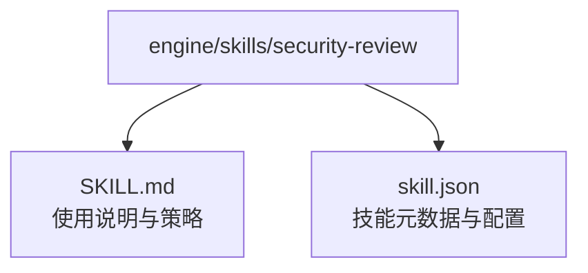
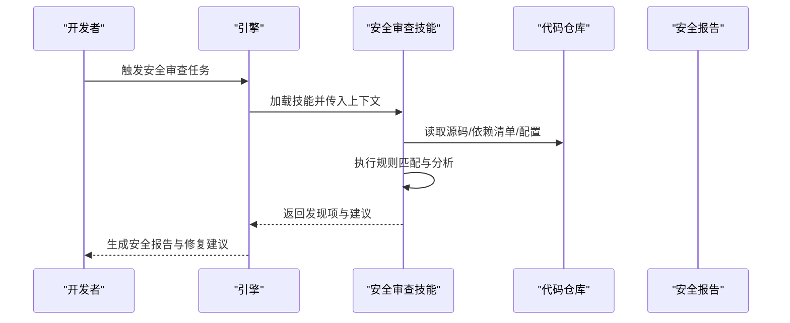
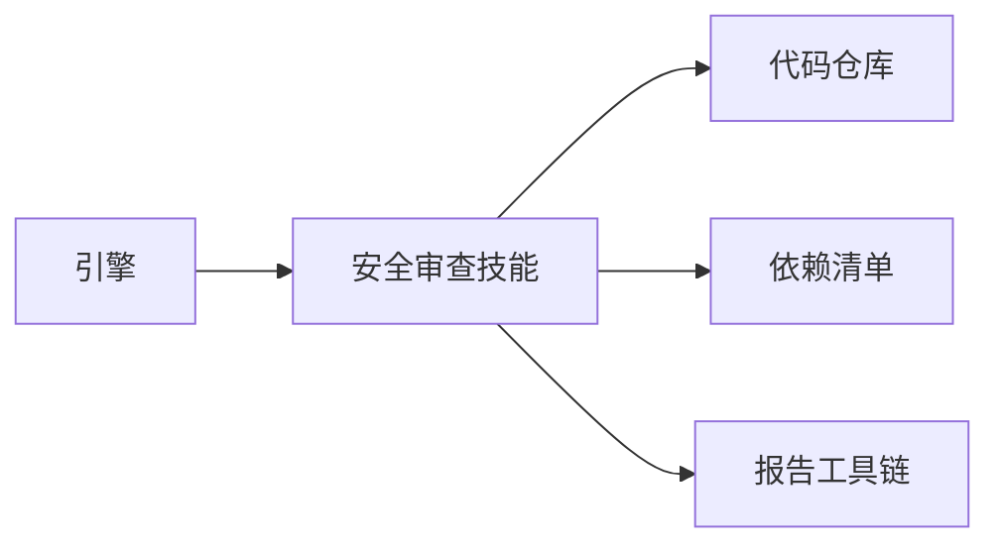

# 安全审查技能

<cite>
**本文引用的文件**   
- [SKILL.md](file://engine/skills/security-review/SKILL.md)
- [skill.json](file://engine/skills/security-review/skill.json)
</cite>

## 目录
1. [简介](#简介)
2. [项目结构](#项目结构)
3. [核心组件](#核心组件)
4. [架构总览](#架构总览)
5. [详细组件分析](#详细组件分析)
6. [依赖分析](#依赖分析)
7. [性能考虑](#性能考虑)
8. [故障排查指南](#故障排查指南)
9. [结论](#结论)
10. [附录](#附录)

## 简介
本文件为“安全审查技能”的使用文档，聚焦于以下能力：
- 安全漏洞检测：覆盖常见攻击面与风险点
- 合规性检查：对齐主流标准与行业规范
- 风险评估：对发现项进行分级、影响评估与修复建议
- 使用示例：如何扫描代码库、生成报告与修复建议
- 规则自定义：扩展或调整安全规则的策略
- 威胁建模集成：将安全审查融入威胁建模流程
- SDL 集成：与安全开发生命周期（SDL）和自动化流水线对接
- OWASP Top 10 防护指南与行业标准合规要求
- 事件响应与漏洞修复最佳实践

## 项目结构
安全审查技能位于引擎的 skills 目录下，采用“技能包”组织方式，每个技能包含说明文档与元数据定义。

图示来源
- [SKILL.md](file://engine/skills/security-review/SKILL.md)
- [skill.json](file://engine/skills/security-review/skill.json)

章节来源
- [SKILL.md](file://engine/skills/security-review/SKILL.md)
- [skill.json](file://engine/skills/security-review/skill.json)

## 核心组件
- 技能说明文档（SKILL.md）：描述技能目标、适用范围、使用方法、输出格式、注意事项等
- 技能元数据（skill.json）：定义技能的标识、版本、输入/输出契约、参数与约束等

章节来源
- [SKILL.md](file://engine/skills/security-review/SKILL.md)
- [skill.json](file://engine/skills/security-review/skill.json)

## 架构总览
安全审查技能作为可插拔的“技能包”，在运行时由引擎加载并执行。典型交互如下：

图示来源
- [SKILL.md](file://engine/skills/security-review/SKILL.md)
- [skill.json](file://engine/skills/security-review/skill.json)

## 详细组件分析

### 支持的安全问题类型
- SQL 注入
- 跨站脚本（XSS）
- 敏感信息泄露（密钥、令牌、证书等）
- 依赖包安全问题（已知漏洞、不安全的版本、许可证风险）

章节来源
- [SKILL.md](file://engine/skills/security-review/SKILL.md)

### 使用示例
- 扫描代码库
  - 指定仓库路径或工作区
  - 选择要扫描的文件范围与忽略规则
  - 启用依赖安全检查（如 package.json、requirements.txt、pom.xml 等）
- 生成安全报告
  - 输出结构化结果（发现项、严重等级、位置、证据、修复建议）
  - 可选择导出为 JSON/Markdown/PDF 等格式
- 修复建议
  - 针对每条发现项提供最小改动建议与参考链接
  - 标注需要人工复核的高风险项

章节来源
- [SKILL.md](file://engine/skills/security-review/SKILL.md)

### 安全规则自定义
- 新增规则
  - 在技能配置中声明新规则条目（名称、匹配模式、严重等级、修复建议）
  - 通过正则/AST/语义规则等方式实现匹配逻辑
- 调整规则
  - 修改阈值、误报过滤、作用域范围
  - 基于团队规范定制白名单/黑名单
- 验证与回归
  - 使用测试用例验证规则准确性
  - 建立基线，避免引入新的误报

章节来源
- [skill.json](file://engine/skills/security-review/skill.json)
- [SKILL.md](file://engine/skills/security-review/SKILL.md)

### 威胁建模集成
- 资产识别：从代码与依赖中提取关键资产（接口、数据流、外部调用）
- 威胁分类：结合 STRIDE 等方法对潜在威胁进行分类
- 控制措施映射：将现有安全措施与威胁一一对应，识别缺口
- 持续更新：随代码演进与依赖变更动态刷新威胁模型

章节来源
- [SKILL.md](file://engine/skills/security-review/SKILL.md)

### 与 SDL 集成与自动化
- 开发阶段
  - IDE 插件或本地钩子触发轻量级扫描
- 提交与合并
  - Git Hook 或 PR 检查阻止高风险变更进入主干
- 构建与发布
  - CI 流水线执行完整扫描，产出报告与工件签名校验
- 运行期监控
  - 结合运行时遥测与告警，闭环反馈至规则优化

章节来源
- [SKILL.md](file://engine/skills/security-review/SKILL.md)

### OWASP Top 10 防护指南
- 注入类风险（SQL/命令/模板等）
- 失效的身份认证与会话管理
- 敏感数据暴露
- 未受保护的第三方组件
- 访问控制缺陷
- 安全配置错误
- 跨站脚本（XSS）
- 反序列化漏洞
- 日志与审计不足
- 其他新兴风险（如 AI/LLM 相关）

章节来源
- [SKILL.md](file://engine/skills/security-review/SKILL.md)

### 行业标准与合规要求
- ISO/IEC 27001：信息安全管理体系
- NIST CSF：网络安全框架
- SOC 2：服务组织控制报告
- GDPR/PIPL：个人信息保护
- 金融/医疗等行业特定规范

章节来源
- [SKILL.md](file://engine/skills/security-review/SKILL.md)

### 安全事件响应与漏洞修复最佳实践
- 快速定位：依据报告中的文件、行号与证据快速复现
- 影响评估：结合业务场景评估风险等级与影响范围
- 修复策略：优先修补高危项，制定临时缓解措施
- 验证回归：修复后重新扫描，确保无回归与新问题
- 复盘改进：沉淀经验到规则库与培训材料

章节来源
- [SKILL.md](file://engine/skills/security-review/SKILL.md)

## 依赖分析
- 内部依赖
  - 引擎运行时：负责技能加载、上下文注入与结果聚合
  - 其他技能：可与代码审查、重构、计划等技能协作
- 外部依赖
  - 代码仓库：提供待分析的源码与配置文件
  - 依赖清单：用于依赖安全检查
  - 报告工具链：用于格式化与归档

图示来源
- [SKILL.md](file://engine/skills/security-review/SKILL.md)
- [skill.json](file://engine/skills/security-review/skill.json)

章节来源
- [skill.json](file://engine/skills/security-review/skill.json)

## 性能考虑
- 增量扫描：仅扫描变更文件与受影响模块
- 并行化：按目录或文件并行执行规则匹配
- 缓存命中：复用上次扫描结果与规则索引
- 资源限制：设置超时、内存上限与并发度
- 规则优化：减少高开销的正则与深度遍历

[本节为通用指导，无需引用具体文件]

## 故障排查指南
- 常见问题
  - 无法加载技能：检查技能路径与元数据完整性
  - 扫描结果为空：确认扫描范围与忽略规则
  - 误报过多：调整阈值与白名单
  - 依赖检查失败：核对依赖清单格式与网络连通性
- 诊断步骤
  - 查看引擎日志与技能输出
  - 缩小范围进行最小复现
  - 对比基线与历史结果定位差异

章节来源
- [SKILL.md](file://engine/skills/security-review/SKILL.md)

## 结论
安全审查技能以“可插拔”的方式嵌入工程体系，贯穿开发、构建、发布与运行各阶段。通过明确的规则定义、标准化的报告输出与完善的集成方案，帮助团队持续提升代码质量与安全性。

[本节为总结性内容，无需引用具体文件]

## 附录
- 术语表
  - 规则：用于识别安全风险的模式或逻辑
  - 发现项：一次扫描中发现的具体安全问题
  - 严重等级：根据影响与可能性划分的风险级别
  - 修复建议：针对发现项的最小可行修复方案
- 参考链接
  - OWASP Top 10
  - NIST CSF
  - ISO/IEC 27001
  - SOC 2
  - GDPR/PIPL

[本节为补充信息，无需引用具体文件]